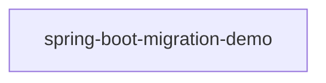

# Evidence Bundle — ISSUE-001

_Collected 2026-09-10T11:45:32.487Z by the Root Cause Analyst evidence collector. Facts only — no diagnosis._

**Issue:** Unbounded repository findAll() reads whole collections into memory across multiple services
**Type / Severity:** Vulnerability / High
**Reported services:** sheduler-service, report-service
**Source file:** `docs/agent_output/00-issues/issue-register.xlsx`

## 1. Input Sources

| Input | Status |
|---|---|
| Issue report | `docs/agent_output/00-issues/issue-register.xlsx` |
| `docs/agent_output/01-architecture/architecture.md` | loaded |
| `docs/agent_output/01-architecture/function-reference.md` | loaded |
| `.github/.pipeline-context/artifacts.json` | scanned 2026-09-10T11:00:06.470Z |
| Neo4j graph | live (depth 4) |

_Resolution note: 0 interface → implementation dispatch edge(s) were bridged into the call graph, because Spring injects the implementation behind the interface. Neo4j's raw `CALLS` edges stop at the interface, so paths below may be one hop longer than the graph shows._

## 2. Focus Points (issue symbols resolved to code)

### `EmployeeService.getAllEmployees()`

- **Module:** `spring-boot-migration-demo`
- **Signature:** `List<EmployeeResponse> getAllEmployees()`
- **Location:** `src/main/java/com/example/migrationdemo/service/EmployeeService.java` (lines 46-52)
- **Annotations:** @Transactional
- **Direct callers:** `EmployeeController.getAllEmployees()`
- **Direct callees:** _none resolved_

```java
@Transactional(readOnly = true)
    public List<EmployeeResponse> getAllEmployees() {
        return employeeRepository.findAll()
                .stream()
                .map(employeeMapper::toResponse)
                .collect(Collectors.toList());
    }
```

**Injected collaborators of `EmployeeService`** — what this method could delegate to:

| Field | Resolves to | Called by focus method | Method of the same name available |
|---|---|---|---|
| `EmployeeRepository employeeRepository` | `EmployeeRepository` (interface) | yes — `findAll()` _(inherited from a framework base type — no method node)_ | _none_ |
| `EmployeeMapper employeeMapper` | `EmployeeMapper` (class) | **no** | _none_ |

**Reaching paths (caller → … → focus):**

- EmployeeController.getAllEmployees() → EmployeeService.getAllEmployees()

### `EmployeeController.getAllEmployees()`

- **Module:** `spring-boot-migration-demo`
- **Signature:** `ResponseEntity<List<EmployeeResponse>> getAllEmployees()`
- **Location:** `src/main/java/com/example/migrationdemo/controller/EmployeeController.java` (lines 31-35)
- **REST endpoint:** `GET /api/v1/employees`
- **Annotations:** @GetMapping
- **Direct callers:** _none resolved_
- **Direct callees:** `EmployeeService.getAllEmployees()`

```java
@GetMapping
    public ResponseEntity<List<EmployeeResponse>> getAllEmployees() {
        List<EmployeeResponse> employees = employeeService.getAllEmployees();
        return ResponseEntity.ok(employees);
    }
```

**Injected collaborators of `EmployeeController`** — what this method could delegate to:

| Field | Resolves to | Called by focus method | Method of the same name available |
|---|---|---|---|
| `EmployeeService employeeService` | `EmployeeService` (class) | yes — `EmployeeService.getAllEmployees()` | `EmployeeService.getAllEmployees()` |

**Outgoing paths (focus → … → callee):**

- EmployeeController.getAllEmployees() → EmployeeService.getAllEmployees()

### `EmployeeReportServiceImpl.getEmployees` — UNRESOLVED

Could not match this symbol in `artifacts.json`. Re-run the Code Cartographer scan or correct `affected_symbols` in the issue file.

### `WomenDaySchedulerImpl.printWomenDayMessage` — UNRESOLVED

Could not match this symbol in `artifacts.json`. Re-run the Code Cartographer scan or correct `affected_symbols` in the issue file.

### `EmployeeReportController.exportToExcel` — UNRESOLVED

Could not match this symbol in `artifacts.json`. Re-run the Code Cartographer scan or correct `affected_symbols` in the issue file.

## 3. Affected Area

- **Modules touched (Java call graph):** `spring-boot-migration-demo`
- **REST endpoints on a reaching path:** `GET /api/v1/employees`
- **Types on a reaching path:** `EmployeeController`, `EmployeeService`
- **Scheduled jobs on a reaching path:** _none_

## 4. Architecture Context

**Affected modules (from the module table):**

| Module | Packaging | Key Spring dependencies |
|---|---|---|
| `spring-boot-migration-demo` | jar | spring-boot-starter-web, spring-boot-starter-data-jpa, spring-boot-starter-validation, spring-boot-starter-security, spring-boot-starter-actuator, spring-boot-starter-test |

**Related REST surface rows:**

| Method | Path | Handler | Module |
|---|---|---|---|
| `POST` | `/api/v1/employees` | EmployeeController.createEmployee() | `spring-boot-migration-demo` |
| `GET` | `/api/v1/employees` | EmployeeController.getAllEmployees() | `spring-boot-migration-demo` |

**Service topology:**



**Documented observations:**

- Each service (`department-service`, `employee-service`, `report-service`, `sheduler-service`) follows the same layered convention: `controller` → `service` → `repository` → `model`/`entity`, backed by MongoDB repositories.
- `configuaration-server` and `discovery-service` are infrastructure services (Spring Cloud Config + Eureka) that every business service depends on at startup via `bootstrap.properties`.
- No Feign clients were detected — cross-service calls, if any, likely go through `RestTemplate`/`WebClient` rather than declarative Feign interfaces. Worth confirming if service-to-service coupling should show up as graph edges.
- The generated Neo4j graph can be queried directly (e.g. `MATCH (m:Module)-[:CONTAINS]->(t:Type) RETURN m.name, count(t)`) for deeper, ad-hoc architecture questions beyond this static document.

## 5. Graph Findings

Connected to `neo4j+s://7d610372.databases.neo4j.io`, database traversal depth 4.

**`com.example.migrationdemo.service.EmployeeService#getAllEmployees()`**

- Owning type: `EmployeeService` in module `spring-boot-migration-demo`
- Endpoints exposed by that type: _none_
- Upstream caller paths in graph: 1
- Downstream callee paths in graph: 0
- Modules reaching it: `spring-boot-migration-demo`
- Types depending on the owning type (`USES` fan-in): `EmployeeController` (spring-boot-migration-demo)

**`com.example.migrationdemo.controller.EmployeeController#getAllEmployees()`**

- Owning type: `EmployeeController` in module `spring-boot-migration-demo`
- Endpoints exposed by that type: `POST /api/v1/employees`, `GET /api/v1/employees`, `GET /api/v1/employees/{id}`, `PUT /api/v1/employees/{id}`, `DELETE /api/v1/employees/{id}`, `GET /api/v1/employees/search`, `GET /api/v1/employees/high-earners`
- Upstream caller paths in graph: 0
- Downstream callee paths in graph: 1
- Modules reaching it: _none_
- Types depending on the owning type (`USES` fan-in): _none_

**Maven dependencies of the affected modules:**

- `spring-boot-migration-demo`: 12 declared dependencies

**Graph size:** Method 127, Type 17, ContextNote 13, MavenDependency 12, Package 11, Endpoint 7, ExternalType 5, Module 1

**Relationships:** HAS_METHOD 127, CONTAINS 45, ABOUT 34, CALLS 17, DEPENDS_ON 12, EXPOSES 7, USES 4, EXTENDS 4, IMPLEMENTS 2

## 6. Function Reference Excerpts

<details><summary><code>EmployeeController.getAllEmployees()</code></summary>

#### `EmployeeController.getAllEmployees()`
- **Signature**: `ResponseEntity<List<EmployeeResponse>> getAllEmployees()`
- **Location**: `src/main/java/com/example/migrationdemo/controller/EmployeeController.java` (lines 31-35)
- **Annotations**: @GetMapping
- **REST endpoint**: `GET /api/v1/employees`
- **Calls**: `EmployeeService.getAllEmployees()`
- **Called by**: _none resolved (likely an entry point or only called externally)_

```java
@GetMapping
    public ResponseEntity<List<EmployeeResponse>> getAllEmployees() {
        List<EmployeeResponse> employees = employeeService.getAllEmployees();
        return ResponseEntity.ok(employees);
    }
```

</details>

<details><summary><code>EmployeeService.getAllEmployees()</code></summary>

#### `EmployeeService.getAllEmployees()`
- **Signature**: `List<EmployeeResponse> getAllEmployees()`
- **Location**: `src/main/java/com/example/migrationdemo/service/EmployeeService.java` (lines 46-52)
- **Annotations**: @Transactional(readOnly = "true")
- **Calls**: _none resolved_
- **Called by**: `EmployeeController.getAllEmployees()`

```java
@Transactional(readOnly = true)
    public List<EmployeeResponse> getAllEmployees() {
        return employeeRepository.findAll()
                .stream()
                .map(employeeMapper::toResponse)
                .collect(Collectors.toList());
    }
```

</details>

## 7. Reported Symptom (verbatim from the issue file)

# ISSUE-001 — Unbounded repository findAll() reads whole collections into memory across multiple services

## Summary

Multiple backend services load an entire MongoDB collection into the JVM heap with a bare findAll() call - no pagination, no query filter, no field projection and no result cap. The volume of data returned is decided entirely by how large the collection has grown, not by what the caller actually needs. Two of these call sites sit directly behind public REST endpoints, so a single request can force a service to materialise every employee document at once.

## Data Flow (source → sink)

Path 1 - scheduler read
1. Source: GET /api/v1/employee reaches EmployeeSchedulerController.getAllEmployees (EmployeeSchedulerController.java:19).
2. Propagation: EmployeeSchedulerServiceImpl.getAllEmployees (EmployeeSchedulerServiceImpl.java:17).
3. Sink: EmployeeSchedulerRepository.findAll (EmployeeSchedulerServiceImpl.java:18). The whole employee collection is materialised and returned to the caller as Employee entities.

Path 2 - scheduled job
1. Source: the cron trigger 0 0 0 8 3 * fires WomenDaySchedulerImpl.printWomenDayMessage (WomenDaySchedulerImpl.java:20).
2. Sink: the same getAllEmployees and findAll pair. The GenderType.FEMALE filter is applied in Java afterwards (WomenDaySchedulerImpl.java:21-22) and is never pushed down to MongoDB.

Path 3 - payroll export
1. Source: GET /api/v1/export reaches EmployeeReportController.exportToExcel (EmployeeReportController.java:26).
2. Propagation: EmployeeReportServiceImpl.getEmployees (EmployeeReportServiceImpl.java:38) calls EmployeeReportRepository.findAll (line 40), then fetches the full department list from department-service over WebClient (lines 44-48).
3. Sink: the two lists are joined by a nested for loop (lines 53-68), and the result is written into an XSSFWorkbook buffered in a ByteArrayOutputStream (generateExcelFile, line 74) before any byte reaches the response (EmployeeReportController.java:35).

## Observed Behavior

Call site 1 - sheduler-service

- GET /api/v1/employee returns every employee document in the collection, serialised in full, with no page size, no limit parameter and no filtering. The entity is returned directly, so every persisted field is exposed to the caller.
- The scheduled job WomenDaySchedulerImpl.printWomenDayMessage() calls the same method and then filters for GenderType.FEMALE in Java, after the entire collection has already been transferred and mapped. The filter is never pushed down to the database.

Call site 2 - report-service

- GET /api/v1/export loads every employee via findAll(), then performs an outbound HTTP call to department-service for the department list, and then joins the two lists with a nested for loop (employees x departments) purely in memory.
- The complete joined result and the generated XLSX workbook are both held in the heap at the same time, and the workbook is buffered into a ByteArrayOutputStream before a single byte is written to the response.

## Expected Behavior

- Read operations that back a REST endpoint should return a bounded result set - paginated (Pageable/Page), or explicitly limited, with the page size controlled by the API contract rather than by collection size.
- Filtering criteria that are known ahead of time (for example gender for the Women's Day job) should be expressed as a derived query or @Query so the database returns only matching documents.
- Bulk exports should stream or process in chunks so that heap usage stays flat and independent of how many records exist.
- Responses should be projected into DTOs rather than returning persistence entities as-is.

## Steps to Reproduce

1. Start configuaration-server, discovery-service, department-service, sheduler-service and report-service. (Ports are supplied by the config server; sheduler-service defaults to 8503 and report-service to 8502.)
2. Seed the employee collection with a realistic production volume (for example 500,000 documents).
3. Call the scheduler endpoint and observe response size, latency and heap usage:
   curl -s -o /dev/null -w "%{size_download} bytes in %{time_total}s\n" \
        http://localhost:8503/api/v1/employee
4. Call the export endpoint and watch the JVM heap while it runs:
   curl -s -o employees.xlsx http://localhost:8502/api/v1/export
5. Repeat step 3 or 4 concurrently from a handful of clients. Response times degrade sharply, GC activity rises, and the service becomes unresponsive or terminates with OutOfMemoryError once the collection is large enough.

Reproducibility: Deterministic. Severity scales with collection size - the endpoints appear healthy on a small development dataset and degrade as data grows.

## Impact

- Availability: Heap consumption is proportional to collection size and to the number of concurrent callers. A handful of simultaneous requests to GET /api/v1/employee or GET /api/v1/export is enough to exhaust the heap and take down the instance - an unauthenticated caller can trigger this repeatedly.
- Performance: Full collection scans on every call add sustained load to the shared MongoDB instance, degrading unrelated services that use the same database. The in-memory nested-loop join in report-service compounds the cost as both datasets grow.
- Data exposure: GET /api/v1/employee serialises the Employee entity directly, so the whole workforce dataset - including fields that no client asked for, such as address and phone number - is returned in one unpaginated response.
- Scalability: The pattern is repeated across services, so the same failure mode must be fixed in more than one place and is likely to be copied into new services.

## Detection Notes

- A search for `findAll(` across src/main/java returns exactly the two call sites listed above.
- Neither call site passes a `Pageable`, `Sort`, `Limit` or query argument.
- No endpoint on the REST surface accepts a `page` or `size` parameter, so there is no way for a caller to bound the result set even voluntarily.
