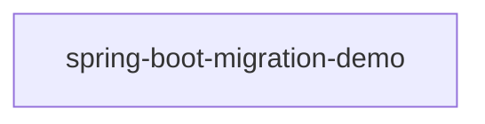

# Evidence Bundle — ISSUE-002

_Collected 2026-09-10T11:45:36.999Z by the Root Cause Analyst evidence collector. Facts only — no diagnosis._

**Issue:** Employee PII and payroll data are exposed to unauthenticated callers and written to application logs
**Type / Severity:** Vulnerability / Critical
**Reported services:** employee-service, report-service, sheduler-service, department-service, configuaration-server, discovery-service
**Source file:** `docs/agent_output/00-issues/issue-register.xlsx`

## 1. Input Sources

| Input | Status |
|---|---|
| Issue report | `docs/agent_output/00-issues/issue-register.xlsx` |
| `docs/agent_output/01-architecture/architecture.md` | loaded |
| `docs/agent_output/01-architecture/function-reference.md` | loaded |
| `.github/.pipeline-context/artifacts.json` | scanned 2026-09-10T11:00:06.470Z |
| Neo4j graph | live (depth 4) |

_Resolution note: 0 interface → implementation dispatch edge(s) were bridged into the call graph, because Spring injects the implementation behind the interface. Neo4j's raw `CALLS` edges stop at the interface, so paths below may be one hop longer than the graph shows._

## 2. Focus Points (issue symbols resolved to code)

### `EmployeeService.getAllEmployees()`

- **Module:** `spring-boot-migration-demo`
- **Signature:** `List<EmployeeResponse> getAllEmployees()`
- **Location:** `src/main/java/com/example/migrationdemo/service/EmployeeService.java` (lines 46-52)
- **Annotations:** @Transactional
- **Direct callers:** `EmployeeController.getAllEmployees()`
- **Direct callees:** _none resolved_

```java
@Transactional(readOnly = true)
    public List<EmployeeResponse> getAllEmployees() {
        return employeeRepository.findAll()
                .stream()
                .map(employeeMapper::toResponse)
                .collect(Collectors.toList());
    }
```

**Injected collaborators of `EmployeeService`** — what this method could delegate to:

| Field | Resolves to | Called by focus method | Method of the same name available |
|---|---|---|---|
| `EmployeeRepository employeeRepository` | `EmployeeRepository` (interface) | yes — `findAll()` _(inherited from a framework base type — no method node)_ | _none_ |
| `EmployeeMapper employeeMapper` | `EmployeeMapper` (class) | **no** | _none_ |

**Reaching paths (caller → … → focus):**

- EmployeeController.getAllEmployees() → EmployeeService.getAllEmployees()

### `EmployeeController.getAllEmployees()`

- **Module:** `spring-boot-migration-demo`
- **Signature:** `ResponseEntity<List<EmployeeResponse>> getAllEmployees()`
- **Location:** `src/main/java/com/example/migrationdemo/controller/EmployeeController.java` (lines 31-35)
- **REST endpoint:** `GET /api/v1/employees`
- **Annotations:** @GetMapping
- **Direct callers:** _none resolved_
- **Direct callees:** `EmployeeService.getAllEmployees()`

```java
@GetMapping
    public ResponseEntity<List<EmployeeResponse>> getAllEmployees() {
        List<EmployeeResponse> employees = employeeService.getAllEmployees();
        return ResponseEntity.ok(employees);
    }
```

**Injected collaborators of `EmployeeController`** — what this method could delegate to:

| Field | Resolves to | Called by focus method | Method of the same name available |
|---|---|---|---|
| `EmployeeService employeeService` | `EmployeeService` (class) | yes — `EmployeeService.getAllEmployees()` | `EmployeeService.getAllEmployees()` |

**Outgoing paths (focus → … → callee):**

- EmployeeController.getAllEmployees() → EmployeeService.getAllEmployees()

### `EmployeeReportController.exportToExcel` — UNRESOLVED

Could not match this symbol in `artifacts.json`. Re-run the Code Cartographer scan or correct `affected_symbols` in the issue file.

### `EmployeeReportServiceImpl.getEmployees` — UNRESOLVED

Could not match this symbol in `artifacts.json`. Re-run the Code Cartographer scan or correct `affected_symbols` in the issue file.

### `EmployeeController.EmployeeController()`

- **Module:** `spring-boot-migration-demo`
- **Signature:** `void EmployeeController(EmployeeService employeeService)`
- **Location:** `src/main/java/com/example/migrationdemo/controller/EmployeeController.java` (lines 21-23)
- **Direct callers:** _none resolved_
- **Direct callees:** _none resolved_

```java
public EmployeeController(EmployeeService employeeService) {
        this.employeeService = employeeService;
    }
```

**Injected collaborators of `EmployeeController`** — what this method could delegate to:

| Field | Resolves to | Called by focus method | Method of the same name available |
|---|---|---|---|
| `EmployeeService employeeService` | `EmployeeService` (class) | **no** | _none_ |

### `EmployeeController.createEmployee()`

- **Module:** `spring-boot-migration-demo`
- **Signature:** `ResponseEntity<EmployeeResponse> createEmployee(EmployeeCreateRequest request)`
- **Location:** `src/main/java/com/example/migrationdemo/controller/EmployeeController.java` (lines 25-29)
- **REST endpoint:** `POST /api/v1/employees`
- **Annotations:** @PostMapping
- **Direct callers:** _none resolved_
- **Direct callees:** `EmployeeService.createEmployee()`

```java
@PostMapping
    public ResponseEntity<EmployeeResponse> createEmployee(@Valid @RequestBody EmployeeCreateRequest request) {
        EmployeeResponse response = employeeService.createEmployee(request);
        return new ResponseEntity<>(response, HttpStatus.CREATED);
    }
```

**Injected collaborators of `EmployeeController`** — what this method could delegate to:

| Field | Resolves to | Called by focus method | Method of the same name available |
|---|---|---|---|
| `EmployeeService employeeService` | `EmployeeService` (class) | yes — `EmployeeService.createEmployee()` | `EmployeeService.createEmployee()` |

**Outgoing paths (focus → … → callee):**

- EmployeeController.createEmployee() → EmployeeService.createEmployee() → EmployeeRepository.findByEmployeeNumber()
- EmployeeController.createEmployee() → EmployeeService.createEmployee() → EmployeeMapper.toEntity()
- EmployeeController.createEmployee() → EmployeeService.createEmployee() → EmployeeMapper.toResponse()

### `EmployeeController.getEmployeeById()`

- **Module:** `spring-boot-migration-demo`
- **Signature:** `ResponseEntity<EmployeeResponse> getEmployeeById(Long id)`
- **Location:** `src/main/java/com/example/migrationdemo/controller/EmployeeController.java` (lines 37-41)
- **REST endpoint:** `GET /api/v1/employees/{id}`
- **Annotations:** @GetMapping
- **Direct callers:** _none resolved_
- **Direct callees:** `EmployeeService.getEmployeeById()`

```java
@GetMapping("/{id}")
    public ResponseEntity<EmployeeResponse> getEmployeeById(@PathVariable Long id) {
        EmployeeResponse employee = employeeService.getEmployeeById(id);
        return ResponseEntity.ok(employee);
    }
```

**Injected collaborators of `EmployeeController`** — what this method could delegate to:

| Field | Resolves to | Called by focus method | Method of the same name available |
|---|---|---|---|
| `EmployeeService employeeService` | `EmployeeService` (class) | yes — `EmployeeService.getEmployeeById()` | `EmployeeService.getEmployeeById()` |

**Outgoing paths (focus → … → callee):**

- EmployeeController.getEmployeeById() → EmployeeService.getEmployeeById() → EmployeeMapper.toResponse()

### `EmployeeController.updateEmployee()`

- **Module:** `spring-boot-migration-demo`
- **Signature:** `ResponseEntity<EmployeeResponse> updateEmployee(Long id, EmployeeUpdateRequest request)`
- **Location:** `src/main/java/com/example/migrationdemo/controller/EmployeeController.java` (lines 43-49)
- **REST endpoint:** `PUT /api/v1/employees/{id}`
- **Annotations:** @PutMapping
- **Direct callers:** _none resolved_
- **Direct callees:** `EmployeeService.updateEmployee()`

```java
@PutMapping("/{id}")
    public ResponseEntity<EmployeeResponse> updateEmployee(
            @PathVariable Long id,
            @Valid @RequestBody EmployeeUpdateRequest request) {
        EmployeeResponse response = employeeService.updateEmployee(id, request);
        return ResponseEntity.ok(response);
    }
```

**Injected collaborators of `EmployeeController`** — what this method could delegate to:

| Field | Resolves to | Called by focus method | Method of the same name available |
|---|---|---|---|
| `EmployeeService employeeService` | `EmployeeService` (class) | yes — `EmployeeService.updateEmployee()` | `EmployeeService.updateEmployee()` |

**Outgoing paths (focus → … → callee):**

- EmployeeController.updateEmployee() → EmployeeService.updateEmployee() → EmployeeRepository.findByEmployeeNumber()
- EmployeeController.updateEmployee() → EmployeeService.updateEmployee() → EmployeeMapper.toResponse()

### `EmployeeController.deleteEmployee()`

- **Module:** `spring-boot-migration-demo`
- **Signature:** `ResponseEntity<Void> deleteEmployee(Long id)`
- **Location:** `src/main/java/com/example/migrationdemo/controller/EmployeeController.java` (lines 51-55)
- **REST endpoint:** `DELETE /api/v1/employees/{id}`
- **Annotations:** @DeleteMapping
- **Direct callers:** _none resolved_
- **Direct callees:** `EmployeeService.deleteEmployee()`

```java
@DeleteMapping("/{id}")
    public ResponseEntity<Void> deleteEmployee(@PathVariable Long id) {
        employeeService.deleteEmployee(id);
        return ResponseEntity.noContent().build();
    }
```

**Injected collaborators of `EmployeeController`** — what this method could delegate to:

| Field | Resolves to | Called by focus method | Method of the same name available |
|---|---|---|---|
| `EmployeeService employeeService` | `EmployeeService` (class) | yes — `EmployeeService.deleteEmployee()` | `EmployeeService.deleteEmployee()` |

**Outgoing paths (focus → … → callee):**

- EmployeeController.deleteEmployee() → EmployeeService.deleteEmployee()

### `EmployeeController.searchByDepartment()`

- **Module:** `spring-boot-migration-demo`
- **Signature:** `ResponseEntity<List<EmployeeResponse>> searchByDepartment(String department)`
- **Location:** `src/main/java/com/example/migrationdemo/controller/EmployeeController.java` (lines 57-62)
- **REST endpoint:** `GET /api/v1/employees/search`
- **Annotations:** @GetMapping
- **Direct callers:** _none resolved_
- **Direct callees:** `EmployeeService.searchByDepartment()`

```java
@GetMapping("/search")
    public ResponseEntity<List<EmployeeResponse>> searchByDepartment(
            @RequestParam String department) {
        List<EmployeeResponse> employees = employeeService.searchByDepartment(department);
        return ResponseEntity.ok(employees);
    }
```

**Injected collaborators of `EmployeeController`** — what this method could delegate to:

| Field | Resolves to | Called by focus method | Method of the same name available |
|---|---|---|---|
| `EmployeeService employeeService` | `EmployeeService` (class) | yes — `EmployeeService.searchByDepartment()` | `EmployeeService.searchByDepartment()` |

**Outgoing paths (focus → … → callee):**

- EmployeeController.searchByDepartment() → EmployeeService.searchByDepartment() → EmployeeRepository.findByDepartmentIgnoreCase()

### `EmployeeController.getHighEarners()`

- **Module:** `spring-boot-migration-demo`
- **Signature:** `ResponseEntity<List<EmployeeResponse>> getHighEarners(BigDecimal salary)`
- **Location:** `src/main/java/com/example/migrationdemo/controller/EmployeeController.java` (lines 64-69)
- **REST endpoint:** `GET /api/v1/employees/high-earners`
- **Annotations:** @GetMapping
- **Direct callers:** _none resolved_
- **Direct callees:** `EmployeeService.findHighEarners()`

```java
@GetMapping("/high-earners")
    public ResponseEntity<List<EmployeeResponse>> getHighEarners(
            @RequestParam BigDecimal salary) {
        List<EmployeeResponse> employees = employeeService.findHighEarners(salary);
        return ResponseEntity.ok(employees);
    }
```

**Injected collaborators of `EmployeeController`** — what this method could delegate to:

| Field | Resolves to | Called by focus method | Method of the same name available |
|---|---|---|---|
| `EmployeeService employeeService` | `EmployeeService` (class) | yes — `EmployeeService.findHighEarners()` | _none_ |

**Outgoing paths (focus → … → callee):**

- EmployeeController.getHighEarners() → EmployeeService.findHighEarners() → EmployeeRepository.findHighEarners()

### `DepartmentController.getAllDepartments` — UNRESOLVED

Could not match this symbol in `artifacts.json`. Re-run the Code Cartographer scan or correct `affected_symbols` in the issue file.

## 3. Affected Area

- **Modules touched (Java call graph):** `spring-boot-migration-demo`
- **REST endpoints on a reaching path:** `DELETE /api/v1/employees/{id}`, `GET /api/v1/employees`, `GET /api/v1/employees/high-earners`, `GET /api/v1/employees/search`, `GET /api/v1/employees/{id}`, `POST /api/v1/employees`, `PUT /api/v1/employees/{id}`
- **Types on a reaching path:** `EmployeeController`, `EmployeeMapper`, `EmployeeRepository`, `EmployeeService`
- **Scheduled jobs on a reaching path:** _none_

## 4. Architecture Context

**Affected modules (from the module table):**

| Module | Packaging | Key Spring dependencies |
|---|---|---|
| `spring-boot-migration-demo` | jar | spring-boot-starter-web, spring-boot-starter-data-jpa, spring-boot-starter-validation, spring-boot-starter-security, spring-boot-starter-actuator, spring-boot-starter-test |

**Related REST surface rows:**

| Method | Path | Handler | Module |
|---|---|---|---|
| `POST` | `/api/v1/employees` | EmployeeController.createEmployee() | `spring-boot-migration-demo` |
| `GET` | `/api/v1/employees` | EmployeeController.getAllEmployees() | `spring-boot-migration-demo` |
| `GET` | `/api/v1/employees/{id}` | EmployeeController.getEmployeeById() | `spring-boot-migration-demo` |
| `PUT` | `/api/v1/employees/{id}` | EmployeeController.updateEmployee() | `spring-boot-migration-demo` |
| `DELETE` | `/api/v1/employees/{id}` | EmployeeController.deleteEmployee() | `spring-boot-migration-demo` |
| `GET` | `/api/v1/employees/high-earners` | EmployeeController.getHighEarners() | `spring-boot-migration-demo` |
| `GET` | `/api/v1/employees/search` | EmployeeController.searchByDepartment() | `spring-boot-migration-demo` |

**Service topology:**



**Documented observations:**

- Each service (`department-service`, `employee-service`, `report-service`, `sheduler-service`) follows the same layered convention: `controller` → `service` → `repository` → `model`/`entity`, backed by MongoDB repositories.
- `configuaration-server` and `discovery-service` are infrastructure services (Spring Cloud Config + Eureka) that every business service depends on at startup via `bootstrap.properties`.
- No Feign clients were detected — cross-service calls, if any, likely go through `RestTemplate`/`WebClient` rather than declarative Feign interfaces. Worth confirming if service-to-service coupling should show up as graph edges.
- The generated Neo4j graph can be queried directly (e.g. `MATCH (m:Module)-[:CONTAINS]->(t:Type) RETURN m.name, count(t)`) for deeper, ad-hoc architecture questions beyond this static document.

## 5. Graph Findings

Connected to `neo4j+s://7d610372.databases.neo4j.io`, database traversal depth 4.

**`com.example.migrationdemo.service.EmployeeService#getAllEmployees()`**

- Owning type: `EmployeeService` in module `spring-boot-migration-demo`
- Endpoints exposed by that type: _none_
- Upstream caller paths in graph: 1
- Downstream callee paths in graph: 0
- Modules reaching it: `spring-boot-migration-demo`
- Types depending on the owning type (`USES` fan-in): `EmployeeController` (spring-boot-migration-demo)

**`com.example.migrationdemo.controller.EmployeeController#getAllEmployees()`**

- Owning type: `EmployeeController` in module `spring-boot-migration-demo`
- Endpoints exposed by that type: `POST /api/v1/employees`, `GET /api/v1/employees`, `GET /api/v1/employees/{id}`, `PUT /api/v1/employees/{id}`, `DELETE /api/v1/employees/{id}`, `GET /api/v1/employees/search`, `GET /api/v1/employees/high-earners`
- Upstream caller paths in graph: 0
- Downstream callee paths in graph: 1
- Modules reaching it: _none_
- Types depending on the owning type (`USES` fan-in): _none_

**`com.example.migrationdemo.controller.EmployeeController#EmployeeController(EmployeeService)`**

- Owning type: `EmployeeController` in module `spring-boot-migration-demo`
- Endpoints exposed by that type: `POST /api/v1/employees`, `GET /api/v1/employees`, `GET /api/v1/employees/{id}`, `PUT /api/v1/employees/{id}`, `DELETE /api/v1/employees/{id}`, `GET /api/v1/employees/search`, `GET /api/v1/employees/high-earners`
- Upstream caller paths in graph: 0
- Downstream callee paths in graph: 0
- Modules reaching it: _none_
- Types depending on the owning type (`USES` fan-in): _none_

**`com.example.migrationdemo.controller.EmployeeController#createEmployee(EmployeeCreateRequest)`**

- Owning type: `EmployeeController` in module `spring-boot-migration-demo`
- Endpoints exposed by that type: `POST /api/v1/employees`, `GET /api/v1/employees`, `GET /api/v1/employees/{id}`, `PUT /api/v1/employees/{id}`, `DELETE /api/v1/employees/{id}`, `GET /api/v1/employees/search`, `GET /api/v1/employees/high-earners`
- Upstream caller paths in graph: 0
- Downstream callee paths in graph: 4
- Modules reaching it: _none_
- Types depending on the owning type (`USES` fan-in): _none_

**`com.example.migrationdemo.controller.EmployeeController#getEmployeeById(Long)`**

- Owning type: `EmployeeController` in module `spring-boot-migration-demo`
- Endpoints exposed by that type: `POST /api/v1/employees`, `GET /api/v1/employees`, `GET /api/v1/employees/{id}`, `PUT /api/v1/employees/{id}`, `DELETE /api/v1/employees/{id}`, `GET /api/v1/employees/search`, `GET /api/v1/employees/high-earners`
- Upstream caller paths in graph: 0
- Downstream callee paths in graph: 2
- Modules reaching it: _none_
- Types depending on the owning type (`USES` fan-in): _none_

**`com.example.migrationdemo.controller.EmployeeController#updateEmployee(Long,EmployeeUpdateRequest)`**

- Owning type: `EmployeeController` in module `spring-boot-migration-demo`
- Endpoints exposed by that type: `POST /api/v1/employees`, `GET /api/v1/employees`, `GET /api/v1/employees/{id}`, `PUT /api/v1/employees/{id}`, `DELETE /api/v1/employees/{id}`, `GET /api/v1/employees/search`, `GET /api/v1/employees/high-earners`
- Upstream caller paths in graph: 0
- Downstream callee paths in graph: 3
- Modules reaching it: _none_
- Types depending on the owning type (`USES` fan-in): _none_

**`com.example.migrationdemo.controller.EmployeeController#deleteEmployee(Long)`**

- Owning type: `EmployeeController` in module `spring-boot-migration-demo`
- Endpoints exposed by that type: `POST /api/v1/employees`, `GET /api/v1/employees`, `GET /api/v1/employees/{id}`, `PUT /api/v1/employees/{id}`, `DELETE /api/v1/employees/{id}`, `GET /api/v1/employees/search`, `GET /api/v1/employees/high-earners`
- Upstream caller paths in graph: 0
- Downstream callee paths in graph: 1
- Modules reaching it: _none_
- Types depending on the owning type (`USES` fan-in): _none_

**`com.example.migrationdemo.controller.EmployeeController#searchByDepartment(String)`**

- Owning type: `EmployeeController` in module `spring-boot-migration-demo`
- Endpoints exposed by that type: `POST /api/v1/employees`, `GET /api/v1/employees`, `GET /api/v1/employees/{id}`, `PUT /api/v1/employees/{id}`, `DELETE /api/v1/employees/{id}`, `GET /api/v1/employees/search`, `GET /api/v1/employees/high-earners`
- Upstream caller paths in graph: 0
- Downstream callee paths in graph: 2
- Modules reaching it: _none_
- Types depending on the owning type (`USES` fan-in): _none_

**`com.example.migrationdemo.controller.EmployeeController#getHighEarners(BigDecimal)`**

- Owning type: `EmployeeController` in module `spring-boot-migration-demo`
- Endpoints exposed by that type: `POST /api/v1/employees`, `GET /api/v1/employees`, `GET /api/v1/employees/{id}`, `PUT /api/v1/employees/{id}`, `DELETE /api/v1/employees/{id}`, `GET /api/v1/employees/search`, `GET /api/v1/employees/high-earners`
- Upstream caller paths in graph: 0
- Downstream callee paths in graph: 2
- Modules reaching it: _none_
- Types depending on the owning type (`USES` fan-in): _none_

**Maven dependencies of the affected modules:**

- `spring-boot-migration-demo`: 12 declared dependencies

**Graph size:** Method 127, Type 17, ContextNote 13, MavenDependency 12, Package 11, Endpoint 7, ExternalType 5, Module 1

**Relationships:** HAS_METHOD 127, CONTAINS 45, ABOUT 34, CALLS 17, DEPENDS_ON 12, EXPOSES 7, USES 4, EXTENDS 4, IMPLEMENTS 2

## 6. Function Reference Excerpts

<details><summary><code>EmployeeController.EmployeeController()</code></summary>

#### `EmployeeController.EmployeeController()`
- **Signature**: `void EmployeeController(EmployeeService employeeService)`
- **Location**: `src/main/java/com/example/migrationdemo/controller/EmployeeController.java` (lines 21-23)
- **Calls**: _none resolved_
- **Called by**: _none resolved (likely an entry point or only called externally)_

```java
public EmployeeController(EmployeeService employeeService) {
        this.employeeService = employeeService;
    }
```

</details>

<details><summary><code>EmployeeController.createEmployee()</code></summary>

#### `EmployeeController.createEmployee()`
- **Signature**: `ResponseEntity<EmployeeResponse> createEmployee(EmployeeCreateRequest request)`
- **Location**: `src/main/java/com/example/migrationdemo/controller/EmployeeController.java` (lines 25-29)
- **Annotations**: @PostMapping
- **REST endpoint**: `POST /api/v1/employees`
- **Calls**: `EmployeeService.createEmployee()`
- **Called by**: _none resolved (likely an entry point or only called externally)_

```java
@PostMapping
    public ResponseEntity<EmployeeResponse> createEmployee(@Valid @RequestBody EmployeeCreateRequest request) {
        EmployeeResponse response = employeeService.createEmployee(request);
        return new ResponseEntity<>(response, HttpStatus.CREATED);
    }
```

</details>

<details><summary><code>EmployeeController.getAllEmployees()</code></summary>

#### `EmployeeController.getAllEmployees()`
- **Signature**: `ResponseEntity<List<EmployeeResponse>> getAllEmployees()`
- **Location**: `src/main/java/com/example/migrationdemo/controller/EmployeeController.java` (lines 31-35)
- **Annotations**: @GetMapping
- **REST endpoint**: `GET /api/v1/employees`
- **Calls**: `EmployeeService.getAllEmployees()`
- **Called by**: _none resolved (likely an entry point or only called externally)_

```java
@GetMapping
    public ResponseEntity<List<EmployeeResponse>> getAllEmployees() {
        List<EmployeeResponse> employees = employeeService.getAllEmployees();
        return ResponseEntity.ok(employees);
    }
```

</details>

<details><summary><code>EmployeeController.getEmployeeById()</code></summary>

#### `EmployeeController.getEmployeeById()`
- **Signature**: `ResponseEntity<EmployeeResponse> getEmployeeById(Long id)`
- **Location**: `src/main/java/com/example/migrationdemo/controller/EmployeeController.java` (lines 37-41)
- **Annotations**: @GetMapping("/{id}")
- **REST endpoint**: `GET /api/v1/employees/{id}`
- **Calls**: `EmployeeService.getEmployeeById()`
- **Called by**: _none resolved (likely an entry point or only called externally)_

```java
@GetMapping("/{id}")
    public ResponseEntity<EmployeeResponse> getEmployeeById(@PathVariable Long id) {
        EmployeeResponse employee = employeeService.getEmployeeById(id);
        return ResponseEntity.ok(employee);
    }
```

</details>

<details><summary><code>EmployeeController.updateEmployee()</code></summary>

#### `EmployeeController.updateEmployee()`
- **Signature**: `ResponseEntity<EmployeeResponse> updateEmployee(Long id, EmployeeUpdateRequest request)`
- **Location**: `src/main/java/com/example/migrationdemo/controller/EmployeeController.java` (lines 43-49)
- **Annotations**: @PutMapping("/{id}")
- **REST endpoint**: `PUT /api/v1/employees/{id}`
- **Calls**: `EmployeeService.updateEmployee()`
- **Called by**: _none resolved (likely an entry point or only called externally)_

```java
@PutMapping("/{id}")
    public ResponseEntity<EmployeeResponse> updateEmployee(
            @PathVariable Long id,
            @Valid @RequestBody EmployeeUpdateRequest request) {
        EmployeeResponse response = employeeService.updateEmployee(id, request);
        return ResponseEntity.ok(response);
    }
```

</details>

<details><summary><code>EmployeeController.deleteEmployee()</code></summary>

#### `EmployeeController.deleteEmployee()`
- **Signature**: `ResponseEntity<Void> deleteEmployee(Long id)`
- **Location**: `src/main/java/com/example/migrationdemo/controller/EmployeeController.java` (lines 51-55)
- **Annotations**: @DeleteMapping("/{id}")
- **REST endpoint**: `DELETE /api/v1/employees/{id}`
- **Calls**: `EmployeeService.deleteEmployee()`
- **Called by**: _none resolved (likely an entry point or only called externally)_

```java
@DeleteMapping("/{id}")
    public ResponseEntity<Void> deleteEmployee(@PathVariable Long id) {
        employeeService.deleteEmployee(id);
        return ResponseEntity.noContent().build();
    }
```

</details>

<details><summary><code>EmployeeController.searchByDepartment()</code></summary>

#### `EmployeeController.searchByDepartment()`
- **Signature**: `ResponseEntity<List<EmployeeResponse>> searchByDepartment(String department)`
- **Location**: `src/main/java/com/example/migrationdemo/controller/EmployeeController.java` (lines 57-62)
- **Annotations**: @GetMapping("/search")
- **REST endpoint**: `GET /api/v1/employees/search`
- **Calls**: `EmployeeService.searchByDepartment()`
- **Called by**: _none resolved (likely an entry point or only called externally)_

```java
@GetMapping("/search")
    public ResponseEntity<List<EmployeeResponse>> searchByDepartment(
            @RequestParam String department) {
        List<EmployeeResponse> employees = employeeService.searchByDepartment(department);
        return ResponseEntity.ok(employees);
    }
```

</details>

<details><summary><code>EmployeeController.getHighEarners()</code></summary>

#### `EmployeeController.getHighEarners()`
- **Signature**: `ResponseEntity<List<EmployeeResponse>> getHighEarners(BigDecimal salary)`
- **Location**: `src/main/java/com/example/migrationdemo/controller/EmployeeController.java` (lines 64-69)
- **Annotations**: @GetMapping("/high-earners")
- **REST endpoint**: `GET /api/v1/employees/high-earners`
- **Calls**: `EmployeeService.findHighEarners()`
- **Called by**: _none resolved (likely an entry point or only called externally)_

```java
@GetMapping("/high-earners")
    public ResponseEntity<List<EmployeeResponse>> getHighEarners(
            @RequestParam BigDecimal salary) {
        List<EmployeeResponse> employees = employeeService.findHighEarners(salary);
        return ResponseEntity.ok(employees);
    }
```

</details>

<details><summary><code>EmployeeMapper.toEntity()</code></summary>

#### `EmployeeMapper.toEntity()`
- **Signature**: `Employee toEntity(EmployeeCreateRequest request)`
- **Location**: `src/main/java/com/example/migrationdemo/mapper/EmployeeMapper.java` (lines 11-19)
- **Calls**: _none resolved_
- **Called by**: `EmployeeService.createEmployee()`

```java
public Employee toEntity(EmployeeCreateRequest request) {
        return new Employee(
                request.getEmployeeNumber(),
                request.getFirstName(),
                request.getLastName(),
                request.getEmail(),
                request.getDepartment(),
                request.getSalary());
    }
```

</details>

<details><summary><code>EmployeeMapper.toResponse()</code></summary>

#### `EmployeeMapper.toResponse()`
- **Signature**: `EmployeeResponse toResponse(Employee employee)`
- **Location**: `src/main/java/com/example/migrationdemo/mapper/EmployeeMapper.java` (lines 21-33)
- **Calls**: _none resolved_
- **Called by**: `EmployeeService.createEmployee()`, `EmployeeService.getEmployeeById()`, `EmployeeService.updateEmployee()`

```java
public EmployeeResponse toResponse(Employee employee) {
        return new EmployeeResponse(
                employee.getId(),
                employee.getEmployeeNumber(),
                employee.getFirstName(),
                employee.getLastName(),
                employee.getEmail(),
                employee.getDepartment(),
                employee.getSalary(),
                employee.getActive(),
                employee.getCreatedAt(),
                employee.getUpdatedAt());
    }
```

</details>

<details><summary><code>EmployeeRepository.findByEmployeeNumber()</code></summary>

#### `EmployeeRepository.findByEmployeeNumber()`
- **Signature**: `Optional<Employee> findByEmployeeNumber(String employeeNumber)`
- **Location**: `src/main/java/com/example/migrationdemo/repository/EmployeeRepository.java` (lines 16-16)
- **Calls**: _none resolved_
- **Called by**: `EmployeeService.createEmployee()`, `EmployeeService.createEmployee()`, `EmployeeService.updateEmployee()`

```java
Optional<Employee> findByEmployeeNumber(String employeeNumber);
```

</details>

<details><summary><code>EmployeeRepository.findByDepartmentIgnoreCase()</code></summary>

#### `EmployeeRepository.findByDepartmentIgnoreCase()`
- **Signature**: `List<Employee> findByDepartmentIgnoreCase(String department)`
- **Location**: `src/main/java/com/example/migrationdemo/repository/EmployeeRepository.java` (lines 18-18)
- **Calls**: _none resolved_
- **Called by**: `EmployeeService.searchByDepartment()`

```java
List<Employee> findByDepartmentIgnoreCase(String department);
```

</details>

<details><summary><code>EmployeeRepository.findHighEarners()</code></summary>

#### `EmployeeRepository.findHighEarners()`
- **Signature**: `List<Employee> findHighEarners(BigDecimal salary)`
- **Location**: `src/main/java/com/example/migrationdemo/repository/EmployeeRepository.java` (lines 37-45)
- **Annotations**: @Query("""
            select *
            from employees
            where salary > :salary
            and active = true
            order by salary desc
            """, nativeQuery = "true")
- **Calls**: _none resolved_
- **Called by**: `EmployeeService.findHighEarners()`

```java
@Query(value = """
            select *
            from employees
            where salary > :salary
            and active = true
            order by salary desc
            """, nativeQuery = true)
    List<Employee> findHighEarners(
            @Param("salary") BigDecimal salary);
```

</details>

<details><summary><code>EmployeeService.createEmployee()</code></summary>

#### `EmployeeService.createEmployee()`
- **Signature**: `EmployeeResponse createEmployee(EmployeeCreateRequest request)`
- **Location**: `src/main/java/com/example/migrationdemo/service/EmployeeService.java` (lines 29-44)
- **Annotations**: @Transactional
- **Calls**: `EmployeeRepository.findByEmployeeNumber()`, `EmployeeRepository.findByEmployeeNumber()`, `EmployeeMapper.toEntity()`, `EmployeeMapper.toResponse()`
- **Called by**: `EmployeeController.createEmployee()`

```java
@Transactional
    public EmployeeResponse createEmployee(EmployeeCreateRequest request) {
        // Check for duplicate employee number
        if (employeeRepository.findByEmployeeNumber(request.getEmployeeNumber()).isPresent()) {
            throw new DuplicateEmployeeException("employeeNumber", request.getEmployeeNumber());
        }

        // Check for duplicate email
        if (employeeRepository.findByEmployeeNumber(request.getEmail()).isPresent()) {
            throw new DuplicateEmployeeException("email", request.getEmail());
        }

        Employee employee = employeeMapper.toEntity(request);
        Employee savedEmployee = employeeRepository.save(employee);
        return employeeMapper.toResponse(savedEmployee);
    }
```

</details>

<details><summary><code>EmployeeService.getAllEmployees()</code></summary>

#### `EmployeeService.getAllEmployees()`
- **Signature**: `List<EmployeeResponse> getAllEmployees()`
- **Location**: `src/main/java/com/example/migrationdemo/service/EmployeeService.java` (lines 46-52)
- **Annotations**: @Transactional(readOnly = "true")
- **Calls**: _none resolved_
- **Called by**: `EmployeeController.getAllEmployees()`

```java
@Transactional(readOnly = true)
    public List<EmployeeResponse> getAllEmployees() {
        return employeeRepository.findAll()
                .stream()
                .map(employeeMapper::toResponse)
                .collect(Collectors.toList());
    }
```

</details>

<details><summary><code>EmployeeService.getEmployeeById()</code></summary>

#### `EmployeeService.getEmployeeById()`
- **Signature**: `EmployeeResponse getEmployeeById(Long id)`
- **Location**: `src/main/java/com/example/migrationdemo/service/EmployeeService.java` (lines 54-59)
- **Annotations**: @Transactional(readOnly = "true")
- **Calls**: `EmployeeMapper.toResponse()`
- **Called by**: `EmployeeController.getEmployeeById()`

```java
@Transactional(readOnly = true)
    public EmployeeResponse getEmployeeById(Long id) {
        Employee employee = employeeRepository.findById(id)
                .orElseThrow(() -> new EmployeeNotFoundException(id));
        return employeeMapper.toResponse(employee);
    }
```

</details>

<details><summary><code>EmployeeService.updateEmployee()</code></summary>

#### `EmployeeService.updateEmployee()`
- **Signature**: `EmployeeResponse updateEmployee(Long id, EmployeeUpdateRequest request)`
- **Location**: `src/main/java/com/example/migrationdemo/service/EmployeeService.java` (lines 61-95)
- **Annotations**: @Transactional
- **Calls**: `EmployeeRepository.findByEmployeeNumber()`, `EmployeeMapper.toResponse()`
- **Called by**: `EmployeeController.updateEmployee()`

```java
@Transactional
    public EmployeeResponse updateEmployee(Long id, EmployeeUpdateRequest request) {
        Employee employee = employeeRepository.findById(id)
                .orElseThrow(() -> new EmployeeNotFoundException(id));

        // Check for duplicate email if email is being updated
        if (request.getEmail() != null && !request.getEmail().equals(employee.getEmail())) {
            if (employeeRepository.findByEmployeeNumber(request.getEmail()).isPresent()) {
                throw new DuplicateEmployeeException("email", request.getEmail());
            }
        }

        // Update fields
        if (request.getFirstName() != null) {
            employee.setFirstName(request.getFirstName());
        }
        if (request.getLastName() != null) {
            employee.setLastName(request.getLastName());
        }
        if (request.getEmail() != null) {
            employee.setEmail(request.getEmail());
        }
        if (request.getDepartment() != null) {
            employee.setDepartment(request.getDepartment());
        }
        if (request.getSalary() != null) {
            employee.setSalary(request.getSalary());
        }
        if (request.getActive() != null) {
            employee.setActive(request.getActive());
        }

        Employee updatedEmployee = employeeRepository.save(employee);
        return employeeMapper.toResponse(updatedEmployee);
    }
```

</details>

<details><summary><code>EmployeeService.deleteEmployee()</code></summary>

#### `EmployeeService.deleteEmployee()`
- **Signature**: `void deleteEmployee(Long id)`
- **Location**: `src/main/java/com/example/migrationdemo/service/EmployeeService.java` (lines 97-102)
- **Annotations**: @Transactional
- **Calls**: _none resolved_
- **Called by**: `EmployeeController.deleteEmployee()`

```java
@Transactional
    public void deleteEmployee(Long id) {
        Employee employee = employeeRepository.findById(id)
                .orElseThrow(() -> new EmployeeNotFoundException(id));
        employeeRepository.delete(employee);
    }
```

</details>

<details><summary><code>EmployeeService.searchByDepartment()</code></summary>

#### `EmployeeService.searchByDepartment()`
- **Signature**: `List<EmployeeResponse> searchByDepartment(String department)`
- **Location**: `src/main/java/com/example/migrationdemo/service/EmployeeService.java` (lines 104-110)
- **Annotations**: @Transactional(readOnly = "true")
- **Calls**: `EmployeeRepository.findByDepartmentIgnoreCase()`
- **Called by**: `EmployeeController.searchByDepartment()`

```java
@Transactional(readOnly = true)
    public List<EmployeeResponse> searchByDepartment(String department) {
        return employeeRepository.findByDepartmentIgnoreCase(department)
                .stream()
                .map(employeeMapper::toResponse)
                .collect(Collectors.toList());
    }
```

</details>

<details><summary><code>EmployeeService.findHighEarners()</code></summary>

#### `EmployeeService.findHighEarners()`
- **Signature**: `List<EmployeeResponse> findHighEarners(BigDecimal salary)`
- **Location**: `src/main/java/com/example/migrationdemo/service/EmployeeService.java` (lines 120-126)
- **Annotations**: @Transactional(readOnly = "true")
- **Calls**: `EmployeeRepository.findHighEarners()`
- **Called by**: `EmployeeController.getHighEarners()`

```java
@Transactional(readOnly = true)
    public List<EmployeeResponse> findHighEarners(BigDecimal salary) {
        return employeeRepository.findHighEarners(salary)
                .stream()
                .map(employeeMapper::toResponse)
                .collect(Collectors.toList());
    }
```

</details>

## 7. Reported Symptom (verbatim from the issue file)

# ISSUE-002 — Employee PII and payroll data are exposed to unauthenticated callers and written to application logs

## Summary

The workforce dataset held by this platform - full name, home address, phone number, gender, employment type and departmental salary - is reachable by any caller who can open a TCP connection to a service port. No module in the workspace declares an authentication or authorisation mechanism of any kind, and the same data is additionally written in clear text into the application logs of three services.

There are two independent exposure channels, and both are live in the default configuration:

1. Channel A - the REST surface. Every endpoint is anonymous. There is no login, no token, no API key, no network-level allow-list expressed in the code.
2. Channel B - the log files. Personal data and salary figures are passed as SLF4J arguments and land in whatever log sink the container is configured with.

Relevant CWEs: CWE-306 (Missing Authentication for Critical Function), CWE-862 (Missing Authorization), CWE-359 (Exposure of Private Personal Information), CWE-532 (Insertion of Sensitive Information into Log File). OWASP A01:2021 Broken Access Control and A09:2021 Security Logging and Monitoring Failures.

## Data Flow (source → sink)

Channel A - the REST surface
1. Source: an anonymous HTTP request reaches the container. No module declares spring-boot-starter-security, so no filter chain runs and the request is dispatched straight to the handler.
2. Sink (PII read): GET /api/v1/employee -> EmployeeSchedulerController.getAllEmployees -> EmployeeSchedulerServiceImpl.getAllEmployees -> findAll, returning Employee entities carrying name, address, phoneNo and gender.
3. Sink (payroll read): GET /api/v1/export -> EmployeeReportController.exportToExcel -> EmployeeReportServiceImpl.getEmployees, which joins employees with department salaries and returns an XLSX containing a Salary column. GET /api/v1/department/salary/{minSalary} -> DepartmentController.getAllDepartments returns salary bands directly.
4. Sink (write): POST /api/v1/employee -> EmployeeController.createEmployee and POST /api/v1/employee/excelUpload -> EmployeeController.uploadEmployee persist caller-supplied records. The caller supplies employeeId, which is the Mongo @Id, so the save behaves as an upsert.

Channel B - the application logs
1. Source: the same handler invocations, on the normal (non-error) path.
2. Sink: EmployeeReportServiceImpl.getEmployees logs the whole EmployeeSalaryResponse, salary included, at INFO for every exported row (EmployeeReportServiceImpl.java:63). DepartmentController.getAllDepartments logs the full department response including salary (DepartmentController.java:42). EmployeeController logs whole Employee objects and raw search parameters at TRACE (EmployeeController.java:33 and 53), and logging.level.com.aura.vihanga.employeeservice.controller is committed as trace in employee-service/src/main/resources/application.properties, so TRACE is the default level.

## Observed Behavior

- No module declares spring-boot-starter-security. A search across all six pom.xml files for spring-boot-starter-security returns zero matches.
- No SecurityFilterChain, WebSecurityConfigurerAdapter, @PreAuthorize, @Secured or @RolesAllowed exists anywhere in src/main/java.
- Consequently Spring Boot applies no filter chain, and every @RequestMapping handler is dispatched for anonymous requests. No handler performs its own identity or entitlement check.
- Requests carry no correlation to any principal, so there is no audit trail: it is not possible to determine after the fact who read or modified an employee record.
- GET /api/v1/employee serialises the persistence entity directly rather than a DTO, so every persisted field is emitted whether or not the caller needs it.
- Salary values reach the log sink at INFO on the normal export path. Log files are commonly shipped to aggregation platforms and retained far longer, and with broader read access, than the database itself.

## Expected Behavior

- Every endpoint that reads or writes employee or salary data must require an authenticated principal, and must authorise that principal against the specific record or dataset requested. Only explicitly designated health/readiness endpoints may remain anonymous.
- Payroll data (GET /api/v1/export, GET /api/v1/department/salary/{minSalary}) must be restricted to a dedicated privileged role; it should not be readable by an ordinary authenticated user.
- Service-to-service calls (employee-service -> department-service, report-service -> department-service) must carry a service credential rather than relying on network position.
- The config server must require authentication and encrypt secrets at rest ({cipher}), and Eureka must require credentials for registration and for the dashboard.
- Responses must be projected into purpose-built DTOs. GET /api/v1/employee must not return the Employee entity.
- PII and salary values must never be passed to a logger. Log identifiers (employeeId) only, and mask or omit phoneNo, address and salary.
- Access to employee records must produce an audit event carrying the acting principal.

## Steps to Reproduce

1. Start configuaration-server, discovery-service, department-service, employee-service, report-service and sheduler-service. (Ports come from the config server; defaults are department-service 8501, report-service 8502, sheduler-service 8503, configuaration-server 8504, discovery-service 8761.)
2. Seed the employee collection with a handful of records.
3. From a machine with no credentials of any kind, pull the entire workforce:
   curl -s http://localhost:8503/api/v1/employee | jq '.[0]'
   Observe name, address, phoneNo and gender in the response.
4. Download every employee's salary as a spreadsheet:
   curl -s -o payroll.xlsx http://localhost:8502/api/v1/export
   Open payroll.xlsx - it contains one row per employee including the Salary column.
5. Write to the database anonymously:
   curl -i -X POST http://localhost:8500/api/v1/employee \
        -H "Content-Type: application/json" \
        -d '{"employeeId":"EMP-INJECTED","name":"Anonymous","department":"DEP01",
             "phoneNo":"0000000000","address":"n/a","gender":"MALE","employeeType":"PERMANENT"}'
   The record is persisted and returns 201 CREATED.
6. Retrieve the config store, credentials included:
   curl -s http://localhost:8504/employee/default
7. Inspect the report-service console or log file after step 4 - every employee's salary is present in plain text at INFO level.

Reproducibility: 100% - deterministic on every request, in every environment, with no preconditions.

## Impact

- Confidentiality (Critical): The complete HR dataset - names, home addresses, phone numbers, gender and salaries - is downloadable by anyone with network reach, in two convenient bulk formats (JSON and XLSX). This is directly regulated personal data; under GDPR/PDPA-style regimes an incident of this shape is a reportable personal-data breach, and salary data typically attracts additional contractual and works-council obligations.
- Integrity (Critical): POST /api/v1/employee and POST /api/v1/employee/excelUpload are anonymous write paths. Because the client supplies employeeId, which is the Mongo @Id, save()/saveAll() behave as upserts - an unauthenticated caller can overwrite an existing employee's department, address or phone number, not merely append new records.
- Lateral movement: The open config server discloses the datasource URI and credentials for the shared MongoDB instance, converting an application-layer exposure into direct database access. The open Eureka registry allows a rogue instance to be registered under a legitimate service name, placing an attacker in the path of internal service-to-service traffic.
- Non-repudiation: With no principal on any request, there is no way to attribute a read or a write. A breach could not be scoped after the fact - it would be impossible to state which records were accessed or by whom.
- Secondary exposure via logs: Even after the REST surface is closed, salary and PII persist in log aggregation systems, which usually have a wider audience (support, SRE, third-party vendors) and a longer retention period than the production database.
- Compounding factors: ISSUE-001 means the bulk endpoints return the entire collection in one call, and ISSUE-003 gives an attacker a filtering primitive over the same unauthenticated surface.

## Detection Notes

- No module declares `spring-boot-starter-security`. A search across all six pom.xml files returns zero matches.
- No `SecurityFilterChain`, `WebSecurityConfigurerAdapter`, `@PreAuthorize`, `@Secured` or `@RolesAllowed` exists anywhere in src/main/java, so Spring Boot applies no filter chain and every handler is dispatched for anonymous requests.
- All 10 handlers on the REST surface are reachable without credentials, and no handler performs its own identity or entitlement check.
- No `@Valid` or bean validation is applied at any controller boundary, so there is no input validation layer either.
- Logger calls carry whole employee and salary objects as SLF4J arguments on the normal export path.
- `logging.level.com.aura.vihanga.employeeservice.controller` is set to trace, is the only uncommented logging directive in the workspace, and is committed - so TRACE level PII logging is the default for employee-service.
