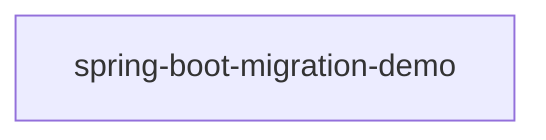

# Evidence Bundle — ISSUE-003

_Collected 2026-09-10T11:45:41.508Z by the Root Cause Analyst evidence collector. Facts only — no diagnosis._

**Issue:** MongoDB (NoSQL) injection in the employee search endpoint via string-concatenated BasicQuery
**Type / Severity:** Vulnerability / Critical
**Reported services:** employee-service
**Source file:** `docs/agent_output/00-issues/issue-register.xlsx`

## 1. Input Sources

| Input | Status |
|---|---|
| Issue report | `docs/agent_output/00-issues/issue-register.xlsx` |
| `docs/agent_output/01-architecture/architecture.md` | loaded |
| `docs/agent_output/01-architecture/function-reference.md` | loaded |
| `.github/.pipeline-context/artifacts.json` | scanned 2026-09-10T11:00:06.470Z |
| Neo4j graph | live (depth 4) |

_Resolution note: 0 interface → implementation dispatch edge(s) were bridged into the call graph, because Spring injects the implementation behind the interface. Neo4j's raw `CALLS` edges stop at the interface, so paths below may be one hop longer than the graph shows._

## 2. Focus Points (issue symbols resolved to code)

### `EmployeeController.EmployeeController()`

- **Module:** `spring-boot-migration-demo`
- **Signature:** `void EmployeeController(EmployeeService employeeService)`
- **Location:** `src/main/java/com/example/migrationdemo/controller/EmployeeController.java` (lines 21-23)
- **Direct callers:** _none resolved_
- **Direct callees:** _none resolved_

```java
public EmployeeController(EmployeeService employeeService) {
        this.employeeService = employeeService;
    }
```

**Injected collaborators of `EmployeeController`** — what this method could delegate to:

| Field | Resolves to | Called by focus method | Method of the same name available |
|---|---|---|---|
| `EmployeeService employeeService` | `EmployeeService` (class) | **no** | _none_ |

### `EmployeeController.createEmployee()`

- **Module:** `spring-boot-migration-demo`
- **Signature:** `ResponseEntity<EmployeeResponse> createEmployee(EmployeeCreateRequest request)`
- **Location:** `src/main/java/com/example/migrationdemo/controller/EmployeeController.java` (lines 25-29)
- **REST endpoint:** `POST /api/v1/employees`
- **Annotations:** @PostMapping
- **Direct callers:** _none resolved_
- **Direct callees:** `EmployeeService.createEmployee()`

```java
@PostMapping
    public ResponseEntity<EmployeeResponse> createEmployee(@Valid @RequestBody EmployeeCreateRequest request) {
        EmployeeResponse response = employeeService.createEmployee(request);
        return new ResponseEntity<>(response, HttpStatus.CREATED);
    }
```

**Injected collaborators of `EmployeeController`** — what this method could delegate to:

| Field | Resolves to | Called by focus method | Method of the same name available |
|---|---|---|---|
| `EmployeeService employeeService` | `EmployeeService` (class) | yes — `EmployeeService.createEmployee()` | `EmployeeService.createEmployee()` |

**Outgoing paths (focus → … → callee):**

- EmployeeController.createEmployee() → EmployeeService.createEmployee() → EmployeeRepository.findByEmployeeNumber()
- EmployeeController.createEmployee() → EmployeeService.createEmployee() → EmployeeMapper.toEntity()
- EmployeeController.createEmployee() → EmployeeService.createEmployee() → EmployeeMapper.toResponse()

### `EmployeeController.getAllEmployees()`

- **Module:** `spring-boot-migration-demo`
- **Signature:** `ResponseEntity<List<EmployeeResponse>> getAllEmployees()`
- **Location:** `src/main/java/com/example/migrationdemo/controller/EmployeeController.java` (lines 31-35)
- **REST endpoint:** `GET /api/v1/employees`
- **Annotations:** @GetMapping
- **Direct callers:** _none resolved_
- **Direct callees:** `EmployeeService.getAllEmployees()`

```java
@GetMapping
    public ResponseEntity<List<EmployeeResponse>> getAllEmployees() {
        List<EmployeeResponse> employees = employeeService.getAllEmployees();
        return ResponseEntity.ok(employees);
    }
```

**Injected collaborators of `EmployeeController`** — what this method could delegate to:

| Field | Resolves to | Called by focus method | Method of the same name available |
|---|---|---|---|
| `EmployeeService employeeService` | `EmployeeService` (class) | yes — `EmployeeService.getAllEmployees()` | `EmployeeService.getAllEmployees()` |

**Outgoing paths (focus → … → callee):**

- EmployeeController.getAllEmployees() → EmployeeService.getAllEmployees()

### `EmployeeController.getEmployeeById()`

- **Module:** `spring-boot-migration-demo`
- **Signature:** `ResponseEntity<EmployeeResponse> getEmployeeById(Long id)`
- **Location:** `src/main/java/com/example/migrationdemo/controller/EmployeeController.java` (lines 37-41)
- **REST endpoint:** `GET /api/v1/employees/{id}`
- **Annotations:** @GetMapping
- **Direct callers:** _none resolved_
- **Direct callees:** `EmployeeService.getEmployeeById()`

```java
@GetMapping("/{id}")
    public ResponseEntity<EmployeeResponse> getEmployeeById(@PathVariable Long id) {
        EmployeeResponse employee = employeeService.getEmployeeById(id);
        return ResponseEntity.ok(employee);
    }
```

**Injected collaborators of `EmployeeController`** — what this method could delegate to:

| Field | Resolves to | Called by focus method | Method of the same name available |
|---|---|---|---|
| `EmployeeService employeeService` | `EmployeeService` (class) | yes — `EmployeeService.getEmployeeById()` | `EmployeeService.getEmployeeById()` |

**Outgoing paths (focus → … → callee):**

- EmployeeController.getEmployeeById() → EmployeeService.getEmployeeById() → EmployeeMapper.toResponse()

### `EmployeeController.updateEmployee()`

- **Module:** `spring-boot-migration-demo`
- **Signature:** `ResponseEntity<EmployeeResponse> updateEmployee(Long id, EmployeeUpdateRequest request)`
- **Location:** `src/main/java/com/example/migrationdemo/controller/EmployeeController.java` (lines 43-49)
- **REST endpoint:** `PUT /api/v1/employees/{id}`
- **Annotations:** @PutMapping
- **Direct callers:** _none resolved_
- **Direct callees:** `EmployeeService.updateEmployee()`

```java
@PutMapping("/{id}")
    public ResponseEntity<EmployeeResponse> updateEmployee(
            @PathVariable Long id,
            @Valid @RequestBody EmployeeUpdateRequest request) {
        EmployeeResponse response = employeeService.updateEmployee(id, request);
        return ResponseEntity.ok(response);
    }
```

**Injected collaborators of `EmployeeController`** — what this method could delegate to:

| Field | Resolves to | Called by focus method | Method of the same name available |
|---|---|---|---|
| `EmployeeService employeeService` | `EmployeeService` (class) | yes — `EmployeeService.updateEmployee()` | `EmployeeService.updateEmployee()` |

**Outgoing paths (focus → … → callee):**

- EmployeeController.updateEmployee() → EmployeeService.updateEmployee() → EmployeeRepository.findByEmployeeNumber()
- EmployeeController.updateEmployee() → EmployeeService.updateEmployee() → EmployeeMapper.toResponse()

### `EmployeeController.deleteEmployee()`

- **Module:** `spring-boot-migration-demo`
- **Signature:** `ResponseEntity<Void> deleteEmployee(Long id)`
- **Location:** `src/main/java/com/example/migrationdemo/controller/EmployeeController.java` (lines 51-55)
- **REST endpoint:** `DELETE /api/v1/employees/{id}`
- **Annotations:** @DeleteMapping
- **Direct callers:** _none resolved_
- **Direct callees:** `EmployeeService.deleteEmployee()`

```java
@DeleteMapping("/{id}")
    public ResponseEntity<Void> deleteEmployee(@PathVariable Long id) {
        employeeService.deleteEmployee(id);
        return ResponseEntity.noContent().build();
    }
```

**Injected collaborators of `EmployeeController`** — what this method could delegate to:

| Field | Resolves to | Called by focus method | Method of the same name available |
|---|---|---|---|
| `EmployeeService employeeService` | `EmployeeService` (class) | yes — `EmployeeService.deleteEmployee()` | `EmployeeService.deleteEmployee()` |

**Outgoing paths (focus → … → callee):**

- EmployeeController.deleteEmployee() → EmployeeService.deleteEmployee()

### `EmployeeController.searchByDepartment()`

- **Module:** `spring-boot-migration-demo`
- **Signature:** `ResponseEntity<List<EmployeeResponse>> searchByDepartment(String department)`
- **Location:** `src/main/java/com/example/migrationdemo/controller/EmployeeController.java` (lines 57-62)
- **REST endpoint:** `GET /api/v1/employees/search`
- **Annotations:** @GetMapping
- **Direct callers:** _none resolved_
- **Direct callees:** `EmployeeService.searchByDepartment()`

```java
@GetMapping("/search")
    public ResponseEntity<List<EmployeeResponse>> searchByDepartment(
            @RequestParam String department) {
        List<EmployeeResponse> employees = employeeService.searchByDepartment(department);
        return ResponseEntity.ok(employees);
    }
```

**Injected collaborators of `EmployeeController`** — what this method could delegate to:

| Field | Resolves to | Called by focus method | Method of the same name available |
|---|---|---|---|
| `EmployeeService employeeService` | `EmployeeService` (class) | yes — `EmployeeService.searchByDepartment()` | `EmployeeService.searchByDepartment()` |

**Outgoing paths (focus → … → callee):**

- EmployeeController.searchByDepartment() → EmployeeService.searchByDepartment() → EmployeeRepository.findByDepartmentIgnoreCase()

### `EmployeeController.getHighEarners()`

- **Module:** `spring-boot-migration-demo`
- **Signature:** `ResponseEntity<List<EmployeeResponse>> getHighEarners(BigDecimal salary)`
- **Location:** `src/main/java/com/example/migrationdemo/controller/EmployeeController.java` (lines 64-69)
- **REST endpoint:** `GET /api/v1/employees/high-earners`
- **Annotations:** @GetMapping
- **Direct callers:** _none resolved_
- **Direct callees:** `EmployeeService.findHighEarners()`

```java
@GetMapping("/high-earners")
    public ResponseEntity<List<EmployeeResponse>> getHighEarners(
            @RequestParam BigDecimal salary) {
        List<EmployeeResponse> employees = employeeService.findHighEarners(salary);
        return ResponseEntity.ok(employees);
    }
```

**Injected collaborators of `EmployeeController`** — what this method could delegate to:

| Field | Resolves to | Called by focus method | Method of the same name available |
|---|---|---|---|
| `EmployeeService employeeService` | `EmployeeService` (class) | yes — `EmployeeService.findHighEarners()` | _none_ |

**Outgoing paths (focus → … → callee):**

- EmployeeController.getHighEarners() → EmployeeService.findHighEarners() → EmployeeRepository.findHighEarners()

### `EmployeeServiceImpl.searchEmployees` — UNRESOLVED

Could not match this symbol in `artifacts.json`. Re-run the Code Cartographer scan or correct `affected_symbols` in the issue file.

### `EmployeeSearchRepository.searchEmployees` — UNRESOLVED

Could not match this symbol in `artifacts.json`. Re-run the Code Cartographer scan or correct `affected_symbols` in the issue file.

## 3. Affected Area

- **Modules touched (Java call graph):** `spring-boot-migration-demo`
- **REST endpoints on a reaching path:** `DELETE /api/v1/employees/{id}`, `GET /api/v1/employees`, `GET /api/v1/employees/high-earners`, `GET /api/v1/employees/search`, `GET /api/v1/employees/{id}`, `POST /api/v1/employees`, `PUT /api/v1/employees/{id}`
- **Types on a reaching path:** `EmployeeController`, `EmployeeMapper`, `EmployeeRepository`, `EmployeeService`
- **Scheduled jobs on a reaching path:** _none_

## 4. Architecture Context

**Affected modules (from the module table):**

| Module | Packaging | Key Spring dependencies |
|---|---|---|
| `spring-boot-migration-demo` | jar | spring-boot-starter-web, spring-boot-starter-data-jpa, spring-boot-starter-validation, spring-boot-starter-security, spring-boot-starter-actuator, spring-boot-starter-test |

**Related REST surface rows:**

| Method | Path | Handler | Module |
|---|---|---|---|
| `POST` | `/api/v1/employees` | EmployeeController.createEmployee() | `spring-boot-migration-demo` |
| `GET` | `/api/v1/employees` | EmployeeController.getAllEmployees() | `spring-boot-migration-demo` |
| `GET` | `/api/v1/employees/{id}` | EmployeeController.getEmployeeById() | `spring-boot-migration-demo` |
| `PUT` | `/api/v1/employees/{id}` | EmployeeController.updateEmployee() | `spring-boot-migration-demo` |
| `DELETE` | `/api/v1/employees/{id}` | EmployeeController.deleteEmployee() | `spring-boot-migration-demo` |
| `GET` | `/api/v1/employees/high-earners` | EmployeeController.getHighEarners() | `spring-boot-migration-demo` |
| `GET` | `/api/v1/employees/search` | EmployeeController.searchByDepartment() | `spring-boot-migration-demo` |

**Service topology:**



**Documented observations:**

- Each service (`department-service`, `employee-service`, `report-service`, `sheduler-service`) follows the same layered convention: `controller` → `service` → `repository` → `model`/`entity`, backed by MongoDB repositories.
- `configuaration-server` and `discovery-service` are infrastructure services (Spring Cloud Config + Eureka) that every business service depends on at startup via `bootstrap.properties`.
- No Feign clients were detected — cross-service calls, if any, likely go through `RestTemplate`/`WebClient` rather than declarative Feign interfaces. Worth confirming if service-to-service coupling should show up as graph edges.
- The generated Neo4j graph can be queried directly (e.g. `MATCH (m:Module)-[:CONTAINS]->(t:Type) RETURN m.name, count(t)`) for deeper, ad-hoc architecture questions beyond this static document.

## 5. Graph Findings

Connected to `neo4j+s://7d610372.databases.neo4j.io`, database traversal depth 4.

**`com.example.migrationdemo.controller.EmployeeController#EmployeeController(EmployeeService)`**

- Owning type: `EmployeeController` in module `spring-boot-migration-demo`
- Endpoints exposed by that type: `POST /api/v1/employees`, `GET /api/v1/employees`, `GET /api/v1/employees/{id}`, `PUT /api/v1/employees/{id}`, `DELETE /api/v1/employees/{id}`, `GET /api/v1/employees/search`, `GET /api/v1/employees/high-earners`
- Upstream caller paths in graph: 0
- Downstream callee paths in graph: 0
- Modules reaching it: _none_
- Types depending on the owning type (`USES` fan-in): _none_

**`com.example.migrationdemo.controller.EmployeeController#createEmployee(EmployeeCreateRequest)`**

- Owning type: `EmployeeController` in module `spring-boot-migration-demo`
- Endpoints exposed by that type: `POST /api/v1/employees`, `GET /api/v1/employees`, `GET /api/v1/employees/{id}`, `PUT /api/v1/employees/{id}`, `DELETE /api/v1/employees/{id}`, `GET /api/v1/employees/search`, `GET /api/v1/employees/high-earners`
- Upstream caller paths in graph: 0
- Downstream callee paths in graph: 4
- Modules reaching it: _none_
- Types depending on the owning type (`USES` fan-in): _none_

**`com.example.migrationdemo.controller.EmployeeController#getAllEmployees()`**

- Owning type: `EmployeeController` in module `spring-boot-migration-demo`
- Endpoints exposed by that type: `POST /api/v1/employees`, `GET /api/v1/employees`, `GET /api/v1/employees/{id}`, `PUT /api/v1/employees/{id}`, `DELETE /api/v1/employees/{id}`, `GET /api/v1/employees/search`, `GET /api/v1/employees/high-earners`
- Upstream caller paths in graph: 0
- Downstream callee paths in graph: 1
- Modules reaching it: _none_
- Types depending on the owning type (`USES` fan-in): _none_

**`com.example.migrationdemo.controller.EmployeeController#getEmployeeById(Long)`**

- Owning type: `EmployeeController` in module `spring-boot-migration-demo`
- Endpoints exposed by that type: `POST /api/v1/employees`, `GET /api/v1/employees`, `GET /api/v1/employees/{id}`, `PUT /api/v1/employees/{id}`, `DELETE /api/v1/employees/{id}`, `GET /api/v1/employees/search`, `GET /api/v1/employees/high-earners`
- Upstream caller paths in graph: 0
- Downstream callee paths in graph: 2
- Modules reaching it: _none_
- Types depending on the owning type (`USES` fan-in): _none_

**`com.example.migrationdemo.controller.EmployeeController#updateEmployee(Long,EmployeeUpdateRequest)`**

- Owning type: `EmployeeController` in module `spring-boot-migration-demo`
- Endpoints exposed by that type: `POST /api/v1/employees`, `GET /api/v1/employees`, `GET /api/v1/employees/{id}`, `PUT /api/v1/employees/{id}`, `DELETE /api/v1/employees/{id}`, `GET /api/v1/employees/search`, `GET /api/v1/employees/high-earners`
- Upstream caller paths in graph: 0
- Downstream callee paths in graph: 3
- Modules reaching it: _none_
- Types depending on the owning type (`USES` fan-in): _none_

**`com.example.migrationdemo.controller.EmployeeController#deleteEmployee(Long)`**

- Owning type: `EmployeeController` in module `spring-boot-migration-demo`
- Endpoints exposed by that type: `POST /api/v1/employees`, `GET /api/v1/employees`, `GET /api/v1/employees/{id}`, `PUT /api/v1/employees/{id}`, `DELETE /api/v1/employees/{id}`, `GET /api/v1/employees/search`, `GET /api/v1/employees/high-earners`
- Upstream caller paths in graph: 0
- Downstream callee paths in graph: 1
- Modules reaching it: _none_
- Types depending on the owning type (`USES` fan-in): _none_

**`com.example.migrationdemo.controller.EmployeeController#searchByDepartment(String)`**

- Owning type: `EmployeeController` in module `spring-boot-migration-demo`
- Endpoints exposed by that type: `POST /api/v1/employees`, `GET /api/v1/employees`, `GET /api/v1/employees/{id}`, `PUT /api/v1/employees/{id}`, `DELETE /api/v1/employees/{id}`, `GET /api/v1/employees/search`, `GET /api/v1/employees/high-earners`
- Upstream caller paths in graph: 0
- Downstream callee paths in graph: 2
- Modules reaching it: _none_
- Types depending on the owning type (`USES` fan-in): _none_

**`com.example.migrationdemo.controller.EmployeeController#getHighEarners(BigDecimal)`**

- Owning type: `EmployeeController` in module `spring-boot-migration-demo`
- Endpoints exposed by that type: `POST /api/v1/employees`, `GET /api/v1/employees`, `GET /api/v1/employees/{id}`, `PUT /api/v1/employees/{id}`, `DELETE /api/v1/employees/{id}`, `GET /api/v1/employees/search`, `GET /api/v1/employees/high-earners`
- Upstream caller paths in graph: 0
- Downstream callee paths in graph: 2
- Modules reaching it: _none_
- Types depending on the owning type (`USES` fan-in): _none_

**Maven dependencies of the affected modules:**

- `spring-boot-migration-demo`: 12 declared dependencies

**Graph size:** Method 127, Type 17, ContextNote 13, MavenDependency 12, Package 11, Endpoint 7, ExternalType 5, Module 1

**Relationships:** HAS_METHOD 127, CONTAINS 45, ABOUT 34, CALLS 17, DEPENDS_ON 12, EXPOSES 7, USES 4, EXTENDS 4, IMPLEMENTS 2

## 6. Function Reference Excerpts

<details><summary><code>EmployeeController.EmployeeController()</code></summary>

#### `EmployeeController.EmployeeController()`
- **Signature**: `void EmployeeController(EmployeeService employeeService)`
- **Location**: `src/main/java/com/example/migrationdemo/controller/EmployeeController.java` (lines 21-23)
- **Calls**: _none resolved_
- **Called by**: _none resolved (likely an entry point or only called externally)_

```java
public EmployeeController(EmployeeService employeeService) {
        this.employeeService = employeeService;
    }
```

</details>

<details><summary><code>EmployeeController.createEmployee()</code></summary>

#### `EmployeeController.createEmployee()`
- **Signature**: `ResponseEntity<EmployeeResponse> createEmployee(EmployeeCreateRequest request)`
- **Location**: `src/main/java/com/example/migrationdemo/controller/EmployeeController.java` (lines 25-29)
- **Annotations**: @PostMapping
- **REST endpoint**: `POST /api/v1/employees`
- **Calls**: `EmployeeService.createEmployee()`
- **Called by**: _none resolved (likely an entry point or only called externally)_

```java
@PostMapping
    public ResponseEntity<EmployeeResponse> createEmployee(@Valid @RequestBody EmployeeCreateRequest request) {
        EmployeeResponse response = employeeService.createEmployee(request);
        return new ResponseEntity<>(response, HttpStatus.CREATED);
    }
```

</details>

<details><summary><code>EmployeeController.getAllEmployees()</code></summary>

#### `EmployeeController.getAllEmployees()`
- **Signature**: `ResponseEntity<List<EmployeeResponse>> getAllEmployees()`
- **Location**: `src/main/java/com/example/migrationdemo/controller/EmployeeController.java` (lines 31-35)
- **Annotations**: @GetMapping
- **REST endpoint**: `GET /api/v1/employees`
- **Calls**: `EmployeeService.getAllEmployees()`
- **Called by**: _none resolved (likely an entry point or only called externally)_

```java
@GetMapping
    public ResponseEntity<List<EmployeeResponse>> getAllEmployees() {
        List<EmployeeResponse> employees = employeeService.getAllEmployees();
        return ResponseEntity.ok(employees);
    }
```

</details>

<details><summary><code>EmployeeController.getEmployeeById()</code></summary>

#### `EmployeeController.getEmployeeById()`
- **Signature**: `ResponseEntity<EmployeeResponse> getEmployeeById(Long id)`
- **Location**: `src/main/java/com/example/migrationdemo/controller/EmployeeController.java` (lines 37-41)
- **Annotations**: @GetMapping("/{id}")
- **REST endpoint**: `GET /api/v1/employees/{id}`
- **Calls**: `EmployeeService.getEmployeeById()`
- **Called by**: _none resolved (likely an entry point or only called externally)_

```java
@GetMapping("/{id}")
    public ResponseEntity<EmployeeResponse> getEmployeeById(@PathVariable Long id) {
        EmployeeResponse employee = employeeService.getEmployeeById(id);
        return ResponseEntity.ok(employee);
    }
```

</details>

<details><summary><code>EmployeeController.updateEmployee()</code></summary>

#### `EmployeeController.updateEmployee()`
- **Signature**: `ResponseEntity<EmployeeResponse> updateEmployee(Long id, EmployeeUpdateRequest request)`
- **Location**: `src/main/java/com/example/migrationdemo/controller/EmployeeController.java` (lines 43-49)
- **Annotations**: @PutMapping("/{id}")
- **REST endpoint**: `PUT /api/v1/employees/{id}`
- **Calls**: `EmployeeService.updateEmployee()`
- **Called by**: _none resolved (likely an entry point or only called externally)_

```java
@PutMapping("/{id}")
    public ResponseEntity<EmployeeResponse> updateEmployee(
            @PathVariable Long id,
            @Valid @RequestBody EmployeeUpdateRequest request) {
        EmployeeResponse response = employeeService.updateEmployee(id, request);
        return ResponseEntity.ok(response);
    }
```

</details>

<details><summary><code>EmployeeController.deleteEmployee()</code></summary>

#### `EmployeeController.deleteEmployee()`
- **Signature**: `ResponseEntity<Void> deleteEmployee(Long id)`
- **Location**: `src/main/java/com/example/migrationdemo/controller/EmployeeController.java` (lines 51-55)
- **Annotations**: @DeleteMapping("/{id}")
- **REST endpoint**: `DELETE /api/v1/employees/{id}`
- **Calls**: `EmployeeService.deleteEmployee()`
- **Called by**: _none resolved (likely an entry point or only called externally)_

```java
@DeleteMapping("/{id}")
    public ResponseEntity<Void> deleteEmployee(@PathVariable Long id) {
        employeeService.deleteEmployee(id);
        return ResponseEntity.noContent().build();
    }
```

</details>

<details><summary><code>EmployeeController.searchByDepartment()</code></summary>

#### `EmployeeController.searchByDepartment()`
- **Signature**: `ResponseEntity<List<EmployeeResponse>> searchByDepartment(String department)`
- **Location**: `src/main/java/com/example/migrationdemo/controller/EmployeeController.java` (lines 57-62)
- **Annotations**: @GetMapping("/search")
- **REST endpoint**: `GET /api/v1/employees/search`
- **Calls**: `EmployeeService.searchByDepartment()`
- **Called by**: _none resolved (likely an entry point or only called externally)_

```java
@GetMapping("/search")
    public ResponseEntity<List<EmployeeResponse>> searchByDepartment(
            @RequestParam String department) {
        List<EmployeeResponse> employees = employeeService.searchByDepartment(department);
        return ResponseEntity.ok(employees);
    }
```

</details>

<details><summary><code>EmployeeController.getHighEarners()</code></summary>

#### `EmployeeController.getHighEarners()`
- **Signature**: `ResponseEntity<List<EmployeeResponse>> getHighEarners(BigDecimal salary)`
- **Location**: `src/main/java/com/example/migrationdemo/controller/EmployeeController.java` (lines 64-69)
- **Annotations**: @GetMapping("/high-earners")
- **REST endpoint**: `GET /api/v1/employees/high-earners`
- **Calls**: `EmployeeService.findHighEarners()`
- **Called by**: _none resolved (likely an entry point or only called externally)_

```java
@GetMapping("/high-earners")
    public ResponseEntity<List<EmployeeResponse>> getHighEarners(
            @RequestParam BigDecimal salary) {
        List<EmployeeResponse> employees = employeeService.findHighEarners(salary);
        return ResponseEntity.ok(employees);
    }
```

</details>

<details><summary><code>EmployeeMapper.toEntity()</code></summary>

#### `EmployeeMapper.toEntity()`
- **Signature**: `Employee toEntity(EmployeeCreateRequest request)`
- **Location**: `src/main/java/com/example/migrationdemo/mapper/EmployeeMapper.java` (lines 11-19)
- **Calls**: _none resolved_
- **Called by**: `EmployeeService.createEmployee()`

```java
public Employee toEntity(EmployeeCreateRequest request) {
        return new Employee(
                request.getEmployeeNumber(),
                request.getFirstName(),
                request.getLastName(),
                request.getEmail(),
                request.getDepartment(),
                request.getSalary());
    }
```

</details>

<details><summary><code>EmployeeMapper.toResponse()</code></summary>

#### `EmployeeMapper.toResponse()`
- **Signature**: `EmployeeResponse toResponse(Employee employee)`
- **Location**: `src/main/java/com/example/migrationdemo/mapper/EmployeeMapper.java` (lines 21-33)
- **Calls**: _none resolved_
- **Called by**: `EmployeeService.createEmployee()`, `EmployeeService.getEmployeeById()`, `EmployeeService.updateEmployee()`

```java
public EmployeeResponse toResponse(Employee employee) {
        return new EmployeeResponse(
                employee.getId(),
                employee.getEmployeeNumber(),
                employee.getFirstName(),
                employee.getLastName(),
                employee.getEmail(),
                employee.getDepartment(),
                employee.getSalary(),
                employee.getActive(),
                employee.getCreatedAt(),
                employee.getUpdatedAt());
    }
```

</details>

<details><summary><code>EmployeeRepository.findByEmployeeNumber()</code></summary>

#### `EmployeeRepository.findByEmployeeNumber()`
- **Signature**: `Optional<Employee> findByEmployeeNumber(String employeeNumber)`
- **Location**: `src/main/java/com/example/migrationdemo/repository/EmployeeRepository.java` (lines 16-16)
- **Calls**: _none resolved_
- **Called by**: `EmployeeService.createEmployee()`, `EmployeeService.createEmployee()`, `EmployeeService.updateEmployee()`

```java
Optional<Employee> findByEmployeeNumber(String employeeNumber);
```

</details>

<details><summary><code>EmployeeRepository.findByDepartmentIgnoreCase()</code></summary>

#### `EmployeeRepository.findByDepartmentIgnoreCase()`
- **Signature**: `List<Employee> findByDepartmentIgnoreCase(String department)`
- **Location**: `src/main/java/com/example/migrationdemo/repository/EmployeeRepository.java` (lines 18-18)
- **Calls**: _none resolved_
- **Called by**: `EmployeeService.searchByDepartment()`

```java
List<Employee> findByDepartmentIgnoreCase(String department);
```

</details>

<details><summary><code>EmployeeRepository.findHighEarners()</code></summary>

#### `EmployeeRepository.findHighEarners()`
- **Signature**: `List<Employee> findHighEarners(BigDecimal salary)`
- **Location**: `src/main/java/com/example/migrationdemo/repository/EmployeeRepository.java` (lines 37-45)
- **Annotations**: @Query("""
            select *
            from employees
            where salary > :salary
            and active = true
            order by salary desc
            """, nativeQuery = "true")
- **Calls**: _none resolved_
- **Called by**: `EmployeeService.findHighEarners()`

```java
@Query(value = """
            select *
            from employees
            where salary > :salary
            and active = true
            order by salary desc
            """, nativeQuery = true)
    List<Employee> findHighEarners(
            @Param("salary") BigDecimal salary);
```

</details>

<details><summary><code>EmployeeService.createEmployee()</code></summary>

#### `EmployeeService.createEmployee()`
- **Signature**: `EmployeeResponse createEmployee(EmployeeCreateRequest request)`
- **Location**: `src/main/java/com/example/migrationdemo/service/EmployeeService.java` (lines 29-44)
- **Annotations**: @Transactional
- **Calls**: `EmployeeRepository.findByEmployeeNumber()`, `EmployeeRepository.findByEmployeeNumber()`, `EmployeeMapper.toEntity()`, `EmployeeMapper.toResponse()`
- **Called by**: `EmployeeController.createEmployee()`

```java
@Transactional
    public EmployeeResponse createEmployee(EmployeeCreateRequest request) {
        // Check for duplicate employee number
        if (employeeRepository.findByEmployeeNumber(request.getEmployeeNumber()).isPresent()) {
            throw new DuplicateEmployeeException("employeeNumber", request.getEmployeeNumber());
        }

        // Check for duplicate email
        if (employeeRepository.findByEmployeeNumber(request.getEmail()).isPresent()) {
            throw new DuplicateEmployeeException("email", request.getEmail());
        }

        Employee employee = employeeMapper.toEntity(request);
        Employee savedEmployee = employeeRepository.save(employee);
        return employeeMapper.toResponse(savedEmployee);
    }
```

</details>

<details><summary><code>EmployeeService.getAllEmployees()</code></summary>

#### `EmployeeService.getAllEmployees()`
- **Signature**: `List<EmployeeResponse> getAllEmployees()`
- **Location**: `src/main/java/com/example/migrationdemo/service/EmployeeService.java` (lines 46-52)
- **Annotations**: @Transactional(readOnly = "true")
- **Calls**: _none resolved_
- **Called by**: `EmployeeController.getAllEmployees()`

```java
@Transactional(readOnly = true)
    public List<EmployeeResponse> getAllEmployees() {
        return employeeRepository.findAll()
                .stream()
                .map(employeeMapper::toResponse)
                .collect(Collectors.toList());
    }
```

</details>

<details><summary><code>EmployeeService.getEmployeeById()</code></summary>

#### `EmployeeService.getEmployeeById()`
- **Signature**: `EmployeeResponse getEmployeeById(Long id)`
- **Location**: `src/main/java/com/example/migrationdemo/service/EmployeeService.java` (lines 54-59)
- **Annotations**: @Transactional(readOnly = "true")
- **Calls**: `EmployeeMapper.toResponse()`
- **Called by**: `EmployeeController.getEmployeeById()`

```java
@Transactional(readOnly = true)
    public EmployeeResponse getEmployeeById(Long id) {
        Employee employee = employeeRepository.findById(id)
                .orElseThrow(() -> new EmployeeNotFoundException(id));
        return employeeMapper.toResponse(employee);
    }
```

</details>

<details><summary><code>EmployeeService.updateEmployee()</code></summary>

#### `EmployeeService.updateEmployee()`
- **Signature**: `EmployeeResponse updateEmployee(Long id, EmployeeUpdateRequest request)`
- **Location**: `src/main/java/com/example/migrationdemo/service/EmployeeService.java` (lines 61-95)
- **Annotations**: @Transactional
- **Calls**: `EmployeeRepository.findByEmployeeNumber()`, `EmployeeMapper.toResponse()`
- **Called by**: `EmployeeController.updateEmployee()`

```java
@Transactional
    public EmployeeResponse updateEmployee(Long id, EmployeeUpdateRequest request) {
        Employee employee = employeeRepository.findById(id)
                .orElseThrow(() -> new EmployeeNotFoundException(id));

        // Check for duplicate email if email is being updated
        if (request.getEmail() != null && !request.getEmail().equals(employee.getEmail())) {
            if (employeeRepository.findByEmployeeNumber(request.getEmail()).isPresent()) {
                throw new DuplicateEmployeeException("email", request.getEmail());
            }
        }

        // Update fields
        if (request.getFirstName() != null) {
            employee.setFirstName(request.getFirstName());
        }
        if (request.getLastName() != null) {
            employee.setLastName(request.getLastName());
        }
        if (request.getEmail() != null) {
            employee.setEmail(request.getEmail());
        }
        if (request.getDepartment() != null) {
            employee.setDepartment(request.getDepartment());
        }
        if (request.getSalary() != null) {
            employee.setSalary(request.getSalary());
        }
        if (request.getActive() != null) {
            employee.setActive(request.getActive());
        }

        Employee updatedEmployee = employeeRepository.save(employee);
        return employeeMapper.toResponse(updatedEmployee);
    }
```

</details>

<details><summary><code>EmployeeService.deleteEmployee()</code></summary>

#### `EmployeeService.deleteEmployee()`
- **Signature**: `void deleteEmployee(Long id)`
- **Location**: `src/main/java/com/example/migrationdemo/service/EmployeeService.java` (lines 97-102)
- **Annotations**: @Transactional
- **Calls**: _none resolved_
- **Called by**: `EmployeeController.deleteEmployee()`

```java
@Transactional
    public void deleteEmployee(Long id) {
        Employee employee = employeeRepository.findById(id)
                .orElseThrow(() -> new EmployeeNotFoundException(id));
        employeeRepository.delete(employee);
    }
```

</details>

<details><summary><code>EmployeeService.searchByDepartment()</code></summary>

#### `EmployeeService.searchByDepartment()`
- **Signature**: `List<EmployeeResponse> searchByDepartment(String department)`
- **Location**: `src/main/java/com/example/migrationdemo/service/EmployeeService.java` (lines 104-110)
- **Annotations**: @Transactional(readOnly = "true")
- **Calls**: `EmployeeRepository.findByDepartmentIgnoreCase()`
- **Called by**: `EmployeeController.searchByDepartment()`

```java
@Transactional(readOnly = true)
    public List<EmployeeResponse> searchByDepartment(String department) {
        return employeeRepository.findByDepartmentIgnoreCase(department)
                .stream()
                .map(employeeMapper::toResponse)
                .collect(Collectors.toList());
    }
```

</details>

<details><summary><code>EmployeeService.findHighEarners()</code></summary>

#### `EmployeeService.findHighEarners()`
- **Signature**: `List<EmployeeResponse> findHighEarners(BigDecimal salary)`
- **Location**: `src/main/java/com/example/migrationdemo/service/EmployeeService.java` (lines 120-126)
- **Annotations**: @Transactional(readOnly = "true")
- **Calls**: `EmployeeRepository.findHighEarners()`
- **Called by**: `EmployeeController.getHighEarners()`

```java
@Transactional(readOnly = true)
    public List<EmployeeResponse> findHighEarners(BigDecimal salary) {
        return employeeRepository.findHighEarners(salary)
                .stream()
                .map(employeeMapper::toResponse)
                .collect(Collectors.toList());
    }
```

</details>

## 7. Reported Symptom (verbatim from the issue file)

# ISSUE-003 — MongoDB (NoSQL) injection in the employee search endpoint via string-concatenated BasicQuery

## Summary

The employee search endpoint builds a MongoDB query by concatenating raw request parameters into a JSON query string and handing that string to BasicQuery. Because the caller's input is placed inside the query document without escaping or parameterisation, an attacker controls the structure of the query, not just its values. This is a textbook NoSQL injection: MongoDB query operators such as $ne, $gt, $regex and $where injected through the parameter are interpreted as query logic.

CWE-943 (Improper Neutralization of Special Elements in Data Query Logic), CWE-89 family for NoSQL. OWASP A03:2021 Injection.

## Data Flow (source → sink)

1. Source - EmployeeController.searchEmployees reads name and department from @RequestParam. (EmployeeController.java:51)
2. Propagation - EmployeeServiceImpl.searchEmployees forwards both values without sanitisation. (EmployeeServiceImpl.java:109)
3. Sink - EmployeeSearchRepository.searchEmployees concatenates them into the JSON filter and executes it via BasicQuery. (EmployeeSearchRepository.java:18)

## Observed Behavior

Because the value is placed inside a single-quoted JSON string that the caller can break out of, the injected payload closes the intended $regex clause and appends attacker-chosen query operators.

Benign request - filter becomes { 'name': { $regex: 'Ann' } }:
   GET /api/v1/employee/search?name=Ann

Injection - return every employee regardless of name. Supplying a name that closes the $regex object and injects an always-true operator turns the filter into one that matches all documents:
   GET /api/v1/employee/search?name=x' } }, { 'name': { $ne: '
The resulting filter string is { 'name': { $regex: 'x' } }, { 'name': { $ne: '' } }, i.e. the $regex constraint is neutralised and the query returns the full collection.

Injection - operator abuse via the department field. The department value is interpolated as a bare JSON value, so an operator document can be injected directly:
   GET /api/v1/employee/search?name=x&department=' }, 'name': { $ne: '

Injection - server-side JavaScript evaluation. If $where/JavaScript execution is enabled on the MongoDB deployment, a $where clause injected through the same hole runs arbitrary JavaScript in the database engine, which can be used for boolean/time-based blind extraction and resource exhaustion.

Reproducibility: Deterministic. The endpoint is unauthenticated (see ISSUE-002), so no credentials are needed to reach the sink.

## Expected Behavior

- The query must be built with parameterised criteria, not string concatenation - for example Spring Data derived queries (findByNameContainingAndDepartment) or the Criteria API (Criteria.where("name").regex(Pattern.quote(name))), which bind values rather than splicing them into the query document.
- If a regex search is required, the user input must be quoted with Pattern.quote(...) and anchored, so it is treated strictly as a literal.
- Input should be validated against an allow-list (length, permitted characters) at the controller boundary.
- The application's MongoDB user should have least privilege, and server-side JavaScript ($where, mapReduce with JS) should be disabled on the cluster.

## Steps to Reproduce

1. Start the platform and seed the employee collection with several employees whose names differ.
2. Confirm the benign path returns only matching records:
   curl -s "http://localhost:8500/api/v1/employee/search?name=Ann" | jq 'length'
3. Send the injection payload and observe that all records are returned regardless of name:
   curl -s -G "http://localhost:8500/api/v1/employee/search" \
        --data-urlencode "name=x' } }, { 'name': { \$ne: '" | jq 'length'
4. Compare the two counts - step 3 returns the full collection size, proving the name filter was neutralised by injected query logic.

## Impact

- Confidentiality (Critical): An attacker can enumerate and exfiltrate the entire employee collection - full PII - by neutralising the intended filter, and can perform blind boolean/time extraction of specific field values through injected operators.
- Availability: Injected operators such as an unanchored, catastrophic $regex or a $where JavaScript clause force expensive full-collection scans/evaluation, giving an unauthenticated caller a cheap denial-of-service primitive against the shared MongoDB instance.
- Potential code execution in the DB engine: Where server-side JavaScript is enabled, $where injection executes attacker-controlled JavaScript inside MongoDB.
- Chained severity: The sink sits behind an unauthenticated endpoint (ISSUE-002) over an unbounded dataset (ISSUE-001), so no barrier stands between an anonymous attacker and a full-collection injection.

## Detection Notes

- The unsafe query construction is `BasicQuery`, used in EmployeeSearchRepository.java and nowhere else in the codebase.
- The `StringBuilder` and `append` pattern feeding that `BasicQuery` is the signature of the flaw: user input crosses into query structure with no `Criteria` binding and no `Pattern.quote`.
- SAST tools flag `new BasicQuery(<tainted string>)` as a NoSQL injection sink; the taint source is the `@RequestParam` in `EmployeeController.searchEmployees`.
- No `@Valid` or bean validation is applied to the search parameters at the controller boundary.
