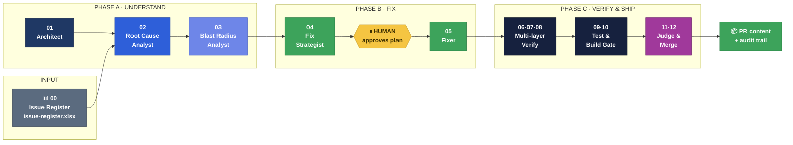
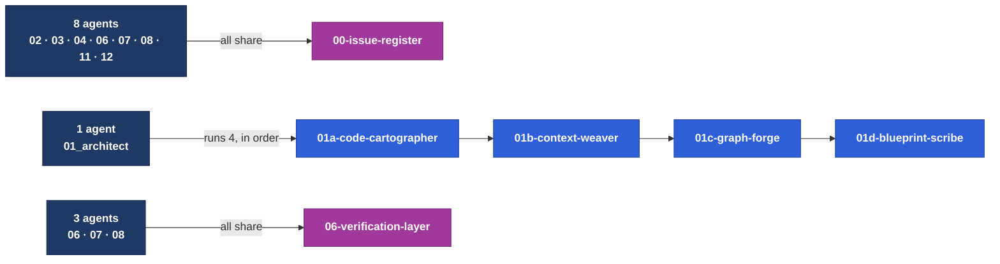
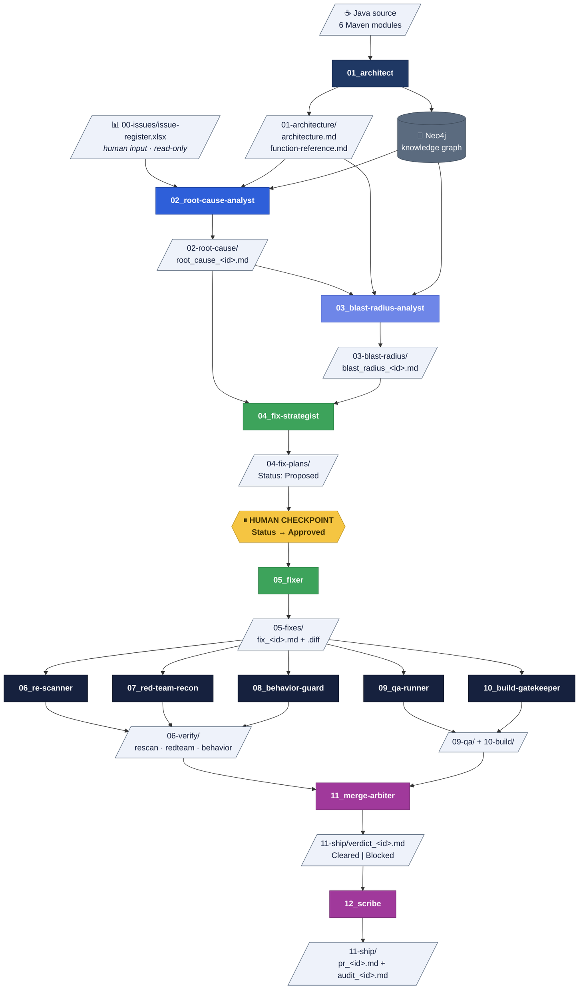
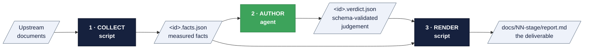
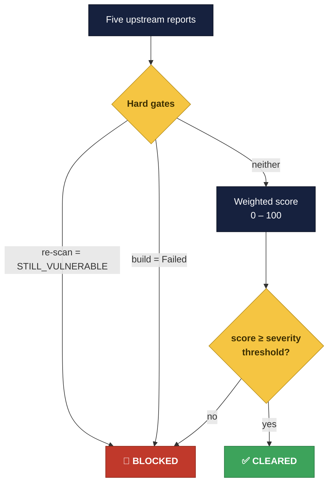

<div align="center">

# Agentic Remediation Harness

**A 7-stage, 12-agent pipeline that takes a reported vulnerability from raw source code
all the way to a scored, auditable ship decision — without ever touching your working tree.**


</div>

---

## What this is

Most "AI fixes your code" demos stop at generating a patch. The hard part is everything after:
*does the patch actually close the vulnerability? can it be bypassed a different way? did it quietly
change something else? does it build? is it safe to ship?*

This harness answers those questions with **twelve specialised agents**, each with one job, each
leaving a written artifact the next agent reads. No agent decides more than it should, and exactly
one agent is allowed to say a patch is safe to ship.

> **Two ideas do most of the work here.**
> 1. **Facts are collected by scripts; judgement is written by agents.** They live in separate files
>    and are merged into the final report, so every factual claim is traceable and no agent can
>    quietly invent evidence.
> 2. **Nothing ever edits the real repository.** Patches are applied inside throwaway `git worktree`
>    copies that are destroyed immediately. `git status` stays clean from end to end.

---

## The pipeline at a glance



| Phase | Stages | Question it answers |
|:--|:--|:--|
| 🔵 **A · Understand** | 01 – 03 | What does this codebase look like, *why* is this defect real, and *how far* does it reach? |
| 🟢 **B · Fix** | 04 – 05 | *How* should it be fixed, and what is the smallest diff that does it? |
| 🟣 **C · Verify & Ship** | 06 – 12 | Is the fix actually closed, bypass-proof, side-effect-free, tested, buildable — and shippable? |

---

## The 12 agents

Each agent is a markdown persona in [`agents/`](./agents/), numbered in execution order.

### 🔵 Phase A — Understand

| # | Agent | What it does | Writes |
|:--|:--|:--|:--|
| **01** | `01_architect` | Parses all Java source into structured artifacts, writes the semantic layer that gives the graph meaning, loads a Neo4j knowledge graph, and produces the architecture document. **Runs once per application**, then is reused by every later stage. | `01-architecture/` |
| **02** | `02_root-cause-analyst` | Diagnoses *why* each reported defect exists, correlating the issue row, the architecture doc, the function reference and live graph traversal. Confirms the bug is real — not a scanner false positive. | `02-root-cause/` |
| **03** | `03_blast-radius-analyst` | Measures how far the defect reaches: which services break, which degrade, which endpoints are exposed, who feels it. Assigns priority by **real reachability**, not theoretical severity. | `03-blast-radius/` |

### 🟢 Phase B — Fix

| # | Agent | What it does | Writes |
|:--|:--|:--|:--|
| **04** | `04_fix-strategist` | Matches the defect against a curated **CWE-aligned remediation catalog** and writes a strategy — *never* a diff. Splitting strategy from code creates a checkpoint before anything is written. | `04-fix-plans/` |
| **05** | `05_fixer` | The **only agent that produces code**. Turns an *Approved* plan into the smallest diff in the app's existing style, compiles it inside a throwaway worktree, and refuses any plan not marked Approved. | `05-fixes/` |

### 🟣 Phase C — Verify & Ship

| # | Agent | What it does | Writes |
|:--|:--|:--|:--|
| **06** | `06_re-scanner` | Re-derives the issue's detection signatures and checks whether the finding **still triggers** against patched code. | `06-verify/rescan_*` |
| **07** | `07_red-team-recon` | Adversarially hunts for **residual or alternate attack vectors** the fix didn't cover, grounded in the CWE entry's anti-patterns. | `06-verify/redteam_*` |
| **08** | `08_behavior-guard` | Separates intended changes from **anything the fix plan doesn't explain** — log format, exception types, return values, visibility. | `06-verify/behavior_*` |
| **09** | `09_qa-runner` | Drafts exactly one new regression test, then a **script** applies and runs it for real. The agent cannot interpret or override the exit code. | `09-qa/` |
| **10** | `10_build-gatekeeper` | Runs `mvn verify` plus a dependency-tree diff. **Zero agent-authored content** — deliberately given narrower tools (no `edit`) because there is nothing here to author. | `10-build/` |
| **11** | `11_merge-arbiter` | Aggregates all five upstream reports into one deterministic weighted score against hard gates. **The only agent that may declare a patch safe to ship.** | `11-ship/verdict_*` |
| **12** | `12_scribe` | Writes PR content and a full chain-of-custody audit trail — **always**, Cleared or Blocked. Never runs `git` or `gh`. | `11-ship/pr_*`, `audit_*` |

> **Stages 06·07·08 run in parallel**, and so do **09·10**. The numbering is pipeline position, not
> a dependency chain — none of the three verifiers needs the others' results.

---

## The 14 skills

An **agent** is the persona and the judgement. A **skill** is the toolbox it drives: deterministic
Node scripts, JSON schemas, and reference catalogs. Skills live in [`skills/`](./skills/) and are
numbered to match **the agent that runs them**.

Three relationships are worth knowing:



| Skill | Run by | Purpose |
|:--|:--|:--|
| `00-issue-register` | 02, 03, 04, 06–08, 11, 12 | Reads the Excel register; owns the column contract for all six consumers |
| `01a-code-cartographer` | 01 | Parses every `pom.xml` + `.java` file into `artifacts.json` via tree-sitter |
| `01b-context-weaver` | 01 | Selects architecturally significant nodes and validates the descriptions the agent writes |
| `01c-graph-forge` | 01 | Loads artifacts **and** the semantic layer into Neo4j |
| `01d-blueprint-scribe` | 01 | Synthesizes `architecture.md` + `function-reference.md` |
| `02-root-cause-analyst` | 02 | Evidence collection, analysis schema, report rendering |
| `03-blast-radius-analyst` | 03 | Reach measurement, narrative schema, diagram-led report |
| `04-fix-strategist` | 04 | CWE pattern catalog + fix-plan rendering |
| `05-fixer` | 05 | Patch verification in an isolated worktree + fix-report rendering |
| `06-verification-layer` | **06, 07, 08** | Shared by all three verifiers — identical inputs, three independent verdicts |
| `09-qa-runner` | 09 | Regression-test scaffolding + deterministic test gate |
| `10-build-gatekeeper` | 10 | `mvn verify` + dependency-tree diff gate |
| `11-merge-arbiter` | 11 | Deterministic scoring against externalised weights |
| `12-scribe` | 12 | Chain-of-custody collection + PR/audit rendering |

> **Why skills jump 06 → 09:** `06-verification-layer` is deliberately shared by agents 06, 07 and 08,
> because all three read exactly the same inputs. Numbers 07 and 08 are intentionally unused.

---

## How the agents connect

**The pipeline is wired through files, not through direct calls.** Each stage writes a document into
`docs/agent_output/`, and the next stage's workload is simply "every file the previous stage wrote."



**Why file-based handoff matters:** every stage is independently re-runnable, independently
auditable, and independently reviewable by a human. If stage 07 is wrong, you fix stage 07 and
re-run it — nothing else has to move.

---

## The pattern every stage follows

This is the single most important architectural idea in the harness. **Facts and judgement are
never written by the same thing.**



| Step | Who | Can it invent anything? |
|:--|:--|:--|
| **1 · Collect** | Deterministic Node script | ❌ No — it only reads and measures |
| **2 · Author** | The agent | ⚠️ Only within a **JSON schema**, validated before rendering |
| **3 · Render** | Deterministic Node script | ❌ No — it merges 1 and 2 into Markdown |

Because of this split, a reviewer reading any report can tell **which claims are measured and which
are reasoned** — and the agent physically cannot overwrite a measured fact.

The intermediate files live in [`docs/agent_output/.architect/`](../docs/agent_output/.architect/) (gitignored — regeneratable at any time):

| Folder | Contents |
|:--|:--|
| `.architect/artifacts.json` | The parsed code model |
| `.architect/context/` | Semantic descriptions (the one tracked file — expensive to reproduce) |
| `.architect/rca/` · `blast-radius/` · `fix-strategy/` | Facts + agent analysis per stage |
| `.architect/verify/` · `merge/` · `scribe/` | Phase C facts, scores and narratives |

---

## Human checkpoints

The pipeline stops and waits for a person **twice** — both deliberately placed where automation
should not be trusted alone.

| # | Where | What the human does | Why here |
|:--|:--|:--|:--|
| 1️⃣ | After **04 · Fix Strategist** | Edits the plan's `Status` from `Proposed` → `Approved` (or `Rejected`) | **No code is written before this.** A human signs off on the *approach* while changing it is still cheap |
| 2️⃣ | After **12 · Scribe** | Opens the PR themselves | The harness **never runs `git` or `gh`**. It produces content; a person decides to publish it |

`05_fixer` refuses — plainly, without negotiating — any plan not marked `Approved`.

---

## The ship decision

Stage 11 is the only place a patch is declared safe. Scoring is **fully deterministic** and the
weights live in an editable, auditable [`scoring.json`](./skills/11-merge-arbiter/scoring.json) —
never in code.



**Weights** &nbsp;·&nbsp; Red-team `30` &nbsp;|&nbsp; Behavior `30` &nbsp;|&nbsp; QA `40`

**Severity-scaled thresholds**

| Severity | Threshold |
|:--|:--|
| 🔴 Critical | 90 |
| 🟠 High | 85 |
| 🟡 Medium | 75 |
| 🟢 Low | 65 |

> **Hard gates cannot be out-scored.** A patch that still triggers the original finding, or that
> fails the build, is Blocked no matter how well it scores elsewhere.
>
> The agent may **contest** the computed decision in either direction — but never silently. An
> override requires an explicit reason citing evidence, and the rendered verdict always shows the
> computed decision and the override side by side.

---

## Status vocabulary

Every stage communicates through a small, fixed set of statuses that downstream stages gate on.

| Stage | Field | Values |
|:--|:--|:--|
| 04 · Fix plan | `Status` | `Proposed` → `Approved` \| `Rejected` &nbsp;*(human-set)* |
| 05 · Fix | `Status` | `Compiled` \| `Compile Failed` \| `Refused` |
| 06 · Re-scan | `verdict` | `FIXED` \| `STILL_VULNERABLE` \| `INCONCLUSIVE` |
| 07 · Red-team | `verdict` | `NO_BYPASS_FOUND` \| `BYPASS_FOUND` \| `INCONCLUSIVE` |
| 08 · Behavior | `verdict` | `BEHAVIOR_PRESERVED` \| `BEHAVIOR_CHANGED` \| `INCONCLUSIVE` |
| 09 · QA | `Status` | `Passed` \| `Failed` &nbsp;*(script-decided from the real exit code)* |
| 10 · Build | `Status` | `Passed` \| `Failed` &nbsp;*(script-decided from the real exit code)* |
| 11 · Verdict | `Decision` | `Cleared` \| `Blocked` |

> Stages 06–08 accept `Compile Failed` fixes too — a patch that doesn't build still has a real diff
> worth reasoning about. Only `Refused` (no diff drafted) is out of scope. An individual test marked
> `SKIPPED` inside a Passed QA report is never counted as a pass — it means this sandbox lacked the
> dependency to run it.

---

## The input: an Excel issue register

Issues are **not** markdown files. They live in one spreadsheet — because that is how scanner
exports, tracker dumps and security reviewers already work.

📊 **[`docs/00-issues/issue-register.xlsx`](./docs/00-issues/issue-register.xlsx)** — one row per
vulnerability, 19 columns. Add a row in Excel, re-run from stage 02.

| Group | Columns |
|:--|:--|
| **Identity** | `issue_id` · `title` · `type` · `severity` · `status` · `reported_on` · `reported_by` |
| **Location** *(one value per line in the cell)* | `affected_services` · `affected_symbols` · `affected_files` · `entry_points` |
| **Narrative** *(long text)* | `summary` · `affected_area` · `data_flow` · `observed_behavior` · `expected_behavior` · `steps_to_reproduce` · `impact` · `detection_notes` |

The loader rebuilds each row into a markdown document (`## Summary`, `## Observed Behavior`,
`## Detection Notes`) before any agent reads it, so the narrative columns keep full markdown
formatting — and `detection_notes` is where stage 06 gets the grep signatures it re-checks against
patched code.

Full column contract: [`docs/00-issues/README.md`](./docs/00-issues/README.md).

---

## Repository layout

Everything the harness owns lives under `.github/`, and **all three listings are numbered to match**
— agent `05`, skill `05-*`, output `05-*`.

```
.github/
├── README.md                    ← you are here
│
├── agents/                      12 personas, numbered in execution order
│   ├── 01_architect.agent.md
│   ├── 02_root-cause-analyst.agent.md
│   ├── 03_blast-radius-analyst.agent.md
│   ├── 04_fix-strategist.agent.md
│   ├── 05_fixer.agent.md
│   ├── 06_re-scanner.agent.md          ┐
│   ├── 07_red-team-recon.agent.md      ├─ run in parallel
│   ├── 08_behavior-guard.agent.md      ┘
│   ├── 09_qa-runner.agent.md           ┐ run in parallel
│   ├── 10_build-gatekeeper.agent.md    ┘
│   ├── 11_merge-arbiter.agent.md
│   └── 12_scribe.agent.md
│
├── skills/                      14 toolboxes, numbered to their agent
│   ├── 00-issue-register/       shared by every issue-consuming agent
│   ├── 01a-code-cartographer/   ┐
│   ├── 01b-context-weaver/      ├─ the Architect runs all four, in order
│   ├── 01c-graph-forge/         │
│   ├── 01d-blueprint-scribe/    ┘
│   ├── 02-root-cause-analyst/
│   ├── 03-blast-radius-analyst/
│   ├── 04-fix-strategist/       + catalog/cwe-patterns.json
│   ├── 05-fixer/
│   ├── 06-verification-layer/   shared by agents 06, 07 and 08
│   ├── 09-qa-runner/
│   ├── 10-build-gatekeeper/
│   ├── 11-merge-arbiter/        + scoring.json
│   └── 12-scribe/
│
├── docs/                        generated deliverables — committed
│   ├── 00-issues/               issue-register.xlsx  ← human input
│   ├── 01-architecture/         architecture.md · function-reference.md
│   ├── 02-root-cause/
│   ├── 03-blast-radius/
│   ├── 04-fix-plans/            ⏸ human approves here
│   ├── 05-fixes/                fix_<id>.md + fix_<id>.diff
│   ├── 06-verify/               rescan · redteam · behavior
│   ├── 09-qa/
│   ├── 10-build/
│   ├── 11-ship/                 verdict · pr · audit
│   ├── architect-guide.md       full operator guide
│   └── VULNERABILITY_REMEDIATION_SUMMARY.md
│
└── .architect/                  working data — gitignored, regeneratable
```

Each skill folder is self-contained (its own `package.json` and scripts) so it can be lifted into
another repository on its own.

---

## Getting started

**Prerequisites** — Node.js 18+, Maven, and optionally a Neo4j instance (Aura or Docker). Without
Neo4j the pipeline still runs; graph-backed sections are simply omitted.

```powershell
# 1. Install dependencies for the Architect's skills
cd .github/skills/01a-code-cartographer; npm install
cd ../01b-context-weaver;                npm install
cd ../01c-graph-forge;                   npm install
cd ../01d-blueprint-scribe;              npm install

# 2. Point Graph Forge at your own Neo4j instance
cd ../01c-graph-forge
Copy-Item .env.example .env      # then fill in NEO4J_URI / USERNAME / PASSWORD
```

> Skills `00`, `04`, `05`, `06`, `09`, `10`, `11` and `12` have **zero dependencies** — nothing to
> install. Even the Excel reader is built on Node's own `zlib`.

**Then drive it from Copilot Chat**, one agent at a time, in numeric order:

```
run the 01_architect agent          → architecture + knowledge graph
run the 02_root-cause-analyst agent → why each issue is real
run the 03_blast-radius-analyst agent
run the 04_fix-strategist agent     → then approve a plan by hand ⏸
run the 05_fixer agent
run the 06_re-scanner agent  /  07_red-team-recon  /  08_behavior-guard
run the 09_qa-runner agent   /  10_build-gatekeeper
run the 11_merge-arbiter agent
run the 12_scribe agent
```

Every skill also has a `list-*.js` script that shows its workload and pipeline state without
changing anything — the fastest way to see where a given issue currently stands:

```powershell
cd .github/skills/00-issue-register; node scripts/list-register.js
cd ../02-root-cause-analyst;         node scripts/list-issues.js
cd ../11-merge-arbiter;              node scripts/list-merge-workload.js
```

---

## Design principles

| Principle | How it is enforced |
|:--|:--|
| 🔒 **Never touch the working tree** | Every patch is applied inside a throwaway `git worktree` created from `HEAD` and destroyed immediately after |
| 📏 **Facts ≠ judgement** | Collected by scripts, authored by agents, merged by renderers — in separate files |
| 🎯 **One job per agent** | No agent both writes code and judges it; no agent both measures reach and diagnoses cause |
| ⚖️ **Determinism where it counts** | QA, build and scoring outcomes are decided by scripts and exit codes; agents cannot soften a `FAIL` |
| 📚 **Externalised knowledge** | CWE patterns and scoring weights are editable JSON, not logic buried in code |
| 🧾 **Always leave a record** | The Scribe writes an audit trail for Blocked patches too — a rejection is evidence, not a dead end |
| 🚫 **Read-only inputs** | The issue register and every upstream report are never written to by a downstream stage |

---

<div align="center">

**Full operator guide →** [`docs/architect-guide.md`](./docs/architect-guide.md)
&nbsp;·&nbsp; **Issue format →** [`docs/00-issues/README.md`](./docs/00-issues/README.md)

</div>
