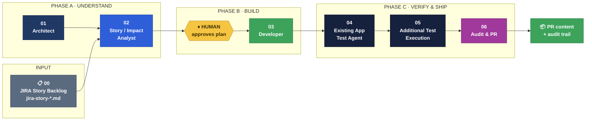
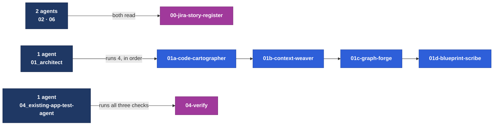
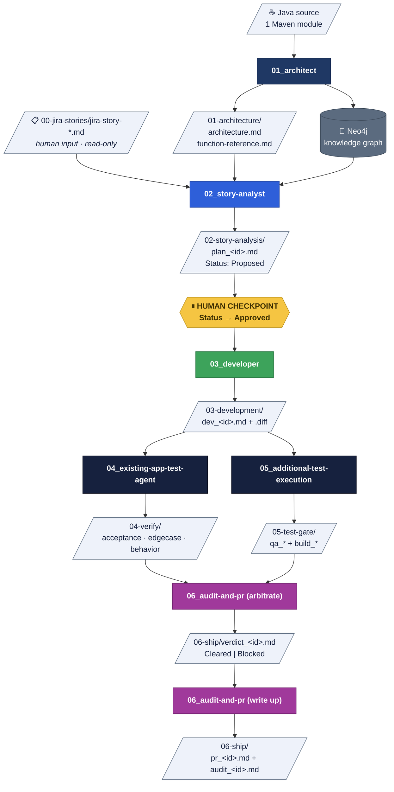
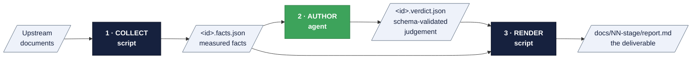
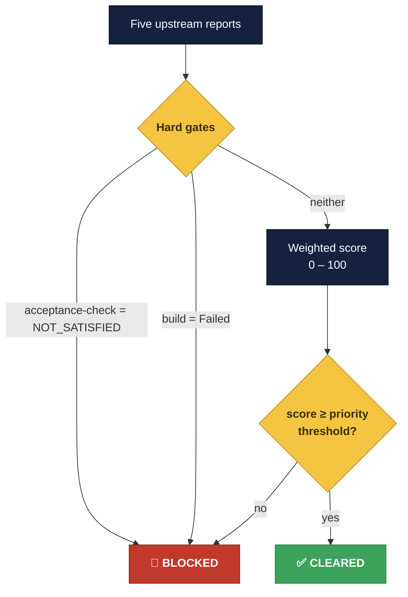

<div align="center">

# Agentic Brownfield Development Harness

**A 3-phase, 7-agent pipeline that takes a JIRA story from a backlog file to a scored, auditable
ship decision, with optional cleared-only PR publication on explicit request.**


</div>

---

## What this is

Most "AI writes your feature" demos stop at generating a diff. The hard part is everything after:
*does the change actually satisfy the story's acceptance criteria? does it survive edge cases the
plan didn't cover? did it quietly change something else? does it build? is it safe to ship?*

This harness answers those questions with **seven specialised agents** driving **nine distinct
pipeline stages**, each leaving a written artifact the next stage reads. Agent `01` owns
architecture; `02`–`03` split planning from implementation with a human approval checkpoint between
them; `04`–`06` verify, gate, and ship. No stage decides more than it should, and exactly one stage
is allowed to say a change is safe to ship.

> **Two ideas do most of the work here.**
> 1. **Facts are collected by scripts; judgement is written by agents.** They live in separate files
>    and are merged into the final report, so every factual claim is traceable and no agent can
>    quietly invent evidence.
> 2. **Normal analysis never edits the real repository.** Changes are made inside throwaway `git
>    worktree` copies that are destroyed immediately after their diff is captured. Only an explicit,
>    cleared-only PR-publish request creates and pushes a branch after revalidating the rendered
>    diff in an isolated worktree.

This harness began as a vulnerability-remediation pipeline (issue register → root cause → blast
radius → fix → verify → ship). It has been repurposed here for **brownfield feature development**:
the input is a JIRA story instead of a reported defect, and the "does this still trigger" security
check became "does every acceptance criterion actually hold in the patched code." The file-driven,
facts-vs-judgement architecture carries over unchanged.

---

## The pipeline at a glance



| Phase | Agent(s) | Question it answers |
|:--|:--|:--|
| 🔵 **A · Understand** | 01 – 02 | What does this codebase look like, and *how* should this story land in it? |
| 🟢 **B · Build** | 03 | What is the smallest correct diff that implements the approved plan? |
| 🟣 **C · Verify & Ship** | 04 – 06 | Does the change actually satisfy the story, survive edge cases, build cleanly — and is it shippable? |

---

## The 7 agents

Each agent is a markdown persona in [`agents/`](./agents/), numbered in execution order.

### 🔵 Phase A — Understand

| # | Agent | What it does | Writes |
|:--|:--|:--|:--|
| **01** | `01_architect` | Parses all Java source into structured artifacts, writes the semantic layer that gives the graph meaning, loads a Neo4j knowledge graph, and produces the architecture document. **Runs once per application**, then is reused by every later stage. | `01-architecture/` |
| **02** | `02_story-analyst` | Grounds one JIRA story in the real codebase: which files/symbols it touches, one planned change per acceptance criterion, risks, and open questions. Writes a plan at `Status: Proposed` — the human approval checkpoint. | `02-story-analysis/` |

### 🟢 Phase B — Build

| # | Agent | What it does | Writes |
|:--|:--|:--|:--|
| **03** | `03_developer` | The **only agent that writes application code** — and only for a plan a human has marked `Approved`. Edits source inside a throwaway `git worktree`, then a script captures the diff, compiles it, and removes the worktree. Refuses any plan not `Approved`. | `03-development/` |

### 🟣 Phase C — Verify & Ship

| # | Agent | What it does | Writes |
|:--|:--|:--|:--|
| **04** | `04_existing-app-test-agent` | Runs three static, reasoning-based checks against the implemented change: **acceptance-check** (does every acceptance criterion hold in the patched code?), **edge-case review** (does the change survive boundary/error conditions the plan didn't cover?), **behavior guard** (did real behavior change beyond what the plan intended?). | `04-verify/acceptance_*`, `edgecase_*`, `behavior_*` |
| **05** | `05_additional-test-execution` | Drafts exactly one new regression test, then a **script** applies and runs it for real (the agent cannot interpret or override the exit code); then runs `mvn verify` plus a dependency-tree diff — **zero agent-authored content** in that half, deliberately, because there is nothing here to author. | `05-test-gate/qa_*`, `build_*` |
| **06** | `06_audit-and-pr` | Aggregates all five upstream reports into one deterministic weighted score against hard gates — **the only agent that may declare a change safe to ship** — then writes PR content and a full chain-of-custody audit trail, **always**, Cleared or Blocked. It creates a PR only when explicitly requested for a Cleared verdict. | `06-ship/verdict_*`, `pr_*`, `audit_*` |

---

## The 12 skills

An **agent** is the persona and the judgement. A **skill** is the toolbox it drives: deterministic
Node scripts, JSON schemas, and templates. Skills live in [`skills/`](./skills/) and are numbered to
match **the agent that runs them**.



| Skill | Run by | Purpose |
|:--|:--|:--|
| `00-jira-story-register` | 02, 06 | Reads markdown story files; owns the story-file contract for both consumers |
| `01a-code-cartographer` | 01 | Parses every `pom.xml` + `.java` file into `artifacts.json` via tree-sitter |
| `01b-context-weaver` | 01 | Selects architecturally significant nodes and validates the descriptions the agent writes |
| `01c-graph-forge` | 01 | Loads artifacts **and** the semantic layer into Neo4j |
| `01d-blueprint-scribe` | 01 | Synthesizes `architecture.md` + `function-reference.md` |
| `02-story-analyst` | 02 | Story/architecture fact collection, plan schema, plan rendering |
| `03-developer` | 03 | Worktree creation, diff capture + compile verification, dev-report rendering |
| `04-verify` | 04 | One agent, three independent checks (acceptance, edge-case, behavior guard) against identical inputs |
| `05a-qa-runner` | 05 (Gate 1) | Regression-test scaffolding + deterministic test gate |
| `05b-build-gatekeeper` | 05 (Gate 2) | `mvn verify` + dependency-tree diff gate |
| `06a-merge-arbiter` | 06 (Part 1) | Deterministic scoring against externalised weights |
| `06b-scribe` | 06 (Part 2) | Chain-of-custody collection + PR/audit rendering |

> **Skill folders are numbered to match the agent that runs them**, exactly like the Architect's
> `01a`–`01d`. `00-jira-story-register` keeps its own `00` prefix — it's shared infrastructure with
> no single owning agent. This repo has no committed `mvnw` wrapper and is a single Maven module
> (no submodules), so `03-developer`, `05a-qa-runner`, and `05b-build-gatekeeper` invoke `mvn`
> directly on PATH at the worktree root rather than resolving a per-module wrapper script.

---

## How the agents connect

**The pipeline is wired through files, not through direct calls.** Each stage writes a document into
`docs/agent_output/`, and the next stage's workload is simply "every file the previous stage wrote."



**Why file-based handoff matters:** every stage is independently re-runnable, independently
auditable, and independently reviewable by a human. If one of the checks inside
`04_existing-app-test-agent` is wrong, you fix that one check and re-run it — nothing else has to
move.

---

## The pattern every stage follows

This is the single most important architectural idea in the harness. **Facts and judgement are
never written by the same thing.**



| Step | Who | Can it invent anything? |
|:--|:--|:--|
| **1 · Collect** | Deterministic Node script | ❌ No — it only reads and measures |
| **2 · Author** | The agent | ⚠️ Only within a **JSON schema**, validated before rendering |
| **3 · Render** | Deterministic Node script | ❌ No — it merges 1 and 2 into Markdown |

Because of this split, a reviewer reading any report can tell **which claims are measured and which
are reasoned** — and the agent physically cannot overwrite a measured fact.

The intermediate files live in `.github/.pipeline-context/` (working data, regeneratable at any
time):

| Folder | Contents |
|:--|:--|
| `.pipeline-context/artifacts.json` | The parsed code model |
| `.pipeline-context/context/` | Semantic descriptions (the one folder expensive to reproduce) |
| `.pipeline-context/analysis/` | Story/impact-analysis facts + agent-authored plan JSON |
| `.pipeline-context/development/` | Development results (compile facts) + agent dev-notes |
| `.pipeline-context/verify/` · `merge/` · `scribe/` | Phase C facts, scores and narratives |

---

## Human checkpoints

The pipeline stops and waits for a person **twice** — both deliberately placed where automation
should not be trusted alone.

| # | Where | What the human does | Why here |
|:--|:--|:--|:--|
| 1️⃣ | After **02 · Story / Impact Analyst** | Edits the plan's `Status` from `Proposed` → `Approved` (or `Rejected`) | **No code is written before this.** A human signs off on the *approach* while changing it is still cheap |
| 2️⃣ | After **06 · Audit & PR, Part 2 (write up)** | Explicitly requests publication for a Cleared verdict | Agent 06 revalidates the rendered diff in an isolated worktree, then creates and pushes a PR branch |

`03_developer` refuses — plainly, without negotiating — any plan not marked `Approved` before it
will implement it.

---

## The ship decision

The **Arbitrate** step of `06_audit-and-pr` is the only place a change is declared safe. Scoring is
**fully deterministic** and the weights live in an editable, auditable
[`scoring.json`](./skills/06a-merge-arbiter/scoring.json) — never in code.



**Weights** &nbsp;·&nbsp; Edge-case review `30` &nbsp;|&nbsp; Behavior `30` &nbsp;|&nbsp; QA `40`

**Priority-scaled thresholds** (from the story's `Priority` field)

| Priority | Threshold |
|:--|:--|
| 🔴 Critical | 90 |
| 🟠 High | 85 |
| 🟡 Medium | 75 |
| 🟢 Low | 65 |

> **Hard gates cannot be out-scored.** A change whose acceptance criteria still don't hold, or that
> fails the build, is Blocked no matter how well it scores elsewhere.
>
> `06_audit-and-pr` may only make a computed `Cleared` decision more conservative by overriding it to
> `Blocked`. An override requires an explicit reason citing evidence, and the rendered verdict always
> shows the computed decision and the override side by side.

---

## Status vocabulary

| Stage | Field | Values |
|:--|:--|:--|
| 02 · Plan | `Status` | `Proposed` → `Approved` \| `Rejected` &nbsp;*(human-set)* |
| 03 · Development | `Status` | `Compiled` \| `Compile Failed` \| `Refused` |
| 04 · Acceptance-check | `verdict` | `SATISFIED` \| `NOT_SATISFIED` \| `INCONCLUSIVE` |
| 04 · Edge-case review | `verdict` | `NO_GAPS_FOUND` \| `GAPS_FOUND` \| `INCONCLUSIVE` |
| 04 · Behavior guard | `verdict` | `BEHAVIOR_PRESERVED` \| `BEHAVIOR_CHANGED` \| `INCONCLUSIVE` |
| 05 · QA | `Status` | `Passed` \| `Failed` &nbsp;*(script-decided from the real exit code)* |
| 05 · Build | `Status` | `Passed` \| `Failed` &nbsp;*(script-decided from the real exit code)* |
| 06 · Verdict | `Decision` | `Cleared` \| `Blocked` |

> Stages 04–05 accept `Compile Failed` changes too — a change that doesn't build still has a real
> diff worth rechecking and independently gating. Only `Refused` (no diff captured) is out of scope.

The canonical transition and ownership rules are in [pipeline-contract.md](./pipeline-contract.md).
Run `node .github/scripts/pipeline-lint.js` after changing an agent, skill, renderer, or active
output index to catch contract drift.

---

## The input: a JIRA story backlog

Stories are plain markdown, one file per ticket — because that is closest to how a JIRA export
already reads.

📋 **[`docs/agent_output/00-jira-stories/`](../docs/agent_output/00-jira-stories/)** — one
`jira-story-<NNN>.md` file per story: title, metadata table, and `Summary` / `Description` /
`Acceptance Criteria` / `Out of Scope` / `Risks` sections.

> **The backlog is owned by whoever files the story.** Add a story by creating a new
> `jira-story-<NNN>.md` file and re-run the agents from `02_story-analyst`. Every agent that
> consumes stories treats the folder as read-only input: nothing in the pipeline writes to a story
> file, including its `Status` field — that is a human's call, same as the `Status` on an
> implementation plan further down the pipeline.

Full file contract: [`docs/agent_output/00-jira-stories/README.md`](../docs/agent_output/00-jira-stories/README.md).

---

## Repository layout

```
.github/
├── README.md                    ← you are here
│
├── agents/                      7 personas, numbered in execution order
│   ├── 00_pipeline-conductor.agent.md
│   ├── 01_architect.agent.md
│   ├── 02_story-analyst.agent.md            plan (⏸ human approval)
│   ├── 03_developer.agent.md                implement, the only agent that writes code
│   ├── 04_existing-app-test-agent.agent.md  acceptance + edge-case + behavior guard
│   ├── 05_additional-test-execution.agent.md  QA gate + build gate
│   └── 06_audit-and-pr.agent.md             arbitrate (Cleared|Blocked) then write up
│
├── skills/                      12 toolboxes, numbered to the agent(s) that run them
│   ├── 00-jira-story-register/  shared by every story-consuming agent
│   ├── 01a-code-cartographer/   ┐
│   ├── 01b-context-weaver/      ├─ the Architect runs all four, in order
│   ├── 01c-graph-forge/         │
│   ├── 01d-blueprint-scribe/    ┘
│   ├── 02-story-analyst/
│   ├── 03-developer/
│   ├── 04-verify/               all three checks run by 04_existing-app-test-agent
│   ├── 05a-qa-runner/           ┐ both run by 05_additional-test-execution
│   ├── 05b-build-gatekeeper/    ┘
│   ├── 06a-merge-arbiter/       + scoring.json
│   └── 06b-scribe/
│
├── pipeline-contract.md         canonical ownership/status/decision rules
└── scripts/pipeline-lint.js     catches contract drift

docs/agent_output/                generated deliverables — committed
├── 00-jira-stories/             jira-story-*.md  ← human input
├── 01-architecture/             architecture.md · function-reference.md
├── 02-story-analysis/           ⏸ human approves here; plan_*.md
├── 03-development/               dev_*.md/.diff
├── 04-verify/                    acceptance · edgecase · behavior
├── 05-test-gate/                 qa_*.md + build_*.md
└── 06-ship/                      verdict · pr · audit
```

Each skill folder is self-contained (its own `package.json` and scripts) so it can be lifted into
another repository on its own.

---

## Getting started

**Prerequisites** — Node.js 18+, Maven (`mvn` on PATH — this repo has no committed `mvnw`
wrapper), and optionally a Neo4j instance (Aura or Docker). Without Neo4j the pipeline still runs;
graph-backed sections are simply omitted.

```powershell
# 1. Install dependencies for the Architect's skills
cd .github/skills/01a-code-cartographer; npm install
cd ../01b-context-weaver;                npm install
cd ../01c-graph-forge;                   npm install
cd ../01d-blueprint-scribe;              npm install

# 2. Point Graph Forge at your own Neo4j instance
cd ../01c-graph-forge
Copy-Item .env.example .env      # then fill in NEO4J_URI / USERNAME / PASSWORD
```

> Skills `00`, `02`, `03`, `04`, `05a`, `05b`, `06a` and `06b` have **zero dependencies** — nothing
> to install.

**Then drive it from Copilot Chat**, one agent at a time, in numeric order:

```
run the 01_architect agent          → architecture + knowledge graph
run the 02_story-analyst agent      → grounds a JIRA story in the codebase, writes a plan
                                       (approve one by hand ⏸, then re-run to confirm)
run the 03_developer agent          → implements the approved plan as a real, compiled diff
run the 04_existing-app-test-agent agent  → acceptance-check + edge-case review + behavior guard
run the 05_additional-test-execution agent → QA gate + build gate
run the 06_audit-and-pr agent        → arbitrate, then write PR + audit content
```

Or drive the whole thing with `00_pipeline-conductor`: `analyze` to plan every queued story,
`resume` once a plan is `Approved`.

Every skill also has a `list-*.js` script that shows its workload and pipeline state without
changing anything — the fastest way to see where a given story currently stands:

```powershell
cd .github/skills/00-jira-story-register; node scripts/list-register.js
cd ../02-story-analyst;                    node scripts/list-workload.js
cd ../06a-merge-arbiter;                    node scripts/list-merge-workload.js
```

---

## Design principles

| Principle | How it is enforced |
|:--|:--|
| 🔒 **Never touch the working tree** | Every change is made inside a throwaway `git worktree` created from `HEAD` and destroyed immediately after its diff is captured |
| 📏 **Facts ≠ judgement** | Collected by scripts, authored by agents, merged by renderers — in separate files |
| 🎯 **One job per agent** | No agent both writes code and judges it; no agent both plans a change and implements it |
| ⚖️ **Determinism where it counts** | QA, build and scoring outcomes are decided by scripts and exit codes; agents cannot soften a `FAIL` |
| 📚 **Externalised knowledge** | Scoring weights are editable JSON, not logic buried in code |
| 🧾 **Always leave a record** | The Scribe writes an audit trail for Blocked changes too — a rejection is evidence, not a dead end |
| 🚫 **Read-only inputs** | The story backlog and every upstream report are never written to by a downstream stage |

---

<div align="center">

**Story format →** [`docs/agent_output/00-jira-stories/README.md`](../docs/agent_output/00-jira-stories/README.md)

</div>
