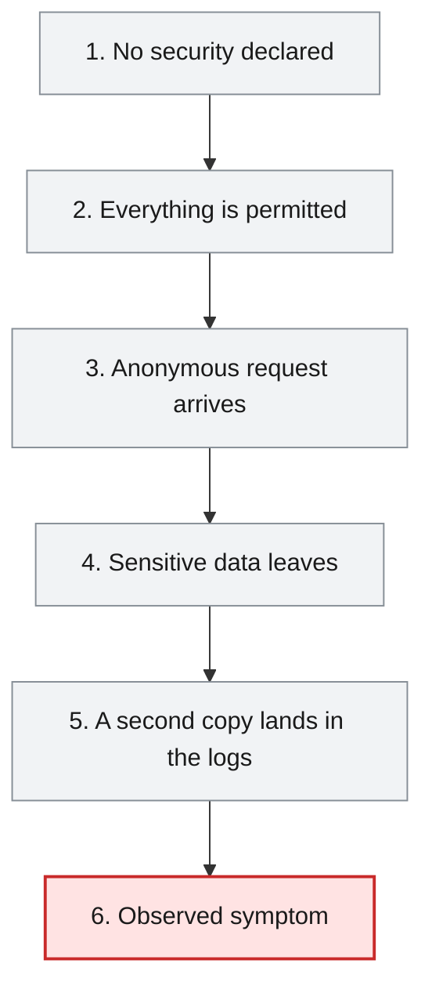
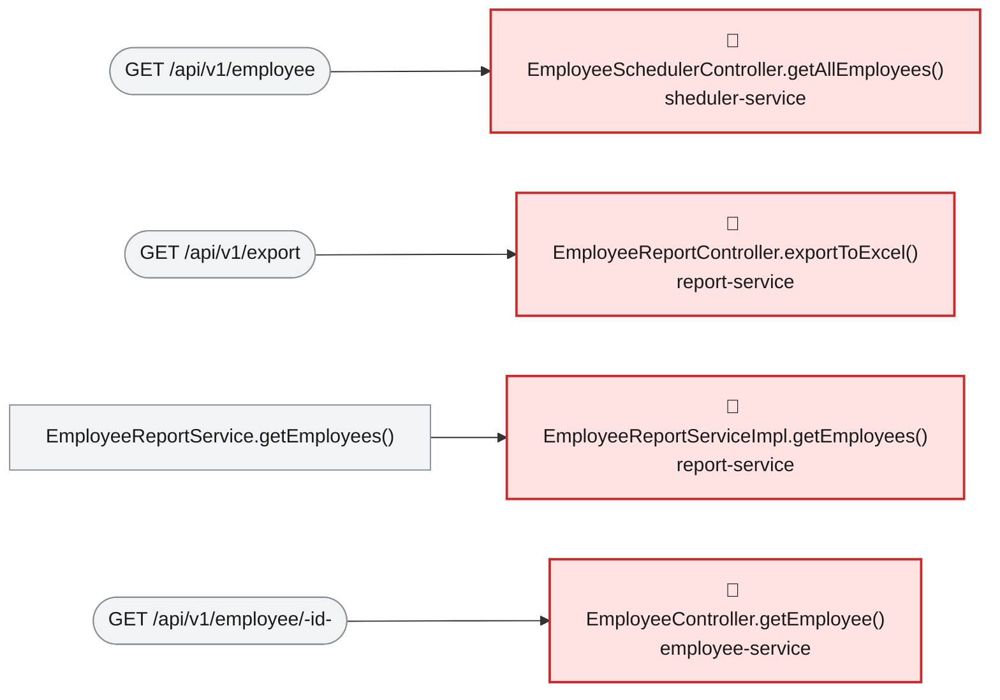

# Root Cause Analysis — ISSUE-002

## Employee PII and payroll data are exposed to unauthenticated callers and written to application logs

> Nothing in the platform ever asks a caller who they are, so anyone who can reach a service port can download the whole workforce list — names, home addresses, phone numbers and salaries — and can also add or overwrite employee records; the same personal details are additionally copied in plain text into the application logs.

_Generated by the Root Cause Analyst agent on 2026-08-16. Evidence collected 2026-08-16T07:14:01.429Z._

## At a glance

| | |
|---|---|
| **What breaks** | `GET /api/v1/employee`, `GET /api/v1/employee/{id}`, `GET /api/v1/employee/search`, `POST /api/v1/employee`, `GET /api/v1/export`, `GET /api/v1/department/salary/{minSalary}` |
| **Root cause** | The platform declares no access-control layer at all — no module pulls in a security starter and no handler performs its own identity or entitlement check — so Spring Boot's default applies and every REST handler is dispatched for anonymous callers. |
| **Where** | `employee-service/src/main/java/com/aura/vihanga/employeeservice/controller/EmployeeController.java:23` |
| **Service** | `employee-service`, `report-service`, `sheduler-service`, `department-service`, `configuaration-server`, `discovery-service` |
| **Severity** | Critical (Vulnerability) |
| **Confidence** | High |

Issue: [.github/docs/00-issues/issue-register.xlsx](../../../.github/docs/00-issues/issue-register.xlsx) · Reported 2026-08-09 by Security review - sensitive data exposure and access control · Status Open

<details><summary>Technical summary</summary>

No module in the workspace declares an authentication or authorisation mechanism: a search across all six `pom.xml` files finds no `spring-boot-starter-security`, and `src/main/java` contains no `SecurityFilterChain`, `WebSecurityConfigurerAdapter`, `@PreAuthorize`, `@Secured` or `@RolesAllowed`. With no filter chain registered, Spring Boot dispatches every `@RequestMapping` handler for anonymous requests, and no handler performs its own identity or entitlement check — so all six endpoints on the reaching paths, including two write paths, are open to any caller with network reach. The exposure is widened by two coding choices on the same paths: `EmployeeSchedulerController.getAllEmployees()` returns the persistence entity `Employee` directly rather than a DTO, and whole objects carrying salary and PII are passed to SLF4J at INFO (`EmployeeReportServiceImpl.java:63`, `DepartmentController.java:42`) and at TRACE (`EmployeeController.java:33`), with TRACE explicitly enabled for the controller package in the committed `application.properties`.

</details>

## 1. What was reported

- No module declares `spring-boot-starter-security`. A search across all six `pom.xml` files for
  `spring-boot-starter-security` returns zero matches.
- No `SecurityFilterChain`, `WebSecurityConfigurerAdapter`, `@PreAuthorize`, `@Secured` or
  `@RolesAllowed` exists anywhere in `src/main/java`.
- Consequently Spring Boot applies no filter chain, and every `@RequestMapping` handler is dispatched
  for anonymous requests. No handler performs its own identity or entitlement check.
- Requests carry no correlation to any principal, so there is **no audit trail**: it is not possible
  to determine after the fact who read or modified an employee record.
- `GET /api/v1/employee` serialises the persistence entity directly rather than a DTO, so every
  persisted field is emitted whether or not the caller needs it.
- Salary values reach the log sink at INFO on the normal export path. Log files are commonly shipped
  to aggregation platforms and retained far longer, and with broader read access, than the database
  itself.

Source: [.github/docs/00-issues/issue-register.xlsx](../../../.github/docs/00-issues/issue-register.xlsx)

## 2. What should happen — and what happens instead

```mermaid
flowchart TB
  classDef broken fill:#ffe3e3,stroke:#c92a2a,stroke-width:2px,color:#1a1a1a
  classDef warn fill:#fff3bf,stroke:#e8590c,stroke-width:2px,color:#1a1a1a
  classDef ok fill:#e6fcf5,stroke:#2f9e44,stroke-width:1px,color:#1a1a1a
  classDef neutral fill:#f1f3f5,stroke:#868e96,stroke-width:1px,color:#1a1a1a
  subgraph EXPECTED["✅ What should happen"]
    direction LR
    E0["Caller presents a<br/>credential"]:::ok
    E1["Service checks who they<br/>are"]:::ok
    E0 --> E1
    E2["Only permitted data is<br/>returned"]:::ok
    E1 --> E2
    E3["Logs record an ID, never<br/>the person"]:::ok
    E2 --> E3
  end
  subgraph ACTUAL["❌ What actually happens"]
    direction LR
    A0["No security declared"]:::neutral
    A1["Everything is permitted"]:::neutral
    A0 --> A1
    A2["Anonymous request arrives"]:::neutral
    A1 --> A2
    A3["Sensitive data leaves"]:::neutral
    A2 --> A3
    A4["A second copy lands in the<br/>logs"]:::neutral
    A3 --> A4
    A5["Observed symptom"]:::broken
    A4 --> A5
  end
```



## 3. How it fails, step by step

1. **No security declared** — No module declares `spring-boot-starter-security` and no `SecurityFilterChain`, `WebSecurityConfigurerAdapter`, `@PreAuthorize`, `@Secured` or `@RolesAllowed` exists in `src/main/java`.
2. **Everything is permitted** — With no filter chain registered, Spring Boot applies its default and dispatches every `@RequestMapping` handler for anonymous requests; no handler adds a check of its own.
3. **Anonymous request arrives** — A caller with nothing but network reach hits `GET /api/v1/employee`, `GET /api/v1/export`, `GET /api/v1/employee/{id}`, `GET /api/v1/employee/search` or `GET /api/v1/department/salary/{minSalary}`.
4. **Sensitive data leaves** — The handler runs with no principal in scope and returns the data — the raw `Employee` entity including `phoneNo` and `address` on the scheduler path, and every employee's salary as an XLSX on the export path — while `POST /api/v1/employee` and `POST /api/v1/employee/excelUpload` accept anonymous writes that behave as upserts because the client supplies the Mongo `@Id`.
5. **A second copy lands in the logs** — On the same flows, salary and PII are passed as SLF4J arguments and written to the log sink — at INFO in `report-service` and `department-service`, and at TRACE in `employee-service`, which the committed `application.properties` switches on.
6. **Observed symptom** — The complete HR dataset is downloadable in two bulk formats with no credentials, records can be overwritten anonymously, no request is attributable to any principal, and the same data persists in log aggregation.



## 4. Where the defect is

> **The platform declares no access-control layer at all — no module pulls in a security starter and no handler performs its own identity or entitlement check — so Spring Boot's default applies and every REST handler is dispatched for anonymous callers.**

**Location:** `employee-service/src/main/java/com/aura/vihanga/employeeservice/controller/EmployeeController.java:23`



The defect is an absence, and it is workspace-wide rather than local to one file: `EmployeeController` is annotated only `@RestController` / `@RequestMapping("api/v1")` with no security annotation on the type or on any handler, and the same is true of `EmployeeSchedulerController`, `EmployeeReportController` and `DepartmentController` in the evidence bundle. Because no `SecurityFilterChain` bean exists anywhere and no module's `pom.xml` declares `spring-boot-starter-security` (confirmed by the module table in section 4 of the bundle, whose key-dependency lists for all six modules contain no security starter), Spring Boot registers no authentication filter, so the anonymous request reaches the handler and the handler executes unconditionally. That single missing layer explains every reported symptom: the evidence records six endpoints on reaching paths — `GET /api/v1/employee`, `GET /api/v1/employee/{id}`, `GET /api/v1/employee/search`, `POST /api/v1/employee`, `GET /api/v1/export` and `GET /api/v1/department/salary/{minSalary}` — and each simply calls into its service layer with no principal in scope. Two details on those paths turn 'reachable' into 'bulk-extractable': `EmployeeSchedulerController.getAllEmployees()` returns `List<Employee>`, the raw `@Document` entity whose Lombok `@Data` exposes `phoneNo`, `address` and `gender`; and `EmployeeReportController.exportToExcel()` writes every employee's name and salary into a downloadable XLSX. The reported log-exposure channel is a second, independent defect on the same flows — `log.info("employee Salary {}", employeeSalaryResponse)` at `EmployeeReportServiceImpl.java:63` and `log.info("Department Controller {}", departmentResponses)` at `DepartmentController.java:42` emit salary at INFO regardless of who called, and `log.trace("... employee {}", employee)` at `EmployeeController.java:33` is active because `logging.level.com.aura.vihanga.employeeservice.controller = trace` is the first and only uncommented logging directive in `employee-service/src/main/resources/application.properties`. It is recorded here because the issue reports it, but it is not caused by the missing filter chain and would survive a fix to it.

**The code involved**

| Method | Service | File | Calls | Called by |
|---|---|---|---|---|
| `EmployeeSchedulerController.getAllEmployees()` | `sheduler-service` | [EmployeeSchedulerController.java:18-21](../../../sheduler-service/src/main/java/com/aura/vihanga/shedulerservice/controller/EmployeeSchedulerController.java#L18-L21) | `EmployeeSchedulerService.getAllEmployees()` | _entry point_ |
| `EmployeeReportController.exportToExcel()` | `report-service` | [EmployeeReportController.java:25-39](../../../report-service/src/main/java/com/aura/vihanga/reportservice/controller/EmployeeReportController.java#L25-L39) | `EmployeeReportService.getEmployees()`, `EmployeeReportService.generateExcelFile()` | _entry point_ |
| `EmployeeReportServiceImpl.getEmployees()` | `report-service` | [EmployeeReportServiceImpl.java:38-72](../../../report-service/src/main/java/com/aura/vihanga/reportservice/service/implementation/EmployeeReportServiceImpl.java#L38-L72) | `DepartmentConfigUrl.getDepartmentUrl()` | `EmployeeReportService.getEmployees()` |
| `EmployeeController.getEmployee()` | `employee-service` | [EmployeeController.java:61-69](../../../employee-service/src/main/java/com/aura/vihanga/employeeservice/controller/EmployeeController.java#L61-L69) | `EmployeeService.getEmployee()` | _entry point_ |
| `EmployeeController.createEmployee()` | `employee-service` | [EmployeeController.java:31-39](../../../employee-service/src/main/java/com/aura/vihanga/employeeservice/controller/EmployeeController.java#L31-L39) | `EmployeeService.createEmployee()` | _entry point_ |
| `EmployeeController.searchEmployees()` | `employee-service` | [EmployeeController.java:50-59](../../../employee-service/src/main/java/com/aura/vihanga/employeeservice/controller/EmployeeController.java#L50-L59) | `EmployeeService.searchEmployees()` | _entry point_ |
| `DepartmentController.getAllDepartments()` | `department-service` | [DepartmentController.java:39-44](../../../department-service/src/main/java/com/aura/vihanga/departmentservice/controller/DepartmentController.java#L39-L44) | `DepartmentService.getAllDepartments()` | _entry point_ |

<details><summary>Show the source of each method</summary>

**`EmployeeSchedulerController.getAllEmployees()`** — `sheduler-service/src/main/java/com/aura/vihanga/shedulerservice/controller/EmployeeSchedulerController.java` lines 18-21

```java
@GetMapping("employee")
    public List<Employee> getAllEmployees() {
        return schedulerService.getAllEmployees();
    }
```

**`EmployeeReportController.exportToExcel()`** — `report-service/src/main/java/com/aura/vihanga/reportservice/controller/EmployeeReportController.java` lines 25-39

```java
@GetMapping("export")
    public void exportToExcel(HttpServletResponse response) throws IOException {
        List<EmployeeSalaryResponse> employeeSalaryResponseList = reportService.getEmployees();

//        List<Employee> employees = new ArrayList<>();
//
        byte[] excelBytes = reportService.generateExcelFile(employeeSalaryResponseList);

        response.setContentType("application/vnd.openxmlformats-officedocument.spreadsheetml.sheet");
        response.setHeader("Content-Disposition", "attachment; filename=employees.xlsx");
        response.getOutputStream().write(excelBytes);
        response.getOutputStream().flush();

        log.info("Report Controller");
    }
```

**`EmployeeReportServiceImpl.getEmployees()`** — `report-service/src/main/java/com/aura/vihanga/reportservice/service/implementation/EmployeeReportServiceImpl.java` lines 38-72

```java
public List<EmployeeSalaryResponse> getEmployees() {
        log.info("Report Service");
        List<Employee> employeesList = employeeReportRepository.findAll();

//        List<String> employeeDepartmentId = employees.stream().map(employee -> employee.getDepartment()).toList();

        DepartmentResponse[] departmentResponses = builder.build().get()
                .uri(departmentConfigUrl.getDepartmentUrl(), 10000)
                .retrieve()
                .bodyToMono(DepartmentResponse[].class)
                .block();
        List<DepartmentResponse> departmentResponseList = Arrays.asList(departmentResponses);

        List<EmployeeSalaryResponse> employeeSalaryResponseList = new ArrayList<>();

        for (Employee employee : employeesList) {
            for (DepartmentResponse department : departmentResponseList) {
                if (employee.getDepartment().equals(department.getDepartmentId())) {
                    EmployeeSalaryResponse employeeSalaryResponse = EmployeeSalaryResponse.builder()
                            .employeeId(employee.getEmployeeId())
                            .name(employee.getName())
                            .departmentName(department.getDepartmentName())
                            .salary(department.getSalary())
                            .build();

                    log.info("employee Salary {}",employeeSalaryResponse);

                    employeeSalaryResponseList.add(employeeSalaryResponse);
                }
            }
        }

        return employeeSalaryResponseList;

    }
```

Reaching paths:

- `EmployeeReportController.exportToExcel()` → `EmployeeReportService.getEmployees()` → `EmployeeReportServiceImpl.getEmployees()`

**`EmployeeController.getEmployee()`** — `employee-service/src/main/java/com/aura/vihanga/employeeservice/controller/EmployeeController.java` lines 61-69

```java
@GetMapping("employee/{id}")
    public ResponseEntity<StandardResponse> getEmployee(@PathVariable("id") String employeeId) throws EmployeeNotFoundException {
        log.trace("EmployeeController - getEmployee - employeeId {}", employeeId);
        EmployeeResponse employeeResponse = employeeService.getEmployee(employeeId);

        return new ResponseEntity<StandardResponse>(
                new StandardResponse(200, "Employee Fetch Successfully", employeeResponse), HttpStatus.OK
        );
    }
```

**`EmployeeController.createEmployee()`** — `employee-service/src/main/java/com/aura/vihanga/employeeservice/controller/EmployeeController.java` lines 31-39

```java
@PostMapping("employee")
    public ResponseEntity<StandardResponse> createEmployee(@RequestBody Employee employee) {
        log.trace("EmployeeController - createEmployee - employee {}", employee);
        EmployeeResponse employeeResponse = employeeService.createEmployee(employee);

        return new ResponseEntity<StandardResponse>(
                new StandardResponse(201, "Employee Created Successfully", employeeResponse), HttpStatus.CREATED
        );
    }
```

**`EmployeeController.searchEmployees()`** — `employee-service/src/main/java/com/aura/vihanga/employeeservice/controller/EmployeeController.java` lines 50-59

```java
@GetMapping("employee/search")
    public ResponseEntity<StandardResponse> searchEmployees(@RequestParam("name") String name,
                                                            @RequestParam(value = "department", required = false) String department) {
        log.trace("EmployeeController - searchEmployees - name {} department {}", name, department);
        List<EmployeeResponse> employeeResponses = employeeService.searchEmployees(name, department);

        return new ResponseEntity<StandardResponse>(
                new StandardResponse(200, "Employee Search Completed Successfully", employeeResponses), HttpStatus.OK
        );
    }
```

**`DepartmentController.getAllDepartments()`** — `department-service/src/main/java/com/aura/vihanga/departmentservice/controller/DepartmentController.java` lines 39-44

```java
@GetMapping("department/salary/{minSalary}")
    public List<DepartmentResponse> getAllDepartments(@PathVariable("minSalary") double minSalary) {
        List<DepartmentResponse> departmentResponses = departmentService.getAllDepartments(minSalary);
        log.info("Department Controller {}", departmentResponses);
        return  departmentResponses;
    }
```

</details>

## 5. What it means

Four modules carry affected handlers in the call graph — `employee-service`, `report-service`, `sheduler-service` and `department-service` — and six endpoints sit on reaching paths, of which two (`POST /api/v1/employee`, and the bulk `POST /api/v1/employee/excelUpload` on the same controller) are write paths. Any caller who can open a connection to a service port can read the complete workforce dataset: names, home addresses, phone numbers and gender via `GET /api/v1/employee`, one employee's full record via `GET /api/v1/employee/{id}`, arbitrary subsets via `GET /api/v1/employee/search`, every employee's salary as a spreadsheet via `GET /api/v1/export`, and departmental salary bands via `GET /api/v1/department/salary/{minSalary}`. The same caller can create or overwrite employee records, because the client supplies the Mongo `@Id` and `save()`/`saveAll()` therefore upsert. Since no request carries a principal, none of this is attributable — a breach could not be scoped after the fact. The issue additionally reports the same absence on `configuaration-server` and `discovery-service`; both appear in the affected module table but expose framework-provided surfaces rather than handlers written here, so the call graph shows no Java entry point for them. Independently of the REST surface, salary and PII reach the log sink on the ordinary export and department paths at INFO and on the employee-service controller path at TRACE, so the data also lives in whatever aggregation platform receives those logs, typically with a wider audience and longer retention than the database.

**Why Critical severity:** Critical is right, and it is the floor rather than the ceiling. The exposure needs no crafted payload, no precondition and no credential — it is 100% reproducible on every request in every environment — and it covers regulated personal data plus payroll, in bulk, with an anonymous write path alongside the read paths. Loss of attribution compounds it: there is no audit trail with which to bound an incident. The absence of this layer is also what makes the other two registered issues reachable, since both sit behind the same open surface.

## 6. Why it happened

- Security was never part of the module template — all six modules were scaffolded from the same Spring Cloud starter set (see the module table in the evidence bundle) and none of them carries a security dependency, so there was no in-repo example to copy.
- Controllers return persistence entities (`List<Employee>` on the scheduler path) instead of purpose-built DTOs, so no layer exists where field-level exposure would have to be decided deliberately.
- No input-validation layer exists either — the issue records zero matches for `@Valid` / `javax.validation` in `src/main/java` — indicating the HTTP boundary was never treated as a trust boundary.
- Debug-grade logging (`logging.level.…controller = trace`) was committed rather than kept local, so the TRACE-level PII path is the default in every environment.
- Whole domain objects are passed as SLF4J format arguments, which makes Lombok's generated `toString()` — and therefore every field, including `phoneNo` and `address` — the thing that actually gets logged.

## 7. How to fix it

Introduce the missing layer rather than hardening individual handlers: add `spring-boot-starter-security` to each business service and declare a `SecurityFilterChain` that denies by default, permitting only explicitly designated health/readiness endpoints, then authorise each handler against the principal and the specific record or dataset requested. Deny-by-default is what addresses the cause — per-endpoint checks would leave the next endpoint added just as open. Alongside it, close the two amplifiers on the same paths: project responses into DTOs so `GET /api/v1/employee` stops returning the `Employee` entity, and stop passing PII and salary objects to loggers. Treat the log channel as its own change: it is not fixed by the filter chain and must be corrected even after the REST surface is closed.

| File | Change |
|---|---|
| [pom.xml](../../../employee-service/pom.xml) | Add `spring-boot-starter-security` (and the OAuth2 resource-server starter if tokens are issued centrally) so a filter chain exists at all; repeat for `report-service`, `sheduler-service` and `department-service`. |
| [EmployeeController.java](../../../employee-service/src/main/java/com/aura/vihanga/employeeservice/controller/EmployeeController.java) | Authorise each handler against the caller — read of `employee/{id}` restricted to the record owner or an HR role, `employee/search`, `POST employee` and `employee/excelUpload` to a privileged role — and remove the whole-`Employee` TRACE log at line 33, logging `employeeId` only. |
| [application.properties](../../../employee-service/src/main/resources/application.properties) | Remove `logging.level.com.aura.vihanga.employeeservice.controller = trace` so debug-grade logging is not the committed default. |
| [EmployeeSchedulerController.java](../../../sheduler-service/src/main/java/com/aura/vihanga/shedulerservice/controller/EmployeeSchedulerController.java) | Require an authenticated principal and return a DTO projection instead of `List<Employee>`, so `phoneNo`, `address` and `gender` are not serialised to callers that have no need for them. |
| [EmployeeReportController.java](../../../report-service/src/main/java/com/aura/vihanga/reportservice/controller/EmployeeReportController.java) | Restrict `GET /api/v1/export` to a dedicated payroll role — it should not be readable by an ordinary authenticated user — and emit an audit event carrying the acting principal. |
| [EmployeeReportServiceImpl.java](../../../report-service/src/main/java/com/aura/vihanga/reportservice/service/implementation/EmployeeReportServiceImpl.java) | Remove the per-employee `log.info("employee Salary {}", employeeSalaryResponse)` at line 63; if a progress signal is needed, log a count or an `employeeId`, never the salary. |
| [DepartmentController.java](../../../department-service/src/main/java/com/aura/vihanga/departmentservice/controller/DepartmentController.java) | Restrict `GET /api/v1/department/salary/{minSalary}` to the same privileged role, and replace `log.info("Department Controller {}", departmentResponses)` at line 42 with a count rather than the salary-bearing list. |
| [configuaration-server](../../../configuaration-server) | Require authentication on the config server and encrypt secrets at rest with `{cipher}`, so the datasource URI and credentials are not served to anonymous callers. |
| [discovery-service](../../../discovery-service) | Require credentials for Eureka registration and for the dashboard, so the registry cannot be enumerated and a rogue instance cannot be registered under a legitimate service name. |

<details><summary>Sketch of the change</summary>

```java
// Deny by default, then open only what must be open
@Bean
SecurityFilterChain filterChain(HttpSecurity http) throws Exception {
    return http
        .authorizeHttpRequests(auth -> auth
            .requestMatchers("/actuator/health", "/actuator/info").permitAll()
            .requestMatchers(HttpMethod.GET, "/api/v1/export").hasRole("PAYROLL")
            .anyRequest().authenticated())
        .oauth2ResourceServer(oauth -> oauth.jwt(Customizer.withDefaults()))
        .csrf(csrf -> csrf.disable())
        .build();
}

// Log the identifier, never the person
log.info("exported salary row for employeeId={}", employeeSalaryResponse.getEmployeeId());
```

</details>

## 8. How to check the fix worked

1. Replay every step of the issue's reproduction from a machine with no credentials and confirm each now returns 401: `curl -s -o /dev/null -w "%{http_code}\n" http://localhost:8503/api/v1/employee`, the same for `:8502/api/v1/export`, `/api/v1/employee/{id}`, `/api/v1/employee/search` and `/api/v1/department/salary/{minSalary}`.
2. Repeat the anonymous `POST /api/v1/employee` from step 5 of the issue and confirm it is rejected with 401 and that no `EMP-INJECTED` document appears in the collection; repeat for `POST /api/v1/employee/excelUpload`.
3. Authenticate as an ordinary (non-payroll) user and confirm `GET /api/v1/export` and `GET /api/v1/department/salary/{minSalary}` return 403, proving authorisation is enforced and not merely authentication.
4. Add a slice test per controller asserting that an unauthenticated request to each handler returns 401, so a newly added endpoint cannot silently inherit anonymous access.
5. Call `GET /api/v1/employee` as an authorised user and assert the response body contains no `phoneNo` or `address` key, confirming the DTO projection replaced the entity.
6. Run an authorised export end to end, then grep the `report-service`, `department-service` and `employee-service` logs for a known salary value, a known phone number and a known address — all three must return zero matches.
7. Confirm `logging.level.com.aura.vihanga.employeeservice.controller` no longer appears in the committed `application.properties`, and that the employee-service log shows no `Employee` object dumps at default level.
8. Confirm `curl -s http://localhost:8504/employee/default` no longer returns the config store without credentials, and that the Eureka dashboard and registration API require them.

## 9. How to stop it happening again

- Make deny-by-default a shared module baseline: put the `SecurityFilterChain` in a common starter that every service inherits, so a new service is closed before it has any endpoints.
- Add a build-time check (ArchUnit or equivalent) that fails when a `@RestController` handler is reachable without a security annotation or an entry in the filter chain's authorisation rules.
- Add an automated smoke test to CI that calls every documented endpoint in `.github/docs/01-architecture/architecture.md` anonymously and fails the build on any response that is not 401.
- Forbid passing domain or DTO objects as logger arguments — enforce with a static analysis rule so Lombok `toString()` cannot leak fields — and require field-level classification for anything derived from the `employee` collection.
- Ban environment-specific logging levels from committed `application.properties`; supply them per environment through the config server instead.
- Require an audit event carrying the acting principal for every read or write of employee or salary data, so future incidents can be scoped.

## 10. Open questions

- The issue reports two independent defects under one id: the missing access-control layer (Channel A), diagnosed here as the root cause, and PII/salary written to logs (Channel B), which shares none of its mechanism and would survive the fix. Channel B should be raised as its own issue so it is tracked and closed separately — the log changes are listed above so they are not lost in the meantime.
- Whether a network-level control (service mesh, ingress allow-list, private subnet) currently sits in front of these ports is not visible in the repository, so the real-world reachability of the endpoints cannot be confirmed from the evidence — only that the application itself enforces nothing.
- The intended role model is not recorded anywhere in the workspace, so which principals should be able to read PII versus payroll is an unanswered design decision; the fix assumes a distinct privileged role for salary data but that needs confirming with the data owner.
- `configuaration-server` and `discovery-service` are named in the issue but contribute no handlers to the call graph, so their exposure was not verified against code here — it needs checking against their running configuration rather than the static evidence.
- Whether the log sink for these services is already shipping to an aggregation platform, and with what retention and read access, is outside the evidence — it determines how much historical PII must be purged once the logging is fixed.

## Appendix — how this was determined

| Input | Detail |
|---|---|
| Issue report | [.github/docs/00-issues/issue-register.xlsx](../../../.github/docs/00-issues/issue-register.xlsx) |
| Architecture document | [.github/docs/01-architecture/architecture.md](../../../.github/docs/01-architecture/architecture.md) |
| Function reference | [.github/docs/01-architecture/function-reference.md](../../../.github/docs/01-architecture/function-reference.md) |
| Code scan | `.github/.architect/artifacts.json` (generated 2026-08-16T07:12:00.733Z) |
| Knowledge graph | Neo4j, traversal depth 4 |

<details><summary>Architecture observations considered</summary>

- Each service (`department-service`, `employee-service`, `report-service`, `sheduler-service`) follows the same layered convention: `controller` → `service` → `repository` → `model`/`entity`, backed by MongoDB repositories.
- `configuaration-server` and `discovery-service` are infrastructure services (Spring Cloud Config + Eureka) that every business service depends on at startup via `bootstrap.properties`.
- No Feign clients were detected — cross-service calls, if any, likely go through `RestTemplate`/`WebClient` rather than declarative Feign interfaces. Worth confirming if service-to-service coupling should show up as graph edges.
- The generated Neo4j graph can be queried directly (e.g. `MATCH (m:Module)-[:CONTAINS]->(t:Type) RETURN m.name, count(t)`) for deeper, ad-hoc architecture questions beyond this static document.

</details>

<details><summary>Graph queries executed</summary>

**upstream callers**

```cypher
MATCH path = (caller:Method)-[:CALLS*1..4]->(target:Method {id: $id})
         RETURN [n IN nodes(path) | n.id] AS chain LIMIT 200
```

**downstream callees**

```cypher
MATCH path = (target:Method {id: $id})-[:CALLS*1..4]->(callee:Method)
         RETURN [n IN nodes(path) | n.id] AS chain LIMIT 200
```

**owning type, module and exposed endpoints**

```cypher
MATCH (ty:Type)-[:HAS_METHOD]->(m:Method {id: $id})
         OPTIONAL MATCH (ty)-[:EXPOSES]->(e:Endpoint)
         RETURN ty.id AS typeId, ty.name AS typeName, ty.module AS module,
                collect(DISTINCT e.id) AS endpoints
```

**types depending on the owning type**

```cypher
MATCH (other:Type)-[:USES]->(ty:Type)-[:HAS_METHOD]->(:Method {id: $id})
         RETURN DISTINCT other.id AS typeId, other.name AS name, other.module AS module
```

**modules reaching the focus method**

```cypher
MATCH (caller:Method)-[:CALLS*1..4]->(:Method {id: $id})
         MATCH (ct:Type)-[:HAS_METHOD]->(caller)
         RETURN DISTINCT ct.module AS module
```

**graph node counts**

```cypher
MATCH (n) RETURN labels(n)[0] AS label, count(*) AS count ORDER BY count DESC
```

**graph relationship counts**

```cypher
MATCH ()-[r]->() RETURN type(r) AS type, count(*) AS count ORDER BY count DESC
```

**maven dependencies of affected modules**

```cypher
MATCH (m:Module)-[:DEPENDS_ON]->(dep:MavenDependency)
       WHERE m.name IN $modules
       RETURN m.name AS module, collect(dep.ga) AS dependencies
```

</details>

---

The reported symptom, the code table, the source and the call paths are rendered verbatim from the issue, the code scan and the knowledge graph. The plain-language summary, the causal chain, the root cause, what it means, why it happened, the fix, the verification steps and the prevention measures are the judgement of the Root Cause Analyst agent.
