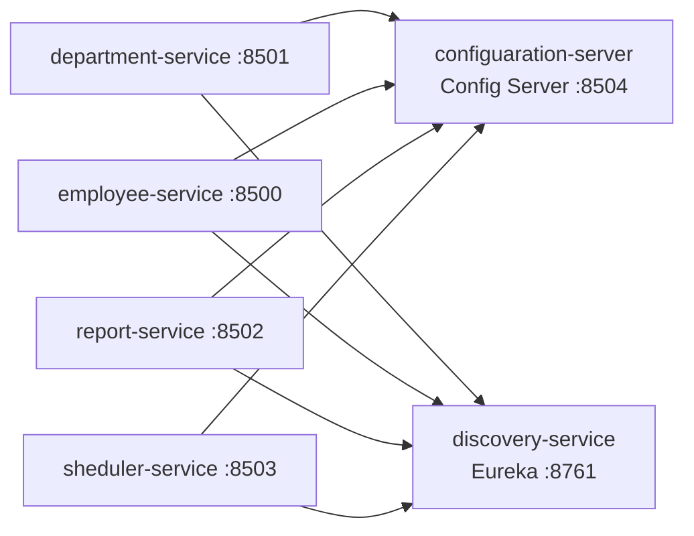

# Sample Java Project — Spring Boot Microservices

A Spring Cloud based microservices system for managing employees, departments, reports and
scheduled jobs, backed by a config server and a Eureka service registry.

## Architecture



## Services

| Service | Description | Default Port | Depends On |
|---|---|---|---|
| [configuaration-server](configuaration-server) | Spring Cloud Config Server, backed by a Git-hosted properties repo | 8504 | — |
| [discovery-service](discovery-service) | Eureka service registry | 8761 | — |
| [department-service](department-service) | Department CRUD API (`/api/v1`), MongoDB-backed | 8501 | config-server, discovery |
| [employee-service](employee-service) | Employee CRUD API (`/api/v1`), MongoDB-backed | 8500 | config-server, discovery |
| [report-service](report-service) | Employee report generation API (`/api/v1`) | 8502 | config-server, discovery |
| [sheduler-service](sheduler-service) | Scheduled jobs API (`/api/v1`) | 8503 | config-server, discovery |

> Ports above are the intended values (some are currently commented out in
> `application.properties` in favor of Spring Boot defaults — update as needed per environment).

## Tech Stack

- Java 17
- Spring Boot 2.7.12 / Spring Cloud 2021.0.7
- Spring Cloud Config, Netflix Eureka
- Spring Data MongoDB
- Lombok
- Cucumber + JUnit for BDD/unit tests
- Maven (with Maven Wrapper)

## Prerequisites

- JDK 17+
- Maven (or use the bundled `mvnw` / `mvnw.cmd` wrapper)
- A reachable MongoDB instance (connection string configured per service)

## Getting Started

Start the services in this order so that config and discovery are available first:

```powershell
# 1. Config Server
cd configuaration-server
./mvnw spring-boot:run

# 2. Discovery Service (Eureka)
cd discovery-service
./mvnw spring-boot:run

# 3. Feature services (any order)
cd department-service
./mvnw spring-boot:run

cd employee-service
./mvnw spring-boot:run

cd report-service
./mvnw spring-boot:run

cd sheduler-service
./mvnw spring-boot:run
```

Each service reads its shared configuration from the config server via `bootstrap.properties`
(`spring.cloud.config.uri`) and registers itself with Eureka once started.

## Building

Build an individual service:

```powershell
cd department-service
./mvnw clean package
```

Each module packages as a WAR file (see `pom.xml`), matching the Tomcat-based deployment used in
the [Jenkinsfile](Jenkinsfile).

## Testing

Run unit and Cucumber tests for a service:

```powershell
cd employee-service
./mvnw test
```

Cucumber feature files live under each service's `src/test/resources/features` (or
`src/main/resources/features`).

## Repository Structure

```
configuaration-server/   Spring Cloud Config Server
discovery-service/       Eureka service registry
department-service/      Department management microservice
employee-service/        Employee management microservice
report-service/          Employee reporting microservice
sheduler-service/        Scheduled jobs microservice
Jenkinsfile              CI pipeline: build, test-gate, and deploy to Tomcat
```

## CI/CD

The [Jenkinsfile](Jenkinsfile) checks out the repository, gates deployment on unit test coverage
and Cucumber test pass rate, then builds and deploys each service as a WAR to a local Tomcat
instance.
