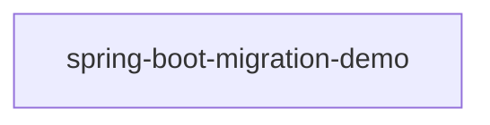

# Architecture Overview

_Generated by the Architect agent (Blueprint Scribe) from a scan on 2026-09-22T03:57:26.385Z._

For a per-class, per-method breakdown (signatures, source locations, resolved call graph, and full source text), see [function-reference.md](./function-reference.md).

## Modules

This workspace is a multi-module Maven build of 1 Spring Boot services, each independently deployable, coordinated through a config server and a Eureka discovery server.

| Module | Packaging | Key Spring dependencies |
|---|---|---|
| `spring-boot-migration-demo` | jar | spring-boot-starter-web, spring-boot-starter-data-jpa, spring-boot-starter-validation, spring-boot-starter-security, spring-boot-starter-actuator, spring-boot-starter-test |

## Service Map

## Type Breakdown by Layer

Counts are heuristic, based on annotations and naming conventions (e.g. `@RestController` → Controller, `@Repository`/`*Repository` interfaces → Repository).

| Module | Controller | Service | Repository | Entity/Document | DTO | Configuration | Exception Handler | Exception | Other |
|---|---|---|---|---|---|---|---|---|---|
| `spring-boot-migration-demo` | 1 | 1 | 1 | 1 | 3 | 2 | 1 | 2 | 5 |

## REST API Surface

| Method | Path | Handler | Module |
|---|---|---|---|
| `POST` | `/api/v1/employees` | EmployeeController.createEmployee() | `spring-boot-migration-demo` |
| `GET` | `/api/v1/employees` | EmployeeController.getAllEmployees() | `spring-boot-migration-demo` |
| `GET` | `/api/v1/employees/{id}` | EmployeeController.getEmployeeById() | `spring-boot-migration-demo` |
| `PUT` | `/api/v1/employees/{id}` | EmployeeController.updateEmployee() | `spring-boot-migration-demo` |
| `DELETE` | `/api/v1/employees/{id}` | EmployeeController.deleteEmployee() | `spring-boot-migration-demo` |
| `GET` | `/api/v1/employees/high-earners` | EmployeeController.getHighEarners() | `spring-boot-migration-demo` |
| `GET` | `/api/v1/employees/search` | EmployeeController.searchByDepartment() | `spring-boot-migration-demo` |

## Frameworks & External Types in Play

Base classes/interfaces referenced by this codebase that are not defined in it (a proxy for the frameworks the code depends on):

- `RuntimeException` — referenced by 2 type(s)
- `CommandLineRunner` — referenced by 1 type(s)
- `HealthIndicator` — referenced by 1 type(s)
- `ResponseEntityExceptionHandler` — referenced by 1 type(s)
- `JpaRepository` — referenced by 1 type(s)

_Live Neo4j snapshot unavailable (graph-forge/.env not configured or instance unreachable) — showing static artifact analysis only._

## Ideas & Observations

- Each service (`department-service`, `employee-service`, `report-service`, `sheduler-service`) follows the same layered convention: `controller` → `service` → `repository` → `model`/`entity`, backed by MongoDB repositories.
- `configuaration-server` and `discovery-service` are infrastructure services (Spring Cloud Config + Eureka) that every business service depends on at startup via `bootstrap.properties`.
- No Feign clients were detected — cross-service calls, if any, likely go through `RestTemplate`/`WebClient` rather than declarative Feign interfaces. Worth confirming if service-to-service coupling should show up as graph edges.
- The generated Neo4j graph can be queried directly (e.g. `MATCH (m:Module)-[:CONTAINS]->(t:Type) RETURN m.name, count(t)`) for deeper, ad-hoc architecture questions beyond this static document.
