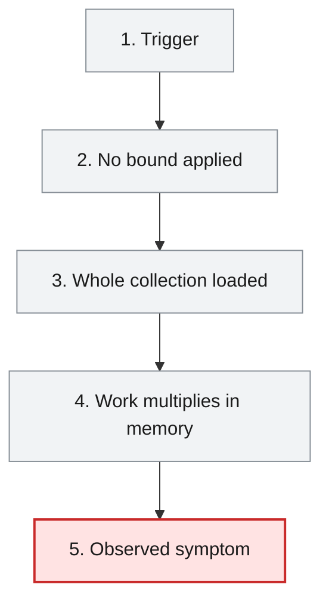

# Root Cause Analysis — ISSUE-001

## Unbounded repository findAll() reads whole collections into memory across multiple services

> The employee list and the export report are fetched by asking the database for every single employee record at once, with no page size and no filter, so the amount of work each request creates grows with the size of the workforce data instead of with what the caller actually asked for.

_Generated by the Root Cause Analyst agent on 2026-08-16. Evidence collected 2026-08-16T07:13:45.475Z._

## At a glance

| | |
|---|---|
| **What breaks** | `GET /api/v1/employee`, `GET /api/v1/export` |
| **Root cause** | The service-layer read methods delegate to the inherited, unparameterised `findAll()` on their `MongoRepository`, so the query carries no page, limit, filter or projection and the result set is sized by the collection rather than by the request. |
| **Where** | `sheduler-service/src/main/java/com/aura/vihanga/shedulerservice/service/implementation/EmployeeSchedulerServiceImpl.java:18` |
| **Service** | `sheduler-service`, `report-service` |
| **Severity** | High (Vulnerability) |
| **Confidence** | High |

Issue: [docs/agent_output/00-issues/issue-register.xlsx](../../../docs/agent_output/00-issues/issue-register.xlsx) · Reported 2026-08-06 by Architecture review - performance and availability · Status Open

<details><summary>Technical summary</summary>

Both read paths in the affected area delegate straight to Spring Data's inherited `MongoRepository.findAll()`, which issues an unfiltered collection scan and materialises the whole `employee` collection as a `List` before any application code runs. `EmployeeSchedulerServiceImpl.getAllEmployees()` (sheduler-service, line 18) and `EmployeeReportServiceImpl.getEmployees()` (report-service, line 40) both do this with no `Pageable`, `Sort`, `Limit`, query argument or field projection. Because the result set is bounded by collection size rather than by the request, response size, heap use and Mongo load all scale with the data, and `report-service` compounds it by joining the full list against the department list in a nested loop and buffering the whole XLSX workbook in memory.

</details>

## 1. What was reported

**Call site 1 — `sheduler-service`**

- `GET /api/v1/employee` returns every employee document in the collection, serialised in full, with
  no page size, no limit parameter and no filtering. The entity is returned directly, so every
  persisted field is exposed to the caller.
- The scheduled job `WomenDaySchedulerImpl.printWomenDayMessage()` calls the same method and then
  filters for `GenderType.FEMALE` **in Java**, after the entire collection has already been
  transferred and mapped. The filter is never pushed down to the database.

**Call site 2 — `report-service`**

- `GET /api/v1/export` loads every employee via `findAll()`, then performs an outbound HTTP call to
  `department-service` for the department list, and then joins the two lists with a nested
  `for` loop (employees × departments) purely in memory.
- The complete joined result and the generated XLSX workbook are both held in the heap at the same
  time, and the workbook is buffered into a `ByteArrayOutputStream` before a single byte is written
  to the response.

Source: [docs/agent_output/00-issues/issue-register.xlsx](../../../docs/agent_output/00-issues/issue-register.xlsx)

## 2. What should happen — and what happens instead

```mermaid
flowchart TB
  classDef broken fill:#ffe3e3,stroke:#c92a2a,stroke-width:2px,color:#1a1a1a
  classDef warn fill:#fff3bf,stroke:#e8590c,stroke-width:2px,color:#1a1a1a
  classDef ok fill:#e6fcf5,stroke:#2f9e44,stroke-width:1px,color:#1a1a1a
  classDef neutral fill:#f1f3f5,stroke:#868e96,stroke-width:1px,color:#1a1a1a
  subgraph EXPECTED["✅ What should happen"]
    direction LR
    E0["Caller asks for a page of<br/>employees"]:::ok
    E1["Service requests only that<br/>page"]:::ok
    E0 --> E1
    E2["Database returns a bounded<br/>result"]:::ok
    E1 --> E2
    E3["Memory stays flat as data<br/>grows"]:::ok
    E2 --> E3
  end
  subgraph ACTUAL["❌ What actually happens"]
    direction LR
    A0["Trigger"]:::neutral
    A1["No bound applied"]:::neutral
    A0 --> A1
    A2["Whole collection loaded"]:::neutral
    A1 --> A2
    A3["Work multiplies in memory"]:::neutral
    A2 --> A3
    A4["Observed symptom"]:::broken
    A3 --> A4
  end
```



## 3. How it fails, step by step

1. **Trigger** — A client calls `GET /api/v1/employee` or `GET /api/v1/export`, or the Women's Day cron job fires.
2. **No bound applied** — The service method calls `findAll()` with no `Pageable`, `Sort`, `Limit`, query filter or projection.
3. **Whole collection loaded** — MongoDB scans the entire `employee` collection and Spring Data materialises every document into a `List` on the heap.
4. **Work multiplies in memory** — `report-service` then joins that full list against the department list in a nested `for` loop and buffers the complete XLSX into a `ByteArrayOutputStream`, while `sheduler-service` filters and serialises the full entity list in Java.
5. **Observed symptom** — Response size, latency, GC pressure and heap use all rise with collection size and with concurrency, up to `OutOfMemoryError`, and the caller receives every persisted field of every employee.



## 4. Where the defect is

> **The service-layer read methods delegate to the inherited, unparameterised `findAll()` on their `MongoRepository`, so the query carries no page, limit, filter or projection and the result set is sized by the collection rather than by the request.**

**Location:** `sheduler-service/src/main/java/com/aura/vihanga/shedulerservice/service/implementation/EmployeeSchedulerServiceImpl.java:18`


`EmployeeSchedulerRepository` and `EmployeeReportRepository` both `extend MongoRepository<Employee, String>`, so `findAll()` is inherited from the framework base type — the evidence bundle records exactly this for both collaborator tables ('yes — findAll() (inherited from a framework base type — no method node)'), and no bounding argument is passed at either call site (EmployeeSchedulerServiceImpl.java:18, EmployeeReportServiceImpl.java:40). That single unbounded call is what produces every reported symptom, because the reaching paths in section 2 of the bundle put it directly behind two public entry points and one cron trigger: `EmployeeSchedulerController.getAllEmployees() → EmployeeSchedulerService.getAllEmployees() → EmployeeSchedulerServiceImpl.getAllEmployees()` (`GET /api/v1/employee`), `WomenDaySchedulerImpl.printWomenDayMessage() → …` (`@Scheduled(cron = "0 0 0 8 3 *")`), and `EmployeeReportController.exportToExcel() → EmployeeReportService.getEmployees() → EmployeeReportServiceImpl.getEmployees()` (`GET /api/v1/export`). Nothing between the HTTP boundary and the repository narrows the result: `EmployeeSchedulerController.getAllEmployees()` declares no parameters at all, and `WomenDaySchedulerImpl.printWomenDayMessage()` filters `GenderType.FEMALE` in a Java stream after the full list has already been transferred and mapped, which is why the filter never reaches the database.

**The code involved**

| Method | Service | File | Calls | Called by |
|---|---|---|---|---|
| `EmployeeSchedulerServiceImpl.getAllEmployees()` | `sheduler-service` | [EmployeeSchedulerServiceImpl.java:16-19](../../../sheduler-service/src/main/java/com/aura/vihanga/shedulerservice/service/implementation/EmployeeSchedulerServiceImpl.java#L16-L19) | _none_ | `EmployeeSchedulerService.getAllEmployees()` |
| `EmployeeReportServiceImpl.getEmployees()` | `report-service` | [EmployeeReportServiceImpl.java:38-72](../../../report-service/src/main/java/com/aura/vihanga/reportservice/service/implementation/EmployeeReportServiceImpl.java#L38-L72) | `DepartmentConfigUrl.getDepartmentUrl()` | `EmployeeReportService.getEmployees()` |
| `WomenDaySchedulerImpl.printWomenDayMessage()` | `sheduler-service` | [WomenDaySchedulerImpl.java:19-29](../../../sheduler-service/src/main/java/com/aura/vihanga/shedulerservice/service/implementation/WomenDaySchedulerImpl.java#L19-L29) | `EmployeeSchedulerService.getAllEmployees()` | _entry point_ |
| `EmployeeSchedulerController.getAllEmployees()` | `sheduler-service` | [EmployeeSchedulerController.java:18-21](../../../sheduler-service/src/main/java/com/aura/vihanga/shedulerservice/controller/EmployeeSchedulerController.java#L18-L21) | `EmployeeSchedulerService.getAllEmployees()` | _entry point_ |
| `EmployeeReportController.exportToExcel()` | `report-service` | [EmployeeReportController.java:25-39](../../../report-service/src/main/java/com/aura/vihanga/reportservice/controller/EmployeeReportController.java#L25-L39) | `EmployeeReportService.getEmployees()`, `EmployeeReportService.generateExcelFile()` | _entry point_ |

<details><summary>Show the source of each method</summary>

**`EmployeeSchedulerServiceImpl.getAllEmployees()`** — `sheduler-service/src/main/java/com/aura/vihanga/shedulerservice/service/implementation/EmployeeSchedulerServiceImpl.java` lines 16-19

```java
@Override
    public List<Employee> getAllEmployees() {
        return employeeSchedulerRepository.findAll();
    }
```

Reaching paths:

- `EmployeeSchedulerController.getAllEmployees()` → `EmployeeSchedulerService.getAllEmployees()` → `EmployeeSchedulerServiceImpl.getAllEmployees()`
- `WomenDaySchedulerImpl.printWomenDayMessage()` → `EmployeeSchedulerService.getAllEmployees()` → `EmployeeSchedulerServiceImpl.getAllEmployees()`

**`EmployeeReportServiceImpl.getEmployees()`** — `report-service/src/main/java/com/aura/vihanga/reportservice/service/implementation/EmployeeReportServiceImpl.java` lines 38-72

```java
public List<EmployeeSalaryResponse> getEmployees() {
        log.info("Report Service");
        List<Employee> employeesList = employeeReportRepository.findAll();

//        List<String> employeeDepartmentId = employees.stream().map(employee -> employee.getDepartment()).toList();

        DepartmentResponse[] departmentResponses = builder.build().get()
                .uri(departmentConfigUrl.getDepartmentUrl(), 10000)
                .retrieve()
                .bodyToMono(DepartmentResponse[].class)
                .block();
        List<DepartmentResponse> departmentResponseList = Arrays.asList(departmentResponses);

        List<EmployeeSalaryResponse> employeeSalaryResponseList = new ArrayList<>();

        for (Employee employee : employeesList) {
            for (DepartmentResponse department : departmentResponseList) {
                if (employee.getDepartment().equals(department.getDepartmentId())) {
                    EmployeeSalaryResponse employeeSalaryResponse = EmployeeSalaryResponse.builder()
                            .employeeId(employee.getEmployeeId())
                            .name(employee.getName())
                            .departmentName(department.getDepartmentName())
                            .salary(department.getSalary())
                            .build();

                    log.info("employee Salary {}",employeeSalaryResponse);

                    employeeSalaryResponseList.add(employeeSalaryResponse);
                }
            }
        }

        return employeeSalaryResponseList;

    }
```

Reaching paths:

- `EmployeeReportController.exportToExcel()` → `EmployeeReportService.getEmployees()` → `EmployeeReportServiceImpl.getEmployees()`

**`WomenDaySchedulerImpl.printWomenDayMessage()`** — `sheduler-service/src/main/java/com/aura/vihanga/shedulerservice/service/implementation/WomenDaySchedulerImpl.java` lines 19-29

```java
@Scheduled(cron = "0 0 0 8 3 *")
    public void printWomenDayMessage() {
        List<Employee> womenEmployees = employeeSchedulerService.getAllEmployees().stream()
                .filter(employee -> employee.getGender() == GenderType.FEMALE)
                .collect(Collectors.toList());

        System.out.println("Happy Women's Day!");
        for (Employee employee : womenEmployees) {
            System.out.println("Employee Name: " + employee.getName());
        }
    }
```

**`EmployeeSchedulerController.getAllEmployees()`** — `sheduler-service/src/main/java/com/aura/vihanga/shedulerservice/controller/EmployeeSchedulerController.java` lines 18-21

```java
@GetMapping("employee")
    public List<Employee> getAllEmployees() {
        return schedulerService.getAllEmployees();
    }
```

**`EmployeeReportController.exportToExcel()`** — `report-service/src/main/java/com/aura/vihanga/reportservice/controller/EmployeeReportController.java` lines 25-39

```java
@GetMapping("export")
    public void exportToExcel(HttpServletResponse response) throws IOException {
        List<EmployeeSalaryResponse> employeeSalaryResponseList = reportService.getEmployees();

//        List<Employee> employees = new ArrayList<>();
//
        byte[] excelBytes = reportService.generateExcelFile(employeeSalaryResponseList);

        response.setContentType("application/vnd.openxmlformats-officedocument.spreadsheetml.sheet");
        response.setHeader("Content-Disposition", "attachment; filename=employees.xlsx");
        response.getOutputStream().write(excelBytes);
        response.getOutputStream().flush();

        log.info("Report Controller");
    }
```

</details>

## 5. What it means

Two modules are affected: `sheduler-service` and `report-service`. Three triggers reach the unbounded read — the public endpoints `GET /api/v1/employee` and `GET /api/v1/export`, and the scheduled job `WomenDaySchedulerImpl.printWomenDayMessage()`. Each call makes the owning JVM hold the entire `employee` collection at once, so heap consumption scales with both collection size and concurrent callers; a handful of simultaneous requests is enough to drive an instance into sustained GC and eventually `OutOfMemoryError`, taking that service's other traffic down with it. The full collection scans also load the shared MongoDB instance on every call, which degrades the other services on that database. On the `sheduler-service` path the `Employee` entity is serialised directly to the caller, so every persisted field of every employee leaves the service in one unpaginated response.

**Why High severity:** High is right. Availability of two services can be exhausted from ordinary request traffic with no special payload, and the failure mode worsens silently as data grows — but the trigger is volume rather than a crafted input, and it does not by itself grant an attacker anything beyond what the endpoints already return, so it stays below the Critical bar.

## 6. Why it happened

- No pagination convention exists in the REST surface — the architecture document's endpoint table shows no endpoint accepting a `page` or `size` parameter, so there was no in-repo example to copy.
- `sheduler-service` returns the persistence entity `Employee` straight out of the controller instead of a DTO, so nothing forced a decision about which fields and how many rows a response should carry.
- The pattern is duplicated in two independently developed services, indicating it was copied rather than reviewed against a shared read-path standard.
- The defect is invisible on a small development dataset — correctness is unaffected and only volume changes the outcome — so no functional test would have caught it.

## 7. How to fix it

Make the result set a function of the request rather than of the collection. Replace each bare `findAll()` with a query that carries an explicit bound, and push known filters down to MongoDB instead of applying them in Java: accept a `Pageable` on the scheduler read path and return a `Page`; give the Women's Day job a derived query (`findByGender(GenderType.FEMALE)`) so only matching documents cross the wire; and process the export in fixed-size chunks, streaming rows into the workbook and the workbook into the response rather than buffering the whole join. This addresses the cause — an unbounded query — rather than the symptom, which no amount of heap tuning fixes.

| File | Change |
|---|---|
| [EmployeeSchedulerServiceImpl.java](../../../sheduler-service/src/main/java/com/aura/vihanga/shedulerservice/service/implementation/EmployeeSchedulerServiceImpl.java) | Replace `employeeSchedulerRepository.findAll()` at line 18 with a `findAll(Pageable)` call and return the bounded page; add a separate gender-filtered read for the scheduler rather than reusing the full-collection method. |
| [EmployeeSchedulerService.java](../../../sheduler-service/src/main/java/com/aura/vihanga/shedulerservice/service/EmployeeSchedulerService.java) | Change `getAllEmployees()` to take paging parameters and return a bounded result, and add a `getFemaleEmployees()`-style method for the Women's Day job so the filter is expressible at the repository. |
| [EmployeeSchedulerRepository.java](../../../sheduler-service/src/main/java/com/aura/vihanga/shedulerservice/repository/EmployeeSchedulerRepository.java) | Add a derived query `List<Employee> findByGender(GenderType gender)` so the Women's Day filter runs in the database. |
| [EmployeeSchedulerController.java](../../../sheduler-service/src/main/java/com/aura/vihanga/shedulerservice/controller/EmployeeSchedulerController.java) | Accept `page`/`size` on `GET /api/v1/employee` with a validated maximum page size and a safe default, and return a DTO projection instead of the `Employee` entity. |
| [WomenDaySchedulerImpl.java](../../../sheduler-service/src/main/java/com/aura/vihanga/shedulerservice/service/implementation/WomenDaySchedulerImpl.java) | Call the gender-filtered read instead of `getAllEmployees()` followed by a Java stream filter, so the whole collection is never transferred. |
| [EmployeeReportServiceImpl.java](../../../report-service/src/main/java/com/aura/vihanga/reportservice/service/implementation/EmployeeReportServiceImpl.java) | Replace `employeeReportRepository.findAll()` at line 40 with chunked paging, index the department list into a `Map<String, DepartmentResponse>` once instead of the nested `for` loop, and write rows per chunk so heap use is independent of collection size. |
| [EmployeeReportController.java](../../../report-service/src/main/java/com/aura/vihanga/reportservice/controller/EmployeeReportController.java) | Stream the workbook directly to `response.getOutputStream()` per chunk instead of receiving one fully buffered `byte[]` from the service. |

<details><summary>Sketch of the change</summary>

```java
// sheduler-service — bound the read at the query, not after it
Page<Employee> page = employeeSchedulerRepository.findAll(pageable);

// sheduler-service — push the Women's Day filter into MongoDB
List<Employee> womenEmployees = employeeSchedulerRepository.findByGender(GenderType.FEMALE);

// report-service — walk the collection in fixed-size chunks
Map<String, DepartmentResponse> byId = departmentResponseList.stream()
        .collect(Collectors.toMap(DepartmentResponse::getDepartmentId, d -> d));
Pageable pageable = PageRequest.of(0, 1000);
Page<Employee> chunk;
do {
    chunk = employeeReportRepository.findAll(pageable);
    writeRows(sheet, chunk.getContent(), byId);
    pageable = pageable.next();
} while (chunk.hasNext());
```

</details>

## 8. How to check the fix worked

1. Seed the `employee` collection with a large dataset (the issue suggests 500,000 documents) and confirm `GET /api/v1/employee` now returns only the requested page size, with `curl -s -o /dev/null -w "%{size_download} bytes in %{time_total}s\n"` showing a response size that no longer tracks collection size.
2. Add a repository/slice test asserting that the scheduler read path issues a query carrying a limit — that a `Pageable` is passed and the returned list never exceeds the configured maximum page size.
3. Add a test for `WomenDaySchedulerImpl.printWomenDayMessage()` asserting it calls the gender-filtered repository method and never the unbounded read, so the filter cannot silently move back into Java.
4. Run `GET /api/v1/export` against the same large dataset with the JVM under observation and confirm peak heap stays roughly flat across dataset sizes rather than rising with document count.
5. Replay step 5 of the issue's reproduction — several concurrent callers against both endpoints — and confirm latency stays stable and no `OutOfMemoryError` appears in the logs.
6. Confirm the export output is byte-for-byte equivalent to the pre-fix workbook on a small dataset, so chunking has not changed the report contents or row order.

## 9. How to stop it happening again

- Add a static analysis or ArchUnit rule that fails the build on a no-argument `findAll()` reached from a `@RestController` or `@Scheduled` method.
- Make paging part of the REST convention: every collection-returning endpoint takes `page`/`size` with a validated server-side maximum, documented alongside the endpoint table in `docs/agent_output/01-architecture/architecture.md`.
- Forbid returning persistence entities from controllers — require a DTO projection so field and row exposure is an explicit design decision.
- Add a load test with a production-scale dataset to CI for the two export/list endpoints, so heap growth proportional to collection size fails a gate rather than surfacing in production.

## 10. Open questions

- The current production size of the `employee` collection is not in the evidence, so how close these services already are to `OutOfMemoryError` cannot be stated — only that the ceiling scales with the data.
- The maximum acceptable page size for `GET /api/v1/employee` is an API contract decision that the evidence does not settle; the fix assumes a validated server-side cap needs to be chosen with the endpoint's consumers.
- Whether `GET /api/v1/employee` on `sheduler-service` has external consumers that depend on receiving the full unpaginated list is not visible in the graph — the bundle records no cross-service HTTP consumer mentioning this service, but callers outside the repository would not appear there.

## Appendix — how this was determined

| Input | Detail |
|---|---|
| Issue report | [docs/agent_output/00-issues/issue-register.xlsx](../../../docs/agent_output/00-issues/issue-register.xlsx) |
| Architecture document | [docs/agent_output/01-architecture/architecture.md](../../../docs/agent_output/01-architecture/architecture.md) |
| Function reference | [docs/agent_output/01-architecture/function-reference.md](../../../docs/agent_output/01-architecture/function-reference.md) |
| Code scan | `.github/.architect/artifacts.json` (generated 2026-08-16T07:12:00.733Z) |
| Knowledge graph | Neo4j, traversal depth 4 |

<details><summary>Architecture observations considered</summary>

- Each service (`department-service`, `employee-service`, `report-service`, `sheduler-service`) follows the same layered convention: `controller` → `service` → `repository` → `model`/`entity`, backed by MongoDB repositories.
- `configuaration-server` and `discovery-service` are infrastructure services (Spring Cloud Config + Eureka) that every business service depends on at startup via `bootstrap.properties`.
- No Feign clients were detected — cross-service calls, if any, likely go through `RestTemplate`/`WebClient` rather than declarative Feign interfaces. Worth confirming if service-to-service coupling should show up as graph edges.
- The generated Neo4j graph can be queried directly (e.g. `MATCH (m:Module)-[:CONTAINS]->(t:Type) RETURN m.name, count(t)`) for deeper, ad-hoc architecture questions beyond this static document.

</details>

<details><summary>Graph queries executed</summary>

**upstream callers**

```cypher
MATCH path = (caller:Method)-[:CALLS*1..4]->(target:Method {id: $id})
         RETURN [n IN nodes(path) | n.id] AS chain LIMIT 200
```

**downstream callees**

```cypher
MATCH path = (target:Method {id: $id})-[:CALLS*1..4]->(callee:Method)
         RETURN [n IN nodes(path) | n.id] AS chain LIMIT 200
```

**owning type, module and exposed endpoints**

```cypher
MATCH (ty:Type)-[:HAS_METHOD]->(m:Method {id: $id})
         OPTIONAL MATCH (ty)-[:EXPOSES]->(e:Endpoint)
         RETURN ty.id AS typeId, ty.name AS typeName, ty.module AS module,
                collect(DISTINCT e.id) AS endpoints
```

**types depending on the owning type**

```cypher
MATCH (other:Type)-[:USES]->(ty:Type)-[:HAS_METHOD]->(:Method {id: $id})
         RETURN DISTINCT other.id AS typeId, other.name AS name, other.module AS module
```

**modules reaching the focus method**

```cypher
MATCH (caller:Method)-[:CALLS*1..4]->(:Method {id: $id})
         MATCH (ct:Type)-[:HAS_METHOD]->(caller)
         RETURN DISTINCT ct.module AS module
```

**graph node counts**

```cypher
MATCH (n) RETURN labels(n)[0] AS label, count(*) AS count ORDER BY count DESC
```

**graph relationship counts**

```cypher
MATCH ()-[r]->() RETURN type(r) AS type, count(*) AS count ORDER BY count DESC
```

**maven dependencies of affected modules**

```cypher
MATCH (m:Module)-[:DEPENDS_ON]->(dep:MavenDependency)
       WHERE m.name IN $modules
       RETURN m.name AS module, collect(dep.ga) AS dependencies
```

</details>

---

The reported symptom, the code table, the source and the call paths are rendered verbatim from the issue, the code scan and the knowledge graph. The plain-language summary, the causal chain, the root cause, what it means, why it happened, the fix, the verification steps and the prevention measures are the judgement of the Root Cause Analyst agent.
