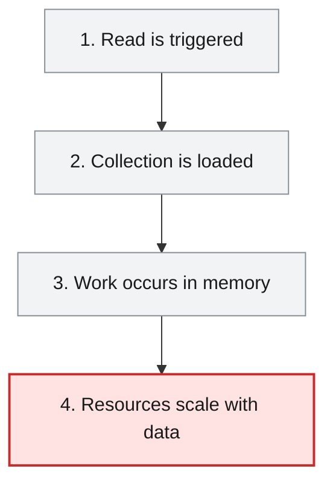
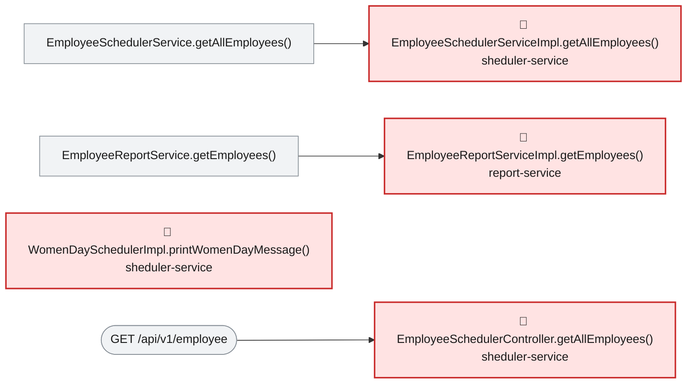

# Root Cause Analysis — ISSUE-001

## Unbounded repository findAll() reads whole collections into memory across multiple services

> Several employee reads load every matching record into service memory before responding or processing it, so ordinary requests can exhaust resources as data grows.

_Generated by the Root Cause Analyst agent on 2026-08-16. Evidence collected 2026-08-16T20:37:45.240Z._

## At a glance

| | |
|---|---|
| **What breaks** | Unbounded repository findAll() reads whole collections into memory across multiple services |
| **Root cause** | EmployeeSchedulerServiceImpl.getAllEmployees and EmployeeReportServiceImpl.getEmployees use unbounded repository findAll() calls, materialising complete collections in JVM memory. |
| **Where** | `sheduler-service/src/main/java/com/aura/vihanga/shedulerservice/service/implementation/EmployeeSchedulerServiceImpl.java:18; report-service/src/main/java/com/aura/vihanga/reportservice/service/implementation/EmployeeReportServiceImpl.java:40` |
| **Service** | `sheduler-service`, `report-service` |
| **Severity** | High (Vulnerability) |
| **Confidence** | High |

Issue: [docs/agent_output/00-issues/issue-register.xlsx](../../../docs/agent_output/00-issues/issue-register.xlsx) · Reported 2026-08-06 by Architecture review (performance and availability) · Status Open

<details><summary>Technical summary</summary>

The scheduler service returns the result of MongoRepository.findAll() directly from GET /api/v1/employee, while the report service calls findAll() before creating a complete in-memory payroll export. The scheduled Women's Day task also obtains every employee and filters the list only after it is in memory. None of these paths applies a database-side bound, page, projection, or filter appropriate to its use.

</details>

## 1. What was reported

Call site 1 - sheduler-service

- GET /api/v1/employee returns every employee document in the collection, serialised in full, with no page size, no limit parameter and no filtering. The entity is returned directly, so every persisted field is exposed to the caller.
- The scheduled job WomenDaySchedulerImpl.printWomenDayMessage() calls the same method and then filters for GenderType.FEMALE in Java, after the entire collection has already been transferred and mapped. The filter is never pushed down to the database.

Call site 2 - report-service

- GET /api/v1/export loads every employee via findAll(), then performs an outbound HTTP call to department-service for the department list, and then joins the two lists with a nested for loop (employees x departments) purely in memory.
- The complete joined result and the generated XLSX workbook are both held in the heap at the same time, and the workbook is buffered into a ByteArrayOutputStream before a single byte is written to the response.

Source: [docs/agent_output/00-issues/issue-register.xlsx](../../../docs/agent_output/00-issues/issue-register.xlsx)

## 2. What should happen — and what happens instead

```mermaid
flowchart TB
  classDef broken fill:#ffe3e3,stroke:#c92a2a,stroke-width:2px,color:#1a1a1a
  classDef warn fill:#fff3bf,stroke:#e8590c,stroke-width:2px,color:#1a1a1a
  classDef ok fill:#e6fcf5,stroke:#2f9e44,stroke-width:1px,color:#1a1a1a
  classDef neutral fill:#f1f3f5,stroke:#868e96,stroke-width:1px,color:#1a1a1a
  subgraph EXPECTED["✅ What should happen"]
    direction LR
    E0["Request uses a bounded<br/>query"]:::ok
    E1["Database returns a limited<br/>page"]:::ok
    E0 --> E1
    E2["Job filters records in the<br/>database"]:::ok
    E1 --> E2
    E3["Export processes records<br/>in chunks"]:::ok
    E2 --> E3
  end
  subgraph ACTUAL["❌ What actually happens"]
    direction LR
    A0["Read is triggered"]:::neutral
    A1["Collection is loaded"]:::neutral
    A0 --> A1
    A2["Work occurs in memory"]:::neutral
    A1 --> A2
    A3["Resources scale with data"]:::broken
    A2 --> A3
  end
```



## 3. How it fails, step by step

1. **Read is triggered** — GET /api/v1/employee, GET /api/v1/export, or the scheduled Women's Day task enters an affected path.
2. **Collection is loaded** — The scheduler and report service each invoke repository findAll() without a limit, page, or query filter.
3. **Work occurs in memory** — The scheduler filters employees in Java, while the report service builds a joined payroll list and a buffered workbook.
4. **Resources scale with data** — Heap use, database work, response latency, and export cost grow with the complete collection rather than a bounded request size.



## 4. Where the defect is

> **EmployeeSchedulerServiceImpl.getAllEmployees and EmployeeReportServiceImpl.getEmployees use unbounded repository findAll() calls, materialising complete collections in JVM memory.**

**Location:** `sheduler-service/src/main/java/com/aura/vihanga/shedulerservice/service/implementation/EmployeeSchedulerServiceImpl.java:18; report-service/src/main/java/com/aura/vihanga/reportservice/service/implementation/EmployeeReportServiceImpl.java:40`



The evidence shows GET /api/v1/employee reaching EmployeeSchedulerServiceImpl.getAllEmployees, which returns employeeSchedulerRepository.findAll() unchanged. It also shows GET /api/v1/export reaching EmployeeReportServiceImpl.getEmployees, where employeeReportRepository.findAll() is followed by an in-memory nested join and XLSX generation. WomenDaySchedulerImpl calls the same scheduler service and applies its gender filter after the full collection has been loaded.

**The code involved**

| Method | Service | File | Calls | Called by |
|---|---|---|---|---|
| `EmployeeSchedulerServiceImpl.getAllEmployees()` | `sheduler-service` | [EmployeeSchedulerServiceImpl.java:16-19](../../../sheduler-service/src/main/java/com/aura/vihanga/shedulerservice/service/implementation/EmployeeSchedulerServiceImpl.java#L16-L19) | _none_ | `EmployeeSchedulerService.getAllEmployees()` |
| `EmployeeReportServiceImpl.getEmployees()` | `report-service` | [EmployeeReportServiceImpl.java:38-72](../../../report-service/src/main/java/com/aura/vihanga/reportservice/service/implementation/EmployeeReportServiceImpl.java#L38-L72) | `DepartmentConfigUrl.getDepartmentUrl()` | `EmployeeReportService.getEmployees()` |
| `WomenDaySchedulerImpl.printWomenDayMessage()` | `sheduler-service` | [WomenDaySchedulerImpl.java:19-29](../../../sheduler-service/src/main/java/com/aura/vihanga/shedulerservice/service/implementation/WomenDaySchedulerImpl.java#L19-L29) | `EmployeeSchedulerService.getAllEmployees()` | _entry point_ |
| `EmployeeSchedulerController.getAllEmployees()` | `sheduler-service` | [EmployeeSchedulerController.java:18-21](../../../sheduler-service/src/main/java/com/aura/vihanga/shedulerservice/controller/EmployeeSchedulerController.java#L18-L21) | `EmployeeSchedulerService.getAllEmployees()` | _entry point_ |
| `EmployeeReportController.exportToExcel()` | `report-service` | [EmployeeReportController.java:25-39](../../../report-service/src/main/java/com/aura/vihanga/reportservice/controller/EmployeeReportController.java#L25-L39) | `EmployeeReportService.getEmployees()`, `EmployeeReportService.generateExcelFile()` | _entry point_ |

<details><summary>Show the source of each method</summary>

**`EmployeeSchedulerServiceImpl.getAllEmployees()`** — `sheduler-service/src/main/java/com/aura/vihanga/shedulerservice/service/implementation/EmployeeSchedulerServiceImpl.java` lines 16-19

```java
@Override
    public List<Employee> getAllEmployees() {
        return employeeSchedulerRepository.findAll();
    }
```

Reaching paths:

- `EmployeeSchedulerController.getAllEmployees()` → `EmployeeSchedulerService.getAllEmployees()` → `EmployeeSchedulerServiceImpl.getAllEmployees()`
- `WomenDaySchedulerImpl.printWomenDayMessage()` → `EmployeeSchedulerService.getAllEmployees()` → `EmployeeSchedulerServiceImpl.getAllEmployees()`

**`EmployeeReportServiceImpl.getEmployees()`** — `report-service/src/main/java/com/aura/vihanga/reportservice/service/implementation/EmployeeReportServiceImpl.java` lines 38-72

```java
public List<EmployeeSalaryResponse> getEmployees() {
        log.info("Report Service");
        List<Employee> employeesList = employeeReportRepository.findAll();

//        List<String> employeeDepartmentId = employees.stream().map(employee -> employee.getDepartment()).toList();

        DepartmentResponse[] departmentResponses = builder.build().get()
                .uri(departmentConfigUrl.getDepartmentUrl(), 10000)
                .retrieve()
                .bodyToMono(DepartmentResponse[].class)
                .block();
        List<DepartmentResponse> departmentResponseList = Arrays.asList(departmentResponses);

        List<EmployeeSalaryResponse> employeeSalaryResponseList = new ArrayList<>();

        for (Employee employee : employeesList) {
            for (DepartmentResponse department : departmentResponseList) {
                if (employee.getDepartment().equals(department.getDepartmentId())) {
                    EmployeeSalaryResponse employeeSalaryResponse = EmployeeSalaryResponse.builder()
                            .employeeId(employee.getEmployeeId())
                            .name(employee.getName())
                            .departmentName(department.getDepartmentName())
                            .salary(department.getSalary())
                            .build();

                    log.info("employee Salary {}",employeeSalaryResponse);

                    employeeSalaryResponseList.add(employeeSalaryResponse);
                }
            }
        }

        return employeeSalaryResponseList;

    }
```

Reaching paths:

- `EmployeeReportController.exportToExcel()` → `EmployeeReportService.getEmployees()` → `EmployeeReportServiceImpl.getEmployees()`

**`WomenDaySchedulerImpl.printWomenDayMessage()`** — `sheduler-service/src/main/java/com/aura/vihanga/shedulerservice/service/implementation/WomenDaySchedulerImpl.java` lines 19-29

```java
@Scheduled(cron = "0 0 0 8 3 *")
    public void printWomenDayMessage() {
        List<Employee> womenEmployees = employeeSchedulerService.getAllEmployees().stream()
                .filter(employee -> employee.getGender() == GenderType.FEMALE)
                .collect(Collectors.toList());

        System.out.println("Happy Women's Day!");
        for (Employee employee : womenEmployees) {
            System.out.println("Employee Name: " + employee.getName());
        }
    }
```

**`EmployeeSchedulerController.getAllEmployees()`** — `sheduler-service/src/main/java/com/aura/vihanga/shedulerservice/controller/EmployeeSchedulerController.java` lines 18-21

```java
@GetMapping("employee")
    public List<Employee> getAllEmployees() {
        return schedulerService.getAllEmployees();
    }
```

**`EmployeeReportController.exportToExcel()`** — `report-service/src/main/java/com/aura/vihanga/reportservice/controller/EmployeeReportController.java` lines 25-39

```java
@GetMapping("export")
    public void exportToExcel(HttpServletResponse response) throws IOException {
        List<EmployeeSalaryResponse> employeeSalaryResponseList = reportService.getEmployees();

//        List<Employee> employees = new ArrayList<>();
//
        byte[] excelBytes = reportService.generateExcelFile(employeeSalaryResponseList);

        response.setContentType("application/vnd.openxmlformats-officedocument.spreadsheetml.sheet");
        response.setHeader("Content-Disposition", "attachment; filename=employees.xlsx");
        response.getOutputStream().write(excelBytes);
        response.getOutputStream().flush();

        log.info("Report Controller");
    }
```

</details>

## 5. What it means

The two affected services can degrade or run out of memory when the employee collection grows or multiple callers invoke the two REST endpoints concurrently. The scheduled job has the same unbounded read pattern, and the report export adds an in-memory join and workbook buffer to its full collection read.

**Why High severity:** High severity is supported because the evidence shows public REST paths that can repeatedly force full collection materialisation, with the amount of work controlled by data volume rather than an API bound.

## 6. Why it happened

- The affected REST endpoints expose no page or size contract.
- The scheduled job applies its known gender criterion after reading all employees.
- The report path buffers both the assembled rows and the XLSX output before responding.

## 7. How to fix it

Replace unbounded reads with purpose-specific bounded database queries: paginate the scheduler REST response, query female employees directly for the scheduled task, and process the report export in database-backed pages or a streaming/chunked export rather than assembling every record and the complete workbook in memory.

| File | Change |
|---|---|
| [EmployeeSchedulerServiceImpl.java](../../../sheduler-service/src/main/java/com/aura/vihanga/shedulerservice/service/implementation/EmployeeSchedulerServiceImpl.java) | Expose bounded page-based retrieval for the REST path and add a database-side query for the scheduled gender filter. |
| [EmployeeReportServiceImpl.java](../../../report-service/src/main/java/com/aura/vihanga/reportservice/service/implementation/EmployeeReportServiceImpl.java) | Replace findAll-based export assembly with paged or streamed processing and avoid retaining the full workbook payload in memory. |

## 8. How to check the fix worked

1. Add service and controller tests proving the scheduler endpoint accepts bounded pagination and never invokes an unbounded findAll path.
2. Add a repository/service test proving the Women's Day job requests only female employees from the database.
3. Exercise the export with a collection larger than one page and confirm it produces the complete file while processing records in bounded chunks.
4. Load-test concurrent scheduler and export requests with a large seeded collection and verify stable heap usage and response latency.

## 9. How to stop it happening again

- Add code-review and static-analysis rules that flag repository findAll() use in request and batch paths.
- Define a shared pagination and export-streaming convention for Mongo-backed services.

## 10. Open questions

- The evidence does not provide production collection sizes, configured JVM heap limits, or real concurrent-request levels, so the precise failure threshold remains to be measured.

## Appendix — how this was determined

| Input | Detail |
|---|---|
| Issue report | [docs/agent_output/00-issues/issue-register.xlsx](../../../docs/agent_output/00-issues/issue-register.xlsx) |
| Architecture document | not available |
| Function reference | [docs/agent_output/01-architecture/function-reference.md](../../../docs/agent_output/01-architecture/function-reference.md) |
| Code scan | `.github/.pipeline-context/artifacts.json` (generated 2026-08-16T20:23:47.318Z) |
| Knowledge graph | Neo4j, traversal depth 4 |

<details><summary>Graph queries executed</summary>

**upstream callers**

```cypher
MATCH path = (caller:Method)-[:CALLS*1..4]->(target:Method {id: $id})
         RETURN [n IN nodes(path) | n.id] AS chain LIMIT 200
```

**downstream callees**

```cypher
MATCH path = (target:Method {id: $id})-[:CALLS*1..4]->(callee:Method)
         RETURN [n IN nodes(path) | n.id] AS chain LIMIT 200
```

**owning type, module and exposed endpoints**

```cypher
MATCH (ty:Type)-[:HAS_METHOD]->(m:Method {id: $id})
         OPTIONAL MATCH (ty)-[:EXPOSES]->(e:Endpoint)
         RETURN ty.id AS typeId, ty.name AS typeName, ty.module AS module,
                collect(DISTINCT e.id) AS endpoints
```

**types depending on the owning type**

```cypher
MATCH (other:Type)-[:USES]->(ty:Type)-[:HAS_METHOD]->(:Method {id: $id})
         RETURN DISTINCT other.id AS typeId, other.name AS name, other.module AS module
```

**modules reaching the focus method**

```cypher
MATCH (caller:Method)-[:CALLS*1..4]->(:Method {id: $id})
         MATCH (ct:Type)-[:HAS_METHOD]->(caller)
         RETURN DISTINCT ct.module AS module
```

**graph node counts**

```cypher
MATCH (n) RETURN labels(n)[0] AS label, count(*) AS count ORDER BY count DESC
```

**graph relationship counts**

```cypher
MATCH ()-[r]->() RETURN type(r) AS type, count(*) AS count ORDER BY count DESC
```

**maven dependencies of affected modules**

```cypher
MATCH (m:Module)-[:DEPENDS_ON]->(dep:MavenDependency)
       WHERE m.name IN $modules
       RETURN m.name AS module, collect(dep.ga) AS dependencies
```

</details>

---

The reported symptom, the code table, the source and the call paths are rendered verbatim from the issue, the code scan and the knowledge graph. The plain-language summary, the causal chain, the root cause, what it means, why it happened, the fix, the verification steps and the prevention measures are the judgement of the Root Cause Analyst agent.
