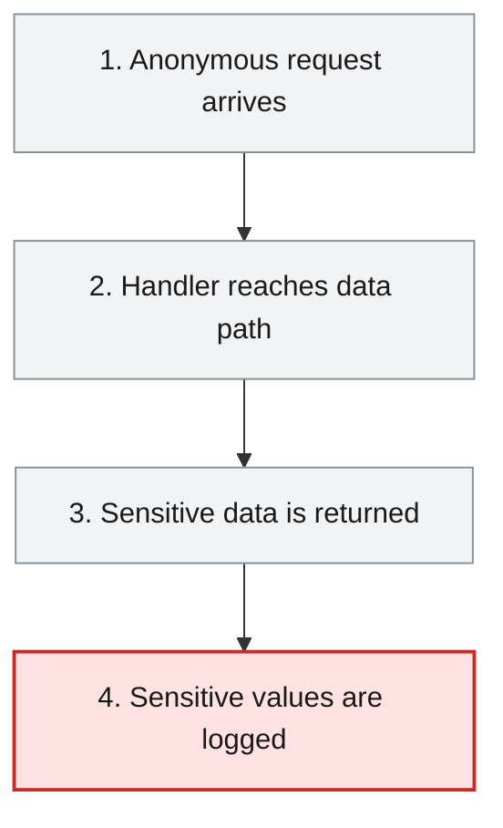
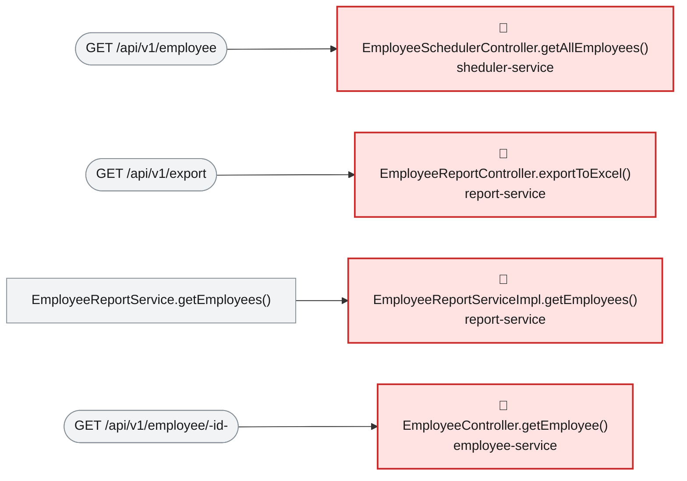

# Root Cause Analysis — ISSUE-002

## Employee PII and payroll data are exposed to unauthenticated callers and written to application logs

> Employee personal details and payroll data can be read or changed without proving who the caller is, and sensitive values are also written to ordinary application logs.

_Generated by the Root Cause Analyst agent on 2026-08-16. Evidence collected 2026-08-16T20:37:47.053Z._

## At a glance

| | |
|---|---|
| **What breaks** | Employee PII and payroll data are exposed to unauthenticated callers and written to application logs |
| **Root cause** | The services expose sensitive REST handlers without any declared Spring Security dependency, security filter chain, or method-level authorization, while affected paths log sensitive objects and values. |
| **Where** | `employee-service/pom.xml:20-82; employee-service/src/main/java/com/aura/vihanga/employeeservice/controller/EmployeeController.java:31-82; report-service/src/main/java/com/aura/vihanga/reportservice/service/implementation/EmployeeReportServiceImpl.java:63; department-service/src/main/java/com/aura/vihanga/departmentservice/controller/DepartmentController.java:42` |
| **Service** | `employee-service`, `report-service`, `sheduler-service`, `department-service`, `configuaration-server`, `discovery-service` |
| **Severity** | Critical (Vulnerability) |
| **Confidence** | High |

Issue: [docs/agent_output/00-issues/issue-register.xlsx](../../../docs/agent_output/00-issues/issue-register.xlsx) · Reported 2026-08-09 by Security review (sensitive data exposure and access control) · Status Open

<details><summary>Technical summary</summary>

The business-service Maven modules do not declare Spring Security, and the affected controllers expose data-bearing REST handlers without authentication or authorization checks. Several normal request paths return employee PII or payroll information, and controller/service logging writes full employee, department, and salary objects or request values to logs. The primary defect is the absence of platform security controls governing access to the sensitive service surface; sensitive logging compounds the exposure.

</details>

## 1. What was reported

- No module declares spring-boot-starter-security. A search across all six pom.xml files for spring-boot-starter-security returns zero matches.
- No SecurityFilterChain, WebSecurityConfigurerAdapter, @PreAuthorize, @Secured or @RolesAllowed exists anywhere in src/main/java.
- Consequently Spring Boot applies no filter chain, and every @RequestMapping handler is dispatched for anonymous requests. No handler performs its own identity or entitlement check.
- Requests carry no correlation to any principal, so there is no audit trail: it is not possible to determine after the fact who read or modified an employee record.
- GET /api/v1/employee serialises the persistence entity directly rather than a DTO, so every persisted field is emitted whether or not the caller needs it.
- Salary values reach the log sink at INFO on the normal export path. Log files are commonly shipped to aggregation platforms and retained far longer, and with broader read access, than the database itself.

Source: [docs/agent_output/00-issues/issue-register.xlsx](../../../docs/agent_output/00-issues/issue-register.xlsx)

## 2. What should happen — and what happens instead

```mermaid
flowchart TB
  classDef broken fill:#ffe3e3,stroke:#c92a2a,stroke-width:2px,color:#1a1a1a
  classDef warn fill:#fff3bf,stroke:#e8590c,stroke-width:2px,color:#1a1a1a
  classDef ok fill:#e6fcf5,stroke:#2f9e44,stroke-width:1px,color:#1a1a1a
  classDef neutral fill:#f1f3f5,stroke:#868e96,stroke-width:1px,color:#1a1a1a
  subgraph EXPECTED["✅ What should happen"]
    direction LR
    E0["Caller authenticates to<br/>the service"]:::ok
    E1["Service authorizes the<br/>requested action"]:::ok
    E0 --> E1
    E2["Response contains only<br/>needed fields"]:::ok
    E1 --> E2
    E3["Logs contain safe<br/>identifiers only"]:::ok
    E2 --> E3
  end
  subgraph ACTUAL["❌ What actually happens"]
    direction LR
    A0["Anonymous request arrives"]:::neutral
    A1["Handler reaches data path"]:::neutral
    A0 --> A1
    A2["Sensitive data is returned"]:::neutral
    A1 --> A2
    A3["Sensitive values are<br/>logged"]:::broken
    A2 --> A3
  end
```



## 3. How it fails, step by step

1. **Anonymous request arrives** — The REST handlers are exposed by Spring MVC but the source and dependency evidence shows no authentication or authorization mechanism protecting them.
2. **Handler reaches data path** — The graph links the exposed handlers to employee records, payroll exports, and department salary responses.
3. **Sensitive data is returned** — Employee and salary response objects are returned directly through the affected REST flows, including the XLSX export.
4. **Sensitive values are logged** — Normal controller and service execution passes employee, department, search, and salary values to SLF4J logging calls.



## 4. Where the defect is

> **The services expose sensitive REST handlers without any declared Spring Security dependency, security filter chain, or method-level authorization, while affected paths log sensitive objects and values.**

**Location:** `employee-service/pom.xml:20-82; employee-service/src/main/java/com/aura/vihanga/employeeservice/controller/EmployeeController.java:31-82; report-service/src/main/java/com/aura/vihanga/reportservice/service/implementation/EmployeeReportServiceImpl.java:63; department-service/src/main/java/com/aura/vihanga/departmentservice/controller/DepartmentController.java:42`



The issue evidence records no spring-boot-starter-security dependency in any module and no SecurityFilterChain, WebSecurityConfigurerAdapter, @PreAuthorize, @Secured, or @RolesAllowed source declaration. The graph resolves anonymous REST entry paths to employee, payroll-export, scheduler, and department handlers. EmployeeController logs supplied employee data and search parameters; EmployeeReportServiceImpl logs each EmployeeSalaryResponse; and DepartmentController logs full department responses.

**The code involved**

| Method | Service | File | Calls | Called by |
|---|---|---|---|---|
| `EmployeeSchedulerController.getAllEmployees()` | `sheduler-service` | [EmployeeSchedulerController.java:18-21](../../../sheduler-service/src/main/java/com/aura/vihanga/shedulerservice/controller/EmployeeSchedulerController.java#L18-L21) | `EmployeeSchedulerService.getAllEmployees()` | _entry point_ |
| `EmployeeReportController.exportToExcel()` | `report-service` | [EmployeeReportController.java:25-39](../../../report-service/src/main/java/com/aura/vihanga/reportservice/controller/EmployeeReportController.java#L25-L39) | `EmployeeReportService.getEmployees()`, `EmployeeReportService.generateExcelFile()` | _entry point_ |
| `EmployeeReportServiceImpl.getEmployees()` | `report-service` | [EmployeeReportServiceImpl.java:38-72](../../../report-service/src/main/java/com/aura/vihanga/reportservice/service/implementation/EmployeeReportServiceImpl.java#L38-L72) | `DepartmentConfigUrl.getDepartmentUrl()` | `EmployeeReportService.getEmployees()` |
| `EmployeeController.getEmployee()` | `employee-service` | [EmployeeController.java:61-69](../../../employee-service/src/main/java/com/aura/vihanga/employeeservice/controller/EmployeeController.java#L61-L69) | `EmployeeService.getEmployee()` | _entry point_ |
| `EmployeeController.createEmployee()` | `employee-service` | [EmployeeController.java:31-39](../../../employee-service/src/main/java/com/aura/vihanga/employeeservice/controller/EmployeeController.java#L31-L39) | `EmployeeService.createEmployee()` | _entry point_ |
| `EmployeeController.searchEmployees()` | `employee-service` | [EmployeeController.java:50-59](../../../employee-service/src/main/java/com/aura/vihanga/employeeservice/controller/EmployeeController.java#L50-L59) | `EmployeeService.searchEmployees()` | _entry point_ |
| `DepartmentController.getAllDepartments()` | `department-service` | [DepartmentController.java:39-44](../../../department-service/src/main/java/com/aura/vihanga/departmentservice/controller/DepartmentController.java#L39-L44) | `DepartmentService.getAllDepartments()` | _entry point_ |

<details><summary>Show the source of each method</summary>

**`EmployeeSchedulerController.getAllEmployees()`** — `sheduler-service/src/main/java/com/aura/vihanga/shedulerservice/controller/EmployeeSchedulerController.java` lines 18-21

```java
@GetMapping("employee")
    public List<Employee> getAllEmployees() {
        return schedulerService.getAllEmployees();
    }
```

**`EmployeeReportController.exportToExcel()`** — `report-service/src/main/java/com/aura/vihanga/reportservice/controller/EmployeeReportController.java` lines 25-39

```java
@GetMapping("export")
    public void exportToExcel(HttpServletResponse response) throws IOException {
        List<EmployeeSalaryResponse> employeeSalaryResponseList = reportService.getEmployees();

//        List<Employee> employees = new ArrayList<>();
//
        byte[] excelBytes = reportService.generateExcelFile(employeeSalaryResponseList);

        response.setContentType("application/vnd.openxmlformats-officedocument.spreadsheetml.sheet");
        response.setHeader("Content-Disposition", "attachment; filename=employees.xlsx");
        response.getOutputStream().write(excelBytes);
        response.getOutputStream().flush();

        log.info("Report Controller");
    }
```

**`EmployeeReportServiceImpl.getEmployees()`** — `report-service/src/main/java/com/aura/vihanga/reportservice/service/implementation/EmployeeReportServiceImpl.java` lines 38-72

```java
public List<EmployeeSalaryResponse> getEmployees() {
        log.info("Report Service");
        List<Employee> employeesList = employeeReportRepository.findAll();

//        List<String> employeeDepartmentId = employees.stream().map(employee -> employee.getDepartment()).toList();

        DepartmentResponse[] departmentResponses = builder.build().get()
                .uri(departmentConfigUrl.getDepartmentUrl(), 10000)
                .retrieve()
                .bodyToMono(DepartmentResponse[].class)
                .block();
        List<DepartmentResponse> departmentResponseList = Arrays.asList(departmentResponses);

        List<EmployeeSalaryResponse> employeeSalaryResponseList = new ArrayList<>();

        for (Employee employee : employeesList) {
            for (DepartmentResponse department : departmentResponseList) {
                if (employee.getDepartment().equals(department.getDepartmentId())) {
                    EmployeeSalaryResponse employeeSalaryResponse = EmployeeSalaryResponse.builder()
                            .employeeId(employee.getEmployeeId())
                            .name(employee.getName())
                            .departmentName(department.getDepartmentName())
                            .salary(department.getSalary())
                            .build();

                    log.info("employee Salary {}",employeeSalaryResponse);

                    employeeSalaryResponseList.add(employeeSalaryResponse);
                }
            }
        }

        return employeeSalaryResponseList;

    }
```

Reaching paths:

- `EmployeeReportController.exportToExcel()` → `EmployeeReportService.getEmployees()` → `EmployeeReportServiceImpl.getEmployees()`

**`EmployeeController.getEmployee()`** — `employee-service/src/main/java/com/aura/vihanga/employeeservice/controller/EmployeeController.java` lines 61-69

```java
@GetMapping("employee/{id}")
    public ResponseEntity<StandardResponse> getEmployee(@PathVariable("id") String employeeId) throws EmployeeNotFoundException {
        log.trace("EmployeeController - getEmployee - employeeId {}", employeeId);
        EmployeeResponse employeeResponse = employeeService.getEmployee(employeeId);

        return new ResponseEntity<StandardResponse>(
                new StandardResponse(200, "Employee Fetch Successfully", employeeResponse), HttpStatus.OK
        );
    }
```

**`EmployeeController.createEmployee()`** — `employee-service/src/main/java/com/aura/vihanga/employeeservice/controller/EmployeeController.java` lines 31-39

```java
@PostMapping("employee")
    public ResponseEntity<StandardResponse> createEmployee(@RequestBody Employee employee) {
        log.trace("EmployeeController - createEmployee - employee {}", employee);
        EmployeeResponse employeeResponse = employeeService.createEmployee(employee);

        return new ResponseEntity<StandardResponse>(
                new StandardResponse(201, "Employee Created Successfully", employeeResponse), HttpStatus.CREATED
        );
    }
```

**`EmployeeController.searchEmployees()`** — `employee-service/src/main/java/com/aura/vihanga/employeeservice/controller/EmployeeController.java` lines 50-59

```java
@GetMapping("employee/search")
    public ResponseEntity<StandardResponse> searchEmployees(@RequestParam("name") String name,
                                                            @RequestParam(value = "department", required = false) String department) {
        log.trace("EmployeeController - searchEmployees - name {} department {}", name, department);
        List<EmployeeResponse> employeeResponses = employeeService.searchEmployees(name, department);

        return new ResponseEntity<StandardResponse>(
                new StandardResponse(200, "Employee Search Completed Successfully", employeeResponses), HttpStatus.OK
        );
    }
```

**`DepartmentController.getAllDepartments()`** — `department-service/src/main/java/com/aura/vihanga/departmentservice/controller/DepartmentController.java` lines 39-44

```java
@GetMapping("department/salary/{minSalary}")
    public List<DepartmentResponse> getAllDepartments(@PathVariable("minSalary") double minSalary) {
        List<DepartmentResponse> departmentResponses = departmentService.getAllDepartments(minSalary);
        log.info("Department Controller {}", departmentResponses);
        return  departmentResponses;
    }
```

</details>

## 5. What it means

The four business modules in the affected area expose employee personal data, salary-related data, or related writes through the listed REST paths without an application-layer identity or entitlement check. Sensitive data also persists in the configured log sinks reached by the report, department, and employee paths.

**Why Critical severity:** Critical severity is supported by anonymous access to PII and payroll data, anonymous employee write paths, and secondary disclosure through logs.

## 6. Why it happened

- GET /api/v1/employee returns persistence Employee entities directly.
- The report export creates EmployeeSalaryResponse values and logs each value at INFO level.
- The employee controller uses TRACE logging for employee objects and request parameters.
- The available static evidence does not show an external gateway enforcing equivalent controls.

## 7. How to fix it

Adopt a shared authentication and authorization design across every externally reachable service, add Spring Security filter-chain configuration with least-privilege roles for employee and payroll operations, secure service-to-service calls, replace entity responses with least-data DTOs, and remove or mask PII and salary values from all logs.

| File | Change |
|---|---|
| [pom.xml](../../../employee-service/pom.xml) | Add the approved Spring Security dependencies as part of the shared identity-provider integration. |
| [EmployeeController.java](../../../employee-service/src/main/java/com/aura/vihanga/employeeservice/controller/EmployeeController.java) | Enforce authorization through the shared security configuration and stop logging whole employee objects and raw search values. |
| [EmployeeReportServiceImpl.java](../../../report-service/src/main/java/com/aura/vihanga/reportservice/service/implementation/EmployeeReportServiceImpl.java) | Remove salary-object logging and restrict export access to an explicitly privileged role. |
| [DepartmentController.java](../../../department-service/src/main/java/com/aura/vihanga/departmentservice/controller/DepartmentController.java) | Remove full department-response logging and require appropriate authorization for salary data. |

## 8. How to check the fix worked

1. Add integration tests that anonymous requests receive 401 or 403 for every employee, payroll, scheduler, and department data endpoint except deliberately public health endpoints.
2. Add role-based tests showing only the intended privileged role can access salary exports and salary-band responses.
3. Capture logs during create, search, department, and export flows and assert that employee addresses, phone numbers, payroll values, full employee objects, and raw search parameters are absent.
4. Verify that service-to-service requests use the selected service credential and are rejected without it.

## 9. How to stop it happening again

- Provide a shared security starter and an integration-test baseline that fails when an endpoint is anonymous without an explicit allow-list entry.
- Add log-scrubbing policy checks for DTO/entity arguments and classifications for PII and payroll fields.

## 10. Open questions

- The evidence does not include deployment gateway, network-policy, identity-provider, config-server credential-encryption, or log-retention configuration, so any controls outside this source workspace require separate verification.
- The live graph identifies business-service paths but does not prove all external consumers of each endpoint.

## Appendix — how this was determined

| Input | Detail |
|---|---|
| Issue report | [docs/agent_output/00-issues/issue-register.xlsx](../../../docs/agent_output/00-issues/issue-register.xlsx) |
| Architecture document | not available |
| Function reference | [docs/agent_output/01-architecture/function-reference.md](../../../docs/agent_output/01-architecture/function-reference.md) |
| Code scan | `.github/.pipeline-context/artifacts.json` (generated 2026-08-16T20:23:47.318Z) |
| Knowledge graph | Neo4j, traversal depth 4 |

<details><summary>Graph queries executed</summary>

**upstream callers**

```cypher
MATCH path = (caller:Method)-[:CALLS*1..4]->(target:Method {id: $id})
         RETURN [n IN nodes(path) | n.id] AS chain LIMIT 200
```

**downstream callees**

```cypher
MATCH path = (target:Method {id: $id})-[:CALLS*1..4]->(callee:Method)
         RETURN [n IN nodes(path) | n.id] AS chain LIMIT 200
```

**owning type, module and exposed endpoints**

```cypher
MATCH (ty:Type)-[:HAS_METHOD]->(m:Method {id: $id})
         OPTIONAL MATCH (ty)-[:EXPOSES]->(e:Endpoint)
         RETURN ty.id AS typeId, ty.name AS typeName, ty.module AS module,
                collect(DISTINCT e.id) AS endpoints
```

**types depending on the owning type**

```cypher
MATCH (other:Type)-[:USES]->(ty:Type)-[:HAS_METHOD]->(:Method {id: $id})
         RETURN DISTINCT other.id AS typeId, other.name AS name, other.module AS module
```

**modules reaching the focus method**

```cypher
MATCH (caller:Method)-[:CALLS*1..4]->(:Method {id: $id})
         MATCH (ct:Type)-[:HAS_METHOD]->(caller)
         RETURN DISTINCT ct.module AS module
```

**graph node counts**

```cypher
MATCH (n) RETURN labels(n)[0] AS label, count(*) AS count ORDER BY count DESC
```

**graph relationship counts**

```cypher
MATCH ()-[r]->() RETURN type(r) AS type, count(*) AS count ORDER BY count DESC
```

**maven dependencies of affected modules**

```cypher
MATCH (m:Module)-[:DEPENDS_ON]->(dep:MavenDependency)
       WHERE m.name IN $modules
       RETURN m.name AS module, collect(dep.ga) AS dependencies
```

</details>

---

The reported symptom, the code table, the source and the call paths are rendered verbatim from the issue, the code scan and the knowledge graph. The plain-language summary, the causal chain, the root cause, what it means, why it happened, the fix, the verification steps and the prevention measures are the judgement of the Root Cause Analyst agent.
