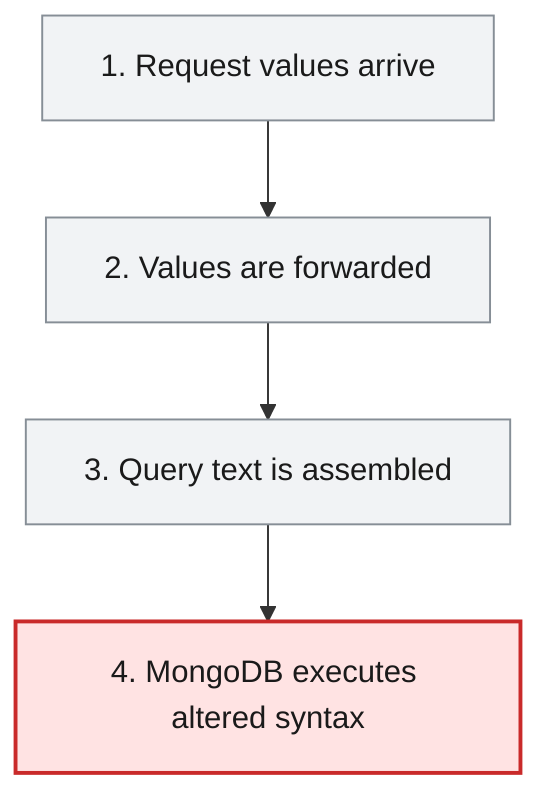

# Root Cause Analysis — ISSUE-003

## MongoDB (NoSQL) injection in the employee search endpoint via string-concatenated BasicQuery

> The employee search accepts text from a request and inserts it into the database query itself, allowing a caller to change which records are searched.

_Generated by the Root Cause Analyst agent on 2026-08-16. Evidence collected 2026-08-16T20:37:48.186Z._

## At a glance

| | |
|---|---|
| **What breaks** | MongoDB (NoSQL) injection in the employee search endpoint via string-concatenated BasicQuery |
| **Root cause** | EmployeeSearchRepository.searchEmployees concatenates untrusted name and department request values into a MongoDB BasicQuery string instead of building bound Criteria or derived-query values. |
| **Where** | `employee-service/src/main/java/com/aura/vihanga/employeeservice/repository/EmployeeSearchRepository.java:20-30` |
| **Service** | `employee-service` |
| **Severity** | Critical (Vulnerability) |
| **Confidence** | High |

Issue: [docs/agent_output/00-issues/issue-register.xlsx](../../../docs/agent_output/00-issues/issue-register.xlsx) · Reported 2026-08-09 by Security review (injection) · Status Open

<details><summary>Technical summary</summary>

EmployeeController.searchEmployees accepts name and optional department from query parameters, and EmployeeServiceImpl passes both directly to EmployeeSearchRepository. That repository builds a MongoDB filter by concatenating the raw values into a string and executes it with BasicQuery. Because the values are treated as query-document text rather than bound data, quote and operator input can alter the MongoDB query structure.

</details>

## 1. What was reported

Because the value is placed inside a single-quoted JSON string that the caller can break out of, the injected payload closes the intended $regex clause and appends attacker-chosen query operators.

Benign request - filter becomes { 'name': { $regex: 'Ann' } }:
   GET /api/v1/employee/search?name=Ann

Injection - return every employee regardless of name. Supplying a name that closes the $regex object and injects an always-true operator turns the filter into one that matches all documents:
   GET /api/v1/employee/search?name=x' } }, { 'name': { $ne: '
The resulting filter string is { 'name': { $regex: 'x' } }, { 'name': { $ne: '' } }, i.e. the $regex constraint is neutralised and the query returns the full collection.

Injection - operator abuse via the department field. The department value is interpolated as a bare JSON value, so an operator document can be injected directly:
   GET /api/v1/employee/search?name=x&department=' }, 'name': { $ne: '

Injection - server-side JavaScript evaluation. If $where/JavaScript execution is enabled on the MongoDB deployment, a $where clause injected through the same hole runs arbitrary JavaScript in the database engine, which can be used for boolean/time-based blind extraction and resource exhaustion.

Reproducibility: Deterministic. The endpoint is unauthenticated (see ISSUE-002), so no credentials are needed to reach the sink.

Source: [docs/agent_output/00-issues/issue-register.xlsx](../../../docs/agent_output/00-issues/issue-register.xlsx)

## 2. What should happen — and what happens instead

```mermaid
flowchart TB
  classDef broken fill:#ffe3e3,stroke:#c92a2a,stroke-width:2px,color:#1a1a1a
  classDef warn fill:#fff3bf,stroke:#e8590c,stroke-width:2px,color:#1a1a1a
  classDef ok fill:#e6fcf5,stroke:#2f9e44,stroke-width:1px,color:#1a1a1a
  classDef neutral fill:#f1f3f5,stroke:#868e96,stroke-width:1px,color:#1a1a1a
  subgraph EXPECTED["✅ What should happen"]
    direction LR
    E0["Request values are<br/>validated"]:::ok
    E1["Values are bound as query<br/>data"]:::ok
    E0 --> E1
    E2["Literal name search is<br/>executed"]:::ok
    E1 --> E2
    E3["Only matching records are<br/>returned"]:::ok
    E2 --> E3
  end
  subgraph ACTUAL["❌ What actually happens"]
    direction LR
    A0["Request values arrive"]:::neutral
    A1["Values are forwarded"]:::neutral
    A0 --> A1
    A2["Query text is assembled"]:::neutral
    A1 --> A2
    A3["MongoDB executes altered<br/>syntax"]:::broken
    A2 --> A3
  end
```



## 3. How it fails, step by step

1. **Request values arrive** — GET /api/v1/employee/search accepts name and optional department as request parameters.
2. **Values are forwarded** — EmployeeServiceImpl passes both parameters unchanged to EmployeeSearchRepository.
3. **Query text is assembled** — The repository concatenates the values into a MongoDB filter string, including the regex and optional department clauses.
4. **MongoDB executes altered syntax** — BasicQuery receives the assembled text, allowing special characters or operators to affect query structure and matching behavior.



## 4. Where the defect is

> **EmployeeSearchRepository.searchEmployees concatenates untrusted name and department request values into a MongoDB BasicQuery string instead of building bound Criteria or derived-query values.**

**Location:** `employee-service/src/main/java/com/aura/vihanga/employeeservice/repository/EmployeeSearchRepository.java:20-30`


The evidence traces GET /api/v1/employee/search from EmployeeController through EmployeeServiceImpl to EmployeeSearchRepository. At the defect site, StringBuilder.append(name) inserts the name into a $regex clause and append(department) inserts the optional department into the query text; the resulting string is passed to new BasicQuery(filter.toString()). The request values therefore influence query syntax rather than only query values.

**The code involved**

| Method | Service | File | Calls | Called by |
|---|---|---|---|---|
| `EmployeeController.searchEmployees()` | `employee-service` | [EmployeeController.java:50-59](../../../employee-service/src/main/java/com/aura/vihanga/employeeservice/controller/EmployeeController.java#L50-L59) | `EmployeeService.searchEmployees()` | _entry point_ |
| `EmployeeServiceImpl.searchEmployees()` | `employee-service` | [EmployeeServiceImpl.java:108-122](../../../employee-service/src/main/java/com/aura/vihanga/employeeservice/service/implementation/EmployeeServiceImpl.java#L108-L122) | `EmployeeSearchRepository.searchEmployees()` | `EmployeeService.searchEmployees()` |
| `EmployeeSearchRepository.searchEmployees()` | `employee-service` | [EmployeeSearchRepository.java:19-32](../../../employee-service/src/main/java/com/aura/vihanga/employeeservice/repository/EmployeeSearchRepository.java#L19-L32) | _none_ | `EmployeeServiceImpl.searchEmployees()` |

<details><summary>Show the source of each method</summary>

**`EmployeeController.searchEmployees()`** — `employee-service/src/main/java/com/aura/vihanga/employeeservice/controller/EmployeeController.java` lines 50-59

```java
@GetMapping("employee/search")
    public ResponseEntity<StandardResponse> searchEmployees(@RequestParam("name") String name,
                                                            @RequestParam(value = "department", required = false) String department) {
        log.trace("EmployeeController - searchEmployees - name {} department {}", name, department);
        List<EmployeeResponse> employeeResponses = employeeService.searchEmployees(name, department);

        return new ResponseEntity<StandardResponse>(
                new StandardResponse(200, "Employee Search Completed Successfully", employeeResponses), HttpStatus.OK
        );
    }
```

**`EmployeeServiceImpl.searchEmployees()`** — `employee-service/src/main/java/com/aura/vihanga/employeeservice/service/implementation/EmployeeServiceImpl.java` lines 108-122

```java
@Override
    public List<EmployeeResponse> searchEmployees(String name, String department) {
        log.trace("EmployeeServiceImpl - searchEmployees - name {} department {}", name, department);
        List<Employee> employees = employeeSearchRepository.searchEmployees(name, department);

        return employees.stream().map(employee -> EmployeeResponse.builder()
                .employeeId(employee.getEmployeeId())
                .name(employee.getName())
                .department(employee.getDepartment())
                .phoneNo(employee.getPhoneNo())
                .address(employee.getAddress())
                .gender(employee.getGender())
                .employeeType(employee.getEmployeeType())
                .build()).collect(Collectors.toList());
    }
```

Reaching paths:

- `EmployeeController.searchEmployees()` → `EmployeeService.searchEmployees()` → `EmployeeServiceImpl.searchEmployees()`

**`EmployeeSearchRepository.searchEmployees()`** — `employee-service/src/main/java/com/aura/vihanga/employeeservice/repository/EmployeeSearchRepository.java` lines 19-32

```java
public List<Employee> searchEmployees(String name, String department) {
        StringBuilder filter = new StringBuilder("{ ");
        filter.append("'name': { $regex: '").append(name).append("' }");

        if (department != null && !department.isEmpty()) {
            filter.append(", 'department': '").append(department).append("'");
        }

        filter.append(" }");

        log.info("EmployeeSearchRepository - searchEmployees - filter {}", filter);

        return mongoTemplate.find(new BasicQuery(filter.toString()), Employee.class);
    }
```

Reaching paths:

- `EmployeeController.searchEmployees()` → `EmployeeService.searchEmployees()` → `EmployeeServiceImpl.searchEmployees()` → `EmployeeSearchRepository.searchEmployees()`

</details>

## 5. What it means

The affected employee-service search endpoint can return employee records outside the intended name or department constraints when caller input changes the query syntax. It can also impose expensive query behavior against the employee collection, and its output includes employee response fields such as phone number and address.

**Why Critical severity:** Critical severity is supported by an externally exposed data-search path whose untrusted parameters reach a database query-construction sink without binding or validation.

## 6. Why it happened

- The controller accepts free-form query parameters without bean validation or an allow-list.
- The name parameter is placed into a regex clause without literal quoting.
- The repository logs the constructed query text, preserving attacker-controlled query content in logs.

## 7. How to fix it

Replace string-built BasicQuery usage with Spring Data Criteria/Query or derived repository methods so name and department are bound as values; quote user text when a literal regex search is required, validate input at the controller boundary, and stop logging constructed query text.

| File | Change |
|---|---|
| [EmployeeSearchRepository.java](../../../employee-service/src/main/java/com/aura/vihanga/employeeservice/repository/EmployeeSearchRepository.java) | Build the MongoDB query through Criteria and Query (or a derived repository method), bind department as a value, quote any literal name regex, and remove filter-text logging. |
| [EmployeeController.java](../../../employee-service/src/main/java/com/aura/vihanga/employeeservice/controller/EmployeeController.java) | Apply explicit validation and length/character constraints to search parameters before delegating. |

## 8. How to check the fix worked

1. Add repository tests that quote and operator payloads are treated as literal values and cannot broaden the result set or alter the query document.
2. Add controller tests that invalid or overlong search values are rejected before they reach the repository.
3. Run a benign literal-name search and confirm only the intended matching employee records are returned.
4. Verify application logs no longer contain assembled MongoDB query text or raw injection payloads.

## 9. How to stop it happening again

- Add static-analysis checks rejecting BasicQuery constructed from concatenated request input.
- Standardize repository query construction on derived methods or Criteria APIs and require security tests for request-to-database data flows.

## 10. Open questions

- The evidence does not establish the MongoDB server configuration, so whether server-side JavaScript operators are enabled must be verified in the deployed database configuration.
- The graph notes a possible report-service HTTP consumer but does not establish that it invokes this search endpoint.

## Appendix — how this was determined

| Input | Detail |
|---|---|
| Issue report | [docs/agent_output/00-issues/issue-register.xlsx](../../../docs/agent_output/00-issues/issue-register.xlsx) |
| Architecture document | not available |
| Function reference | [docs/agent_output/01-architecture/function-reference.md](../../../docs/agent_output/01-architecture/function-reference.md) |
| Code scan | `.github/.pipeline-context/artifacts.json` (generated 2026-08-16T20:23:47.318Z) |
| Knowledge graph | Neo4j, traversal depth 4 |

<details><summary>Graph queries executed</summary>

**upstream callers**

```cypher
MATCH path = (caller:Method)-[:CALLS*1..4]->(target:Method {id: $id})
         RETURN [n IN nodes(path) | n.id] AS chain LIMIT 200
```

**downstream callees**

```cypher
MATCH path = (target:Method {id: $id})-[:CALLS*1..4]->(callee:Method)
         RETURN [n IN nodes(path) | n.id] AS chain LIMIT 200
```

**owning type, module and exposed endpoints**

```cypher
MATCH (ty:Type)-[:HAS_METHOD]->(m:Method {id: $id})
         OPTIONAL MATCH (ty)-[:EXPOSES]->(e:Endpoint)
         RETURN ty.id AS typeId, ty.name AS typeName, ty.module AS module,
                collect(DISTINCT e.id) AS endpoints
```

**types depending on the owning type**

```cypher
MATCH (other:Type)-[:USES]->(ty:Type)-[:HAS_METHOD]->(:Method {id: $id})
         RETURN DISTINCT other.id AS typeId, other.name AS name, other.module AS module
```

**modules reaching the focus method**

```cypher
MATCH (caller:Method)-[:CALLS*1..4]->(:Method {id: $id})
         MATCH (ct:Type)-[:HAS_METHOD]->(caller)
         RETURN DISTINCT ct.module AS module
```

**graph node counts**

```cypher
MATCH (n) RETURN labels(n)[0] AS label, count(*) AS count ORDER BY count DESC
```

**graph relationship counts**

```cypher
MATCH ()-[r]->() RETURN type(r) AS type, count(*) AS count ORDER BY count DESC
```

**maven dependencies of affected modules**

```cypher
MATCH (m:Module)-[:DEPENDS_ON]->(dep:MavenDependency)
       WHERE m.name IN $modules
       RETURN m.name AS module, collect(dep.ga) AS dependencies
```

</details>

---

The reported symptom, the code table, the source and the call paths are rendered verbatim from the issue, the code scan and the knowledge graph. The plain-language summary, the causal chain, the root cause, what it means, why it happened, the fix, the verification steps and the prevention measures are the judgement of the Root Cause Analyst agent.
