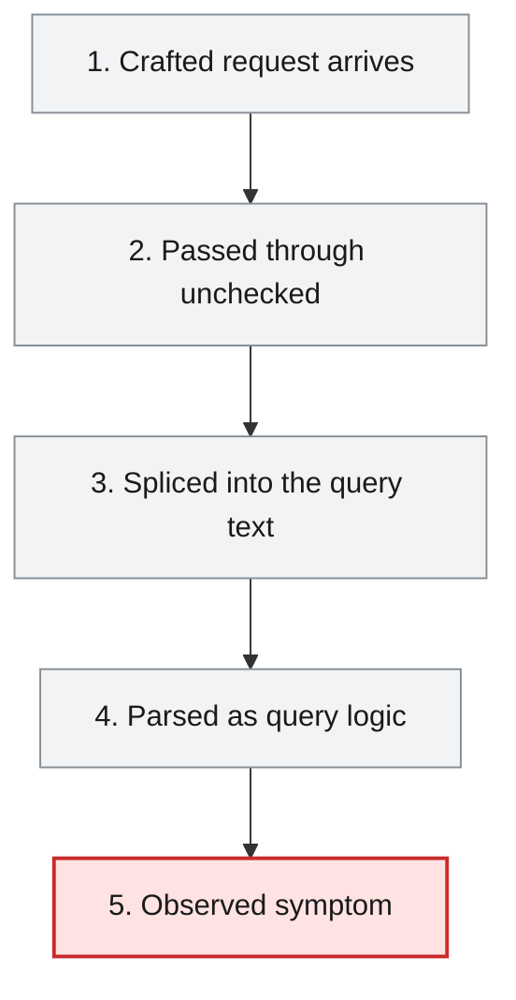
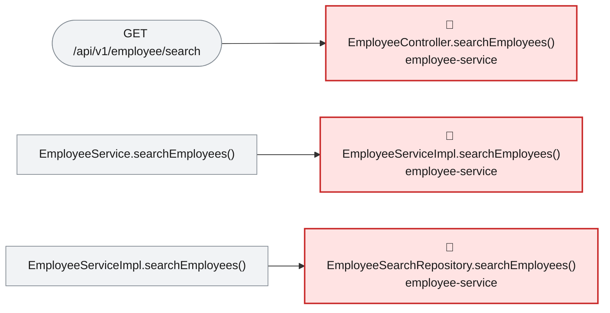

# Root Cause Analysis — ISSUE-003

## MongoDB (NoSQL) injection in the employee search endpoint via string-concatenated BasicQuery

> The employee search builds its database question by pasting whatever the caller typed straight into the text of that question, so a caller can rewrite the question itself instead of just filling in the search term — letting them switch off the filter and pull back every employee record, personal details included.

_Generated by the Root Cause Analyst agent on 2026-08-16. Evidence collected 2026-08-16T07:14:10.843Z._

## At a glance

| | |
|---|---|
| **What breaks** | `GET /api/v1/employee/search` |
| **Root cause** | The search filter is built by concatenating unescaped caller input into a JSON query string that is then parsed by `BasicQuery`, so the input is interpreted as query structure rather than bound as a query value. |
| **Where** | `employee-service/src/main/java/com/aura/vihanga/employeeservice/repository/EmployeeSearchRepository.java:21` |
| **Service** | `employee-service` |
| **Severity** | Critical (Vulnerability) |
| **Confidence** | High |

Issue: [docs/agent_output/00-issues/issue-register.xlsx](../../../docs/agent_output/00-issues/issue-register.xlsx) · Reported 2026-08-09 by Security review - injection · Status Open

<details><summary>Technical summary</summary>

`EmployeeSearchRepository.searchEmployees()` assembles the MongoDB filter as a JSON string with `StringBuilder`, appending the caller's `name` and `department` values directly into it, then hands the finished string to `new BasicQuery(...)` for `mongoTemplate.find()`. Because the values are spliced into the query document instead of being bound as values, a caller who closes the surrounding quote controls the *structure* of the query and can inject MongoDB operators (`$ne`, `$gt`, `$regex`, `$where`) that the database evaluates as query logic. The two values arrive unfiltered from `@RequestParam` in `EmployeeController.searchEmployees()` and are forwarded unchanged by `EmployeeServiceImpl.searchEmployees()`; nothing on that path validates, escapes or parameterises them. The resulting records are mapped into `EmployeeResponse` including `phoneNo`, `address` and `gender`, so a neutralised filter returns the full PII set.

</details>

## 1. What was reported

Because the value is placed inside a single-quoted JSON string that the caller can break out of, the
injected payload closes the intended `$regex` clause and appends attacker-chosen query operators.

**Benign request** — filter becomes `{ 'name': { $regex: 'Ann' } }`:
```
GET /api/v1/employee/search?name=Ann
```

**Injection — return every employee regardless of name.** Supplying a `name` that closes the
`$regex` object and injects an always-true operator turns the filter into one that matches all
documents:
```
GET /api/v1/employee/search?name=x' } }, { 'name': { $ne: '
```
The resulting filter string is
`{ 'name': { $regex: 'x' } }, { 'name': { $ne: '' } }`, i.e. the `$regex` constraint is neutralised
and the query returns the full collection.

**Injection — operator abuse via the `department` field.** The `department` value is interpolated as
a bare JSON value, so an operator document can be injected directly:
```
GET /api/v1/employee/search?name=x&department=' }, 'name': { $ne: '
```

**Injection — server-side JavaScript evaluation.** If `$where`/JavaScript execution is enabled on the
MongoDB deployment, a `$where` clause injected through the same hole runs arbitrary JavaScript in the
database engine, which can be used for boolean/time-based blind extraction and resource exhaustion.

**Reproducibility:** Deterministic. The endpoint is unauthenticated (see
**ISSUE-002**), so no credentials are needed to reach the
sink.

Source: [docs/agent_output/00-issues/issue-register.xlsx](../../../docs/agent_output/00-issues/issue-register.xlsx)

## 2. What should happen — and what happens instead

```mermaid
flowchart TB
  classDef broken fill:#ffe3e3,stroke:#c92a2a,stroke-width:2px,color:#1a1a1a
  classDef warn fill:#fff3bf,stroke:#e8590c,stroke-width:2px,color:#1a1a1a
  classDef ok fill:#e6fcf5,stroke:#2f9e44,stroke-width:1px,color:#1a1a1a
  classDef neutral fill:#f1f3f5,stroke:#868e96,stroke-width:1px,color:#1a1a1a
  subgraph EXPECTED["✅ What should happen"]
    direction LR
    E0["Caller sends a search term"]:::ok
    E1["Term is bound as a value,<br/>not as code"]:::ok
    E0 --> E1
    E2["Database matches that term<br/>literally"]:::ok
    E1 --> E2
    E3["Only matching employees<br/>come back"]:::ok
    E2 --> E3
  end
  subgraph ACTUAL["❌ What actually happens"]
    direction LR
    A0["Crafted request arrives"]:::neutral
    A1["Passed through unchecked"]:::neutral
    A0 --> A1
    A2["Spliced into the query<br/>text"]:::neutral
    A1 --> A2
    A3["Parsed as query logic"]:::neutral
    A2 --> A3
    A4["Observed symptom"]:::broken
    A3 --> A4
  end
```



## 3. How it fails, step by step

1. **Crafted request arrives** — A caller sends `GET /api/v1/employee/search` with a `name` (or `department`) value containing a quote and MongoDB operator syntax.
2. **Passed through unchecked** — `EmployeeController.searchEmployees()` reads both values from `@RequestParam` with no validation, and `EmployeeServiceImpl.searchEmployees()` forwards them to the repository unchanged.
3. **Spliced into the query text** — `EmployeeSearchRepository.searchEmployees()` appends the raw values into the JSON filter string at lines 21 and 24, so the caller's quote closes the intended literal.
4. **Parsed as query logic** — `new BasicQuery(filter.toString())` at line 31 parses the whole string as a query document, and the injected operators become part of the query MongoDB executes.
5. **Observed symptom** — The intended `$regex` constraint is neutralised and the endpoint returns records the caller was never entitled to select — up to the entire `employee` collection — each mapped into an `EmployeeResponse` with phone number and address.



## 4. Where the defect is

> **The search filter is built by concatenating unescaped caller input into a JSON query string that is then parsed by `BasicQuery`, so the input is interpreted as query structure rather than bound as a query value.**

**Location:** `employee-service/src/main/java/com/aura/vihanga/employeeservice/repository/EmployeeSearchRepository.java:21`



At `EmployeeSearchRepository.java:21` the code writes `filter.append("'name': { $regex: '").append(name).append("' }")`, and at line 24 it writes `filter.append(", 'department': '").append(department).append("'")`. Both place the raw value inside a single-quoted JSON string, and line 31 passes the assembled text to `mongoTemplate.find(new BasicQuery(filter.toString()), Employee.class)` — `BasicQuery` parses that string as a query document, so any quote the caller supplies terminates the literal and everything after it becomes query syntax. That is precisely the observed behaviour in the issue: `name=x' } }, { 'name': { $ne: '` produces the filter `{ 'name': { $regex: 'x' } }, { 'name': { $ne: '' } }`, in which the `$regex` constraint is neutralised and the query matches the whole collection. The evidence bundle's call path shows nothing standing between the HTTP boundary and this sink — `EmployeeController.searchEmployees() → EmployeeService.searchEmployees() → EmployeeServiceImpl.searchEmployees() → EmployeeSearchRepository.searchEmployees()` — and the source of both focus methods confirms it: the controller declares the parameters as bare `@RequestParam` with no `@Valid` or bean validation, and the service body only logs the values and passes them on. The consequence is amplified by what the service returns: `EmployeeServiceImpl.searchEmployees()` maps each matched document into an `EmployeeResponse` carrying `phoneNo`, `address` and `gender`, so whatever the injected filter selects is emitted with full personal detail.

**The code involved**

| Method | Service | File | Calls | Called by |
|---|---|---|---|---|
| `EmployeeController.searchEmployees()` | `employee-service` | [EmployeeController.java:50-59](../../../employee-service/src/main/java/com/aura/vihanga/employeeservice/controller/EmployeeController.java#L50-L59) | `EmployeeService.searchEmployees()` | _entry point_ |
| `EmployeeServiceImpl.searchEmployees()` | `employee-service` | [EmployeeServiceImpl.java:108-122](../../../employee-service/src/main/java/com/aura/vihanga/employeeservice/service/implementation/EmployeeServiceImpl.java#L108-L122) | `EmployeeSearchRepository.searchEmployees()` | `EmployeeService.searchEmployees()` |
| `EmployeeSearchRepository.searchEmployees()` | `employee-service` | [EmployeeSearchRepository.java:19-32](../../../employee-service/src/main/java/com/aura/vihanga/employeeservice/repository/EmployeeSearchRepository.java#L19-L32) | _none_ | `EmployeeServiceImpl.searchEmployees()` |

<details><summary>Show the source of each method</summary>

**`EmployeeController.searchEmployees()`** — `employee-service/src/main/java/com/aura/vihanga/employeeservice/controller/EmployeeController.java` lines 50-59

```java
@GetMapping("employee/search")
    public ResponseEntity<StandardResponse> searchEmployees(@RequestParam("name") String name,
                                                            @RequestParam(value = "department", required = false) String department) {
        log.trace("EmployeeController - searchEmployees - name {} department {}", name, department);
        List<EmployeeResponse> employeeResponses = employeeService.searchEmployees(name, department);

        return new ResponseEntity<StandardResponse>(
                new StandardResponse(200, "Employee Search Completed Successfully", employeeResponses), HttpStatus.OK
        );
    }
```

**`EmployeeServiceImpl.searchEmployees()`** — `employee-service/src/main/java/com/aura/vihanga/employeeservice/service/implementation/EmployeeServiceImpl.java` lines 108-122

```java
@Override
    public List<EmployeeResponse> searchEmployees(String name, String department) {
        log.trace("EmployeeServiceImpl - searchEmployees - name {} department {}", name, department);
        List<Employee> employees = employeeSearchRepository.searchEmployees(name, department);

        return employees.stream().map(employee -> EmployeeResponse.builder()
                .employeeId(employee.getEmployeeId())
                .name(employee.getName())
                .department(employee.getDepartment())
                .phoneNo(employee.getPhoneNo())
                .address(employee.getAddress())
                .gender(employee.getGender())
                .employeeType(employee.getEmployeeType())
                .build()).collect(Collectors.toList());
    }
```

Reaching paths:

- `EmployeeController.searchEmployees()` → `EmployeeService.searchEmployees()` → `EmployeeServiceImpl.searchEmployees()`

**`EmployeeSearchRepository.searchEmployees()`** — `employee-service/src/main/java/com/aura/vihanga/employeeservice/repository/EmployeeSearchRepository.java` lines 19-32

```java
public List<Employee> searchEmployees(String name, String department) {
        StringBuilder filter = new StringBuilder("{ ");
        filter.append("'name': { $regex: '").append(name).append("' }");

        if (department != null && !department.isEmpty()) {
            filter.append(", 'department': '").append(department).append("'");
        }

        filter.append(" }");

        log.info("EmployeeSearchRepository - searchEmployees - filter {}", filter);

        return mongoTemplate.find(new BasicQuery(filter.toString()), Employee.class);
    }
```

Reaching paths:

- `EmployeeController.searchEmployees()` → `EmployeeService.searchEmployees()` → `EmployeeServiceImpl.searchEmployees()` → `EmployeeSearchRepository.searchEmployees()`

</details>

## 5. What it means

The defect is contained to `employee-service` — one module, one endpoint (`GET /api/v1/employee/search`) and four types on the reaching path: `EmployeeController`, `EmployeeService`, `EmployeeServiceImpl` and `EmployeeSearchRepository`. Within that surface the consequence is severe: an attacker controls the query rather than the search term, so they can neutralise the `name` filter and enumerate the whole `employee` collection, and can use injected operators for blind boolean or time-based extraction of specific field values. Every record that comes back is mapped into an `EmployeeResponse` carrying `phoneNo`, `address`, `gender` and `employeeType`, so this is direct PII exfiltration rather than a metadata leak. Injected operators also give a cheap availability primitive — an unanchored or catastrophic `$regex`, or a `$where` clause where server-side JavaScript is enabled, forces expensive full-collection evaluation on the shared MongoDB instance, which degrades every other service on that database. Where server-side JavaScript is enabled, `$where` injection means attacker-controlled JavaScript executing inside the database engine.

**Why Critical severity:** Critical is right. Exploitation needs only a query string in a GET request, the payload is deterministic, and the direct outcome is bulk disclosure of regulated personal data with a denial-of-service primitive attached. The rating is reinforced by the register: the same endpoint is reachable with no credentials (ISSUE-002), so nothing stands between an anonymous caller and this sink.

## 6. Why it happened

- No validation layer exists at the HTTP boundary — the parameters carry no `@Valid`, no bean validation and no allow-list on length or permitted characters — so a payload containing quotes and `$` operators is accepted as an ordinary search term.
- `EmployeeSearchRepository` is a hand-written `@Repository` class using `MongoTemplate` directly, sitting outside the Spring Data derived-query convention that the rest of the codebase follows, so the safe path that other repositories get for free was bypassed here.
- Spring Data's `Criteria` API and derived queries were available and used elsewhere in the same service, meaning the unsafe construction was a local choice rather than a framework limitation.
- The endpoint has no test exercising a metacharacter-bearing search term, so the injection never surfaces in normal use — a benign `name=Ann` behaves exactly as intended.
- The assembled filter is logged at INFO (line 29), which means attacker-supplied query fragments are also written into the log sink.

## 7. How to fix it

Stop building the query as text. Express the filter with Spring Data's `Criteria` API (or a derived query such as `findByNameContainingAndDepartment`) so the values are bound into the query document as values and can never be parsed as structure — that removes the injection capability itself, rather than trying to filter the payloads that exploit it. Where a regex search is genuinely required, wrap the input in `Pattern.quote(...)` and anchor it so it is treated strictly as a literal, and add an allow-list validation on length and permitted characters at the controller boundary as defence in depth. Escaping or blacklisting characters inside the string-building approach is not a fix: it leaves the caller's input on the structural side of the boundary.

| File | Change |
|---|---|
| [EmployeeSearchRepository.java](../../../employee-service/src/main/java/com/aura/vihanga/employeeservice/repository/EmployeeSearchRepository.java) | Replace the `StringBuilder`/`BasicQuery` construction at lines 20-31 with a `Query` built from `Criteria`, binding `name` (quoted with `Pattern.quote` if regex matching is required) and `department` as values; delete the `log.info` of the assembled filter at line 29 so caller-supplied query fragments no longer reach the log sink. |
| [EmployeeController.java](../../../employee-service/src/main/java/com/aura/vihanga/employeeservice/controller/EmployeeController.java) | Validate `name` and `department` at the boundary — bean validation with a maximum length and an allow-list pattern — so oversized or metacharacter-bearing terms are rejected with 400 before reaching the service. |
| [EmployeeServiceImpl.java](../../../employee-service/src/main/java/com/aura/vihanga/employeeservice/service/implementation/EmployeeServiceImpl.java) | No behavioural change required — it only forwards the values — but confirm it keeps passing them as plain values once the repository takes bound criteria, and does not reintroduce any string assembly. |

<details><summary>Sketch of the change</summary>

```java
// Values are bound, never parsed as query structure
public List<Employee> searchEmployees(String name, String department) {
    Criteria criteria = Criteria.where("name")
            .regex(Pattern.quote(name), "i");

    if (department != null && !department.isEmpty()) {
        criteria = criteria.and("department").is(department);
    }

    return mongoTemplate.find(Query.query(criteria), Employee.class);
}
```

</details>

## 8. How to check the fix worked

1. Replay the issue's reproduction: `curl -s -G "http://localhost:8500/api/v1/employee/search" --data-urlencode "name=x' } }, { 'name': { \$ne: '"` must now return zero results (or a 400), not the full collection — compare the count against `?name=Ann` as the issue's step 4 does.
2. Replay the `department` variant `--data-urlencode "department=' }, 'name': { \$ne: '"` and confirm it likewise matches nothing rather than neutralising the name filter.
3. Add a repository test asserting that a search term containing `'`, `{`, `}` and `$` is matched as a literal string — seed a document whose name literally contains those characters, and confirm it is the only record returned.
4. Add a controller slice test asserting the benign path is unchanged: `?name=Ann` still returns exactly the employees whose name matches, with the same response shape.
5. Add a test asserting that a `$where` payload submitted through `name` returns no results and produces no database-side JavaScript evaluation.
6. Grep the employee-service log after running the injection payloads and confirm the assembled filter string no longer appears.

## 9. How to stop it happening again

- Add a static analysis rule (or SAST gate in CI) that fails the build on `new BasicQuery(<non-constant string>)` and on any query object constructed from concatenated input — this is the signature of the flaw and it is mechanically detectable.
- Make the `Criteria` API or derived queries the required convention for MongoDB access, and require review sign-off for any hand-written `MongoTemplate` repository that steps outside it.
- Require bean validation on every `@RequestParam`, `@PathVariable` and `@RequestBody` in the REST surface, so untrusted input is constrained at a single, auditable boundary.
- Add injection payloads (quote-breaking, operator injection, `$where`) to the standing test set for every search or filter endpoint, so the class of defect is exercised rather than assumed absent.
- Give the application's MongoDB user least privilege and disable server-side JavaScript (`$where`, `mapReduce` with JS) on the cluster, so a future injection cannot reach code execution in the engine.

## 10. Open questions

- Whether server-side JavaScript is enabled on the target MongoDB deployment is not determinable from the repository, so the `$where` code-execution path is a credible consequence of the same hole rather than a confirmed one — it needs checking against the cluster configuration.
- The privileges held by the application's MongoDB user are not in the evidence, so how far an injected query could reach beyond the `employee` collection cannot be stated.
- Whether an anchored, case-insensitive `Pattern.quote` regex preserves the search behaviour consumers actually expect (substring versus prefix matching) is a product decision the evidence does not settle; the sketch assumes substring matching to keep the current behaviour.
- The collector flagged `report-service` as a possible cross-service HTTP consumer of this service, but the match came from a field name containing 'employee' (`EmployeeReportRepository employeeReportRepository`) and the source shows `EmployeeReportServiceImpl` calling the department URL through its `WebClient`, not this endpoint — treat that row as a false positive unless a caller outside the repository is found.

## Appendix — how this was determined

| Input | Detail |
|---|---|
| Issue report | [docs/agent_output/00-issues/issue-register.xlsx](../../../docs/agent_output/00-issues/issue-register.xlsx) |
| Architecture document | [docs/agent_output/01-architecture/architecture.md](../../../docs/agent_output/01-architecture/architecture.md) |
| Function reference | [docs/agent_output/01-architecture/function-reference.md](../../../docs/agent_output/01-architecture/function-reference.md) |
| Code scan | `docs/agent_output/.architect/artifacts.json` (generated 2026-08-16T07:12:00.733Z) |
| Knowledge graph | Neo4j, traversal depth 4 |

<details><summary>Architecture observations considered</summary>

- Each service (`department-service`, `employee-service`, `report-service`, `sheduler-service`) follows the same layered convention: `controller` → `service` → `repository` → `model`/`entity`, backed by MongoDB repositories.
- `configuaration-server` and `discovery-service` are infrastructure services (Spring Cloud Config + Eureka) that every business service depends on at startup via `bootstrap.properties`.
- No Feign clients were detected — cross-service calls, if any, likely go through `RestTemplate`/`WebClient` rather than declarative Feign interfaces. Worth confirming if service-to-service coupling should show up as graph edges.
- The generated Neo4j graph can be queried directly (e.g. `MATCH (m:Module)-[:CONTAINS]->(t:Type) RETURN m.name, count(t)`) for deeper, ad-hoc architecture questions beyond this static document.

</details>

<details><summary>Graph queries executed</summary>

**upstream callers**

```cypher
MATCH path = (caller:Method)-[:CALLS*1..4]->(target:Method {id: $id})
         RETURN [n IN nodes(path) | n.id] AS chain LIMIT 200
```

**downstream callees**

```cypher
MATCH path = (target:Method {id: $id})-[:CALLS*1..4]->(callee:Method)
         RETURN [n IN nodes(path) | n.id] AS chain LIMIT 200
```

**owning type, module and exposed endpoints**

```cypher
MATCH (ty:Type)-[:HAS_METHOD]->(m:Method {id: $id})
         OPTIONAL MATCH (ty)-[:EXPOSES]->(e:Endpoint)
         RETURN ty.id AS typeId, ty.name AS typeName, ty.module AS module,
                collect(DISTINCT e.id) AS endpoints
```

**types depending on the owning type**

```cypher
MATCH (other:Type)-[:USES]->(ty:Type)-[:HAS_METHOD]->(:Method {id: $id})
         RETURN DISTINCT other.id AS typeId, other.name AS name, other.module AS module
```

**modules reaching the focus method**

```cypher
MATCH (caller:Method)-[:CALLS*1..4]->(:Method {id: $id})
         MATCH (ct:Type)-[:HAS_METHOD]->(caller)
         RETURN DISTINCT ct.module AS module
```

**graph node counts**

```cypher
MATCH (n) RETURN labels(n)[0] AS label, count(*) AS count ORDER BY count DESC
```

**graph relationship counts**

```cypher
MATCH ()-[r]->() RETURN type(r) AS type, count(*) AS count ORDER BY count DESC
```

**maven dependencies of affected modules**

```cypher
MATCH (m:Module)-[:DEPENDS_ON]->(dep:MavenDependency)
       WHERE m.name IN $modules
       RETURN m.name AS module, collect(dep.ga) AS dependencies
```

</details>

---

The reported symptom, the code table, the source and the call paths are rendered verbatim from the issue, the code scan and the knowledge graph. The plain-language summary, the causal chain, the root cause, what it means, why it happened, the fix, the verification steps and the prevention measures are the judgement of the Root Cause Analyst agent.
