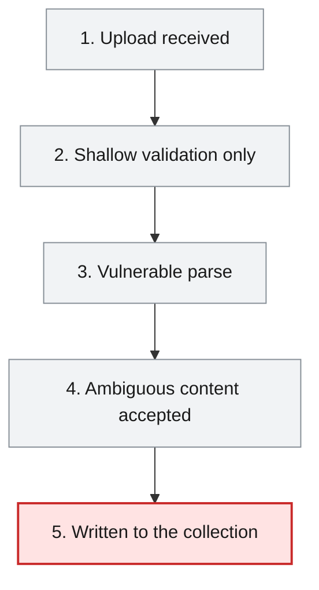
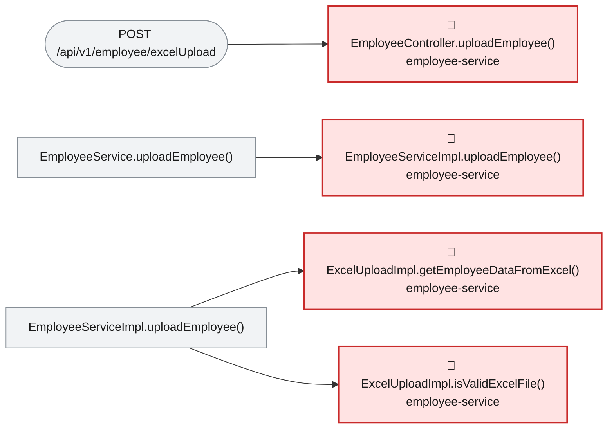

# Root Cause Analysis — ISSUE-004

## Outdated Apache POI (poi-ooxml 5.0.0) dependency exposes the employee Excel-upload endpoint to a known OOXML parsing vulnerability (CVE-2025-31672)

> The employee Excel-upload feature hands attacker-uploaded files straight to a years-old version of a file-parsing library that has a known, public bug in exactly the part of the file it reads first.

_Generated by the Root Cause Analyst agent on 2026-08-31. Evidence collected 2026-08-31T03:26:04.871Z._

## At a glance

| | |
|---|---|
| **What breaks** | Outdated Apache POI (poi-ooxml 5.0.0) dependency exposes the employee Excel-upload endpoint to a known OOXML parsing vulnerability (CVE-2025-31672) |
| **Root cause** | employee-service pins org.apache.poi:poi-ooxml at version 5.0.0, which is affected by CVE-2025-31672, and that exact version is what parses caller-uploaded files in ExcelUploadImpl.getEmployeeDataFromExcel. |
| **Where** | `employee-service/pom.xml (poi-ooxml <version>5.0.0</version>); exercised at employee-service/src/main/java/com/aura/vihanga/employeeservice/service/implementation/ExcelUploadImpl.java:30` |
| **Service** | `employee-service` |
| **Severity** | Medium (Vulnerability) |
| **Confidence** | High |

Issue: [docs/agent_output/00-issues/issue-register.xlsx](../../../docs/agent_output/00-issues/issue-register.xlsx) · Reported 2026-08-30 by Dependency audit · Status Open

<details><summary>Technical summary</summary>

employee-service/pom.xml explicitly pins org.apache.poi:poi-ooxml to 5.0.0, a version affected by CVE-2025-31672 (the OOXML reader performs no uniqueness check on ZIP entry paths, so a crafted archive can make different code paths disagree about what content they are reading). ExcelUploadImpl.getEmployeeDataFromExcel constructs a new XSSFWorkbook directly from the caller-uploaded MultipartFile's input stream, with only a client-supplied Content-Type string checked beforehand (ExcelUploadImpl.isValidExcelFile) — not a structural validation of the archive. The vulnerable version is therefore exercised directly on untrusted input reachable from POST /api/v1/employee/excelUpload.

</details>

## 1. What was reported

employee-service/pom.xml declares <groupId>org.apache.poi</groupId><artifactId>poi-ooxml</artifactId><version>5.0.0</version> as an explicit, hand-pinned version - not inherited from the spring-boot-starter-parent (which does not manage a POI version at all), and not overridden anywhere else in the module.
Version 5.0.0 was released before the CVE-2025-31672 fix; the advisory affects poi-ooxml before 5.4.0.
ExcelUploadImpl.getEmployeeDataFromExcel constructs the workbook directly from the multipart upload stream with no pre-parse structural validation and no size/entry-count limit.
isValidExcelFile only compares the request's declared Content-Type string - it does not open or validate the archive structure itself, so it provides no defence against a crafted file with a spoofed or accurate Content-Type header.

Source: [docs/agent_output/00-issues/issue-register.xlsx](../../../docs/agent_output/00-issues/issue-register.xlsx)

## 2. What should happen — and what happens instead

```mermaid
flowchart TB
  classDef broken fill:#ffe3e3,stroke:#c92a2a,stroke-width:2px,color:#1a1a1a
  classDef warn fill:#fff3bf,stroke:#e8590c,stroke-width:2px,color:#1a1a1a
  classDef ok fill:#e6fcf5,stroke:#2f9e44,stroke-width:1px,color:#1a1a1a
  classDef neutral fill:#f1f3f5,stroke:#868e96,stroke-width:1px,color:#1a1a1a
  subgraph EXPECTED["✅ What should happen"]
    direction LR
    E0["Caller uploads an .xlsx<br/>file"]:::ok
    E1["Content-Type and file<br/>structure are both<br/>validated"]:::ok
    E0 --> E1
    E2["A non-vulnerable POI<br/>version parses the archive"]:::ok
    E1 --> E2
    E3["Rows are safely mapped to<br/>Employee records"]:::ok
    E2 --> E3
  end
  subgraph ACTUAL["❌ What actually happens"]
    direction LR
    A0["Upload received"]:::neutral
    A1["Shallow validation only"]:::neutral
    A0 --> A1
    A2["Vulnerable parse"]:::neutral
    A1 --> A2
    A3["Ambiguous content accepted"]:::neutral
    A2 --> A3
    A4["Written to the collection"]:::broken
    A3 --> A4
  end
```



## 3. How it fails, step by step

1. **Upload received** — POST /api/v1/employee/excelUpload reaches EmployeeController.uploadEmployee() with a caller-supplied MultipartFile.
2. **Shallow validation only** — EmployeeServiceImpl.uploadEmployee() calls ExcelUploadImpl.isValidExcelFile(), which only compares the client-supplied Content-Type header string — it never opens or structurally validates the archive.
3. **Vulnerable parse** — ExcelUploadImpl.getEmployeeDataFromExcel() constructs new XSSFWorkbook(multipartFile.getInputStream()) using poi-ooxml 5.0.0, which performs no uniqueness check on ZIP entry paths inside the OOXML package (CVE-2025-31672).
4. **Ambiguous content accepted** — A crafted archive with duplicate ZIP entry paths is loaded without rejection, so the library's own read of the file's content can disagree with what another tool sees for the same file.
5. **Written to the collection** — Parsed rows are mapped to Employee objects and persisted via employeeRepository.saveAll(), so a successful parse of ambiguous content is written straight into the employee collection with no further check.



## 4. Where the defect is

> **employee-service pins org.apache.poi:poi-ooxml at version 5.0.0, which is affected by CVE-2025-31672, and that exact version is what parses caller-uploaded files in ExcelUploadImpl.getEmployeeDataFromExcel.**

**Location:** `employee-service/pom.xml (poi-ooxml <version>5.0.0</version>); exercised at employee-service/src/main/java/com/aura/vihanga/employeeservice/service/implementation/ExcelUploadImpl.java:30`



The evidence bundle's focus points confirm a direct, unbroken call chain from the public endpoint to the vulnerable code: EmployeeController.uploadEmployee() (POST /api/v1/employee/excelUpload) calls EmployeeService.uploadEmployee() -> EmployeeServiceImpl.uploadEmployee(), which calls ExcelUploadImpl.isValidExcelFile() (a Content-Type string comparison only) and then ExcelUploadImpl.getEmployeeDataFromExcel(), which constructs `new XSSFWorkbook(multipartFile.getInputStream())` directly from the upload — the exact poi-ooxml OOXML-package-loading code path CVE-2025-31672 describes. pom.xml pins poi-ooxml to 5.0.0 explicitly (not inherited from the Spring Boot parent, which does not manage a POI version at all), and 5.0.0 predates the fix shipped in 5.4.0.

**The code involved**

| Method | Service | File | Calls | Called by |
|---|---|---|---|---|
| `EmployeeController.uploadEmployee()` | `employee-service` | [EmployeeController.java:41-48](../../../employee-service/src/main/java/com/aura/vihanga/employeeservice/controller/EmployeeController.java#L41-L48) | `EmployeeService.uploadEmployee()` | _entry point_ |
| `EmployeeServiceImpl.uploadEmployee()` | `employee-service` | [EmployeeServiceImpl.java:124-131](../../../employee-service/src/main/java/com/aura/vihanga/employeeservice/service/implementation/EmployeeServiceImpl.java#L124-L131) | `ExcelUploadImpl.isValidExcelFile()`, `ExcelUploadImpl.getEmployeeDataFromExcel()` | `EmployeeService.uploadEmployee()` |
| `ExcelUploadImpl.getEmployeeDataFromExcel()` | `employee-service` | [ExcelUploadImpl.java:27-64](../../../employee-service/src/main/java/com/aura/vihanga/employeeservice/service/implementation/ExcelUploadImpl.java#L27-L64) | _none_ | `EmployeeServiceImpl.uploadEmployee()` |
| `ExcelUploadImpl.isValidExcelFile()` | `employee-service` | [ExcelUploadImpl.java:22-25](../../../employee-service/src/main/java/com/aura/vihanga/employeeservice/service/implementation/ExcelUploadImpl.java#L22-L25) | _none_ | `EmployeeServiceImpl.uploadEmployee()` |

<details><summary>Show the source of each method</summary>

**`EmployeeController.uploadEmployee()`** — `employee-service/src/main/java/com/aura/vihanga/employeeservice/controller/EmployeeController.java` lines 41-48

```java
@PostMapping("employee/excelUpload")
    public ResponseEntity<StandardResponse> uploadEmployee(@RequestParam("file") MultipartFile multipartFile) throws IOException {
        employeeService.uploadEmployee(multipartFile);

        return new ResponseEntity<StandardResponse>(
                new StandardResponse(201, "File Upload Successfully", null), HttpStatus.OK
        );
    }
```

**`EmployeeServiceImpl.uploadEmployee()`** — `employee-service/src/main/java/com/aura/vihanga/employeeservice/service/implementation/EmployeeServiceImpl.java` lines 124-131

```java
@Override
    public void uploadEmployee(MultipartFile multipartFile) throws IOException {
//        log.trace("EmployeeServiceImpl - uploadEmployee - multipartFile {}", multipartFile);
        if (ExcelUploadImpl.isValidExcelFile(multipartFile)) {
            List<Employee> employees = ExcelUploadImpl.getEmployeeDataFromExcel(multipartFile);
            employeeRepository.saveAll(employees);
        }
    }
```

Reaching paths:

- `EmployeeController.uploadEmployee()` → `EmployeeService.uploadEmployee()` → `EmployeeServiceImpl.uploadEmployee()`

**`ExcelUploadImpl.getEmployeeDataFromExcel()`** — `employee-service/src/main/java/com/aura/vihanga/employeeservice/service/implementation/ExcelUploadImpl.java` lines 27-64

```java
public static List<Employee> getEmployeeDataFromExcel(MultipartFile multipartFile) throws IOException {
        List<Employee> employees = new ArrayList<>();

        Workbook workbook = new XSSFWorkbook(multipartFile.getInputStream());
        Sheet sheet = workbook.getSheetAt(0);


        for(int i = 1; i <= sheet.getLastRowNum(); i++) {
            Row currentRow = sheet.getRow(i);


            Employee employee = new Employee();
            employee.setEmployeeId(currentRow.getCell(0).getStringCellValue());
            employee.setName(currentRow.getCell(1).getStringCellValue());
            employee.setDepartment(currentRow.getCell(2).getStringCellValue());
            Cell phoneNoCell = currentRow.getCell(3);
            if (phoneNoCell.getCellType() == CellType.STRING) {
                employee.setPhoneNo(phoneNoCell.getStringCellValue());
            } else if (phoneNoCell.getCellType() == CellType.NUMERIC) {
                employee.setPhoneNo(String.valueOf(phoneNoCell.getNumericCellValue()));
            } else {
                employee.setPhoneNo("");
            }
            employee.setAddress(currentRow.getCell(4).getStringCellValue());
            employee.setGender(GenderType.valueOf(currentRow.getCell(5).getStringCellValue()));
            employee.setEmployeeType(EmployeeType.valueOf(currentRow.getCell(6).getStringCellValue()));


            employees.add(employee);

        }

        workbook.close();

        return employees;
    }
```

Reaching paths:

- `EmployeeController.uploadEmployee()` → `EmployeeService.uploadEmployee()` → `EmployeeServiceImpl.uploadEmployee()` → `ExcelUploadImpl.getEmployeeDataFromExcel()`

**`ExcelUploadImpl.isValidExcelFile()`** — `employee-service/src/main/java/com/aura/vihanga/employeeservice/service/implementation/ExcelUploadImpl.java` lines 22-25

```java
public static boolean isValidExcelFile(MultipartFile multipartFile) {
        String expectedContentType = "application/vnd.openxmlformats-officedocument.spreadsheetml.sheet";
        return Objects.equals(multipartFile.getContentType(), expectedContentType);
    }
```

Reaching paths:

- `EmployeeController.uploadEmployee()` → `EmployeeService.uploadEmployee()` → `EmployeeServiceImpl.uploadEmployee()` → `ExcelUploadImpl.isValidExcelFile()`

</details>

## 5. What it means

A crafted .xlsx upload to POST /api/v1/employee/excelUpload can trigger content-confusion in how the file is parsed, per the advisory's own description of the defect (different tools/paths disagreeing about the file's actual contents). Because this endpoint feeds parsed rows straight into employeeRepository.saveAll() with no further validation, an ambiguous-content condition here has a direct path to inserting attacker-influenced employee records. This is an integrity issue, not remote code execution or direct data exfiltration — the advisory itself characterises it as improper input validation leading to integrity loss. It also compounds with the separately-reported missing authentication on this endpoint (ISSUE-002): today any caller, not just a trusted internal user, can reach the vulnerable parse.

**Why Medium severity:** Medium is appropriate: the defect is real, concretely reachable, and confirmed by a public advisory, but its own characterisation is content-integrity/parser-confusion rather than remote code execution, credential exposure, or direct bulk data exfiltration — the outcomes that would justify High or Critical for the other three issues already in this register.

## 6. Why it happened

- The dependency version was pinned once when the module was first built and never revisited against new advisories.
- isValidExcelFile validates only the request's declared Content-Type, which a caller fully controls, giving no structural defence independent of the library version.
- No dependency-vulnerability check (e.g. an OWASP dependency-check gate in the build) currently runs in this project to flag an outdated, advisory-affected version automatically.

## 7. How to fix it

Bump org.apache.poi:poi-ooxml from 5.0.0 to the minimum version that remediates CVE-2025-31672 (5.4.0 per the advisory's own fixed-version boundary), pinned explicitly in employee-service/pom.xml exactly as it is today. This closes the root cause directly — the vulnerable parsing code path is what gets replaced, not the calling code around it — and is confirmed by checking that the *resolved* dependency (via `mvn dependency:tree`), not just the declared version text, reflects the bump.

| File | Change |
|---|---|
| [pom.xml](../../../employee-service/pom.xml) | Change the org.apache.poi:poi-ooxml <version> from 5.0.0 to 5.4.0 (or later). |

<details><summary>Sketch of the change</summary>

```java
<dependency>
    <groupId>org.apache.poi</groupId>
    <artifactId>poi-ooxml</artifactId>
    <version>5.4.0</version>
</dependency>
```

</details>

## 8. How to check the fix worked

1. Confirm employee-service/pom.xml declares poi-ooxml >= 5.4.0.
2. Compile employee-service and run `mvn dependency:tree` filtered to org.apache.poi, confirming the resolved (not just declared) version is >= 5.4.0.
3. Re-run the CVE-2025-31672 reproduction case (an .xlsx with duplicate ZIP entry paths) and confirm the patched version rejects/throws rather than silently accepting the ambiguous archive, versus 5.0.0's silent acceptance.
4. Confirm a benign .xlsx upload still parses and persists Employee rows exactly as before — this bump should not change any legitimate behavior.

## 9. How to stop it happening again

- Add a dependency-vulnerability scan (e.g. OWASP dependency-check or a Maven advisory plugin) to the build so a newly-disclosed CVE against an in-use version is flagged automatically rather than discovered by manual audit.
- Track third-party library versions as something to periodically revisit, not a one-time pin at the time a dependency is first added.
- Pair a dependency-version fix with structural upload validation (independent of the parsing library's own version) as defence-in-depth — tracked separately, out of scope for this specific fix.

## 10. Open questions

- Whether any other module in this workspace also depends on org.apache.poi transitively at a vulnerable version — only employee-service's direct, explicit pin was investigated here.

## Appendix — how this was determined

| Input | Detail |
|---|---|
| Issue report | [docs/agent_output/00-issues/issue-register.xlsx](../../../docs/agent_output/00-issues/issue-register.xlsx) |
| Architecture document | [docs/agent_output/01-architecture/architecture.md](../../../docs/agent_output/01-architecture/architecture.md) |
| Function reference | [docs/agent_output/01-architecture/function-reference.md](../../../docs/agent_output/01-architecture/function-reference.md) |
| Code scan | `.github/.pipeline-context/artifacts.json` (generated 2026-08-31T03:24:44.772Z) |
| Knowledge graph | not used — skipped via --no-graph |

<details><summary>Architecture observations considered</summary>

- Each service (`department-service`, `employee-service`, `report-service`, `sheduler-service`) follows the same layered convention: `controller` → `service` → `repository` → `model`/`entity`, backed by MongoDB repositories.
- `configuaration-server` and `discovery-service` are infrastructure services (Spring Cloud Config + Eureka) that every business service depends on at startup via `bootstrap.properties`.
- No Feign clients were detected — cross-service calls, if any, likely go through `RestTemplate`/`WebClient` rather than declarative Feign interfaces. Worth confirming if service-to-service coupling should show up as graph edges.
- The generated Neo4j graph can be queried directly (e.g. `MATCH (m:Module)-[:CONTAINS]->(t:Type) RETURN m.name, count(t)`) for deeper, ad-hoc architecture questions beyond this static document.

</details>

_No Cypher was run: skipped via --no-graph_ Call-graph facts came from the code scan, using the same resolution rules Graph Forge applies when it builds the graph.

---

The reported symptom, the code table, the source and the call paths are rendered verbatim from the issue, the code scan and the knowledge graph. The plain-language summary, the causal chain, the root cause, what it means, why it happened, the fix, the verification steps and the prevention measures are the judgement of the Root Cause Analyst agent.
