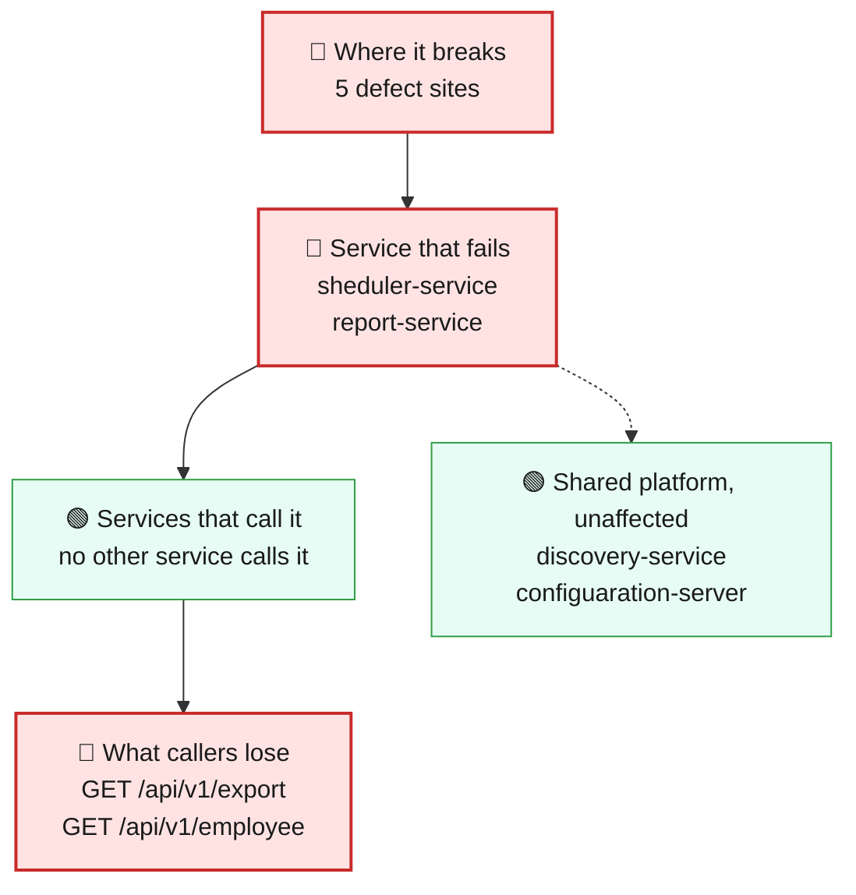
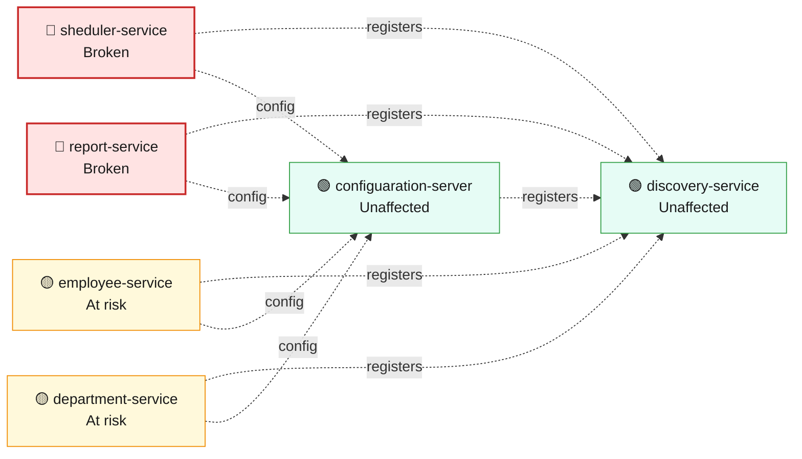

# Blast Radius — ISSUE-001

## Unbounded repository findAll() reads whole collections into memory across multiple services

> Asking for the employee list or the payroll export makes the platform pull every employee record into memory at once, so both get slower and less reliable as the workforce data grows.

_Generated by the Blast Radius Analyst on 2026-08-16. Reach measured 2026-08-16T07:14:23.965Z._

## At a glance

| | |
|---|---|
| **Priority** | P2 — nothing is failing at today's data volume, but the failure mode is a whole-service outage that arrives without warning as the workforce data grows; fix in the next release rather than after the first incident. |
| **Severity** | High |
| **How far it spreads** | Multiple services |
| **Services broken** | `sheduler-service`, `report-service` |
| **Services degraded** | none |
| **Endpoints down** | 2 of 10 |
| **Scheduled jobs hit** | 1 |
| **Confidence** | Medium |

Root cause: [docs/agent_output/02-root-cause/root_cause_ISSUE-001.md](../../../docs/agent_output/02-root-cause/root_cause_ISSUE-001.md) · Issue: [docs/agent_output/00-issues/issue-register.xlsx](../../../docs/agent_output/00-issues/issue-register.xlsx)

## 1. What is broken

Two paths fetch the entire employee dataset on every single call, with no page size, no filter and no limit: the employee list, and the payroll spreadsheet export. Both still return the right answer today, which is why nothing looks wrong at the current data volume. The cost of each call is set by how many employee records exist rather than by what the caller asked for, and the export path multiplies that further by matching every employee against every department in memory and holding the finished spreadsheet in memory before sending a single byte. As the workforce data grows, or when several of these calls arrive together, the two services slow down, then run out of memory and restart. It fails by degrees, not all at once.

## 2. How far it spreads



| Ring | What it means |
|---|---|
| 🔴 Where it breaks | `EmployeeSchedulerServiceImpl.getAllEmployees()`, `EmployeeReportServiceImpl.getEmployees()`, `WomenDaySchedulerImpl.printWomenDayMessage()`, `EmployeeSchedulerController.getAllEmployees()`, `EmployeeReportController.exportToExcel()` |
| 🔴 Service that fails | The damage is not confined to the two calls that cause it. Running out of memory takes down the whole service process, so everything else it hosts stops until it restarts. On the scheduler side that includes the annual Women's Day greeting job, which runs through the same unbounded read and then filters the results afterwards. |
| 🟢 Services that call it | Nothing else in the platform calls either affected service over the network, so no other service fails as a direct consequence. The failure is contained to the two services that carry the defect. |
| 🟡 Wider platform | Both affected services read from the same shared employee data store as the employee and department services. One full scan is harmless; repeated full scans put avoidable load on shared database capacity, and that is the only route by which otherwise-healthy services would feel this at all. |

## 3. Which services are affected



| Service | Status | What happens to it |
|---|---|---|
| `sheduler-service` | 🔴 Broken | Contains the defect. This is where the failure starts. |
| `report-service` | 🔴 Broken | Contains the defect. This is where the failure starts. |
| `employee-service` | 🟡 At risk | Shares infrastructure with the broken service, so heavy load or exhaustion there can spill over. |
| `discovery-service` | 🟢 Unaffected | Not on any path to the defect. Keeps working normally. |
| `department-service` | 🟡 At risk | Shares infrastructure with the broken service, so heavy load or exhaustion there can spill over. |
| `configuaration-server` | 🟢 Unaffected | Not on any path to the defect. Keeps working normally. |

## 4. Which endpoints are affected

| Endpoint | Service | Status | What a caller sees |
|---|---|---|---|
| `GET /api/v1/export` | `report-service` | 🔴 Broken | Request fails — this path runs the defect |
| `GET /api/v1/employee` | `sheduler-service` | 🔴 Broken | Request fails — this path runs the defect |

<details><summary>8 endpoint(s) not affected</summary>

| Endpoint | Service |
|---|---|
| `GET /api/v1/department/{id}` | `department-service` |
| `GET /api/v1/department/salary/{minSalary}` | `department-service` |
| `POST /api/v1/department` | `department-service` |
| `GET /api/v1/employee/{id}` | `employee-service` |
| `GET /api/v1/employee/salary/{id}` | `employee-service` |
| `GET /api/v1/employee/search` | `employee-service` |
| `POST /api/v1/employee` | `employee-service` |
| `POST /api/v1/employee/excelUpload` | `employee-service` |

</details>

**Scheduled jobs on the failing path**

| Job | Service | Runs |
|---|---|---|
| `WomenDaySchedulerImpl.printWomenDayMessage()` | `sheduler-service` | cron `0 0 0 8 3 *` |

## 5. What happens on a single request

```mermaid
flowchart LR
  classDef broken fill:#ffe3e3,stroke:#c92a2a,stroke-width:2px,color:#1a1a1a
  classDef degraded fill:#fff3bf,stroke:#e8590c,stroke-width:2px,color:#1a1a1a
  classDef atrisk fill:#fff9db,stroke:#f08c00,stroke-width:1px,color:#1a1a1a
  classDef ok fill:#e6fcf5,stroke:#2f9e44,stroke-width:1px,color:#1a1a1a
  classDef neutral fill:#f1f3f5,stroke:#868e96,stroke-width:1px,color:#1a1a1a
  CALLER(["Caller"]):::neutral
  EP["GET /api/v1/export"]:::neutral
  CALLER --> EP
  N0["EmployeeReportController.exportToExcel()"]:::neutral
  EP --> N0
  N1["EmployeeSchedulerServiceImpl.getAllEmployees()"]:::neutral
  N0 --> N1
  N2["EmployeeReportServiceImpl.getEmployees()"]:::broken
  N1 --> N2
  FAIL["❌ loads the whole employee dataset"]:::broken
  N2 --> FAIL
```



## 6. Who feels it

| Who | What they experience | Status |
|---|---|---|
| Anyone requesting the employee list | The list still comes back, but it returns every employee ever recorded and takes longer to arrive the more staff there are — and the request can fail outright once the service is under memory pressure. | Degraded |
| HR and payroll staff exporting the salary spreadsheet | The export works but grows slower with every new employee added, and can time out or fail on a large dataset — with no partial file and no warning beforehand. | At risk |
| The annual Women's Day greeting job | It reads the whole workforce dataset to pick out a fraction of it. If it collides with an export or a busy period, it can push the service over its memory limit. | At risk |
| Teams whose services share the same employee data store | Normal operation today. Repeated whole-dataset reads consume shared database capacity, so heavy use of these two paths can slow their own queries. | At risk |

## 7. What is NOT affected

Scoping the damage matters as much as describing it.

- Services working normally: `discovery-service`, `configuaration-server`
- Looking up a single employee, or a single employee's salary, is untouched — those paths ask for one record and get one record.
- Creating an employee and uploading the employee spreadsheet are unaffected.
- All three department paths are unaffected: they neither run this code nor call the services that do.
- The service discovery and configuration servers are unaffected.
- No data is lost, corrupted or wrongly calculated — the results returned are correct, they are simply far larger and more expensive than they need to be.
- At small data volumes nothing fails at all; this is a defect that arrives with growth, not one that is failing right now.

## 8. Containment and priority

**Priority:** P2 — nothing is failing at today's data volume, but the failure mode is a whole-service outage that arrives without warning as the workforce data grows; fix in the next release rather than after the first incident.

**If it is not fixed:** The margin shrinks with every employee record added. Response times and memory use climb in step with the dataset until the first out-of-memory restart, after which the two services become intermittently unavailable under ordinary load — and the annual scheduled job becomes progressively more likely to be the thing that tips them over.

**Containment steps**

- Put a memory and restart alert on both affected services so an approaching failure is visible before users notice.
- Track the size of the employee dataset and treat continued growth as the countdown on this defect.
- Run the payroll export outside business hours until it is bounded, and avoid running two exports at once.
- Rate-limit the employee list and the export at the gateway so a burst of calls cannot exhaust memory.
- Do not raise the memory limit and consider it handled — that moves the failure point without removing it.

The fix itself is in the root cause report: [Recommended Fix](../../../docs/agent_output/02-root-cause/root_cause_ISSUE-001.md).

## 9. Open questions

- How many employee records exist today, and how fast is that number growing? That is what decides whether this is months away or weeks away.
- How often is the payroll export called, and is it ever called concurrently? Concurrency multiplies the memory cost.
- What heap limit are the two affected services running with in production? The code cannot show this.
- The export path also fetches the full department list over the network on every call. The extra load that places on the department service was not part of this measurement.

## Appendix — how this was measured

| Input | Detail |
|---|---|
| Root cause report | [docs/agent_output/02-root-cause/root_cause_ISSUE-001.md](../../../docs/agent_output/02-root-cause/root_cause_ISSUE-001.md) |
| Issue report | [docs/agent_output/00-issues/issue-register.xlsx](../../../docs/agent_output/00-issues/issue-register.xlsx) |
| Architecture document | [docs/agent_output/01-architecture/architecture.md](../../../docs/agent_output/01-architecture/architecture.md) |
| Function reference | [docs/agent_output/01-architecture/function-reference.md](../../../docs/agent_output/01-architecture/function-reference.md) |
| Code scan | `.github/.architect/artifacts.json` |
| Knowledge graph | Neo4j, traversal depth 6 |

**Rules used to assign status**

- 🔴 **Broken** — the service contains the defect, or an endpoint whose handler reaches it
- 🟠 **Degraded** — the service calls a broken service over HTTP; its own code is sound
- 🟡 **At risk** — shares infrastructure with a broken service
- 🟢 **Unaffected** — no code path and no HTTP call to anything broken

Scope for this issue is **multi-service**, so every endpoint hosted by the broken service is marked down.

<details><summary>Graph queries executed</summary>

**endpoints whose handler reaches the defect**

```cypher
MATCH (ty:Type)-[:EXPOSES]->(e:Endpoint)
       MATCH (ty)-[:HAS_METHOD]->(handler:Method)
       MATCH (handler)-[:CALLS*0..6]->(target:Method)
       WHERE target.id IN $defectIds
       RETURN DISTINCT e.id AS endpoint, ty.module AS module, ty.name AS controller
```

**modules that reach the defect in code**

```cypher
MATCH (caller:Method)-[:CALLS*1..6]->(target:Method)
       WHERE target.id IN $defectIds
       MATCH (ct:Type)-[:HAS_METHOD]->(caller)
       RETURN DISTINCT ct.module AS module
```

**endpoint count per affected module**

```cypher
MATCH (m:Module)-[:CONTAINS]->(ty:Type)-[:EXPOSES]->(e:Endpoint)
       WHERE m.name IN $modules
       RETURN m.name AS module, collect(DISTINCT e.id) AS endpoints
```

**types depending on the affected modules**

```cypher
MATCH (other:Type)-[:USES]->(t:Type)
       WHERE t.module IN $modules AND other.module <> t.module
       RETURN DISTINCT other.module AS module, other.name AS type, t.name AS dependsOn
```

**infrastructure shared with other modules**

```cypher
MATCH (m:Module)-[:DEPENDS_ON]->(dep:MavenDependency)<-[:DEPENDS_ON]-(other:Module)
       WHERE m.name IN $modules AND NOT other.name IN $modules
         AND dep.artifactId IN ['spring-boot-starter-data-mongodb','spring-cloud-starter-config','spring-cloud-starter-netflix-eureka-client']
       RETURN dep.artifactId AS dependency, collect(DISTINCT other.name) AS alsoUsedBy
```

**graph size**

```cypher
MATCH (n) RETURN labels(n)[0] AS label, count(*) AS count ORDER BY count DESC
```

</details>

---

Sections 3, 4, 5 and 7 (service lists) are measured from the code scan and the knowledge graph. Sections 1, 2 (ring descriptions), 6 and 8 are the analyst's judgement, scoped to that measurement.
