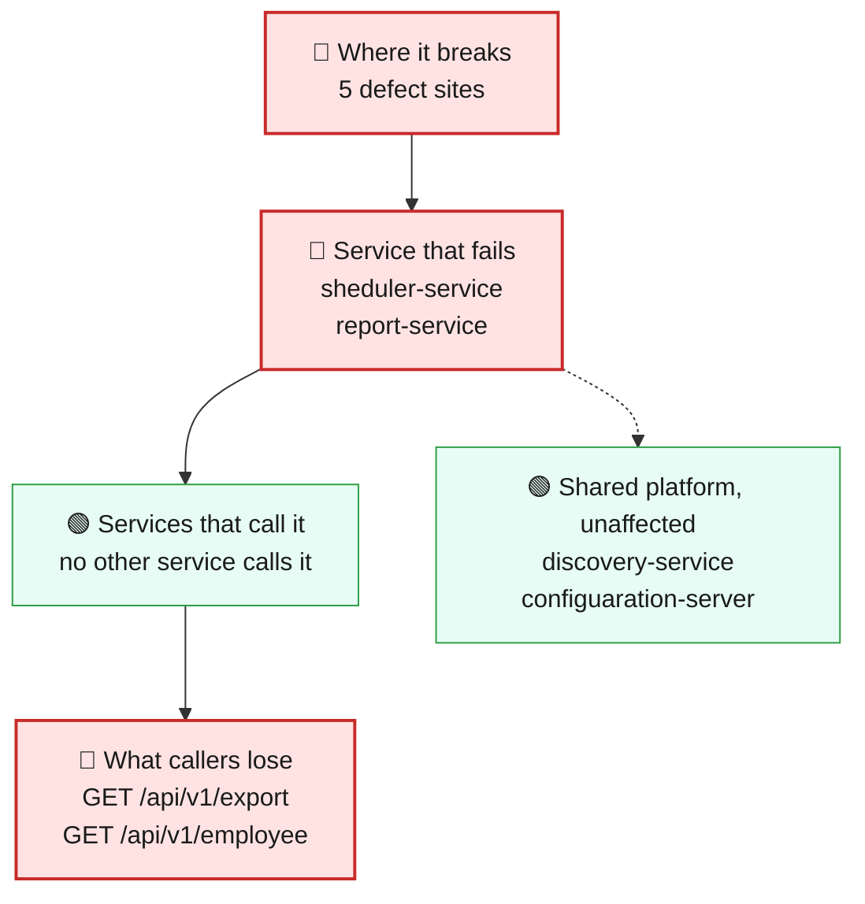
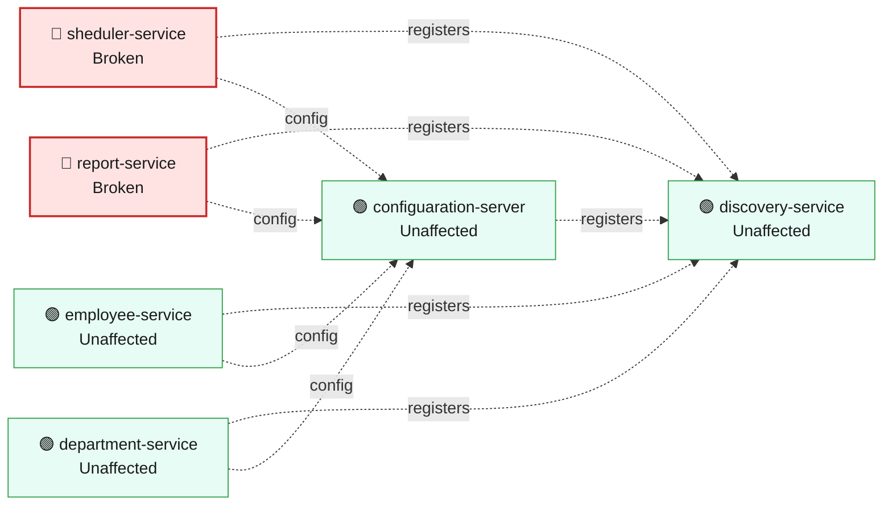

# Blast Radius — ISSUE-001

## Unbounded repository findAll() reads whole collections into memory across multiple services

> Large employee lists and payroll exports can become slow or fail when they try to hold the full collection in memory.

_Generated by the Blast Radius Analyst on 2026-08-16. Reach measured 2026-08-16T20:41:55.140Z._

## At a glance

| | |
|---|---|
| **Priority** | P1 - availability risk grows with employee data volume and can disrupt employee lists, payroll exports, and the scheduled task. |
| **Severity** | High |
| **How far it spreads** | One endpoint |
| **Services broken** | `sheduler-service`, `report-service` |
| **Services degraded** | none |
| **Endpoints down** | 2 of 10 |
| **Scheduled jobs hit** | 1 |
| **Confidence** | Medium |

Root cause: [docs/agent_output/02-root-cause/root_cause_ISSUE-001.md](../../../docs/agent_output/02-root-cause/root_cause_ISSUE-001.md) · Issue: [docs/agent_output/00-issues/issue-register.xlsx](../../../docs/agent_output/00-issues/issue-register.xlsx)

## 1. What is broken

The employee-list request and payroll export load every employee before returning a result. They can work with small collections, but as the employee data grows they consume increasing memory and processing time, and may time out or fail under load.

## 2. How far it spreads



| Ring | What it means |
|---|---|
| 🔴 Where it breaks | `EmployeeSchedulerServiceImpl.getAllEmployees()`, `EmployeeReportServiceImpl.getEmployees()`, `WomenDaySchedulerImpl.printWomenDayMessage()`, `EmployeeSchedulerController.getAllEmployees()`, `EmployeeReportController.exportToExcel()` |
| 🔴 Service that fails | The employee-list request and payroll export are the measured request paths at risk. The annual Women's Day task uses the same unbounded employee list, so its run can also become slow or fail as records grow. |
| 🟢 Services that call it | No other service is measured as calling either affected service over HTTP, so this defect does not create a confirmed downstream service outage. |
| 🟢 Wider platform | The affected services share MongoDB with other business services. Those other services remain unaffected by the measured code paths, but database pressure is an operational risk if the unbounded reads become large. |

## 3. Which services are affected



| Service | Status | What happens to it |
|---|---|---|
| `sheduler-service` | 🔴 Broken | Contains the defect. This is where the failure starts. |
| `report-service` | 🔴 Broken | Contains the defect. This is where the failure starts. |
| `employee-service` | 🟢 Unaffected | Not on any path to the defect. Keeps working normally. |
| `discovery-service` | 🟢 Unaffected | Not on any path to the defect. Keeps working normally. |
| `department-service` | 🟢 Unaffected | Not on any path to the defect. Keeps working normally. |
| `configuaration-server` | 🟢 Unaffected | Not on any path to the defect. Keeps working normally. |

## 4. Which endpoints are affected

| Endpoint | Service | Status | What a caller sees |
|---|---|---|---|
| `GET /api/v1/export` | `report-service` | 🔴 Broken | Request fails — this path runs the defect |
| `GET /api/v1/employee` | `sheduler-service` | 🔴 Broken | Request fails — this path runs the defect |

<details><summary>8 endpoint(s) not affected</summary>

| Endpoint | Service |
|---|---|
| `GET /api/v1/department/{id}` | `department-service` |
| `GET /api/v1/department/salary/{minSalary}` | `department-service` |
| `POST /api/v1/department` | `department-service` |
| `GET /api/v1/employee/{id}` | `employee-service` |
| `GET /api/v1/employee/salary/{id}` | `employee-service` |
| `GET /api/v1/employee/search` | `employee-service` |
| `POST /api/v1/employee` | `employee-service` |
| `POST /api/v1/employee/excelUpload` | `employee-service` |

</details>

**Scheduled jobs on the failing path**

| Job | Service | Runs |
|---|---|---|
| `WomenDaySchedulerImpl.printWomenDayMessage()` | `sheduler-service` | cron `0 0 0 8 3 *` |

## 5. What happens on a single request

```mermaid
flowchart LR
  classDef broken fill:#ffe3e3,stroke:#c92a2a,stroke-width:2px,color:#1a1a1a
  classDef degraded fill:#fff3bf,stroke:#e8590c,stroke-width:2px,color:#1a1a1a
  classDef atrisk fill:#fff9db,stroke:#f08c00,stroke-width:1px,color:#1a1a1a
  classDef ok fill:#e6fcf5,stroke:#2f9e44,stroke-width:1px,color:#1a1a1a
  classDef neutral fill:#f1f3f5,stroke:#868e96,stroke-width:1px,color:#1a1a1a
  CALLER(["Caller"]):::neutral
  EP["GET /api/v1/export"]:::neutral
  CALLER --> EP
  N0["EmployeeReportController.exportToExcel()"]:::neutral
  EP --> N0
  N1["EmployeeSchedulerServiceImpl.getAllEmployees()"]:::neutral
  N0 --> N1
  N2["EmployeeReportServiceImpl.getEmployees()"]:::broken
  N1 --> N2
  FAIL["❌ full employee collection held in memory"]:::broken
  N2 --> FAIL
```



## 6. Who feels it

| Who | What they experience | Status |
|---|---|---|
| People requesting the complete employee list | The request may become increasingly slow or fail as the employee collection grows. | At risk |
| Payroll and reporting users | The spreadsheet export may be delayed or fail when it must process a large employee collection. | At risk |
| Users relying on the annual Women's Day task | The scheduled task can run slowly or fail when it reads and filters a large employee list. | At risk |

## 7. What is NOT affected

Scoping the damage matters as much as describing it.

- Services working normally: `employee-service`, `discovery-service`, `department-service`, `configuaration-server`
- The five employee-service endpoints are not on a measured path to this defect.
- All three department-service endpoints remain outside the measured path.
- Discovery and configuration services have no measured code path or HTTP call to the affected requests.
- No cross-service HTTP consumer of the affected scheduler or report paths was confirmed.

## 8. Containment and priority

**Priority:** P1 - availability risk grows with employee data volume and can disrupt employee lists, payroll exports, and the scheduled task.

**If it is not fixed:** As employee records grow, the affected requests consume more memory and time, increasing the likelihood of timeouts, failed exports, and pressure on the shared database.

**Containment steps**

- Monitor memory, response time, and error rates for employee-list and export requests.
- Limit access to large exports and communicate that large reports may be delayed until the corrective change is deployed.
- Monitor the annual scheduled task and avoid running it during periods of high load.

The fix itself is in the root cause report: [Recommended Fix](../../../docs/agent_output/02-root-cause/root_cause_ISSUE-001.md).

## 9. Open questions

- Current employee collection sizes, service memory limits, request traffic, and timeout settings are not available, so the point at which requests fail is unknown.
- The collector reported the architecture file as missing even though the current architecture document exists; graph and function-reference evidence were available for this assessment.

## Appendix — how this was measured

| Input | Detail |
|---|---|
| Root cause report | [docs/agent_output/02-root-cause/root_cause_ISSUE-001.md](../../../docs/agent_output/02-root-cause/root_cause_ISSUE-001.md) |
| Issue report | [docs/agent_output/00-issues/issue-register.xlsx](../../../docs/agent_output/00-issues/issue-register.xlsx) |
| Architecture document | not available |
| Function reference | [docs/agent_output/01-architecture/function-reference.md](../../../docs/agent_output/01-architecture/function-reference.md) |
| Code scan | `.github/.pipeline-context/artifacts.json` |
| Knowledge graph | Neo4j, traversal depth 6 |

**Rules used to assign status**

- 🔴 **Broken** — the service contains the defect, or an endpoint whose handler reaches it
- 🟠 **Degraded** — the service calls a broken service over HTTP; its own code is sound
- 🟡 **At risk** — shares infrastructure with a broken service
- 🟢 **Unaffected** — no code path and no HTTP call to anything broken

Scope for this issue is **endpoint**, so only endpoints whose handler reaches the defect are marked down.

<details><summary>Graph queries executed</summary>

**endpoints whose handler reaches the defect**

```cypher
MATCH (ty:Type)-[:EXPOSES]->(e:Endpoint)
       MATCH (ty)-[:HAS_METHOD]->(handler:Method)
       MATCH (handler)-[:CALLS*0..6]->(target:Method)
       WHERE target.id IN $defectIds
       RETURN DISTINCT e.id AS endpoint, ty.module AS module, ty.name AS controller
```

**modules that reach the defect in code**

```cypher
MATCH (caller:Method)-[:CALLS*1..6]->(target:Method)
       WHERE target.id IN $defectIds
       MATCH (ct:Type)-[:HAS_METHOD]->(caller)
       RETURN DISTINCT ct.module AS module
```

**endpoint count per affected module**

```cypher
MATCH (m:Module)-[:CONTAINS]->(ty:Type)-[:EXPOSES]->(e:Endpoint)
       WHERE m.name IN $modules
       RETURN m.name AS module, collect(DISTINCT e.id) AS endpoints
```

**types depending on the affected modules**

```cypher
MATCH (other:Type)-[:USES]->(t:Type)
       WHERE t.module IN $modules AND other.module <> t.module
       RETURN DISTINCT other.module AS module, other.name AS type, t.name AS dependsOn
```

**infrastructure shared with other modules**

```cypher
MATCH (m:Module)-[:DEPENDS_ON]->(dep:MavenDependency)<-[:DEPENDS_ON]-(other:Module)
       WHERE m.name IN $modules AND NOT other.name IN $modules
         AND dep.artifactId IN ['spring-boot-starter-data-mongodb','spring-cloud-starter-config','spring-cloud-starter-netflix-eureka-client']
       RETURN dep.artifactId AS dependency, collect(DISTINCT other.name) AS alsoUsedBy
```

**graph size**

```cypher
MATCH (n) RETURN labels(n)[0] AS label, count(*) AS count ORDER BY count DESC
```

</details>

---

Sections 3, 4, 5 and 7 (service lists) are measured from the code scan and the knowledge graph. Sections 1, 2 (ring descriptions), 6 and 8 are the analyst's judgement, scoped to that measurement.
