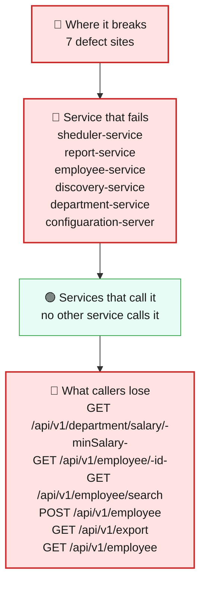
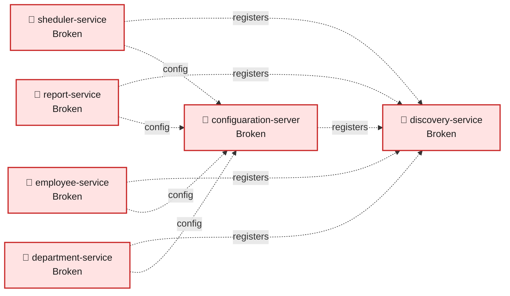

# Blast Radius — ISSUE-002

## Employee PII and payroll data are exposed to unauthenticated callers and written to application logs

> Anyone who can reach the exposed data requests can read or change employee and payroll information without proving their identity, while sensitive values can remain in logs.

_Generated by the Blast Radius Analyst on 2026-08-16. Reach measured 2026-08-16T20:41:55.827Z._

## At a glance

| | |
|---|---|
| **Priority** | P0 - anonymous access can expose or alter employee and payroll information, with additional disclosure through logs. |
| **Severity** | Critical |
| **How far it spreads** | One endpoint |
| **Services broken** | `sheduler-service`, `report-service`, `employee-service`, `discovery-service`, `department-service`, `configuaration-server` |
| **Services degraded** | none |
| **Endpoints down** | 6 of 10 |
| **Scheduled jobs hit** | 0 |
| **Confidence** | High |

Root cause: [docs/agent_output/02-root-cause/root_cause_ISSUE-002.md](../../../docs/agent_output/02-root-cause/root_cause_ISSUE-002.md) · Issue: [docs/agent_output/00-issues/issue-register.xlsx](../../../docs/agent_output/00-issues/issue-register.xlsx)

## 1. What is broken

The affected requests continue to respond, but they do not enforce an identity or permission check. This is a security failure rather than a service outage: an unauthorized caller can use the exposed employee, payroll, and salary-related paths, and normal request processing can write sensitive information to application logs.

## 2. How far it spreads



| Ring | What it means |
|---|---|
| 🔴 Where it breaks | `EmployeeSchedulerController.getAllEmployees()`, `EmployeeReportController.exportToExcel()`, `EmployeeReportServiceImpl.getEmployees()`, `EmployeeController.getEmployee()`, `EmployeeController.createEmployee()`, `EmployeeController.searchEmployees()`, `DepartmentController.getAllDepartments()` |
| 🔴 Service that fails | Six measured data-handling paths expose employee or salary-related information without an application-layer access check. Other endpoints hosted in the same services are not automatically down; only the measured sensitive paths are directly affected. |
| 🟢 Services that call it | No service-to-service HTTP caller is measured for these affected paths, so there is no confirmed downstream request failure. |
| 🟢 Wider platform | Sensitive values can persist beyond the original request in application logs, increasing the number of people and systems that may be able to read them. |

## 3. Which services are affected



| Service | Status | What happens to it |
|---|---|---|
| `sheduler-service` | 🔴 Broken | Contains the defect. This is where the failure starts. |
| `report-service` | 🔴 Broken | Contains the defect. This is where the failure starts. |
| `employee-service` | 🔴 Broken | Contains the defect. This is where the failure starts. |
| `discovery-service` | 🔴 Broken | Contains the defect. This is where the failure starts. |
| `department-service` | 🔴 Broken | Contains the defect. This is where the failure starts. |
| `configuaration-server` | 🔴 Broken | Contains the defect. This is where the failure starts. |

## 4. Which endpoints are affected

| Endpoint | Service | Status | What a caller sees |
|---|---|---|---|
| `GET /api/v1/department/salary/{minSalary}` | `department-service` | 🔴 Broken | Request fails — this path runs the defect |
| `GET /api/v1/employee/{id}` | `employee-service` | 🔴 Broken | Request fails — this path runs the defect |
| `GET /api/v1/employee/search` | `employee-service` | 🔴 Broken | Request fails — this path runs the defect |
| `POST /api/v1/employee` | `employee-service` | 🔴 Broken | Request fails — this path runs the defect |
| `GET /api/v1/export` | `report-service` | 🔴 Broken | Request fails — this path runs the defect |
| `GET /api/v1/employee` | `sheduler-service` | 🔴 Broken | Request fails — this path runs the defect |

<details><summary>4 endpoint(s) not affected</summary>

| Endpoint | Service |
|---|---|
| `GET /api/v1/department/{id}` | `department-service` |
| `POST /api/v1/department` | `department-service` |
| `GET /api/v1/employee/salary/{id}` | `employee-service` |
| `POST /api/v1/employee/excelUpload` | `employee-service` |

</details>

## 5. What happens on a single request

```mermaid
flowchart LR
  classDef broken fill:#ffe3e3,stroke:#c92a2a,stroke-width:2px,color:#1a1a1a
  classDef degraded fill:#fff3bf,stroke:#e8590c,stroke-width:2px,color:#1a1a1a
  classDef atrisk fill:#fff9db,stroke:#f08c00,stroke-width:1px,color:#1a1a1a
  classDef ok fill:#e6fcf5,stroke:#2f9e44,stroke-width:1px,color:#1a1a1a
  classDef neutral fill:#f1f3f5,stroke:#868e96,stroke-width:1px,color:#1a1a1a
  CALLER(["Caller"]):::neutral
  EP["GET /api/v1/department/salary/-minSalary-"]:::neutral
  CALLER --> EP
  N0["DepartmentController.getAllDepartments()"]:::neutral
  EP --> N0
  N1["EmployeeSchedulerController.getAllEmployees()"]:::neutral
  N0 --> N1
  N2["EmployeeReportController.exportToExcel()"]:::broken
  N1 --> N2
  FAIL["❌ request is accepted without an identity check"]:::broken
  N2 --> FAIL
```



## 6. Who feels it

| Who | What they experience | Status |
|---|---|---|
| Employees and people whose records are stored in the system | Their personal and salary-related information can be disclosed to an unauthorized caller or through ordinary application logs. | Blocked |
| Payroll and HR teams | Confidential payroll exports and salary information can be obtained without the intended approval or access control. | Blocked |
| Business owners responsible for employee records | Employee records can be created or changed without a verified identity or a reliable audit trail. | Blocked |

## 7. What is NOT affected

Scoping the damage matters as much as describing it.

- The measured defect does not prevent services from starting or responding to requests.
- The four endpoints not measured as reaching sensitive data paths are not confirmed as directly affected by this report.
- No cross-service HTTP consumer outage is confirmed by the measured graph.

## 8. Containment and priority

**Priority:** P0 - anonymous access can expose or alter employee and payroll information, with additional disclosure through logs.

**If it is not fixed:** Unauthorized disclosure and alteration can continue, while sensitive records retained in logs may broaden the number of systems and people exposed to the data.

**Containment steps**

- Restrict network access to the exposed services and sensitive endpoints until the corrective change is deployed.
- Review and limit access to application logs that may contain employee or salary values.
- Monitor requests to the affected employee, export, and salary-related paths for unexpected access.

The fix itself is in the root cause report: [Recommended Fix](../../../docs/agent_output/02-root-cause/root_cause_ISSUE-002.md).

## 9. Open questions

- Deployment gateways, network policies, identity-provider controls, and log retention are outside this workspace and need separate verification.
- The collector reported the architecture file as missing even though the current architecture document exists; graph and function-reference evidence were available for this assessment.

## Appendix — how this was measured

| Input | Detail |
|---|---|
| Root cause report | [docs/agent_output/02-root-cause/root_cause_ISSUE-002.md](../../../docs/agent_output/02-root-cause/root_cause_ISSUE-002.md) |
| Issue report | [docs/agent_output/00-issues/issue-register.xlsx](../../../docs/agent_output/00-issues/issue-register.xlsx) |
| Architecture document | not available |
| Function reference | [docs/agent_output/01-architecture/function-reference.md](../../../docs/agent_output/01-architecture/function-reference.md) |
| Code scan | `.github/.pipeline-context/artifacts.json` |
| Knowledge graph | Neo4j, traversal depth 6 |

**Rules used to assign status**

- 🔴 **Broken** — the service contains the defect, or an endpoint whose handler reaches it
- 🟠 **Degraded** — the service calls a broken service over HTTP; its own code is sound
- 🟡 **At risk** — shares infrastructure with a broken service
- 🟢 **Unaffected** — no code path and no HTTP call to anything broken

Scope for this issue is **endpoint**, so only endpoints whose handler reaches the defect are marked down.

<details><summary>Graph queries executed</summary>

**endpoints whose handler reaches the defect**

```cypher
MATCH (ty:Type)-[:EXPOSES]->(e:Endpoint)
       MATCH (ty)-[:HAS_METHOD]->(handler:Method)
       MATCH (handler)-[:CALLS*0..6]->(target:Method)
       WHERE target.id IN $defectIds
       RETURN DISTINCT e.id AS endpoint, ty.module AS module, ty.name AS controller
```

**modules that reach the defect in code**

```cypher
MATCH (caller:Method)-[:CALLS*1..6]->(target:Method)
       WHERE target.id IN $defectIds
       MATCH (ct:Type)-[:HAS_METHOD]->(caller)
       RETURN DISTINCT ct.module AS module
```

**endpoint count per affected module**

```cypher
MATCH (m:Module)-[:CONTAINS]->(ty:Type)-[:EXPOSES]->(e:Endpoint)
       WHERE m.name IN $modules
       RETURN m.name AS module, collect(DISTINCT e.id) AS endpoints
```

**types depending on the affected modules**

```cypher
MATCH (other:Type)-[:USES]->(t:Type)
       WHERE t.module IN $modules AND other.module <> t.module
       RETURN DISTINCT other.module AS module, other.name AS type, t.name AS dependsOn
```

**infrastructure shared with other modules**

```cypher
MATCH (m:Module)-[:DEPENDS_ON]->(dep:MavenDependency)<-[:DEPENDS_ON]-(other:Module)
       WHERE m.name IN $modules AND NOT other.name IN $modules
         AND dep.artifactId IN ['spring-boot-starter-data-mongodb','spring-cloud-starter-config','spring-cloud-starter-netflix-eureka-client']
       RETURN dep.artifactId AS dependency, collect(DISTINCT other.name) AS alsoUsedBy
```

**graph size**

```cypher
MATCH (n) RETURN labels(n)[0] AS label, count(*) AS count ORDER BY count DESC
```

</details>

---

Sections 3, 4, 5 and 7 (service lists) are measured from the code scan and the knowledge graph. Sections 1, 2 (ring descriptions), 6 and 8 are the analyst's judgement, scoped to that measurement.
