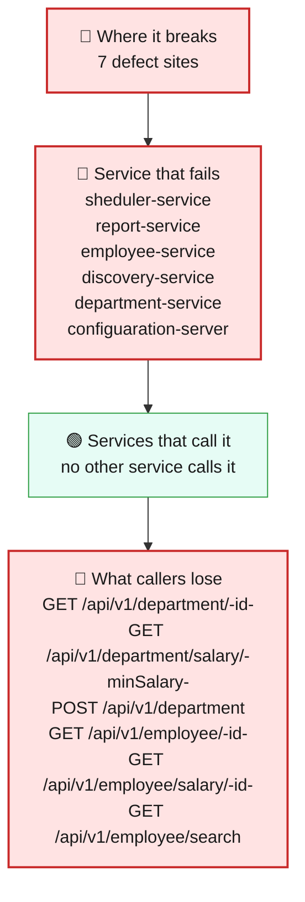
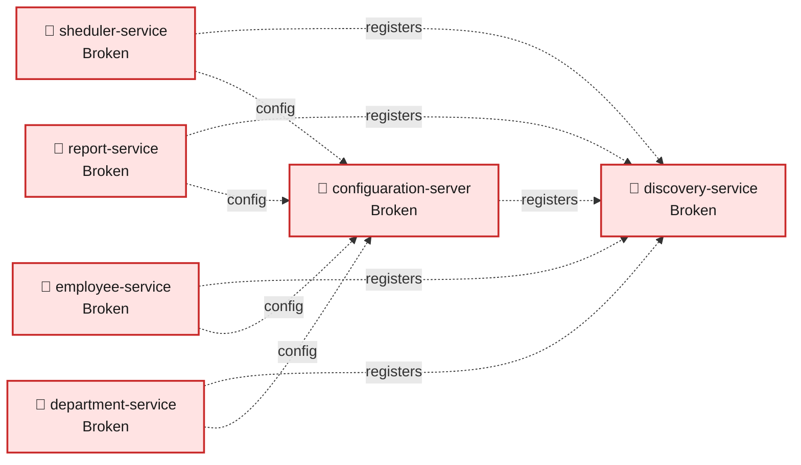

# Blast Radius — ISSUE-002

## Employee PII and payroll data are exposed to unauthenticated callers and written to application logs

> Nothing on the platform ever asks a caller who they are, so anyone who can reach it can download the entire workforce list — names, home addresses, phone numbers and salaries — and can also add or overwrite employee records.

_Generated by the Blast Radius Analyst on 2026-08-16. Reach measured 2026-08-16T07:14:29.442Z._

## At a glance

| | |
|---|---|
| **Priority** | P0 — a complete HR dataset including salaries and home addresses is downloadable with no credentials, and employee records can be overwritten anonymously; contain today and do not wait for a release train. |
| **Severity** | Critical |
| **How far it spreads** | Multiple services |
| **Services broken** | `sheduler-service`, `report-service`, `employee-service`, `discovery-service`, `department-service`, `configuaration-server` |
| **Services degraded** | none |
| **Endpoints down** | 10 of 10 |
| **Scheduled jobs hit** | 0 |
| **Confidence** | High |

Root cause: [docs/agent_output/02-root-cause/root_cause_ISSUE-002.md](../../../docs/agent_output/02-root-cause/root_cause_ISSUE-002.md) · Issue: [docs/agent_output/00-issues/issue-register.xlsx](../../../docs/agent_output/00-issues/issue-register.xlsx)

## 1. What is broken

There is no identity check anywhere on the platform. Every published address is served to whoever asks, with no login, no token and no record of who made the request. The complete employee dataset can be downloaded in bulk in two different formats, individual records can be looked up and searched freely, and two paths accept new or replacement employee records from a caller who has never identified themselves. The same personal details and salary figures are additionally copied in plain text into the application logs, which are normally kept longer, and readable by more people, than the database they came from. This is not intermittent and not conditional: it applies to every request, every time.

## 2. How far it spreads



| Ring | What it means |
|---|---|
| 🔴 Where it breaks | `EmployeeSchedulerController.getAllEmployees()`, `EmployeeReportController.exportToExcel()`, `EmployeeReportServiceImpl.getEmployees()`, `EmployeeController.getEmployee()`, `EmployeeController.createEmployee()`, `EmployeeController.searchEmployees()`, `DepartmentController.getAllDepartments()` |
| 🔴 Service that fails | Nothing is contained to one place, because the gap is the absence of a security layer rather than a mistake in one handler. Every address the platform publishes is open on the same terms, including the paths that change data. And because no request is tied to a person, there is no audit trail: after the fact it is impossible to establish who read or altered a record. |
| 🟢 Services that call it | No service calls another over the network on these paths, so nothing breaks downstream. The exposure spreads in a different shape: the same personal data is reachable through several services at once — the employee service, the report export, the scheduler list and the department salary view — so protecting one of them still leaves the others open. |
| 🟢 Wider platform | The service discovery and configuration servers stand in exactly the same position, published with no access control of their own. Separately, the personal data leaves a second copy in the log system, which sits entirely outside whatever protections the database has — closing the endpoints does not retrieve what has already been written there. |

## 3. Which services are affected



| Service | Status | What happens to it |
|---|---|---|
| `sheduler-service` | 🔴 Broken | Contains the defect. This is where the failure starts. |
| `report-service` | 🔴 Broken | Contains the defect. This is where the failure starts. |
| `employee-service` | 🔴 Broken | Contains the defect. This is where the failure starts. |
| `discovery-service` | 🔴 Broken | Contains the defect. This is where the failure starts. |
| `department-service` | 🔴 Broken | Contains the defect. This is where the failure starts. |
| `configuaration-server` | 🔴 Broken | Contains the defect. This is where the failure starts. |

## 4. Which endpoints are affected

| Endpoint | Service | Status | What a caller sees |
|---|---|---|---|
| `GET /api/v1/department/{id}` | `department-service` | 🔴 Broken | Request fails — the service hosting it is down |
| `GET /api/v1/department/salary/{minSalary}` | `department-service` | 🔴 Broken | Request fails — this path runs the defect |
| `POST /api/v1/department` | `department-service` | 🔴 Broken | Request fails — the service hosting it is down |
| `GET /api/v1/employee/{id}` | `employee-service` | 🔴 Broken | Request fails — this path runs the defect |
| `GET /api/v1/employee/salary/{id}` | `employee-service` | 🔴 Broken | Request fails — the service hosting it is down |
| `GET /api/v1/employee/search` | `employee-service` | 🔴 Broken | Request fails — this path runs the defect |
| `POST /api/v1/employee` | `employee-service` | 🔴 Broken | Request fails — this path runs the defect |
| `POST /api/v1/employee/excelUpload` | `employee-service` | 🔴 Broken | Request fails — the service hosting it is down |
| `GET /api/v1/export` | `report-service` | 🔴 Broken | Request fails — this path runs the defect |
| `GET /api/v1/employee` | `sheduler-service` | 🔴 Broken | Request fails — this path runs the defect |

## 5. What happens on a single request

```mermaid
flowchart LR
  classDef broken fill:#ffe3e3,stroke:#c92a2a,stroke-width:2px,color:#1a1a1a
  classDef degraded fill:#fff3bf,stroke:#e8590c,stroke-width:2px,color:#1a1a1a
  classDef atrisk fill:#fff9db,stroke:#f08c00,stroke-width:1px,color:#1a1a1a
  classDef ok fill:#e6fcf5,stroke:#2f9e44,stroke-width:1px,color:#1a1a1a
  classDef neutral fill:#f1f3f5,stroke:#868e96,stroke-width:1px,color:#1a1a1a
  CALLER(["Caller"]):::neutral
  EP["GET /api/v1/department/salary/-minSalary-"]:::neutral
  CALLER --> EP
  N0["DepartmentController.getAllDepartments()"]:::neutral
  EP --> N0
  N1["EmployeeSchedulerController.getAllEmployees()"]:::neutral
  N0 --> N1
  N2["EmployeeReportController.exportToExcel()"]:::broken
  N1 --> N2
  FAIL["❌ no identity check anywhere"]:::broken
  N2 --> FAIL
```



## 6. Who feels it

| Who | What they experience | Status |
|---|---|---|
| Every employee whose record is held | Their name, home address, phone number and salary can be downloaded by anyone able to reach the system, without signing in and without their employer knowing. | At risk |
| The organisation, as custodian of staff data | A complete HR dataset — including pay — is obtainable in one request, with no credential to revoke and no notification. This is the profile of a reportable data breach if it is ever exercised. | At risk |
| Anyone relying on employee records being accurate | Records can be created or silently overwritten by an anonymous caller, so the dataset cannot be assumed to be trustworthy or unaltered. | Degraded |
| Security and incident response | There is no way to answer who read or changed a record. An investigation cannot be completed at all, because the information it would need was never captured. | Blocked |

## 7. What is NOT affected

Scoping the damage matters as much as describing it.

- Nothing stops working. Every feature behaves exactly as intended for legitimate users — this defect adds access, it does not remove it.
- The data returned is correct: nothing here corrupts, loses or miscalculates a record.
- There is no evidence in the code that anyone has actually taken the data. What is established is the capability, not an incident.
- The defect does not weaken the database's own credentials or the network layer around it — the exposure is at the application's front door.
- Fixing this does not require changing how employees, departments or reports work; it requires putting a check in front of them.

## 8. Containment and priority

**Priority:** P0 — a complete HR dataset including salaries and home addresses is downloadable with no credentials, and employee records can be overwritten anonymously; contain today and do not wait for a release train.

**If it is not fixed:** Every day this stays open is another day in which the whole workforce dataset can be taken silently and without trace, and another day of personal data accumulating in log storage that is retained for months and read by far more people than the database. Because no request is attributable, the longer it runs the less possible it becomes to establish afterwards what was taken and when — and the anonymous write paths mean the dataset's integrity, not just its confidentiality, degrades over time.

**Containment steps**

- Restrict inbound network access to the service ports to trusted networks today, before anything else — that is the only control currently standing between the data and any caller.
- Turn off the verbose (TRACE) logging switched on for the controller package in the committed configuration, and lower the entries that log whole records at INFO.
- Check who can read the log aggregation platform and how long it retains data, then purge or restrict the existing entries that carry personal details and salaries.
- Review request logs for bulk reads of the employee list, the search and the export, to establish whether this has already been exercised.
- Block the two anonymous write paths at the gateway until an identity check is in place — they allow records to be overwritten, not just read.
- Notify the data protection owner now rather than after the fix; the disclosure assessment does not depend on the code change.

The fix itself is in the root cause report: [Recommended Fix](../../../docs/agent_output/02-root-cause/root_cause_ISSUE-002.md).

## 9. Open questions

- Are these service ports reachable from outside the corporate network, or only from inside it? The code cannot answer this, and it is the difference between a serious internal gap and an active external breach.
- How long does log aggregation retain these entries, and who has read access to them? That decides the size of the second exposure.
- Have any bulk reads already occurred? Without a principal on the request, only network-level or gateway logs could show this.
- Is there a gateway or service mesh in front of these services that applies authentication the code does not declare? Nothing in the workspace indicates one, but that would change the severity materially.

## Appendix — how this was measured

| Input | Detail |
|---|---|
| Root cause report | [docs/agent_output/02-root-cause/root_cause_ISSUE-002.md](../../../docs/agent_output/02-root-cause/root_cause_ISSUE-002.md) |
| Issue report | [docs/agent_output/00-issues/issue-register.xlsx](../../../docs/agent_output/00-issues/issue-register.xlsx) |
| Architecture document | [docs/agent_output/01-architecture/architecture.md](../../../docs/agent_output/01-architecture/architecture.md) |
| Function reference | [docs/agent_output/01-architecture/function-reference.md](../../../docs/agent_output/01-architecture/function-reference.md) |
| Code scan | `docs/agent_output/.architect/artifacts.json` |
| Knowledge graph | Neo4j, traversal depth 6 |

**Rules used to assign status**

- 🔴 **Broken** — the service contains the defect, or an endpoint whose handler reaches it
- 🟠 **Degraded** — the service calls a broken service over HTTP; its own code is sound
- 🟡 **At risk** — shares infrastructure with a broken service
- 🟢 **Unaffected** — no code path and no HTTP call to anything broken

Scope for this issue is **multi-service**, so every endpoint hosted by the broken service is marked down.

<details><summary>Graph queries executed</summary>

**endpoints whose handler reaches the defect**

```cypher
MATCH (ty:Type)-[:EXPOSES]->(e:Endpoint)
       MATCH (ty)-[:HAS_METHOD]->(handler:Method)
       MATCH (handler)-[:CALLS*0..6]->(target:Method)
       WHERE target.id IN $defectIds
       RETURN DISTINCT e.id AS endpoint, ty.module AS module, ty.name AS controller
```

**modules that reach the defect in code**

```cypher
MATCH (caller:Method)-[:CALLS*1..6]->(target:Method)
       WHERE target.id IN $defectIds
       MATCH (ct:Type)-[:HAS_METHOD]->(caller)
       RETURN DISTINCT ct.module AS module
```

**endpoint count per affected module**

```cypher
MATCH (m:Module)-[:CONTAINS]->(ty:Type)-[:EXPOSES]->(e:Endpoint)
       WHERE m.name IN $modules
       RETURN m.name AS module, collect(DISTINCT e.id) AS endpoints
```

**types depending on the affected modules**

```cypher
MATCH (other:Type)-[:USES]->(t:Type)
       WHERE t.module IN $modules AND other.module <> t.module
       RETURN DISTINCT other.module AS module, other.name AS type, t.name AS dependsOn
```

**infrastructure shared with other modules**

```cypher
MATCH (m:Module)-[:DEPENDS_ON]->(dep:MavenDependency)<-[:DEPENDS_ON]-(other:Module)
       WHERE m.name IN $modules AND NOT other.name IN $modules
         AND dep.artifactId IN ['spring-boot-starter-data-mongodb','spring-cloud-starter-config','spring-cloud-starter-netflix-eureka-client']
       RETURN dep.artifactId AS dependency, collect(DISTINCT other.name) AS alsoUsedBy
```

**graph size**

```cypher
MATCH (n) RETURN labels(n)[0] AS label, count(*) AS count ORDER BY count DESC
```

</details>

---

Sections 3, 4, 5 and 7 (service lists) are measured from the code scan and the knowledge graph. Sections 1, 2 (ring descriptions), 6 and 8 are the analyst's judgement, scoped to that measurement.
