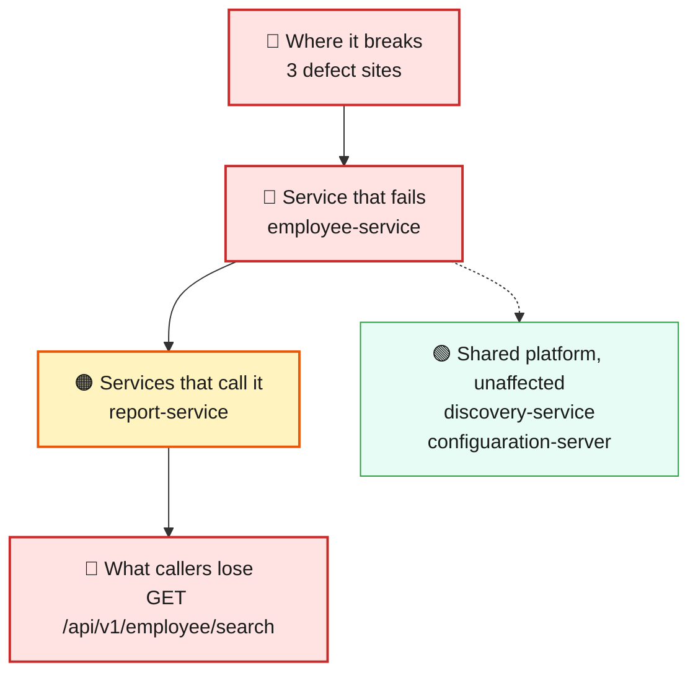
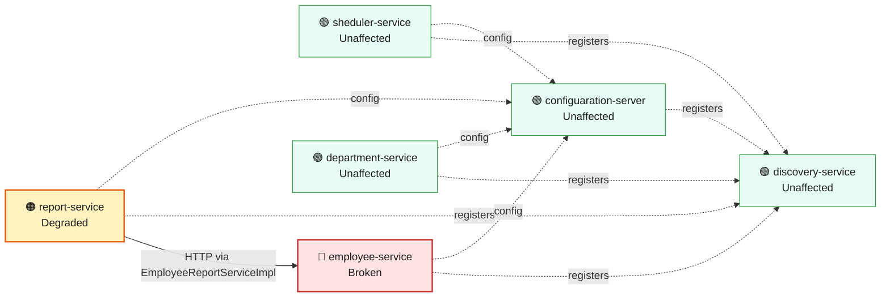

# Blast Radius — ISSUE-003

## MongoDB (NoSQL) injection in the employee search endpoint via string-concatenated BasicQuery

> The employee search can be tricked into handing back the entire staff directory — phone numbers and home addresses included — instead of only the people the caller searched for.

_Generated by the Blast Radius Analyst on 2026-08-16. Reach measured 2026-08-16T07:14:35.536Z._

## At a glance

| | |
|---|---|
| **Priority** | P0 — a single anonymous web request returns the entire employee directory with personal data attached, and the same hole can be pointed at the shared database as a denial-of-service; contain today. |
| **Severity** | Critical |
| **How far it spreads** | One endpoint |
| **Services broken** | `employee-service` |
| **Services degraded** | `report-service` |
| **Endpoints down** | 1 of 10 |
| **Scheduled jobs hit** | 0 |
| **Confidence** | High |

Root cause: [docs/agent_output/02-root-cause/root_cause_ISSUE-003.md](../../../docs/agent_output/02-root-cause/root_cause_ISSUE-003.md) · Issue: [docs/agent_output/00-issues/issue-register.xlsx](../../../docs/agent_output/00-issues/issue-register.xlsx)

## 1. What is broken

The employee search builds its database question by pasting the caller's search text straight into it. Type an ordinary name and you get ordinary results. Type the right punctuation and keywords and you rewrite the question itself — switching the filter off so every employee record comes back, personal details attached. It works on every attempt, needs no login and leaves the endpoint looking perfectly healthy to everyone else, because only deliberately crafted requests behave differently. The same hole can be used to make the database do enormous amounts of work on a single request.

## 2. How far it spreads



| Ring | What it means |
|---|---|
| 🔴 Where it breaks | `EmployeeController.searchEmployees()`, `EmployeeServiceImpl.searchEmployees()`, `EmployeeSearchRepository.searchEmployees()` |
| 🔴 Service that fails | The rest of the employee service keeps working normally — this is one search path misbehaving, not a service falling over. But that one path sits in the service that holds the entire employee record set, so it is enough to reach all of it, and the records it returns carry phone number, address and gender. |
| 🟠 Services that call it | The report service reaches the employee service over the network to build its export, so it is exposed to any slowdown an abusive search causes. Its own code is sound and its figures stay correct — it degrades rather than breaks. Nothing else in the platform calls the affected service. |
| 🟢 Wider platform | The affected service shares the employee data store with the scheduler and department services. A search crafted to be deliberately expensive makes the shared database do the work, and that is the one route by which otherwise-healthy services would notice this at all. |

## 3. Which services are affected



| Service | Status | What happens to it |
|---|---|---|
| `sheduler-service` | 🟢 Unaffected | Not on any path to the defect. Keeps working normally. |
| `report-service` | 🟠 Degraded | Calls the broken service over HTTP from `EmployeeReportServiceImpl`. Its own code is fine, but the data it needs does not arrive. |
| `employee-service` | 🔴 Broken | Contains the defect. This is where the failure starts. |
| `discovery-service` | 🟢 Unaffected | Not on any path to the defect. Keeps working normally. |
| `department-service` | 🟢 Unaffected | Not on any path to the defect. Keeps working normally. |
| `configuaration-server` | 🟢 Unaffected | Not on any path to the defect. Keeps working normally. |

## 4. Which endpoints are affected

| Endpoint | Service | Status | What a caller sees |
|---|---|---|---|
| `GET /api/v1/employee/search` | `employee-service` | 🔴 Broken | Request fails — this path runs the defect |
| `GET /api/v1/export` | `report-service` | 🟠 Degraded | Responds, but with missing or stale data from the broken service |

<details><summary>8 endpoint(s) not affected</summary>

| Endpoint | Service |
|---|---|
| `GET /api/v1/department/{id}` | `department-service` |
| `GET /api/v1/department/salary/{minSalary}` | `department-service` |
| `POST /api/v1/department` | `department-service` |
| `GET /api/v1/employee/{id}` | `employee-service` |
| `GET /api/v1/employee/salary/{id}` | `employee-service` |
| `POST /api/v1/employee` | `employee-service` |
| `POST /api/v1/employee/excelUpload` | `employee-service` |
| `GET /api/v1/employee` | `sheduler-service` |

</details>

## 5. What happens on a single request

```mermaid
flowchart LR
  classDef broken fill:#ffe3e3,stroke:#c92a2a,stroke-width:2px,color:#1a1a1a
  classDef degraded fill:#fff3bf,stroke:#e8590c,stroke-width:2px,color:#1a1a1a
  classDef atrisk fill:#fff9db,stroke:#f08c00,stroke-width:1px,color:#1a1a1a
  classDef ok fill:#e6fcf5,stroke:#2f9e44,stroke-width:1px,color:#1a1a1a
  classDef neutral fill:#f1f3f5,stroke:#868e96,stroke-width:1px,color:#1a1a1a
  CALLER(["Caller"]):::neutral
  EP["GET /api/v1/employee/search"]:::neutral
  CALLER --> EP
  N0["EmployeeController.searchEmployees()"]:::neutral
  EP --> N0
  N1["EmployeeServiceImpl.searchEmployees()"]:::broken
  N0 --> N1
  FAIL["❌ search text becomes query logic"]:::broken
  N1 --> FAIL
```



## 6. Who feels it

| Who | What they experience | Status |
|---|---|---|
| Every employee in the directory | Their phone number, home address and personal details can be extracted in bulk through a search they were never meant to appear in, by someone who never had to sign in. | At risk |
| The organisation, as custodian of staff data | One crafted web request returns the full employee directory. It looks like ordinary search traffic in the logs, so it can happen without anyone noticing. | At risk |
| People using the search normally | Nothing unusual — correct results for correct terms. The endpoint gives no sign that it can be abused, which is precisely why this can run undetected. | At risk |
| Payroll reporting, which pulls employee data over the network | Reports keep producing correct figures, but can slow down or time out while the shared database is busy serving a deliberately expensive search. | Degraded |

## 7. What is NOT affected

Scoping the damage matters as much as describing it.

- Services working normally: `sheduler-service`, `discovery-service`, `department-service`, `configuaration-server`
- Looking up a single employee, or a single employee's salary, is unaffected — those paths do not build their query this way.
- Creating an employee and uploading the employee spreadsheet are unaffected.
- All three department paths and the scheduler's employee list are unaffected — none of them runs the flawed search.
- The defect is confined to one service; no equivalent construction was found anywhere else in the platform.
- Nothing is written, changed or deleted through this hole as it stands — it is a read-only exposure of data that already exists.
- Ordinary searches return correct results; there is no wrong answer being given to legitimate users.

## 8. Containment and priority

**Priority:** P0 — a single anonymous web request returns the entire employee directory with personal data attached, and the same hole can be pointed at the shared database as a denial-of-service; contain today.

**If it is not fixed:** This does not decay slowly — it stays exactly this exploitable until it is fixed, and the only thing that changes is the odds that someone finds it. Every day it remains is another day the full directory can be extracted silently, and the same hole stays available as a way to overload the shared database on demand. If server-side JavaScript is enabled on the deployment, the ceiling is considerably higher than data disclosure.

**Containment steps**

- Reject search values containing quotes, braces or dollar signs at the gateway until the query is properly parameterised — a blunt filter, but it closes the door today.
- Confirm that server-side JavaScript execution is disabled on the MongoDB deployment; that single setting decides whether this stays a data-disclosure problem or becomes code execution inside the database.
- Rate-limit the search endpoint so it cannot be used to hammer the shared data store.
- Review historic request logs for search terms containing quote or dollar characters, to establish whether this has already been exercised.
- If the search is not business-critical, disable it until the fix ships — it is the only path affected, so the cost of turning it off is low.

The fix itself is in the root cause report: [Recommended Fix](../../../docs/agent_output/02-root-cause/root_cause_ISSUE-003.md).

## 9. Open questions

- Is server-side JavaScript ($where) enabled on the MongoDB deployment? The code cannot show this, and it is the difference between reading data and running code inside the database.
- Is this endpoint reachable from outside the corporate network? That decides whether the realistic attacker is an insider or anyone at all.
- Are request logs retained long enough, and with query strings intact, to check whether this has already been used?
- How much load can the shared data store absorb before the services that share it are affected? The denial-of-service angle was not measured, only identified.

## Appendix — how this was measured

| Input | Detail |
|---|---|
| Root cause report | [docs/agent_output/02-root-cause/root_cause_ISSUE-003.md](../../../docs/agent_output/02-root-cause/root_cause_ISSUE-003.md) |
| Issue report | [docs/agent_output/00-issues/issue-register.xlsx](../../../docs/agent_output/00-issues/issue-register.xlsx) |
| Architecture document | [docs/agent_output/01-architecture/architecture.md](../../../docs/agent_output/01-architecture/architecture.md) |
| Function reference | [docs/agent_output/01-architecture/function-reference.md](../../../docs/agent_output/01-architecture/function-reference.md) |
| Code scan | `.github/.architect/artifacts.json` |
| Knowledge graph | Neo4j, traversal depth 6 |

**Rules used to assign status**

- 🔴 **Broken** — the service contains the defect, or an endpoint whose handler reaches it
- 🟠 **Degraded** — the service calls a broken service over HTTP; its own code is sound
- 🟡 **At risk** — shares infrastructure with a broken service
- 🟢 **Unaffected** — no code path and no HTTP call to anything broken

Scope for this issue is **endpoint**, so only endpoints whose handler reaches the defect are marked down.

<details><summary>Graph queries executed</summary>

**endpoints whose handler reaches the defect**

```cypher
MATCH (ty:Type)-[:EXPOSES]->(e:Endpoint)
       MATCH (ty)-[:HAS_METHOD]->(handler:Method)
       MATCH (handler)-[:CALLS*0..6]->(target:Method)
       WHERE target.id IN $defectIds
       RETURN DISTINCT e.id AS endpoint, ty.module AS module, ty.name AS controller
```

**modules that reach the defect in code**

```cypher
MATCH (caller:Method)-[:CALLS*1..6]->(target:Method)
       WHERE target.id IN $defectIds
       MATCH (ct:Type)-[:HAS_METHOD]->(caller)
       RETURN DISTINCT ct.module AS module
```

**endpoint count per affected module**

```cypher
MATCH (m:Module)-[:CONTAINS]->(ty:Type)-[:EXPOSES]->(e:Endpoint)
       WHERE m.name IN $modules
       RETURN m.name AS module, collect(DISTINCT e.id) AS endpoints
```

**types depending on the affected modules**

```cypher
MATCH (other:Type)-[:USES]->(t:Type)
       WHERE t.module IN $modules AND other.module <> t.module
       RETURN DISTINCT other.module AS module, other.name AS type, t.name AS dependsOn
```

**infrastructure shared with other modules**

```cypher
MATCH (m:Module)-[:DEPENDS_ON]->(dep:MavenDependency)<-[:DEPENDS_ON]-(other:Module)
       WHERE m.name IN $modules AND NOT other.name IN $modules
         AND dep.artifactId IN ['spring-boot-starter-data-mongodb','spring-cloud-starter-config','spring-cloud-starter-netflix-eureka-client']
       RETURN dep.artifactId AS dependency, collect(DISTINCT other.name) AS alsoUsedBy
```

**graph size**

```cypher
MATCH (n) RETURN labels(n)[0] AS label, count(*) AS count ORDER BY count DESC
```

</details>

---

Sections 3, 4, 5 and 7 (service lists) are measured from the code scan and the knowledge graph. Sections 1, 2 (ring descriptions), 6 and 8 are the analyst's judgement, scoped to that measurement.
