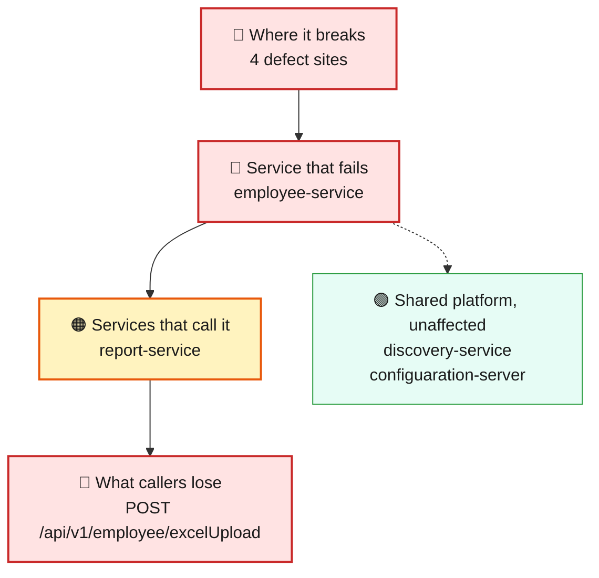
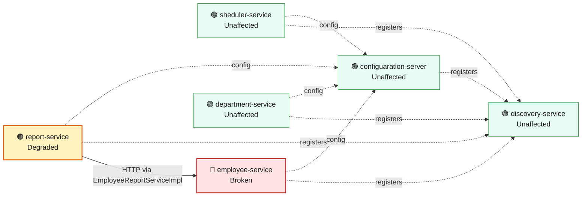

# Blast Radius — ISSUE-004

## Outdated Apache POI (poi-ooxml 5.0.0) dependency exposes the employee Excel-upload endpoint to a known OOXML parsing vulnerability (CVE-2025-31672)

> The employee spreadsheet upload feature can be tricked into misreading a crafted file, because it uses a years-out-of-date file-reading library.

_Generated by the Blast Radius Analyst on 2026-08-31. Reach measured 2026-08-31T03:26:49.861Z._

## At a glance

| | |
|---|---|
| **Priority** | P3 — a real, publicly-documented defect with a straightforward fix, but its own impact is content-integrity confusion in one upload path, not data exposure or an availability risk; fix in the normal course of dependency maintenance rather than as an emergency. |
| **Severity** | Medium |
| **How far it spreads** | One endpoint |
| **Services broken** | `employee-service` |
| **Services degraded** | `report-service` |
| **Endpoints down** | 1 of 10 |
| **Scheduled jobs hit** | 0 |
| **Confidence** | High |

Root cause: [docs/agent_output/02-root-cause/root_cause_ISSUE-004.md](../../../docs/agent_output/02-root-cause/root_cause_ISSUE-004.md) · Issue: [docs/agent_output/00-issues/issue-register.xlsx](../../../docs/agent_output/00-issues/issue-register.xlsx)

## 1. What is broken

Only one capability is affected: uploading an employee spreadsheet (POST /api/v1/employee/excelUpload). Every other way of reading or writing employee data keeps working normally. The problem only triggers if someone uploads a specifically crafted file designed to exploit the flaw — an ordinary spreadsheet upload behaves exactly as it always has. The service itself keeps running either way; this is not an outage risk.

## 2. How far it spreads

| Ring | What it means |
|---|---|
| 🔴 Where it breaks | `EmployeeController.uploadEmployee()`, `EmployeeServiceImpl.uploadEmployee()`, `ExcelUploadImpl.getEmployeeDataFromExcel()`, `ExcelUploadImpl.isValidExcelFile()` |
| 🔴 Service that fails | Nothing else in employee-service is affected — the other four endpoints (read one employee, read salary, search, create) do not touch the outdated library at all. Only the upload path calls into it. |
| 🟠 Services that call it | report-service calls employee-service's data over HTTP (via EmployeeReportServiceImpl), but that call path does not go through the excel-upload endpoint or the vulnerable library — it is marked degraded only because it depends on employee-service in general, not because this specific defect reaches it. |
| 🟢 Wider platform | None. This is a library-parsing issue confined to one upload handler, not a resource-exhaustion or availability issue that could spill onto shared infrastructure. |

## 3. Which services are affected

| Service | Status | What happens to it |
|---|---|---|
| `sheduler-service` | 🟢 Unaffected | Not on any path to the defect. Keeps working normally. |
| `report-service` | 🟠 Degraded | Calls the broken service over HTTP from `EmployeeReportServiceImpl`. Its own code is fine, but the data it needs does not arrive. |
| `employee-service` | 🔴 Broken | Contains the defect. This is where the failure starts. |
| `discovery-service` | 🟢 Unaffected | Not on any path to the defect. Keeps working normally. |
| `department-service` | 🟢 Unaffected | Not on any path to the defect. Keeps working normally. |
| `configuaration-server` | 🟢 Unaffected | Not on any path to the defect. Keeps working normally. |

## 4. Which endpoints are affected

| Endpoint | Service | Status | What a caller sees |
|---|---|---|---|
| `POST /api/v1/employee/excelUpload` | `employee-service` | 🔴 Broken | Request fails — this path runs the defect |
| `GET /api/v1/export` | `report-service` | 🟠 Degraded | Responds, but with missing or stale data from the broken service |

8 endpoint(s) not affected

| Endpoint | Service |
|---|---|
| `GET /api/v1/department/{id}` | `department-service` |
| `GET /api/v1/department/salary/{minSalary}` | `department-service` |
| `POST /api/v1/department` | `department-service` |
| `GET /api/v1/employee/{id}` | `employee-service` |
| `GET /api/v1/employee/salary/{id}` | `employee-service` |
| `GET /api/v1/employee/search` | `employee-service` |
| `POST /api/v1/employee` | `employee-service` |
| `GET /api/v1/employee` | `sheduler-service` |

## 5. What happens on a single request

```mermaid
flowchart LR
  classDef broken fill:#ffe3e3,stroke:#c92a2a,stroke-width:2px,color:#1a1a1a
  classDef degraded fill:#fff3bf,stroke:#e8590c,stroke-width:2px,color:#1a1a1a
  classDef atrisk fill:#fff9db,stroke:#f08c00,stroke-width:1px,color:#1a1a1a
  classDef ok fill:#e6fcf5,stroke:#2f9e44,stroke-width:1px,color:#1a1a1a
  classDef neutral fill:#f1f3f5,stroke:#868e96,stroke-width:1px,color:#1a1a1a
  CALLER(["Caller"]):::neutral
  EP["POST /api/v1/employee/excelUpload"]:::neutral
  CALLER --> EP
  N0["EmployeeController.uploadEmployee()"]:::neutral
  EP --> N0
  N1["EmployeeServiceImpl.uploadEmployee()"]:::broken
  N0 --> N1
  FAIL["❌ the defect runs here"]:::broken
  N1 --> FAIL
```

## 6. Who feels it

| Who | What they experience | Status |
|---|---|---|
| HR staff uploading employee spreadsheets | Nothing different for a normal file — uploads work as expected. Only a deliberately crafted, malicious file could exploit the underlying flaw. | At risk |
| Anyone else using employee-service (read, search, create, salary lookups) | No effect at all — these paths never touch the affected library. | At risk |

## 7. What is NOT affected

Scoping the damage matters as much as describing it.

- Services working normally: `sheduler-service`, `discovery-service`, `department-service`, `configuaration-server`
- Every employee-service endpoint other than the Excel upload path
- report-service's own export functionality (unrelated call path)
- sheduler-service, discovery-service, department-service, configuaration-server — no code path or HTTP call reaches this defect
- Service availability — this is a content-integrity risk in one file-parsing path, not something that can crash or degrade the service itself

## 8. Containment and priority

**Priority:** P3 — a real, publicly-documented defect with a straightforward fix, but its own impact is content-integrity confusion in one upload path, not data exposure or an availability risk; fix in the normal course of dependency maintenance rather than as an emergency.

**If it is not fixed:** The risk does not grow on its own the way an unbounded-resource issue would — but every additional POI release that fixes further vulnerabilities will also be missed, since this dependency is not being kept current at all. The gap between the pinned version and the maintained version only widens over time.

**Containment steps**

- Until fixed, the upload endpoint's own separate lack of authentication (tracked under ISSUE-002) is the bigger near-term risk multiplier here — restricting who can reach POST /api/v1/employee/excelUpload at all would also reduce exposure to this defect.
- No urgent operational action needed beyond the version bump itself — this is not an active outage or an easily-automated mass-exploitation risk.

The fix itself is in the root cause report: [Recommended Fix](../../../docs/agent_output/02-root-cause/root_cause_ISSUE-004.md).

## 9. Open questions

- Whether the excelUpload endpoint sees any real production traffic, or whether it is rarely used — affects how urgently this needs fixing versus other work.
- Whether any other module in the workspace depends on org.apache.poi transitively at a vulnerable version — only employee-service's direct pin was investigated for this issue.

## Appendix — how this was measured

| Input | Detail |
|---|---|
| Root cause report | [docs/agent_output/02-root-cause/root_cause_ISSUE-004.md](../../../docs/agent_output/02-root-cause/root_cause_ISSUE-004.md) |
| Issue report | [docs/agent_output/00-issues/issue-register.xlsx](../../../docs/agent_output/00-issues/issue-register.xlsx) |
| Architecture document | [docs/agent_output/01-architecture/architecture.md](../../../docs/agent_output/01-architecture/architecture.md) |
| Function reference | [docs/agent_output/01-architecture/function-reference.md](../../../docs/agent_output/01-architecture/function-reference.md) |
| Code scan | `.github/.pipeline-context/artifacts.json` |
| Knowledge graph | not used — skipped via --no-graph |

**Rules used to assign status**

- 🔴 **Broken** — the service contains the defect, or an endpoint whose handler reaches it
- 🟠 **Degraded** — the service calls a broken service over HTTP; its own code is sound
- 🟡 **At risk** — shares infrastructure with a broken service
- 🟢 **Unaffected** — no code path and no HTTP call to anything broken

Scope for this issue is **endpoint**, so only endpoints whose handler reaches the defect are marked down.

---

Sections 3, 4, 5 and 7 (service lists) are measured from the code scan and the knowledge graph. Sections 1, 2 (ring descriptions), 6 and 8 are the analyst's judgement, scoped to that measurement.
