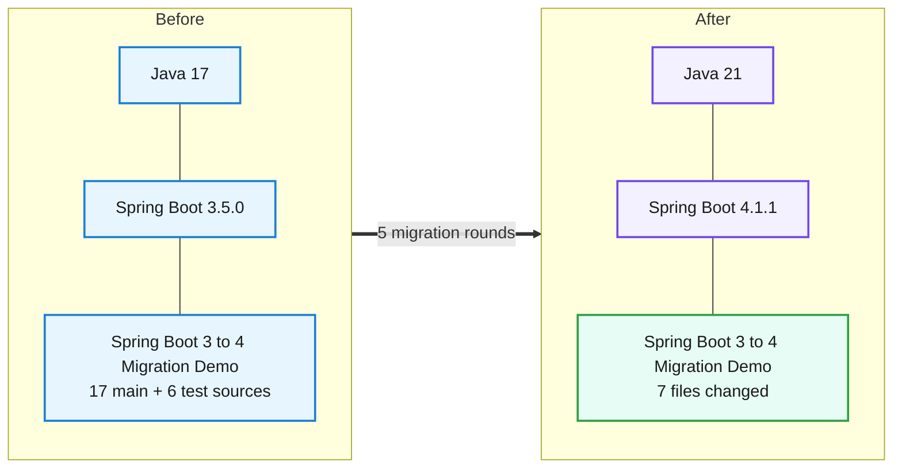
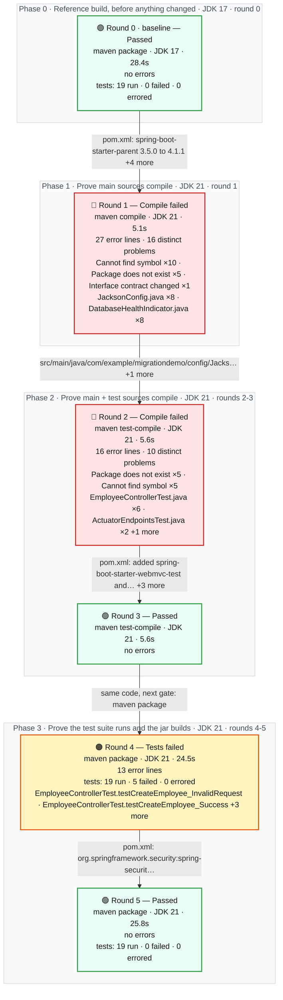
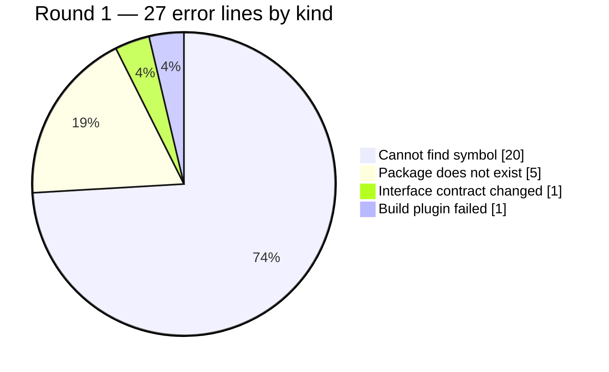

# Migration Report — Spring Boot 3.5.0 to 4.1.1 on Java 21

## Spring Boot 3 to 4 Migration Demo

     

> The employee service now runs on Spring Boot 4.1.1 and Java 21, and it behaves the same as it did before. Five build rounds were needed after the verified-green starting point. The upgrade forced changes in five files: the build descriptor, one Jackson configuration class that had to be rewritten against Jackson 3's new API, one health-check class whose imports moved package, and three test classes whose slice annotations moved package. No business logic, no REST contract and no database code changed. All nineteen tests pass on the new version, exactly as they did on the old one, and all fifteen recorded requests return the same status they returned before. Three response payloads that the framework owns - the health document, the 401 body and the framework-rendered validation error - changed shape without changing status; none of them is produced by application code, and the reviewer confirmed nothing downstream parses them.

_Generated by the Version Migration skill on 2026-09-10. Every version, error count and response below is read from a recorded run, not from memory._

## At a glance

| | |
|---|---|
| **Result** | 🟢 **Passed** on the final build |
| **Platform** | Spring Boot `3.5.0` → `4.1.1` |
| **Language** | Java `17` → `21` |
| **Build rounds** | 6 recorded — 1 pre-migration baseline, 3 that failed and were read for what to change next, 3 green |
| **Files changed** | 7 — `Dockerfile`, `pom.xml`, `src/main/java/com/example/migrationdemo/config/JacksonConfig.java`, `src/main/java/com/example/migrationdemo/health/DatabaseHealthIndicator.java`, `src/test/java/com/example/migrationdemo/actuator/ActuatorEndpointsTest.java`, `src/test/java/com/example/migrationdemo/controller/EmployeeControllerTest.java`, `src/test/java/com/example/migrationdemo/integration/EmployeeRepositoryIntegrationTest.java` |
| **Dependency changes** | 7 |
| **Source changes forced by the upgrade** | 6 |
| **Test suite** | before: 19 run, 0 failed, 0 errors → after: 19 run, 0 failed, 0 errors — 🟢 all green, before and after |
| **Runtime behaviour** | 🟡 same status on all 15, body differs on 9 |
| **Starting point** | build 🟢 green on JDK 17 via `package`, runtime 🟢 clean — the migration only begins from a green baseline |
| **Project state** | 🟢 Applied to the project and green there — `C:\Tools\apache-maven-3.9.16\bin\mvn.cmd -B clean package` on JDK 21, passed |
| **Reference followed** | `references/spring-boot-3-to-4.md` |
| **Build tool** | maven — Apache Maven 3.9.16 (2bdd9fddda4b155ebf8000e807eb73fd829a51d5) |
| **Authorised by** | 🟢 plan approved by Vihanga22365 — approved in session, relayed by Claude on 2026-09-10 — [migration plan](./migration_plan_boot4-upgrade.md) (revision 1) |

## 1. What moved



| | What | Before | After | Why it moved |
|---|---|---|---|---|
| ⬆️ | `Java (language level)` | `17` | `21` | Runtime baseline required by the new platform version. |
| ⬆️ | `Spring Boot (platform)` | `3.5.0` | `4.1.1` | The version jump this migration is about. |
| ⬆️ | `org.springframework.boot:spring-boot-starter-parent` | `3.5.0` | `4.1.1` | 1.1 - the generation jump itself; it is what pulls in Spring Framework 7.0.9, Spring Security 7.1.1, Hibernate ORM 7.4.5.Final and Jackson 3.1.5. |
| ⬆️ | `java.version` | `17` | `21` | 1.2 - the language level the Boot 4 generation is built and tested against. |
| ⬆️ | `org.apache.maven.plugins:maven-compiler-plugin` | `source 17 / target 17` | `release 21` | 1.2 - an explicit stale source/target overrides the java.version property and would have silently kept compiling at 17. |
| 🔀 | `org.springframework.boot:spring-boot-starter-web` | `spring-boot-starter-web` | `spring-boot-starter-webmvc` | 1.3 - Boot 4 names the servlet starter for its stack. Changed up front with the other coordinates; it resolved first time, so no resolution failure was ever recorded for it. |
| ➕ | `org.springframework.boot:spring-boot-starter-webmvc-test` | `absent` | `4.1.1 (managed, test scope)` | 4.3 - @WebMvcTest and @AutoConfigureMockMvc live in this module in Boot 4. Added in response to round 2's errors, not pre-emptively. |
| ➕ | `org.springframework.boot:spring-boot-starter-data-jpa-test` | `absent` | `4.1.1 (managed, test scope)` | 4.3 - @DataJpaTest moved into its own test starter. Added in response to round 2's errors. |
| 🔀 | `org.springframework.security:spring-security-test` | `spring-security-test (managed, test scope)` | `org.springframework.boot:spring-boot-starter-security-test` | 4.4 - the MockMvc security test auto-configuration that applies the test SecurityContext ships in Boot's own security-test starter in Boot 4. Swapped only after round 4 proved the failure, so the change traces to a recorded regression rather than to the pack. |

## 2. How the migration went

**6 build rounds**, 1.6 min of build time in total. Round 0 is the pre-migration reference build on JDK 17; every later round ran on JDK 21. 3 of them came back with errors, 3 came back clean. A red round is not a setback here — it is the output the migration is driven by: each one names the exact files or tests the next change has to touch, and nothing was edited that a build had not first complained about. The migration ends on round 5, 🟢 **Passed**.



### 2.1 The round ledger

| Round | Ran on | Goal | Outcome | Errors | Took | What it told us |
|---|---|---|---|---|---|---|
| **0**<br/>_(baseline)_ | JDK 17 | `package`<br/>_the test suite runs and the jar builds_ | 🟢 Passed | — | 28.4s | **Nothing failed** — the test suite runs and the jar builds on JDK 17.<br/>The reference point, recorded on the JDK the project uses today and before a single version was touched. It establishes two things that every later round is measured against: that all nineteen tests across five classes pass on Boot 3.5.0 under JDK 17, including the Testcontainers PostgreSQL integration test, and that the running application answers all fifteen recorded requests with the status each one is contractually supposed to return. |
| **1** | JDK 21 | `compile`<br/>_main sources compile_ | 🔴 Compile failed | 27<br/>_16 distinct_ | 5.1s | **Cannot find symbol ×10 · Package does not exist ×5 · Interface contract changed ×1**<br/>in `JacksonConfig.java` (8 problems) · `DatabaseHealthIndicator.java` (8 problems)<br/>The first build on the new generation, and its failures are the clearest statement of what Boot 4 actually is: 27 error lines, concentrated in exactly two files and nowhere else. Both are places where application code reaches directly into the framework. |
| **2** | JDK 21 | `test-compile`<br/>_main + test sources compile_ | 🔴 Compile failed | 16<br/>_10 distinct_ | 5.6s | **Package does not exist ×5 · Cannot find symbol ×5**<br/>in `EmployeeControllerTest.java` (6 problems) · `ActuatorEndpointsTest.java` (2 problems) · `EmployeeRepositoryIntegrationTest.java` (2 problems)<br/>Main source now compiles, and the failure moved wholesale into the test layer - the round-later break the reference pack says to expect, because test sources are only compiled once main sources are clean. The error count fell from 27 to 16 and the file list changed completely: not one main-source file appears. |
| **3** | JDK 21 | `test-compile`<br/>_main + test sources compile_ | 🟢 Passed | — | 5.6s | **Nothing failed** — main + test sources compile on JDK 21.<br/>Green, and it compiled everything including the tests. The reference pack warns that adding the modularised test starters alone changes nothing, because the slice annotations moved package as well as artifact - it records that as the most commonly wasted round in this migration. |
| **4** | JDK 21 | `package`<br/>_the test suite runs and the jar builds_ | 🟠 Tests failed | 13 | 24.5s | **5 tests failed an assertion**<br/>failing tests: `EmployeeControllerTest.testCreateEmployee_InvalidRequest` · `EmployeeControllerTest.testCreateEmployee_Success` · `EmployeeControllerTest.testGetAllEmployees_Success` +2 more<br/>The most important round in the migration, and it produced no compiler error whatsoever. Raising the goal to package - the same goal round 0 used - ran the suite for the first time on Boot 4, and five tests failed. |
| **5** | JDK 21 | `package`<br/>_the test suite runs and the jar builds_ | 🟢 Passed | — | 25.8s | **Nothing failed** — the test suite runs and the jar builds on JDK 21.<br/>Green, with 19 tests run and 0 failures - class for class identical to round 0: 2 in the actuator test, 7 in the controller test, 5 in the repository integration test, 2 in the mapper test, 3 in the service test. Swapping the raw spring-security-test artifact for Boot's spring-boot-starter-security-test restored the test-side SecurityContext and all five @WithMockUser tests went back to passing, which confirms the round 4 diagnosis rather than merely working around it: nothing about the tests, the security configuration or the controller was altered, only the artifact supplying the test auto-configuration. |

### 2.2 Exactly what failed, and why

One block per round that did not come back green: the files or the tests the build named, the message it printed against each one, and what that meant. Paths are as the compiler reported them, relative to the project root, and the line numbers are the lines it pointed at. Everything in the tables is read out of the recorded build; only the **Why it failed** paragraph is the agent's reading of it.

#### Round 1 — 🔴 Compile failed

`maven compile` on JDK 21 · 27 error lines · 16 distinct problems across 2 files

**Which files failed**

| File | Problems | At line(s) | What the build said about it | Why this kind of error happens |
|---|---|---|---|---|
| `src/main/java/com/example/migrationdemo/config/JacksonConfig.java` | 8 | 3–36 (8 lines) | package com.fasterxml.jackson.databind does not exist _(×2)_<br/>cannot find symbol — class ObjectMapper _(×2)_<br/>cannot find symbol — variable SerializationFeature _(×2)_<br/>package com.fasterxml.jackson.datatype.jsr310 does not exist<br/>_…and 1 more_ | A class, method or field was renamed or removed. Look for a replacement API in the reference pack. |
| `src/main/java/com/example/migrationdemo/health/DatabaseHealthIndicator.java` | 8 | 3–33 (8 lines) | cannot find symbol — variable Health _(×3)_<br/>package org.springframework.boot.actuate.health does not exist _(×2)_<br/>cannot find symbol — class HealthIndicator<br/>cannot find symbol — class Health<br/>_…and 1 more_ | A class, method or field was renamed or removed. Look for a replacement API in the reference pack. |

**Why it failed**

The first build on the new generation, and its failures are the clearest statement of what Boot 4 actually is: 27 error lines, concentrated in exactly two files and nowhere else. Both are places where application code reaches directly into the framework. JacksonConfig broke because Jackson 3 changed its package root wholesale - com.fasterxml.jackson.databind and the jsr310 datatype module simply do not exist any more - which cascaded into every symbol in the class. DatabaseHealthIndicator broke because Boot 4 moved Health and HealthIndicator into a new health-contributor module, and the 'method does not override or implement a method from a supertype' line is the same relocation seen from the other side: with the interface unresolvable, the @Override on health() had nothing to attach to. What this round ruled out is as useful as what it found. The starter rename resolved first time, so no dependency-resolution failure appeared at all. The whole of the business layer - controller, service, repository, entity, mapper, DTOs, exceptions, security configuration - compiled untouched, confirming the plan's reading that high graph exposure is not the same thing as migration exposure.

**What was changed in response** — then re-run as round 2

- src/main/java/com/example/migrationdemo/config/JacksonConfig.java: ObjectMapper bean replaced by a JsonMapperBuilderCustomizer, imports moved to tools.jackson.databind, WRITE_DATES_AS_TIMESTAMPS moved to DateTimeFeature, setDefaultPropertyInclusion replaced by changeDefaultPropertyInclusion, manual JavaTimeModule registration dropped
- src/main/java/com/example/migrationdemo/health/DatabaseHealthIndicator.java: Health and HealthIndicator imports repointed to org.springframework.boot.health.contributor

_Every error line, the exact command and the full build log for this round are in **section 3, Round 1**._

#### Round 2 — 🔴 Compile failed

`maven test-compile` on JDK 21 · 16 error lines · 10 distinct problems across 3 files

**Which files failed**

| File | Problems | At line(s) | What the build said about it | Why this kind of error happens |
|---|---|---|---|---|
| `src/test/java/com/example/migrationdemo/controller/EmployeeControllerTest.java` | 6 | 8, 11, 12, 27, 34, 38 | package com.fasterxml.jackson.databind does not exist<br/>package org.springframework.boot.test.autoconfigure.web.servlet does not exist<br/>package org.springframework.boot.test.mock.mockito does not exist<br/>cannot find symbol — class WebMvcTest<br/>_…and 2 more_ | A type moved to a new package or module. Look for a relocation entry in the reference pack. |
| `src/test/java/com/example/migrationdemo/actuator/ActuatorEndpointsTest.java` | 2 | 6, 19 | package org.springframework.boot.test.autoconfigure.web.servlet does not exist<br/>cannot find symbol — class AutoConfigureMockMvc | A type moved to a new package or module. Look for a relocation entry in the reference pack. |
| `src/test/java/com/example/migrationdemo/integration/EmployeeRepositoryIntegrationTest.java` | 2 | 8, 30 | package org.springframework.boot.test.autoconfigure.orm.jpa does not exist<br/>cannot find symbol — class DataJpaTest | A type moved to a new package or module. Look for a relocation entry in the reference pack. |

**Why it failed**

Main source now compiles, and the failure moved wholesale into the test layer - the round-later break the reference pack says to expect, because test sources are only compiled once main sources are clean. The error count fell from 27 to 16 and the file list changed completely: not one main-source file appears. All five distinct problems are the same kind of thing, Boot 4's modularisation of the single test starter into per-slice modules, and the annotations moving package along with their new artifacts. The one error that is not a slice annotation, ObjectMapper in the controller test, is the Jackson 3 package move again, this time reaching the test that injects the auto-configured mapper. This round is also the plan's largest blind spot being confirmed empirically: the code graph holds no test types at all, so none of these three files was predicted from measured coupling - they were predicted from the reference pack and a direct read of the sources, and all three turned out to be right.

**What was changed in response** — then re-run as round 3

- pom.xml: added spring-boot-starter-webmvc-test and spring-boot-starter-data-jpa-test at test scope
- src/test/.../controller/EmployeeControllerTest.java: @WebMvcTest import repointed to org.springframework.boot.webmvc.test.autoconfigure, @MockBean replaced by @MockitoBean, injected ObjectMapper changed to JsonMapper
- src/test/.../actuator/ActuatorEndpointsTest.java: @AutoConfigureMockMvc import repointed to org.springframework.boot.webmvc.test.autoconfigure
- src/test/.../integration/EmployeeRepositoryIntegrationTest.java: @DataJpaTest import repointed to org.springframework.boot.data.jpa.test.autoconfigure

_Every error line, the exact command and the full build log for this round are in **section 3, Round 2**._

#### Round 4 — 🟠 Tests failed

`maven package` on JDK 21 · 13 error lines · 19 tests run · 5 failed · 0 errored

**Which tests failed**

| Test | Source file | Why it failed | What kind of problem | Was it already failing? |
|---|---|---|---|---|
| `EmployeeControllerTest.testCreateEmployee_InvalidRequest` | `src/test/java/com/example/migrationdemo/controller/EmployeeControllerTest.java`<br/>line 139 | Status expected:&lt;400&gt; but was:&lt;401&gt; | Test failure — The code compiled but behaviour or test wiring changed. | 🔴 no — new since the reference build |
| `EmployeeControllerTest.testCreateEmployee_Success` | `src/test/java/com/example/migrationdemo/controller/EmployeeControllerTest.java`<br/>line 121 | Status expected:&lt;201&gt; but was:&lt;401&gt; | Test failure — The code compiled but behaviour or test wiring changed. | 🔴 no — new since the reference build |
| `EmployeeControllerTest.testGetAllEmployees_Success` | `src/test/java/com/example/migrationdemo/controller/EmployeeControllerTest.java`<br/>line 44 | Status expected:&lt;200&gt; but was:&lt;401&gt; | Test failure — The code compiled but behaviour or test wiring changed. | 🔴 no — new since the reference build |
| `EmployeeControllerTest.testGetEmployeeById_NotFound` | `src/test/java/com/example/migrationdemo/controller/EmployeeControllerTest.java`<br/>line 90 | Status expected:&lt;404&gt; but was:&lt;401&gt; | Test failure — The code compiled but behaviour or test wiring changed. | 🔴 no — new since the reference build |
| `EmployeeControllerTest.testGetEmployeeById_Success` | `src/test/java/com/example/migrationdemo/controller/EmployeeControllerTest.java`<br/>line 79 | Status expected:&lt;200&gt; but was:&lt;401&gt; | Test failure — The code compiled but behaviour or test wiring changed. | 🔴 no — new since the reference build |

**Why it failed**

The most important round in the migration, and it produced no compiler error whatsoever. Raising the goal to package - the same goal round 0 used - ran the suite for the first time on Boot 4, and five tests failed. The pattern is the diagnosis: every failure is a status assertion that got 401 instead, every one of them is in a test annotated @WithMockUser, and the two tests in the same class that authenticate differently both passed - the one sending real credentials with .with(httpBasic(...)) and the one that asserts an unauthenticated request is rejected. That split rules out the obvious explanation. The security filter chain is working perfectly: it authenticates real credentials and it rejects anonymous requests. What stopped working is the test-side machinery that installs a mock SecurityContext before the request reaches the chain, so @WithMockUser requests arrived genuinely unauthenticated and were correctly refused. The cause is the same modularisation that broke round 2 from a different angle - the MockMvc security test auto-configuration now ships in Boot's own security-test starter, and this project declared the raw spring-security-test artifact directly, so the upgrade left it without that auto-configuration. Note the test total: 19 run, identical to round 0, so nothing was lost or silently skipped - only the outcome of five of them changed. Had the migration been verified by compilation alone, this would have shipped.

**What was changed in response** — then re-run as round 5

- pom.xml: org.springframework.security:spring-security-test replaced by org.springframework.boot:spring-boot-starter-security-test at test scope

_Every error line, the exact command and the full build log for this round are in **section 3, Round 4**._


### 2.3 The mix of breakage in the worst round

Round 1 carried more error lines than any other — 27 of them, in these proportions:



## 3. Round by round

### Round 0 — 🟢 Passed _(pre-migration reference)_

> **Nothing had been changed yet.** This is the reference every later round is read against.

| | |
|---|---|
| **Command** | `C:\Tools\apache-maven-3.9.16\bin\mvn.cmd -B clean package` |
| **JDK** | 17 (17.0.20) |
| **Declared in the build** | Java `17` · `spring-boot-starter-parent 3.5.0` |
| **Exit code** | 0 |
| **Duration** | 28.4s |
| **Workspace at this point** | no changes yet |

**What the result meant**

The reference point, recorded on the JDK the project uses today and before a single version was touched. It establishes two things that every later round is measured against: that all nineteen tests across five classes pass on Boot 3.5.0 under JDK 17, including the Testcontainers PostgreSQL integration test, and that the running application answers all fifteen recorded requests with the status each one is contractually supposed to return. Without this, the round 4 test failures could not have been attributed to the migration rather than to pre-existing breakage - which is exactly the trap the reference pack's own worked example fell into.

<details>
<summary>Build log tail</summary>

```text
… first 180 line(s) omitted — the complete log is at rounds/round-00.log
    values
        (?, ?, ?, ?, ?, ?, ?, ?, ?)
2026-09-10T16:35:39.992+05:30 DEBUG 27988 --- [spring-boot-migration-demo] [           main] org.hibernate.SQL                        : 
    select
        e1_0.id,
        e1_0.active,
        e1_0.created_at,
        e1_0.department,
        e1_0.email,
        e1_0.employee_number,
        e1_0.first_name,
        e1_0.last_name,
        e1_0.salary,
        e1_0.updated_at 
    from
        employees e1_0 
    where
        upper(e1_0.department)=upper(?)
Hibernate: 
    select
        e1_0.id,
        e1_0.active,
        e1_0.created_at,
        e1_0.department,
        e1_0.email,
        e1_0.employee_number,
        e1_0.first_name,
        e1_0.last_name,
        e1_0.salary,
        e1_0.updated_at 
    from
        employees e1_0 
    where
        upper(e1_0.department)=upper(?)
[INFO] Tests run: 5, Failures: 0, Errors: 0, Skipped: 0, Time elapsed: 7.386 s -- in com.example.migrationdemo.integration.EmployeeRepositoryIntegrationTest
[INFO] Running com.example.migrationdemo.mapper.EmployeeMapperTest
[INFO] Tests run: 2, Failures: 0, Errors: 0, Skipped: 0, Time elapsed: 0.003 s -- in com.example.migrationdemo.mapper.EmployeeMapperTest
[INFO] Running com.example.migrationdemo.service.EmployeeServiceTest
[INFO] Tests run: 3, Failures: 0, Errors: 0, Skipped: 0, Time elapsed: 0.328 s -- in com.example.migrationdemo.service.EmployeeServiceTest
[INFO] 
[INFO] Results:
[INFO] 
[INFO] Tests run: 19, Failures: 0, Errors: 0, Skipped: 0
[INFO] 
[INFO] 
[INFO] --- jar:3.4.2:jar (default-jar) @ spring-boot-migration-demo ---
[INFO] Building jar: .\target\spring-boot-migration-demo-1.0.0.jar
[INFO] 
[INFO] --- spring-boot:3.5.0:repackage (repackage) @ spring-boot-migration-demo ---
[INFO] Replacing main artifact .\target\spring-boot-migration-demo-1.0.0.jar with repackaged archive, adding nested dependencies in BOOT-INF/.
[INFO] The original artifact has been renamed to .\target\spring-boot-migration-demo-1.0.0.jar.original
[INFO] ------------------------------------------------------------------------
[INFO] BUILD SUCCESS
[INFO] ------------------------------------------------------------------------
[INFO] Total time:  26.689 s
[INFO] Finished at: 2026-09-10T16:35:43+05:30
[INFO] ------------------------------------------------------------------------

OpenJDK 64-Bit Server VM warning: Sharing is only supported for boot loader classes because bootstrap classpath has been appended

```

</details>

### Round 1 — 🔴 Compile failed

> **Changed before this round:** pom.xml: spring-boot-starter-parent 3.5.0 to 4.1.1 · pom.xml: java.version property 17 to 21 · pom.xml: maven-compiler-plugin source/target 17 replaced by release 21 · pom.xml: spring-boot-starter-web renamed to spring-boot-starter-webmvc · Dockerfile: base image eclipse-temurin:17-jre to 21-jre

| | |
|---|---|
| **Command** | `C:\Tools\apache-maven-3.9.16\bin\mvn.cmd -B clean compile` |
| **JDK** | 21 (21.0.12.1) |
| **Declared in the build** | Java `21` · `spring-boot-starter-parent 4.1.1` |
| **Exit code** | 1 |
| **Duration** | 5.1s |
| **Workspace at this point** | 2 files changed, 5 insertions(+), 6 deletions(-) |

**What the result meant**

The first build on the new generation, and its failures are the clearest statement of what Boot 4 actually is: 27 error lines, concentrated in exactly two files and nowhere else. Both are places where application code reaches directly into the framework. JacksonConfig broke because Jackson 3 changed its package root wholesale - com.fasterxml.jackson.databind and the jsr310 datatype module simply do not exist any more - which cascaded into every symbol in the class. DatabaseHealthIndicator broke because Boot 4 moved Health and HealthIndicator into a new health-contributor module, and the 'method does not override or implement a method from a supertype' line is the same relocation seen from the other side: with the interface unresolvable, the @Override on health() had nothing to attach to. What this round ruled out is as useful as what it found. The starter rename resolved first time, so no dependency-resolution failure appeared at all. The whole of the business layer - controller, service, repository, entity, mapper, DTOs, exceptions, security configuration - compiled untouched, confirming the plan's reading that high graph exposure is not the same thing as migration exposure.

**Errors by kind**

| Count | Kind | What this kind of error means |
|---|---|---|
| 20 | Cannot find symbol | A class, method or field was renamed or removed. Look for a replacement API in the reference pack. |
| 5 | Package does not exist | A type moved to a new package or module. Look for a relocation entry in the reference pack. |
| 1 | Interface contract changed | An interface gained, moved or changed a method — implement the new contract, or the type it came from has moved too. |
| 1 | Build plugin failed | A build plugin is too old for the new platform, or its configuration changed. |

**Which files, and what was wrong with each**

| File | Problems | At line(s) | Dominant kind |
|---|---|---|---|
| `src/main/java/com/example/migrationdemo/config/JacksonConfig.java` | 8 | 3–36 (8 lines) | Cannot find symbol |
| `src/main/java/com/example/migrationdemo/health/DatabaseHealthIndicator.java` | 8 | 3–33 (8 lines) | Cannot find symbol |

**Distinct messages**

```text
package com.fasterxml.jackson.databind does not exist
package com.fasterxml.jackson.datatype.jsr310 does not exist
cannot find symbol
package org.springframework.boot.actuate.health does not exist
method does not override or implement a method from a supertype
Failed to execute goal org.apache.maven.plugins:maven-compiler-plugin:3.15.0:compile (default-compile) on project spring-boot-migration-demo: Compilation failure: Compilation failure:
cannot find symbol — class ObjectMapper
cannot find symbol — class HealthIndicator
cannot find symbol — class Health
cannot find symbol — class JavaTimeModule
cannot find symbol — variable SerializationFeature
cannot find symbol — variable Health
```

<details>
<summary>Every error line recorded in this round (27)</summary>

| # | File | Line | Kind | Message |
|---|---|---|---|---|
| 1 | `src/main/java/com/example/migrationdemo/config/JacksonConfig.java` | 3 | Package does not exist | package com.fasterxml.jackson.databind does not exist |
| 2 | `src/main/java/com/example/migrationdemo/config/JacksonConfig.java` | 4 | Package does not exist | package com.fasterxml.jackson.databind does not exist |
| 3 | `src/main/java/com/example/migrationdemo/config/JacksonConfig.java` | 5 | Package does not exist | package com.fasterxml.jackson.datatype.jsr310 does not exist |
| 4 | `src/main/java/com/example/migrationdemo/config/JacksonConfig.java` | 22 | Cannot find symbol | cannot find symbol |
| 5 | `src/main/java/com/example/migrationdemo/health/DatabaseHealthIndicator.java` | 3 | Package does not exist | package org.springframework.boot.actuate.health does not exist |
| 6 | `src/main/java/com/example/migrationdemo/health/DatabaseHealthIndicator.java` | 4 | Package does not exist | package org.springframework.boot.actuate.health does not exist |
| 7 | `src/main/java/com/example/migrationdemo/health/DatabaseHealthIndicator.java` | 10 | Cannot find symbol | cannot find symbol |
| 8 | `src/main/java/com/example/migrationdemo/health/DatabaseHealthIndicator.java` | 19 | Cannot find symbol | cannot find symbol |
| 9 | `src/main/java/com/example/migrationdemo/config/JacksonConfig.java` | 23 | Cannot find symbol | cannot find symbol |
| 10 | `src/main/java/com/example/migrationdemo/config/JacksonConfig.java` | 26 | Cannot find symbol | cannot find symbol |
| 11 | `src/main/java/com/example/migrationdemo/config/JacksonConfig.java` | 29 | Cannot find symbol | cannot find symbol |
| 12 | `src/main/java/com/example/migrationdemo/config/JacksonConfig.java` | 36 | Cannot find symbol | cannot find symbol |
| 13 | `src/main/java/com/example/migrationdemo/health/DatabaseHealthIndicator.java` | 18 | Interface contract changed | method does not override or implement a method from a supertype |
| 14 | `src/main/java/com/example/migrationdemo/health/DatabaseHealthIndicator.java` | 22 | Cannot find symbol | cannot find symbol |
| 15 | `src/main/java/com/example/migrationdemo/health/DatabaseHealthIndicator.java` | 28 | Cannot find symbol | cannot find symbol |
| 16 | `src/main/java/com/example/migrationdemo/health/DatabaseHealthIndicator.java` | 33 | Cannot find symbol | cannot find symbol |
| 17 | _build_ | — | Build plugin failed | Failed to execute goal org.apache.maven.plugins:maven-compiler-plugin:3.15.0:compile (default-compile) on project spring-boot-migration-demo: Compilation failure: Compilation failure: |
| 18 | `src/main/java/com/example/migrationdemo/config/JacksonConfig.java` | 22 | Cannot find symbol | cannot find symbol — class ObjectMapper |
| 19 | `src/main/java/com/example/migrationdemo/health/DatabaseHealthIndicator.java` | 10 | Cannot find symbol | cannot find symbol — class HealthIndicator |
| 20 | `src/main/java/com/example/migrationdemo/health/DatabaseHealthIndicator.java` | 19 | Cannot find symbol | cannot find symbol — class Health |
| 21 | `src/main/java/com/example/migrationdemo/config/JacksonConfig.java` | 23 | Cannot find symbol | cannot find symbol — class ObjectMapper |
| 22 | `src/main/java/com/example/migrationdemo/config/JacksonConfig.java` | 26 | Cannot find symbol | cannot find symbol — class JavaTimeModule |
| 23 | `src/main/java/com/example/migrationdemo/config/JacksonConfig.java` | 29 | Cannot find symbol | cannot find symbol — variable SerializationFeature |
| 24 | `src/main/java/com/example/migrationdemo/config/JacksonConfig.java` | 36 | Cannot find symbol | cannot find symbol — variable SerializationFeature |
| 25 | `src/main/java/com/example/migrationdemo/health/DatabaseHealthIndicator.java` | 22 | Cannot find symbol | cannot find symbol — variable Health |
| 26 | `src/main/java/com/example/migrationdemo/health/DatabaseHealthIndicator.java` | 28 | Cannot find symbol | cannot find symbol — variable Health |
| 27 | `src/main/java/com/example/migrationdemo/health/DatabaseHealthIndicator.java` | 33 | Cannot find symbol | cannot find symbol — variable Health |

</details>

<details>
<summary>Build log tail</summary>

```text
… first 44 line(s) omitted — the complete log is at rounds/round-01.log
  location: class com.example.migrationdemo.health.DatabaseHealthIndicator
[ERROR] ./src/main/java/com/example/migrationdemo/health/DatabaseHealthIndicator.java:[33,16] cannot find symbol
  symbol:   variable Health
  location: class com.example.migrationdemo.health.DatabaseHealthIndicator
[INFO] 17 errors 
[INFO] -------------------------------------------------------------
[INFO] ------------------------------------------------------------------------
[INFO] BUILD FAILURE
[INFO] ------------------------------------------------------------------------
[INFO] Total time:  3.250 s
[INFO] Finished at: 2026-09-10T17:14:51+05:30
[INFO] ------------------------------------------------------------------------
[ERROR] Failed to execute goal org.apache.maven.plugins:maven-compiler-plugin:3.15.0:compile (default-compile) on project spring-boot-migration-demo: Compilation failure: Compilation failure: 
[ERROR] ./src/main/java/com/example/migrationdemo/config/JacksonConfig.java:[3,38] package com.fasterxml.jackson.databind does not exist
[ERROR] ./src/main/java/com/example/migrationdemo/config/JacksonConfig.java:[4,38] package com.fasterxml.jackson.databind does not exist
[ERROR] ./src/main/java/com/example/migrationdemo/config/JacksonConfig.java:[5,45] package com.fasterxml.jackson.datatype.jsr310 does not exist
[ERROR] ./src/main/java/com/example/migrationdemo/config/JacksonConfig.java:[22,12] cannot find symbol
[ERROR]   symbol:   class ObjectMapper
[ERROR]   location: class com.example.migrationdemo.config.JacksonConfig
[ERROR] ./src/main/java/com/example/migrationdemo/health/DatabaseHealthIndicator.java:[3,47] package org.springframework.boot.actuate.health does not exist
[ERROR] ./src/main/java/com/example/migrationdemo/health/DatabaseHealthIndicator.java:[4,47] package org.springframework.boot.actuate.health does not exist
[ERROR] ./src/main/java/com/example/migrationdemo/health/DatabaseHealthIndicator.java:[10,49] cannot find symbol
[ERROR]   symbol: class HealthIndicator
[ERROR] ./src/main/java/com/example/migrationdemo/health/DatabaseHealthIndicator.java:[19,12] cannot find symbol
[ERROR]   symbol:   class Health
[ERROR]   location: class com.example.migrationdemo.health.DatabaseHealthIndicator
[ERROR] ./src/main/java/com/example/migrationdemo/config/JacksonConfig.java:[23,9] cannot find symbol
[ERROR]   symbol:   class ObjectMapper
[ERROR]   location: class com.example.migrationdemo.config.JacksonConfig
[ERROR] ./src/main/java/com/example/migrationdemo/config/JacksonConfig.java:[23,35] cannot find symbol
[ERROR]   symbol:   class ObjectMapper
[ERROR]   location: class com.example.migrationdemo.config.JacksonConfig
[ERROR] ./src/main/java/com/example/migrationdemo/config/JacksonConfig.java:[26,35] cannot find symbol
[ERROR]   symbol:   class JavaTimeModule
[ERROR]   location: class com.example.migrationdemo.config.JacksonConfig
[ERROR] ./src/main/java/com/example/migrationdemo/config/JacksonConfig.java:[29,24] cannot find symbol
[ERROR]   symbol:   variable SerializationFeature
[ERROR]   location: class com.example.migrationdemo.config.JacksonConfig
[ERROR] ./src/main/java/com/example/migrationdemo/config/JacksonConfig.java:[36,24] cannot find symbol
[ERROR]   symbol:   variable SerializationFeature
[ERROR]   location: class com.example.migrationdemo.config.JacksonConfig
[ERROR] ./src/main/java/com/example/migrationdemo/health/DatabaseHealthIndicator.java:[18,5] method does not override or implement a method from a supertype
[ERROR] ./src/main/java/com/example/migrationdemo/health/DatabaseHealthIndicator.java:[22,24] cannot find symbol
[ERROR]   symbol:   variable Health
[ERROR]   location: class com.example.migrationdemo.health.DatabaseHealthIndicator
[ERROR] ./src/main/java/com/example/migrationdemo/health/DatabaseHealthIndicator.java:[28,20] cannot find symbol
[ERROR]   symbol:   variable Health
[ERROR]   location: class com.example.migrationdemo.health.DatabaseHealthIndicator
[ERROR] ./src/main/java/com/example/migrationdemo/health/DatabaseHealthIndicator.java:[33,16] cannot find symbol
[ERROR]   symbol:   variable Health
[ERROR]   location: class com.example.migrationdemo.health.DatabaseHealthIndicator
[ERROR] -> [Help 1]
[ERROR] 
[ERROR] To see the full stack trace of the errors, re-run Maven with the -e switch.
[ERROR] Re-run Maven using the -X switch to enable full debug logging.
[ERROR] 
[ERROR] For more information about the errors and possible solutions, please read the following articles:
[ERROR] [Help 1] http://cwiki.apache.org/confluence/display/MAVEN/MojoFailureException


```

</details>

### Round 2 — 🔴 Compile failed

> **Changed before this round:** src/main/java/com/example/migrationdemo/config/JacksonConfig.java: ObjectMapper bean replaced by a JsonMapperBuilderCustomizer, imports moved to tools.jackson.databind, WRITE_DATES_AS_TIMESTAMPS moved to DateTimeFeature, setDefaultPropertyInclusion replaced by changeDefaultPropertyInclusion, manual JavaTimeModule registration dropped · src/main/java/com/example/migrationdemo/health/DatabaseHealthIndicator.java: Health and HealthIndicator imports repointed to org.springframework.boot.health.contributor

| | |
|---|---|
| **Command** | `C:\Tools\apache-maven-3.9.16\bin\mvn.cmd -B clean test-compile` |
| **JDK** | 21 (21.0.12.1) |
| **Declared in the build** | Java `21` · `spring-boot-starter-parent 4.1.1` |
| **Exit code** | 1 |
| **Duration** | 5.6s |
| **Workspace at this point** | 4 files changed, 21 insertions(+), 25 deletions(-) |

**What the result meant**

Main source now compiles, and the failure moved wholesale into the test layer - the round-later break the reference pack says to expect, because test sources are only compiled once main sources are clean. The error count fell from 27 to 16 and the file list changed completely: not one main-source file appears. All five distinct problems are the same kind of thing, Boot 4's modularisation of the single test starter into per-slice modules, and the annotations moving package along with their new artifacts. The one error that is not a slice annotation, ObjectMapper in the controller test, is the Jackson 3 package move again, this time reaching the test that injects the auto-configured mapper. This round is also the plan's largest blind spot being confirmed empirically: the code graph holds no test types at all, so none of these three files was predicted from measured coupling - they were predicted from the reference pack and a direct read of the sources, and all three turned out to be right.

**Errors by kind**

| Count | Kind | What this kind of error means |
|---|---|---|
| 10 | Cannot find symbol | A class, method or field was renamed or removed. Look for a replacement API in the reference pack. |
| 5 | Package does not exist | A type moved to a new package or module. Look for a relocation entry in the reference pack. |
| 1 | Build plugin failed | A build plugin is too old for the new platform, or its configuration changed. |

**Which files, and what was wrong with each**

| File | Problems | At line(s) | Dominant kind |
|---|---|---|---|
| `src/test/java/com/example/migrationdemo/controller/EmployeeControllerTest.java` | 6 | 8, 11, 12, 27, 34, 38 | Package does not exist |
| `src/test/java/com/example/migrationdemo/actuator/ActuatorEndpointsTest.java` | 2 | 6, 19 | Package does not exist |
| `src/test/java/com/example/migrationdemo/integration/EmployeeRepositoryIntegrationTest.java` | 2 | 8, 30 | Package does not exist |

**Distinct messages**

```text
package org.springframework.boot.test.autoconfigure.web.servlet does not exist
cannot find symbol
package com.fasterxml.jackson.databind does not exist
package org.springframework.boot.test.mock.mockito does not exist
package org.springframework.boot.test.autoconfigure.orm.jpa does not exist
Failed to execute goal org.apache.maven.plugins:maven-compiler-plugin:3.15.0:testCompile (default-testCompile) on project spring-boot-migration-demo: Compilation failure: Compilation failure:
cannot find symbol — class AutoConfigureMockMvc
cannot find symbol — class WebMvcTest
cannot find symbol — class ObjectMapper
cannot find symbol — class DataJpaTest
cannot find symbol — class MockBean
```

<details>
<summary>Every error line recorded in this round (16)</summary>

| # | File | Line | Kind | Message |
|---|---|---|---|---|
| 1 | `src/test/java/com/example/migrationdemo/actuator/ActuatorEndpointsTest.java` | 6 | Package does not exist | package org.springframework.boot.test.autoconfigure.web.servlet does not exist |
| 2 | `src/test/java/com/example/migrationdemo/actuator/ActuatorEndpointsTest.java` | 19 | Cannot find symbol | cannot find symbol |
| 3 | `src/test/java/com/example/migrationdemo/controller/EmployeeControllerTest.java` | 8 | Package does not exist | package com.fasterxml.jackson.databind does not exist |
| 4 | `src/test/java/com/example/migrationdemo/controller/EmployeeControllerTest.java` | 11 | Package does not exist | package org.springframework.boot.test.autoconfigure.web.servlet does not exist |
| 5 | `src/test/java/com/example/migrationdemo/controller/EmployeeControllerTest.java` | 12 | Package does not exist | package org.springframework.boot.test.mock.mockito does not exist |
| 6 | `src/test/java/com/example/migrationdemo/controller/EmployeeControllerTest.java` | 27 | Cannot find symbol | cannot find symbol |
| 7 | `src/test/java/com/example/migrationdemo/controller/EmployeeControllerTest.java` | 38 | Cannot find symbol | cannot find symbol |
| 8 | `src/test/java/com/example/migrationdemo/integration/EmployeeRepositoryIntegrationTest.java` | 8 | Package does not exist | package org.springframework.boot.test.autoconfigure.orm.jpa does not exist |
| 9 | `src/test/java/com/example/migrationdemo/integration/EmployeeRepositoryIntegrationTest.java` | 30 | Cannot find symbol | cannot find symbol |
| 10 | `src/test/java/com/example/migrationdemo/controller/EmployeeControllerTest.java` | 34 | Cannot find symbol | cannot find symbol |
| 11 | _build_ | — | Build plugin failed | Failed to execute goal org.apache.maven.plugins:maven-compiler-plugin:3.15.0:testCompile (default-testCompile) on project spring-boot-migration-demo: Compilation failure: Compilation failure: |
| 12 | `src/test/java/com/example/migrationdemo/actuator/ActuatorEndpointsTest.java` | 19 | Cannot find symbol | cannot find symbol — class AutoConfigureMockMvc |
| 13 | `src/test/java/com/example/migrationdemo/controller/EmployeeControllerTest.java` | 27 | Cannot find symbol | cannot find symbol — class WebMvcTest |
| 14 | `src/test/java/com/example/migrationdemo/controller/EmployeeControllerTest.java` | 38 | Cannot find symbol | cannot find symbol — class ObjectMapper |
| 15 | `src/test/java/com/example/migrationdemo/integration/EmployeeRepositoryIntegrationTest.java` | 30 | Cannot find symbol | cannot find symbol — class DataJpaTest |
| 16 | `src/test/java/com/example/migrationdemo/controller/EmployeeControllerTest.java` | 34 | Cannot find symbol | cannot find symbol — class MockBean |

</details>

<details>
<summary>Build log tail</summary>

```text
… first 19 line(s) omitted — the complete log is at rounds/round-02.log
[INFO] Copying 1 resource from src\test\resources to target\test-classes
[INFO] 
[INFO] --- compiler:3.15.0:testCompile (default-testCompile) @ spring-boot-migration-demo ---
[INFO] Recompiling the module because of changed dependency.
[INFO] Compiling 6 source files with javac [debug parameters release 21] to target\test-classes
[INFO] -------------------------------------------------------------
[ERROR] COMPILATION ERROR : 
[INFO] -------------------------------------------------------------
[ERROR] ./src/test/java/com/example/migrationdemo/actuator/ActuatorEndpointsTest.java:[6,63] package org.springframework.boot.test.autoconfigure.web.servlet does not exist
[ERROR] ./src/test/java/com/example/migrationdemo/actuator/ActuatorEndpointsTest.java:[19,2] cannot find symbol
  symbol: class AutoConfigureMockMvc
[ERROR] ./src/test/java/com/example/migrationdemo/controller/EmployeeControllerTest.java:[8,38] package com.fasterxml.jackson.databind does not exist
[ERROR] ./src/test/java/com/example/migrationdemo/controller/EmployeeControllerTest.java:[11,63] package org.springframework.boot.test.autoconfigure.web.servlet does not exist
[ERROR] ./src/test/java/com/example/migrationdemo/controller/EmployeeControllerTest.java:[12,50] package org.springframework.boot.test.mock.mockito does not exist
[ERROR] ./src/test/java/com/example/migrationdemo/controller/EmployeeControllerTest.java:[27,2] cannot find symbol
  symbol: class WebMvcTest
[ERROR] ./src/test/java/com/example/migrationdemo/controller/EmployeeControllerTest.java:[38,13] cannot find symbol
  symbol:   class ObjectMapper
  location: class com.example.migrationdemo.controller.EmployeeControllerTest
[ERROR] ./src/test/java/com/example/migrationdemo/integration/EmployeeRepositoryIntegrationTest.java:[8,59] package org.springframework.boot.test.autoconfigure.orm.jpa does not exist
[ERROR] ./src/test/java/com/example/migrationdemo/integration/EmployeeRepositoryIntegrationTest.java:[30,2] cannot find symbol
  symbol: class DataJpaTest
[ERROR] ./src/test/java/com/example/migrationdemo/controller/EmployeeControllerTest.java:[34,6] cannot find symbol
  symbol:   class MockBean
  location: class com.example.migrationdemo.controller.EmployeeControllerTest
[INFO] 10 errors 
[INFO] -------------------------------------------------------------
[INFO] ------------------------------------------------------------------------
[INFO] BUILD FAILURE
[INFO] ------------------------------------------------------------------------
[INFO] Total time:  3.800 s
[INFO] Finished at: 2026-09-10T17:16:08+05:30
[INFO] ------------------------------------------------------------------------
[ERROR] Failed to execute goal org.apache.maven.plugins:maven-compiler-plugin:3.15.0:testCompile (default-testCompile) on project spring-boot-migration-demo: Compilation failure: Compilation failure: 
[ERROR] ./src/test/java/com/example/migrationdemo/actuator/ActuatorEndpointsTest.java:[6,63] package org.springframework.boot.test.autoconfigure.web.servlet does not exist
[ERROR] ./src/test/java/com/example/migrationdemo/actuator/ActuatorEndpointsTest.java:[19,2] cannot find symbol
[ERROR]   symbol: class AutoConfigureMockMvc
[ERROR] ./src/test/java/com/example/migrationdemo/controller/EmployeeControllerTest.java:[8,38] package com.fasterxml.jackson.databind does not exist
[ERROR] ./src/test/java/com/example/migrationdemo/controller/EmployeeControllerTest.java:[11,63] package org.springframework.boot.test.autoconfigure.web.servlet does not exist
[ERROR] ./src/test/java/com/example/migrationdemo/controller/EmployeeControllerTest.java:[12,50] package org.springframework.boot.test.mock.mockito does not exist
[ERROR] ./src/test/java/com/example/migrationdemo/controller/EmployeeControllerTest.java:[27,2] cannot find symbol
[ERROR]   symbol: class WebMvcTest
[ERROR] ./src/test/java/com/example/migrationdemo/controller/EmployeeControllerTest.java:[38,13] cannot find symbol
[ERROR]   symbol:   class ObjectMapper
[ERROR]   location: class com.example.migrationdemo.controller.EmployeeControllerTest
[ERROR] ./src/test/java/com/example/migrationdemo/integration/EmployeeRepositoryIntegrationTest.java:[8,59] package org.springframework.boot.test.autoconfigure.orm.jpa does not exist
[ERROR] ./src/test/java/com/example/migrationdemo/integration/EmployeeRepositoryIntegrationTest.java:[30,2] cannot find symbol
[ERROR]   symbol: class DataJpaTest
[ERROR] ./src/test/java/com/example/migrationdemo/controller/EmployeeControllerTest.java:[34,6] cannot find symbol
[ERROR]   symbol:   class MockBean
[ERROR]   location: class com.example.migrationdemo.controller.EmployeeControllerTest
[ERROR] -> [Help 1]
[ERROR] 
[ERROR] To see the full stack trace of the errors, re-run Maven with the -e switch.
[ERROR] Re-run Maven using the -X switch to enable full debug logging.
[ERROR] 
[ERROR] For more information about the errors and possible solutions, please read the following articles:
[ERROR] [Help 1] http://cwiki.apache.org/confluence/display/MAVEN/MojoFailureException


```

</details>

### Round 3 — 🟢 Passed

> **Changed before this round:** pom.xml: added spring-boot-starter-webmvc-test and spring-boot-starter-data-jpa-test at test scope · src/test/.../controller/EmployeeControllerTest.java: @WebMvcTest import repointed to org.springframework.boot.webmvc.test.autoconfigure, @MockBean replaced by @MockitoBean, injected ObjectMapper changed to JsonMapper · src/test/.../actuator/ActuatorEndpointsTest.java: @AutoConfigureMockMvc import repointed to org.springframework.boot.webmvc.test.autoconfigure · src/test/.../integration/EmployeeRepositoryIntegrationTest.java: @DataJpaTest import repointed to org.springframework.boot.data.jpa.test.autoconfigure

| | |
|---|---|
| **Command** | `C:\Tools\apache-maven-3.9.16\bin\mvn.cmd -B clean test-compile` |
| **JDK** | 21 (21.0.12.1) |
| **Declared in the build** | Java `21` · `spring-boot-starter-parent 4.1.1` |
| **Exit code** | 0 |
| **Duration** | 5.6s |
| **Workspace at this point** | 7 files changed, 42 insertions(+), 32 deletions(-) |

**What the result meant**

Green, and it compiled everything including the tests. The reference pack warns that adding the modularised test starters alone changes nothing, because the slice annotations moved package as well as artifact - it records that as the most commonly wasted round in this migration. Doing both together in one edit is why this took one round rather than two. Every replacement package was resolved out of the jars on the classpath beforehand rather than taken from the pack on trust, which is why there was no second pass on a mistyped import. What this round cannot say anything about is behaviour: test-compile does not run a single test, and the next round is where that shows.

<details>
<summary>Build log tail</summary>

```text
[INFO] Scanning for projects...
[INFO] 
[INFO] ---------------< com.example:spring-boot-migration-demo >---------------
[INFO] Building Spring Boot 3 to 4 Migration Demo 1.0.0
[INFO]   from pom.xml
[INFO] --------------------------------[ jar ]---------------------------------
[INFO] 
[INFO] --- clean:3.5.0:clean (default-clean) @ spring-boot-migration-demo ---
[INFO] Deleting .\target
[INFO] 
[INFO] --- resources:3.5.0:resources (default-resources) @ spring-boot-migration-demo ---
[INFO] Copying 1 resource from src\main\resources to target\classes
[INFO] Copying 0 resource from src\main\resources to target\classes
[INFO] 
[INFO] --- compiler:3.15.0:compile (default-compile) @ spring-boot-migration-demo ---
[INFO] Recompiling the module because of changed source code.
[INFO] Compiling 17 source files with javac [debug parameters release 21] to target\classes
[INFO] 
[INFO] --- resources:3.5.0:testResources (default-testResources) @ spring-boot-migration-demo ---
[INFO] Copying 1 resource from src\test\resources to target\test-classes
[INFO] 
[INFO] --- compiler:3.15.0:testCompile (default-testCompile) @ spring-boot-migration-demo ---
[INFO] Recompiling the module because of changed dependency.
[INFO] Compiling 6 source files with javac [debug parameters release 21] to target\test-classes
[INFO] ------------------------------------------------------------------------
[INFO] BUILD SUCCESS
[INFO] ------------------------------------------------------------------------
[INFO] Total time:  3.859 s
[INFO] Finished at: 2026-09-10T17:17:23+05:30
[INFO] ------------------------------------------------------------------------


```

</details>

### Round 4 — 🟠 Tests failed

> **Changed before this round:** no source change - raised goal to package to run the suite, same goal round 0 used

| | |
|---|---|
| **Command** | `C:\Tools\apache-maven-3.9.16\bin\mvn.cmd -B clean package` |
| **JDK** | 21 (21.0.12.1) |
| **Declared in the build** | Java `21` · `spring-boot-starter-parent 4.1.1` |
| **Exit code** | 1 |
| **Duration** | 24.5s |
| **Workspace at this point** | 7 files changed, 42 insertions(+), 32 deletions(-) |

**What the result meant**

The most important round in the migration, and it produced no compiler error whatsoever. Raising the goal to package - the same goal round 0 used - ran the suite for the first time on Boot 4, and five tests failed. The pattern is the diagnosis: every failure is a status assertion that got 401 instead, every one of them is in a test annotated @WithMockUser, and the two tests in the same class that authenticate differently both passed - the one sending real credentials with .with(httpBasic(...)) and the one that asserts an unauthenticated request is rejected. That split rules out the obvious explanation. The security filter chain is working perfectly: it authenticates real credentials and it rejects anonymous requests. What stopped working is the test-side machinery that installs a mock SecurityContext before the request reaches the chain, so @WithMockUser requests arrived genuinely unauthenticated and were correctly refused. The cause is the same modularisation that broke round 2 from a different angle - the MockMvc security test auto-configuration now ships in Boot's own security-test starter, and this project declared the raw spring-security-test artifact directly, so the upgrade left it without that auto-configuration. Note the test total: 19 run, identical to round 0, so nothing was lost or silently skipped - only the outcome of five of them changed. Had the migration been verified by compilation alone, this would have shipped.

**Errors by kind**

| Count | Kind | What this kind of error means |
|---|---|---|
| 12 | Test failure | The code compiled but behaviour or test wiring changed. |
| 1 | Build plugin failed | A build plugin is too old for the new platform, or its configuration changed. |

**Which tests failed**

| Test | Source file | Line | Why it failed |
|---|---|---|---|
| `EmployeeControllerTest.testCreateEmployee_InvalidRequest` | `src/test/java/com/example/migrationdemo/controller/EmployeeControllerTest.java` | 139 | Status expected:&lt;400&gt; but was:&lt;401&gt; |
| `EmployeeControllerTest.testCreateEmployee_Success` | `src/test/java/com/example/migrationdemo/controller/EmployeeControllerTest.java` | 121 | Status expected:&lt;201&gt; but was:&lt;401&gt; |
| `EmployeeControllerTest.testGetAllEmployees_Success` | `src/test/java/com/example/migrationdemo/controller/EmployeeControllerTest.java` | 44 | Status expected:&lt;200&gt; but was:&lt;401&gt; |
| `EmployeeControllerTest.testGetEmployeeById_NotFound` | `src/test/java/com/example/migrationdemo/controller/EmployeeControllerTest.java` | 90 | Status expected:&lt;404&gt; but was:&lt;401&gt; |
| `EmployeeControllerTest.testGetEmployeeById_Success` | `src/test/java/com/example/migrationdemo/controller/EmployeeControllerTest.java` | 79 | Status expected:&lt;200&gt; but was:&lt;401&gt; |

**Distinct messages**

```text
Tests run: 7, Failures: 5, Errors: 0, Skipped: 0, Time elapsed: 1.440 s <<< FAILURE! -- in com.example.migrationdemo.controller.EmployeeControllerTest
com.example.migrationdemo.controller.EmployeeControllerTest.testGetEmployeeById_Success -- Time elapsed: 0.159 s <<< FAILURE!
com.example.migrationdemo.controller.EmployeeControllerTest.testGetAllEmployees_Success -- Time elapsed: 0.016 s <<< FAILURE!
com.example.migrationdemo.controller.EmployeeControllerTest.testCreateEmployee_InvalidRequest -- Time elapsed: 0.021 s <<< FAILURE!
com.example.migrationdemo.controller.EmployeeControllerTest.testGetEmployeeById_NotFound -- Time elapsed: 0.024 s <<< FAILURE!
com.example.migrationdemo.controller.EmployeeControllerTest.testCreateEmployee_Success -- Time elapsed: 0.019 s <<< FAILURE!
EmployeeControllerTest.testCreateEmployee_InvalidRequest:139 Status expected:<400> but was:<401>
EmployeeControllerTest.testCreateEmployee_Success:121 Status expected:<201> but was:<401>
EmployeeControllerTest.testGetAllEmployees_Success:44 Status expected:<200> but was:<401>
EmployeeControllerTest.testGetEmployeeById_NotFound:90 Status expected:<404> but was:<401>
EmployeeControllerTest.testGetEmployeeById_Success:79 Status expected:<200> but was:<401>
Tests run: 19, Failures: 5, Errors: 0, Skipped: 0
Failed to execute goal org.apache.maven.plugins:maven-surefire-plugin:3.5.6:test (default-test) on project spring-boot-migration-demo: There are test failures.
```

<details>
<summary>Every error line recorded in this round (13)</summary>

| # | File | Line | Kind | Message |
|---|---|---|---|---|
| 1 | _build_ | — | Test failure | Tests run: 7, Failures: 5, Errors: 0, Skipped: 0, Time elapsed: 1.440 s &lt;&lt;&lt; FAILURE! -- in com.example.migrationdemo.controller.EmployeeControllerTest |
| 2 | _build_ | — | Test failure | com.example.migrationdemo.controller.EmployeeControllerTest.testGetEmployeeById_Success -- Time elapsed: 0.159 s &lt;&lt;&lt; FAILURE! |
| 3 | _build_ | — | Test failure | com.example.migrationdemo.controller.EmployeeControllerTest.testGetAllEmployees_Success -- Time elapsed: 0.016 s &lt;&lt;&lt; FAILURE! |
| 4 | _build_ | — | Test failure | com.example.migrationdemo.controller.EmployeeControllerTest.testCreateEmployee_InvalidRequest -- Time elapsed: 0.021 s &lt;&lt;&lt; FAILURE! |
| 5 | _build_ | — | Test failure | com.example.migrationdemo.controller.EmployeeControllerTest.testGetEmployeeById_NotFound -- Time elapsed: 0.024 s &lt;&lt;&lt; FAILURE! |
| 6 | _build_ | — | Test failure | com.example.migrationdemo.controller.EmployeeControllerTest.testCreateEmployee_Success -- Time elapsed: 0.019 s &lt;&lt;&lt; FAILURE! |
| 7 | _build_ | — | Test failure | EmployeeControllerTest.testCreateEmployee_InvalidRequest:139 Status expected:&lt;400&gt; but was:&lt;401&gt; |
| 8 | _build_ | — | Test failure | EmployeeControllerTest.testCreateEmployee_Success:121 Status expected:&lt;201&gt; but was:&lt;401&gt; |
| 9 | _build_ | — | Test failure | EmployeeControllerTest.testGetAllEmployees_Success:44 Status expected:&lt;200&gt; but was:&lt;401&gt; |
| 10 | _build_ | — | Test failure | EmployeeControllerTest.testGetEmployeeById_NotFound:90 Status expected:&lt;404&gt; but was:&lt;401&gt; |
| 11 | _build_ | — | Test failure | EmployeeControllerTest.testGetEmployeeById_Success:79 Status expected:&lt;200&gt; but was:&lt;401&gt; |
| 12 | _build_ | — | Test failure | Tests run: 19, Failures: 5, Errors: 0, Skipped: 0 |
| 13 | _build_ | — | Build plugin failed | Failed to execute goal org.apache.maven.plugins:maven-surefire-plugin:3.5.6:test (default-test) on project spring-boot-migration-demo: There are test failures. |

</details>

<details>
<summary>Build log tail</summary>

```text
… first 132 line(s) omitted — the complete log is at rounds/round-04.log
        upper(e1_0.department)=upper(?)
Hibernate: 
    select
        e1_0.id,
        e1_0.active,
        e1_0.created_at,
        e1_0.department,
        e1_0.email,
        e1_0.employee_number,
        e1_0.first_name,
        e1_0.last_name,
        e1_0.salary,
        e1_0.updated_at 
    from
        employees e1_0 
    where
        upper(e1_0.department)=upper(?)
2026-09-10T17:17:54.486+05:30  WARN 32624 --- [spring-boot-migration-demo] [           main] o.j.j.e.d.AbstractExtensionContext       : Type implements CloseableResource but not AutoCloseable: org.testcontainers.junit.jupiter.TestcontainersExtension$StoreAdapter
[INFO] Tests run: 5, Failures: 0, Errors: 0, Skipped: 0, Time elapsed: 6.268 s -- in com.example.migrationdemo.integration.EmployeeRepositoryIntegrationTest
[INFO] Running com.example.migrationdemo.mapper.EmployeeMapperTest
[INFO] Tests run: 2, Failures: 0, Errors: 0, Skipped: 0, Time elapsed: 0.004 s -- in com.example.migrationdemo.mapper.EmployeeMapperTest
[INFO] Running com.example.migrationdemo.service.EmployeeServiceTest
[INFO] Tests run: 3, Failures: 0, Errors: 0, Skipped: 0, Time elapsed: 0.219 s -- in com.example.migrationdemo.service.EmployeeServiceTest
[INFO] 
[INFO] Results:
[INFO] 
[ERROR] Failures: 
[ERROR]   EmployeeControllerTest.testCreateEmployee_InvalidRequest:139 Status expected:<400> but was:<401>
[ERROR]   EmployeeControllerTest.testCreateEmployee_Success:121 Status expected:<201> but was:<401>
[ERROR]   EmployeeControllerTest.testGetAllEmployees_Success:44 Status expected:<200> but was:<401>
[ERROR]   EmployeeControllerTest.testGetEmployeeById_NotFound:90 Status expected:<404> but was:<401>
[ERROR]   EmployeeControllerTest.testGetEmployeeById_Success:79 Status expected:<200> but was:<401>
[INFO] 
[ERROR] Tests run: 19, Failures: 5, Errors: 0, Skipped: 0
[INFO] 
[INFO] ------------------------------------------------------------------------
[INFO] BUILD FAILURE
[INFO] ------------------------------------------------------------------------
[INFO] Total time:  22.739 s
[INFO] Finished at: 2026-09-10T17:17:55+05:30
[INFO] ------------------------------------------------------------------------
[ERROR] Failed to execute goal org.apache.maven.plugins:maven-surefire-plugin:3.5.6:test (default-test) on project spring-boot-migration-demo: There are test failures.
[ERROR] 
[ERROR] See .\target\surefire-reports for the individual test results.
[ERROR] See dump files (if any exist) [date].dump, [date]-jvmRun[N].dump and [date].dumpstream.
[ERROR] -> [Help 1]
[ERROR] 
[ERROR] To see the full stack trace of the errors, re-run Maven with the -e switch.
[ERROR] Re-run Maven using the -X switch to enable full debug logging.
[ERROR] 
[ERROR] For more information about the errors and possible solutions, please read the following articles:
[ERROR] [Help 1] http://cwiki.apache.org/confluence/display/MAVEN/MojoFailureException

Mockito is currently self-attaching to enable the inline-mock-maker. This will no longer work in future releases of the JDK. Please add Mockito as an agent to your build as described in Mockito's documentation: https://javadoc.io/doc/org.mockito/mockito-core/latest/org.mockito/org/mockito/Mockito.html#0.3
WARNING: A Java agent has been loaded dynamically (C:\Users\USER\.m2\repository\net\bytebuddy\byte-buddy-agent\1.18.11\byte-buddy-agent-1.18.11.jar)
WARNING: If a serviceability tool is in use, please run with -XX:+EnableDynamicAgentLoading to hide this warning
WARNING: If a serviceability tool is not in use, please run with -Djdk.instrument.traceUsage for more information
WARNING: Dynamic loading of agents will be disallowed by default in a future release
OpenJDK 64-Bit Server VM warning: Sharing is only supported for boot loader classes because bootstrap classpath has been appended

```

</details>

### Round 5 — 🟢 Passed

> **Changed before this round:** pom.xml: org.springframework.security:spring-security-test replaced by org.springframework.boot:spring-boot-starter-security-test at test scope

| | |
|---|---|
| **Command** | `C:\Tools\apache-maven-3.9.16\bin\mvn.cmd -B clean package` |
| **JDK** | 21 (21.0.12.1) |
| **Declared in the build** | Java `21` · `spring-boot-starter-parent 4.1.1` |
| **Exit code** | 0 |
| **Duration** | 25.8s |
| **Workspace at this point** | 7 files changed, 44 insertions(+), 34 deletions(-) |

**What the result meant**

Green, with 19 tests run and 0 failures - class for class identical to round 0: 2 in the actuator test, 7 in the controller test, 5 in the repository integration test, 2 in the mapper test, 3 in the service test. Swapping the raw spring-security-test artifact for Boot's spring-boot-starter-security-test restored the test-side SecurityContext and all five @WithMockUser tests went back to passing, which confirms the round 4 diagnosis rather than merely working around it: nothing about the tests, the security configuration or the controller was altered, only the artifact supplying the test auto-configuration. Because this round and round 0 ran the same goal on the same suite, the comparison is like for like and shows the migration cost no test coverage. Compilation being clean since round 3 also means these five failures were never a code problem, which is why no source file was touched to fix them.

<details>
<summary>Build log tail</summary>

```text
… first 150 line(s) omitted — the complete log is at rounds/round-05.log
        e1_0.created_at,
        e1_0.department,
        e1_0.email,
        e1_0.employee_number,
        e1_0.first_name,
        e1_0.last_name,
        e1_0.salary,
        e1_0.updated_at 
    from
        employees e1_0 
    where
        upper(e1_0.department)=upper(?)
Hibernate: 
    select
        e1_0.id,
        e1_0.active,
        e1_0.created_at,
        e1_0.department,
        e1_0.email,
        e1_0.employee_number,
        e1_0.first_name,
        e1_0.last_name,
        e1_0.salary,
        e1_0.updated_at 
    from
        employees e1_0 
    where
        upper(e1_0.department)=upper(?)
2026-09-10T17:18:51.830+05:30  WARN 2884 --- [spring-boot-migration-demo] [           main] o.j.j.e.d.AbstractExtensionContext       : Type implements CloseableResource but not AutoCloseable: org.testcontainers.junit.jupiter.TestcontainersExtension$StoreAdapter
[INFO] Tests run: 5, Failures: 0, Errors: 0, Skipped: 0, Time elapsed: 6.050 s -- in com.example.migrationdemo.integration.EmployeeRepositoryIntegrationTest
[INFO] Running com.example.migrationdemo.mapper.EmployeeMapperTest
[INFO] Tests run: 2, Failures: 0, Errors: 0, Skipped: 0, Time elapsed: 0.008 s -- in com.example.migrationdemo.mapper.EmployeeMapperTest
[INFO] Running com.example.migrationdemo.service.EmployeeServiceTest
[INFO] Tests run: 3, Failures: 0, Errors: 0, Skipped: 0, Time elapsed: 0.210 s -- in com.example.migrationdemo.service.EmployeeServiceTest
[INFO] 
[INFO] Results:
[INFO] 
[INFO] Tests run: 19, Failures: 0, Errors: 0, Skipped: 0
[INFO] 
[INFO] 
[INFO] --- jar:3.5.1:jar (default-jar) @ spring-boot-migration-demo ---
[INFO] Building jar: .\target\spring-boot-migration-demo-1.0.0.jar
[INFO] 
[INFO] --- spring-boot:4.1.1:repackage (repackage) @ spring-boot-migration-demo ---
[INFO] Replacing main artifact .\target\spring-boot-migration-demo-1.0.0.jar with repackaged archive, adding nested dependencies in BOOT-INF/.
[INFO] The original artifact has been renamed to .\target\spring-boot-migration-demo-1.0.0.jar.original
[INFO] ------------------------------------------------------------------------
[INFO] BUILD SUCCESS
[INFO] ------------------------------------------------------------------------
[INFO] Total time:  24.029 s
[INFO] Finished at: 2026-09-10T17:18:54+05:30
[INFO] ------------------------------------------------------------------------

Mockito is currently self-attaching to enable the inline-mock-maker. This will no longer work in future releases of the JDK. Please add Mockito as an agent to your build as described in Mockito's documentation: https://javadoc.io/doc/org.mockito/mockito-core/latest/org.mockito/org/mockito/Mockito.html#0.3
WARNING: A Java agent has been loaded dynamically (C:\Users\USER\.m2\repository\net\bytebuddy\byte-buddy-agent\1.18.11\byte-buddy-agent-1.18.11.jar)
WARNING: If a serviceability tool is in use, please run with -XX:+EnableDynamicAgentLoading to hide this warning
WARNING: If a serviceability tool is not in use, please run with -Djdk.instrument.traceUsage for more information
WARNING: Dynamic loading of agents will be disallowed by default in a future release
OpenJDK 64-Bit Server VM warning: Sharing is only supported for boot loader classes because bootstrap classpath has been appended

```

</details>

## 4. Source changes the upgrade forced

| Category | Files | Forced by |
|---|---|---|
| **JSON handling** | 1 | Jackson 3 moved its package root from com.fasterxml.jackson to tools.jackson, replaced ObjectMapper with JsonMapper, moved the date/time features onto DateTimeFeature, renamed setDefaultPropertyInclusion to changeDefaultPropertyInclusion, and Boot 4 replaced Jackson2ObjectMapperBuilderCustomizer with JsonMapperBuilderCustomizer. |
| **Health monitoring** | 1 | Boot 4 relocated Health and HealthIndicator out of the actuator module into the new health-contributor module; the types and their API are identical. |
| **Test wiring** | 3 | Boot 4 removed @MockBean in favour of Spring Framework's @MockitoBean, moved the slice annotations into the modular webmvc-test artifact under a new package, and auto-configures a Jackson 3 JsonMapper instead of an ObjectMapper. |
| **Container image** | 1 | A jar compiled at class-file version 65 will not start on a Java 17 JRE - the build stays green and the container fails at startup instead. |

### JSON handling

**`src/main/java/com/example/migrationdemo/config/JacksonConfig.java`** — surfaced by round 1

The hand-built ObjectMapper bean was replaced by a JsonMapperBuilderCustomizer bean, keeping all three of its original settings and dropping the manual JavaTimeModule registration. Jackson 3 moved its package root from com.fasterxml.jackson to tools.jackson, replaced ObjectMapper with JsonMapper, moved the date/time features onto DateTimeFeature, renamed setDefaultPropertyInclusion to changeDefaultPropertyInclusion, and Boot 4 replaced Jackson2ObjectMapperBuilderCustomizer with JsonMapperBuilderCustomizer.

_Reference rule: 2.1 Package and type moves, 2.2 Configuration API_

```diff
- import com.fasterxml.jackson.databind.ObjectMapper;
- import com.fasterxml.jackson.databind.SerializationFeature;
- import com.fasterxml.jackson.datatype.jsr310.JavaTimeModule;
- @Bean
- public ObjectMapper objectMapper() {
-     ObjectMapper mapper = new ObjectMapper();
-     mapper.registerModule(new JavaTimeModule());
-     mapper.disable(SerializationFeature.WRITE_DATES_AS_TIMESTAMPS);
-     mapper.setDefaultPropertyInclusion(
-             com.fasterxml.jackson.annotation.JsonInclude.Include.NON_NULL);
-     mapper.disable(SerializationFeature.INDENT_OUTPUT);
-     return mapper;
- }
+ import com.fasterxml.jackson.annotation.JsonInclude;
+ import org.springframework.boot.jackson.autoconfigure.JsonMapperBuilderCustomizer;
+ import tools.jackson.databind.SerializationFeature;
+ import tools.jackson.databind.cfg.DateTimeFeature;
+ @Bean
+ public JsonMapperBuilderCustomizer jsonMapperBuilderCustomizer() {
+     return builder -> builder
+             .disable(DateTimeFeature.WRITE_DATES_AS_TIMESTAMPS)
+             .changeDefaultPropertyInclusion(
+                     inclusion -> inclusion.withValueInclusion(JsonInclude.Include.NON_NULL))
+             .disable(SerializationFeature.INDENT_OUTPUT);
+ }
```

### Health monitoring

**`src/main/java/com/example/migrationdemo/health/DatabaseHealthIndicator.java`** — surfaced by round 1

Two import statements repointed. The class body, the builder calls and the @Component("database") registration are byte-for-byte unchanged. Boot 4 relocated Health and HealthIndicator out of the actuator module into the new health-contributor module; the types and their API are identical.

_Reference rule: 3. Actuator - health contributor package_

```diff
- import org.springframework.boot.actuate.health.Health;
- import org.springframework.boot.actuate.health.HealthIndicator;
+ import org.springframework.boot.health.contributor.Health;
+ import org.springframework.boot.health.contributor.HealthIndicator;
```

### Test wiring

**`src/test/java/com/example/migrationdemo/controller/EmployeeControllerTest.java`** — surfaced by round 2

Five lines: the @WebMvcTest import repointed, @MockBean replaced by @MockitoBean with its new import, and the injected mapper's type changed from ObjectMapper to JsonMapper. The @WebMvcTest(EmployeeController.class) slice itself was deliberately kept. Boot 4 removed @MockBean in favour of Spring Framework's @MockitoBean, moved the slice annotations into the modular webmvc-test artifact under a new package, and auto-configures a Jackson 3 JsonMapper instead of an ObjectMapper.

_Reference rule: 4.1 Mocking annotations, 4.2 Slice tests and injected mappers, 4.3 Test starters_

```diff
- import com.fasterxml.jackson.databind.ObjectMapper;
- import org.springframework.boot.test.autoconfigure.web.servlet.WebMvcTest;
- import org.springframework.boot.test.mock.mockito.MockBean;
- @MockBean
- private EmployeeService employeeService;
- @Autowired
- private ObjectMapper objectMapper;
+ import tools.jackson.databind.json.JsonMapper;
+ import org.springframework.boot.webmvc.test.autoconfigure.WebMvcTest;
+ import org.springframework.test.context.bean.override.mockito.MockitoBean;
+ @MockitoBean
+ private EmployeeService employeeService;
+ @Autowired
+ private JsonMapper objectMapper;
```

**`src/test/java/com/example/migrationdemo/actuator/ActuatorEndpointsTest.java`** — surfaced by round 2

One import line repointed for @AutoConfigureMockMvc. Nothing else in the class changed. The annotation moved artifact and package together into the modular webmvc-test starter.

_Reference rule: 4.3 Test starters - and the slice annotations that moved with them_

```diff
- import org.springframework.boot.test.autoconfigure.web.servlet.AutoConfigureMockMvc;
+ import org.springframework.boot.webmvc.test.autoconfigure.AutoConfigureMockMvc;
```

**`src/test/java/com/example/migrationdemo/integration/EmployeeRepositoryIntegrationTest.java`** — surfaced by round 2

One import line repointed for @DataJpaTest. The Testcontainers wiring, the PostgreSQL container and every assertion are unchanged. Boot 4 split the JPA test slice into its own starter and moved the annotation's package with it.

_Reference rule: 4.3 Test starters - and the slice annotations that moved with them_

```diff
- import org.springframework.boot.test.autoconfigure.orm.jpa.DataJpaTest;
+ import org.springframework.boot.data.jpa.test.autoconfigure.DataJpaTest;
```

### Container image

**`Dockerfile`** — surfaced by round 1

The base image moved from the Java 17 JRE to the Java 21 JRE. A jar compiled at class-file version 65 will not start on a Java 17 JRE - the build stays green and the container fails at startup instead.

_Reference rule: 8. Container image and CI_

```diff
- FROM eclipse-temurin:17-jre
+ FROM eclipse-temurin:21-jre
```


## 5. Every file that changed

All **7** file(s) below differ from the project as it stood before round 0. Line counts are from the patch itself.

| | File | + | − | What changed |
|---|---|---|---|---|
| ✏️ | `Dockerfile` | +1 | −1 | The base image moved from the Java 17 JRE to the Java 21 JRE. |
| ✏️ | `pom.xml` | +20 | −7 | Version and coordinate changes — see §1 (7 entries). |
| ✏️ | `src/main/java/com/example/migrationdemo/config/JacksonConfig.java` | +14 | −17 | The hand-built ObjectMapper bean was replaced by a JsonMapperBuilderCustomizer bean, keeping all three of its original settings and dropping the manual JavaTimeModule registration. |
| ✏️ | `src/main/java/com/example/migrationdemo/health/DatabaseHealthIndicator.java` | +2 | −2 | Two import statements repointed. The class body, the builder calls and the @Component("database") registration are byte-for-byte unchanged. |
| ✏️ | `src/test/java/com/example/migrationdemo/actuator/ActuatorEndpointsTest.java` | +1 | −1 | One import line repointed for @AutoConfigureMockMvc. Nothing else in the class changed. |
| ✏️ | `src/test/java/com/example/migrationdemo/controller/EmployeeControllerTest.java` | +5 | −5 | Five lines: the @WebMvcTest import repointed, @MockBean replaced by @MockitoBean with its new import, and the injected mapper's type changed from ObjectMapper to JsonMapper. The @WebMvcTest(EmployeeController.class) slice itself was deliberately kept. |
| ✏️ | `src/test/java/com/example/migrationdemo/integration/EmployeeRepositoryIntegrationTest.java` | +1 | −1 | One import line repointed for @DataJpaTest. The Testcontainers wiring, the PostgreSQL container and every assertion are unchanged. |

### Every change, file by file

<details>
<summary><b>Dockerfile</b> — modified (+1 −1)</summary>

The base image moved from the Java 17 JRE to the Java 21 JRE.

```diff
diff --git a/Dockerfile b/Dockerfile
index 7512959..1e7376e 100644
--- a/Dockerfile
+++ b/Dockerfile
@@ -1,7 +1,7 @@
 # MIGRATION-DEMO: Java 17 base image
 # During Spring Boot 4 migration, this will be updated to Java 21
 # This demonstrates the JDK version upgrade path
-FROM eclipse-temurin:17-jre
+FROM eclipse-temurin:21-jre
 
 # Set working directory
 WORKDIR /app
```

</details>

<details>
<summary><b>pom.xml</b> — modified (+20 −7)</summary>

Version and coordinate changes — see §1 (7 entries).

```diff
diff --git a/pom.xml b/pom.xml
index b7c992c..7e4f452 100644
--- a/pom.xml
+++ b/pom.xml
@@ -16,12 +16,12 @@
     <parent>
         <groupId>org.springframework.boot</groupId>
         <artifactId>spring-boot-starter-parent</artifactId>
-        <version>3.5.0</version>
+        <version>4.1.1</version>
         <relativePath/>
     </parent>
 
     <properties>
-        <java.version>17</java.version>
+        <java.version>21</java.version>
         <project.build.sourceEncoding>UTF-8</project.build.sourceEncoding>
         <project.reporting.outputEncoding>UTF-8</project.reporting.outputEncoding>
         <!-- Overrides the 1.21.0 managed by Spring Boot 3.5.0: its bundled docker-java
@@ -33,7 +33,7 @@
         <!-- MIGRATION-DEMO: Spring Boot Web Starter (Spring MVC) -->
         <dependency>
             <groupId>org.springframework.boot</groupId>
-            <artifactId>spring-boot-starter-web</artifactId>
+            <artifactId>spring-boot-starter-webmvc</artifactId>
         </dependency>
 
         <!-- MIGRATION-DEMO: Spring Data JPA with Hibernate ORM -->
@@ -76,8 +76,8 @@
 
         <!-- Spring Security Test -->
         <dependency>
-            <groupId>org.springframework.security</groupId>
-            <artifactId>spring-security-test</artifactId>
+            <groupId>org.springframework.boot</groupId>
+            <artifactId>spring-boot-starter-security-test</artifactId>
             <scope>test</scope>
         </dependency>
 
@@ -88,6 +88,20 @@
             <scope>test</scope>
         </dependency>
 
+        <!-- Boot 4 modularised test slice: @WebMvcTest / @AutoConfigureMockMvc -->
+        <dependency>
+            <groupId>org.springframework.boot</groupId>
+            <artifactId>spring-boot-starter-webmvc-test</artifactId>
+            <scope>test</scope>
+        </dependency>
+
+        <!-- Boot 4 modularised test slice: @DataJpaTest -->
+        <dependency>
+            <groupId>org.springframework.boot</groupId>
+            <artifactId>spring-boot-starter-data-jpa-test</artifactId>
+            <scope>test</scope>
+        </dependency>
+
         <!-- Testcontainers for PostgreSQL integration testing -->
         <dependency>
             <groupId>org.testcontainers</groupId>
@@ -122,8 +136,7 @@
                 <groupId>org.apache.maven.plugins</groupId>
                 <artifactId>maven-compiler-plugin</artifactId>
                 <configuration>
-                    <source>17</source>
-                    <target>17</target>
+                    <release>21</release>
                     <encoding>UTF-8</encoding>
                 </configuration>
             </plugin>
```

</details>

<details>
<summary><b>src/main/java/com/example/migrationdemo/config/JacksonConfig.java</b> — modified (+14 −17)</summary>

The hand-built ObjectMapper bean was replaced by a JsonMapperBuilderCustomizer bean, keeping all three of its original settings and dropping the manual JavaTimeModule registration.

```diff
diff --git a/src/main/java/com/example/migrationdemo/config/JacksonConfig.java b/src/main/java/com/example/migrationdemo/config/JacksonConfig.java
index c97af63..40d05e5 100644
--- a/src/main/java/com/example/migrationdemo/config/JacksonConfig.java
+++ b/src/main/java/com/example/migrationdemo/config/JacksonConfig.java
@@ -1,10 +1,11 @@
 package com.example.migrationdemo.config;
 
-import com.fasterxml.jackson.databind.ObjectMapper;
-import com.fasterxml.jackson.databind.SerializationFeature;
-import com.fasterxml.jackson.datatype.jsr310.JavaTimeModule;
+import com.fasterxml.jackson.annotation.JsonInclude;
+import org.springframework.boot.jackson.autoconfigure.JsonMapperBuilderCustomizer;
 import org.springframework.context.annotation.Bean;
 import org.springframework.context.annotation.Configuration;
+import tools.jackson.databind.SerializationFeature;
+import tools.jackson.databind.cfg.DateTimeFeature;
 
 /**
  * MIGRATION-DEMO:
@@ -19,23 +20,19 @@ import org.springframework.context.annotation.Configuration;
 public class JacksonConfig {
 
     @Bean
-    public ObjectMapper objectMapper() {
-        ObjectMapper mapper = new ObjectMapper();
+    public JsonMapperBuilderCustomizer jsonMapperBuilderCustomizer() {
+        return builder -> builder
+                // LocalDateTime support is built in, so JavaTimeModule is no longer registered
 
-        // Support LocalDateTime serialization
-        mapper.registerModule(new JavaTimeModule());
+                // Use ISO 8601 date/time formatting
+                .disable(DateTimeFeature.WRITE_DATES_AS_TIMESTAMPS)
 
-        // Use ISO 8601 date/time formatting
-        mapper.disable(SerializationFeature.WRITE_DATES_AS_TIMESTAMPS);
+                // Do not serialize null values
+                .changeDefaultPropertyInclusion(
+                        inclusion -> inclusion.withValueInclusion(JsonInclude.Include.NON_NULL))
 
-        // Do not serialize null values
-        mapper.setDefaultPropertyInclusion(
-                com.fasterxml.jackson.annotation.JsonInclude.Include.NON_NULL);
-
-        // Disable pretty printing for production
-        mapper.disable(SerializationFeature.INDENT_OUTPUT);
-
-        return mapper;
+                // Disable pretty printing for production
+                .disable(SerializationFeature.INDENT_OUTPUT);
     }
 
 }
```

</details>

<details>
<summary><b>src/main/java/com/example/migrationdemo/health/DatabaseHealthIndicator.java</b> — modified (+2 −2)</summary>

Two import statements repointed. The class body, the builder calls and the @Component("database") registration are byte-for-byte unchanged.

```diff
diff --git a/src/main/java/com/example/migrationdemo/health/DatabaseHealthIndicator.java b/src/main/java/com/example/migrationdemo/health/DatabaseHealthIndicator.java
index 85a5e3d..e4446c9 100644
--- a/src/main/java/com/example/migrationdemo/health/DatabaseHealthIndicator.java
+++ b/src/main/java/com/example/migrationdemo/health/DatabaseHealthIndicator.java
@@ -1,7 +1,7 @@
 package com.example.migrationdemo.health;
 
-import org.springframework.boot.actuate.health.Health;
-import org.springframework.boot.actuate.health.HealthIndicator;
+import org.springframework.boot.health.contributor.Health;
+import org.springframework.boot.health.contributor.HealthIndicator;
 import org.springframework.stereotype.Component;
 import javax.sql.DataSource;
 import java.sql.Connection;
```

</details>

<details>
<summary><b>src/test/java/com/example/migrationdemo/actuator/ActuatorEndpointsTest.java</b> — modified (+1 −1)</summary>

One import line repointed for @AutoConfigureMockMvc. Nothing else in the class changed.

```diff
diff --git a/src/test/java/com/example/migrationdemo/actuator/ActuatorEndpointsTest.java b/src/test/java/com/example/migrationdemo/actuator/ActuatorEndpointsTest.java
index c6308ae..2b20bf9 100644
--- a/src/test/java/com/example/migrationdemo/actuator/ActuatorEndpointsTest.java
+++ b/src/test/java/com/example/migrationdemo/actuator/ActuatorEndpointsTest.java
@@ -3,7 +3,7 @@ package com.example.migrationdemo.actuator;
 import com.example.migrationdemo.AbstractIntegrationTest;
 import org.junit.jupiter.api.Test;
 import org.springframework.beans.factory.annotation.Autowired;
-import org.springframework.boot.test.autoconfigure.web.servlet.AutoConfigureMockMvc;
+import org.springframework.boot.webmvc.test.autoconfigure.AutoConfigureMockMvc;
 import org.springframework.test.web.servlet.MockMvc;
 
 import static org.springframework.test.web.servlet.request.MockMvcRequestBuilders.*;
```

</details>

<details>
<summary><b>src/test/java/com/example/migrationdemo/controller/EmployeeControllerTest.java</b> — modified (+5 −5)</summary>

Five lines: the @WebMvcTest import repointed, @MockBean replaced by @MockitoBean with its new import, and the injected mapper's type changed from ObjectMapper to JsonMapper. The @WebMvcTest(EmployeeController.class) slice itself was deliberately kept.

```diff
diff --git a/src/test/java/com/example/migrationdemo/controller/EmployeeControllerTest.java b/src/test/java/com/example/migrationdemo/controller/EmployeeControllerTest.java
index c7198ce..6ad094f 100644
--- a/src/test/java/com/example/migrationdemo/controller/EmployeeControllerTest.java
+++ b/src/test/java/com/example/migrationdemo/controller/EmployeeControllerTest.java
@@ -5,11 +5,11 @@ import com.example.migrationdemo.dto.EmployeeCreateRequest;
 import com.example.migrationdemo.dto.EmployeeResponse;
 import com.example.migrationdemo.exception.EmployeeNotFoundException;
 import com.example.migrationdemo.service.EmployeeService;
-import com.fasterxml.jackson.databind.ObjectMapper;
+import tools.jackson.databind.json.JsonMapper;
 import org.junit.jupiter.api.Test;
 import org.springframework.beans.factory.annotation.Autowired;
-import org.springframework.boot.test.autoconfigure.web.servlet.WebMvcTest;
-import org.springframework.boot.test.mock.mockito.MockBean;
+import org.springframework.boot.webmvc.test.autoconfigure.WebMvcTest;
+import org.springframework.test.context.bean.override.mockito.MockitoBean;
 import org.springframework.context.annotation.Import;
 import org.springframework.http.MediaType;
 import org.springframework.security.test.context.support.WithMockUser;
@@ -31,11 +31,11 @@ class EmployeeControllerTest {
     @Autowired
     private MockMvc mockMvc;
 
-    @MockBean
+    @MockitoBean
     private EmployeeService employeeService;
 
     @Autowired
-    private ObjectMapper objectMapper;
+    private JsonMapper objectMapper;
 
     @Test
     @WithMockUser
```

</details>

<details>
<summary><b>src/test/java/com/example/migrationdemo/integration/EmployeeRepositoryIntegrationTest.java</b> — modified (+1 −1)</summary>

One import line repointed for @DataJpaTest. The Testcontainers wiring, the PostgreSQL container and every assertion are unchanged.

```diff
diff --git a/src/test/java/com/example/migrationdemo/integration/EmployeeRepositoryIntegrationTest.java b/src/test/java/com/example/migrationdemo/integration/EmployeeRepositoryIntegrationTest.java
index f96b873..79c4bf7 100644
--- a/src/test/java/com/example/migrationdemo/integration/EmployeeRepositoryIntegrationTest.java
+++ b/src/test/java/com/example/migrationdemo/integration/EmployeeRepositoryIntegrationTest.java
@@ -5,7 +5,7 @@ import com.example.migrationdemo.repository.EmployeeRepository;
 import org.junit.jupiter.api.BeforeEach;
 import org.junit.jupiter.api.Test;
 import org.springframework.beans.factory.annotation.Autowired;
-import org.springframework.boot.test.autoconfigure.orm.jpa.DataJpaTest;
+import org.springframework.boot.data.jpa.test.autoconfigure.DataJpaTest;
 import org.springframework.test.context.DynamicPropertyRegistry;
 import org.springframework.test.context.DynamicPropertySource;
 import org.testcontainers.containers.PostgreSQLContainer;
```

</details>


### 5.1 Against the plan

What the plan said would happen, measured against what did. The plan was written before any version changed, so a wrong prediction here is information, not a failure.

| | Forecast | Actual |
|---|---|---|
| Files changed | 12 | 7 |
| Predicted and did change | — | 7 of 12 |
| Predicted but did not change | — | 5 |
| Changed but not predicted | — | 0 |
| Build rounds | ~7 | 6 |

**Predicted but untouched** — the plan expected these to change and the build never asked for it.

| File | What was expected | Confidence at the time |
|---|---|---|
| `src/main/java/com/example/migrationdemo/exception/GlobalExceptionHandler.java` | Possibly nothing; at most the overridden handleMethodArgumentNotValid signature, if Spring Framework 7 changed the protected contract it inherits. | low |
| `src/main/java/com/example/migrationdemo/config/SecurityConfig.java` | Expected to need no change at all; at most a DSL adjustment if Security 7 removed something this chain uses. | low |
| `src/main/java/com/example/migrationdemo/repository/EmployeeRepository.java` | Expected to need no source change; the risk is a runtime or startup failure rather than a compile error, and if anything moves it will be the native SQL or the JPQL fragment. | low |
| `src/main/resources/application.yml` | Possibly a renamed or removed property under spring.jackson.*, spring.jpa.* or management.*; most likely nothing. | low |
| `src/test/resources/application-test.yml` | Possibly the explicit spring.jpa.database-platform: org.hibernate.dialect.H2Dialect line, if Hibernate 7 relocated or removed that dialect class. | low |


## 6. Does it still behave the same?

| | Before | After |
|---|---|---|
| **Ran on** | JDK 17 (17.0.20) | JDK 21 (21.0.12.1) |
| **Application started** | 🟢 yes | 🟢 yes |
| **Startup time** | 10.018s | 8.073s |
| **Probes replayed** | 15 | 15 |

| | Request | Before | After | Same response? |
|---|---|---|---|---|
| 🟡 | health is public and UP<br/>`GET /actuator/health` | `200` · `d647b5ee5ef05cd1` | `200` · `a03e3fe32ee84c13` | same status, **body differs** |
| 🟢 | info is public<br/>`GET /actuator/info` | `200` · `44136fa355b3678a` | `200` · `44136fa355b3678a` | identical |
| 🟢 | list all employees<br/>`GET /api/v1/employees` | `200` · `802e2ad74f0290ba` | `200` · `802e2ad74f0290ba` | identical |
| 🟢 | get employee by id<br/>`GET /api/v1/employees/1` | `200` · `34775b3928d2464a` | `200` · `34775b3928d2464a` | identical |
| 🟢 | search by department<br/>`GET /api/v1/employees/search?department=Technology` | `200` · `f6d2f5885261ef53` | `200` · `f6d2f5885261ef53` | identical |
| 🟢 | search is case-insensitive<br/>`GET /api/v1/employees/search?department=technology` | `200` · `f6d2f5885261ef53` | `200` · `f6d2f5885261ef53` | identical |
| 🟢 | high earners (native SQL path)<br/>`GET /api/v1/employees/high-earners?salary=80000` | `200` · `ef8b2786e50d0962` | `200` · `ef8b2786e50d0962` | identical |
| 🟡 | unknown employee is 404<br/>`GET /api/v1/employees/99999` | `404` · `c1f5097a50b0985d` | `404` · `98a371d1e4d9f1cf` | same status, **body differs** |
| 🟡 | update of unknown employee is 404<br/>`PUT /api/v1/employees/99999` | `404` · `c1f5097a50b0985d` | `404` · `98a371d1e4d9f1cf` | same status, **body differs** |
| 🟡 | delete of unknown employee is 404<br/>`DELETE /api/v1/employees/99999` | `404` · `c1f5097a50b0985d` | `404` · `98a371d1e4d9f1cf` | same status, **body differs** |
| 🟡 | invalid create payload is 400<br/>`POST /api/v1/employees` | `400` · `b5b66a4238ea9b82` | `400` · `e8cac400e0cd150d` | same status, **body differs** |
| 🟡 | missing required query parameter is 400<br/>`GET /api/v1/employees/search` | `400` · `7557d1bb49e505e2` | `400` · `5edf59993ecef482` | same status, **body differs** |
| 🟡 | unauthenticated list is 401<br/>`GET /api/v1/employees` | `401` · `5b3cb0864fb75b4d` | `401` · `fd08e0f3f74778b2` | same status, **body differs** |
| 🟡 | unauthenticated create is 401<br/>`POST /api/v1/employees` | `401` · `e55036e66e33b40a` | `401` · `1482b56c3d6759a1` | same status, **body differs** |
| 🟡 | bad credentials are 401<br/>`GET /api/v1/employees` | `401` · `d7fc2a43659ee819` | `401` · `6447742bce6a588e` | same status, **body differs** |

🟢 6 identical · 🟡 9 same status with a different body · 🔴 0 changed status

_Responses are compared by HTTP status and a hash of the whitespace-normalised body. A body that embeds a timestamp or an unordered collection can differ between two runs of the same build — check such a row against the excerpts in the runtime records before treating it as a migration effect._

**Verdict:** changed — No contract broke: all 15 probes returned exactly the status they returned on Boot 3.5.0, so every endpoint, every error path and every authentication boundary is preserved. Seven of the 15 response bodies are byte-for-byte identical, including all five business reads - the employee list, the single employee, both department searches and the native-SQL high-earners query. Of the eight bodies that differ, five are not migration differences at all and three are. NOT migration differences: the 404 bodies (three probes) and the 400 validation body are the project's own ErrorResponse and are identical field for field, in the same order, differing only in the embedded timestamp value, which is LocalDateTime.now() and necessarily differs between two runs 43 minutes apart. REAL, framework-owned changes, none of them produced by application code: (1) /actuator/health returned 548 bytes and now returns 667, with the same information but the keys reordered - 'components' now precedes 'status' at the top level and 'details' precedes 'status' within each contributor. (2) The 401 body's timestamp format changed from '2026-09-10T11:06:10.179+00:00' to '2026-09-10T11:49:17.789Z' - same fields, same order, different instant format. (3) The framework-rendered validation error for a missing required query parameter, served as application/problem+json, dropped its '"type":"about:blank"' member and reordered the remainder alphabetically: it was {type,title,status,detail,instance} at 154 bytes and is now {detail,instance,status,title} at 133. Items 1 and 3 are the same underlying effect - Boot 4 serialises these framework-owned, map-backed payloads with different property ordering - and the project's own POJO-backed ErrorResponse kept its declared field order throughout, which is precisely the divergence the plan's fifth risk predicted between the two error-rendering paths. The reviewer confirmed at approval that nothing downstream parses the health document or the error timestamp, so none of the three is a blocking finding here; a client asserting on exact JSON text or field order would nonetheless see all three.

### The test suite, before and after

| | Round | Tests run | Failures | Errors | Skipped |
|---|---|---|---|---|---|
| **Before** 🟢 | 0 | 19 | 0 | 0 | 0 |
| **After** 🟢 | 5 | 19 | 0 | 0 | 0 |

**🟢 all green, before and after**

_Both rows come from the same build goal on the same suite, so the counts are directly comparable. A failure present on both sides was already failing before the migration started._

## 7. Changes that were *not* caused by the upgrade

Made or noticed along the way, and listed separately so the migration record stays honest — none of them is required by the version jump, and each should be reviewed on its own merits.

| Change | Why it is separate |
|---|---|
| The testcontainers.version property is pinned to 1.21.4 in pom.xml, overriding the version the Boot parent manages. | It predates the migration. It was added as a separate pre-migration fix because the version Boot 3.5.0 managed requested a Docker API level below the local engine's minimum, and it is part of what made round 0 green. The migration did not touch it, and no build round failed on it under Boot 4.1.1, so it was deliberately left in place rather than tidied away. |
| ActuatorEndpointsTest loads the full context via AbstractIntegrationTest rather than sitting in a @WebMvcTest slice. | Also pre-existing pre-migration state, restored before round 0 because actuator endpoints are contributed by auto-configuration and are not registered inside a @WebMvcTest slice. The migration changed exactly one import line in that file and nothing about what it verifies. |
| The comment block above the Dockerfile's FROM line still reads 'Java 17 base image / During Spring Boot 4 migration, this will be updated to Java 21', and the MIGRATION-DEMO comments in JacksonConfig and pom.xml still describe the Boot 3 state. | These are now stale, but rewriting them is documentation work no build failure forced, and it would have added diff noise to the migration. Flagged for a human rather than silently corrected. |
| The known defects the code graph documented were left exactly as they are: the duplicate-email check in EmployeeService that queries the employeeNumber column with an email value and so returns 500 instead of 409, the missing DataIntegrityViolationException handler, /h2-console falling into anyRequest().permitAll(), and the health endpoint serving database details to anonymous callers. | All of these were wrong before the upgrade and are equally wrong after it. Fixing any of them inside the migration would be indistinguishable from migration work in the diff and would have destroyed the before/after comparison the report is built on. They were declared out of scope in the approved plan. |

## 8. Landing it in the project

A migration is finished when the project itself is on the new version and green there — not
when the sandbox is. This is that step, and its result:

**🟢 Applied to the project and green there** — 7 file(s) written and 0 removed in `.` on 2026-09-10 11:52:38 UTC.

| | |
|---|---|
| **Applied from** | round 5, which ended `passed` on JDK 21 |
| **Files written** | 7 |
| **Files removed** | 0 |
| **Backup** | `.github/.pipeline-context/version-migration/boot4-upgrade/pre-apply-backup` — `apply-migration.js --slug boot4-upgrade --revert` restores it |
| **The project's own build** | `C:\Tools\apache-maven-3.9.16\bin\mvn.cmd -B clean package` on JDK 21 (21.0.12.1) |
| **Result** | 🟢 `passed` — exit 0, 29.8s |
| **The project running** | 🟢 started on JDK 21, 15 probe(s) replayed |

**The migrated project, answering:**

| Probe | Method | Path | Status | Expected |
|---|---|---|---|---|
| health is public and UP | `GET` | `/actuator/health` | 200 | 200 ✅ |
| info is public | `GET` | `/actuator/info` | 200 | 200 ✅ |
| list all employees | `GET` | `/api/v1/employees` | 200 | 200 ✅ |
| get employee by id | `GET` | `/api/v1/employees/1` | 200 | 200 ✅ |
| search by department | `GET` | `/api/v1/employees/search?department=Technology` | 200 | 200 ✅ |
| search is case-insensitive | `GET` | `/api/v1/employees/search?department=technology` | 200 | 200 ✅ |
| high earners (native SQL path) | `GET` | `/api/v1/employees/high-earners?salary=80000` | 200 | 200 ✅ |
| unknown employee is 404 | `GET` | `/api/v1/employees/99999` | 404 | 404 ✅ |
| update of unknown employee is 404 | `PUT` | `/api/v1/employees/99999` | 404 | 404 ✅ |
| delete of unknown employee is 404 | `DELETE` | `/api/v1/employees/99999` | 404 | 404 ✅ |
| invalid create payload is 400 | `POST` | `/api/v1/employees` | 400 | 400 ✅ |
| missing required query parameter is 400 | `GET` | `/api/v1/employees/search` | 400 | 400 ✅ |
| unauthenticated list is 401 | `GET` | `/api/v1/employees` | 401 | 401 ✅ |
| unauthenticated create is 401 | `POST` | `/api/v1/employees` | 401 | 401 ✅ |
| bad credentials are 401 | `GET` | `/api/v1/employees` | 401 | 401 ✅ |


## 9. What still needs a human

**What the reviewer asked for when they approved this**

Carried from the migration plan verbatim, so the migration can be read against what was actually agreed to.

> Approved on 2026-09-10. Given verbally in session; Claude recorded it here rather than the reviewer editing the cell directly.
> 
> Three decisions taken on the open questions:
> 
> 1. **Target: Spring Boot 4.1.1** (newest GA), as pinned. Not the conservative 4.0.8 line.
> 2. **Test slices: do NOT widen `@WebMvcTest` to `@SpringBootTest` on your own judgement.** Keep the slice. If a build round proves it cannot be preserved under Boot 4, STOP and put that specific case to the reviewer rather than silently changing what the test verifies.
> 3. **/actuator/health consumers: none.** Nothing downstream parses the health document or the error timestamp — this is a demo project. Still report any shape change in the behaviour section, but it is not a blocking finding.
> 
> Everything else is accepted as written: the 12 predicted files, the 5-phase sequence, and the out-of-scope boundary (the Testcontainers 1.21.4 override and the restored ActuatorEndpointsTest are pre-existing pre-migration state and must be left exactly as they are).

**Follow-ups**

- Build and run the container. The Dockerfile now uses eclipse-temurin:21-jre, but nothing in this migration built the image or started it - that base image change is verified only by inspection.
- Decide whether the framework-owned payload changes matter to any real consumer. The reviewer confirmed there are none for this project, but the health document, the 401 body and the problem+json validation error all changed shape, and the '"type":"about:blank"' member disappearing from problem+json responses is the kind of thing a strict client schema would reject.
- Consider whether the H2 console and the anonymous health-detail exposure should still be enabled now that the application is being touched anyway - as a separate change, not part of this one.
- Re-run the code graph (01a/01b/01c). The graph that this migration was planned from describes the Boot 3 source; JacksonConfig in particular no longer looks the way the graph says it does.
- Update the stale MIGRATION-DEMO comments in the Dockerfile, JacksonConfig and pom.xml if the team wants them to reflect the post-migration state.

**Residual risk**

- Behaviour was proved against H2, not PostgreSQL. The application's datasource defaults to a file-backed H2 database, so the /high-earners endpoint - which is native PostgreSQL SQL - was probed on an engine it was not written for, exactly as it is today. Hibernate 7's stricter parsing has therefore been demonstrated safe for that query only on H2 and via the Testcontainers integration test, not against a real PostgreSQL deployment serving live traffic.
- No probe performs a successful write. All three write routes were exercised through their error contracts to keep the two runs comparable, so a regression affecting only a successful POST, PUT or DELETE would have to have been caught by the test suite rather than by the probe comparison.
- Configuration remains the least instrumented area. spring-boot-properties-migrator was not added - the reviewer did not answer that open question either way, so the conservative path was taken - which means a Boot 3 property that Boot 4 silently ignores would not have announced itself. The application starts cleanly and every probe passes, so nothing behaviourally visible is being missed, but a setting that is now inert would not necessarily show up in any of them.
- The graph could not see the test layer, and three of the five changed source files are tests. That gap was covered by reading the files directly and it turned out accurate, but it was not measured evidence.
- GlobalExceptionHandler, SecurityConfig, EmployeeRepository, application.yml and application-test.yml were all predicted as possible low-confidence changes and none of them needed touching. The two configuration files in particular were never proved correct - they were simply never contradicted, since a stale property fails silently rather than loudly.

## 10. The patch

The whole migration is one cumulative patch against the project as it stood before round 0. Every round was built inside a sandbox copy; the project directory is written only by the apply step in section 8, which has run.

```text
Dockerfile                                         |  2 +-
 pom.xml                                            | 27 ++++++++++++++-----
 .../migrationdemo/config/JacksonConfig.java        | 31 ++++++++++------------
 .../health/DatabaseHealthIndicator.java            |  4 +--
 .../actuator/ActuatorEndpointsTest.java            |  2 +-
 .../controller/EmployeeControllerTest.java         | 10 +++----
 .../EmployeeRepositoryIntegrationTest.java         |  2 +-
 7 files changed, 44 insertions(+), 34 deletions(-)
```

Patch file: [`migration_boot4-upgrade.diff`](./migration_boot4-upgrade.diff)

Applying it, from `.github/skills/04d-version-migration/`. This copies the migrated files
out of the sandbox, works whether or not the project is version-controlled, refuses unless
the final round was green, and builds the project afterwards to prove it landed:

```powershell
node scripts/apply-migration.js --slug boot4-upgrade                # dry run: lists what would change
node scripts/apply-migration.js --slug boot4-upgrade --to-project   # writes the project, then verifies it
node scripts/apply-migration.js --slug boot4-upgrade --revert       # puts the project back
```

Or, if the project is a git repository and you would rather apply the patch itself:

```powershell
cd "D:/Office Research/SDLC_Harness/claude_agents/sample-java-project"
git apply --check "D:/Office Research/SDLC_Harness/claude_agents/sample-java-project/docs/agent_output/04-remediation/migration_boot4-upgrade.diff"   # dry run first
git apply "D:/Office Research/SDLC_Harness/claude_agents/sample-java-project/docs/agent_output/04-remediation/migration_boot4-upgrade.diff"
```

---

<details>
<summary>Where each fact in this report came from</summary>

| Fact | Source | Produced by |
|---|---|---|
| Declared versions, dependency list, JDKs available | `.github/.pipeline-context/version-migration/boot4-upgrade/baseline.json` | `detect-baseline.js` |
| Sandbox and baseline commit | `.github/.pipeline-context/version-migration/boot4-upgrade/workspace.json` | `prepare-workspace.js` |
| Every round's outcome, errors and timings | `.github/.pipeline-context/version-migration/boot4-upgrade/rounds/round-NN.json` | `run-migration-build.js` |
| Before/after runtime responses | `.github/.pipeline-context/version-migration/boot4-upgrade/runtime/{baseline,final,applied}.json` | `probe-runtime.js` |
| What was written into the project, and how it built there | `.github/.pipeline-context/version-migration/boot4-upgrade/applied.json` | `apply-migration.js` |
| Diagnoses, reasons, risks, follow-ups | `.github/.pipeline-context/version-migration/boot4-upgrade/migration.json` | the agent |

Sandbox: `.github/.pipeline-context/version-migration/boot4-upgrade/workspace` · baseline commit `aa862dd6e8`

</details>
