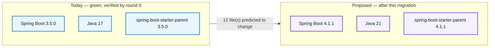
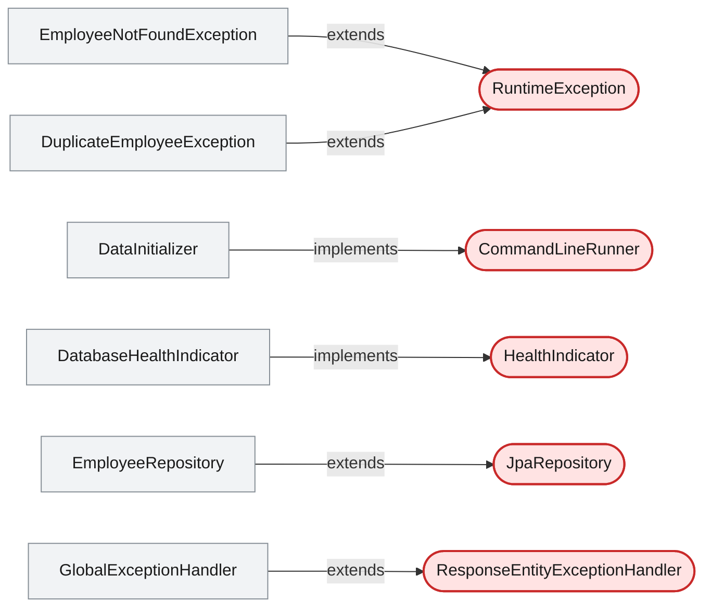
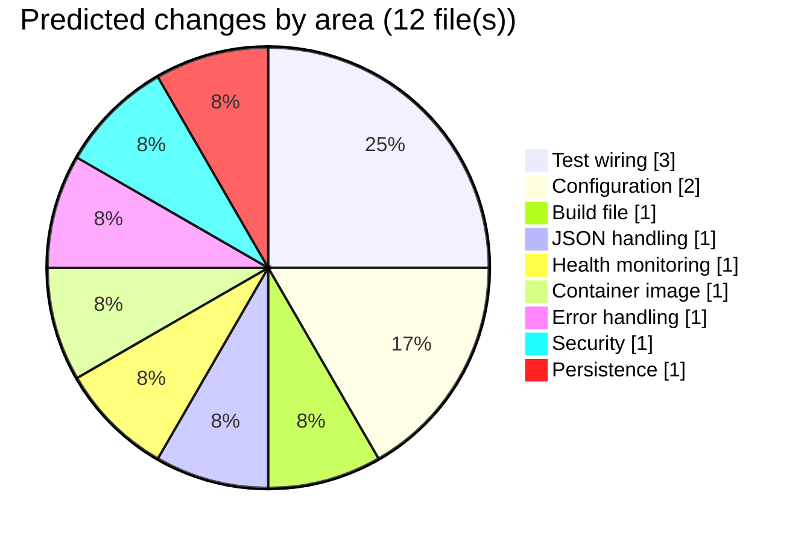

# Migration Plan — Spring Boot 3.5.0 to 4.1.1 on Java 21

## Spring Boot 3 to 4 Migration Demo

     

> This proposes moving the employee service from Spring Boot 3.5.0 to Spring Boot 4.1.1, and its language level from Java 17 to Java 21. Spring Boot 4 is a whole-generation jump: it brings Spring Framework 7, Spring Security 7, Hibernate ORM 7 and Jackson 3 with it, so the source code has to change, not just the version numbers. The REST contract is expected to survive untouched - all seven endpoints, the authentication boundary and the 404/400 error paths are recorded today and will be replayed on the new runtime and compared request by request. The work is expected to take roughly seven build rounds across five phases, most of it mechanical import repointing in two main-source files and three test files, plus one genuine rewrite of the Jackson configuration bean. The single biggest risk is not a compile error at all: the tests that authenticate with @WithMockUser can start returning 401 while still compiling, which only a round that actually runs the tests will catch. Nothing in the project changes until this plan is approved.

_Written by the Version Migration skill on 2026-09-10, **before** anything was changed. Nothing in this document has happened yet — it is a proposal, and it is waiting on your decision at the end._

## At a glance

| | |
|---|---|
| **Status** | Approved |
| **What that means** | Waiting on a human decision. No version will be changed while it reads this. |
| **Revision** | 1 |
| **Project** | `.` |
| **Platform** | Spring Boot 3.5.0 → **4.1.1** |
| **Language** | Java 17 → **21** |
| **Reference pack** | `references/spring-boot-3-to-4.md` |
| **Starting point** | 🟢 verified green — round 0 ran `package` on JDK 17 and passed |
| **Files predicted to change** | 12 |
| **Phases** | 5 |
| **Estimated rounds** | 7 |
| **Estimated duration** | Half a day, assuming both JDKs stay installed, the Docker daemon stays up for the Testcontainers test, and the first build on the new BOM (a large one-off download) is not counted as a representative round. |
| **Overall risk** | High — 8 risk(s) identified |
| **Architecture evidence** | 🟢 live code graph — 17 type(s), 5 framework touchpoint(s), 7 endpoint(s) |
| **Reviewer** | Vihanga22365 — approved in session, relayed by Claude |
| **Decision date** | 2026-09-10 |

## Why do this at all

- Spring Boot 3.5.x is the tail of the 3.x line; 4.x is the generation that receives feature work and, in time, the security fixes.
- Java 21 is the LTS the Boot 4 generation is built and tested against - the reference pack is explicit that Boot 4 can still compile under Java 17, so this is a deliberate move rather than something the compiler forces.
- The 4.1.1 BOM carries Spring Framework 7.0.9, Spring Security 7.1.1, Hibernate ORM 7.4.5.Final and Jackson 3.1.5 (read from the resolved spring-boot-dependencies:4.1.1 pom), replacing four ecosystem generations in one managed step.
- Honest counterweight: no CVE, customer requirement or blocking dependency forces this today. It is a planned generation move, and the reviewer is entitled to say 'not yet'.

## 1. What would move

| | Today | Proposed |
|---|---|---|
| Spring Boot | `3.5.0` | `4.1.1` |
| Java | `17` | `21` |
| Parent | `org.springframework.boot:spring-boot-starter-parent:3.5.0` | `org.springframework.boot:spring-boot-starter-parent:4.1.1` |
| Build tool | `maven (path)` | unchanged |
| Reference pack | — | `references/spring-boot-3-to-4.md` — Spring Boot 3.x to 4.x (Java 17 to 21) |

## 2. What the code graph says about this application

Read live from the Neo4j code knowledge graph (`neo4j+s://7d610372.databases.neo4j.io`, database `neo4j`) on 2026-09-10. Full briefing: `.github/.pipeline-context/version-migration/boot4-upgrade/graph-context.md`.

> The live Neo4j graph shows a small, conventionally wired service with a narrow but sharp framework surface: 17 types in one module, 5 external base types held by 6 types, 11 distinct framework annotations, and 7 REST endpoints. That narrowness is the good news - a generation jump breaks code exactly where it touches the framework, and here that is a handful of files rather than a layer. Of the 5 touchpoints, only one (DatabaseHealthIndicator implements HealthIndicator) sits on a type the reference pack says actually relocates in this jump; JpaRepository, CommandLineRunner and RuntimeException are expected to be inert, and ResponseEntityExceptionHandler is the one the pack has no rule for and therefore the one I am least sure about. The graph also ranks EmployeeController, EmployeeRepository and EmployeeService as the most exposed files, but exposure ranks where to look, not what changes: none of those three is predicted to change, because the coupling they carry is annotations and interfaces this jump does not move. The real concentration of work is somewhere the exposure ranking puts near the bottom - JacksonConfig, rank 12 with zero dependents, is the largest single source change in the migration.

| What the graph holds | |
|---|---|
| Modules | 1 |
| Types | 17 |
| Declared dependencies | 12 |
| Framework touchpoints | 5 external base type(s), held by 6 type(s) |
| REST endpoints | 7 |
| Critical / high areas | 20 |

**Where this application touches the framework.** These are the types that extend or implement something defined outside the repository — the exact points a generation jump breaks first.

**The most exposed files**, ranked by framework coupling combined with how many other types depend on them. This ranks where to look; it does not predict that a file will change — that is the next section.

| File | Exposure | Coupled to | Dependents | Criticality |
|---|---|---|---|---|
| `src/main/java/com/example/migrationdemo/controller/EmployeeController.java` | 16 | @RequestMapping, @RestController | 0 | — |
| `src/main/java/com/example/migrationdemo/repository/EmployeeRepository.java` | 12 | extends JpaRepository, @Repository | 2 | high |
| `src/main/java/com/example/migrationdemo/service/EmployeeService.java` | 9 | @Service | 1 | critical |
| `src/main/java/com/example/migrationdemo/mapper/EmployeeMapper.java` | 5 | @Component | 1 | medium |
| `src/main/java/com/example/migrationdemo/exception/GlobalExceptionHandler.java` | 4 | extends ResponseEntityExceptionHandler, @RestControllerAdvice | 0 | — |
| `src/main/java/com/example/migrationdemo/health/DatabaseHealthIndicator.java` | 4 | implements HealthIndicator, @Component | 0 | — |
| `src/main/java/com/example/migrationdemo/init/DataInitializer.java` | 4 | implements CommandLineRunner, @Component | 0 | — |
| `src/main/java/com/example/migrationdemo/exception/DuplicateEmployeeException.java` | 3 | extends RuntimeException | 0 | — |
| `src/main/java/com/example/migrationdemo/exception/EmployeeNotFoundException.java` | 3 | extends RuntimeException | 0 | — |
| `src/main/java/com/example/migrationdemo/config/SecurityConfig.java` | 2 | @Configuration, @EnableWebSecurity | 0 | — |

**What that means for this jump**

- 5 framework touchpoints: DatabaseHealthIndicator implements HealthIndicator, EmployeeRepository extends JpaRepository, GlobalExceptionHandler extends ResponseEntityExceptionHandler, DataInitializer implements CommandLineRunner, and two exception types extend RuntimeException.
- DatabaseHealthIndicator is the clearest hit: the graph marks HealthIndicator as an ExternalType, and the pack moves that type from org.springframework.boot.actuate.health to org.springframework.boot.health.contributor - which I confirmed against the spring-boot-health-4.1.1 jar.
- GlobalExceptionHandler extends ResponseEntityExceptionHandler, a Spring Framework 7-owned base class whose protected method signatures the project overrides. The pack has no rule for it, so the graph is pointing at a file the reference material does not cover.
- The graph carries the 12 declared coordinates for this module, including org.springframework.boot:spring-boot-starter-web and org.springframework.security:spring-security-test - both of which the pack flags as renamed or replaced in Boot 4.
- 11 annotations wire the application, but only the two @Configuration classes matter for this jump: SecurityConfig and JacksonConfig. @RestController, @Service, @Repository, @Entity, @Table, @Component and @SpringBootApplication are unchanged across the generation.
- The graph's semantic layer explicitly marks SecurityConfig, JacksonConfig and both @Query methods on EmployeeRepository as planted MIGRATION-DEMO breakage points for Security 6-to-7, Jackson 2-to-3 and Hibernate query parsing - so those four places are where this project was built to break.
- All 7 endpoints hang off one controller and are the contract the migration must preserve; every one of them is in the probe list.

**What the graph could not tell us** — carried into the risks below rather than assumed away.

- The graph holds no test types at all - 0 of the 6 test sources appear anywhere in it. Every test-layer prediction in this plan therefore comes from the reference pack plus my own direct read of those files, not from measured coupling, and the migration's worst known failure mode (@WithMockUser returning 401) lives entirely in that blind spot.
- The graph has no edges for pom.xml, the Dockerfile, application.yml or application-test.yml. The parent version, the java.version property, the compiler plugin's source/target and the container base image are all invisible to it; those predictions come from the baseline inventory and the pack.
- Configuration property renames are invisible to both the graph and the compiler. The graph's own cross-cutting notes describe three config-coupling facts (health details served anonymously, /h2-console reachable via anyRequest().permitAll(), the H2 file-backed datasource default) that exist only as combinations of settings with no code edge - exactly the class of thing Boot 4 can change silently.
- The graph reports 0 stale descriptions, so it is a current snapshot rather than a description of older code - but it is still a snapshot of main source only.
- Runtime and infrastructure are outside it: the Docker daemon that Testcontainers needs, the PostgreSQL image the integration test starts, and the fact that the probes run against H2 while one repository query is PostgreSQL-native SQL.

## 3. How the migration would run

```mermaid
flowchart TD
  R0["Round 0 — green today<br/>build + tests pass"]:::ok
  P1["1. Build file and coordinates<br/>Move the parent, the language level and the renamed…<br/>~2 round(s) · compile"]:::work
  R0 -->|"versions changed"| P1
  P2["2. Main source relocations<br/>Repoint the two main-source files the generation ju…<br/>~2 round(s) · test-compile"]:::work
  P1 -->|"Could not resolve dependencies fo…"| P2
  P3["3. Test layer<br/>Fix the second wave of compile errors, which only a…<br/>~2 round(s) · test-compile"]:::work
  P2 -->|"cannot find symbol: variable WRIT…"| P3
  P4["4. Full test run and behavioural regress…<br/>Run the same goal round 0 ran package, tests includ…<br/>~2 round(s) · package"]:::work
  P3 -->|"package org.springframework.boot.…"| P4
  P5["5. Prove behaviour and land it in the pr…<br/>Replay the same 15 probes on JDK 21, compare them r…<br/>~1 round(s) · package"]:::work
  P4 -->|"Tests annotated @WithMockUser ret…"| P5
  GREEN["Build green on the new version"]:::ok
  P5 --> GREEN
  PROBE["Probes replayed — behaviour compared request by request"]:::gate
  GREEN --> PROBE
  APPLY["Written into the project and built there"]:::gate
  PROBE --> APPLY
  DONE["Project on the new version, green"]:::ok
  APPLY --> DONE
  classDef before fill:#e7f5ff,stroke:#1c7ed6,stroke-width:2px,color:#1a1a1a
  classDef after fill:#f3f0ff,stroke:#7048e8,stroke-width:2px,color:#1a1a1a
  classDef work fill:#fff3bf,stroke:#e8590c,stroke-width:2px,color:#1a1a1a
  classDef gate fill:#ffe3e3,stroke:#c92a2a,stroke-width:2px,color:#1a1a1a
  classDef ok fill:#e6fcf5,stroke:#2f9e44,stroke-width:2px,color:#1a1a1a
  classDef neutral fill:#f1f3f5,stroke:#868e96,stroke-width:1px,color:#1a1a1a
```

Each phase is a loop, not a step: change what the last failure pointed at, build, read the next failure. The round counts below are a forecast — the compiler decides the real number, and the final report compares the two.

| # | Phase | Goal | Build goal | Est. rounds | What we expect to break |
|---|---|---|---|---|---|
| 1 | **Build file and coordinates** | Move the parent, the language level and the renamed starters so the resolver and the compiler can tell us what no longer exists. | `compile` | 2 | Could not resolve dependencies for spring-boot-starter-web:jar:4.1.1 - the servlet starter is named spring-boot-starter-webmvc in Boot 4 package com.fasterxml.jackson.databind does not exist in JacksonConfig package org.springframework.boot.actuate.health does not exist in DatabaseHealthIndicator |
| 2 | **Main source relocations** | Repoint the two main-source files the generation jump actually moves - the Jackson configuration and the health indicator - driven by the errors the previous round produces. | `test-compile` | 2 | cannot find symbol: variable WRITE_DATES_AS_TIMESTAMPS once SerializationFeature comes from tools.jackson.databind cannot find symbol: method setDefaultPropertyInclusion on the Jackson 3 builder package org.springframework.boot.autoconfigure.jackson does not exist for Jackson2ObjectMapperBuilderCustomizer |
| 3 | **Test layer** | Fix the second wave of compile errors, which only appears once main source compiles: the modularised test starters and the annotations that moved package with them. | `test-compile` | 2 | package org.springframework.boot.test.autoconfigure.web.servlet does not exist (@WebMvcTest, @AutoConfigureMockMvc) package org.springframework.boot.test.autoconfigure.orm.jpa does not exist (@DataJpaTest) package org.springframework.boot.test.mock.mockito does not exist (@MockBean) cannot find symbol: class ObjectMapper in EmployeeControllerTest |
| 4 | **Full test run and behavioural regressions** | Run the same goal round 0 ran (package, tests included) so the suite is compared like for like, and catch the breakages that produce no compiler error. | `package` | 2 | Tests annotated @WithMockUser returning 401 while the .with(httpBasic(...)) tests keep passing - the signature of a missing spring-boot-starter-security-test Possible Hibernate 7 startup or query-parse failure on the native PostgreSQL query or the JPQL finder |
| 5 | **Prove behaviour and land it in the project** | Replay the same 15 probes on JDK 21, compare them request by request against the baseline, then write the green sandbox into the project and build the project itself on Java 21. | `package` | 1 | No build failure expected here; the expected differences are in the probe bodies - the actuator health document and the framework-rendered error timestamp A post-apply project build that differs from the sandbox because of something the copy did not carry, such as a stale target/ or local configuration |

What the graph says each phase is for

**Build file and coordinates**

- The graph lists all 12 declared coordinates for this module; spring-boot-starter-web is one of them and is the coordinate the pack renames.
- The parent version, java.version and the maven-compiler-plugin source/target have no graph node - this part of the phase is from the baseline inventory and the pack, not from the graph.

**Main source relocations**

- DatabaseHealthIndicator is one of the 5 framework touchpoints - it implements HealthIndicator, which the graph records as an ExternalType.
- JacksonConfig is one of the 2 @Configuration types, and the graph's semantic layer marks it a planted Jackson 2-to-3 breakage point.

**Test layer**

- None. The graph contains no test types, so this entire phase is predicted from the reference pack (4.1, 4.2, 4.3) and a direct read of the six test files - it is the plan's largest un-measured area.

**Full test run and behavioural regressions**

- The Hibernate half is graph-backed: EmployeeRepository extends JpaRepository (a touchpoint), and the graph notes findHighEarners is nativeQuery = true PostgreSQL SQL while findActiveEmployeesByDepartment is JPQL parsed only at context build.
- The @WithMockUser half is not graph-backed - no test types are in the graph.

**Prove behaviour and land it in the project**

- All 7 endpoints the graph records are covered by the probe list, so the comparison covers the whole REST surface the graph knows about.

## 4. What is expected to change

Every file expected to change, why, and what in the graph says so. A prediction that turns out to be wrong is recorded as such in the final report — this table is a forecast, and it is meant to be checked against what actually happened.

| File | Area | What changes | Why | Confidence | Evidence |
|---|---|---|---|---|---|
| `src/test/java/com/example/migrationdemo/controller/EmployeeControllerTest.java` | Test wiring | @WebMvcTest and its slice imports repoint to org.springframework.boot.webmvc.test.autoconfigure, @MockBean becomes @MockitoBean from org.springframework.test.context.bean.override.mockito, and the injected ObjectMapper becomes a JsonMapper. | Boot 4 removes @MockBean, moves the slice annotations into the modular webmvc-test artifact under a new package, and the auto-configured mapper is now a Jackson 3 JsonMapper. | 🟢 high | None - the graph contains no test types whatsoever, so nothing here was measured. This prediction is the reference pack applied to a direct read of the file, which today imports org.springframework.boot.test.mock.mockito.MockBean, org.springframework.boot.test.autoconfigure.web.servlet.WebMvcTest and com.fasterxml.jackson.databind.ObjectMapper. I verified WebMvcTest.class and AutoConfigureMockMvc.class are in org/springframework/boot/webmvc/test/autoconfigure/ inside spring-boot-webmvc-test-4.1.1.jar. rule: 4.1 Mocking annotations, 4.2 Slice tests and injected mappers, 4.3 Test starters |
| `src/test/java/com/example/migrationdemo/integration/EmployeeRepositoryIntegrationTest.java` | Test wiring | The @DataJpaTest import repoints from org.springframework.boot.test.autoconfigure.orm.jpa to org.springframework.boot.data.jpa.test.autoconfigure. The Testcontainers wiring and the assertions are expected to be untouched. | Boot 4 splits the JPA test slice into its own starter and moves the annotation's package with it. | 🟢 high | None - no test types are in the graph. From the pack plus a read of the file, which imports org.springframework.boot.test.autoconfigure.orm.jpa.DataJpaTest today. I verified DataJpaTest.class is in org/springframework/boot/data/jpa/test/autoconfigure/ inside spring-boot-data-jpa-test-4.1.1.jar. rule: 4.3 Test starters - and the slice annotations that moved with them |
| `src/test/java/com/example/migrationdemo/actuator/ActuatorEndpointsTest.java` | Test wiring | The @AutoConfigureMockMvc import repoints to org.springframework.boot.webmvc.test.autoconfigure. Nothing else in the class is expected to move. | Same modularisation as the controller test - the annotation moved artifact and package together. | 🟢 high | None - no test types are in the graph. From the pack plus a read of the file, which imports org.springframework.boot.test.autoconfigure.web.servlet.AutoConfigureMockMvc today. rule: 4.3 Test starters - and the slice annotations that moved with them |
| `src/main/resources/application.yml` | Configuration | Possibly a renamed or removed property under spring.jackson.*, spring.jpa.* or management.*; most likely nothing. | Boot 4 removes properties deprecated across the 3.x line, and a property that no longer exists is inert rather than an error. | 🔴 low | None - the graph has no configuration edges, and it says so itself: its cross-cutting notes describe three config-coupling facts (anonymous access to health details, /h2-console falling into anyRequest().permitAll(), the H2 file-backed datasource default) that exist only as combinations of settings with no code edge. That is precisely why this entry is low confidence: neither the graph nor the compiler can see it, so only the probe comparison would catch it. rule: 7. Configuration properties and runtime |
| `src/test/resources/application-test.yml` | Configuration | Possibly the explicit spring.jpa.database-platform: org.hibernate.dialect.H2Dialect line, if Hibernate 7 relocated or removed that dialect class. | Hibernate 7 removed a number of dialect classes and prefers auto-detection; an explicitly pinned dialect that no longer exists fails at context startup, not at compile time. | 🔴 low | None - no configuration edges and no test sources in the graph. From a direct read of the file, which pins the dialect explicitly, plus the pack's symptom table. rule: 6. Hibernate 6 to 7 - startup fails on dialect or driver resolution |
| `pom.xml` | Build file | Parent 3.5.0 to 4.1.1; java.version 17 to 21; maven-compiler-plugin source/target 17 replaced by release 21; spring-boot-starter-web renamed to spring-boot-starter-webmvc; spring-boot-starter-webmvc-test and spring-boot-starter-data-jpa-test added; spring-security-test replaced by spring-boot-starter-security-test. | The parent manages every Boot, Jackson, Hibernate and test-stack version, Boot 4 names the servlet starter for its stack, and it splits the single test starter into per-slice modules. | 🟢 high | Partly graph-backed: the graph carries all 12 declared coordinates for this module, including org.springframework.boot:spring-boot-starter-web and org.springframework.security:spring-security-test, the two the pack renames or replaces. The graph records no version on any coordinate and has no node for the parent, the java.version property or the compiler plugin - those three come from baseline.json and the reference pack, not from measurement. rule: 1.1 Parent / BOM, 1.2 Language level, 1.3 Starter renames, 4.3 Test starters, 4.4 security-test starter |
| `src/main/java/com/example/migrationdemo/config/JacksonConfig.java` | JSON handling | The hand-built ObjectMapper bean is replaced by a JsonMapperBuilderCustomizer bean: imports move to tools.jackson.databind, WRITE_DATES_AS_TIMESTAMPS moves from SerializationFeature to DateTimeFeature, setDefaultPropertyInclusion becomes changeDefaultPropertyInclusion, and the manual JavaTimeModule registration is dropped because java.time support is built in. | Jackson 3 changes its package root, its entry-point type and its configuration API, and Boot 4's Jackson auto-configuration changes with it. | 🟢 high | Graph-backed as a location: JacksonConfig is one of the 2 @Configuration types the graph records, and the graph's semantic layer explicitly names it a planted Jackson 2-to-3 breakage point. The specific target packages are not from the graph - I verified tools.jackson.databind.json.JsonMapper, tools.jackson.databind.SerializationFeature and tools.jackson.databind.cfg.DateTimeFeature inside jackson-databind-3.1.5.jar, and org.springframework.boot.jackson.autoconfigure.JsonMapperBuilderCustomizer inside spring-boot-jackson-4.1.1.jar. rule: 2.1 Package and type moves, 2.2 Configuration API |
| `src/main/java/com/example/migrationdemo/health/DatabaseHealthIndicator.java` | Health monitoring | Two imports repointed from org.springframework.boot.actuate.health to org.springframework.boot.health.contributor. The builder API, the @Component("database") registration and the method body are expected to be untouched. | Boot 4 relocates the Health and HealthIndicator types into the new health-contributor module; the types themselves are unchanged. | 🟢 high | Directly graph-backed: this is one of the 5 framework touchpoints, recorded as implementing HealthIndicator, which the graph classes as an ExternalType - the exact shape of coupling a package relocation lands on. I confirmed org/springframework/boot/health/contributor/Health.class and HealthIndicator.class are present in spring-boot-health-4.1.1.jar. rule: 3. Actuator - health contributor package |
| `Dockerfile` | Container image | Base image FROM eclipse-temurin:17-jre becomes eclipse-temurin:21-jre. | A jar compiled at class-file version 65 will not start on a Java 17 JRE; the build stays green and the container fails at runtime. | 🟢 high | None - the graph has no edge to container files. This comes from baseline.json's ancillary-file inventory, which lists the Dockerfile, and from a direct read of it. There is no CI workflow in this repository to update, and docker-compose.yml pins no Java version (only postgres:16), so neither is expected to change. rule: 8. Container image and CI |
| `src/main/java/com/example/migrationdemo/exception/GlobalExceptionHandler.java` | Error handling | Possibly nothing; at most the overridden handleMethodArgumentNotValid signature, if Spring Framework 7 changed the protected contract it inherits. | The class extends a framework-owned base whose protected method signatures are not the project's to control, and this jump moves Spring Framework 6 to 7. | 🔴 low | Graph-backed as a location: it is one of the 5 framework touchpoints, recorded as EXTENDS ResponseEntityExceptionHandler, an ExternalType. The graph also notes that framework-raised errors rendered by this inherited base do not use the project's ErrorResponse shape, so a change here is visible to clients in a way the project's own handlers are not. What the graph cannot say is whether that signature actually moved in Framework 7 - I have not verified it against the jar, and only a build round will settle it. rule: No rule - the pack does not cover ResponseEntityExceptionHandler. This prediction comes from the graph rather than the reference material, which is why its confidence is low. |
| `src/main/java/com/example/migrationdemo/config/SecurityConfig.java` | Security | Expected to need no change at all; at most a DSL adjustment if Security 7 removed something this chain uses. | The chain is already written in the lambda DSL that Security 7 keeps; the pack says only the removed chained/and() style breaks, and this file does not use it. | 🔴 low | Graph-backed as a location and as a reason to watch it: the graph ranks SecurityConfig a critical-criticality configuration type, records it as the only @EnableWebSecurity type, and its semantic layer marks it a planted Security 6-to-7 breakage point. Set against that, my read of the file shows csrf(...), authorizeHttpRequests(...) and httpBasic(Customizer.withDefaults()) - all lambda-DSL forms the pack says survive. Listed at low confidence because the graph says look here and the code says nothing to do; the compiler decides. rule: 5. Spring Security 6 to 7 |
| `src/main/java/com/example/migrationdemo/repository/EmployeeRepository.java` | Persistence | Expected to need no source change; the risk is a runtime or startup failure rather than a compile error, and if anything moves it will be the native SQL or the JPQL fragment. | Hibernate 7 parses HQL/JPQL more strictly and drops some legacy API surface, but derived query methods and JpaRepository itself carry over. | 🔴 low | Graph-backed: it is one of the 5 framework touchpoints (EXTENDS JpaRepository), ranks second on exposure with 2 dependents and high criticality, and the graph's semantic layer records that findHighEarners is nativeQuery = true PostgreSQL SQL run against the default H2 datasource, while findActiveEmployeesByDepartment is JPQL parsed only when the context builds - two different failure symptoms, neither of which the compiler will show. rule: 6. Hibernate 6 to 7 and Spring Data JPA |

### Declared versions to be changed first

These go in before the first build round. Nothing in the source is touched until a build has failed on it.

| Coordinate | From | To | Kind | Why |
|---|---|---|---|---|
| `org.springframework.boot:spring-boot-starter-parent` | `3.5.0` | `4.1.1` | version | 1.1 - the generation jump itself; every managed version underneath follows from this one. 4.1.1 is the newest GA release on Maven Central (4.2.0-M1 is a milestone) and was confirmed to resolve with mvn dependency:get. |
| `java.version` | `17` | `21` | property | 1.2 - the language level the Boot 4 generation is built and tested against. |
| `org.apache.maven.plugins:maven-compiler-plugin` | `source/target 17` | `release 21` | plugin | 1.2 - an explicit stale source/target overrides the java.version property and would silently keep compiling at 17. |
| `org.springframework.boot:spring-boot-starter-web` | `spring-boot-starter-web` | `spring-boot-starter-webmvc` | rename | 1.3 - Boot 4 names the servlet starter for its stack; the old coordinate does not exist at 4.x and fails at resolution, not compile. |
| `org.springframework.boot:spring-boot-starter-webmvc-test` | `absent` | `4.1.1 (managed)` | added | 4.3 - @WebMvcTest and @AutoConfigureMockMvc live in this module in Boot 4, and their package moved with it. |
| `org.springframework.boot:spring-boot-starter-data-jpa-test` | `absent` | `4.1.1 (managed)` | added | 4.3 - @DataJpaTest moved into its own test starter and package. |
| `org.springframework.security:spring-security-test` | `spring-security-test (managed)` | `org.springframework.boot:spring-boot-starter-security-test` | rename | 4.4 - the MockMvc security test auto-configuration that applies the test SecurityContext now ships in Boot's own security-test starter; declaring the raw artifact leaves @WithMockUser silently unauthenticated. |
| `org.springframework.boot:spring-boot-properties-migrator` | `absent` | `4.1.1 (managed, runtime scope, temporary)` | added | 7 - reports renamed and removed configuration properties at startup with their replacements. It is a migration aid and would be removed again before the result is applied to the project. Proposed, not assumed - see the open questions. |
| `testcontainers.version` | `1.21.4` | `1.21.4 (unchanged)` | property | Listed to state the boundary explicitly: this override predates the migration and exists because the Boot-managed 1.21.0 requests a Docker API below the local engine's floor. The migration will not touch it unless a build round fails on it, and if the Boot 4.1.1 BOM already manages a version at or above 1.21.4 the override is left in place rather than tidied away. |

## 5. What could go wrong

**Overall: High.** 8 risk(s) identified, laid out by how likely they are against how much damage they would do.

| Likelihood ⧵ Impact | High | Medium | Low |
|---|---|---|---|
| **High** | 🔴 **1** | 🟠 **1** | · |
| **Medium** | 🟠 **1** | 🟠 **4** | · |
| **Low** | · | 🟠 **1** | · |

| Risk | Likelihood | Impact | What the migration does about it | Why it applies here |
|---|---|---|---|---|
| The tests that authenticate with @WithMockUser start returning 401 while compiling perfectly, so a migration verified by compilation alone would ship a broken security test layer. | 🔴 high | 🔴 high | The fourth phase runs the same package goal round 0 ran, so the 19-test count is compared like for like; the plan already names spring-boot-starter-security-test as the fix, and the diagnostic split (httpBasic tests pass, @WithMockUser tests fail) is written down in advance so the round is read correctly rather than misdiagnosed as a filter-chain break. | Not graph-backed, and that is the point: the graph holds no test types at all, so this risk is invisible to the evidence base this plan is otherwise built on. It comes from the pack's 4.4 and my read of EmployeeControllerTest.java, which mixes @WithMockUser and .with(httpBasic("demo","demo123")) in the same class - the exact combination that produces the diagnostic split. |
| The /actuator/health document changes shape, so anything scraping it sees a different payload even though no application code changed. | 🔴 high | 🟠 medium | Health is probed before and after and its body compared; the pack already documents key reordering and a larger payload for this jump, so the comparison will report it as a client-visible change rather than rounding it down to 'unchanged'. | Graph-backed twice over: DatabaseHealthIndicator is one of the 5 touchpoints and is itself predicted to move package, and the graph's config-coupling note records that /actuator/health is permitAll while management.endpoint.health.show-details is 'always' and the indicator attaches details - so the document is served to anonymous callers and any shape change is externally visible. |
| Hibernate 7's stricter query parsing or its removed dialect classes break the application at startup or at query time, with no compiler error anywhere. | 🟠 medium | 🔴 high | The high-earners endpoint (the native query) and the search endpoint are both probed, and the @DataJpaTest integration test runs against real PostgreSQL via Testcontainers in the package rounds. A JPQL parse error is a context-startup failure, so it will surface as a failed probe rather than a subtly wrong answer. | Graph-backed: EmployeeRepository extends JpaRepository (a touchpoint) and the graph records that findHighEarners is nativeQuery = true PostgreSQL SQL while findActiveEmployeesByDepartment is JPQL parsed only when the context builds - two distinct symptoms. The graph additionally marks both @Query methods as planted Hibernate query-parsing breakage points. |
| A configuration property is renamed or removed in Boot 4 and silently stops applying - an endpoint quietly exposed or hidden, a log level that stops taking effect, a serialization default that changes. | 🟠 medium | 🟠 medium | Add spring-boot-properties-migrator at runtime scope during the migration so startup reports renamed properties by name, and rely on the probe comparison for anything it misses. Remove the migrator before applying to the project. | This is the graph's own declared blind spot: it has no configuration edges, and its cross-cutting notes describe three behaviours that exist only as combinations of settings (anonymous health details, /h2-console under anyRequest().permitAll(), the H2 file-backed default). Nothing in a build round will surface any of them. |
| GlobalExceptionHandler fails to compile against Spring Framework 7, or the framework-rendered error bodies it inherits change shape while the project's own ErrorResponse stays the same - so clients see two error formats diverge. | 🟠 medium | 🟠 medium | Three probes pin error contracts on both sides of that split: the 404 and the 400 validation failure render the project's ErrorResponse, while the missing-required-parameter 400 is rendered by the inherited base. A shape change in the third with the first two unchanged is exactly this risk materialising, and the body excerpts are recorded for both runs. | Graph-backed: GlobalExceptionHandler is one of the 5 touchpoints (EXTENDS ResponseEntityExceptionHandler), and the graph explicitly notes that framework-raised errors - wrong method, malformed JSON, missing @RequestParam, non-numeric path variable - do not use the project's ErrorResponse shape, and that the split does not follow status-code lines. |
| The behavioural evidence is collected against H2, while the one native query in the application is PostgreSQL SQL - so a green probe run does not prove that endpoint works on the database a real deployment would use. | 🟠 medium | 🟠 medium | State the limitation rather than paper over it, and lean on the Testcontainers PostgreSQL integration test in the package rounds for the JPA layer. This is a pre-existing property of the project, not something the migration introduces. | Graph-backed: the graph's config-coupling note records that the datasource defaults to jdbc:h2:file:./data/employee_db when DB_URL is unset while findHighEarners is native PostgreSQL SQL, and that nothing fails loudly in that combination. |
| The Docker daemon that Testcontainers needs stops during the migration, turning later rounds red for environmental reasons that look identical to migration damage in the round record. | 🟠 medium | 🟠 medium | Round 0 is already recorded green with all 19 tests including the Testcontainers integration test, so any later Testcontainers error can be attributed by comparison rather than guessed at, and will be reported as environmental rather than as a migration regression. | Not graph-backed - this is environment, and the graph has no edge to the Docker daemon or the postgres:16 image. It is included because the pack's own round-history section records a previous run of this exact pack being derailed by it. |
| The sandbox goes green but the project's own post-apply build does not, because something the copy did not carry differs - a stale target/, local configuration, or the file-backed H2 database in data/ that the sandbox copies but the project keeps writing to. | 🟢 low | 🟠 medium | apply-migration.js --to-project backs up every file it overwrites and then builds the project itself on JDK 21 with the tests; the result is reported as applied-verified, applied-verification-failed or applied-unverified, and --revert restores the backup. Nothing is reported as successful on a sandbox result alone. | Not graph-backed - this is a property of the migration harness, not of the application. Noted because the project does carry a data/employee_db.mv.db that is copied into the sandbox and is live state rather than source. |

## 6. How we would know it still works

Unchanged behaviour means all seven REST endpoints in the graph answer with the same status they answer with today, the authentication boundary holds in all three of its forms, and the two error-rendering paths (the project's own ErrorResponse and the framework's inherited one) still produce their contracted statuses. Fifteen requests were recorded against the running application on JDK 17 before anything was touched, and all fifteen met their expected status. The same fifteen will be replayed on JDK 21 once a round comes back green, and compared request by request. Every probe is non-mutating by design - the write endpoints are exercised through their error contracts rather than by creating rows - so the two runs see identical seed data and body differences mean something.

| Probe | Expect | Why it is in the list | Criticality |
|---|---|---|---|
| `GET /actuator/health (no auth)` | `200` | The permitAll side of the auth boundary, and the framework-owned payload most likely to change shape. | 🔴 high |
| `GET /actuator/info (no auth)` | `200` | The second explicitly permitted actuator path, confirming the permit rules are still applied in order. | 🟠 medium |
| `GET /api/v1/employees` | `200` | The happy path and the shape of the collection response. | 🟠 medium |
| `GET /api/v1/employees/1` | `200` | The single-resource happy path against a seeded id, and the Jackson serialization of LocalDateTime and BigDecimal fields. | 🟠 medium |
| `GET /api/v1/employees/search?department=Technology` | `200` | The derived-query read path with a required query parameter. | 🟠 medium |
| `GET /api/v1/employees/search?department=technology` | `200` | Pins the case-insensitive semantics the graph documents, so a Hibernate 7 change in the derived query is visible. | 🟠 medium |
| `GET /api/v1/employees/high-earners?salary=80000` | `200` | The only endpoint backed by native SQL - the one most exposed to Hibernate 7's parsing. | 🟠 medium |
| `GET /api/v1/employees/99999` | `404` | The 404 error contract rendered by the project's own ErrorResponse shape. | 🔴 high |
| `PUT /api/v1/employees/99999` | `404` | Covers the PUT route the graph marks high criticality, through its error contract so nothing is mutated. | 🔴 high |
| `DELETE /api/v1/employees/99999` | `404` | Covers the DELETE route the graph marks high criticality, through its error contract so nothing is mutated. | 🔴 high |
| `POST /api/v1/employees with an invalid payload` | `400` | Covers the POST route and the Bean Validation path that renders through the overridden handleMethodArgumentNotValid, without creating a row. | 🔴 high |
| `GET /api/v1/employees/search with no department parameter` | `400` | The other error-rendering path - a framework-raised error rendered by the inherited ResponseEntityExceptionHandler, not by the project's ErrorResponse. | 🔴 high |
| `GET /api/v1/employees (no auth)` | `401` | The authentication boundary on a read. | 🔴 critical |
| `POST /api/v1/employees (no auth)` | `401` | The authentication boundary on a write, with CSRF disabled - confirms Security 7 still rejects before validation. | 🔴 critical |
| `GET /api/v1/employees with wrong credentials` | `401` | Distinguishes 'no credentials rejected' from 'bad credentials rejected' - a password encoder or user-details change would show here and nowhere else. | 🔴 critical |

**What the probes will not check.** Stated up front so nobody reads "behaviour unchanged" as broader than it is.

- Successful writes. No probe creates, updates or deletes a real row, so a regression that only affects a successful POST, PUT or DELETE would not be caught by the probe comparison - only by the test suite.
- The PostgreSQL path. The probes run against the default file-backed H2 datasource; the native PostgreSQL query is exercised on a different engine than a real deployment would use. Only the Testcontainers integration test touches real PostgreSQL, and only in the build rounds.
- Framework-rendered type-mismatch errors such as GET /api/v1/employees/abc. I did not confirm the exact status Boot 3 returns for it today, and asserting an unverified contract in the gated baseline would have been guessing rather than measuring.
- The H2 console at /h2-console, which the graph notes falls into anyRequest().permitAll(). Not probed, and its access rules are out of scope for this migration.
- DataInitializer's seeding behaviour on an empty table - the sandbox carries an already-populated database, so the CommandLineRunner path is not exercised on either runtime.
- The metrics actuator endpoint, which is exposed by configuration but has no contract this application defines.
- Anything asynchronous or scheduled - there is none in this application.

## 7. What this migration would not do

Stated before the work so it can be checked afterwards. Anything here that turns out to be necessary comes back to you as a new revision rather than being folded in quietly.

- The duplicate-email defect the graph documents at EmployeeService.java:37 and :68, where both write paths call findByEmployeeNumber with an email value so the intended 409 becomes a 500. It is wrong today and will be equally wrong after the migration. Fixing it here would be indistinguishable from migration work in the diff.
- Adding the missing findByEmail method to EmployeeRepository, or a DataIntegrityViolationException handler to GlobalExceptionHandler - the two changes that would actually fix the above.
- The security posture findings the graph raises: /h2-console reachable through anyRequest().permitAll(), CSRF disabled globally rather than for /api/** only, and the health document exposing database details and exception text to anonymous callers. Configuration revalidation, not a Security 7 API break, and the pack is explicit that these belong in a separate change.
- DataInitializer seeding demo employees unconditionally in any environment where the table is empty.
- The file-backed H2 default datasource, the absence of Flyway or Liquibase, and hibernate.ddl-auto: update applying schema drift at boot.
- Test-quality improvements: replacing @WithMockUser with real credentials beyond what the migration forces, adding assertions, or widening coverage. If a slice has to be widened to @SpringBootTest to compile, that will be reported as a behavioural change to the test rather than passed off as a mechanical import edit.
- The unreachable code paths the graph notes - EmployeeService.findActiveEmployeesByDepartment with no route, EmployeeMapper.updateEntityFromRequest with no caller.
- Formatting, import reordering, and any refactor that is not forced by a build failure.
- The Testcontainers 1.21.4 override already in the pom. It is a pre-existing pre-migration fix, not migration work, and will be left exactly as it is unless a round fails on it.
- Any dependency bump not required by the jump. There is no springdoc-openapi in this project, so the pack's usual manual-bump trap does not apply here.

## 8. Getting back if it goes wrong

Every round happens in a sandbox copy under `.github/.pipeline-context/version-migration/`; the project is written once, at the very end, and only from a green sandbox. That write backs up every file it overwrites first.

Nothing in the project changes until the very last step - every round happens in the sandbox at .github/.pipeline-context/version-migration/boot4-upgrade/workspace/, and the project is written exactly once by apply-migration.js --to-project, which backs up every file it overwrites into the session's pre-apply-backup/ folder first. If the applied result is bad, `node scripts/apply-migration.js --slug boot4-upgrade --revert` restores every overwritten file from that backup. Abandoning the migration before the apply step requires no action at all: the project is untouched.

## 9. Your decision

> 🟡 **This plan currently reads `Proposed`.** Waiting on a human decision. No version will be changed while it reads this.

**To decide, edit two cells in the _At a glance_ table at the top of this file** — this file, by hand. Nothing else approves a migration, and no script will ever set these for you.

| Set **Status** to | What happens next |
|---|---|
| `Approved` | The migration proceeds: versions are changed in the sandbox, build rounds run on the target JDK, and the result is written into the project at the end. |
| `Changes requested` | Nothing runs. Write what you want changed in the feedback box below; the plan is revised and comes back to you as a new revision. |
| `Rejected` | Nothing runs, and nothing further is proposed for this migration. |

Fill in **Reviewer** and **Decision date** in the same table while you are there — they become part of the migration's audit trail.

### Questions for you

These are the things the plan could not settle on its own. Answers go in the feedback box.

1. Is 4.1.1 the right target? It is the newest GA release on Maven Central - 4.2.0-M1 is a milestone and is not proposed - but 4.0.8 is the tail of the more conservative 4.0.x line if you would rather take the generation jump without also taking the 4.1 minor. All the coordinates in this plan were verified to resolve at 4.1.1.
2. Is Java 21 the intended language level? JDK 25 is also installed on this machine. The reference pack targets 21 as the LTS the Boot 4 generation is built and tested against, and this plan follows it, but 21 is a decision here rather than something the compiler forces - Boot 4 will compile under Java 17.
3. If the @WebMvcTest slice in EmployeeControllerTest cannot be kept once the annotations move, do you accept widening it to @SpringBootTest with @AutoConfigureMockMvc? That is a real behavioural change to the test - it would load the whole application context instead of a controller slice - and I would rather have your answer than make that call inside a build round.
4. May the spring-security-test to spring-boot-starter-security-test swap be made up front with the other coordinate changes, or should it wait until a round actually fails on it? The pack predicts the failure and it costs a round to prove; making it up front is faster but means one coordinate change in the diff that no recorded failure forced.
5. Should spring-boot-properties-migrator be added at runtime scope for the migration and removed before the apply? It is the only tool that will report a silently renamed configuration property, and configuration is the largest blind spot in this plan - but it adds a dependency that appears and disappears across the round records.
6. Does anything downstream parse /actuator/health or match on the error-response timestamp format? The pack records both changing shape in this jump even when no application code changes, and this application serves the health document to unauthenticated callers with details always on. If there is a monitoring check or dashboard reading it, it should be warned before this lands.
7. The behavioural evidence will be collected against H2, not PostgreSQL, because that is the application's default datasource. Is that acceptable for sign-off, given that the /high-earners endpoint runs native PostgreSQL SQL? If not, the probe phase needs a PostgreSQL instance and a DB_URL, which is a change to how the migration is run rather than to the plan.

### Your feedback

Anything you write between the markers is preserved when the plan is re-rendered, and is carried into the review history below and into the final migration record.

<!-- REVIEWER FEEDBACK — write below this line; it is preserved across re-renders -->

Approved on 2026-09-10. Given verbally in session; Claude recorded it here rather than the reviewer editing the cell directly.

Three decisions taken on the open questions:

1. **Target: Spring Boot 4.1.1** (newest GA), as pinned. Not the conservative 4.0.8 line.
2. **Test slices: do NOT widen `@WebMvcTest` to `@SpringBootTest` on your own judgement.** Keep the slice. If a build round proves it cannot be preserved under Boot 4, STOP and put that specific case to the reviewer rather than silently changing what the test verifies.
3. **/actuator/health consumers: none.** Nothing downstream parses the health document or the error timestamp — this is a demo project. Still report any shape change in the behaviour section, but it is not a blocking finding.

Everything else is accepted as written: the 12 predicted files, the 5-phase sequence, and the out-of-scope boundary (the Testcontainers 1.21.4 override and the restored ActuatorEndpointsTest are pre-existing pre-migration state and must be left exactly as they are).

<!-- END REVIEWER FEEDBACK -->

## 10. Review history

<!-- REVIEW HISTORY — appended by the renderer, do not hand-edit -->

_First revision — nothing to show yet._

<!-- END REVIEW HISTORY -->

---

Appendix — what this plan was built from

| Input | Source |
|---|---|
| Current versions, toolchain, dependencies | `.github/.pipeline-context/version-migration/boot4-upgrade/baseline.json` |
| Architecture and coupling | `.github/.pipeline-context/version-migration/boot4-upgrade/graph-context.json` (live Neo4j graph) |
| Architecture briefing | `.github/.pipeline-context/version-migration/boot4-upgrade/graph-context.md` |
| Framework rules | `references/spring-boot-3-to-4.md` |
| Green starting point | round 0 — `passed` |
| The proposal itself | `.github/.pipeline-context/version-migration/boot4-upgrade/plan.json` |

