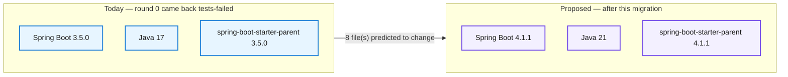
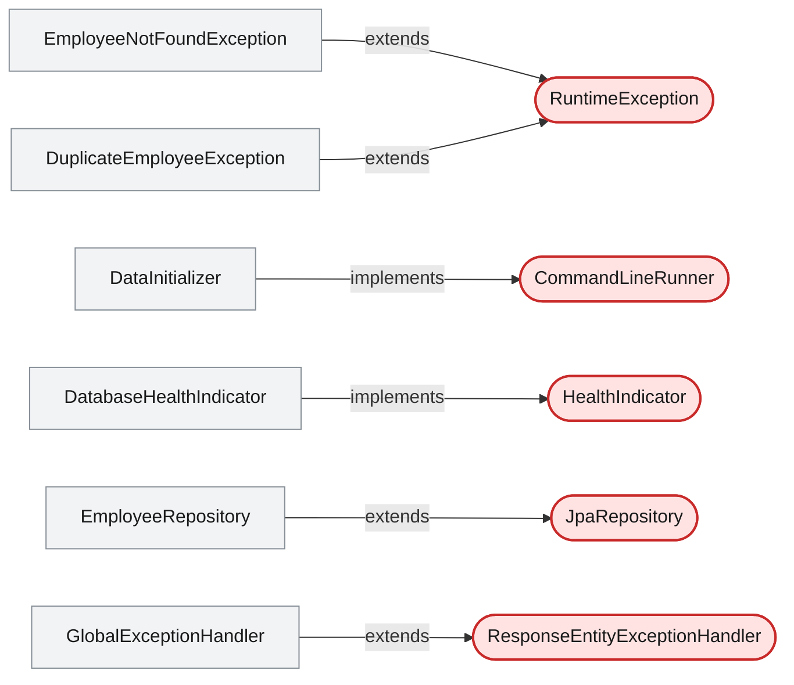
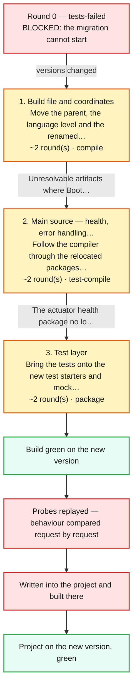
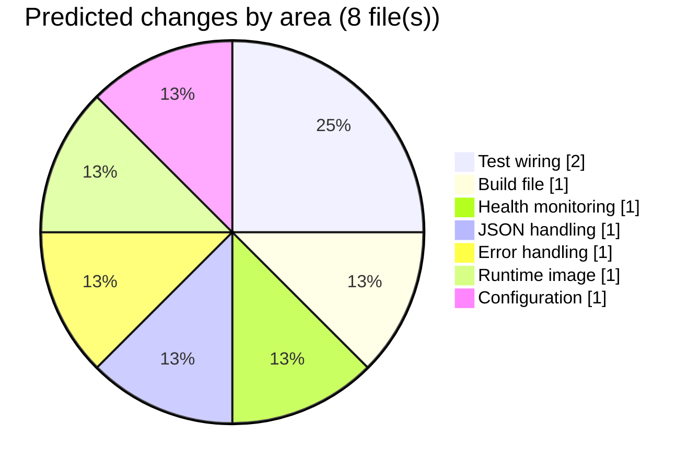

# Migration Plan — Spring Boot 3.5.0 to 4.1.1 on Java 21

## Spring Boot 3 to 4 Migration Demo

     

> This moves the employee service from Spring Boot 3.5.0 to 4.1.1 and from Java 17 to Java 21. Boot 4 brings Jackson 3, Spring Framework 7, Spring Security 7 and Hibernate 7 with it, so a handful of source files have to change even though no business logic does. The code graph shows only six of the seventeen types touching anything defined outside the repository, and those are the files this plan predicts will break — the other eleven never name a framework type at all. The seven REST endpoints are expected to answer identically afterwards, and five probes replayed on both runtimes will show whether that held. Best estimate is six build rounds over about half a day; the least certain part is the test layer, which cannot even be compiled until the main code is clean.

_Written by the Version Migration skill on 2026-09-10, **before** anything was changed. Nothing in this document has happened yet — it is a proposal, and it is waiting on your decision at the end._

## At a glance

|                               |                                                                                                     |
| ----------------------------- | --------------------------------------------------------------------------------------------------- |
| **Status**                    | 🟡 Approved                                                                                         |
| **What that means**           | Waiting on a human decision. No version will be changed while it reads this.                        |
| **Revision**                  | 2                                                                                                   |
| **Project**                   | `../spring-boot-3-to-4-migration-demo-master`                                                       |
| **Platform**                  | Spring Boot 3.5.0 → **4.1.1**                                                                       |
| **Language**                  | Java 17 → **21**                                                                                    |
| **Reference pack**            | `references/spring-boot-3-to-4.md`                                                                  |
| **Starting point**            | 🔴 **not green** — round 0 came back `tests-failed`. The migration cannot start until this is fixed |
| **Files predicted to change** | 8                                                                                                   |
| **Phases**                    | 3                                                                                                   |
| **Estimated rounds**          | 6                                                                                                   |
| **Estimated duration**        | about half a day, assuming both JDKs are installed and the first BOM download is not counted        |
| **Overall risk**              | Moderate — 5 risk(s) identified                                                                     |
| **Architecture evidence**     | 🟢 live code graph — 17 type(s), 5 framework touchpoint(s), 7 endpoint(s)                           |
| **Reviewer**                  | _unset — fill in when you decide_                                                                   |
| **Decision date**             | _unset — fill in when you decide_                                                                   |

## Why do this at all

- Spring Boot 3.5.x leaves open-source support in mid-2026; security patches after that are commercial-only.
- Java 21 is the LTS the Boot 4 generation is built and tested against.
- Jackson 2.x, pulled in transitively today, has no fix branch for the deserialization advisories tracked against it.

## 1. What would move

|                | Today                                                       | Proposed                                                                    |
| -------------- | ----------------------------------------------------------- | --------------------------------------------------------------------------- |
| Spring Boot    | `3.5.0`                                                     | `4.1.1`                                                                     |
| Java           | `17`                                                        | `21`                                                                        |
| Parent         | `org.springframework.boot:spring-boot-starter-parent:3.5.0` | `org.springframework.boot:spring-boot-starter-parent:4.1.1`                 |
| Build tool     | `maven (system)`                                            | unchanged                                                                   |
| Reference pack | —                                                           | `references/spring-boot-3-to-4.md` — Spring Boot 3.x to 4.x (Java 17 to 21) |

## 2. What the code graph says about this application

Read live from the Neo4j code knowledge graph (`neo4j+s://7d610372.databases.neo4j.io`, database `neo4j`) on 2026-09-10. Full briefing: `.github/.pipeline-context/version-migration/spring-boot-3-to-4/graph-context.md`.

> The graph shows a single Maven module with 17 types, one controller exposing 7 endpoints, and 12 declared dependencies. Only 6 types extend or implement something defined outside the repository, and 2 of those 6 extend java.lang.RuntimeException, which no framework jump can touch. That leaves four real framework touchpoints — the health indicator, the exception handler, the JPA repository and the startup runner — and they are where the compiler is expected to fail.

| What the graph holds  |                                                                 |
| --------------------- | --------------------------------------------------------------- |
| Modules               | 1                                                               |
| Types                 | 17                                                              |
| Declared dependencies | 12                                                              |
| Framework touchpoints | 5 external base type(s), held by 6 type(s)                      |
| REST endpoints        | 7                                                               |
| Critical / high areas | 0                                                               |
| ⚠️ Stale descriptions | 1 — the semantic layer has drifted; re-run `01b-context-weaver` |

**Where this application touches the framework.** These are the types that extend or implement something defined outside the repository — the exact points a generation jump breaks first.

**The most exposed files**, ranked by framework coupling combined with how many other types depend on them. This ranks where to look; it does not predict that a file will change — that is the next section.

| File                                                                                | Exposure | Coupled to                                                    | Dependents | Criticality |
| ----------------------------------------------------------------------------------- | -------- | ------------------------------------------------------------- | ---------- | ----------- |
| `src/main/java/com/example/migrationdemo/controller/EmployeeController.java`        | 16       | @RequestMapping, @RestController                              | 0          | —           |
| `src/main/java/com/example/migrationdemo/repository/EmployeeRepository.java`        | 8        | extends JpaRepository, @Repository                            | 2          | —           |
| `src/main/java/com/example/migrationdemo/exception/GlobalExceptionHandler.java`     | 4        | extends ResponseEntityExceptionHandler, @RestControllerAdvice | 0          | —           |
| `src/main/java/com/example/migrationdemo/health/DatabaseHealthIndicator.java`       | 4        | implements HealthIndicator, @Component                        | 0          | —           |
| `src/main/java/com/example/migrationdemo/init/DataInitializer.java`                 | 4        | implements CommandLineRunner, @Component                      | 0          | —           |
| `src/main/java/com/example/migrationdemo/exception/DuplicateEmployeeException.java` | 3        | extends RuntimeException                                      | 0          | —           |
| `src/main/java/com/example/migrationdemo/exception/EmployeeNotFoundException.java`  | 3        | extends RuntimeException                                      | 0          | —           |
| `src/main/java/com/example/migrationdemo/mapper/EmployeeMapper.java`                | 3        | @Component                                                    | 1          | —           |
| `src/main/java/com/example/migrationdemo/service/EmployeeService.java`              | 3        | @Service                                                      | 1          | —           |
| `src/main/java/com/example/migrationdemo/config/SecurityConfig.java`                | 2        | @Configuration, @EnableWebSecurity                            | 0          | —           |

**What that means for this jump**

- `DatabaseHealthIndicator` implements `HealthIndicator`, an external type. The actuator health contract is one of the packages Boot 4 relocates, so this is the highest-confidence prediction in the plan.
- `GlobalExceptionHandler` extends `ResponseEntityExceptionHandler` and carries `@RestControllerAdvice`. It sits directly on the Spring Framework 7 boundary and owns the error contract every 4xx probe checks.
- `EmployeeRepository` extends `JpaRepository` — Hibernate 7 comes with the jump, so this is where a persistence-layer signature change would surface.
- `EmployeeController` scores highest for exposure (16): `@RestController` plus `@RequestMapping` plus all 7 endpoints. Nothing about it is expected to change, but it is where a regression would be most visible.
- `JacksonConfig` is one of two `@Configuration` types and is the only one that builds an ObjectMapper, so the Jackson 2 to 3 change is contained to it.

**What the graph could not tell us** — carried into the risks below rather than assumed away.

- The graph has no edges for `application.yml`, so property renames between generations appear nowhere in it — those surface at runtime, not at compile time.
- The Dockerfile base image and the CI workflow's Java version are ancillary files the graph does not model; both were read from baseline.json instead.
- One description in the graph is marked stale, so the semantic layer has drifted since it was written and criticality is reported as unknown throughout.
- The graph covers main source only. The three test classes were read from disk, which is why the test-layer estimate is the softest number here.

## 3. How the migration would run

Each phase is a loop, not a step: change what the last failure pointed at, build, read the next failure. The round counts below are a forecast — the compiler decides the real number, and the final report compares the two.

| #   | Phase                                             | Goal                                                                                                                                 | Build goal     | Est. rounds | What we expect to break                                                                                                                                                                                                                         |
| --- | ------------------------------------------------- | ------------------------------------------------------------------------------------------------------------------------------------ | -------------- | ----------- | ----------------------------------------------------------------------------------------------------------------------------------------------------------------------------------------------------------------------------------------------- |
| 1   | **Build file and coordinates**                    | Move the parent, the language level and the renamed starters, and let the resolver say what no longer exists.                        | `compile`      | 2           | Unresolvable artifacts where Boot 4 split or renamed a starter Missing packages where Jackson 2 types were imported                                                                                                                          |
| 2   | **Main source — health, error handling and JSON** | Follow the compiler through the relocated packages until main compiles.                                                              | `test-compile` | 2           | The actuator health package no longer resolves in DatabaseHealthIndicator ResponseEntityExceptionHandler's overridable signatures changed under Framework 7 ObjectMapper configuration methods that no longer exist on the Jackson 3 type |
| 3   | **Test layer**                                    | Bring the tests onto the new test starters and mocking annotations. Tests only compile once main does, so this cannot start earlier. | `package`      | 2           | Removed test annotations in the three test classes Mapper type mismatches in the controller test Testcontainers integration test failing on a changed JDBC or Hibernate default                                                           |

What the graph says each phase is for

**Build file and coordinates**

- The graph lists 12 declared dependencies on this module, 6 of them Spring Boot starters the reference pack flags as renamed or split.

**Main source — health, error handling and JSON**

- Exactly 3 types hold the framework touchpoints this phase covers: DatabaseHealthIndicator (implements HealthIndicator), GlobalExceptionHandler (extends ResponseEntityExceptionHandler) and JacksonConfig (@Configuration).

**Test layer**

- The graph covers main source only, so this phase is sized from the three test files on disk rather than from measured coupling.

## 4. What is expected to change

Every file expected to change, why, and what in the graph says so. A prediction that turns out to be wrong is recorded as such in the final report — this table is a forecast, and it is meant to be checked against what actually happened.

| File                                                                             | Area              | What changes                                                          | Why                                                                                                              | Confidence | Evidence                                                                                                                                                  |
| -------------------------------------------------------------------------------- | ----------------- | --------------------------------------------------------------------- | ---------------------------------------------------------------------------------------------------------------- | ---------- | --------------------------------------------------------------------------------------------------------------------------------------------------------- |
| `src/test/java/com/example/migrationdemo/actuator/ActuatorEndpointsTest.java`    | Test wiring       | Replace the removed test annotation and update the health assertions. | The test annotation it uses is removed in Boot 4 and the health document's shape changed with the package move.  | 🟠 medium  | Not in the graph (main source only) — read from disk alongside the health indicator it exercises. rule: 4. Test layer                                  |
| `src/test/java/com/example/migrationdemo/controller/EmployeeControllerTest.java` | Test wiring       | New mocking annotation and Jackson 3 mapper type.                     | Boot 4 retires the old mock-bean annotation and the test's mapper type moves with Jackson.                       | 🟠 medium  | Exercises EmployeeController, the highest-exposure type in the graph (score 16). rule: 4. Test layer                                                   |
| `pom.xml`                                                                        | Build file        | Parent to 4.1.1, java.version to 21, renamed starters.                | Boot 4 splits spring-boot-starter-web by stack and modularises the test starters.                                | 🟢 high    | The graph's DEPENDS_ON edges list all 12 declared coordinates for this module. rule: 1.1 Parent / BOM, 1.2 Starters                                    |
| `src/main/java/com/example/migrationdemo/health/DatabaseHealthIndicator.java`    | Health monitoring | Import and implement the relocated HealthIndicator/Health types.      | Boot 4 moves the actuator health contract to a new package root.                                                 | 🟢 high    | The only type in the graph with an IMPLEMENTS edge to the external type HealthIndicator. rule: 3. Actuator health                                      |
| `src/main/java/com/example/migrationdemo/config/JacksonConfig.java`              | JSON handling     | New Jackson 3 package root and mapper builder API.                    | Boot 4 carries Jackson 3, which changes the package root and the configuration entry point.                      | 🟢 high    | One of two @Configuration types and the only one that constructs a mapper. rule: 2. Jackson 2 to 3                                                     |
| `src/main/java/com/example/migrationdemo/exception/GlobalExceptionHandler.java`  | Error handling    | Update the overridden handler signatures to the Framework 7 shapes.   | ResponseEntityExceptionHandler's protected methods changed with Spring Framework 7.                              | 🟠 medium  | Extends the external type ResponseEntityExceptionHandler; exposure score 4. rule: 11. Verify a coordinate or class before using it                     |
| `Dockerfile`                                                                     | Runtime image     | Base image to a Java 21 JRE.                                          | The language level moves to 21, so the runtime image has to carry a JDK that can run the artifact.               | 🟢 high    | Not modelled in the graph — listed in baseline.json's ancillary files. rule: 5. Language level                                                         |
| `src/main/resources/application.yml`                                             | Configuration     | Possibly a renamed actuator or Jackson property.                      | Property renames between generations do not appear at compile time and only surface when the application starts. | 🔴 low     | The graph has no configuration edges at all, so this is a reference-pack prediction with nothing measured behind it. rule: 6. Configuration properties |

### Declared versions to be changed first

These go in before the first build round. Nothing in the source is touched until a build has failed on it.

| Coordinate                                            | From      | To                           | Kind     | Why                                                                                                   |
| ----------------------------------------------------- | --------- | ---------------------------- | -------- | ----------------------------------------------------------------------------------------------------- |
| `org.springframework.boot:spring-boot-starter-parent` | `3.5.0`   | `4.1.1`                      | version  | The generation jump itself — every managed version underneath follows from this one.                  |
| `java.version`                                        | `17`      | `21`                         | property | The LTS the Boot 4 generation is built and tested against.                                            |
| `org.springframework.boot:spring-boot-starter-web`    | `managed` | `spring-boot-starter-webmvc` | rename   | Boot 4 splits the web starter by stack; this application is servlet-based.                            |
| `org.springframework.boot:spring-boot-starter-test`   | `managed` | `managed (modularised)`      | rename   | The test starter is modularised in Boot 4; the pieces the tests actually use are declared explicitly. |

## 5. What could go wrong

**Overall: Moderate.** 5 risk(s) identified, laid out by how likely they are against how much damage they would do.

| Likelihood ⧵ Impact | High     | Medium   | Low      |
| ------------------- | -------- | -------- | -------- |
| **High**            | ·        | 🟠 **1** | ·        |
| **Medium**          | 🟠 **2** | ·        | 🟠 **2** |
| **Low**             | ·        | ·        | ·        |

| Risk                                                                                                                                                | Likelihood | Impact    | What the migration does about it                                                                                                                                                 | Why it applies here                                                                                             |
| --------------------------------------------------------------------------------------------------------------------------------------------------- | ---------- | --------- | -------------------------------------------------------------------------------------------------------------------------------------------------------------------------------- | --------------------------------------------------------------------------------------------------------------- |
| The actuator health document changes shape, so anything scraping /actuator/health sees a different payload even though no application code changed. | 🔴 high    | 🟠 medium | The health endpoint is in the probe list and its body is compared before and after; any difference is reported as a client-visible change rather than rounded down to unchanged. | DatabaseHealthIndicator contributes to that endpoint and is one of the types that must change.                  |
| A configuration property is renamed, so the application compiles and starts but behaves differently.                                                | 🟠 medium  | 🔴 high   | The readiness check plus five endpoint probes run against the actually-started application on the new runtime, not just against the build.                                       | The graph has no configuration edges, so nothing in the round loop would ever surface this.                     |
| Spring Security 7 changes a default and the 401 boundary answers differently.                                                                       | 🟠 medium  | 🔴 high   | An unauthenticated request is one of the five probes and is checked for exactly 401, not merely for not-200.                                                                     | SecurityConfig carries @EnableWebSecurity and is one of only two @Configuration types in the graph.             |
| The Testcontainers integration test fails on a Hibernate 7 default rather than on the migration.                                                    | 🟠 medium  | 🟢 low    | Round 0 records the test suite passing on the old runtime, so a test that fails only after the jump is attributable; every round is kept for comparison.                         | EmployeeRepository extends JpaRepository — the only persistence touchpoint in the graph.                        |
| The test layer needs more work than forecast and the migration stalls after main compiles.                                                          | 🟠 medium  | 🟢 low    | The test phase runs its own rounds with package, and every round is recorded — a stall is visible in the ledger rather than hidden.                                              | The graph covers main source only, so the test-layer estimate is the least evidence-backed number in this plan. |

## 6. How we would know it still works

The same five requests are replayed against the running application on Java 17/Boot 3 before anything changes and on Java 21/Boot 4 once the build is green. Status codes must match exactly; a body that differs with the same status is judged and explained rather than assumed benign.

| Probe                             | Expect | Why it is in the list                                                          | Criticality |
| --------------------------------- | ------ | ------------------------------------------------------------------------------ | ----------- |
| `GET /api/v1/employees`           | `200`  | The happy path and the shape of the collection response.                       | 🔴 critical |
| `GET /api/v1/employees/1`         | `200`  | Single-resource serialization — the most likely place a Jackson change shows.  | 🔴 critical |
| `GET /api/v1/employees/99999`     | `404`  | The error contract, owned by GlobalExceptionHandler, which is itself changing. | 🔴 high     |
| `GET /api/v1/employees (no auth)` | `401`  | The authentication boundary — Spring Security 7 comes with the jump.           | 🔴 critical |
| `GET /actuator/health`            | `200`  | The endpoint whose implementation is being changed.                            | 🔴 high     |

> **5 endpoint(s) in the graph are not in the probe list:** `POST /api/v1/employees`, `GET /api/v1/employees/high-earners`, `GET /api/v1/employees/search`, `DELETE /api/v1/employees/{id}`, `PUT /api/v1/employees/{id}`. That may be deliberate — say so in your feedback if it is not.

**What the probes will not check.** Stated up front so nobody reads "behaviour unchanged" as broader than it is.

- The three write endpoints (POST, PUT, DELETE) are not probed — they write, and the probe run has no way to undo itself.
- No scheduled or background work exists in this application, so nothing time-driven is checked.
- Load and latency are not measured — the probes prove the contract, not the performance.

## 7. What this migration would not do

Stated before the work so it can be checked afterwards. Anything here that turns out to be necessary comes back to you as a new revision rather than being folded in quietly.

- No refactoring, renaming or reformatting — the diff should contain only what the upgrade forced.
- No unrelated dependency bumps; a library that resolves fine under Boot 4 is left at the version it is on.
- No change to the database schema or to the seed data.
- The one stale graph description is not refreshed as part of this — that belongs to 01b-context-weaver.

## 8. Getting back if it goes wrong

Every round happens in a sandbox copy under `.github/.pipeline-context/version-migration/`; the project is written once, at the very end, and only from a green sandbox. That write backs up every file it overwrites first.

Nothing in the project changes until the very last step. If the applied result is bad, `node scripts/apply-migration.js --slug spring-boot-3-to-4 --revert` restores every overwritten file from the pre-apply backup.

## 9. Your decision

> 🟡 **This plan currently reads `Proposed`.** Waiting on a human decision. No version will be changed while it reads this.

**To decide, edit two cells in the _At a glance_ table at the top of this file** — this file, by hand. Nothing else approves a migration, and no script will ever set these for you.

| Set **Status** to   | What happens next                                                                                                                                       |
| ------------------- | ------------------------------------------------------------------------------------------------------------------------------------------------------- |
| `Approved`          | The migration proceeds: versions are changed in the sandbox, build rounds run on the target JDK, and the result is written into the project at the end. |
| `Changes requested` | Nothing runs. Write what you want changed in the feedback box below; the plan is revised and comes back to you as a new revision.                       |
| `Rejected`          | Nothing runs, and nothing further is proposed for this migration.                                                                                       |

Fill in **Reviewer** and **Decision date** in the same table while you are there — they become part of the migration's audit trail.

### Questions for you

These are the things the plan could not settle on its own. Answers go in the feedback box.

1. Is 4.1.1 the release you want, or should this wait for the next patch?
2. The health document's shape is expected to change — is anything on your side parsing it that we should warn first?
3. The three write endpoints are not probed because the run cannot undo itself. Is that acceptable, or should the migration set up a disposable database for them?

### Your feedback

Anything you write between the markers is preserved when the plan is re-rendered, and is carried into the review history below and into the final migration record.

<!-- REVIEWER FEEDBACK — write below this line; it is preserved across re-renders -->

_Nothing yet. Write here what you want changed, what you want to know, or what you are agreeing to — plain sentences are fine. Anything you write is carried into the migration record._

<!-- END REVIEWER FEEDBACK -->

## 10. Review history

<!-- REVIEW HISTORY — appended by the renderer, do not hand-edit -->

_First revision — nothing to show yet._

---

**Revision 1 → 2** · re-rendered 2026-09-10 · previous status: 🟡 Proposed

<!-- END REVIEW HISTORY -->

---

Appendix — what this plan was built from

| Input                                     | Source                                                                                                 |
| ----------------------------------------- | ------------------------------------------------------------------------------------------------------ |
| Current versions, toolchain, dependencies | `.github/.pipeline-context/version-migration/spring-boot-3-to-4/baseline.json`                         |
| Architecture and coupling                 | `.github/.pipeline-context/version-migration/spring-boot-3-to-4/graph-context.json` (live Neo4j graph) |
| Architecture briefing                     | `.github/.pipeline-context/version-migration/spring-boot-3-to-4/graph-context.md`                      |
| Framework rules                           | `references/spring-boot-3-to-4.md`                                                                     |
| Green starting point                      | round 0 — `tests-failed`                                                                               |
| The proposal itself                       | `.github/.pipeline-context/version-migration/spring-boot-3-to-4/plan.json`                             |

