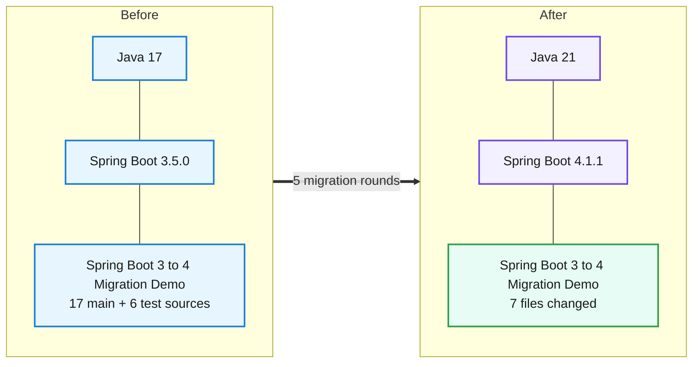
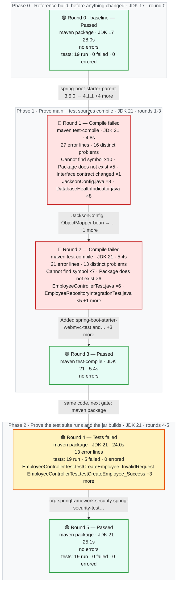
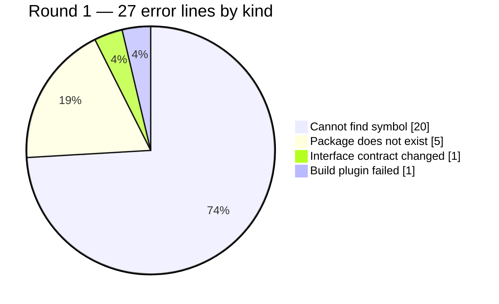

# Migration Report — Spring Boot 3.5.0 to 4.1.1 on Java 21

## Spring Boot 3 to 4 Migration Demo

     

> The Employee REST service moved from Spring Boot 3.5.0 on Java 17 to Spring Boot 4.1.1 on Java 21. The upgrade forced source changes in five files, all of them places where the application touches the framework directly rather than places where it does its own work: Jackson 2's databind package was replaced by Jackson 3, the actuator health types moved to a new package, and Boot 4's modularised test starters moved the test slice annotations. No controller, service, entity, repository or validation code changed, and the REST contract came through untouched — all four business endpoints return byte-identical responses before and after. The same 19 tests pass on both sides. Two framework-owned response envelopes did change shape: the /actuator/health document reorders its keys, and the default 401 body's timestamp switched from an offset format to a Z-suffixed one. Neither is an application change, but a client that string-matches either payload will see the difference.

_Generated by the Version Migration skill on 2026-09-08. Every version, error count and response below is read from a recorded run, not from memory._

## At a glance

| | |
|---|---|
| **Result** | 🟢 **Passed** on the final build |
| **Platform** | Spring Boot `3.5.0` → `4.1.1` |
| **Language** | Java `17` → `21` |
| **Build rounds** | 6 recorded — 1 pre-migration baseline, 3 that failed and were read for what to change next, 3 green |
| **Files changed** | 7 — `Dockerfile`, `pom.xml`, `src/main/java/com/example/migrationdemo/config/JacksonConfig.java`, `src/main/java/com/example/migrationdemo/health/DatabaseHealthIndicator.java`, `src/test/java/com/example/migrationdemo/actuator/ActuatorEndpointsTest.java`, `src/test/java/com/example/migrationdemo/controller/EmployeeControllerTest.java`, `src/test/java/com/example/migrationdemo/integration/EmployeeRepositoryIntegrationTest.java` |
| **Dependency changes** | 7 |
| **Source changes forced by the upgrade** | 6 |
| **Test suite** | before: 19 run, 0 failed, 0 errors → after: 19 run, 0 failed, 0 errors — 🟢 all green, before and after |
| **Runtime behaviour** | 🟡 same status on all 10, body differs on 5 |
| **Starting point** | build 🟢 green on JDK 17 via `package`, runtime 🟢 clean — the migration only begins from a green baseline |
| **Project state** | 🟢 Applied to the project and green there — `C:\Tools\apache-maven-3.9.16\bin\mvn.cmd -B clean package` on JDK 21, passed |
| **Reference followed** | `references/spring-boot-3-to-4.md` |
| **Build tool** | maven — Apache Maven 3.9.16 (2bdd9fddda4b155ebf8000e807eb73fd829a51d5) |

## 1. What moved



| | What | Before | After | Why it moved |
|---|---|---|---|---|
| ⬆️ | `Java (language level)` | `17` | `21` | Runtime baseline required by the new platform version. |
| ⬆️ | `Spring Boot (platform)` | `3.5.0` | `4.1.1` | The version jump this migration is about. |
| ⬆️ | `org.springframework.boot:spring-boot-starter-parent` | `3.5.0` | `4.1.1` | 1.1 — the parent manages every org.springframework.boot artifact plus Jackson, Hibernate, Micrometer and the test stack, so nothing else can move until it does; 4.1.1 is the newest GA release (4.2.0-M1 is a milestone). |
| ⬆️ | `java.version` | `17` | `21` | 1.2 / 0.3 — Java 21 is the LTS the Boot 4 generation is built and tested against; moved deliberately rather than because the compiler demanded it. |
| ⬆️ | `org.apache.maven.plugins:maven-compiler-plugin` | `source 17 / target 17` | `release 21` | 1.2 — an explicit source 17 overrides the java.version property, so the build would have silently kept compiling at 17. |
| 🔀 | `org.springframework.boot:spring-boot-starter-web` | `spring-boot-starter-web` | `spring-boot-starter-webmvc` | 1.3 — Boot 4 splits the web starter by stack and names the servlet MVC one for its stack; the old id does not resolve at 4.x. |
| ➕ | `org.springframework.boot:spring-boot-starter-webmvc-test` | `absent` | `4.1.1 (managed)` | 4.3 — Boot 4 modularises spring-boot-starter-test, and @WebMvcTest / @AutoConfigureMockMvc now ship in this per-slice module. |
| ➕ | `org.springframework.boot:spring-boot-starter-data-jpa-test` | `absent` | `4.1.1 (managed)` | 4.3 — supplies @DataJpaTest, and transitively spring-boot-jdbc-test for @AutoConfigureTestDatabase. |
| 🔀 | `org.springframework.security:spring-security-test` | `spring-security-test (raw artifact)` | `org.springframework.boot:spring-boot-starter-security-test` | 4.4 — the MockMvc security-test auto-configuration that applies the test SecurityContext now lives in Boot's own security-test starter; the raw artifact alone compiles but leaves @WithMockUser inert. |

## 2. How the migration went

**6 build rounds**, 1.5 min of build time in total. Round 0 is the pre-migration reference build on JDK 17; every later round ran on JDK 21. 3 of them came back with errors, 3 came back clean. A red round is not a setback here — it is the output the migration is driven by: each one names the exact files or tests the next change has to touch, and nothing was edited that a build had not first complained about. The migration ends on round 5, 🟢 **Passed**.



### 2.1 The round ledger

| Round | Ran on | Goal | Outcome | Errors | Took | What it told us |
|---|---|---|---|---|---|---|
| **0**<br/>_(baseline)_ | JDK 17 | `package`<br/>_the test suite runs and the jar builds_ | 🟢 Passed | — | 28.0s | **Nothing failed** — the test suite runs and the jar builds on JDK 17.<br/>The reference every later round is measured against, recorded on the untouched project on JDK 17: the full 19-test suite green under Boot 3.5.0, and all ten probes answering as their contracts require — the four business endpoints, both public actuator endpoints, the 404 and 400 error paths, and both unauthenticated 401 boundaries. Recording the authentication boundary here is what later made round 4's regression legible: without a green 401-and-200 pair on the old runtime there would have been no way to tell a broken test from a test that was always broken. |
| **1** | JDK 21 | `test-compile`<br/>_main + test sources compile_ | 🔴 Compile failed | 27<br/>_16 distinct_ | 4.8s | **Cannot find symbol ×10 · Package does not exist ×5 · Interface contract changed ×1**<br/>in `JacksonConfig.java` (8 problems) · `DatabaseHealthIndicator.java` (8 problems)<br/>The parent bump resolved cleanly — no dependency-resolution failure appeared, which confirms spring-boot-starter-webmvc is the correct 4.x coordinate and that the rename was applied before the build could complain about it. What broke instead was relocation, and it broke in exactly two files: JacksonConfig and DatabaseHealthIndicator, the only two places in the application that name a framework type Boot 4 moved. |
| **2** | JDK 21 | `test-compile`<br/>_main + test sources compile_ | 🔴 Compile failed | 21<br/>_13 distinct_ | 5.4s | **Cannot find symbol ×7 · Package does not exist ×6**<br/>in `EmployeeControllerTest.java` (6 problems) · `EmployeeRepositoryIntegrationTest.java` (5 problems) · `ActuatorEndpointsTest.java` (2 problems)<br/>Main code compiled, which proves the Jackson 3 and health-package rewrites were right, and the failure moved down a layer to the tests — the expected sequence, because test-compile only runs once compile succeeds, so the test layer's breakage was invisible until now. Every error here traces to one cause: Boot 4 modularised spring-boot-starter-test, so the slice annotations were not merely in a different package, they were not on the classpath at all. |
| **3** | JDK 21 | `test-compile`<br/>_main + test sources compile_ | 🟢 Passed | — | 5.4s | **Nothing failed** — main + test sources compile on JDK 21.<br/>Green on test-compile. Both halves of the section 4.3 fix — the two new starter modules and the repointed annotation imports — landed in the same round, so this round confirms the compile-time migration is complete rather than isolating either half. |
| **4** | JDK 21 | `package`<br/>_the test suite runs and the jar builds_ | 🟠 Tests failed | 13 | 24.0s | **5 tests failed an assertion**<br/>failing tests: `EmployeeControllerTest.testCreateEmployee_InvalidRequest` · `EmployeeControllerTest.testCreateEmployee_Success` · `EmployeeControllerTest.testGetAllEmployees_Success` +2 more<br/>The most important round of the migration, and the compiler had nothing to say about it: identical code to round 3, only the goal raised so the tests actually executed. The suite ran the same 19 tests as round 0 — no test was lost, skipped or silently dropped by the starter changes — and five of them regressed, all inside EmployeeControllerTest, all returning 401 where they expected 200, 201, 400 and 404. |
| **5** | JDK 21 | `package`<br/>_the test suite runs and the jar builds_ | 🟢 Passed | — | 25.1s | **Nothing failed** — the test suite runs and the jar builds on JDK 21.<br/>Green: 19 tests run, 0 failures, identical to round 0's count and result on the old runtime, which is the comparison the whole round sequence exists to make. Swapping the raw spring-security-test artifact for Boot's security-test starter restored the MockMvc security-test auto-configuration and with it @WithMockUser, and it did so without touching a single line of test logic or application code — confirming round 4's five failures were a wiring gap rather than a behavioural change in Spring Security 7. |

### 2.2 Exactly what failed, and why

One block per round that did not come back green: the files or the tests the build named, the message it printed against each one, and what that meant. Paths are as the compiler reported them, relative to the project root, and the line numbers are the lines it pointed at. Everything in the tables is read out of the recorded build; only the **Why it failed** paragraph is the agent's reading of it.

#### Round 1 — 🔴 Compile failed

`maven test-compile` on JDK 21 · 27 error lines · 16 distinct problems across 2 files

**Which files failed**

| File | Problems | At line(s) | What the build said about it | Why this kind of error happens |
|---|---|---|---|---|
| `src/main/java/com/example/migrationdemo/config/JacksonConfig.java` | 8 | 3–36 (8 lines) | package com.fasterxml.jackson.databind does not exist _(×2)_<br/>cannot find symbol — class ObjectMapper _(×2)_<br/>cannot find symbol — variable SerializationFeature _(×2)_<br/>package com.fasterxml.jackson.datatype.jsr310 does not exist<br/>_…and 1 more_ | A class, method or field was renamed or removed. Look for a replacement API in the reference pack. |
| `src/main/java/com/example/migrationdemo/health/DatabaseHealthIndicator.java` | 8 | 3–33 (8 lines) | cannot find symbol — variable Health _(×3)_<br/>package org.springframework.boot.actuate.health does not exist _(×2)_<br/>cannot find symbol — class HealthIndicator<br/>cannot find symbol — class Health<br/>_…and 1 more_ | A class, method or field was renamed or removed. Look for a replacement API in the reference pack. |

**Why it failed**

The parent bump resolved cleanly — no dependency-resolution failure appeared, which confirms spring-boot-starter-webmvc is the correct 4.x coordinate and that the rename was applied before the build could complain about it. What broke instead was relocation, and it broke in exactly two files: JacksonConfig and DatabaseHealthIndicator, the only two places in the application that name a framework type Boot 4 moved. Jackson 3 changed its databind package root wholesale, so every reference in the mapper bean failed at once, and the health contributor types left spring-boot-actuator for the new spring-boot-health module. The shape of this round is the most informative thing about it: no controller, service, entity, repository, DTO or validation error appeared anywhere, which ruled out any break in the MVC, JPA, Bean Validation or Spring Security surfaces and confined the whole main-code migration to configuration and actuator glue. No invalid-target-release or class-file-version error appeared either, confirming the JDK 21 toolchain was pinned correctly rather than the build quietly running on 17.

**What was changed in response** — then re-run as round 2

- JacksonConfig: ObjectMapper bean -&gt; JsonMapperBuilderCustomizer (Jackson 3 packages, DateTimeFeature, changeDefaultPropertyInclusion, JavaTimeModule dropped)
- DatabaseHealthIndicator: health imports repointed to org.springframework.boot.health.contributor

Reference rule(s) applied: `2.1` · `2.2` · `3`

_Every error line, the exact command and the full build log for this round are in **section 3, Round 1**._

#### Round 2 — 🔴 Compile failed

`maven test-compile` on JDK 21 · 21 error lines · 13 distinct problems across 3 files

**Which files failed**

| File | Problems | At line(s) | What the build said about it | Why this kind of error happens |
|---|---|---|---|---|
| `src/test/java/com/example/migrationdemo/controller/EmployeeControllerTest.java` | 6 | 8, 11, 12, 27, 34, 38 | package com.fasterxml.jackson.databind does not exist<br/>package org.springframework.boot.test.autoconfigure.web.servlet does not exist<br/>package org.springframework.boot.test.mock.mockito does not exist<br/>cannot find symbol — class WebMvcTest<br/>_…and 2 more_ | A type moved to a new package or module. Look for a relocation entry in the reference pack. |
| `src/test/java/com/example/migrationdemo/integration/EmployeeRepositoryIntegrationTest.java` | 5 | 8, 9, 33, 34 | cannot find symbol — class AutoConfigureTestDatabase _(×2)_<br/>package org.springframework.boot.test.autoconfigure.orm.jpa does not exist<br/>cannot find symbol — class DataJpaTest<br/>package AutoConfigureTestDatabase does not exist | A class, method or field was renamed or removed. Look for a replacement API in the reference pack. |
| `src/test/java/com/example/migrationdemo/actuator/ActuatorEndpointsTest.java` | 2 | 6, 19 | package org.springframework.boot.test.autoconfigure.web.servlet does not exist<br/>cannot find symbol — class AutoConfigureMockMvc | A type moved to a new package or module. Look for a relocation entry in the reference pack. |

**Why it failed**

Main code compiled, which proves the Jackson 3 and health-package rewrites were right, and the failure moved down a layer to the tests — the expected sequence, because test-compile only runs once compile succeeds, so the test layer's breakage was invisible until now. Every error here traces to one cause: Boot 4 modularised spring-boot-starter-test, so the slice annotations were not merely in a different package, they were not on the classpath at all. @WebMvcTest and @AutoConfigureMockMvc, @DataJpaTest and @AutoConfigureTestDatabase all vanished with their modules, and EmployeeControllerTest additionally lost the ObjectMapper it injects, which had gone the same way as the main-code Jackson 2 references. The reference pack's own recorded run warns that adding the starters alone fixes nothing because the annotations moved package as well as module, so both halves were applied together in the next round rather than spending a round proving that warning again.

**What was changed in response** — then re-run as round 3

- Added spring-boot-starter-webmvc-test and spring-boot-starter-data-jpa-test (test scope)
- EmployeeControllerTest: @WebMvcTest and mocking imports repointed, @MockBean -&gt; @MockitoBean, ObjectMapper -&gt; JsonMapper
- ActuatorEndpointsTest: @AutoConfigureMockMvc import repointed
- EmployeeRepositoryIntegrationTest: @DataJpaTest and @AutoConfigureTestDatabase imports repointed

Reference rule(s) applied: `4.1` · `4.2` · `4.3` · `11`

_Every error line, the exact command and the full build log for this round are in **section 3, Round 2**._

#### Round 4 — 🟠 Tests failed

`maven package` on JDK 21 · 13 error lines · 19 tests run · 5 failed · 0 errored

**Which tests failed**

| Test | Source file | Why it failed | What kind of problem | Was it already failing? |
|---|---|---|---|---|
| `EmployeeControllerTest.testCreateEmployee_InvalidRequest` | `src/test/java/com/example/migrationdemo/controller/EmployeeControllerTest.java`<br/>line 139 | Status expected:&lt;400&gt; but was:&lt;401&gt; | Test failure — The code compiled but behaviour or test wiring changed. | 🔴 no — new since the reference build |
| `EmployeeControllerTest.testCreateEmployee_Success` | `src/test/java/com/example/migrationdemo/controller/EmployeeControllerTest.java`<br/>line 121 | Status expected:&lt;201&gt; but was:&lt;401&gt; | Test failure — The code compiled but behaviour or test wiring changed. | 🔴 no — new since the reference build |
| `EmployeeControllerTest.testGetAllEmployees_Success` | `src/test/java/com/example/migrationdemo/controller/EmployeeControllerTest.java`<br/>line 44 | Status expected:&lt;200&gt; but was:&lt;401&gt; | Test failure — The code compiled but behaviour or test wiring changed. | 🔴 no — new since the reference build |
| `EmployeeControllerTest.testGetEmployeeById_NotFound` | `src/test/java/com/example/migrationdemo/controller/EmployeeControllerTest.java`<br/>line 90 | Status expected:&lt;404&gt; but was:&lt;401&gt; | Test failure — The code compiled but behaviour or test wiring changed. | 🔴 no — new since the reference build |
| `EmployeeControllerTest.testGetEmployeeById_Success` | `src/test/java/com/example/migrationdemo/controller/EmployeeControllerTest.java`<br/>line 79 | Status expected:&lt;200&gt; but was:&lt;401&gt; | Test failure — The code compiled but behaviour or test wiring changed. | 🔴 no — new since the reference build |

**Why it failed**

The most important round of the migration, and the compiler had nothing to say about it: identical code to round 3, only the goal raised so the tests actually executed. The suite ran the same 19 tests as round 0 — no test was lost, skipped or silently dropped by the starter changes — and five of them regressed, all inside EmployeeControllerTest, all returning 401 where they expected 200, 201, 400 and 404. The split within that one class is the entire diagnosis: the two tests that did not fail are the one asserting an unauthenticated request is rejected and the one sending real credentials via httpBasic, so the security filter chain was demonstrably working correctly. What was missing was only the test-side SecurityContext that @WithMockUser installs, which Boot 4 moved into its own security-test starter — the project had declared the raw spring-security-test artifact, which still resolves and still compiles and so gave no earlier warning. A migration verified only by compiling would have shipped this.

**What was changed in response** — then re-run as round 5

- org.springframework.security:spring-security-test -&gt; org.springframework.boot:spring-boot-starter-security-test

Reference rule(s) applied: `4.4`

_Every error line, the exact command and the full build log for this round are in **section 3, Round 4**._


### 2.3 The mix of breakage in the worst round

Round 1 carried more error lines than any other — 27 of them, in these proportions:



## 3. Round by round

### Round 0 — 🟢 Passed _(pre-migration reference)_

> **Nothing had been changed yet.** This is the reference every later round is read against.

| | |
|---|---|
| **Command** | `C:\Tools\apache-maven-3.9.16\bin\mvn.cmd -B clean package` |
| **JDK** | 17 (17.0.20) |
| **Declared in the build** | Java `17` · `spring-boot-starter-parent 3.5.0` |
| **Exit code** | 0 |
| **Duration** | 28.0s |
| **Workspace at this point** | no changes yet |

**What the result meant**

The reference every later round is measured against, recorded on the untouched project on JDK 17: the full 19-test suite green under Boot 3.5.0, and all ten probes answering as their contracts require — the four business endpoints, both public actuator endpoints, the 404 and 400 error paths, and both unauthenticated 401 boundaries. Recording the authentication boundary here is what later made round 4's regression legible: without a green 401-and-200 pair on the old runtime there would have been no way to tell a broken test from a test that was always broken. Docker was up, so the Testcontainers integration test ran rather than skipping on its disabledWithoutDocker precondition.

<details>
<summary>Build log tail</summary>

```text
… first 180 line(s) omitted — the complete log is at rounds/round-00.log
    values
        (?, ?, ?, ?, ?, ?, ?, ?, ?)
2026-09-08T06:37:25.408+05:30 DEBUG 11120 --- [spring-boot-migration-demo] [           main] org.hibernate.SQL                        : 
    select
        e1_0.id,
        e1_0.active,
        e1_0.created_at,
        e1_0.department,
        e1_0.email,
        e1_0.employee_number,
        e1_0.first_name,
        e1_0.last_name,
        e1_0.salary,
        e1_0.updated_at 
    from
        employees e1_0 
    where
        upper(e1_0.department)=upper(?)
Hibernate: 
    select
        e1_0.id,
        e1_0.active,
        e1_0.created_at,
        e1_0.department,
        e1_0.email,
        e1_0.employee_number,
        e1_0.first_name,
        e1_0.last_name,
        e1_0.salary,
        e1_0.updated_at 
    from
        employees e1_0 
    where
        upper(e1_0.department)=upper(?)
[INFO] Tests run: 5, Failures: 0, Errors: 0, Skipped: 0, Time elapsed: 4.141 s -- in com.example.migrationdemo.integration.EmployeeRepositoryIntegrationTest
[INFO] Running com.example.migrationdemo.mapper.EmployeeMapperTest
[INFO] Tests run: 2, Failures: 0, Errors: 0, Skipped: 0, Time elapsed: 0.003 s -- in com.example.migrationdemo.mapper.EmployeeMapperTest
[INFO] Running com.example.migrationdemo.service.EmployeeServiceTest
[INFO] Tests run: 3, Failures: 0, Errors: 0, Skipped: 0, Time elapsed: 0.328 s -- in com.example.migrationdemo.service.EmployeeServiceTest
[INFO] 
[INFO] Results:
[INFO] 
[INFO] Tests run: 19, Failures: 0, Errors: 0, Skipped: 0
[INFO] 
[INFO] 
[INFO] --- jar:3.4.2:jar (default-jar) @ spring-boot-migration-demo ---
[INFO] Building jar: .\target\spring-boot-migration-demo-1.0.0.jar
[INFO] 
[INFO] --- spring-boot:3.5.0:repackage (repackage) @ spring-boot-migration-demo ---
[INFO] Replacing main artifact .\target\spring-boot-migration-demo-1.0.0.jar with repackaged archive, adding nested dependencies in BOOT-INF/.
[INFO] The original artifact has been renamed to .\target\spring-boot-migration-demo-1.0.0.jar.original
[INFO] ------------------------------------------------------------------------
[INFO] BUILD SUCCESS
[INFO] ------------------------------------------------------------------------
[INFO] Total time:  26.299 s
[INFO] Finished at: 2026-09-08T06:37:28+05:30
[INFO] ------------------------------------------------------------------------

OpenJDK 64-Bit Server VM warning: Sharing is only supported for boot loader classes because bootstrap classpath has been appended

```

</details>

### Round 1 — 🔴 Compile failed

> **Changed before this round:** spring-boot-starter-parent 3.5.0 -&gt; 4.1.1 · java.version 17 -&gt; 21 · maven-compiler-plugin source/target 17 -&gt; release 21 · spring-boot-starter-web -&gt; spring-boot-starter-webmvc · Dockerfile base image eclipse-temurin:17-jre -&gt; 21-jre

| | |
|---|---|
| **Command** | `C:\Tools\apache-maven-3.9.16\bin\mvn.cmd -B clean test-compile` |
| **JDK** | 21 (21.0.12.1) |
| **Declared in the build** | Java `21` · `spring-boot-starter-parent 4.1.1` |
| **Exit code** | 1 |
| **Duration** | 4.8s |
| **Workspace at this point** | 2 files changed, 7 insertions(+), 8 deletions(-) |

**What the result meant**

The parent bump resolved cleanly — no dependency-resolution failure appeared, which confirms spring-boot-starter-webmvc is the correct 4.x coordinate and that the rename was applied before the build could complain about it. What broke instead was relocation, and it broke in exactly two files: JacksonConfig and DatabaseHealthIndicator, the only two places in the application that name a framework type Boot 4 moved. Jackson 3 changed its databind package root wholesale, so every reference in the mapper bean failed at once, and the health contributor types left spring-boot-actuator for the new spring-boot-health module. The shape of this round is the most informative thing about it: no controller, service, entity, repository, DTO or validation error appeared anywhere, which ruled out any break in the MVC, JPA, Bean Validation or Spring Security surfaces and confined the whole main-code migration to configuration and actuator glue. No invalid-target-release or class-file-version error appeared either, confirming the JDK 21 toolchain was pinned correctly rather than the build quietly running on 17.

**Errors by kind**

| Count | Kind | What this kind of error means |
|---|---|---|
| 20 | Cannot find symbol | A class, method or field was renamed or removed. Look for a replacement API in the reference pack. |
| 5 | Package does not exist | A type moved to a new package or module. Look for a relocation entry in the reference pack. |
| 1 | Interface contract changed | An interface gained, moved or changed a method — implement the new contract, or the type it came from has moved too. |
| 1 | Build plugin failed | A build plugin is too old for the new platform, or its configuration changed. |

**Which files, and what was wrong with each**

| File | Problems | At line(s) | Dominant kind |
|---|---|---|---|
| `src/main/java/com/example/migrationdemo/config/JacksonConfig.java` | 8 | 3–36 (8 lines) | Cannot find symbol |
| `src/main/java/com/example/migrationdemo/health/DatabaseHealthIndicator.java` | 8 | 3–33 (8 lines) | Cannot find symbol |

**Distinct messages**

```text
package com.fasterxml.jackson.databind does not exist
package com.fasterxml.jackson.datatype.jsr310 does not exist
cannot find symbol
package org.springframework.boot.actuate.health does not exist
method does not override or implement a method from a supertype
Failed to execute goal org.apache.maven.plugins:maven-compiler-plugin:3.15.0:compile (default-compile) on project spring-boot-migration-demo: Compilation failure: Compilation failure:
cannot find symbol — class ObjectMapper
cannot find symbol — class HealthIndicator
cannot find symbol — class Health
cannot find symbol — class JavaTimeModule
cannot find symbol — variable SerializationFeature
cannot find symbol — variable Health
```

<details>
<summary>Every error line recorded in this round (27)</summary>

| # | File | Line | Kind | Message |
|---|---|---|---|---|
| 1 | `src/main/java/com/example/migrationdemo/config/JacksonConfig.java` | 3 | Package does not exist | package com.fasterxml.jackson.databind does not exist |
| 2 | `src/main/java/com/example/migrationdemo/config/JacksonConfig.java` | 4 | Package does not exist | package com.fasterxml.jackson.databind does not exist |
| 3 | `src/main/java/com/example/migrationdemo/config/JacksonConfig.java` | 5 | Package does not exist | package com.fasterxml.jackson.datatype.jsr310 does not exist |
| 4 | `src/main/java/com/example/migrationdemo/config/JacksonConfig.java` | 22 | Cannot find symbol | cannot find symbol |
| 5 | `src/main/java/com/example/migrationdemo/health/DatabaseHealthIndicator.java` | 3 | Package does not exist | package org.springframework.boot.actuate.health does not exist |
| 6 | `src/main/java/com/example/migrationdemo/health/DatabaseHealthIndicator.java` | 4 | Package does not exist | package org.springframework.boot.actuate.health does not exist |
| 7 | `src/main/java/com/example/migrationdemo/health/DatabaseHealthIndicator.java` | 10 | Cannot find symbol | cannot find symbol |
| 8 | `src/main/java/com/example/migrationdemo/health/DatabaseHealthIndicator.java` | 19 | Cannot find symbol | cannot find symbol |
| 9 | `src/main/java/com/example/migrationdemo/config/JacksonConfig.java` | 23 | Cannot find symbol | cannot find symbol |
| 10 | `src/main/java/com/example/migrationdemo/config/JacksonConfig.java` | 26 | Cannot find symbol | cannot find symbol |
| 11 | `src/main/java/com/example/migrationdemo/config/JacksonConfig.java` | 29 | Cannot find symbol | cannot find symbol |
| 12 | `src/main/java/com/example/migrationdemo/config/JacksonConfig.java` | 36 | Cannot find symbol | cannot find symbol |
| 13 | `src/main/java/com/example/migrationdemo/health/DatabaseHealthIndicator.java` | 18 | Interface contract changed | method does not override or implement a method from a supertype |
| 14 | `src/main/java/com/example/migrationdemo/health/DatabaseHealthIndicator.java` | 22 | Cannot find symbol | cannot find symbol |
| 15 | `src/main/java/com/example/migrationdemo/health/DatabaseHealthIndicator.java` | 28 | Cannot find symbol | cannot find symbol |
| 16 | `src/main/java/com/example/migrationdemo/health/DatabaseHealthIndicator.java` | 33 | Cannot find symbol | cannot find symbol |
| 17 | _build_ | — | Build plugin failed | Failed to execute goal org.apache.maven.plugins:maven-compiler-plugin:3.15.0:compile (default-compile) on project spring-boot-migration-demo: Compilation failure: Compilation failure: |
| 18 | `src/main/java/com/example/migrationdemo/config/JacksonConfig.java` | 22 | Cannot find symbol | cannot find symbol — class ObjectMapper |
| 19 | `src/main/java/com/example/migrationdemo/health/DatabaseHealthIndicator.java` | 10 | Cannot find symbol | cannot find symbol — class HealthIndicator |
| 20 | `src/main/java/com/example/migrationdemo/health/DatabaseHealthIndicator.java` | 19 | Cannot find symbol | cannot find symbol — class Health |
| 21 | `src/main/java/com/example/migrationdemo/config/JacksonConfig.java` | 23 | Cannot find symbol | cannot find symbol — class ObjectMapper |
| 22 | `src/main/java/com/example/migrationdemo/config/JacksonConfig.java` | 26 | Cannot find symbol | cannot find symbol — class JavaTimeModule |
| 23 | `src/main/java/com/example/migrationdemo/config/JacksonConfig.java` | 29 | Cannot find symbol | cannot find symbol — variable SerializationFeature |
| 24 | `src/main/java/com/example/migrationdemo/config/JacksonConfig.java` | 36 | Cannot find symbol | cannot find symbol — variable SerializationFeature |
| 25 | `src/main/java/com/example/migrationdemo/health/DatabaseHealthIndicator.java` | 22 | Cannot find symbol | cannot find symbol — variable Health |
| 26 | `src/main/java/com/example/migrationdemo/health/DatabaseHealthIndicator.java` | 28 | Cannot find symbol | cannot find symbol — variable Health |
| 27 | `src/main/java/com/example/migrationdemo/health/DatabaseHealthIndicator.java` | 33 | Cannot find symbol | cannot find symbol — variable Health |

</details>

**Reference rules applied:** `1.1` · `1.2` · `1.3` · `8`

<details>
<summary>Build log tail</summary>

```text
… first 44 line(s) omitted — the complete log is at rounds/round-01.log
  location: class com.example.migrationdemo.health.DatabaseHealthIndicator
[ERROR] ./src/main/java/com/example/migrationdemo/health/DatabaseHealthIndicator.java:[33,16] cannot find symbol
  symbol:   variable Health
  location: class com.example.migrationdemo.health.DatabaseHealthIndicator
[INFO] 17 errors 
[INFO] -------------------------------------------------------------
[INFO] ------------------------------------------------------------------------
[INFO] BUILD FAILURE
[INFO] ------------------------------------------------------------------------
[INFO] Total time:  3.047 s
[INFO] Finished at: 2026-09-08T06:38:47+05:30
[INFO] ------------------------------------------------------------------------
[ERROR] Failed to execute goal org.apache.maven.plugins:maven-compiler-plugin:3.15.0:compile (default-compile) on project spring-boot-migration-demo: Compilation failure: Compilation failure: 
[ERROR] ./src/main/java/com/example/migrationdemo/config/JacksonConfig.java:[3,38] package com.fasterxml.jackson.databind does not exist
[ERROR] ./src/main/java/com/example/migrationdemo/config/JacksonConfig.java:[4,38] package com.fasterxml.jackson.databind does not exist
[ERROR] ./src/main/java/com/example/migrationdemo/config/JacksonConfig.java:[5,45] package com.fasterxml.jackson.datatype.jsr310 does not exist
[ERROR] ./src/main/java/com/example/migrationdemo/config/JacksonConfig.java:[22,12] cannot find symbol
[ERROR]   symbol:   class ObjectMapper
[ERROR]   location: class com.example.migrationdemo.config.JacksonConfig
[ERROR] ./src/main/java/com/example/migrationdemo/health/DatabaseHealthIndicator.java:[3,47] package org.springframework.boot.actuate.health does not exist
[ERROR] ./src/main/java/com/example/migrationdemo/health/DatabaseHealthIndicator.java:[4,47] package org.springframework.boot.actuate.health does not exist
[ERROR] ./src/main/java/com/example/migrationdemo/health/DatabaseHealthIndicator.java:[10,49] cannot find symbol
[ERROR]   symbol: class HealthIndicator
[ERROR] ./src/main/java/com/example/migrationdemo/health/DatabaseHealthIndicator.java:[19,12] cannot find symbol
[ERROR]   symbol:   class Health
[ERROR]   location: class com.example.migrationdemo.health.DatabaseHealthIndicator
[ERROR] ./src/main/java/com/example/migrationdemo/config/JacksonConfig.java:[23,9] cannot find symbol
[ERROR]   symbol:   class ObjectMapper
[ERROR]   location: class com.example.migrationdemo.config.JacksonConfig
[ERROR] ./src/main/java/com/example/migrationdemo/config/JacksonConfig.java:[23,35] cannot find symbol
[ERROR]   symbol:   class ObjectMapper
[ERROR]   location: class com.example.migrationdemo.config.JacksonConfig
[ERROR] ./src/main/java/com/example/migrationdemo/config/JacksonConfig.java:[26,35] cannot find symbol
[ERROR]   symbol:   class JavaTimeModule
[ERROR]   location: class com.example.migrationdemo.config.JacksonConfig
[ERROR] ./src/main/java/com/example/migrationdemo/config/JacksonConfig.java:[29,24] cannot find symbol
[ERROR]   symbol:   variable SerializationFeature
[ERROR]   location: class com.example.migrationdemo.config.JacksonConfig
[ERROR] ./src/main/java/com/example/migrationdemo/config/JacksonConfig.java:[36,24] cannot find symbol
[ERROR]   symbol:   variable SerializationFeature
[ERROR]   location: class com.example.migrationdemo.config.JacksonConfig
[ERROR] ./src/main/java/com/example/migrationdemo/health/DatabaseHealthIndicator.java:[18,5] method does not override or implement a method from a supertype
[ERROR] ./src/main/java/com/example/migrationdemo/health/DatabaseHealthIndicator.java:[22,24] cannot find symbol
[ERROR]   symbol:   variable Health
[ERROR]   location: class com.example.migrationdemo.health.DatabaseHealthIndicator
[ERROR] ./src/main/java/com/example/migrationdemo/health/DatabaseHealthIndicator.java:[28,20] cannot find symbol
[ERROR]   symbol:   variable Health
[ERROR]   location: class com.example.migrationdemo.health.DatabaseHealthIndicator
[ERROR] ./src/main/java/com/example/migrationdemo/health/DatabaseHealthIndicator.java:[33,16] cannot find symbol
[ERROR]   symbol:   variable Health
[ERROR]   location: class com.example.migrationdemo.health.DatabaseHealthIndicator
[ERROR] -> [Help 1]
[ERROR] 
[ERROR] To see the full stack trace of the errors, re-run Maven with the -e switch.
[ERROR] Re-run Maven using the -X switch to enable full debug logging.
[ERROR] 
[ERROR] For more information about the errors and possible solutions, please read the following articles:
[ERROR] [Help 1] http://cwiki.apache.org/confluence/display/MAVEN/MojoFailureException


```

</details>

### Round 2 — 🔴 Compile failed

> **Changed before this round:** JacksonConfig: ObjectMapper bean -&gt; JsonMapperBuilderCustomizer (Jackson 3 packages, DateTimeFeature, changeDefaultPropertyInclusion, JavaTimeModule dropped) · DatabaseHealthIndicator: health imports repointed to org.springframework.boot.health.contributor

| | |
|---|---|
| **Command** | `C:\Tools\apache-maven-3.9.16\bin\mvn.cmd -B clean test-compile` |
| **JDK** | 21 (21.0.12.1) |
| **Declared in the build** | Java `21` · `spring-boot-starter-parent 4.1.1` |
| **Exit code** | 1 |
| **Duration** | 5.4s |
| **Workspace at this point** | 4 files changed, 30 insertions(+), 35 deletions(-) |

**What the result meant**

Main code compiled, which proves the Jackson 3 and health-package rewrites were right, and the failure moved down a layer to the tests — the expected sequence, because test-compile only runs once compile succeeds, so the test layer's breakage was invisible until now. Every error here traces to one cause: Boot 4 modularised spring-boot-starter-test, so the slice annotations were not merely in a different package, they were not on the classpath at all. @WebMvcTest and @AutoConfigureMockMvc, @DataJpaTest and @AutoConfigureTestDatabase all vanished with their modules, and EmployeeControllerTest additionally lost the ObjectMapper it injects, which had gone the same way as the main-code Jackson 2 references. The reference pack's own recorded run warns that adding the starters alone fixes nothing because the annotations moved package as well as module, so both halves were applied together in the next round rather than spending a round proving that warning again.

**Errors by kind**

| Count | Kind | What this kind of error means |
|---|---|---|
| 14 | Cannot find symbol | A class, method or field was renamed or removed. Look for a replacement API in the reference pack. |
| 6 | Package does not exist | A type moved to a new package or module. Look for a relocation entry in the reference pack. |
| 1 | Build plugin failed | A build plugin is too old for the new platform, or its configuration changed. |

**Which files, and what was wrong with each**

| File | Problems | At line(s) | Dominant kind |
|---|---|---|---|
| `src/test/java/com/example/migrationdemo/controller/EmployeeControllerTest.java` | 6 | 8, 11, 12, 27, 34, 38 | Package does not exist |
| `src/test/java/com/example/migrationdemo/integration/EmployeeRepositoryIntegrationTest.java` | 5 | 8, 9, 33, 34 | Cannot find symbol |
| `src/test/java/com/example/migrationdemo/actuator/ActuatorEndpointsTest.java` | 2 | 6, 19 | Package does not exist |

**Distinct messages**

```text
package org.springframework.boot.test.autoconfigure.web.servlet does not exist
cannot find symbol
package com.fasterxml.jackson.databind does not exist
package org.springframework.boot.test.mock.mockito does not exist
package org.springframework.boot.test.autoconfigure.orm.jpa does not exist
package AutoConfigureTestDatabase does not exist
Failed to execute goal org.apache.maven.plugins:maven-compiler-plugin:3.15.0:testCompile (default-testCompile) on project spring-boot-migration-demo: Compilation failure: Compilation failure:
cannot find symbol — class AutoConfigureMockMvc
cannot find symbol — class WebMvcTest
cannot find symbol — class ObjectMapper
cannot find symbol — class AutoConfigureTestDatabase
cannot find symbol — class DataJpaTest
cannot find symbol — class MockBean
```

<details>
<summary>Every error line recorded in this round (21)</summary>

| # | File | Line | Kind | Message |
|---|---|---|---|---|
| 1 | `src/test/java/com/example/migrationdemo/actuator/ActuatorEndpointsTest.java` | 6 | Package does not exist | package org.springframework.boot.test.autoconfigure.web.servlet does not exist |
| 2 | `src/test/java/com/example/migrationdemo/actuator/ActuatorEndpointsTest.java` | 19 | Cannot find symbol | cannot find symbol |
| 3 | `src/test/java/com/example/migrationdemo/controller/EmployeeControllerTest.java` | 8 | Package does not exist | package com.fasterxml.jackson.databind does not exist |
| 4 | `src/test/java/com/example/migrationdemo/controller/EmployeeControllerTest.java` | 11 | Package does not exist | package org.springframework.boot.test.autoconfigure.web.servlet does not exist |
| 5 | `src/test/java/com/example/migrationdemo/controller/EmployeeControllerTest.java` | 12 | Package does not exist | package org.springframework.boot.test.mock.mockito does not exist |
| 6 | `src/test/java/com/example/migrationdemo/controller/EmployeeControllerTest.java` | 27 | Cannot find symbol | cannot find symbol |
| 7 | `src/test/java/com/example/migrationdemo/controller/EmployeeControllerTest.java` | 38 | Cannot find symbol | cannot find symbol |
| 8 | `src/test/java/com/example/migrationdemo/integration/EmployeeRepositoryIntegrationTest.java` | 8 | Cannot find symbol | cannot find symbol |
| 9 | `src/test/java/com/example/migrationdemo/integration/EmployeeRepositoryIntegrationTest.java` | 9 | Package does not exist | package org.springframework.boot.test.autoconfigure.orm.jpa does not exist |
| 10 | `src/test/java/com/example/migrationdemo/integration/EmployeeRepositoryIntegrationTest.java` | 33 | Cannot find symbol | cannot find symbol |
| 11 | `src/test/java/com/example/migrationdemo/integration/EmployeeRepositoryIntegrationTest.java` | 34 | Cannot find symbol | cannot find symbol |
| 12 | `src/test/java/com/example/migrationdemo/controller/EmployeeControllerTest.java` | 34 | Cannot find symbol | cannot find symbol |
| 13 | `src/test/java/com/example/migrationdemo/integration/EmployeeRepositoryIntegrationTest.java` | 34 | Package does not exist | package AutoConfigureTestDatabase does not exist |
| 14 | _build_ | — | Build plugin failed | Failed to execute goal org.apache.maven.plugins:maven-compiler-plugin:3.15.0:testCompile (default-testCompile) on project spring-boot-migration-demo: Compilation failure: Compilation failure: |
| 15 | `src/test/java/com/example/migrationdemo/actuator/ActuatorEndpointsTest.java` | 19 | Cannot find symbol | cannot find symbol — class AutoConfigureMockMvc |
| 16 | `src/test/java/com/example/migrationdemo/controller/EmployeeControllerTest.java` | 27 | Cannot find symbol | cannot find symbol — class WebMvcTest |
| 17 | `src/test/java/com/example/migrationdemo/controller/EmployeeControllerTest.java` | 38 | Cannot find symbol | cannot find symbol — class ObjectMapper |
| 18 | `src/test/java/com/example/migrationdemo/integration/EmployeeRepositoryIntegrationTest.java` | 8 | Cannot find symbol | cannot find symbol — class AutoConfigureTestDatabase |
| 19 | `src/test/java/com/example/migrationdemo/integration/EmployeeRepositoryIntegrationTest.java` | 33 | Cannot find symbol | cannot find symbol — class DataJpaTest |
| 20 | `src/test/java/com/example/migrationdemo/integration/EmployeeRepositoryIntegrationTest.java` | 34 | Cannot find symbol | cannot find symbol — class AutoConfigureTestDatabase |
| 21 | `src/test/java/com/example/migrationdemo/controller/EmployeeControllerTest.java` | 34 | Cannot find symbol | cannot find symbol — class MockBean |

</details>

**Reference rules applied:** `2.1` · `2.2` · `3`

<details>
<summary>Build log tail</summary>

```text
… first 31 line(s) omitted — the complete log is at rounds/round-02.log
[ERROR] ./src/test/java/com/example/migrationdemo/controller/EmployeeControllerTest.java:[11,63] package org.springframework.boot.test.autoconfigure.web.servlet does not exist
[ERROR] ./src/test/java/com/example/migrationdemo/controller/EmployeeControllerTest.java:[12,50] package org.springframework.boot.test.mock.mockito does not exist
[ERROR] ./src/test/java/com/example/migrationdemo/controller/EmployeeControllerTest.java:[27,2] cannot find symbol
  symbol: class WebMvcTest
[ERROR] ./src/test/java/com/example/migrationdemo/controller/EmployeeControllerTest.java:[38,13] cannot find symbol
  symbol:   class ObjectMapper
  location: class com.example.migrationdemo.controller.EmployeeControllerTest
[ERROR] ./src/test/java/com/example/migrationdemo/integration/EmployeeRepositoryIntegrationTest.java:[8,56] cannot find symbol
  symbol:   class AutoConfigureTestDatabase
  location: package org.springframework.boot.test.autoconfigure.jdbc
[ERROR] ./src/test/java/com/example/migrationdemo/integration/EmployeeRepositoryIntegrationTest.java:[9,59] package org.springframework.boot.test.autoconfigure.orm.jpa does not exist
[ERROR] ./src/test/java/com/example/migrationdemo/integration/EmployeeRepositoryIntegrationTest.java:[33,2] cannot find symbol
  symbol: class DataJpaTest
[ERROR] ./src/test/java/com/example/migrationdemo/integration/EmployeeRepositoryIntegrationTest.java:[34,2] cannot find symbol
  symbol: class AutoConfigureTestDatabase
[ERROR] ./src/test/java/com/example/migrationdemo/controller/EmployeeControllerTest.java:[34,6] cannot find symbol
  symbol:   class MockBean
  location: class com.example.migrationdemo.controller.EmployeeControllerTest
[ERROR] ./src/test/java/com/example/migrationdemo/integration/EmployeeRepositoryIntegrationTest.java:[34,63] package AutoConfigureTestDatabase does not exist
[INFO] 13 errors 
[INFO] -------------------------------------------------------------
[INFO] ------------------------------------------------------------------------
[INFO] BUILD FAILURE
[INFO] ------------------------------------------------------------------------
[INFO] Total time:  3.703 s
[INFO] Finished at: 2026-09-08T06:40:57+05:30
[INFO] ------------------------------------------------------------------------
[ERROR] Failed to execute goal org.apache.maven.plugins:maven-compiler-plugin:3.15.0:testCompile (default-testCompile) on project spring-boot-migration-demo: Compilation failure: Compilation failure: 
[ERROR] ./src/test/java/com/example/migrationdemo/actuator/ActuatorEndpointsTest.java:[6,63] package org.springframework.boot.test.autoconfigure.web.servlet does not exist
[ERROR] ./src/test/java/com/example/migrationdemo/actuator/ActuatorEndpointsTest.java:[19,2] cannot find symbol
[ERROR]   symbol: class AutoConfigureMockMvc
[ERROR] ./src/test/java/com/example/migrationdemo/controller/EmployeeControllerTest.java:[8,38] package com.fasterxml.jackson.databind does not exist
[ERROR] ./src/test/java/com/example/migrationdemo/controller/EmployeeControllerTest.java:[11,63] package org.springframework.boot.test.autoconfigure.web.servlet does not exist
[ERROR] ./src/test/java/com/example/migrationdemo/controller/EmployeeControllerTest.java:[12,50] package org.springframework.boot.test.mock.mockito does not exist
[ERROR] ./src/test/java/com/example/migrationdemo/controller/EmployeeControllerTest.java:[27,2] cannot find symbol
[ERROR]   symbol: class WebMvcTest
[ERROR] ./src/test/java/com/example/migrationdemo/controller/EmployeeControllerTest.java:[38,13] cannot find symbol
[ERROR]   symbol:   class ObjectMapper
[ERROR]   location: class com.example.migrationdemo.controller.EmployeeControllerTest
[ERROR] ./src/test/java/com/example/migrationdemo/integration/EmployeeRepositoryIntegrationTest.java:[8,56] cannot find symbol
[ERROR]   symbol:   class AutoConfigureTestDatabase
[ERROR]   location: package org.springframework.boot.test.autoconfigure.jdbc
[ERROR] ./src/test/java/com/example/migrationdemo/integration/EmployeeRepositoryIntegrationTest.java:[9,59] package org.springframework.boot.test.autoconfigure.orm.jpa does not exist
[ERROR] ./src/test/java/com/example/migrationdemo/integration/EmployeeRepositoryIntegrationTest.java:[33,2] cannot find symbol
[ERROR]   symbol: class DataJpaTest
[ERROR] ./src/test/java/com/example/migrationdemo/integration/EmployeeRepositoryIntegrationTest.java:[34,2] cannot find symbol
[ERROR]   symbol: class AutoConfigureTestDatabase
[ERROR] ./src/test/java/com/example/migrationdemo/controller/EmployeeControllerTest.java:[34,6] cannot find symbol
[ERROR]   symbol:   class MockBean
[ERROR]   location: class com.example.migrationdemo.controller.EmployeeControllerTest
[ERROR] ./src/test/java/com/example/migrationdemo/integration/EmployeeRepositoryIntegrationTest.java:[34,63] package AutoConfigureTestDatabase does not exist
[ERROR] -> [Help 1]
[ERROR] 
[ERROR] To see the full stack trace of the errors, re-run Maven with the -e switch.
[ERROR] Re-run Maven using the -X switch to enable full debug logging.
[ERROR] 
[ERROR] For more information about the errors and possible solutions, please read the following articles:
[ERROR] [Help 1] http://cwiki.apache.org/confluence/display/MAVEN/MojoFailureException


```

</details>

### Round 3 — 🟢 Passed

> **Changed before this round:** Added spring-boot-starter-webmvc-test and spring-boot-starter-data-jpa-test (test scope) · EmployeeControllerTest: @WebMvcTest and mocking imports repointed, @MockBean -&gt; @MockitoBean, ObjectMapper -&gt; JsonMapper · ActuatorEndpointsTest: @AutoConfigureMockMvc import repointed · EmployeeRepositoryIntegrationTest: @DataJpaTest and @AutoConfigureTestDatabase imports repointed

| | |
|---|---|
| **Command** | `C:\Tools\apache-maven-3.9.16\bin\mvn.cmd -B clean test-compile` |
| **JDK** | 21 (21.0.12.1) |
| **Declared in the build** | Java `21` · `spring-boot-starter-parent 4.1.1` |
| **Exit code** | 0 |
| **Duration** | 5.4s |
| **Workspace at this point** | 7 files changed, 53 insertions(+), 45 deletions(-) |

**What the result meant**

Green on test-compile. Both halves of the section 4.3 fix — the two new starter modules and the repointed annotation imports — landed in the same round, so this round confirms the compile-time migration is complete rather than isolating either half. One coordinate had to be resolved rather than read from the pack: @AutoConfigureTestDatabase now lives in org.springframework.boot.jdbc.test.autoconfigure, shipped in spring-boot-jdbc-test, which the data-jpa-test starter pulls in transitively; the pack's section 4.3 table does not list it, so it was confirmed against the jar and the dependency tree per section 11. A green compile at this point proves nothing about behaviour, which is why the goal was raised next instead of stopping here.

**Reference rules applied:** `4.1` · `4.2` · `4.3` · `11`

<details>
<summary>Build log tail</summary>

```text
[INFO] Scanning for projects...
[INFO] 
[INFO] ---------------< com.example:spring-boot-migration-demo >---------------
[INFO] Building Spring Boot 3 to 4 Migration Demo 1.0.0
[INFO]   from pom.xml
[INFO] --------------------------------[ jar ]---------------------------------
[INFO] 
[INFO] --- clean:3.5.0:clean (default-clean) @ spring-boot-migration-demo ---
[INFO] Deleting .\target
[INFO] 
[INFO] --- resources:3.5.0:resources (default-resources) @ spring-boot-migration-demo ---
[INFO] Copying 1 resource from src\main\resources to target\classes
[INFO] Copying 0 resource from src\main\resources to target\classes
[INFO] 
[INFO] --- compiler:3.15.0:compile (default-compile) @ spring-boot-migration-demo ---
[INFO] Recompiling the module because of changed source code.
[INFO] Compiling 17 source files with javac [debug parameters release 21] to target\classes
[INFO] 
[INFO] --- resources:3.5.0:testResources (default-testResources) @ spring-boot-migration-demo ---
[INFO] Copying 1 resource from src\test\resources to target\test-classes
[INFO] 
[INFO] --- compiler:3.15.0:testCompile (default-testCompile) @ spring-boot-migration-demo ---
[INFO] Recompiling the module because of changed dependency.
[INFO] Compiling 6 source files with javac [debug parameters release 21] to target\test-classes
[INFO] ------------------------------------------------------------------------
[INFO] BUILD SUCCESS
[INFO] ------------------------------------------------------------------------
[INFO] Total time:  3.601 s
[INFO] Finished at: 2026-09-08T06:43:22+05:30
[INFO] ------------------------------------------------------------------------


```

</details>

### Round 4 — 🟠 Tests failed

> **Changed before this round:** goal raised to package so the tests run

| | |
|---|---|
| **Command** | `C:\Tools\apache-maven-3.9.16\bin\mvn.cmd -B clean package` |
| **JDK** | 21 (21.0.12.1) |
| **Declared in the build** | Java `21` · `spring-boot-starter-parent 4.1.1` |
| **Exit code** | 1 |
| **Duration** | 24.0s |
| **Workspace at this point** | 7 files changed, 53 insertions(+), 45 deletions(-) |

**What the result meant**

The most important round of the migration, and the compiler had nothing to say about it: identical code to round 3, only the goal raised so the tests actually executed. The suite ran the same 19 tests as round 0 — no test was lost, skipped or silently dropped by the starter changes — and five of them regressed, all inside EmployeeControllerTest, all returning 401 where they expected 200, 201, 400 and 404. The split within that one class is the entire diagnosis: the two tests that did not fail are the one asserting an unauthenticated request is rejected and the one sending real credentials via httpBasic, so the security filter chain was demonstrably working correctly. What was missing was only the test-side SecurityContext that @WithMockUser installs, which Boot 4 moved into its own security-test starter — the project had declared the raw spring-security-test artifact, which still resolves and still compiles and so gave no earlier warning. A migration verified only by compiling would have shipped this.

**Errors by kind**

| Count | Kind | What this kind of error means |
|---|---|---|
| 12 | Test failure | The code compiled but behaviour or test wiring changed. |
| 1 | Build plugin failed | A build plugin is too old for the new platform, or its configuration changed. |

**Which tests failed**

| Test | Source file | Line | Why it failed |
|---|---|---|---|
| `EmployeeControllerTest.testCreateEmployee_InvalidRequest` | `src/test/java/com/example/migrationdemo/controller/EmployeeControllerTest.java` | 139 | Status expected:&lt;400&gt; but was:&lt;401&gt; |
| `EmployeeControllerTest.testCreateEmployee_Success` | `src/test/java/com/example/migrationdemo/controller/EmployeeControllerTest.java` | 121 | Status expected:&lt;201&gt; but was:&lt;401&gt; |
| `EmployeeControllerTest.testGetAllEmployees_Success` | `src/test/java/com/example/migrationdemo/controller/EmployeeControllerTest.java` | 44 | Status expected:&lt;200&gt; but was:&lt;401&gt; |
| `EmployeeControllerTest.testGetEmployeeById_NotFound` | `src/test/java/com/example/migrationdemo/controller/EmployeeControllerTest.java` | 90 | Status expected:&lt;404&gt; but was:&lt;401&gt; |
| `EmployeeControllerTest.testGetEmployeeById_Success` | `src/test/java/com/example/migrationdemo/controller/EmployeeControllerTest.java` | 79 | Status expected:&lt;200&gt; but was:&lt;401&gt; |

**Distinct messages**

```text
Tests run: 7, Failures: 5, Errors: 0, Skipped: 0, Time elapsed: 1.420 s <<< FAILURE! -- in com.example.migrationdemo.controller.EmployeeControllerTest
com.example.migrationdemo.controller.EmployeeControllerTest.testGetEmployeeById_Success -- Time elapsed: 0.164 s <<< FAILURE!
com.example.migrationdemo.controller.EmployeeControllerTest.testGetAllEmployees_Success -- Time elapsed: 0.014 s <<< FAILURE!
com.example.migrationdemo.controller.EmployeeControllerTest.testCreateEmployee_InvalidRequest -- Time elapsed: 0.023 s <<< FAILURE!
com.example.migrationdemo.controller.EmployeeControllerTest.testGetEmployeeById_NotFound -- Time elapsed: 0.021 s <<< FAILURE!
com.example.migrationdemo.controller.EmployeeControllerTest.testCreateEmployee_Success -- Time elapsed: 0.017 s <<< FAILURE!
EmployeeControllerTest.testCreateEmployee_InvalidRequest:139 Status expected:<400> but was:<401>
EmployeeControllerTest.testCreateEmployee_Success:121 Status expected:<201> but was:<401>
EmployeeControllerTest.testGetAllEmployees_Success:44 Status expected:<200> but was:<401>
EmployeeControllerTest.testGetEmployeeById_NotFound:90 Status expected:<404> but was:<401>
EmployeeControllerTest.testGetEmployeeById_Success:79 Status expected:<200> but was:<401>
Tests run: 19, Failures: 5, Errors: 0, Skipped: 0
Failed to execute goal org.apache.maven.plugins:maven-surefire-plugin:3.5.6:test (default-test) on project spring-boot-migration-demo: There are test failures.
```

<details>
<summary>Every error line recorded in this round (13)</summary>

| # | File | Line | Kind | Message |
|---|---|---|---|---|
| 1 | _build_ | — | Test failure | Tests run: 7, Failures: 5, Errors: 0, Skipped: 0, Time elapsed: 1.420 s &lt;&lt;&lt; FAILURE! -- in com.example.migrationdemo.controller.EmployeeControllerTest |
| 2 | _build_ | — | Test failure | com.example.migrationdemo.controller.EmployeeControllerTest.testGetEmployeeById_Success -- Time elapsed: 0.164 s &lt;&lt;&lt; FAILURE! |
| 3 | _build_ | — | Test failure | com.example.migrationdemo.controller.EmployeeControllerTest.testGetAllEmployees_Success -- Time elapsed: 0.014 s &lt;&lt;&lt; FAILURE! |
| 4 | _build_ | — | Test failure | com.example.migrationdemo.controller.EmployeeControllerTest.testCreateEmployee_InvalidRequest -- Time elapsed: 0.023 s &lt;&lt;&lt; FAILURE! |
| 5 | _build_ | — | Test failure | com.example.migrationdemo.controller.EmployeeControllerTest.testGetEmployeeById_NotFound -- Time elapsed: 0.021 s &lt;&lt;&lt; FAILURE! |
| 6 | _build_ | — | Test failure | com.example.migrationdemo.controller.EmployeeControllerTest.testCreateEmployee_Success -- Time elapsed: 0.017 s &lt;&lt;&lt; FAILURE! |
| 7 | _build_ | — | Test failure | EmployeeControllerTest.testCreateEmployee_InvalidRequest:139 Status expected:&lt;400&gt; but was:&lt;401&gt; |
| 8 | _build_ | — | Test failure | EmployeeControllerTest.testCreateEmployee_Success:121 Status expected:&lt;201&gt; but was:&lt;401&gt; |
| 9 | _build_ | — | Test failure | EmployeeControllerTest.testGetAllEmployees_Success:44 Status expected:&lt;200&gt; but was:&lt;401&gt; |
| 10 | _build_ | — | Test failure | EmployeeControllerTest.testGetEmployeeById_NotFound:90 Status expected:&lt;404&gt; but was:&lt;401&gt; |
| 11 | _build_ | — | Test failure | EmployeeControllerTest.testGetEmployeeById_Success:79 Status expected:&lt;200&gt; but was:&lt;401&gt; |
| 12 | _build_ | — | Test failure | Tests run: 19, Failures: 5, Errors: 0, Skipped: 0 |
| 13 | _build_ | — | Build plugin failed | Failed to execute goal org.apache.maven.plugins:maven-surefire-plugin:3.5.6:test (default-test) on project spring-boot-migration-demo: There are test failures. |

</details>

**Reference rules applied:** `4.4`

<details>
<summary>Build log tail</summary>

```text
… first 132 line(s) omitted — the complete log is at rounds/round-04.log
        upper(e1_0.department)=upper(?)
Hibernate: 
    select
        e1_0.id,
        e1_0.active,
        e1_0.created_at,
        e1_0.department,
        e1_0.email,
        e1_0.employee_number,
        e1_0.first_name,
        e1_0.last_name,
        e1_0.salary,
        e1_0.updated_at 
    from
        employees e1_0 
    where
        upper(e1_0.department)=upper(?)
2026-09-08T06:43:53.059+05:30  WARN 29272 --- [spring-boot-migration-demo] [           main] o.j.j.e.d.AbstractExtensionContext       : Type implements CloseableResource but not AutoCloseable: org.testcontainers.junit.jupiter.TestcontainersExtension$StoreAdapter
[INFO] Tests run: 5, Failures: 0, Errors: 0, Skipped: 0, Time elapsed: 4.221 s -- in com.example.migrationdemo.integration.EmployeeRepositoryIntegrationTest
[INFO] Running com.example.migrationdemo.mapper.EmployeeMapperTest
[INFO] Tests run: 2, Failures: 0, Errors: 0, Skipped: 0, Time elapsed: 0.006 s -- in com.example.migrationdemo.mapper.EmployeeMapperTest
[INFO] Running com.example.migrationdemo.service.EmployeeServiceTest
[INFO] Tests run: 3, Failures: 0, Errors: 0, Skipped: 0, Time elapsed: 0.233 s -- in com.example.migrationdemo.service.EmployeeServiceTest
[INFO] 
[INFO] Results:
[INFO] 
[ERROR] Failures: 
[ERROR]   EmployeeControllerTest.testCreateEmployee_InvalidRequest:139 Status expected:<400> but was:<401>
[ERROR]   EmployeeControllerTest.testCreateEmployee_Success:121 Status expected:<201> but was:<401>
[ERROR]   EmployeeControllerTest.testGetAllEmployees_Success:44 Status expected:<200> but was:<401>
[ERROR]   EmployeeControllerTest.testGetEmployeeById_NotFound:90 Status expected:<404> but was:<401>
[ERROR]   EmployeeControllerTest.testGetEmployeeById_Success:79 Status expected:<200> but was:<401>
[INFO] 
[ERROR] Tests run: 19, Failures: 5, Errors: 0, Skipped: 0
[INFO] 
[INFO] ------------------------------------------------------------------------
[INFO] BUILD FAILURE
[INFO] ------------------------------------------------------------------------
[INFO] Total time:  22.343 s
[INFO] Finished at: 2026-09-08T06:43:54+05:30
[INFO] ------------------------------------------------------------------------
[ERROR] Failed to execute goal org.apache.maven.plugins:maven-surefire-plugin:3.5.6:test (default-test) on project spring-boot-migration-demo: There are test failures.
[ERROR] 
[ERROR] See .\target\surefire-reports for the individual test results.
[ERROR] See dump files (if any exist) [date].dump, [date]-jvmRun[N].dump and [date].dumpstream.
[ERROR] -> [Help 1]
[ERROR] 
[ERROR] To see the full stack trace of the errors, re-run Maven with the -e switch.
[ERROR] Re-run Maven using the -X switch to enable full debug logging.
[ERROR] 
[ERROR] For more information about the errors and possible solutions, please read the following articles:
[ERROR] [Help 1] http://cwiki.apache.org/confluence/display/MAVEN/MojoFailureException

Mockito is currently self-attaching to enable the inline-mock-maker. This will no longer work in future releases of the JDK. Please add Mockito as an agent to your build as described in Mockito's documentation: https://javadoc.io/doc/org.mockito/mockito-core/latest/org.mockito/org/mockito/Mockito.html#0.3
OpenJDK 64-Bit Server VM warning: Sharing is only supported for boot loader classes because bootstrap classpath has been appended
WARNING: A Java agent has been loaded dynamically (C:\Users\USER\.m2\repository\net\bytebuddy\byte-buddy-agent\1.18.11\byte-buddy-agent-1.18.11.jar)
WARNING: If a serviceability tool is in use, please run with -XX:+EnableDynamicAgentLoading to hide this warning
WARNING: If a serviceability tool is not in use, please run with -Djdk.instrument.traceUsage for more information
WARNING: Dynamic loading of agents will be disallowed by default in a future release

```

</details>

### Round 5 — 🟢 Passed

> **Changed before this round:** org.springframework.security:spring-security-test -&gt; org.springframework.boot:spring-boot-starter-security-test

| | |
|---|---|
| **Command** | `C:\Tools\apache-maven-3.9.16\bin\mvn.cmd -B clean package` |
| **JDK** | 21 (21.0.12.1) |
| **Declared in the build** | Java `21` · `spring-boot-starter-parent 4.1.1` |
| **Exit code** | 0 |
| **Duration** | 25.1s |
| **Workspace at this point** | 7 files changed, 55 insertions(+), 47 deletions(-) |

**What the result meant**

Green: 19 tests run, 0 failures, identical to round 0's count and result on the old runtime, which is the comparison the whole round sequence exists to make. Swapping the raw spring-security-test artifact for Boot's security-test starter restored the MockMvc security-test auto-configuration and with it @WithMockUser, and it did so without touching a single line of test logic or application code — confirming round 4's five failures were a wiring gap rather than a behavioural change in Spring Security 7. The lambda-DSL SecurityConfig compiled and ran unchanged throughout, so Security 6 to 7 forced no source change in this application.

**Reference rules applied:** `4.4`

<details>
<summary>Build log tail</summary>

```text
… first 149 line(s) omitted — the complete log is at rounds/round-05.log
        e1_0.created_at,
        e1_0.department,
        e1_0.email,
        e1_0.employee_number,
        e1_0.first_name,
        e1_0.last_name,
        e1_0.salary,
        e1_0.updated_at 
    from
        employees e1_0 
    where
        upper(e1_0.department)=upper(?)
Hibernate: 
    select
        e1_0.id,
        e1_0.active,
        e1_0.created_at,
        e1_0.department,
        e1_0.email,
        e1_0.employee_number,
        e1_0.first_name,
        e1_0.last_name,
        e1_0.salary,
        e1_0.updated_at 
    from
        employees e1_0 
    where
        upper(e1_0.department)=upper(?)
2026-09-08T06:44:49.165+05:30  WARN 27364 --- [spring-boot-migration-demo] [           main] o.j.j.e.d.AbstractExtensionContext       : Type implements CloseableResource but not AutoCloseable: org.testcontainers.junit.jupiter.TestcontainersExtension$StoreAdapter
[INFO] Tests run: 5, Failures: 0, Errors: 0, Skipped: 0, Time elapsed: 3.825 s -- in com.example.migrationdemo.integration.EmployeeRepositoryIntegrationTest
[INFO] Running com.example.migrationdemo.mapper.EmployeeMapperTest
[INFO] Tests run: 2, Failures: 0, Errors: 0, Skipped: 0, Time elapsed: 0.009 s -- in com.example.migrationdemo.mapper.EmployeeMapperTest
[INFO] Running com.example.migrationdemo.service.EmployeeServiceTest
[INFO] Tests run: 3, Failures: 0, Errors: 0, Skipped: 0, Time elapsed: 0.242 s -- in com.example.migrationdemo.service.EmployeeServiceTest
[INFO] 
[INFO] Results:
[INFO] 
[INFO] Tests run: 19, Failures: 0, Errors: 0, Skipped: 0
[INFO] 
[INFO] 
[INFO] --- jar:3.5.1:jar (default-jar) @ spring-boot-migration-demo ---
[INFO] Building jar: .\target\spring-boot-migration-demo-1.0.0.jar
[INFO] 
[INFO] --- spring-boot:4.1.1:repackage (repackage) @ spring-boot-migration-demo ---
[INFO] Replacing main artifact .\target\spring-boot-migration-demo-1.0.0.jar with repackaged archive, adding nested dependencies in BOOT-INF/.
[INFO] The original artifact has been renamed to .\target\spring-boot-migration-demo-1.0.0.jar.original
[INFO] ------------------------------------------------------------------------
[INFO] BUILD SUCCESS
[INFO] ------------------------------------------------------------------------
[INFO] Total time:  23.400 s
[INFO] Finished at: 2026-09-08T06:44:52+05:30
[INFO] ------------------------------------------------------------------------

Mockito is currently self-attaching to enable the inline-mock-maker. This will no longer work in future releases of the JDK. Please add Mockito as an agent to your build as described in Mockito's documentation: https://javadoc.io/doc/org.mockito/mockito-core/latest/org.mockito/org/mockito/Mockito.html#0.3
OpenJDK 64-Bit Server VM warning: Sharing is only supported for boot loader classes because bootstrap classpath has been appended
WARNING: A Java agent has been loaded dynamically (C:\Users\USER\.m2\repository\net\bytebuddy\byte-buddy-agent\1.18.11\byte-buddy-agent-1.18.11.jar)
WARNING: If a serviceability tool is in use, please run with -XX:+EnableDynamicAgentLoading to hide this warning
WARNING: If a serviceability tool is not in use, please run with -Djdk.instrument.traceUsage for more information
WARNING: Dynamic loading of agents will be disallowed by default in a future release

```

</details>

## 4. Source changes the upgrade forced

| Category | Files | Forced by |
|---|---|---|
| **JSON handling** | 1 | Jackson 3 moved its databind root from com.fasterxml.jackson to tools.jackson, replaced SerializationFeature.WRITE_DATES_AS_TIMESTAMPS with DateTimeFeature, replaced setDefaultPropertyInclusion with changeDefaultPropertyInclusion, and builds java.time support in; Boot 4's customizer type is JsonMapperBuilderCustomizer in org.springframework.boot.jackson.autoconfigure. |
| **Health monitoring** | 1 | Boot 4 moved the health contributor types out of spring-boot-actuator into the spring-boot-health module under a new package — a pure relocation, the API is identical. |
| **Test wiring** | 3 | The slice annotation moved module and package with Boot 4's test modularisation, @MockBean was removed in Boot 4 in favour of Spring Framework's bean-override @MockitoBean, and the auto-configured mapper is a Jackson 3 JsonMapper. |
| **Runtime image** | 1 | Section 8 — the jar is now compiled at class-file level 65; a 17-jre image would fail at container start with 'has been compiled by a more recent version of the Java Runtime'. Applied up front with the other declared versions, not in response to a build error. |

### JSON handling

**`src/main/java/com/example/migrationdemo/config/JacksonConfig.java`** — surfaced by round 1

The hand-built ObjectMapper bean was replaced by a JsonMapperBuilderCustomizer bean carrying the same three settings, and the manual JavaTimeModule registration was dropped. Jackson 3 moved its databind root from com.fasterxml.jackson to tools.jackson, replaced SerializationFeature.WRITE_DATES_AS_TIMESTAMPS with DateTimeFeature, replaced setDefaultPropertyInclusion with changeDefaultPropertyInclusion, and builds java.time support in; Boot 4's customizer type is JsonMapperBuilderCustomizer in org.springframework.boot.jackson.autoconfigure.

_Reference rule: 2.1, 2.2_

```diff
- @Bean
- public ObjectMapper objectMapper() {
-     ObjectMapper mapper = new ObjectMapper();
-     mapper.registerModule(new JavaTimeModule());
-     mapper.disable(SerializationFeature.WRITE_DATES_AS_TIMESTAMPS);
-     mapper.setDefaultPropertyInclusion(JsonInclude.Include.NON_NULL);
-     mapper.disable(SerializationFeature.INDENT_OUTPUT);
-     return mapper;
- }
+ @Bean
+ public JsonMapperBuilderCustomizer jsonMapperBuilderCustomizer() {
+     return builder -> builder
+             .disable(DateTimeFeature.WRITE_DATES_AS_TIMESTAMPS)
+             .changeDefaultPropertyInclusion(
+                     inclusion -> inclusion.withValueInclusion(JsonInclude.Include.NON_NULL))
+             .disable(SerializationFeature.INDENT_OUTPUT);
+ }
```

### Health monitoring

**`src/main/java/com/example/migrationdemo/health/DatabaseHealthIndicator.java`** — surfaced by round 1

Two import lines repointed; the class body, the Health builder calls and the @Component("database") registration are untouched. Boot 4 moved the health contributor types out of spring-boot-actuator into the spring-boot-health module under a new package — a pure relocation, the API is identical.

_Reference rule: 3_

```diff
- import org.springframework.boot.actuate.health.Health;
- import org.springframework.boot.actuate.health.HealthIndicator;
+ import org.springframework.boot.health.contributor.Health;
+ import org.springframework.boot.health.contributor.HealthIndicator;
```

### Test wiring

**`src/test/java/com/example/migrationdemo/controller/EmployeeControllerTest.java`** — surfaced by round 2

@WebMvcTest repointed to its new package, @MockBean replaced by @MockitoBean, and the injected ObjectMapper replaced by JsonMapper. The @WebMvcTest slice was kept rather than widened to @SpringBootTest. The slice annotation moved module and package with Boot 4's test modularisation, @MockBean was removed in Boot 4 in favour of Spring Framework's bean-override @MockitoBean, and the auto-configured mapper is a Jackson 3 JsonMapper.

_Reference rule: 4.1, 4.2, 4.3_

```diff
- import com.fasterxml.jackson.databind.ObjectMapper;
- import org.springframework.boot.test.autoconfigure.web.servlet.WebMvcTest;
- import org.springframework.boot.test.mock.mockito.MockBean;
-     @MockBean
-     private EmployeeService employeeService;
-     @Autowired
-     private ObjectMapper objectMapper;
+ import tools.jackson.databind.json.JsonMapper;
+ import org.springframework.boot.webmvc.test.autoconfigure.WebMvcTest;
+ import org.springframework.test.context.bean.override.mockito.MockitoBean;
+     @MockitoBean
+     private EmployeeService employeeService;
+     @Autowired
+     private JsonMapper jsonMapper;
```

**`src/test/java/com/example/migrationdemo/actuator/ActuatorEndpointsTest.java`** — surfaced by round 2

One import repointed; the test body is unchanged. @AutoConfigureMockMvc moved to the webmvc test module's package alongside @WebMvcTest.

_Reference rule: 4.3_

```diff
- import org.springframework.boot.test.autoconfigure.web.servlet.AutoConfigureMockMvc;
+ import org.springframework.boot.webmvc.test.autoconfigure.AutoConfigureMockMvc;
```

**`src/test/java/com/example/migrationdemo/integration/EmployeeRepositoryIntegrationTest.java`** — surfaced by round 2

Two imports repointed; the Testcontainers setup, the entity assertions and the repository calls are unchanged. @DataJpaTest moved into the data-jpa test module, and @AutoConfigureTestDatabase into spring-boot-jdbc-test, which arrives transitively through the data-jpa-test starter. The @AutoConfigureTestDatabase target package is not listed in the reference pack and was resolved from the jar per section 11.

_Reference rule: 4.3, 11_

```diff
- import org.springframework.boot.test.autoconfigure.jdbc.AutoConfigureTestDatabase;
- import org.springframework.boot.test.autoconfigure.orm.jpa.DataJpaTest;
+ import org.springframework.boot.jdbc.test.autoconfigure.AutoConfigureTestDatabase;
+ import org.springframework.boot.data.jpa.test.autoconfigure.DataJpaTest;
```

### Runtime image

**`Dockerfile`**

Base image moved from eclipse-temurin:17-jre to eclipse-temurin:21-jre, and the two header comments describing that line were updated to match. Section 8 — the jar is now compiled at class-file level 65; a 17-jre image would fail at container start with 'has been compiled by a more recent version of the Java Runtime'. Applied up front with the other declared versions, not in response to a build error.

_Reference rule: 8_

```diff
- FROM eclipse-temurin:17-jre
+ FROM eclipse-temurin:21-jre
```


## 5. Every file that changed

All **7** file(s) below differ from the project as it stood before round 0. Line counts are from the patch itself.

| | File | + | − | What changed |
|---|---|---|---|---|
| ✏️ | `Dockerfile` | +3 | −3 | Base image moved from eclipse-temurin:17-jre to eclipse-temurin:21-jre, and the two header comments describing that line were updated to match. |
| ✏️ | `pom.xml` | +19 | −7 | Version and coordinate changes — see §1 (7 entries). |
| ✏️ | `src/main/java/com/example/migrationdemo/config/JacksonConfig.java` | +21 | −25 | The hand-built ObjectMapper bean was replaced by a JsonMapperBuilderCustomizer bean carrying the same three settings, and the manual JavaTimeModule registration was dropped. |
| ✏️ | `src/main/java/com/example/migrationdemo/health/DatabaseHealthIndicator.java` | +2 | −2 | Two import lines repointed; the class body, the Health builder calls and the @Component("database") registration are untouched. |
| ✏️ | `src/test/java/com/example/migrationdemo/actuator/ActuatorEndpointsTest.java` | +1 | −1 | One import repointed; the test body is unchanged. |
| ✏️ | `src/test/java/com/example/migrationdemo/controller/EmployeeControllerTest.java` | +7 | −7 | @WebMvcTest repointed to its new package, @MockBean replaced by @MockitoBean, and the injected ObjectMapper replaced by JsonMapper. The @WebMvcTest slice was kept rather than widened to @SpringBootTest. |
| ✏️ | `src/test/java/com/example/migrationdemo/integration/EmployeeRepositoryIntegrationTest.java` | +2 | −2 | Two imports repointed; the Testcontainers setup, the entity assertions and the repository calls are unchanged. |

### Every change, file by file

<details>
<summary><b>Dockerfile</b> — modified (+3 −3)</summary>

Base image moved from eclipse-temurin:17-jre to eclipse-temurin:21-jre, and the two header comments describing that line were updated to match.

```diff
diff --git a/Dockerfile b/Dockerfile
index 7512959..927e1c1 100644
--- a/Dockerfile
+++ b/Dockerfile
@@ -1,7 +1,7 @@
-# MIGRATION-DEMO: Java 17 base image
-# During Spring Boot 4 migration, this will be updated to Java 21
+# MIGRATION-DEMO: Java 21 base image
+# Updated from Java 17 during the Spring Boot 4 migration
 # This demonstrates the JDK version upgrade path
-FROM eclipse-temurin:17-jre
+FROM eclipse-temurin:21-jre
 
 # Set working directory
 WORKDIR /app
```

</details>

<details>
<summary><b>pom.xml</b> — modified (+19 −7)</summary>

Version and coordinate changes — see §1 (7 entries).

```diff
diff --git a/pom.xml b/pom.xml
index b7c992c..3b83d6d 100644
--- a/pom.xml
+++ b/pom.xml
@@ -16,12 +16,12 @@
     <parent>
         <groupId>org.springframework.boot</groupId>
         <artifactId>spring-boot-starter-parent</artifactId>
-        <version>3.5.0</version>
+        <version>4.1.1</version>
         <relativePath/>
     </parent>
 
     <properties>
-        <java.version>17</java.version>
+        <java.version>21</java.version>
         <project.build.sourceEncoding>UTF-8</project.build.sourceEncoding>
         <project.reporting.outputEncoding>UTF-8</project.reporting.outputEncoding>
         <!-- Overrides the 1.21.0 managed by Spring Boot 3.5.0: its bundled docker-java
@@ -33,7 +33,7 @@
         <!-- MIGRATION-DEMO: Spring Boot Web Starter (Spring MVC) -->
         <dependency>
             <groupId>org.springframework.boot</groupId>
-            <artifactId>spring-boot-starter-web</artifactId>
+            <artifactId>spring-boot-starter-webmvc</artifactId>
         </dependency>
 
         <!-- MIGRATION-DEMO: Spring Data JPA with Hibernate ORM -->
@@ -76,8 +76,8 @@
 
         <!-- Spring Security Test -->
         <dependency>
-            <groupId>org.springframework.security</groupId>
-            <artifactId>spring-security-test</artifactId>
+            <groupId>org.springframework.boot</groupId>
+            <artifactId>spring-boot-starter-security-test</artifactId>
             <scope>test</scope>
         </dependency>
 
@@ -88,6 +88,19 @@
             <scope>test</scope>
         </dependency>
 
+        <!-- Boot 4 modularises the test starter: one module per slice under test -->
+        <dependency>
+            <groupId>org.springframework.boot</groupId>
+            <artifactId>spring-boot-starter-webmvc-test</artifactId>
+            <scope>test</scope>
+        </dependency>
+
+        <dependency>
+            <groupId>org.springframework.boot</groupId>
+            <artifactId>spring-boot-starter-data-jpa-test</artifactId>
+            <scope>test</scope>
+        </dependency>
+
         <!-- Testcontainers for PostgreSQL integration testing -->
         <dependency>
             <groupId>org.testcontainers</groupId>
@@ -122,8 +135,7 @@
                 <groupId>org.apache.maven.plugins</groupId>
                 <artifactId>maven-compiler-plugin</artifactId>
                 <configuration>
-                    <source>17</source>
-                    <target>17</target>
+                    <release>21</release>
                     <encoding>UTF-8</encoding>
                 </configuration>
             </plugin>
```

</details>

<details>
<summary><b>src/main/java/com/example/migrationdemo/config/JacksonConfig.java</b> — modified (+21 −25)</summary>

The hand-built ObjectMapper bean was replaced by a JsonMapperBuilderCustomizer bean carrying the same three settings, and the manual JavaTimeModule registration was dropped.

```diff
diff --git a/src/main/java/com/example/migrationdemo/config/JacksonConfig.java b/src/main/java/com/example/migrationdemo/config/JacksonConfig.java
index c97af63..5fab090 100644
--- a/src/main/java/com/example/migrationdemo/config/JacksonConfig.java
+++ b/src/main/java/com/example/migrationdemo/config/JacksonConfig.java
@@ -1,41 +1,37 @@
 package com.example.migrationdemo.config;
 
-import com.fasterxml.jackson.databind.ObjectMapper;
-import com.fasterxml.jackson.databind.SerializationFeature;
-import com.fasterxml.jackson.datatype.jsr310.JavaTimeModule;
+import com.fasterxml.jackson.annotation.JsonInclude;
+import org.springframework.boot.jackson.autoconfigure.JsonMapperBuilderCustomizer;
 import org.springframework.context.annotation.Bean;
 import org.springframework.context.annotation.Configuration;
+import tools.jackson.databind.SerializationFeature;
+import tools.jackson.databind.cfg.DateTimeFeature;
 
 /**
  * MIGRATION-DEMO:
- * This Jackson 2 configuration is intentionally included so that
- * Jackson-related changes can be demonstrated during the Spring Boot 4
- * migration.
+ * This Jackson configuration was ported from Jackson 2 to Jackson 3 during the
+ * Spring Boot 4 migration.
  *
- * Jackson 2.x is part of Spring Boot 3.x.
- * Spring Boot 4 will include Jackson 3.x, which has breaking API changes.
+ * Jackson 2.x is part of Spring Boot 3.x; Spring Boot 4 ships Jackson 3.x, which
+ * moves the databind package root and replaces the hand-built ObjectMapper bean
+ * with a builder customizer that keeps Boot's own auto-configured defaults.
  */
 @Configuration
 public class JacksonConfig {
 
     @Bean
-    public ObjectMapper objectMapper() {
-        ObjectMapper mapper = new ObjectMapper();
-
-        // Support LocalDateTime serialization
-        mapper.registerModule(new JavaTimeModule());
-
-        // Use ISO 8601 date/time formatting
-        mapper.disable(SerializationFeature.WRITE_DATES_AS_TIMESTAMPS);
-
-        // Do not serialize null values
-        mapper.setDefaultPropertyInclusion(
-                com.fasterxml.jackson.annotation.JsonInclude.Include.NON_NULL);
-
-        // Disable pretty printing for production
-        mapper.disable(SerializationFeature.INDENT_OUTPUT);
-
-        return mapper;
+    public JsonMapperBuilderCustomizer jsonMapperBuilderCustomizer() {
+        // java.time support is built in to Jackson 3 — no JavaTimeModule registration needed
+        return builder -> builder
+                // Use ISO 8601 date/time formatting
+                .disable(DateTimeFeature.WRITE_DATES_AS_TIMESTAMPS)
+
+                // Do not serialize null values
+                .changeDefaultPropertyInclusion(
+                        inclusion -> inclusion.withValueInclusion(JsonInclude.Include.NON_NULL))
+
+                // Disable pretty printing for production
+                .disable(SerializationFeature.INDENT_OUTPUT);
     }
 
 }
```

</details>

<details>
<summary><b>src/main/java/com/example/migrationdemo/health/DatabaseHealthIndicator.java</b> — modified (+2 −2)</summary>

Two import lines repointed; the class body, the Health builder calls and the @Component("database") registration are untouched.

```diff
diff --git a/src/main/java/com/example/migrationdemo/health/DatabaseHealthIndicator.java b/src/main/java/com/example/migrationdemo/health/DatabaseHealthIndicator.java
index 85a5e3d..e4446c9 100644
--- a/src/main/java/com/example/migrationdemo/health/DatabaseHealthIndicator.java
+++ b/src/main/java/com/example/migrationdemo/health/DatabaseHealthIndicator.java
@@ -1,7 +1,7 @@
 package com.example.migrationdemo.health;
 
-import org.springframework.boot.actuate.health.Health;
-import org.springframework.boot.actuate.health.HealthIndicator;
+import org.springframework.boot.health.contributor.Health;
+import org.springframework.boot.health.contributor.HealthIndicator;
 import org.springframework.stereotype.Component;
 import javax.sql.DataSource;
 import java.sql.Connection;
```

</details>

<details>
<summary><b>src/test/java/com/example/migrationdemo/actuator/ActuatorEndpointsTest.java</b> — modified (+1 −1)</summary>

One import repointed; the test body is unchanged.

```diff
diff --git a/src/test/java/com/example/migrationdemo/actuator/ActuatorEndpointsTest.java b/src/test/java/com/example/migrationdemo/actuator/ActuatorEndpointsTest.java
index c6308ae..2b20bf9 100644
--- a/src/test/java/com/example/migrationdemo/actuator/ActuatorEndpointsTest.java
+++ b/src/test/java/com/example/migrationdemo/actuator/ActuatorEndpointsTest.java
@@ -3,7 +3,7 @@ package com.example.migrationdemo.actuator;
 import com.example.migrationdemo.AbstractIntegrationTest;
 import org.junit.jupiter.api.Test;
 import org.springframework.beans.factory.annotation.Autowired;
-import org.springframework.boot.test.autoconfigure.web.servlet.AutoConfigureMockMvc;
+import org.springframework.boot.webmvc.test.autoconfigure.AutoConfigureMockMvc;
 import org.springframework.test.web.servlet.MockMvc;
 
 import static org.springframework.test.web.servlet.request.MockMvcRequestBuilders.*;
```

</details>

<details>
<summary><b>src/test/java/com/example/migrationdemo/controller/EmployeeControllerTest.java</b> — modified (+7 −7)</summary>

@WebMvcTest repointed to its new package, @MockBean replaced by @MockitoBean, and the injected ObjectMapper replaced by JsonMapper. The @WebMvcTest slice was kept rather than widened to @SpringBootTest.

```diff
diff --git a/src/test/java/com/example/migrationdemo/controller/EmployeeControllerTest.java b/src/test/java/com/example/migrationdemo/controller/EmployeeControllerTest.java
index 8362daf..8b7d580 100644
--- a/src/test/java/com/example/migrationdemo/controller/EmployeeControllerTest.java
+++ b/src/test/java/com/example/migrationdemo/controller/EmployeeControllerTest.java
@@ -5,11 +5,11 @@ import com.example.migrationdemo.dto.EmployeeCreateRequest;
 import com.example.migrationdemo.dto.EmployeeResponse;
 import com.example.migrationdemo.exception.EmployeeNotFoundException;
 import com.example.migrationdemo.service.EmployeeService;
-import com.fasterxml.jackson.databind.ObjectMapper;
+import tools.jackson.databind.json.JsonMapper;
 import org.junit.jupiter.api.Test;
 import org.springframework.beans.factory.annotation.Autowired;
-import org.springframework.boot.test.autoconfigure.web.servlet.WebMvcTest;
-import org.springframework.boot.test.mock.mockito.MockBean;
+import org.springframework.boot.webmvc.test.autoconfigure.WebMvcTest;
+import org.springframework.test.context.bean.override.mockito.MockitoBean;
 import org.springframework.context.annotation.Import;
 import org.springframework.http.MediaType;
 import org.springframework.security.test.context.support.WithMockUser;
@@ -31,11 +31,11 @@ class EmployeeControllerTest {
     @Autowired
     private MockMvc mockMvc;
 
-    @MockBean
+    @MockitoBean
     private EmployeeService employeeService;
 
     @Autowired
-    private ObjectMapper objectMapper;
+    private JsonMapper jsonMapper;
 
     @Test
     @WithMockUser
@@ -117,7 +117,7 @@ class EmployeeControllerTest {
 
         mockMvc.perform(post("/api/v1/employees")
                 .contentType(MediaType.APPLICATION_JSON)
-                .content(objectMapper.writeValueAsString(request)))
+                .content(jsonMapper.writeValueAsString(request)))
                 .andExpect(status().isCreated())
                 .andExpect(jsonPath("$.id").value(1));
     }
@@ -135,7 +135,7 @@ class EmployeeControllerTest {
 
         mockMvc.perform(post("/api/v1/employees")
                 .contentType(MediaType.APPLICATION_JSON)
-                .content(objectMapper.writeValueAsString(request)))
+                .content(jsonMapper.writeValueAsString(request)))
                 .andExpect(status().isBadRequest());
     }
```

</details>

<details>
<summary><b>src/test/java/com/example/migrationdemo/integration/EmployeeRepositoryIntegrationTest.java</b> — modified (+2 −2)</summary>

Two imports repointed; the Testcontainers setup, the entity assertions and the repository calls are unchanged.

```diff
diff --git a/src/test/java/com/example/migrationdemo/integration/EmployeeRepositoryIntegrationTest.java b/src/test/java/com/example/migrationdemo/integration/EmployeeRepositoryIntegrationTest.java
index af2281e..0985fd6 100644
--- a/src/test/java/com/example/migrationdemo/integration/EmployeeRepositoryIntegrationTest.java
+++ b/src/test/java/com/example/migrationdemo/integration/EmployeeRepositoryIntegrationTest.java
@@ -5,8 +5,8 @@ import com.example.migrationdemo.repository.EmployeeRepository;
 import org.junit.jupiter.api.BeforeEach;
 import org.junit.jupiter.api.Test;
 import org.springframework.beans.factory.annotation.Autowired;
-import org.springframework.boot.test.autoconfigure.jdbc.AutoConfigureTestDatabase;
-import org.springframework.boot.test.autoconfigure.orm.jpa.DataJpaTest;
+import org.springframework.boot.jdbc.test.autoconfigure.AutoConfigureTestDatabase;
+import org.springframework.boot.data.jpa.test.autoconfigure.DataJpaTest;
 import org.springframework.test.context.DynamicPropertyRegistry;
 import org.springframework.test.context.DynamicPropertySource;
 import org.testcontainers.containers.PostgreSQLContainer;
```

</details>


## 6. Does it still behave the same?

| | Before | After |
|---|---|---|
| **Ran on** | JDK 17 (17.0.20) | JDK 21 (21.0.12.1) |
| **Application started** | 🟢 yes | 🟢 yes |
| **Startup time** | 9.971s | 8.19s |
| **Probes replayed** | 10 | 10 |

| | Request | Before | After | Same response? |
|---|---|---|---|---|
| 🟡 | health is public and UP<br/>`GET /actuator/health` | `200` · `b554d02673fecefe` | `200` · `7935da4a994b51d4` | same status, **body differs** |
| 🟢 | info is public<br/>`GET /actuator/info` | `200` · `44136fa355b3678a` | `200` · `44136fa355b3678a` | identical |
| 🟢 | list all employees<br/>`GET /api/v1/employees` | `200` · `802e2ad74f0290ba` | `200` · `802e2ad74f0290ba` | identical |
| 🟢 | get employee by id<br/>`GET /api/v1/employees/1` | `200` · `34775b3928d2464a` | `200` · `34775b3928d2464a` | identical |
| 🟡 | unknown employee is 404<br/>`GET /api/v1/employees/99999` | `404` · `e48c1f52a3c010e3` | `404` · `3216a3be4f278876` | same status, **body differs** |
| 🟢 | search by department<br/>`GET /api/v1/employees/search?department=Technology` | `200` · `f6d2f5885261ef53` | `200` · `f6d2f5885261ef53` | identical |
| 🟢 | high earners filter<br/>`GET /api/v1/employees/high-earners?salary=80000` | `200` · `ef8b2786e50d0962` | `200` · `ef8b2786e50d0962` | identical |
| 🟡 | invalid payload is 400<br/>`POST /api/v1/employees` | `400` · `3a9c4509fdf7d4c5` | `400` · `fa81d1aefb7efa48` | same status, **body differs** |
| 🟡 | unauthenticated list is 401<br/>`GET /api/v1/employees` | `401` · `0e8fda42c6204c4b` | `401` · `ef63f813bbb6ad01` | same status, **body differs** |
| 🟡 | unauthenticated single is 401<br/>`GET /api/v1/employees/1` | `401` · `1094b62cc14d3e4a` | `401` · `baec351c20075e76` | same status, **body differs** |

🟢 5 identical · 🟡 5 same status with a different body · 🔴 0 changed status

_Responses are compared by HTTP status and a hash of the whitespace-normalised body. A body that embeds a timestamp or an unordered collection can differ between two runs of the same build — check such a row against the excerpts in the runtime records before treating it as a migration effect._

**Verdict:** changed — Every probe returned its expected status on both runtimes — 200, 404, 400 and 401 all held, so no endpoint contract broke. The four business endpoints (list all, get one, search by department, high earners) are byte-identical before and after, hash for hash, which is the main evidence the REST contract survived. The application's own error bodies for 404 and 400 differ only in the value of their embedded timestamp field (06:37:46 vs 06:45:09 — the clock between two runs); shape, field order and format are identical, so these are not regressions. Two differences are real and framework-owned. First, /actuator/health reorders its keys: Boot 3 emitted status before components and details after status, Boot 4 emits details before status and moves the top-level status after components, growing the document from 554 to 673 bytes with the same information — the top-level status is still UP, which the ActuatorEndpointsTest jsonPath assertion confirms. Second, the default 401 body's timestamp changed format from an offset form (2026-09-08T01:07:47.087+00:00) to a Z-suffixed one (2026-09-08T01:15:10.000Z); status, error and path are unchanged. Both match the differences the reference pack's section 13 predicts. Neither is an application change and neither breaks a client that parses JSON properly, but a consumer that asserts on exact health-document text, on field order, or that matches the 401 timestamp with a string pattern will see the difference.

### The test suite, before and after

| | Round | Tests run | Failures | Errors | Skipped |
|---|---|---|---|---|---|
| **Before** 🟢 | 0 | 19 | 0 | 0 | 0 |
| **After** 🟢 | 5 | 19 | 0 | 0 | 0 |

**🟢 all green, before and after**

_Both rows come from the same build goal on the same suite, so the counts are directly comparable. A failure present on both sides was already failing before the migration started._

## 7. Changes that were *not* caused by the upgrade

Made or noticed along the way, and listed separately so the migration record stays honest — none of them is required by the version jump, and each should be reviewed on its own merits.

| Change | Why it is separate |
|---|---|
| Two explanatory comments were reworded: the Dockerfile header block above the FROM line, and the class javadoc on JacksonConfig — both of which described the pre-migration state ('Java 17 base image', 'Jackson 2.x is part of Spring Boot 3.x ... Boot 4 will include Jackson 3.x') and would have been left stating the opposite of the code beneath them. | The compiler did not require either edit; they are documentation kept in step with the lines they describe, not changes Boot 4 forced. They appear in the diff and are called out here so no comment change is mistaken for a code change. |
| The testcontainers.version property is still pinned to 1.21.4 with a comment explaining that it overrides the 1.21.0 managed by Spring Boot 3.5.0. | Boot 4.1.1 already manages Testcontainers at exactly 1.21.4, so the override is now a no-op and its comment names a version the project no longer uses. Removing it changes nothing that resolves, and it was left out of the migration diff deliberately; it is listed as a follow-up instead. |

## 8. Landing it in the project

A migration is finished when the project itself is on the new version and green there — not
when the sandbox is. This is that step, and its result:

**🟢 Applied to the project and green there** — 7 file(s) written and 0 removed in `.` on 2026-09-08 01:20:22 UTC.

| | |
|---|---|
| **Applied from** | round 5, which ended `passed` on JDK 21 |
| **Files written** | 7 |
| **Files removed** | 0 |
| **Backup** | `.github/.pipeline-context/version-migration/sample-java-project/pre-apply-backup` — `apply-migration.js --slug sample-java-project --revert` restores it |
| **The project's own build** | `C:\Tools\apache-maven-3.9.16\bin\mvn.cmd -B clean package` on JDK 21 (21.0.12.1) |
| **Result** | 🟢 `passed` — exit 0, 25.3s |
| **The project running** | 🟢 started on JDK 21, 10 probe(s) replayed |

**The migrated project, answering:**

| Probe | Method | Path | Status | Expected |
|---|---|---|---|---|
| health is public and UP | `GET` | `/actuator/health` | 200 | 200 ✅ |
| info is public | `GET` | `/actuator/info` | 200 | 200 ✅ |
| list all employees | `GET` | `/api/v1/employees` | 200 | 200 ✅ |
| get employee by id | `GET` | `/api/v1/employees/1` | 200 | 200 ✅ |
| unknown employee is 404 | `GET` | `/api/v1/employees/99999` | 404 | 404 ✅ |
| search by department | `GET` | `/api/v1/employees/search?department=Technology` | 200 | 200 ✅ |
| high earners filter | `GET` | `/api/v1/employees/high-earners?salary=80000` | 200 | 200 ✅ |
| invalid payload is 400 | `POST` | `/api/v1/employees` | 400 | 400 ✅ |
| unauthenticated list is 401 | `GET` | `/api/v1/employees` | 401 | 401 ✅ |
| unauthenticated single is 401 | `GET` | `/api/v1/employees/1` | 401 | 401 ✅ |


## 9. What still needs a human

**Follow-ups**

- Drop the now-redundant testcontainers.version property from pom.xml as its own small change — Boot 4.1.1 manages 1.21.4 itself, verified via dependency:tree, so the override and its Boot 3.5.0 comment are both stale.
- Build and run the container image: the Dockerfile now says eclipse-temurin:21-jre, but no image was built or started in this migration, so only the source of that line is verified.
- Tell any consumer of /actuator/health that the document's key order and size changed, and any consumer matching the default 401 timestamp that its format moved from +00:00 to Z. Both are framework-owned payloads with no application code behind them.
- Consider adding spring-boot-properties-migrator at runtime scope for one boot cycle (section 7) to catch any application.yml property Boot 4 renamed or removed — this run's probes exercised behaviour but would not necessarily reveal a silently inert property.
- Run the integration test against a real PostgreSQL as well as the Testcontainers instance if production uses one; Hibernate 7's identifier-generation and dialect defaults (section 6) were exercised here only through H2 and a postgres:16 container.

**Residual risk**

- The probe set covers ten requests over the REST surface, the actuator endpoints and the authentication boundary, but no PUT or DELETE and no successful POST — the write paths are covered by the unit and integration tests, not by the before/after runtime comparison.
- Jackson 3 serialisation was verified through response bodies that happen to contain BigDecimal, Boolean and LocalDateTime fields, all byte-identical. A type not exercised by these endpoints could still serialise differently under the rebuilt mapper configuration.
- The JsonMapperBuilderCustomizer keeps Boot's auto-configured defaults and applies only the three deltas the old bean set, which is a deliberate behavioural improvement over the hand-built mapper that bypassed auto-configuration — the byte-identical business payloads show the net effect is nil for these endpoints, not that the two mapper configurations are identical in every respect.
- @WebMvcTest was kept as a slice rather than widened to @SpringBootTest, so the controller tests still do not exercise the real Jackson configuration bean; that is unchanged from before the migration, not a new gap.

## 10. The patch

The whole migration is one cumulative patch against the project as it stood before round 0. Every round was built inside a sandbox copy; the project directory is written only by the apply step in section 8, which has run.

```text
Dockerfile                                         |  6 +--
 pom.xml                                            | 26 ++++++++----
 .../migrationdemo/config/JacksonConfig.java        | 46 ++++++++++------------
 .../health/DatabaseHealthIndicator.java            |  4 +-
 .../actuator/ActuatorEndpointsTest.java            |  2 +-
 .../controller/EmployeeControllerTest.java         | 14 +++----
 .../EmployeeRepositoryIntegrationTest.java         |  4 +-
 7 files changed, 55 insertions(+), 47 deletions(-)
```

Patch file: [`migration_sample-java-project.diff`](./migration_sample-java-project.diff)

Applying it, from `.github/skills/04d-version-migration/`. This copies the migrated files
out of the sandbox, works whether or not the project is version-controlled, refuses unless
the final round was green, and builds the project afterwards to prove it landed:

```powershell
node scripts/apply-migration.js --slug sample-java-project                # dry run: lists what would change
node scripts/apply-migration.js --slug sample-java-project --to-project   # writes the project, then verifies it
node scripts/apply-migration.js --slug sample-java-project --revert       # puts the project back
```

Or, if the project is a git repository and you would rather apply the patch itself:

```powershell
cd "d:/Office Research/SDLC_Harness/claude_agents/sample-java-project"
git apply --check "D:/Office Research/SDLC_Harness/claude_agents/sample-java-project/docs/agent_output/04-remediation/migration_sample-java-project.diff"   # dry run first
git apply "D:/Office Research/SDLC_Harness/claude_agents/sample-java-project/docs/agent_output/04-remediation/migration_sample-java-project.diff"
```

---

<details>
<summary>Where each fact in this report came from</summary>

| Fact | Source | Produced by |
|---|---|---|
| Declared versions, dependency list, JDKs available | `.github/.pipeline-context/version-migration/sample-java-project/baseline.json` | `detect-baseline.js` |
| Sandbox and baseline commit | `.github/.pipeline-context/version-migration/sample-java-project/workspace.json` | `prepare-workspace.js` |
| Every round's outcome, errors and timings | `.github/.pipeline-context/version-migration/sample-java-project/rounds/round-NN.json` | `run-migration-build.js` |
| Before/after runtime responses | `.github/.pipeline-context/version-migration/sample-java-project/runtime/{baseline,final,applied}.json` | `probe-runtime.js` |
| What was written into the project, and how it built there | `.github/.pipeline-context/version-migration/sample-java-project/applied.json` | `apply-migration.js` |
| Diagnoses, reasons, risks, follow-ups | `.github/.pipeline-context/version-migration/sample-java-project/migration.json` | the agent |

Sandbox: `.github/.pipeline-context/version-migration/sample-java-project/workspace` · baseline commit `84043fc542`

</details>
