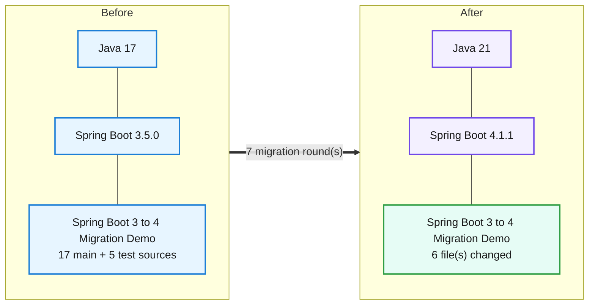
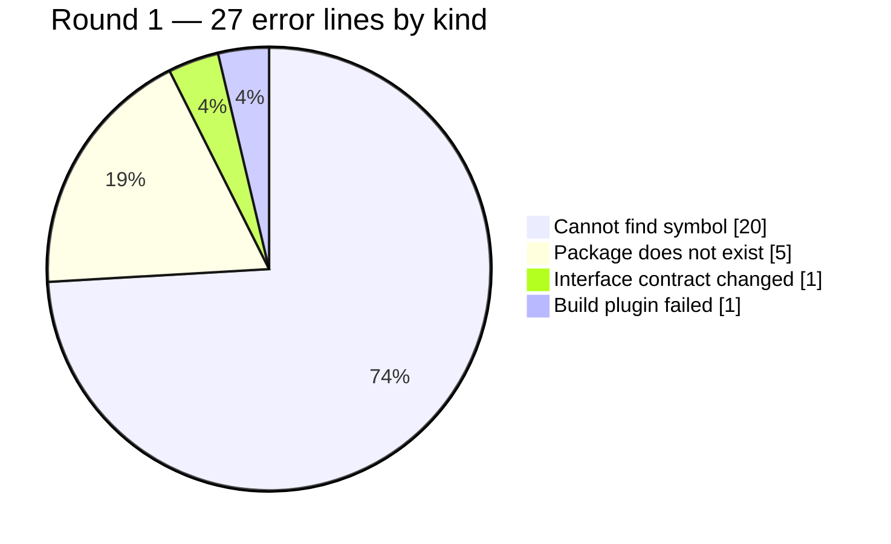

# Migration Report — Spring Boot 3.5.0 to 4.1.1 on Java 21

## Spring Boot 3 to 4 Migration Demo

    

> The employee service moved from Spring Boot 3.5.0 on Java 17 to Spring Boot 4.1.1 on Java 21. The business API came through unchanged: all four data endpoints return byte-identical responses before and after, and the authentication boundary still rejects anonymous and bad-credential requests. What had to change is every place the code touches the framework directly — JSON configuration moved to Jackson 3, the health indicator moved package, the web starter was renamed, and the whole test layer was repointed at Boot 4's new per-slice test modules. Seven build rounds were needed; the test suite ends with exactly the same three failures it already had before the migration started, and no new ones.

_Generated by the Version Migration skill on 2026-09-06. Every version, error count and response below is read from a recorded run, not from memory._

## At a glance

| | |
|---|---|
| **Result** | 🟢 **Passed** on the final build |
| **Platform** | Spring Boot `3.5.0` → `4.1.1` |
| **Language** | Java `17` → `21` |
| **Build rounds** | 8 recorded — 1 pre-migration baseline, 5 that failed and were read for what to change next, 2 green |
| **Files changed** | 6 — `Dockerfile`, `pom.xml`, `src/main/java/com/example/migrationdemo/config/JacksonConfig.java`, `src/main/java/com/example/migrationdemo/health/DatabaseHealthIndicator.java`, `src/test/java/com/example/migrationdemo/controller/EmployeeControllerTest.java`, `src/test/java/com/example/migrationdemo/integration/EmployeeRepositoryIntegrationTest.java` |
| **Dependency changes** | 8 |
| **Source changes forced by the upgrade** | 5 |
| **Test suite** | before: 15 run, 2 failed, 1 error(s) → after: 15 run, 2 failed, 1 error(s) — 🟡 the same 3 pre-existing failure(s) — none introduced |
| **Runtime behaviour** | 🟡 same status on all 9, body differs on 5 |
| **Reference followed** | `references/spring-boot-3-to-4.md` |
| **Build tool** | maven — Apache Maven 3.9.16 (2bdd9fddda4b155ebf8000e807eb73fd829a51d5) |

## 1. What moved



| | What | Before | After | Why it moved |
|---|---|---|---|---|
| ⬆️ | `Java (language level)` | `17` | `21` | Runtime baseline required by the new platform version. |
| ⬆️ | `Spring Boot (platform)` | `3.5.0` | `4.1.1` | The version jump this migration is about. |
| ⬆️ | `org.springframework.boot:spring-boot-starter-parent` | `3.5.0` | `4.1.1` | The parent BOM drives every managed version — Spring Framework 7, Security 7, Hibernate 7 and Jackson 3 all arrive with it. Nothing else can move until it does. |
| ⬆️ | `java.version (property)` | `17` | `21` | Java 21 is the LTS the Boot 4 generation targets. Boot 4.1.1 did in fact still compile under JDK 17 here, so this move is deliberate, not compiler-forced. |
| ⬆️ | `maven-compiler-plugin <source>/<target>` | `17 / 17` | `<release>21</release>` | The plugin pinned 17 explicitly, which would have overridden the java.version property and silently kept compiling at 17. Replaced with a single release flag. |
| 🔀 | `org.springframework.boot:spring-boot-starter-web` | `spring-boot-starter-web` | `spring-boot-starter-webmvc` | Boot 4 names the web starters after their stack; the servlet MVC starter no longer exists under the old name and fails at dependency resolution. |
| ➕ | `org.springframework.boot:spring-boot-starter-webmvc-test` | `absent` | `4.1.1 (managed), test scope` | Boot 4 splits the test slices into their own modules. @WebMvcTest and @AutoConfigureMockMvc live here now; spring-boot-starter-test alone no longer provides them. |
| ➕ | `org.springframework.boot:spring-boot-starter-data-jpa-test` | `absent` | `4.1.1 (managed), test scope` | Same split: @DataJpaTest moved into the data-jpa test module. |
| 🔀 | `org.springframework.security:spring-security-test` | `spring-security-test (managed)` | `org.springframework.boot:spring-boot-starter-security-test` | The MockMvc security test auto-configuration that makes @WithMockUser work moved into Boot's own security-test starter. With only the raw Spring Security artifact present, every @WithMockUser test compiled but returned 401 at runtime. |
| ⬆️ | `Dockerfile base image (eclipse-temurin)` | `17-jre` | `21-jre` | The container runtime has to match the class-file level the build now produces, or the image starts and immediately fails on an UnsupportedClassVersionError. |

## 2. How the migration went

```mermaid
flowchart LR
  classDef broken fill:#ffe3e3,stroke:#c92a2a,stroke-width:2px,color:#1a1a1a
  classDef degraded fill:#fff3bf,stroke:#e8590c,stroke-width:2px,color:#1a1a1a
  classDef ok fill:#e6fcf5,stroke:#2f9e44,stroke-width:2px,color:#1a1a1a
  classDef before fill:#e7f5ff,stroke:#1c7ed6,stroke-width:2px,color:#1a1a1a
  classDef after fill:#f3f0ff,stroke:#7048e8,stroke-width:2px,color:#1a1a1a
  classDef neutral fill:#f1f3f5,stroke:#868e96,stroke-width:1px,color:#1a1a1a
  R0["🟠 Round 0 · baseline<br/>JDK 17 · package<br/>10 error lines"]:::degraded
  R1["🔴 Round 1<br/>JDK 21 · test-compile<br/>27 error lines"]:::broken
  R2["🔴 Round 2<br/>JDK 21 · test-compile<br/>13 error lines"]:::broken
  R3["🔴 Round 3<br/>JDK 21 · test-compile<br/>13 error lines"]:::broken
  R4["🟢 Round 4<br/>JDK 21 · test-compile<br/>build green"]:::ok
  R5["🟠 Round 5<br/>JDK 21 · package<br/>20 error lines"]:::degraded
  R6["🟠 Round 6<br/>JDK 21 · package<br/>10 error lines"]:::degraded
  R7["🟢 Round 7<br/>JDK 21 · package-skip-tests<br/>build green"]:::ok
  R0 --> R1 --> R2 --> R3 --> R4 --> R5 --> R6 --> R7
```



| Round | Ran on | Goal | Outcome | Errors | Took | What it told us |
|---|---|---|---|---|---|---|
| **0** _(baseline)_ | JDK 17 | `package` | 🟠 Tests failed | 10 | 17.2s | Pre-migration reference build on Java 17 with the full test suite, before a single file was touched. |
| **1** | JDK 21 | `test-compile` | 🔴 Compile failed | 27 | 5.7s | First build after the version and coordinate changes, run on JDK 21. |
| **2** | JDK 21 | `test-compile` | 🔴 Compile failed | 13 | 6.4s | Main code compiled for the first time; the failure moved to the test layer exactly as expected, because test-compile only runs once main is clean. |
| **3** | JDK 21 | `test-compile` | 🔴 Compile failed | 13 | 8.7s | Adding the two new test starters alone changed nothing, and that is the useful lesson from this round: the slice annotations did not merely move artifact, they moved package. |
| **4** | JDK 21 | `test-compile` | 🟢 Passed | — | 6.0s | Green: main and test sources both compile on JDK 21 in 6 seconds. |
| **5** | JDK 21 | `package` | 🟠 Tests failed | 20 | 19.1s | The full suite on JDK 21, the same goal round 0 used — and a genuine regression appeared: 7 failures instead of 2. |
| **6** | JDK 21 | `package` | 🟠 Tests failed | 10 | 16.5s | Test suite back to parity: 15 run, 2 failures, 1 error — the identical three that already failed in round 0, for the identical reasons (no Docker daemon; two actuator assertions inside a slice that does not load actuator). |
| **7** | JDK 21 | `package-skip-tests` | 🟢 Passed | — | 12.9s | Packaging gate on the target runtime with no further source changes: clean, packaged, runnable jar on JDK 21. |

The round that hit the most breakage was **round 1**:



## 3. Round by round

### Round 0 — 🟠 Tests failed _(pre-migration reference)_

> **Nothing had been changed yet.** This is the reference every later round is read against.

| | |
|---|---|
| **Command** | `C:\Tools\apache-maven-3.9.16\bin\mvn.cmd -B clean package` |
| **JDK** | 17 (17.0.20) |
| **Declared in the build** | Java `17` · `spring-boot-starter-parent 3.5.0` |
| **Exit code** | 1 |
| **Duration** | 17.2s |
| **Workspace at this point** | no changes yet |

**What the result meant**

Pre-migration reference build on Java 17 with the full test suite, before a single file was touched. It is not green, and that matters: 15 tests run, 2 failures and 1 error. The error is environmental — EmployeeRepositoryIntegrationTest needs a Docker daemon for Testcontainers and there is none on this machine. The two failures are pre-existing: testActuatorHealth_Public and testActuatorInfo_Public expect 200 from /actuator/health and /actuator/info inside a @WebMvcTest slice, which does not load actuator, so they were already returning 404 before anything was upgraded. Neither has anything to do with Spring Boot 4. This is the state the migrated build has to reproduce — no better, no worse.

**Errors by kind**

| Count | Kind | What this kind of error means |
|---|---|---|
| 8 | Test failure | The code compiled but behaviour or test wiring changed. |
| 1 | Environment, not the code | The machine is missing something the test or build needs (a container runtime, a service, a network route). Compare against the same goal on the pre-migration build before blaming the upgrade. |
| 1 | Build plugin failed | A build plugin is too old for the new platform, or its configuration changed. |

**Distinct messages**

```text
Tests run: 9, Failures: 2, Errors: 0, Skipped: 0, Time elapsed: 5.414 s <<< FAILURE! -- in com.example.migrationdemo.controller.EmployeeControllerTest
com.example.migrationdemo.controller.EmployeeControllerTest.testActuatorHealth_Public -- Time elapsed: 0.041 s <<< FAILURE!
com.example.migrationdemo.controller.EmployeeControllerTest.testActuatorInfo_Public -- Time elapsed: 0.009 s <<< FAILURE!
Tests run: 1, Failures: 0, Errors: 1, Skipped: 0, Time elapsed: 0.735 s <<< FAILURE! -- in com.example.migrationdemo.integration.EmployeeRepositoryIntegrationTest
com.example.migrationdemo.integration.EmployeeRepositoryIntegrationTest -- Time elapsed: 0.735 s <<< ERROR!
EmployeeControllerTest.testActuatorHealth_Public:145 Status expected:<200> but was:<404>
EmployeeControllerTest.testActuatorInfo_Public:151 Status expected:<200> but was:<404>
EmployeeRepositoryIntegrationTest � IllegalState Could not find a valid Docker environment. Please see logs and check configuration
Tests run: 15, Failures: 2, Errors: 1, Skipped: 0
Failed to execute goal org.apache.maven.plugins:maven-surefire-plugin:3.5.3:test (default-test) on project spring-boot-migration-demo: There are test failures.
```

<details>
<summary>Every error line recorded in this round (10)</summary>

| # | File | Line | Kind | Message |
|---|---|---|---|---|
| 1 | _build_ | — | Test failure | Tests run: 9, Failures: 2, Errors: 0, Skipped: 0, Time elapsed: 5.414 s <<< FAILURE! -- in com.example.migrationdemo.controller.EmployeeControllerTest |
| 2 | _build_ | — | Test failure | com.example.migrationdemo.controller.EmployeeControllerTest.testActuatorHealth_Public -- Time elapsed: 0.041 s <<< FAILURE! |
| 3 | _build_ | — | Test failure | com.example.migrationdemo.controller.EmployeeControllerTest.testActuatorInfo_Public -- Time elapsed: 0.009 s <<< FAILURE! |
| 4 | _build_ | — | Test failure | Tests run: 1, Failures: 0, Errors: 1, Skipped: 0, Time elapsed: 0.735 s <<< FAILURE! -- in com.example.migrationdemo.integration.EmployeeRepositoryIntegrationTest |
| 5 | _build_ | — | Test failure | com.example.migrationdemo.integration.EmployeeRepositoryIntegrationTest -- Time elapsed: 0.735 s <<< ERROR! |
| 6 | _build_ | — | Test failure | EmployeeControllerTest.testActuatorHealth_Public:145 Status expected:<200> but was:<404> |
| 7 | _build_ | — | Test failure | EmployeeControllerTest.testActuatorInfo_Public:151 Status expected:<200> but was:<404> |
| 8 | _build_ | — | Environment, not the code | EmployeeRepositoryIntegrationTest � IllegalState Could not find a valid Docker environment. Please see logs and check configuration |
| 9 | _build_ | — | Test failure | Tests run: 15, Failures: 2, Errors: 1, Skipped: 0 |
| 10 | _build_ | — | Build plugin failed | Failed to execute goal org.apache.maven.plugins:maven-surefire-plugin:3.5.3:test (default-test) on project spring-boot-migration-demo: There are test failures. |

</details>

<details>
<summary>Build log tail</summary>

```text
… first 2 line(s) omitted — the complete log is at rounds/round-00.log
2026-09-06T19:56:56.948+05:30 ERROR 48192 --- [spring-boot-migration-demo] [           main] o.t.d.DockerClientProviderStrategy       : Could not find a valid Docker environment. Please check configuration. Attempted configurations were:
	NpipeSocketClientProviderStrategy: failed with exception BadRequestException (Status 400: {"ID":"","Containers":0,"ContainersRunning":0,"ContainersPaused":0,"ContainersStopped":0,"Images":0,"Driver":"","DriverStatus":null,"Plugins":{"Volume":null,"Network":null,"Authorization":null,"Log":null},"MemoryLimit":false,"SwapLimit":false,"CpuCfsPeriod":false,"CpuCfsQuota":false,"CPUShares":false,"CPUSet":false,"PidsLimit":false,"IPv4Forwarding":false,"Debug":false,"NFd":0,"OomKillDisable":false,"NGoroutines":0,"SystemTime":"","LoggingDriver":"","CgroupDriver":"","NEventsListener":0,"KernelVersion":"","OperatingSystem":"","OSVersion":"","OSType":"","Architecture":"","IndexServerAddress":"","RegistryConfig":null,"NCPU":0,"MemTotal":0,"GenericResources":null,"DockerRootDir":"","HttpProxy":"","HttpsProxy":"","NoProxy":"","Name":"","Labels":["com.docker.desktop.address=npipe://\\\\.\\pipe\\docker_cli"],"ExperimentalBuild":false,"ServerVersion":"","Runtimes":null,"DefaultRuntime":"","Swarm":{"NodeID":"","NodeAddr":"","LocalNodeState":"","ControlAvailable":false,"Error":"","RemoteManagers":null},"LiveRestoreEnabled":false,"Isolation":"","InitBinary":"","ContainerdCommit":{"ID":""},"RuncCommit":{"ID":""},"InitCommit":{"ID":""},"SecurityOptions":null,"CDISpecDirs":null,"Warnings":null})As no valid configuration was found, execution cannot continue.
See https://java.testcontainers.org/on_failure.html for more details.
2026-09-06T19:56:56.951+05:30  INFO 48192 --- [spring-boot-migration-demo] [           main] t.c.s.AnnotationConfigContextLoaderUtils : Could not detect default configuration classes for test class [com.example.migrationdemo.integration.EmployeeRepositoryIntegrationTest]: EmployeeRepositoryIntegrationTest does not declare any static, non-private, non-final, nested classes annotated with @Configuration.
2026-09-06T19:56:56.973+05:30  INFO 48192 --- [spring-boot-migration-demo] [           main] .b.t.c.SpringBootTestContextBootstrapper : Found @SpringBootConfiguration com.example.migrationdemo.MigrationDemoApplication for test class com.example.migrationdemo.integration.EmployeeRepositoryIntegrationTest
[ERROR] Tests run: 1, Failures: 0, Errors: 1, Skipped: 0, Time elapsed: 0.735 s <<< FAILURE! -- in com.example.migrationdemo.integration.EmployeeRepositoryIntegrationTest
[ERROR] com.example.migrationdemo.integration.EmployeeRepositoryIntegrationTest -- Time elapsed: 0.735 s <<< ERROR!
java.lang.IllegalStateException: Could not find a valid Docker environment. Please see logs and check configuration
	at org.testcontainers.dockerclient.DockerClientProviderStrategy.lambda$getFirstValidStrategy$7(DockerClientProviderStrategy.java:277)
	at java.base/java.util.Optional.orElseThrow(Optional.java:403)
	at org.testcontainers.dockerclient.DockerClientProviderStrategy.getFirstValidStrategy(DockerClientProviderStrategy.java:268)
	at org.testcontainers.DockerClientFactory.getOrInitializeStrategy(DockerClientFactory.java:152)
	at org.testcontainers.DockerClientFactory.client(DockerClientFactory.java:194)
	at org.testcontainers.DockerClientFactory$1.getDockerClient(DockerClientFactory.java:106)
	at com.github.dockerjava.api.DockerClientDelegate.authConfig(DockerClientDelegate.java:109)
	at org.testcontainers.containers.GenericContainer.start(GenericContainer.java:329)
	at org.testcontainers.junit.jupiter.TestcontainersExtension$StoreAdapter.start(TestcontainersExtension.java:276)
	at org.testcontainers.junit.jupiter.TestcontainersExtension$StoreAdapter.access$200(TestcontainersExtension.java:263)
	at org.testcontainers.junit.jupiter.TestcontainersExtension.lambda$null$4(TestcontainersExtension.java:83)
	at org.testcontainers.junit.jupiter.TestcontainersExtension.lambda$startContainers$5(TestcontainersExtension.java:83)
	at java.base/java.util.ArrayList.forEach(ArrayList.java:1511)
	at org.testcontainers.junit.jupiter.TestcontainersExtension.startContainers(TestcontainersExtension.java:83)
	at org.testcontainers.junit.jupiter.TestcontainersExtension.beforeAll(TestcontainersExtension.java:57)
	at java.base/java.util.ArrayList.forEach(ArrayList.java:1511)

[INFO] Running com.example.migrationdemo.mapper.EmployeeMapperTest
[INFO] Tests run: 2, Failures: 0, Errors: 0, Skipped: 0, Time elapsed: 0.015 s -- in com.example.migrationdemo.mapper.EmployeeMapperTest
[INFO] Running com.example.migrationdemo.service.EmployeeServiceTest
[INFO] Tests run: 3, Failures: 0, Errors: 0, Skipped: 0, Time elapsed: 0.244 s -- in com.example.migrationdemo.service.EmployeeServiceTest
[INFO] 
[INFO] Results:
[INFO] 
[ERROR] Failures: 
[ERROR]   EmployeeControllerTest.testActuatorHealth_Public:145 Status expected:<200> but was:<404>
[ERROR]   EmployeeControllerTest.testActuatorInfo_Public:151 Status expected:<200> but was:<404>
[ERROR] Errors: 
[ERROR]   EmployeeRepositoryIntegrationTest � IllegalState Could not find a valid Docker environment. Please see logs and check configuration
[INFO] 
[ERROR] Tests run: 15, Failures: 2, Errors: 1, Skipped: 0
[INFO] 
[INFO] ------------------------------------------------------------------------
[INFO] BUILD FAILURE
[INFO] ------------------------------------------------------------------------
[INFO] Total time:  15.121 s
[INFO] Finished at: 2026-09-06T19:56:57+05:30
[INFO] ------------------------------------------------------------------------
[ERROR] Failed to execute goal org.apache.maven.plugins:maven-surefire-plugin:3.5.3:test (default-test) on project spring-boot-migration-demo: There are test failures.
[ERROR] 
[ERROR] See .\target\surefire-reports for the individual test results.
[ERROR] See dump files (if any exist) [date].dump, [date]-jvmRun[N].dump and [date].dumpstream.
[ERROR] -> [Help 1]
[ERROR] 
[ERROR] To see the full stack trace of the errors, re-run Maven with the -e switch.
[ERROR] Re-run Maven using the -X switch to enable full debug logging.
[ERROR] 
[ERROR] For more information about the errors and possible solutions, please read the following articles:
[ERROR] [Help 1] http://cwiki.apache.org/confluence/display/MAVEN/MojoFailureException

OpenJDK 64-Bit Server VM warning: Sharing is only supported for boot loader classes because bootstrap classpath has been appended

```

</details>

### Round 1 — 🔴 Compile failed

> **Changed before this round:** spring-boot-starter-parent 3.5.0 -> 4.1.1 · java.version 17 -> 21 and maven-compiler-plugin <source>/<target> replaced with <release>21</release> · spring-boot-starter-web -> spring-boot-starter-webmvc · Dockerfile base image eclipse-temurin:17-jre -> 21-jre

| | |
|---|---|
| **Command** | `C:\Tools\apache-maven-3.9.16\bin\mvn.cmd -B clean test-compile` |
| **JDK** | 21 (21.0.12.1) |
| **Declared in the build** | Java `21` · `spring-boot-starter-parent 4.1.1` |
| **Exit code** | 1 |
| **Duration** | 5.7s |
| **Workspace at this point** | 2 files changed, 8 insertions(+), 8 deletions(-) |

**What the result meant**

First build after the version and coordinate changes, run on JDK 21. Both spring-boot-starter-parent 4.1.1 and the renamed spring-boot-starter-webmvc resolved cleanly, so the failure was not about dependencies — 27 error lines, every one of them in two files that talk to the framework directly. JacksonConfig lost com.fasterxml.jackson.databind and com.fasterxml.jackson.datatype.jsr310; DatabaseHealthIndicator lost org.springframework.boot.actuate.health. Worth recording: the same bump also compiles under JDK 17, so the Java move here is a deliberate platform decision, not something the compiler forced.

**Errors by kind**

| Count | Kind | What this kind of error means |
|---|---|---|
| 20 | Cannot find symbol | A class, method or field was renamed or removed. Look for a replacement API in the reference pack. |
| 5 | Package does not exist | A type moved to a new package or module. Look for a relocation entry in the reference pack. |
| 1 | Interface contract changed | An interface gained, moved or changed a method — implement the new contract, or the type it came from has moved too. |
| 1 | Build plugin failed | A build plugin is too old for the new platform, or its configuration changed. |

**Where they were**

| Errors | File |
|---|---|
| 13 | `src/main/java/com/example/migrationdemo/config/JacksonConfig.java` |
| 13 | `src/main/java/com/example/migrationdemo/health/DatabaseHealthIndicator.java` |

**Distinct messages**

```text
package com.fasterxml.jackson.databind does not exist
package com.fasterxml.jackson.datatype.jsr310 does not exist
cannot find symbol
package org.springframework.boot.actuate.health does not exist
method does not override or implement a method from a supertype
Failed to execute goal org.apache.maven.plugins:maven-compiler-plugin:3.15.0:compile (default-compile) on project spring-boot-migration-demo: Compilation failure: Compilation failure:
cannot find symbol — class ObjectMapper
cannot find symbol — class HealthIndicator
cannot find symbol — class Health
cannot find symbol — class JavaTimeModule
cannot find symbol — variable SerializationFeature
cannot find symbol — variable Health
```

<details>
<summary>Every error line recorded in this round (27)</summary>

| # | File | Line | Kind | Message |
|---|---|---|---|---|
| 1 | `src/main/java/com/example/migrationdemo/config/JacksonConfig.java` | 3 | Package does not exist | package com.fasterxml.jackson.databind does not exist |
| 2 | `src/main/java/com/example/migrationdemo/config/JacksonConfig.java` | 4 | Package does not exist | package com.fasterxml.jackson.databind does not exist |
| 3 | `src/main/java/com/example/migrationdemo/config/JacksonConfig.java` | 5 | Package does not exist | package com.fasterxml.jackson.datatype.jsr310 does not exist |
| 4 | `src/main/java/com/example/migrationdemo/config/JacksonConfig.java` | 22 | Cannot find symbol | cannot find symbol |
| 5 | `src/main/java/com/example/migrationdemo/health/DatabaseHealthIndicator.java` | 3 | Package does not exist | package org.springframework.boot.actuate.health does not exist |
| 6 | `src/main/java/com/example/migrationdemo/health/DatabaseHealthIndicator.java` | 4 | Package does not exist | package org.springframework.boot.actuate.health does not exist |
| 7 | `src/main/java/com/example/migrationdemo/health/DatabaseHealthIndicator.java` | 10 | Cannot find symbol | cannot find symbol |
| 8 | `src/main/java/com/example/migrationdemo/health/DatabaseHealthIndicator.java` | 19 | Cannot find symbol | cannot find symbol |
| 9 | `src/main/java/com/example/migrationdemo/config/JacksonConfig.java` | 23 | Cannot find symbol | cannot find symbol |
| 10 | `src/main/java/com/example/migrationdemo/config/JacksonConfig.java` | 26 | Cannot find symbol | cannot find symbol |
| 11 | `src/main/java/com/example/migrationdemo/config/JacksonConfig.java` | 29 | Cannot find symbol | cannot find symbol |
| 12 | `src/main/java/com/example/migrationdemo/config/JacksonConfig.java` | 36 | Cannot find symbol | cannot find symbol |
| 13 | `src/main/java/com/example/migrationdemo/health/DatabaseHealthIndicator.java` | 18 | Interface contract changed | method does not override or implement a method from a supertype |
| 14 | `src/main/java/com/example/migrationdemo/health/DatabaseHealthIndicator.java` | 22 | Cannot find symbol | cannot find symbol |
| 15 | `src/main/java/com/example/migrationdemo/health/DatabaseHealthIndicator.java` | 28 | Cannot find symbol | cannot find symbol |
| 16 | `src/main/java/com/example/migrationdemo/health/DatabaseHealthIndicator.java` | 33 | Cannot find symbol | cannot find symbol |
| 17 | _build_ | — | Build plugin failed | Failed to execute goal org.apache.maven.plugins:maven-compiler-plugin:3.15.0:compile (default-compile) on project spring-boot-migration-demo: Compilation failure: Compilation failure: |
| 18 | `src/main/java/com/example/migrationdemo/config/JacksonConfig.java` | 22 | Cannot find symbol | cannot find symbol — class ObjectMapper |
| 19 | `src/main/java/com/example/migrationdemo/health/DatabaseHealthIndicator.java` | 10 | Cannot find symbol | cannot find symbol — class HealthIndicator |
| 20 | `src/main/java/com/example/migrationdemo/health/DatabaseHealthIndicator.java` | 19 | Cannot find symbol | cannot find symbol — class Health |
| 21 | `src/main/java/com/example/migrationdemo/config/JacksonConfig.java` | 23 | Cannot find symbol | cannot find symbol — class ObjectMapper |
| 22 | `src/main/java/com/example/migrationdemo/config/JacksonConfig.java` | 26 | Cannot find symbol | cannot find symbol — class JavaTimeModule |
| 23 | `src/main/java/com/example/migrationdemo/config/JacksonConfig.java` | 29 | Cannot find symbol | cannot find symbol — variable SerializationFeature |
| 24 | `src/main/java/com/example/migrationdemo/config/JacksonConfig.java` | 36 | Cannot find symbol | cannot find symbol — variable SerializationFeature |
| 25 | `src/main/java/com/example/migrationdemo/health/DatabaseHealthIndicator.java` | 22 | Cannot find symbol | cannot find symbol — variable Health |
| 26 | `src/main/java/com/example/migrationdemo/health/DatabaseHealthIndicator.java` | 28 | Cannot find symbol | cannot find symbol — variable Health |
| 27 | `src/main/java/com/example/migrationdemo/health/DatabaseHealthIndicator.java` | 33 | Cannot find symbol | cannot find symbol — variable Health |

</details>

**Reference rules applied:** `§1.1 Parent / BOM` · `§1.2 Language level` · `§1.3 Starter renames` · `§8 Container image`

<details>
<summary>Build log tail</summary>

```text
… first 44 line(s) omitted — the complete log is at rounds/round-01.log
  location: class com.example.migrationdemo.health.DatabaseHealthIndicator
[ERROR] ./src/main/java/com/example/migrationdemo/health/DatabaseHealthIndicator.java:[33,16] cannot find symbol
  symbol:   variable Health
  location: class com.example.migrationdemo.health.DatabaseHealthIndicator
[INFO] 17 errors 
[INFO] -------------------------------------------------------------
[INFO] ------------------------------------------------------------------------
[INFO] BUILD FAILURE
[INFO] ------------------------------------------------------------------------
[INFO] Total time:  3.794 s
[INFO] Finished at: 2026-09-06T19:57:50+05:30
[INFO] ------------------------------------------------------------------------
[ERROR] Failed to execute goal org.apache.maven.plugins:maven-compiler-plugin:3.15.0:compile (default-compile) on project spring-boot-migration-demo: Compilation failure: Compilation failure: 
[ERROR] ./src/main/java/com/example/migrationdemo/config/JacksonConfig.java:[3,38] package com.fasterxml.jackson.databind does not exist
[ERROR] ./src/main/java/com/example/migrationdemo/config/JacksonConfig.java:[4,38] package com.fasterxml.jackson.databind does not exist
[ERROR] ./src/main/java/com/example/migrationdemo/config/JacksonConfig.java:[5,45] package com.fasterxml.jackson.datatype.jsr310 does not exist
[ERROR] ./src/main/java/com/example/migrationdemo/config/JacksonConfig.java:[22,12] cannot find symbol
[ERROR]   symbol:   class ObjectMapper
[ERROR]   location: class com.example.migrationdemo.config.JacksonConfig
[ERROR] ./src/main/java/com/example/migrationdemo/health/DatabaseHealthIndicator.java:[3,47] package org.springframework.boot.actuate.health does not exist
[ERROR] ./src/main/java/com/example/migrationdemo/health/DatabaseHealthIndicator.java:[4,47] package org.springframework.boot.actuate.health does not exist
[ERROR] ./src/main/java/com/example/migrationdemo/health/DatabaseHealthIndicator.java:[10,49] cannot find symbol
[ERROR]   symbol: class HealthIndicator
[ERROR] ./src/main/java/com/example/migrationdemo/health/DatabaseHealthIndicator.java:[19,12] cannot find symbol
[ERROR]   symbol:   class Health
[ERROR]   location: class com.example.migrationdemo.health.DatabaseHealthIndicator
[ERROR] ./src/main/java/com/example/migrationdemo/config/JacksonConfig.java:[23,9] cannot find symbol
[ERROR]   symbol:   class ObjectMapper
[ERROR]   location: class com.example.migrationdemo.config.JacksonConfig
[ERROR] ./src/main/java/com/example/migrationdemo/config/JacksonConfig.java:[23,35] cannot find symbol
[ERROR]   symbol:   class ObjectMapper
[ERROR]   location: class com.example.migrationdemo.config.JacksonConfig
[ERROR] ./src/main/java/com/example/migrationdemo/config/JacksonConfig.java:[26,35] cannot find symbol
[ERROR]   symbol:   class JavaTimeModule
[ERROR]   location: class com.example.migrationdemo.config.JacksonConfig
[ERROR] ./src/main/java/com/example/migrationdemo/config/JacksonConfig.java:[29,24] cannot find symbol
[ERROR]   symbol:   variable SerializationFeature
[ERROR]   location: class com.example.migrationdemo.config.JacksonConfig
[ERROR] ./src/main/java/com/example/migrationdemo/config/JacksonConfig.java:[36,24] cannot find symbol
[ERROR]   symbol:   variable SerializationFeature
[ERROR]   location: class com.example.migrationdemo.config.JacksonConfig
[ERROR] ./src/main/java/com/example/migrationdemo/health/DatabaseHealthIndicator.java:[18,5] method does not override or implement a method from a supertype
[ERROR] ./src/main/java/com/example/migrationdemo/health/DatabaseHealthIndicator.java:[22,24] cannot find symbol
[ERROR]   symbol:   variable Health
[ERROR]   location: class com.example.migrationdemo.health.DatabaseHealthIndicator
[ERROR] ./src/main/java/com/example/migrationdemo/health/DatabaseHealthIndicator.java:[28,20] cannot find symbol
[ERROR]   symbol:   variable Health
[ERROR]   location: class com.example.migrationdemo.health.DatabaseHealthIndicator
[ERROR] ./src/main/java/com/example/migrationdemo/health/DatabaseHealthIndicator.java:[33,16] cannot find symbol
[ERROR]   symbol:   variable Health
[ERROR]   location: class com.example.migrationdemo.health.DatabaseHealthIndicator
[ERROR] -> [Help 1]
[ERROR] 
[ERROR] To see the full stack trace of the errors, re-run Maven with the -e switch.
[ERROR] Re-run Maven using the -X switch to enable full debug logging.
[ERROR] 
[ERROR] For more information about the errors and possible solutions, please read the following articles:
[ERROR] [Help 1] http://cwiki.apache.org/confluence/display/MAVEN/MojoFailureException


```

</details>

### Round 2 — 🔴 Compile failed

> **Changed before this round:** JacksonConfig rewritten against the Jackson 3 builder API (JsonMapperBuilderCustomizer, tools.jackson, DateTimeFeature, changeDefaultPropertyInclusion) · DatabaseHealthIndicator imports repointed at org.springframework.boot.health.contributor

| | |
|---|---|
| **Command** | `C:\Tools\apache-maven-3.9.16\bin\mvn.cmd -B clean test-compile` |
| **JDK** | 21 (21.0.12.1) |
| **Declared in the build** | Java `21` · `spring-boot-starter-parent 4.1.1` |
| **Exit code** | 1 |
| **Duration** | 6.4s |
| **Workspace at this point** | 4 files changed, 31 insertions(+), 32 deletions(-) |

**What the result meant**

Main code compiled for the first time; the failure moved to the test layer exactly as expected, because test-compile only runs once main is clean. Three packages that no longer exist: org.springframework.boot.test.autoconfigure.web.servlet (@WebMvcTest), org.springframework.boot.test.autoconfigure.orm.jpa (@DataJpaTest) and org.springframework.boot.test.mock.mockito (@MockBean), plus the Jackson 2 ObjectMapper in the controller test.

**Errors by kind**

| Count | Kind | What this kind of error means |
|---|---|---|
| 8 | Cannot find symbol | A class, method or field was renamed or removed. Look for a replacement API in the reference pack. |
| 4 | Package does not exist | A type moved to a new package or module. Look for a relocation entry in the reference pack. |
| 1 | Build plugin failed | A build plugin is too old for the new platform, or its configuration changed. |

**Where they were**

| Errors | File |
|---|---|
| 9 | `src/test/java/com/example/migrationdemo/controller/EmployeeControllerTest.java` |
| 3 | `src/test/java/com/example/migrationdemo/integration/EmployeeRepositoryIntegrationTest.java` |

**Distinct messages**

```text
package com.fasterxml.jackson.databind does not exist
package org.springframework.boot.test.autoconfigure.web.servlet does not exist
package org.springframework.boot.test.mock.mockito does not exist
cannot find symbol
package org.springframework.boot.test.autoconfigure.orm.jpa does not exist
Failed to execute goal org.apache.maven.plugins:maven-compiler-plugin:3.15.0:testCompile (default-testCompile) on project spring-boot-migration-demo: Compilation failure: Compilation failure:
cannot find symbol — class WebMvcTest
cannot find symbol — class ObjectMapper
cannot find symbol — class DataJpaTest
cannot find symbol — class MockBean
```

<details>
<summary>Every error line recorded in this round (13)</summary>

| # | File | Line | Kind | Message |
|---|---|---|---|---|
| 1 | `src/test/java/com/example/migrationdemo/controller/EmployeeControllerTest.java` | 8 | Package does not exist | package com.fasterxml.jackson.databind does not exist |
| 2 | `src/test/java/com/example/migrationdemo/controller/EmployeeControllerTest.java` | 11 | Package does not exist | package org.springframework.boot.test.autoconfigure.web.servlet does not exist |
| 3 | `src/test/java/com/example/migrationdemo/controller/EmployeeControllerTest.java` | 12 | Package does not exist | package org.springframework.boot.test.mock.mockito does not exist |
| 4 | `src/test/java/com/example/migrationdemo/controller/EmployeeControllerTest.java` | 27 | Cannot find symbol | cannot find symbol |
| 5 | `src/test/java/com/example/migrationdemo/controller/EmployeeControllerTest.java` | 38 | Cannot find symbol | cannot find symbol |
| 6 | `src/test/java/com/example/migrationdemo/integration/EmployeeRepositoryIntegrationTest.java` | 8 | Package does not exist | package org.springframework.boot.test.autoconfigure.orm.jpa does not exist |
| 7 | `src/test/java/com/example/migrationdemo/integration/EmployeeRepositoryIntegrationTest.java` | 30 | Cannot find symbol | cannot find symbol |
| 8 | `src/test/java/com/example/migrationdemo/controller/EmployeeControllerTest.java` | 34 | Cannot find symbol | cannot find symbol |
| 9 | _build_ | — | Build plugin failed | Failed to execute goal org.apache.maven.plugins:maven-compiler-plugin:3.15.0:testCompile (default-testCompile) on project spring-boot-migration-demo: Compilation failure: Compilation failure: |
| 10 | `src/test/java/com/example/migrationdemo/controller/EmployeeControllerTest.java` | 27 | Cannot find symbol | cannot find symbol — class WebMvcTest |
| 11 | `src/test/java/com/example/migrationdemo/controller/EmployeeControllerTest.java` | 38 | Cannot find symbol | cannot find symbol — class ObjectMapper |
| 12 | `src/test/java/com/example/migrationdemo/integration/EmployeeRepositoryIntegrationTest.java` | 30 | Cannot find symbol | cannot find symbol — class DataJpaTest |
| 13 | `src/test/java/com/example/migrationdemo/controller/EmployeeControllerTest.java` | 34 | Cannot find symbol | cannot find symbol — class MockBean |

</details>

**Reference rules applied:** `§2 Jackson 2 to Jackson 3` · `§3 Actuator health contributor package`

<details>
<summary>Build log tail</summary>

```text
… first 13 line(s) omitted — the complete log is at rounds/round-02.log
[INFO] 
[INFO] --- compiler:3.15.0:compile (default-compile) @ spring-boot-migration-demo ---
[INFO] Recompiling the module because of changed source code.
[INFO] Compiling 17 source files with javac [debug parameters release 21] to target\classes
[INFO] 
[INFO] --- resources:3.5.0:testResources (default-testResources) @ spring-boot-migration-demo ---
[INFO] Copying 1 resource from src\test\resources to target\test-classes
[INFO] 
[INFO] --- compiler:3.15.0:testCompile (default-testCompile) @ spring-boot-migration-demo ---
[INFO] Recompiling the module because of changed dependency.
[INFO] Compiling 5 source files with javac [debug parameters release 21] to target\test-classes
[INFO] -------------------------------------------------------------
[ERROR] COMPILATION ERROR : 
[INFO] -------------------------------------------------------------
[ERROR] ./src/test/java/com/example/migrationdemo/controller/EmployeeControllerTest.java:[8,38] package com.fasterxml.jackson.databind does not exist
[ERROR] ./src/test/java/com/example/migrationdemo/controller/EmployeeControllerTest.java:[11,63] package org.springframework.boot.test.autoconfigure.web.servlet does not exist
[ERROR] ./src/test/java/com/example/migrationdemo/controller/EmployeeControllerTest.java:[12,50] package org.springframework.boot.test.mock.mockito does not exist
[ERROR] ./src/test/java/com/example/migrationdemo/controller/EmployeeControllerTest.java:[27,2] cannot find symbol
  symbol: class WebMvcTest
[ERROR] ./src/test/java/com/example/migrationdemo/controller/EmployeeControllerTest.java:[38,13] cannot find symbol
  symbol:   class ObjectMapper
  location: class com.example.migrationdemo.controller.EmployeeControllerTest
[ERROR] ./src/test/java/com/example/migrationdemo/integration/EmployeeRepositoryIntegrationTest.java:[8,59] package org.springframework.boot.test.autoconfigure.orm.jpa does not exist
[ERROR] ./src/test/java/com/example/migrationdemo/integration/EmployeeRepositoryIntegrationTest.java:[30,2] cannot find symbol
  symbol: class DataJpaTest
[ERROR] ./src/test/java/com/example/migrationdemo/controller/EmployeeControllerTest.java:[34,6] cannot find symbol
  symbol:   class MockBean
  location: class com.example.migrationdemo.controller.EmployeeControllerTest
[INFO] 8 errors 
[INFO] -------------------------------------------------------------
[INFO] ------------------------------------------------------------------------
[INFO] BUILD FAILURE
[INFO] ------------------------------------------------------------------------
[INFO] Total time:  4.573 s
[INFO] Finished at: 2026-09-06T19:59:48+05:30
[INFO] ------------------------------------------------------------------------
[ERROR] Failed to execute goal org.apache.maven.plugins:maven-compiler-plugin:3.15.0:testCompile (default-testCompile) on project spring-boot-migration-demo: Compilation failure: Compilation failure: 
[ERROR] ./src/test/java/com/example/migrationdemo/controller/EmployeeControllerTest.java:[8,38] package com.fasterxml.jackson.databind does not exist
[ERROR] ./src/test/java/com/example/migrationdemo/controller/EmployeeControllerTest.java:[11,63] package org.springframework.boot.test.autoconfigure.web.servlet does not exist
[ERROR] ./src/test/java/com/example/migrationdemo/controller/EmployeeControllerTest.java:[12,50] package org.springframework.boot.test.mock.mockito does not exist
[ERROR] ./src/test/java/com/example/migrationdemo/controller/EmployeeControllerTest.java:[27,2] cannot find symbol
[ERROR]   symbol: class WebMvcTest
[ERROR] ./src/test/java/com/example/migrationdemo/controller/EmployeeControllerTest.java:[38,13] cannot find symbol
[ERROR]   symbol:   class ObjectMapper
[ERROR]   location: class com.example.migrationdemo.controller.EmployeeControllerTest
[ERROR] ./src/test/java/com/example/migrationdemo/integration/EmployeeRepositoryIntegrationTest.java:[8,59] package org.springframework.boot.test.autoconfigure.orm.jpa does not exist
[ERROR] ./src/test/java/com/example/migrationdemo/integration/EmployeeRepositoryIntegrationTest.java:[30,2] cannot find symbol
[ERROR]   symbol: class DataJpaTest
[ERROR] ./src/test/java/com/example/migrationdemo/controller/EmployeeControllerTest.java:[34,6] cannot find symbol
[ERROR]   symbol:   class MockBean
[ERROR]   location: class com.example.migrationdemo.controller.EmployeeControllerTest
[ERROR] -> [Help 1]
[ERROR] 
[ERROR] To see the full stack trace of the errors, re-run Maven with the -e switch.
[ERROR] Re-run Maven using the -X switch to enable full debug logging.
[ERROR] 
[ERROR] For more information about the errors and possible solutions, please read the following articles:
[ERROR] [Help 1] http://cwiki.apache.org/confluence/display/MAVEN/MojoFailureException


```

</details>

### Round 3 — 🔴 Compile failed

> **Changed before this round:** Added spring-boot-starter-webmvc-test and spring-boot-starter-data-jpa-test (test scope), resolved from the Boot 4.1.1 BOM

| | |
|---|---|
| **Command** | `C:\Tools\apache-maven-3.9.16\bin\mvn.cmd -B clean test-compile` |
| **JDK** | 21 (21.0.12.1) |
| **Declared in the build** | Java `21` · `spring-boot-starter-parent 4.1.1` |
| **Exit code** | 1 |
| **Duration** | 8.7s |
| **Workspace at this point** | 4 files changed, 44 insertions(+), 32 deletions(-) |

**What the result meant**

Adding the two new test starters alone changed nothing, and that is the useful lesson from this round: the slice annotations did not merely move artifact, they moved package. The imports in the test sources still named the Boot 3 packages, so the same four errors came back unchanged. The new package names were read out of the downloaded jars rather than guessed.

**Errors by kind**

| Count | Kind | What this kind of error means |
|---|---|---|
| 8 | Cannot find symbol | A class, method or field was renamed or removed. Look for a replacement API in the reference pack. |
| 4 | Package does not exist | A type moved to a new package or module. Look for a relocation entry in the reference pack. |
| 1 | Build plugin failed | A build plugin is too old for the new platform, or its configuration changed. |

**Where they were**

| Errors | File |
|---|---|
| 9 | `src/test/java/com/example/migrationdemo/controller/EmployeeControllerTest.java` |
| 3 | `src/test/java/com/example/migrationdemo/integration/EmployeeRepositoryIntegrationTest.java` |

**Distinct messages**

```text
package com.fasterxml.jackson.databind does not exist
package org.springframework.boot.test.autoconfigure.web.servlet does not exist
package org.springframework.boot.test.mock.mockito does not exist
cannot find symbol
package org.springframework.boot.test.autoconfigure.orm.jpa does not exist
Failed to execute goal org.apache.maven.plugins:maven-compiler-plugin:3.15.0:testCompile (default-testCompile) on project spring-boot-migration-demo: Compilation failure: Compilation failure:
cannot find symbol — class WebMvcTest
cannot find symbol — class ObjectMapper
cannot find symbol — class DataJpaTest
cannot find symbol — class MockBean
```

<details>
<summary>Every error line recorded in this round (13)</summary>

| # | File | Line | Kind | Message |
|---|---|---|---|---|
| 1 | `src/test/java/com/example/migrationdemo/controller/EmployeeControllerTest.java` | 8 | Package does not exist | package com.fasterxml.jackson.databind does not exist |
| 2 | `src/test/java/com/example/migrationdemo/controller/EmployeeControllerTest.java` | 11 | Package does not exist | package org.springframework.boot.test.autoconfigure.web.servlet does not exist |
| 3 | `src/test/java/com/example/migrationdemo/controller/EmployeeControllerTest.java` | 12 | Package does not exist | package org.springframework.boot.test.mock.mockito does not exist |
| 4 | `src/test/java/com/example/migrationdemo/controller/EmployeeControllerTest.java` | 27 | Cannot find symbol | cannot find symbol |
| 5 | `src/test/java/com/example/migrationdemo/controller/EmployeeControllerTest.java` | 38 | Cannot find symbol | cannot find symbol |
| 6 | `src/test/java/com/example/migrationdemo/integration/EmployeeRepositoryIntegrationTest.java` | 8 | Package does not exist | package org.springframework.boot.test.autoconfigure.orm.jpa does not exist |
| 7 | `src/test/java/com/example/migrationdemo/integration/EmployeeRepositoryIntegrationTest.java` | 30 | Cannot find symbol | cannot find symbol |
| 8 | `src/test/java/com/example/migrationdemo/controller/EmployeeControllerTest.java` | 34 | Cannot find symbol | cannot find symbol |
| 9 | _build_ | — | Build plugin failed | Failed to execute goal org.apache.maven.plugins:maven-compiler-plugin:3.15.0:testCompile (default-testCompile) on project spring-boot-migration-demo: Compilation failure: Compilation failure: |
| 10 | `src/test/java/com/example/migrationdemo/controller/EmployeeControllerTest.java` | 27 | Cannot find symbol | cannot find symbol — class WebMvcTest |
| 11 | `src/test/java/com/example/migrationdemo/controller/EmployeeControllerTest.java` | 38 | Cannot find symbol | cannot find symbol — class ObjectMapper |
| 12 | `src/test/java/com/example/migrationdemo/integration/EmployeeRepositoryIntegrationTest.java` | 30 | Cannot find symbol | cannot find symbol — class DataJpaTest |
| 13 | `src/test/java/com/example/migrationdemo/controller/EmployeeControllerTest.java` | 34 | Cannot find symbol | cannot find symbol — class MockBean |

</details>

**Reference rules applied:** `§4.3 Test starters` · `§11 Verify a coordinate or class before using it`

<details>
<summary>Build log tail</summary>

```text
… first 25 line(s) omitted — the complete log is at rounds/round-03.log
[INFO] 
[INFO] --- compiler:3.15.0:compile (default-compile) @ spring-boot-migration-demo ---
[INFO] Recompiling the module because of changed source code.
[INFO] Compiling 17 source files with javac [debug parameters release 21] to target\classes
[INFO] 
[INFO] --- resources:3.5.0:testResources (default-testResources) @ spring-boot-migration-demo ---
[INFO] Copying 1 resource from src\test\resources to target\test-classes
[INFO] 
[INFO] --- compiler:3.15.0:testCompile (default-testCompile) @ spring-boot-migration-demo ---
[INFO] Recompiling the module because of changed dependency.
[INFO] Compiling 5 source files with javac [debug parameters release 21] to target\test-classes
[INFO] -------------------------------------------------------------
[ERROR] COMPILATION ERROR : 
[INFO] -------------------------------------------------------------
[ERROR] ./src/test/java/com/example/migrationdemo/controller/EmployeeControllerTest.java:[8,38] package com.fasterxml.jackson.databind does not exist
[ERROR] ./src/test/java/com/example/migrationdemo/controller/EmployeeControllerTest.java:[11,63] package org.springframework.boot.test.autoconfigure.web.servlet does not exist
[ERROR] ./src/test/java/com/example/migrationdemo/controller/EmployeeControllerTest.java:[12,50] package org.springframework.boot.test.mock.mockito does not exist
[ERROR] ./src/test/java/com/example/migrationdemo/controller/EmployeeControllerTest.java:[27,2] cannot find symbol
  symbol: class WebMvcTest
[ERROR] ./src/test/java/com/example/migrationdemo/controller/EmployeeControllerTest.java:[38,13] cannot find symbol
  symbol:   class ObjectMapper
  location: class com.example.migrationdemo.controller.EmployeeControllerTest
[ERROR] ./src/test/java/com/example/migrationdemo/integration/EmployeeRepositoryIntegrationTest.java:[8,59] package org.springframework.boot.test.autoconfigure.orm.jpa does not exist
[ERROR] ./src/test/java/com/example/migrationdemo/integration/EmployeeRepositoryIntegrationTest.java:[30,2] cannot find symbol
  symbol: class DataJpaTest
[ERROR] ./src/test/java/com/example/migrationdemo/controller/EmployeeControllerTest.java:[34,6] cannot find symbol
  symbol:   class MockBean
  location: class com.example.migrationdemo.controller.EmployeeControllerTest
[INFO] 8 errors 
[INFO] -------------------------------------------------------------
[INFO] ------------------------------------------------------------------------
[INFO] BUILD FAILURE
[INFO] ------------------------------------------------------------------------
[INFO] Total time:  6.855 s
[INFO] Finished at: 2026-09-06T20:00:54+05:30
[INFO] ------------------------------------------------------------------------
[ERROR] Failed to execute goal org.apache.maven.plugins:maven-compiler-plugin:3.15.0:testCompile (default-testCompile) on project spring-boot-migration-demo: Compilation failure: Compilation failure: 
[ERROR] ./src/test/java/com/example/migrationdemo/controller/EmployeeControllerTest.java:[8,38] package com.fasterxml.jackson.databind does not exist
[ERROR] ./src/test/java/com/example/migrationdemo/controller/EmployeeControllerTest.java:[11,63] package org.springframework.boot.test.autoconfigure.web.servlet does not exist
[ERROR] ./src/test/java/com/example/migrationdemo/controller/EmployeeControllerTest.java:[12,50] package org.springframework.boot.test.mock.mockito does not exist
[ERROR] ./src/test/java/com/example/migrationdemo/controller/EmployeeControllerTest.java:[27,2] cannot find symbol
[ERROR]   symbol: class WebMvcTest
[ERROR] ./src/test/java/com/example/migrationdemo/controller/EmployeeControllerTest.java:[38,13] cannot find symbol
[ERROR]   symbol:   class ObjectMapper
[ERROR]   location: class com.example.migrationdemo.controller.EmployeeControllerTest
[ERROR] ./src/test/java/com/example/migrationdemo/integration/EmployeeRepositoryIntegrationTest.java:[8,59] package org.springframework.boot.test.autoconfigure.orm.jpa does not exist
[ERROR] ./src/test/java/com/example/migrationdemo/integration/EmployeeRepositoryIntegrationTest.java:[30,2] cannot find symbol
[ERROR]   symbol: class DataJpaTest
[ERROR] ./src/test/java/com/example/migrationdemo/controller/EmployeeControllerTest.java:[34,6] cannot find symbol
[ERROR]   symbol:   class MockBean
[ERROR]   location: class com.example.migrationdemo.controller.EmployeeControllerTest
[ERROR] -> [Help 1]
[ERROR] 
[ERROR] To see the full stack trace of the errors, re-run Maven with the -e switch.
[ERROR] Re-run Maven using the -X switch to enable full debug logging.
[ERROR] 
[ERROR] For more information about the errors and possible solutions, please read the following articles:
[ERROR] [Help 1] http://cwiki.apache.org/confluence/display/MAVEN/MojoFailureException


```

</details>

### Round 4 — 🟢 Passed

> **Changed before this round:** @WebMvcTest import -> org.springframework.boot.webmvc.test.autoconfigure.WebMvcTest · @DataJpaTest import -> org.springframework.boot.data.jpa.test.autoconfigure.DataJpaTest · @MockBean -> @MockitoBean (org.springframework.test.context.bean.override.mockito) · Injected ObjectMapper -> JsonMapper in the controller test

| | |
|---|---|
| **Command** | `C:\Tools\apache-maven-3.9.16\bin\mvn.cmd -B clean test-compile` |
| **JDK** | 21 (21.0.12.1) |
| **Declared in the build** | Java `21` · `spring-boot-starter-parent 4.1.1` |
| **Exit code** | 0 |
| **Duration** | 6.0s |
| **Workspace at this point** | 6 files changed, 52 insertions(+), 40 deletions(-) |

**What the result meant**

Green: main and test sources both compile on JDK 21 in 6 seconds. Compilation is only half the question, so the next round ran the real suite.

**Reference rules applied:** `§4.1 Mocking annotations` · `§4.2 Slice tests and injected mappers` · `§4.3 Test starters`

<details>
<summary>Build log tail</summary>

```text
[INFO] Scanning for projects...
[INFO] 
[INFO] ---------------< com.example:spring-boot-migration-demo >---------------
[INFO] Building Spring Boot 3 to 4 Migration Demo 1.0.0
[INFO]   from pom.xml
[INFO] --------------------------------[ jar ]---------------------------------
[INFO] 
[INFO] --- clean:3.5.0:clean (default-clean) @ spring-boot-migration-demo ---
[INFO] Deleting .\target
[INFO] 
[INFO] --- resources:3.5.0:resources (default-resources) @ spring-boot-migration-demo ---
[INFO] Copying 1 resource from src\main\resources to target\classes
[INFO] Copying 0 resource from src\main\resources to target\classes
[INFO] 
[INFO] --- compiler:3.15.0:compile (default-compile) @ spring-boot-migration-demo ---
[INFO] Recompiling the module because of changed source code.
[INFO] Compiling 17 source files with javac [debug parameters release 21] to target\classes
[INFO] 
[INFO] --- resources:3.5.0:testResources (default-testResources) @ spring-boot-migration-demo ---
[INFO] Copying 1 resource from src\test\resources to target\test-classes
[INFO] 
[INFO] --- compiler:3.15.0:testCompile (default-testCompile) @ spring-boot-migration-demo ---
[INFO] Recompiling the module because of changed dependency.
[INFO] Compiling 5 source files with javac [debug parameters release 21] to target\test-classes
[INFO] ------------------------------------------------------------------------
[INFO] BUILD SUCCESS
[INFO] ------------------------------------------------------------------------
[INFO] Total time:  4.200 s
[INFO] Finished at: 2026-09-06T20:01:39+05:30
[INFO] ------------------------------------------------------------------------


```

</details>

### Round 5 — 🟠 Tests failed

> **Changed before this round:** no change — same package goal round 0 ran, to compare the test suite

| | |
|---|---|
| **Command** | `C:\Tools\apache-maven-3.9.16\bin\mvn.cmd -B clean package` |
| **JDK** | 21 (21.0.12.1) |
| **Declared in the build** | Java `21` · `spring-boot-starter-parent 4.1.1` |
| **Exit code** | 1 |
| **Duration** | 19.1s |
| **Workspace at this point** | 6 files changed, 52 insertions(+), 40 deletions(-) |

**What the result meant**

The full suite on JDK 21, the same goal round 0 used — and a genuine regression appeared: 7 failures instead of 2. Five tests that pass with @WithMockUser now returned 401. The tests using real HTTP Basic credentials still passed, which was the clue: the security filter chain was working, but the test-side SecurityContext support was not being applied. That auto-configuration moved into its own Boot module, and the project only had the raw org.springframework.security:spring-security-test artifact.

**Errors by kind**

| Count | Kind | What this kind of error means |
|---|---|---|
| 18 | Test failure | The code compiled but behaviour or test wiring changed. |
| 1 | Environment, not the code | The machine is missing something the test or build needs (a container runtime, a service, a network route). Compare against the same goal on the pre-migration build before blaming the upgrade. |
| 1 | Build plugin failed | A build plugin is too old for the new platform, or its configuration changed. |

**Distinct messages**

```text
Tests run: 9, Failures: 7, Errors: 0, Skipped: 0, Time elapsed: 4.844 s <<< FAILURE! -- in com.example.migrationdemo.controller.EmployeeControllerTest
com.example.migrationdemo.controller.EmployeeControllerTest.testGetEmployeeById_Success -- Time elapsed: 0.192 s <<< FAILURE!
com.example.migrationdemo.controller.EmployeeControllerTest.testGetAllEmployees_Success -- Time elapsed: 0.010 s <<< FAILURE!
com.example.migrationdemo.controller.EmployeeControllerTest.testCreateEmployee_InvalidRequest -- Time elapsed: 0.081 s <<< FAILURE!
com.example.migrationdemo.controller.EmployeeControllerTest.testActuatorHealth_Public -- Time elapsed: 0.077 s <<< FAILURE!
com.example.migrationdemo.controller.EmployeeControllerTest.testGetEmployeeById_NotFound -- Time elapsed: 0.011 s <<< FAILURE!
com.example.migrationdemo.controller.EmployeeControllerTest.testActuatorInfo_Public -- Time elapsed: 0.010 s <<< FAILURE!
com.example.migrationdemo.controller.EmployeeControllerTest.testCreateEmployee_Success -- Time elapsed: 0.011 s <<< FAILURE!
Tests run: 1, Failures: 0, Errors: 1, Skipped: 0, Time elapsed: 0.687 s <<< FAILURE! -- in com.example.migrationdemo.integration.EmployeeRepositoryIntegrationTest
com.example.migrationdemo.integration.EmployeeRepositoryIntegrationTest -- Time elapsed: 0.687 s <<< ERROR!
EmployeeControllerTest.testActuatorHealth_Public:145 Status expected:<200> but was:<404>
EmployeeControllerTest.testActuatorInfo_Public:151 Status expected:<200> but was:<404>
EmployeeControllerTest.testCreateEmployee_InvalidRequest:139 Status expected:<400> but was:<401>
EmployeeControllerTest.testCreateEmployee_Success:121 Status expected:<201> but was:<401>
EmployeeControllerTest.testGetAllEmployees_Success:44 Status expected:<200> but was:<401>
EmployeeControllerTest.testGetEmployeeById_NotFound:90 Status expected:<404> but was:<401>
EmployeeControllerTest.testGetEmployeeById_Success:79 Status expected:<200> but was:<401>
EmployeeRepositoryIntegrationTest � IllegalState Could not find a valid Docker environment. Please see logs and check configuration
Tests run: 15, Failures: 7, Errors: 1, Skipped: 0
Failed to execute goal org.apache.maven.plugins:maven-surefire-plugin:3.5.6:test (default-test) on project spring-boot-migration-demo: There are test failures.
```

<details>
<summary>Every error line recorded in this round (20)</summary>

| # | File | Line | Kind | Message |
|---|---|---|---|---|
| 1 | _build_ | — | Test failure | Tests run: 9, Failures: 7, Errors: 0, Skipped: 0, Time elapsed: 4.844 s <<< FAILURE! -- in com.example.migrationdemo.controller.EmployeeControllerTest |
| 2 | _build_ | — | Test failure | com.example.migrationdemo.controller.EmployeeControllerTest.testGetEmployeeById_Success -- Time elapsed: 0.192 s <<< FAILURE! |
| 3 | _build_ | — | Test failure | com.example.migrationdemo.controller.EmployeeControllerTest.testGetAllEmployees_Success -- Time elapsed: 0.010 s <<< FAILURE! |
| 4 | _build_ | — | Test failure | com.example.migrationdemo.controller.EmployeeControllerTest.testCreateEmployee_InvalidRequest -- Time elapsed: 0.081 s <<< FAILURE! |
| 5 | _build_ | — | Test failure | com.example.migrationdemo.controller.EmployeeControllerTest.testActuatorHealth_Public -- Time elapsed: 0.077 s <<< FAILURE! |
| 6 | _build_ | — | Test failure | com.example.migrationdemo.controller.EmployeeControllerTest.testGetEmployeeById_NotFound -- Time elapsed: 0.011 s <<< FAILURE! |
| 7 | _build_ | — | Test failure | com.example.migrationdemo.controller.EmployeeControllerTest.testActuatorInfo_Public -- Time elapsed: 0.010 s <<< FAILURE! |
| 8 | _build_ | — | Test failure | com.example.migrationdemo.controller.EmployeeControllerTest.testCreateEmployee_Success -- Time elapsed: 0.011 s <<< FAILURE! |
| 9 | _build_ | — | Test failure | Tests run: 1, Failures: 0, Errors: 1, Skipped: 0, Time elapsed: 0.687 s <<< FAILURE! -- in com.example.migrationdemo.integration.EmployeeRepositoryIntegrationTest |
| 10 | _build_ | — | Test failure | com.example.migrationdemo.integration.EmployeeRepositoryIntegrationTest -- Time elapsed: 0.687 s <<< ERROR! |
| 11 | _build_ | — | Test failure | EmployeeControllerTest.testActuatorHealth_Public:145 Status expected:<200> but was:<404> |
| 12 | _build_ | — | Test failure | EmployeeControllerTest.testActuatorInfo_Public:151 Status expected:<200> but was:<404> |
| 13 | _build_ | — | Test failure | EmployeeControllerTest.testCreateEmployee_InvalidRequest:139 Status expected:<400> but was:<401> |
| 14 | _build_ | — | Test failure | EmployeeControllerTest.testCreateEmployee_Success:121 Status expected:<201> but was:<401> |
| 15 | _build_ | — | Test failure | EmployeeControllerTest.testGetAllEmployees_Success:44 Status expected:<200> but was:<401> |
| 16 | _build_ | — | Test failure | EmployeeControllerTest.testGetEmployeeById_NotFound:90 Status expected:<404> but was:<401> |
| 17 | _build_ | — | Test failure | EmployeeControllerTest.testGetEmployeeById_Success:79 Status expected:<200> but was:<401> |
| 18 | _build_ | — | Environment, not the code | EmployeeRepositoryIntegrationTest � IllegalState Could not find a valid Docker environment. Please see logs and check configuration |
| 19 | _build_ | — | Test failure | Tests run: 15, Failures: 7, Errors: 1, Skipped: 0 |
| 20 | _build_ | — | Build plugin failed | Failed to execute goal org.apache.maven.plugins:maven-surefire-plugin:3.5.6:test (default-test) on project spring-boot-migration-demo: There are test failures. |

</details>

**Reference rules applied:** `§4.3 Test starters` · `§5 Spring Security 6 to 7`

<details>
<summary>Build log tail</summary>

```text
… first 13 line(s) omitted — the complete log is at rounds/round-05.log
	at org.testcontainers.DockerClientFactory.getOrInitializeStrategy(DockerClientFactory.java:152)
	at org.testcontainers.DockerClientFactory.client(DockerClientFactory.java:194)
	at org.testcontainers.DockerClientFactory$1.getDockerClient(DockerClientFactory.java:106)
	at com.github.dockerjava.api.DockerClientDelegate.authConfig(DockerClientDelegate.java:109)
	at org.testcontainers.containers.GenericContainer.start(GenericContainer.java:329)
	at org.testcontainers.junit.jupiter.TestcontainersExtension$StoreAdapter.start(TestcontainersExtension.java:276)
	at org.testcontainers.junit.jupiter.TestcontainersExtension$StoreAdapter.access$200(TestcontainersExtension.java:263)
	at org.testcontainers.junit.jupiter.TestcontainersExtension.lambda$null$4(TestcontainersExtension.java:83)
	at java.base/java.util.concurrent.FutureTask.run(FutureTask.java:317)
	at org.testcontainers.junit.jupiter.TestcontainersExtension.lambda$startContainers$5(TestcontainersExtension.java:83)
	at java.base/java.util.ArrayList.forEach(ArrayList.java:1596)
	at org.testcontainers.junit.jupiter.TestcontainersExtension.startContainers(TestcontainersExtension.java:83)
	at org.testcontainers.junit.jupiter.TestcontainersExtension.beforeAll(TestcontainersExtension.java:57)
	at java.base/java.util.ArrayList.forEach(ArrayList.java:1596)

[INFO] Running com.example.migrationdemo.mapper.EmployeeMapperTest
[INFO] Tests run: 2, Failures: 0, Errors: 0, Skipped: 0, Time elapsed: 0.015 s -- in com.example.migrationdemo.mapper.EmployeeMapperTest
[INFO] Running com.example.migrationdemo.service.EmployeeServiceTest
[INFO] Tests run: 3, Failures: 0, Errors: 0, Skipped: 0, Time elapsed: 0.256 s -- in com.example.migrationdemo.service.EmployeeServiceTest
[INFO] 
[INFO] Results:
[INFO] 
[ERROR] Failures: 
[ERROR]   EmployeeControllerTest.testActuatorHealth_Public:145 Status expected:<200> but was:<404>
[ERROR]   EmployeeControllerTest.testActuatorInfo_Public:151 Status expected:<200> but was:<404>
[ERROR]   EmployeeControllerTest.testCreateEmployee_InvalidRequest:139 Status expected:<400> but was:<401>
[ERROR]   EmployeeControllerTest.testCreateEmployee_Success:121 Status expected:<201> but was:<401>
[ERROR]   EmployeeControllerTest.testGetAllEmployees_Success:44 Status expected:<200> but was:<401>
[ERROR]   EmployeeControllerTest.testGetEmployeeById_NotFound:90 Status expected:<404> but was:<401>
[ERROR]   EmployeeControllerTest.testGetEmployeeById_Success:79 Status expected:<200> but was:<401>
[ERROR] Errors: 
[ERROR]   EmployeeRepositoryIntegrationTest � IllegalState Could not find a valid Docker environment. Please see logs and check configuration
[INFO] 
[ERROR] Tests run: 15, Failures: 7, Errors: 1, Skipped: 0
[INFO] 
[INFO] ------------------------------------------------------------------------
[INFO] BUILD FAILURE
[INFO] ------------------------------------------------------------------------
[INFO] Total time:  17.324 s
[INFO] Finished at: 2026-09-06T20:02:04+05:30
[INFO] ------------------------------------------------------------------------
[ERROR] Failed to execute goal org.apache.maven.plugins:maven-surefire-plugin:3.5.6:test (default-test) on project spring-boot-migration-demo: There are test failures.
[ERROR] 
[ERROR] See .\target\surefire-reports for the individual test results.
[ERROR] See dump files (if any exist) [date].dump, [date]-jvmRun[N].dump and [date].dumpstream.
[ERROR] -> [Help 1]
[ERROR] 
[ERROR] To see the full stack trace of the errors, re-run Maven with the -e switch.
[ERROR] Re-run Maven using the -X switch to enable full debug logging.
[ERROR] 
[ERROR] For more information about the errors and possible solutions, please read the following articles:
[ERROR] [Help 1] http://cwiki.apache.org/confluence/display/MAVEN/MojoFailureException

Mockito is currently self-attaching to enable the inline-mock-maker. This will no longer work in future releases of the JDK. Please add Mockito as an agent to your build as described in Mockito's documentation: https://javadoc.io/doc/org.mockito/mockito-core/latest/org.mockito/org/mockito/Mockito.html#0.3
OpenJDK 64-Bit Server VM warning: Sharing is only supported for boot loader classes because bootstrap classpath has been appended
WARNING: A Java agent has been loaded dynamically (C:\Users\USER\.m2\repository\net\bytebuddy\byte-buddy-agent\1.18.11\byte-buddy-agent-1.18.11.jar)
WARNING: If a serviceability tool is in use, please run with -XX:+EnableDynamicAgentLoading to hide this warning
WARNING: If a serviceability tool is not in use, please run with -Djdk.instrument.traceUsage for more information
WARNING: Dynamic loading of agents will be disallowed by default in a future release

```

</details>

### Round 6 — 🟠 Tests failed

> **Changed before this round:** Replaced org.springframework.security:spring-security-test with org.springframework.boot:spring-boot-starter-security-test

| | |
|---|---|
| **Command** | `C:\Tools\apache-maven-3.9.16\bin\mvn.cmd -B clean package` |
| **JDK** | 21 (21.0.12.1) |
| **Declared in the build** | Java `21` · `spring-boot-starter-parent 4.1.1` |
| **Exit code** | 1 |
| **Duration** | 16.5s |
| **Workspace at this point** | 6 files changed, 57 insertions(+), 43 deletions(-) |

**What the result meant**

Test suite back to parity: 15 run, 2 failures, 1 error — the identical three that already failed in round 0, for the identical reasons (no Docker daemon; two actuator assertions inside a slice that does not load actuator). The migration introduced no test failures of its own.

**Errors by kind**

| Count | Kind | What this kind of error means |
|---|---|---|
| 8 | Test failure | The code compiled but behaviour or test wiring changed. |
| 1 | Environment, not the code | The machine is missing something the test or build needs (a container runtime, a service, a network route). Compare against the same goal on the pre-migration build before blaming the upgrade. |
| 1 | Build plugin failed | A build plugin is too old for the new platform, or its configuration changed. |

**Distinct messages**

```text
Tests run: 9, Failures: 2, Errors: 0, Skipped: 0, Time elapsed: 6.319 s <<< FAILURE! -- in com.example.migrationdemo.controller.EmployeeControllerTest
com.example.migrationdemo.controller.EmployeeControllerTest.testActuatorHealth_Public -- Time elapsed: 0.056 s <<< FAILURE!
com.example.migrationdemo.controller.EmployeeControllerTest.testActuatorInfo_Public -- Time elapsed: 0.010 s <<< FAILURE!
Tests run: 1, Failures: 0, Errors: 1, Skipped: 0, Time elapsed: 0.486 s <<< FAILURE! -- in com.example.migrationdemo.integration.EmployeeRepositoryIntegrationTest
com.example.migrationdemo.integration.EmployeeRepositoryIntegrationTest -- Time elapsed: 0.486 s <<< ERROR!
EmployeeControllerTest.testActuatorHealth_Public:145 Status expected:<200> but was:<404>
EmployeeControllerTest.testActuatorInfo_Public:151 Status expected:<200> but was:<404>
EmployeeRepositoryIntegrationTest � IllegalState Could not find a valid Docker environment. Please see logs and check configuration
Tests run: 15, Failures: 2, Errors: 1, Skipped: 0
Failed to execute goal org.apache.maven.plugins:maven-surefire-plugin:3.5.6:test (default-test) on project spring-boot-migration-demo: There are test failures.
```

<details>
<summary>Every error line recorded in this round (10)</summary>

| # | File | Line | Kind | Message |
|---|---|---|---|---|
| 1 | _build_ | — | Test failure | Tests run: 9, Failures: 2, Errors: 0, Skipped: 0, Time elapsed: 6.319 s <<< FAILURE! -- in com.example.migrationdemo.controller.EmployeeControllerTest |
| 2 | _build_ | — | Test failure | com.example.migrationdemo.controller.EmployeeControllerTest.testActuatorHealth_Public -- Time elapsed: 0.056 s <<< FAILURE! |
| 3 | _build_ | — | Test failure | com.example.migrationdemo.controller.EmployeeControllerTest.testActuatorInfo_Public -- Time elapsed: 0.010 s <<< FAILURE! |
| 4 | _build_ | — | Test failure | Tests run: 1, Failures: 0, Errors: 1, Skipped: 0, Time elapsed: 0.486 s <<< FAILURE! -- in com.example.migrationdemo.integration.EmployeeRepositoryIntegrationTest |
| 5 | _build_ | — | Test failure | com.example.migrationdemo.integration.EmployeeRepositoryIntegrationTest -- Time elapsed: 0.486 s <<< ERROR! |
| 6 | _build_ | — | Test failure | EmployeeControllerTest.testActuatorHealth_Public:145 Status expected:<200> but was:<404> |
| 7 | _build_ | — | Test failure | EmployeeControllerTest.testActuatorInfo_Public:151 Status expected:<200> but was:<404> |
| 8 | _build_ | — | Environment, not the code | EmployeeRepositoryIntegrationTest � IllegalState Could not find a valid Docker environment. Please see logs and check configuration |
| 9 | _build_ | — | Test failure | Tests run: 15, Failures: 2, Errors: 1, Skipped: 0 |
| 10 | _build_ | — | Build plugin failed | Failed to execute goal org.apache.maven.plugins:maven-surefire-plugin:3.5.6:test (default-test) on project spring-boot-migration-demo: There are test failures. |

</details>

**Reference rules applied:** `§4.3 Test starters`

<details>
<summary>Build log tail</summary>

```text
… first 9 line(s) omitted — the complete log is at rounds/round-06.log
[ERROR] com.example.migrationdemo.integration.EmployeeRepositoryIntegrationTest -- Time elapsed: 0.486 s <<< ERROR!
java.lang.IllegalStateException: Could not find a valid Docker environment. Please see logs and check configuration
	at org.testcontainers.dockerclient.DockerClientProviderStrategy.lambda$getFirstValidStrategy$7(DockerClientProviderStrategy.java:277)
	at java.base/java.util.Optional.orElseThrow(Optional.java:403)
	at org.testcontainers.dockerclient.DockerClientProviderStrategy.getFirstValidStrategy(DockerClientProviderStrategy.java:268)
	at org.testcontainers.DockerClientFactory.getOrInitializeStrategy(DockerClientFactory.java:152)
	at org.testcontainers.DockerClientFactory.client(DockerClientFactory.java:194)
	at org.testcontainers.DockerClientFactory$1.getDockerClient(DockerClientFactory.java:106)
	at com.github.dockerjava.api.DockerClientDelegate.authConfig(DockerClientDelegate.java:109)
	at org.testcontainers.containers.GenericContainer.start(GenericContainer.java:329)
	at org.testcontainers.junit.jupiter.TestcontainersExtension$StoreAdapter.start(TestcontainersExtension.java:276)
	at org.testcontainers.junit.jupiter.TestcontainersExtension$StoreAdapter.access$200(TestcontainersExtension.java:263)
	at org.testcontainers.junit.jupiter.TestcontainersExtension.lambda$null$4(TestcontainersExtension.java:83)
	at java.base/java.util.concurrent.FutureTask.run(FutureTask.java:317)
	at org.testcontainers.junit.jupiter.TestcontainersExtension.lambda$startContainers$5(TestcontainersExtension.java:83)
	at java.base/java.util.ArrayList.forEach(ArrayList.java:1596)
	at org.testcontainers.junit.jupiter.TestcontainersExtension.startContainers(TestcontainersExtension.java:83)
	at org.testcontainers.junit.jupiter.TestcontainersExtension.beforeAll(TestcontainersExtension.java:57)
	at java.base/java.util.ArrayList.forEach(ArrayList.java:1596)

[INFO] Running com.example.migrationdemo.mapper.EmployeeMapperTest
[INFO] Tests run: 2, Failures: 0, Errors: 0, Skipped: 0, Time elapsed: 0.019 s -- in com.example.migrationdemo.mapper.EmployeeMapperTest
[INFO] Running com.example.migrationdemo.service.EmployeeServiceTest
[INFO] Tests run: 3, Failures: 0, Errors: 0, Skipped: 0, Time elapsed: 0.237 s -- in com.example.migrationdemo.service.EmployeeServiceTest
[INFO] 
[INFO] Results:
[INFO] 
[ERROR] Failures: 
[ERROR]   EmployeeControllerTest.testActuatorHealth_Public:145 Status expected:<200> but was:<404>
[ERROR]   EmployeeControllerTest.testActuatorInfo_Public:151 Status expected:<200> but was:<404>
[ERROR] Errors: 
[ERROR]   EmployeeRepositoryIntegrationTest � IllegalState Could not find a valid Docker environment. Please see logs and check configuration
[INFO] 
[ERROR] Tests run: 15, Failures: 2, Errors: 1, Skipped: 0
[INFO] 
[INFO] ------------------------------------------------------------------------
[INFO] BUILD FAILURE
[INFO] ------------------------------------------------------------------------
[INFO] Total time:  14.613 s
[INFO] Finished at: 2026-09-06T20:02:49+05:30
[INFO] ------------------------------------------------------------------------
[ERROR] Failed to execute goal org.apache.maven.plugins:maven-surefire-plugin:3.5.6:test (default-test) on project spring-boot-migration-demo: There are test failures.
[ERROR] 
[ERROR] See .\target\surefire-reports for the individual test results.
[ERROR] See dump files (if any exist) [date].dump, [date]-jvmRun[N].dump and [date].dumpstream.
[ERROR] -> [Help 1]
[ERROR] 
[ERROR] To see the full stack trace of the errors, re-run Maven with the -e switch.
[ERROR] Re-run Maven using the -X switch to enable full debug logging.
[ERROR] 
[ERROR] For more information about the errors and possible solutions, please read the following articles:
[ERROR] [Help 1] http://cwiki.apache.org/confluence/display/MAVEN/MojoFailureException

Mockito is currently self-attaching to enable the inline-mock-maker. This will no longer work in future releases of the JDK. Please add Mockito as an agent to your build as described in Mockito's documentation: https://javadoc.io/doc/org.mockito/mockito-core/latest/org.mockito/org/mockito/Mockito.html#0.3
WARNING: A Java agent has been loaded dynamically (C:\Users\USER\.m2\repository\net\bytebuddy\byte-buddy-agent\1.18.11\byte-buddy-agent-1.18.11.jar)
WARNING: If a serviceability tool is in use, please run with -XX:+EnableDynamicAgentLoading to hide this warning
WARNING: If a serviceability tool is not in use, please run with -Djdk.instrument.traceUsage for more information
WARNING: Dynamic loading of agents will be disallowed by default in a future release
OpenJDK 64-Bit Server VM warning: Sharing is only supported for boot loader classes because bootstrap classpath has been appended

```

</details>

### Round 7 — 🟢 Passed

> **Changed before this round:** no change — packaging gate on the target runtime

| | |
|---|---|
| **Command** | `C:\Tools\apache-maven-3.9.16\bin\mvn.cmd -B clean package -DskipTests` |
| **JDK** | 21 (21.0.12.1) |
| **Declared in the build** | Java `21` · `spring-boot-starter-parent 4.1.1` |
| **Exit code** | 0 |
| **Duration** | 12.9s |
| **Workspace at this point** | 6 files changed, 57 insertions(+), 43 deletions(-) |

**What the result meant**

Packaging gate on the target runtime with no further source changes: clean, packaged, runnable jar on JDK 21. This is the artifact the final runtime probe was then run against.

<details>
<summary>Build log tail</summary>

```text
… first 2 line(s) omitted — the complete log is at rounds/round-07.log
[INFO] Downloading from central: https://repo.maven.apache.org/maven2/org/codehaus/plexus/plexus-archiver/4.12.0/plexus-archiver-4.12.0.jar
[INFO] Downloading from central: https://repo.maven.apache.org/maven2/org/apache/commons/commons-lang3/3.18.0/commons-lang3-3.18.0.jar
[INFO] Downloading from central: https://repo.maven.apache.org/maven2/org/apache/maven/maven-archiver/3.6.6/maven-archiver-3.6.6.jar
[INFO] Downloading from central: https://repo.maven.apache.org/maven2/org/codehaus/plexus/plexus-io/3.6.0/plexus-io-3.6.0.jar
[INFO] Downloaded from central: https://repo.maven.apache.org/maven2/org/codehaus/plexus/plexus-io/3.6.0/plexus-io-3.6.0.jar (80 kB at 532 kB/s)
[INFO] Downloading from central: https://repo.maven.apache.org/maven2/org/tukaani/xz/1.12/xz-1.12.jar
[INFO] Downloaded from central: https://repo.maven.apache.org/maven2/org/apache/maven/maven-archiver/3.6.6/maven-archiver-3.6.6.jar (28 kB at 92 kB/s)
[INFO] Downloading from central: https://repo.maven.apache.org/maven2/com/github/luben/zstd-jni/1.5.7-9/zstd-jni-1.5.7-9.jar
[INFO] Downloaded from central: https://repo.maven.apache.org/maven2/org/tukaani/xz/1.12/xz-1.12.jar (169 kB at 406 kB/s)
[INFO] Downloading from central: https://repo.maven.apache.org/maven2/commons-io/commons-io/2.22.0/commons-io-2.22.0.jar
[INFO] Downloaded from central: https://repo.maven.apache.org/maven2/org/codehaus/plexus/plexus-utils/4.0.3/plexus-utils-4.0.3.jar (193 kB at 382 kB/s)
[INFO] Downloaded from central: https://repo.maven.apache.org/maven2/org/codehaus/plexus/plexus-archiver/4.12.0/plexus-archiver-4.12.0.jar (227 kB at 413 kB/s)
[INFO] Downloaded from central: https://repo.maven.apache.org/maven2/org/apache/commons/commons-lang3/3.18.0/commons-lang3-3.18.0.jar (703 kB at 899 kB/s)
[INFO] Downloaded from central: https://repo.maven.apache.org/maven2/commons-io/commons-io/2.22.0/commons-io-2.22.0.jar (609 kB at 644 kB/s)
[INFO] Downloaded from central: https://repo.maven.apache.org/maven2/com/github/luben/zstd-jni/1.5.7-9/zstd-jni-1.5.7-9.jar (7.6 MB at 5.2 MB/s)
[INFO] Building jar: .\target\spring-boot-migration-demo-1.0.0.jar
[INFO] 
[INFO] --- spring-boot:4.1.1:repackage (repackage) @ spring-boot-migration-demo ---
[INFO] Downloading from central: https://repo.maven.apache.org/maven2/org/springframework/boot/spring-boot-buildpack-platform/4.1.1/spring-boot-buildpack-platform-4.1.1.pom
[INFO] Downloaded from central: https://repo.maven.apache.org/maven2/org/springframework/boot/spring-boot-buildpack-platform/4.1.1/spring-boot-buildpack-platform-4.1.1.pom (3.0 kB at 40 kB/s)
[INFO] Downloading from central: https://repo.maven.apache.org/maven2/org/apache/httpcomponents/client5/httpclient5/5.6.4/httpclient5-5.6.4.pom
[INFO] Downloaded from central: https://repo.maven.apache.org/maven2/org/apache/httpcomponents/client5/httpclient5/5.6.4/httpclient5-5.6.4.pom (6.7 kB at 114 kB/s)
[INFO] Downloading from central: https://repo.maven.apache.org/maven2/org/apache/httpcomponents/client5/httpclient5-parent/5.6.4/httpclient5-parent-5.6.4.pom
[INFO] Downloaded from central: https://repo.maven.apache.org/maven2/org/apache/httpcomponents/client5/httpclient5-parent/5.6.4/httpclient5-parent-5.6.4.pom (20 kB at 251 kB/s)
[INFO] Downloading from central: https://repo.maven.apache.org/maven2/org/apache/httpcomponents/core5/httpcore5/5.4.3/httpcore5-5.4.3.pom
[INFO] Downloaded from central: https://repo.maven.apache.org/maven2/org/apache/httpcomponents/core5/httpcore5/5.4.3/httpcore5-5.4.3.pom (3.9 kB at 69 kB/s)
[INFO] Downloading from central: https://repo.maven.apache.org/maven2/org/apache/httpcomponents/core5/httpcore5-parent/5.4.3/httpcore5-parent-5.4.3.pom
[INFO] Downloaded from central: https://repo.maven.apache.org/maven2/org/apache/httpcomponents/core5/httpcore5-parent/5.4.3/httpcore5-parent-5.4.3.pom (15 kB at 247 kB/s)
[INFO] Downloading from central: https://repo.maven.apache.org/maven2/org/apache/httpcomponents/core5/httpcore5-h2/5.4.3/httpcore5-h2-5.4.3.pom
[INFO] Downloaded from central: https://repo.maven.apache.org/maven2/org/apache/httpcomponents/core5/httpcore5-h2/5.4.3/httpcore5-h2-5.4.3.pom (3.6 kB at 77 kB/s)
[INFO] Downloading from central: https://repo.maven.apache.org/maven2/org/springframework/boot/spring-boot-loader-tools/4.1.1/spring-boot-loader-tools-4.1.1.pom
[INFO] Downloaded from central: https://repo.maven.apache.org/maven2/org/springframework/boot/spring-boot-loader-tools/4.1.1/spring-boot-loader-tools-4.1.1.pom (2.2 kB at 29 kB/s)
[INFO] Downloading from central: https://repo.maven.apache.org/maven2/io/micrometer/micrometer-observation/1.16.7/micrometer-observation-1.16.7.pom
[INFO] Downloaded from central: https://repo.maven.apache.org/maven2/io/micrometer/micrometer-observation/1.16.7/micrometer-observation-1.16.7.pom (4.0 kB at 48 kB/s)
[INFO] Downloading from central: https://repo.maven.apache.org/maven2/io/micrometer/micrometer-commons/1.16.7/micrometer-commons-1.16.7.pom
[INFO] Downloaded from central: https://repo.maven.apache.org/maven2/io/micrometer/micrometer-commons/1.16.7/micrometer-commons-1.16.7.pom (3.8 kB at 81 kB/s)
[INFO] Downloading from central: https://repo.maven.apache.org/maven2/org/springframework/boot/spring-boot-buildpack-platform/4.1.1/spring-boot-buildpack-platform-4.1.1.jar
[INFO] Downloaded from central: https://repo.maven.apache.org/maven2/org/springframework/boot/spring-boot-buildpack-platform/4.1.1/spring-boot-buildpack-platform-4.1.1.jar (333 kB at 4.0 MB/s)
[INFO] Downloading from central: https://repo.maven.apache.org/maven2/org/apache/httpcomponents/client5/httpclient5/5.6.4/httpclient5-5.6.4.jar
[INFO] Downloading from central: https://repo.maven.apache.org/maven2/org/apache/httpcomponents/core5/httpcore5-h2/5.4.3/httpcore5-h2-5.4.3.jar
[INFO] Downloading from central: https://repo.maven.apache.org/maven2/org/apache/httpcomponents/core5/httpcore5/5.4.3/httpcore5-5.4.3.jar
[INFO] Downloading from central: https://repo.maven.apache.org/maven2/org/springframework/boot/spring-boot-loader-tools/4.1.1/spring-boot-loader-tools-4.1.1.jar
[INFO] Downloading from central: https://repo.maven.apache.org/maven2/io/micrometer/micrometer-observation/1.16.7/micrometer-observation-1.16.7.jar
[INFO] Downloaded from central: https://repo.maven.apache.org/maven2/org/apache/httpcomponents/core5/httpcore5-h2/5.4.3/httpcore5-h2-5.4.3.jar (264 kB at 2.2 MB/s)
[INFO] Downloading from central: https://repo.maven.apache.org/maven2/io/micrometer/micrometer-commons/1.16.7/micrometer-commons-1.16.7.jar
[INFO] Downloaded from central: https://repo.maven.apache.org/maven2/io/micrometer/micrometer-observation/1.16.7/micrometer-observation-1.16.7.jar (84 kB at 541 kB/s)
[INFO] Downloaded from central: https://repo.maven.apache.org/maven2/io/micrometer/micrometer-commons/1.16.7/micrometer-commons-1.16.7.jar (52 kB at 259 kB/s)
[INFO] Downloaded from central: https://repo.maven.apache.org/maven2/org/springframework/boot/spring-boot-loader-tools/4.1.1/spring-boot-loader-tools-4.1.1.jar (342 kB at 1.3 MB/s)
[INFO] Downloaded from central: https://repo.maven.apache.org/maven2/org/apache/httpcomponents/core5/httpcore5/5.4.3/httpcore5-5.4.3.jar (955 kB at 3.0 MB/s)
[INFO] Downloaded from central: https://repo.maven.apache.org/maven2/org/apache/httpcomponents/client5/httpclient5/5.6.4/httpclient5-5.6.4.jar (1.1 MB at 3.3 MB/s)
[INFO] Replacing main artifact .\target\spring-boot-migration-demo-1.0.0.jar with repackaged archive, adding nested dependencies in BOOT-INF/.
[INFO] The original artifact has been renamed to .\target\spring-boot-migration-demo-1.0.0.jar.original
[INFO] ------------------------------------------------------------------------
[INFO] BUILD SUCCESS
[INFO] ------------------------------------------------------------------------
[INFO] Total time:  11.183 s
[INFO] Finished at: 2026-09-06T20:03:50+05:30
[INFO] ------------------------------------------------------------------------


```

</details>

## 4. Source changes the upgrade forced

| Category | Files | Forced by |
|---|---|---|
| **JSON handling** | 1 | Boot 4 ships Jackson 3: databind moved to tools.jackson, Jackson2ObjectMapperBuilderCustomizer became JsonMapperBuilderCustomizer, the date/time toggle moved from SerializationFeature to DateTimeFeature, and setDefaultPropertyInclusion became changeDefaultPropertyInclusion taking a UnaryOperator. |
| **Health monitoring** | 1 | Actuator's health contributor types moved out of org.springframework.boot.actuate.health into org.springframework.boot.health.contributor. A pure compile-time relocation. |
| **Test wiring** | 2 | Boot 4 removed @MockBean, moved the MVC slice annotation into spring-boot-webmvc-test, and replaced the auto-configured ObjectMapper with JsonMapper. |
| **Runtime image** | 1 | The jar is now compiled at class-file level 65 (Java 21); a Java 17 JRE cannot load it. |

### JSON handling

**`src/main/java/com/example/migrationdemo/config/JacksonConfig.java`** — surfaced by round 1

Replaced the hand-built Jackson 2 ObjectMapper bean with a JsonMapperBuilderCustomizer, moved every databind import to the tools.jackson namespace, dropped the manual JavaTimeModule registration, and rewrote the two configuration calls that changed shape. Boot 4 ships Jackson 3: databind moved to tools.jackson, Jackson2ObjectMapperBuilderCustomizer became JsonMapperBuilderCustomizer, the date/time toggle moved from SerializationFeature to DateTimeFeature, and setDefaultPropertyInclusion became changeDefaultPropertyInclusion taking a UnaryOperator.

_Reference rule: §2 Jackson 2 to Jackson 3_

```diff
- import com.fasterxml.jackson.databind.ObjectMapper;
- import com.fasterxml.jackson.databind.SerializationFeature;
- import com.fasterxml.jackson.datatype.jsr310.JavaTimeModule;
- @Bean
- public ObjectMapper objectMapper() {
-     ObjectMapper mapper = new ObjectMapper();
-     mapper.registerModule(new JavaTimeModule());
-     mapper.disable(SerializationFeature.WRITE_DATES_AS_TIMESTAMPS);
-     mapper.setDefaultPropertyInclusion(JsonInclude.Include.NON_NULL);
-     mapper.disable(SerializationFeature.INDENT_OUTPUT);
-     return mapper;
- }
+ import org.springframework.boot.jackson.autoconfigure.JsonMapperBuilderCustomizer;
+ import tools.jackson.databind.SerializationFeature;
+ import tools.jackson.databind.cfg.DateTimeFeature;
+ @Bean
+ public JsonMapperBuilderCustomizer jsonMapperBuilderCustomizer() {
+     return builder -> builder
+             .disable(DateTimeFeature.WRITE_DATES_AS_TIMESTAMPS)
+             .changeDefaultPropertyInclusion(
+                     inclusion -> inclusion.withValueInclusion(JsonInclude.Include.NON_NULL))
+             .disable(SerializationFeature.INDENT_OUTPUT);
+ }
```

### Health monitoring

**`src/main/java/com/example/migrationdemo/health/DatabaseHealthIndicator.java`** — surfaced by round 1

Repointed the Health and HealthIndicator imports at the new actuator health package. Nothing else in the class changed — the builder API and the @Component("database") registration are identical. Actuator's health contributor types moved out of org.springframework.boot.actuate.health into org.springframework.boot.health.contributor. A pure compile-time relocation.

_Reference rule: §3 Actuator health contributor package_

```diff
- import org.springframework.boot.actuate.health.Health;
- import org.springframework.boot.actuate.health.HealthIndicator;
+ import org.springframework.boot.health.contributor.Health;
+ import org.springframework.boot.health.contributor.HealthIndicator;
```

### Test wiring

**`src/test/java/com/example/migrationdemo/controller/EmployeeControllerTest.java`** — surfaced by round 2

Three changes in one file: the @WebMvcTest import now points at the webmvc test module, @MockBean became @MockitoBean from Spring Framework's bean-override package, and the injected ObjectMapper became a Jackson 3 JsonMapper (call sites unchanged — writeValueAsString keeps its name). Boot 4 removed @MockBean, moved the MVC slice annotation into spring-boot-webmvc-test, and replaced the auto-configured ObjectMapper with JsonMapper.

_Reference rule: §4 Test layer_

```diff
- import com.fasterxml.jackson.databind.ObjectMapper;
- import org.springframework.boot.test.autoconfigure.web.servlet.WebMvcTest;
- import org.springframework.boot.test.mock.mockito.MockBean;
- @MockBean
- private EmployeeService employeeService;
- @Autowired
- private ObjectMapper objectMapper;
+ import tools.jackson.databind.json.JsonMapper;
+ import org.springframework.boot.webmvc.test.autoconfigure.WebMvcTest;
+ import org.springframework.test.context.bean.override.mockito.MockitoBean;
+ @MockitoBean
+ private EmployeeService employeeService;
+ @Autowired
+ private JsonMapper jsonMapper;
```

**`src/test/java/com/example/migrationdemo/integration/EmployeeRepositoryIntegrationTest.java`** — surfaced by round 2

Repointed the @DataJpaTest import at the data-jpa test module. The Testcontainers setup and every assertion are untouched. The JPA slice annotation moved with the same modularisation that moved @WebMvcTest.

_Reference rule: §4.3 Test starters_

```diff
- import org.springframework.boot.test.autoconfigure.orm.jpa.DataJpaTest;
+ import org.springframework.boot.data.jpa.test.autoconfigure.DataJpaTest;
```

### Runtime image

**`Dockerfile`** — surfaced by round 0

Base image moved from eclipse-temurin:17-jre to eclipse-temurin:21-jre, and the two comments that described the upgrade as pending were updated to describe it as done. The jar is now compiled at class-file level 65 (Java 21); a Java 17 JRE cannot load it.

_Reference rule: §8 Container image and CI_

```diff
- FROM eclipse-temurin:17-jre
+ FROM eclipse-temurin:21-jre
```


## 5. Every file that changed

All **6** file(s) below differ from the project as it stood before round 0. Line counts are from the patch itself.

| | File | + | − | What changed |
|---|---|---|---|---|
| ✏️ | `Dockerfile` | +3 | −3 | Base image moved from eclipse-temurin:17-jre to eclipse-temurin:21-jre, and the two comments that described the upgrade as pending were updated to describe it as done. |
| ✏️ | `pom.xml` | +23 | −8 | Version and coordinate changes — see §1 (8 entries). |
| ✏️ | `src/main/java/com/example/migrationdemo/config/JacksonConfig.java` | +21 | −22 | Replaced the hand-built Jackson 2 ObjectMapper bean with a JsonMapperBuilderCustomizer, moved every databind import to the tools.jackson namespace, dropped the manual JavaTimeModule registration, and rewrote the two configuration calls that changed shape. |
| ✏️ | `src/main/java/com/example/migrationdemo/health/DatabaseHealthIndicator.java` | +2 | −2 | Repointed the Health and HealthIndicator imports at the new actuator health package. Nothing else in the class changed — the builder API and the @Component("database") registration are identical. |
| ✏️ | `src/test/java/com/example/migrationdemo/controller/EmployeeControllerTest.java` | +7 | −7 | Three changes in one file: the @WebMvcTest import now points at the webmvc test module, @MockBean became @MockitoBean from Spring Framework's bean-override package, and the injected ObjectMapper became a Jackson 3 JsonMapper (call sites unchanged — writeValueAsString keeps its name). |
| ✏️ | `src/test/java/com/example/migrationdemo/integration/EmployeeRepositoryIntegrationTest.java` | +1 | −1 | Repointed the @DataJpaTest import at the data-jpa test module. The Testcontainers setup and every assertion are untouched. |

### Every change, file by file

<details>
<summary><b>Dockerfile</b> — modified (+3 −3)</summary>

Base image moved from eclipse-temurin:17-jre to eclipse-temurin:21-jre, and the two comments that described the upgrade as pending were updated to describe it as done.

```diff
diff --git a/Dockerfile b/Dockerfile
index 7512959..33763df 100644
--- a/Dockerfile
+++ b/Dockerfile
@@ -1,7 +1,7 @@
-# MIGRATION-DEMO: Java 17 base image
-# During Spring Boot 4 migration, this will be updated to Java 21
+# Java 21 base image
+# Updated during the Spring Boot 4 migration
 # This demonstrates the JDK version upgrade path
-FROM eclipse-temurin:17-jre
+FROM eclipse-temurin:21-jre
 
 # Set working directory
 WORKDIR /app
```

</details>

<details>
<summary><b>pom.xml</b> — modified (+23 −8)</summary>

Version and coordinate changes — see §1 (8 entries).

```diff
diff --git a/pom.xml b/pom.xml
index f1ba26b..f52b4af 100644
--- a/pom.xml
+++ b/pom.xml
@@ -16,12 +16,12 @@
     <parent>
         <groupId>org.springframework.boot</groupId>
         <artifactId>spring-boot-starter-parent</artifactId>
-        <version>3.5.0</version>
+        <version>4.1.1</version>
         <relativePath/>
     </parent>
 
     <properties>
-        <java.version>17</java.version>
+        <java.version>21</java.version>
         <project.build.sourceEncoding>UTF-8</project.build.sourceEncoding>
         <project.reporting.outputEncoding>UTF-8</project.reporting.outputEncoding>
     </properties>
@@ -30,7 +30,7 @@
         <!-- MIGRATION-DEMO: Spring Boot Web Starter (Spring MVC) -->
         <dependency>
             <groupId>org.springframework.boot</groupId>
-            <artifactId>spring-boot-starter-web</artifactId>
+            <artifactId>spring-boot-starter-webmvc</artifactId>
         </dependency>
 
         <!-- MIGRATION-DEMO: Spring Data JPA with Hibernate ORM -->
@@ -71,10 +71,12 @@
             <scope>runtime</scope>
         </dependency>
 
-        <!-- Spring Security Test -->
+        <!-- MIGRATION: Spring Security Test — Boot 4 carries the MockMvc security test
+             auto-configuration in its own starter, which supersedes the raw
+             org.springframework.security:spring-security-test dependency -->
         <dependency>
-            <groupId>org.springframework.security</groupId>
-            <artifactId>spring-security-test</artifactId>
+            <groupId>org.springframework.boot</groupId>
+            <artifactId>spring-boot-starter-security-test</artifactId>
             <scope>test</scope>
         </dependency>
 
@@ -85,6 +87,19 @@
             <scope>test</scope>
         </dependency>
 
+        <!-- MIGRATION: Boot 4 splits the test slices into their own starters -->
+        <dependency>
+            <groupId>org.springframework.boot</groupId>
+            <artifactId>spring-boot-starter-webmvc-test</artifactId>
+            <scope>test</scope>
+        </dependency>
+
+        <dependency>
+            <groupId>org.springframework.boot</groupId>
+            <artifactId>spring-boot-starter-data-jpa-test</artifactId>
+            <scope>test</scope>
+        </dependency>
+
         <!-- Testcontainers for PostgreSQL integration testing -->
         <dependency>
             <groupId>org.testcontainers</groupId>
@@ -122,8 +137,8 @@
                 <groupId>org.apache.maven.plugins</groupId>
                 <artifactId>maven-compiler-plugin</artifactId>
                 <configuration>
-                    <source>17</source>
-                    <target>17</target>
+                    <release>21</release>
+                    
                     <encoding>UTF-8</encoding>
                 </configuration>
             </plugin>
```

</details>

<details>
<summary><b>src/main/java/com/example/migrationdemo/config/JacksonConfig.java</b> — modified (+21 −22)</summary>

Replaced the hand-built Jackson 2 ObjectMapper bean with a JsonMapperBuilderCustomizer, moved every databind import to the tools.jackson namespace, dropped the manual JavaTimeModule registration, and rewrote the two configuration calls that changed shape.

```diff
diff --git a/src/main/java/com/example/migrationdemo/config/JacksonConfig.java b/src/main/java/com/example/migrationdemo/config/JacksonConfig.java
index c97af63..5706f52 100644
--- a/src/main/java/com/example/migrationdemo/config/JacksonConfig.java
+++ b/src/main/java/com/example/migrationdemo/config/JacksonConfig.java
@@ -1,41 +1,40 @@
 package com.example.migrationdemo.config;
 
-import com.fasterxml.jackson.databind.ObjectMapper;
-import com.fasterxml.jackson.databind.SerializationFeature;
-import com.fasterxml.jackson.datatype.jsr310.JavaTimeModule;
+import com.fasterxml.jackson.annotation.JsonInclude;
+import org.springframework.boot.jackson.autoconfigure.JsonMapperBuilderCustomizer;
 import org.springframework.context.annotation.Bean;
 import org.springframework.context.annotation.Configuration;
+import tools.jackson.databind.SerializationFeature;
+import tools.jackson.databind.cfg.DateTimeFeature;
 
 /**
  * MIGRATION-DEMO:
- * This Jackson 2 configuration is intentionally included so that
- * Jackson-related changes can be demonstrated during the Spring Boot 4
- * migration.
+ * Migrated from Jackson 2 to Jackson 3 as part of the Spring Boot 3 -> 4 upgrade.
  *
- * Jackson 2.x is part of Spring Boot 3.x.
- * Spring Boot 4 will include Jackson 3.x, which has breaking API changes.
+ * Spring Boot 4 ships Jackson 3, which moves databind to the tools.jackson
+ * namespace and replaces the ObjectMapper configuration entry point. The
+ * annotations package (com.fasterxml.jackson.annotation) is unchanged.
+ *
+ * Customising Boot's builder is preferred over defining an own mapper bean:
+ * it keeps every Boot default and applies only these deltas.
  */
 @Configuration
 public class JacksonConfig {
 
     @Bean
-    public ObjectMapper objectMapper() {
-        ObjectMapper mapper = new ObjectMapper();
-
-        // Support LocalDateTime serialization
-        mapper.registerModule(new JavaTimeModule());
-
-        // Use ISO 8601 date/time formatting
-        mapper.disable(SerializationFeature.WRITE_DATES_AS_TIMESTAMPS);
+    public JsonMapperBuilderCustomizer jsonMapperBuilderCustomizer() {
+        return builder -> builder
+                // java.time support is built in to Jackson 3 - no JavaTimeModule to register
 
-        // Do not serialize null values
-        mapper.setDefaultPropertyInclusion(
-                com.fasterxml.jackson.annotation.JsonInclude.Include.NON_NULL);
+                // Use ISO 8601 date/time formatting
+                .disable(DateTimeFeature.WRITE_DATES_AS_TIMESTAMPS)
 
-        // Disable pretty printing for production
-        mapper.disable(SerializationFeature.INDENT_OUTPUT);
+                // Do not serialize null values
+                .changeDefaultPropertyInclusion(
+                        inclusion -> inclusion.withValueInclusion(JsonInclude.Include.NON_NULL))
 
-        return mapper;
+                // Disable pretty printing for production
+                .disable(SerializationFeature.INDENT_OUTPUT);
     }
 
 }
```

</details>

<details>
<summary><b>src/main/java/com/example/migrationdemo/health/DatabaseHealthIndicator.java</b> — modified (+2 −2)</summary>

Repointed the Health and HealthIndicator imports at the new actuator health package. Nothing else in the class changed — the builder API and the @Component("database") registration are identical.

```diff
diff --git a/src/main/java/com/example/migrationdemo/health/DatabaseHealthIndicator.java b/src/main/java/com/example/migrationdemo/health/DatabaseHealthIndicator.java
index 85a5e3d..e4446c9 100644
--- a/src/main/java/com/example/migrationdemo/health/DatabaseHealthIndicator.java
+++ b/src/main/java/com/example/migrationdemo/health/DatabaseHealthIndicator.java
@@ -1,7 +1,7 @@
 package com.example.migrationdemo.health;
 
-import org.springframework.boot.actuate.health.Health;
-import org.springframework.boot.actuate.health.HealthIndicator;
+import org.springframework.boot.health.contributor.Health;
+import org.springframework.boot.health.contributor.HealthIndicator;
 import org.springframework.stereotype.Component;
 import javax.sql.DataSource;
 import java.sql.Connection;
```

</details>

<details>
<summary><b>src/test/java/com/example/migrationdemo/controller/EmployeeControllerTest.java</b> — modified (+7 −7)</summary>

Three changes in one file: the @WebMvcTest import now points at the webmvc test module, @MockBean became @MockitoBean from Spring Framework's bean-override package, and the injected ObjectMapper became a Jackson 3 JsonMapper (call sites unchanged — writeValueAsString keeps its name).

```diff
diff --git a/src/test/java/com/example/migrationdemo/controller/EmployeeControllerTest.java b/src/test/java/com/example/migrationdemo/controller/EmployeeControllerTest.java
index 396552a..f872bc7 100644
--- a/src/test/java/com/example/migrationdemo/controller/EmployeeControllerTest.java
+++ b/src/test/java/com/example/migrationdemo/controller/EmployeeControllerTest.java
@@ -5,11 +5,11 @@ import com.example.migrationdemo.dto.EmployeeCreateRequest;
 import com.example.migrationdemo.dto.EmployeeResponse;
 import com.example.migrationdemo.exception.EmployeeNotFoundException;
 import com.example.migrationdemo.service.EmployeeService;
-import com.fasterxml.jackson.databind.ObjectMapper;
+import tools.jackson.databind.json.JsonMapper;
 import org.junit.jupiter.api.Test;
 import org.springframework.beans.factory.annotation.Autowired;
-import org.springframework.boot.test.autoconfigure.web.servlet.WebMvcTest;
-import org.springframework.boot.test.mock.mockito.MockBean;
+import org.springframework.boot.webmvc.test.autoconfigure.WebMvcTest;
+import org.springframework.test.context.bean.override.mockito.MockitoBean;
 import org.springframework.context.annotation.Import;
 import org.springframework.http.MediaType;
 import org.springframework.security.test.context.support.WithMockUser;
@@ -31,11 +31,11 @@ class EmployeeControllerTest {
     @Autowired
     private MockMvc mockMvc;
 
-    @MockBean
+    @MockitoBean
     private EmployeeService employeeService;
 
     @Autowired
-    private ObjectMapper objectMapper;
+    private JsonMapper jsonMapper;
 
     @Test
     @WithMockUser
@@ -117,7 +117,7 @@ class EmployeeControllerTest {
 
         mockMvc.perform(post("/api/v1/employees")
                 .contentType(MediaType.APPLICATION_JSON)
-                .content(objectMapper.writeValueAsString(request)))
+                .content(jsonMapper.writeValueAsString(request)))
                 .andExpect(status().isCreated())
                 .andExpect(jsonPath("$.id").value(1));
     }
@@ -135,7 +135,7 @@ class EmployeeControllerTest {
 
         mockMvc.perform(post("/api/v1/employees")
                 .contentType(MediaType.APPLICATION_JSON)
-                .content(objectMapper.writeValueAsString(request)))
+                .content(jsonMapper.writeValueAsString(request)))
                 .andExpect(status().isBadRequest());
     }
```

</details>

<details>
<summary><b>src/test/java/com/example/migrationdemo/integration/EmployeeRepositoryIntegrationTest.java</b> — modified (+1 −1)</summary>

Repointed the @DataJpaTest import at the data-jpa test module. The Testcontainers setup and every assertion are untouched.

```diff
diff --git a/src/test/java/com/example/migrationdemo/integration/EmployeeRepositoryIntegrationTest.java b/src/test/java/com/example/migrationdemo/integration/EmployeeRepositoryIntegrationTest.java
index f96b873..79c4bf7 100644
--- a/src/test/java/com/example/migrationdemo/integration/EmployeeRepositoryIntegrationTest.java
+++ b/src/test/java/com/example/migrationdemo/integration/EmployeeRepositoryIntegrationTest.java
@@ -5,7 +5,7 @@ import com.example.migrationdemo.repository.EmployeeRepository;
 import org.junit.jupiter.api.BeforeEach;
 import org.junit.jupiter.api.Test;
 import org.springframework.beans.factory.annotation.Autowired;
-import org.springframework.boot.test.autoconfigure.orm.jpa.DataJpaTest;
+import org.springframework.boot.data.jpa.test.autoconfigure.DataJpaTest;
 import org.springframework.test.context.DynamicPropertyRegistry;
 import org.springframework.test.context.DynamicPropertySource;
 import org.testcontainers.containers.PostgreSQLContainer;
```

</details>


## 6. Does it still behave the same?

| | Before | After |
|---|---|---|
| **Ran on** | JDK 17 (17.0.20) | JDK 21 (21.0.12.1) |
| **Application started** | 🟢 yes | 🟢 yes |
| **Startup time** | 11.056s | 8.848s |
| **Probes replayed** | 9 | 9 |

| | Request | Before | After | Same response? |
|---|---|---|---|---|
| 🟡 | health is public<br/>`GET /actuator/health` | `200` · `f455a899530d325d` | `200` · `ba0e60f7a269734d` | same status, **body differs** |
| 🟢 | list all employees<br/>`GET /api/v1/employees` | `200` · `9fedfdb0f779a375` | `200` · `9fedfdb0f779a375` | identical |
| 🟢 | get employee 1<br/>`GET /api/v1/employees/1` | `200` · `6dbac6dbd50535c4` | `200` · `6dbac6dbd50535c4` | identical |
| 🟡 | missing employee is 404<br/>`GET /api/v1/employees/99999` | `404` · `c904ea9394aae58f` | `404` · `968a9a806719b8c3` | same status, **body differs** |
| 🟢 | search by department<br/>`GET /api/v1/employees/search?department=Engineering` | `200` · `4f53cda18c2baa0c` | `200` · `4f53cda18c2baa0c` | identical |
| 🟢 | high earners<br/>`GET /api/v1/employees/high-earners?salary=50000` | `200` · `9572d2c3f592351b` | `200` · `9572d2c3f592351b` | identical |
| 🟡 | unauthenticated is rejected<br/>`GET /api/v1/employees` | `401` · `b5e9b3faf863b830` | `401` · `30719fc01f9f5907` | same status, **body differs** |
| 🟡 | bad credentials rejected<br/>`GET /api/v1/employees` | `401` · `f8f7837fbfbbe9c1` | `401` · `1ca5645df359ccee` | same status, **body differs** |
| 🟡 | validation rejects empty body<br/>`POST /api/v1/employees` | `400` · `96e750c1afdc3d39` | `400` · `6dfcc49a525a2467` | same status, **body differs** |

🟢 4 identical · 🟡 5 same status with a different body · 🔴 0 changed status

_Responses are compared by HTTP status and a hash of the whitespace-normalised body. A body that embeds a timestamp or an unordered collection can differ between two runs of the same build — check such a row against the excerpts in the runtime records before treating it as a migration effect._

**Verdict:** changed — Every business endpoint is byte-identical: list, get-by-id, search-by-department and high-earners all return the same status and the same body hash before and after, and the authentication boundary still returns 401 for anonymous and for bad credentials. Five probes differ, and each difference is in a framework-owned envelope rather than in application data. Two of them (the 404 and the 400 validation body) differ only by the embedded timestamp and by the ordering of the field-error list, which is not stable between runs on either version — not a migration effect. The two 401 bodies changed timestamp format from '2026-09-06T14:35:21.651+00:00' to '2026-09-06T14:35:50.560Z'. The /actuator/health payload reorders its keys (details now precedes status) and grew from 538 to 657 bytes with the same information. Anything parsing the health document or the default error timestamp by position or exact format needs checking; anything consuming the employee API does not. Startup also improved from 11.1s to 8.8s, which is one sample and not a benchmark.

### The test suite, before and after

| | Round | Tests run | Failures | Errors | Skipped |
|---|---|---|---|---|---|
| **Before** 🔴 | 0 | 15 | 2 | 1 | 0 |
| **After** 🔴 | 6 | 15 | 2 | 1 | 0 |

**🟡 the same 3 pre-existing failure(s) — none introduced**

_Both rows come from the same build goal on the same suite, so the counts are directly comparable. A failure present on both sides was already failing before the migration started._

## 7. Changes that were *not* caused by the upgrade

_None — everything in the patch traces to the version jump._

## 8. What still needs a human

**Follow-ups**

- Run the full test suite where a Docker daemon is available — EmployeeRepositoryIntegrationTest could not execute on either side of the migration, so Hibernate 7 against real PostgreSQL is completely unverified here.
- Fix the two pre-existing @WebMvcTest actuator assertions (they expect 200 from /actuator/health and /actuator/info inside a slice that does not load actuator). They failed before the migration too, so they were deliberately left alone.
- Update any CI pipeline, build image or deployment descriptor outside this repository to JDK 21 — the Dockerfile in the project is done, nothing else was in scope.
- Confirm with consumers that nothing depends on the /actuator/health key ordering or on the '+00:00' timestamp format in the default 401 body.
- Apply the patch to the project with `node scripts/apply-migration.js --slug spring-boot-3-to-4 --to-project` when you want the change in the working tree; it has not been applied.

**Residual risk**

- Only the nine probed requests were exercised at runtime. Any route not in that list is unproven.
- Both runs used the H2 file database. PostgreSQL-specific behaviour under Hibernate 7 — dialect selection, identifier generation, native queries — is untested because Testcontainers could not start.
- No load or performance testing was done; the startup-time difference is a single observation, not a measurement.
- This project declares no springdoc/OpenAPI dependency, so the reference pack's springdoc 2.x to 3.x rule was never exercised here. A project that does have it will need that step.
- The two 401 bodies and the health document changed shape. If a client asserts on them, that client will break even though no application code changed.

## 9. The patch

The whole migration is one cumulative patch against the project as it stood before round 0. It was produced and built inside a sandbox copy — **the project directory itself was never modified**.

```text
Dockerfile                                         |  6 +--
 pom.xml                                            | 31 ++++++++++++----
 .../migrationdemo/config/JacksonConfig.java        | 43 +++++++++++-----------
 .../health/DatabaseHealthIndicator.java            |  4 +-
 .../controller/EmployeeControllerTest.java         | 14 +++----
 .../EmployeeRepositoryIntegrationTest.java         |  2 +-
 6 files changed, 57 insertions(+), 43 deletions(-)
```

Patch file: [`migration_spring-boot-3-to-4.diff`](./migration_spring-boot-3-to-4.diff)

Applying it, from `.github/skills/04d-version-migration/`. This copies the migrated files
out of the sandbox, works whether or not the project is version-controlled, and refuses
unless the final round was green:

```powershell
node scripts/apply-migration.js --slug spring-boot-3-to-4                # dry run: lists what would change
node scripts/apply-migration.js --slug spring-boot-3-to-4 --to-project   # writes the project
```

Or, if the project is a git repository and you would rather apply the patch itself:

```powershell
cd "d:/Office Research/SDLC_Harness/spring-boot-3-to-4-migration-demo-master"
git apply --check "D:/Office Research/SDLC_Harness/sample-java-project/docs/agent_output/04-remediation/migration_spring-boot-3-to-4.diff"   # dry run first
git apply "D:/Office Research/SDLC_Harness/sample-java-project/docs/agent_output/04-remediation/migration_spring-boot-3-to-4.diff"
```

---

<details>
<summary>Where each fact in this report came from</summary>

| Fact | Source | Produced by |
|---|---|---|
| Declared versions, dependency list, JDKs available | `.github/.pipeline-context/version-migration/spring-boot-3-to-4/baseline.json` | `detect-baseline.js` |
| Sandbox and baseline commit | `.github/.pipeline-context/version-migration/spring-boot-3-to-4/workspace.json` | `prepare-workspace.js` |
| Every round's outcome, errors and timings | `.github/.pipeline-context/version-migration/spring-boot-3-to-4/rounds/round-NN.json` | `run-migration-build.js` |
| Before/after runtime responses | `.github/.pipeline-context/version-migration/spring-boot-3-to-4/runtime/{baseline,final}.json` | `probe-runtime.js` |
| Diagnoses, reasons, risks, follow-ups | `.github/.pipeline-context/version-migration/spring-boot-3-to-4/migration.json` | the agent |

Sandbox: `.github/.pipeline-context/version-migration/spring-boot-3-to-4/workspace` · baseline commit `c692e9f74f`

</details>
