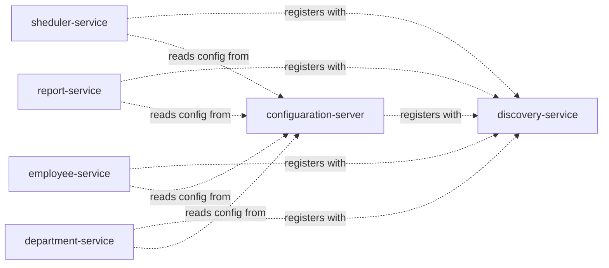

# Architecture Overview

_Generated by the Architect agent (Blueprint Scribe) from a scan on 2026-08-06T00:34:58.807Z._

For a per-class, per-method breakdown (signatures, source locations, resolved call graph, and full source text), see [function-reference.md](./function-reference.md).

## Modules

This workspace is a multi-module Maven build of 6 Spring Boot services, each independently deployable, coordinated through a config server and a Eureka discovery server.

| Module | Packaging | Key Spring dependencies |
|---|---|---|
| `sheduler-service` | war | spring-boot-starter-data-mongodb, spring-boot-starter-web, spring-cloud-starter-config, spring-cloud-starter-bootstrap, spring-cloud-starter-netflix-eureka-client, spring-boot-starter-test |
| `report-service` | war | spring-boot-starter-data-mongodb, spring-boot-starter-web, spring-boot-starter-webflux, spring-cloud-starter-config, spring-cloud-starter-bootstrap, spring-cloud-starter-netflix-eureka-client, spring-boot-starter-test |
| `employee-service` | war | spring-boot-starter-data-mongodb, spring-boot-starter-web, spring-cloud-starter-circuitbreaker-resilience4j, spring-cloud-starter-netflix-eureka-client, spring-boot-starter-actuator, spring-boot-starter-aop, spring-boot-starter-webflux, spring-cloud-starter-config, spring-cloud-starter-bootstrap, spring-boot-starter-test |
| `discovery-service` | war | spring-boot-starter-web, spring-cloud-starter-netflix-eureka-server, spring-boot-starter-test |
| `department-service` | war | spring-boot-starter-data-mongodb, spring-boot-starter-web, spring-cloud-starter-netflix-eureka-client, spring-cloud-starter-config, spring-cloud-starter-bootstrap, spring-boot-starter-test |
| `configuaration-server` | war | spring-boot-starter-actuator, spring-cloud-starter-netflix-eureka-client, spring-boot-starter-test |

## Service Map

## Type Breakdown by Layer

Counts are heuristic, based on annotations and naming conventions (e.g. `@RestController` → Controller, `@Repository`/`*Repository` interfaces → Repository).

| Module | Controller | Service | Repository | Entity/Document | DTO | Configuration | Exception Handler | Exception | Other |
|---|---|---|---|---|---|---|---|---|---|
| `sheduler-service` | 1 | 3 | 1 | 1 | 0 | 0 | 0 | 0 | 3 |
| `report-service` | 1 | 2 | 1 | 1 | 3 | 1 | 0 | 0 | 5 |
| `employee-service` | 1 | 2 | 1 | 1 | 3 | 1 | 1 | 1 | 6 |
| `discovery-service` | 0 | 0 | 0 | 0 | 0 | 0 | 0 | 0 | 1 |
| `department-service` | 1 | 2 | 1 | 1 | 1 | 0 | 0 | 0 | 2 |
| `configuaration-server` | 0 | 0 | 0 | 0 | 0 | 0 | 0 | 0 | 1 |

## REST API Surface

| Method | Path | Handler | Module |
|---|---|---|---|
| `POST` | `/api/v1/department` | DepartmentController.createDepartment() | `department-service` |
| `GET` | `/api/v1/department/{id}` | DepartmentController.getDepartment() | `department-service` |
| `GET` | `/api/v1/department/salary/{minSalary}` | DepartmentController.getAllDepartments() | `department-service` |
| `POST` | `/api/v1/employee` | EmployeeController.createEmployee() | `employee-service` |
| `GET` | `/api/v1/employee/{id}` | EmployeeController.getEmployee() | `employee-service` |
| `POST` | `/api/v1/employee/excelUpload` | EmployeeController.uploadEmployee() | `employee-service` |
| `GET` | `/api/v1/employee/salary/{id}` | EmployeeController.getEmployeeSalary() | `employee-service` |
| `GET` | `/api/v1/export` | EmployeeReportController.exportToExcel() | `report-service` |
| `GET` | `/api/v1/employee` | EmployeeSchedulerController.getAllEmployees() | `sheduler-service` |

## Frameworks & External Types in Play

Base classes/interfaces referenced by this codebase that are not defined in it (a proxy for the frameworks the code depends on):

- `MongoRepository` — referenced by 4 type(s)
- `SpringBootServletInitializer` — referenced by 1 type(s)
- `Exception` — referenced by 1 type(s)
- `ResponseEntityExceptionHandler` — referenced by 1 type(s)

## Live Graph Snapshot (Neo4j)

The knowledge graph is loaded into Neo4j. Node/relationship counts at generation time:

**Nodes**
- Method: 53
- Type: 50
- Package: 37
- MavenDependency: 19
- Endpoint: 9
- Module: 6
- ExternalType: 4

**Relationships**
- CONTAINS: 137
- HAS_METHOD: 53
- DEPENDS_ON: 49
- USES: 27
- CALLS: 17
- EXPOSES: 9
- EXTENDS: 7
- IMPLEMENTS: 4

## Ideas & Observations

- Each service (`department-service`, `employee-service`, `report-service`, `sheduler-service`) follows the same layered convention: `controller` → `service` → `repository` → `model`/`entity`, backed by MongoDB repositories.
- `configuaration-server` and `discovery-service` are infrastructure services (Spring Cloud Config + Eureka) that every business service depends on at startup via `bootstrap.properties`.
- No Feign clients were detected — cross-service calls, if any, likely go through `RestTemplate`/`WebClient` rather than declarative Feign interfaces. Worth confirming if service-to-service coupling should show up as graph edges.
- The generated Neo4j graph can be queried directly (e.g. `MATCH (m:Module)-[:CONTAINS]->(t:Type) RETURN m.name, count(t)`) for deeper, ad-hoc architecture questions beyond this static document.
