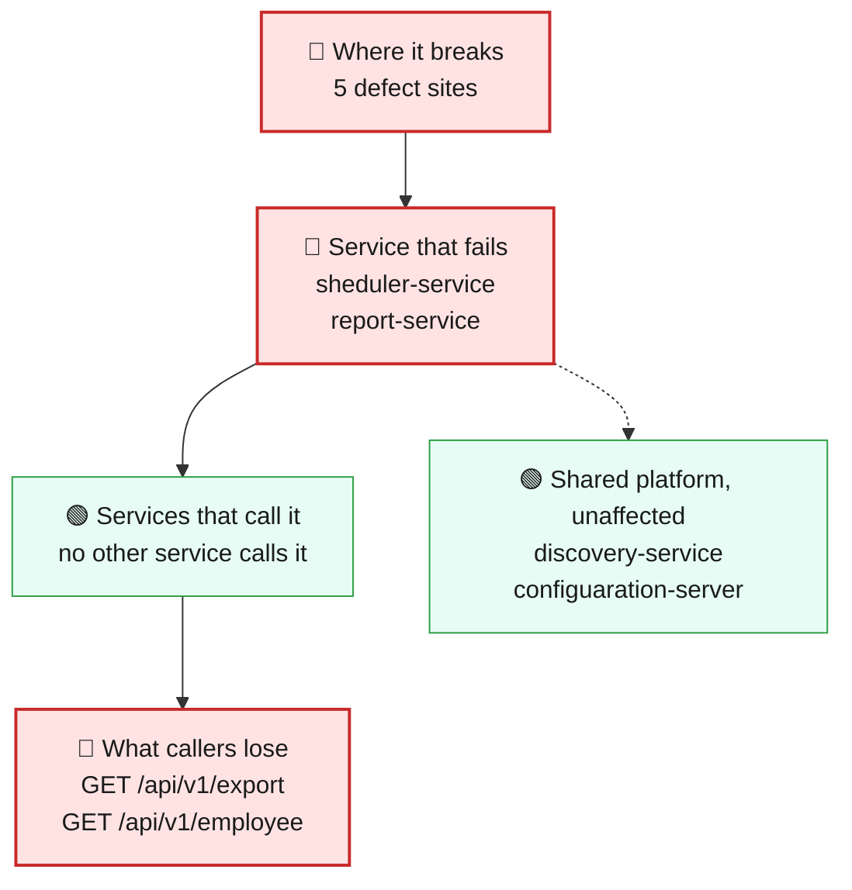
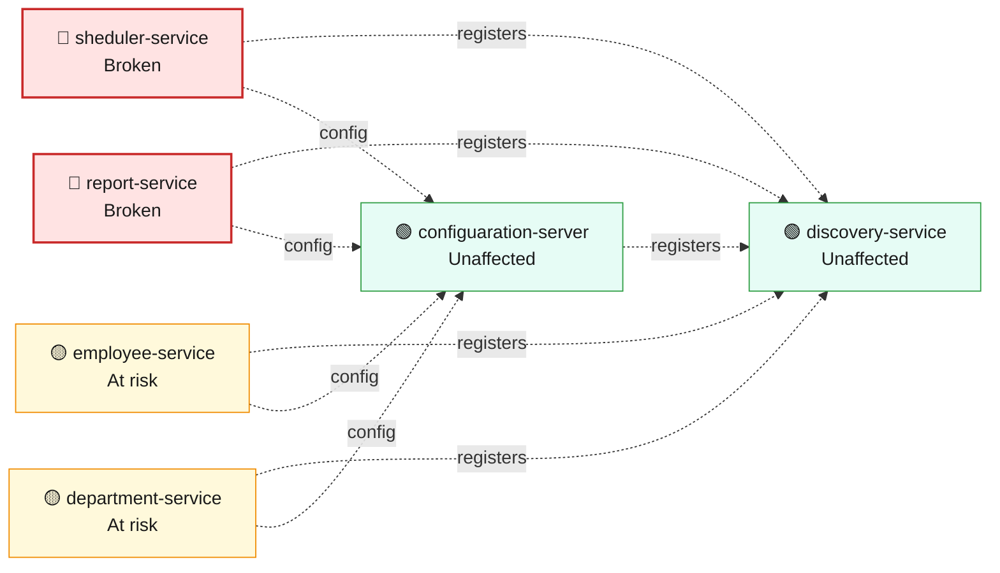

# Blast Radius — ISSUE-001

## Unbounded repository findAll() reads whole collections into memory across multiple services

> Two separate services can be knocked over by ordinary-looking requests, because both hand back the entire employee list instead of a reasonable slice of it.

_Generated by the Blast Radius Analyst on 2026-08-15. Reach measured 2026-08-15T02:57:41.832Z._

## At a glance

| | |
|---|---|
| **Priority** | P2 -- a real, deterministic availability risk that gets worse as the company grows, but it is a resource-exhaustion issue rather than an active data breach; fix before the employee dataset reaches a size where it bites in practice. |
| **Severity** | High |
| **How far it spreads** | Multiple services |
| **Services broken** | `sheduler-service`, `report-service` |
| **Services degraded** | none |
| **Endpoints down** | 2 of 10 |
| **Scheduled jobs hit** | 1 |
| **Confidence** | High |

Root cause: [docs/root-cause/root_cause_ISSUE-001.md](../../docs/root-cause/root_cause_ISSUE-001.md) · Issue: [docs/issues/ISSUE-001-unbounded-findall-usage.md](../../docs/issues/ISSUE-001-unbounded-findall-usage.md)

## 1. What is broken

The employee-listing endpoint (sheduler-service) and the payroll export endpoint (report-service) both build their response by loading every single employee record into memory first. Neither has any size limit. On a small dataset this is invisible; as the company's employee data grows, each of these requests gets slower and heavier, and a handful of people hitting either endpoint around the same time can use up all of the service's available memory and crash it. This happens every time either endpoint is called on a large enough dataset -- it is not occasional, it is a matter of how much data exists and how many people ask at once.

## 2. How far it spreads

| Ring | What it means |
|---|---|
| 🔴 Where it breaks | `EmployeeSchedulerServiceImpl.getAllEmployees()`, `EmployeeReportServiceImpl.getEmployees()`, `WomenDaySchedulerImpl.printWomenDayMessage()`, `EmployeeSchedulerController.getAllEmployees()`, `EmployeeReportController.exportToExcel()` |
| 🔴 Service that fails | In sheduler-service, the same unbounded read also feeds an internal scheduled job (a once-a-year 'Women's Day' message) that loads the full employee list and then filters it in application code -- so the job's memory and time cost grows the same way the endpoint's does, even though nobody outside the company ever triggers it directly. |
| 🟢 Services that call it | No other service calls either of these two broken services over HTTP for this data, so nothing downstream is degraded -- the damage is contained to the two services that actually contain the defect. |
| 🟡 Wider platform | Both services share the same MongoDB deployment as employee-service and department-service. A pure logic/memory problem inside sheduler-service or report-service does not by itself harm the database or its other clients, but if either service is repeatedly driven into memory exhaustion, the resulting instability (crashes, restarts, slow queries while it churns) adds load to that same shared database at the worst possible time. |

## 3. Which services are affected

| Service | Status | What happens to it |
|---|---|---|
| `sheduler-service` | 🔴 Broken | Contains the defect. This is where the failure starts. |
| `report-service` | 🔴 Broken | Contains the defect. This is where the failure starts. |
| `employee-service` | 🟡 At risk | Shares infrastructure with the broken service, so heavy load or exhaustion there can spill over. |
| `discovery-service` | 🟢 Unaffected | Not on any path to the defect. Keeps working normally. |
| `department-service` | 🟡 At risk | Shares infrastructure with the broken service, so heavy load or exhaustion there can spill over. |
| `configuaration-server` | 🟢 Unaffected | Not on any path to the defect. Keeps working normally. |

## 4. Which endpoints are affected

| Endpoint | Service | Status | What a caller sees |
|---|---|---|---|
| `GET /api/v1/export` | `report-service` | 🔴 Broken | Request fails — this path runs the defect |
| `GET /api/v1/employee` | `sheduler-service` | 🔴 Broken | Request fails — this path runs the defect |

8 endpoint(s) not affected

| Endpoint | Service |
|---|---|
| `GET /api/v1/department/{id}` | `department-service` |
| `GET /api/v1/department/salary/{minSalary}` | `department-service` |
| `POST /api/v1/department` | `department-service` |
| `GET /api/v1/employee/{id}` | `employee-service` |
| `GET /api/v1/employee/salary/{id}` | `employee-service` |
| `GET /api/v1/employee/search` | `employee-service` |
| `POST /api/v1/employee` | `employee-service` |
| `POST /api/v1/employee/excelUpload` | `employee-service` |

**Scheduled jobs on the failing path**

| Job | Service | Runs |
|---|---|---|
| `WomenDaySchedulerImpl.printWomenDayMessage()` | `sheduler-service` | cron `0 0 0 8 3 *` |

## 5. What happens on a single request

```mermaid
flowchart LR
  classDef broken fill:#ffe3e3,stroke:#c92a2a,stroke-width:2px,color:#1a1a1a
  classDef degraded fill:#fff3bf,stroke:#e8590c,stroke-width:2px,color:#1a1a1a
  classDef atrisk fill:#fff9db,stroke:#f08c00,stroke-width:1px,color:#1a1a1a
  classDef ok fill:#e6fcf5,stroke:#2f9e44,stroke-width:1px,color:#1a1a1a
  classDef neutral fill:#f1f3f5,stroke:#868e96,stroke-width:1px,color:#1a1a1a
  CALLER(["Caller"]):::neutral
  EP["GET /api/v1/export"]:::neutral
  CALLER --> EP
  N0["EmployeeReportController.exportToExcel()"]:::neutral
  EP --> N0
  N1["EmployeeSchedulerServiceImpl.getAllEmployees()"]:::neutral
  N0 --> N1
  N2["EmployeeReportServiceImpl.getEmployees()"]:::broken
  N1 --> N2
  FAIL["❌ loads the whole table before answering, no size limit"]:::broken
  N2 --> FAIL
```

## 6. Who feels it

| Who | What they experience | Status |
|---|---|---|
| Any anonymous caller on the network | A request to list employees, or to export the payroll spreadsheet, that becomes slower over time and can eventually time out or fail outright as the employee dataset grows -- and which anyone can trigger repeatedly, with no login required. | At risk |
| HR / payroll staff relying on the export feature | The payroll export either taking increasingly long to generate or failing/crashing the service entirely once the company has enough employees, right when they need the spreadsheet. | At risk |
| Anyone else using sheduler-service or report-service at the same time as a heavy request | Unrelated requests to the same service slowing down or failing, because the service is busy building an oversized response or has run out of memory. | Degraded |

## 7. What is NOT affected

Scoping the damage matters as much as describing it.

- Services working normally: `discovery-service`, `configuaration-server`
- employee-service, department-service, discovery-service, configuaration-server -- none of their code calls into the two broken read paths, and nothing in this issue is reachable from their own endpoints.
- Data correctness -- every returned record is accurate; the problem is volume and cost, not wrong data.
- Any endpoint in report-service or sheduler-service other than the two named here -- this issue is scoped to exactly two read paths, not the whole service.

## 8. Containment and priority

**Priority:** P2 -- a real, deterministic availability risk that gets worse as the company grows, but it is a resource-exhaustion issue rather than an active data breach; fix before the employee dataset reaches a size where it bites in practice.

**If it is not fixed:** As the workforce dataset grows, both endpoints get slower on every call, and the point at which a normal-sized burst of traffic causes an outage keeps getting closer -- eventually ordinary usage, not just an attacker, will be enough to crash either service during normal business hours (e.g. payroll running the export).

**Containment steps**

- Until fixed, watch memory/heap usage on sheduler-service and report-service and set alerts before they approach the configured heap limit.
- Consider a temporary reverse-proxy rate limit on GET /api/v1/employee and GET /api/v1/export to reduce how often the expensive path can be triggered concurrently.
- If the employee collection is already large, restrict who can reach these two endpoints at the network layer until a real fix ships.

The fix itself is in the root cause report: [Recommended Fix](../../docs/root-cause/root_cause_ISSUE-001.md).

## 9. Open questions

- Current and projected employee collection size, which determines how soon in practice this becomes an outage rather than a slow-but-working endpoint.
- Whether either service's container has a memory limit low enough that this could already be causing intermittent restarts that haven't been connected to this cause.

## Appendix — how this was measured

| Input | Detail |
|---|---|
| Root cause report | [docs/root-cause/root_cause_ISSUE-001.md](../../docs/root-cause/root_cause_ISSUE-001.md) |
| Issue report | [docs/issues/ISSUE-001-unbounded-findall-usage.md](../../docs/issues/ISSUE-001-unbounded-findall-usage.md) |
| Architecture document | [docs/architecture.md](../../docs/architecture.md) |
| Function reference | [docs/function-reference.md](../../docs/function-reference.md) |
| Code scan | `.architect/artifacts.json` |
| Knowledge graph | not used — skipped via --no-graph |

**Rules used to assign status**

- 🔴 **Broken** — the service contains the defect, or an endpoint whose handler reaches it
- 🟠 **Degraded** — the service calls a broken service over HTTP; its own code is sound
- 🟡 **At risk** — shares infrastructure with a broken service
- 🟢 **Unaffected** — no code path and no HTTP call to anything broken

Scope for this issue is **multi-service**, so every endpoint hosted by the broken service is marked down.

---

Sections 3, 4, 5 and 7 (service lists) are measured from the code scan and the knowledge graph. Sections 1, 2 (ring descriptions), 6 and 8 are the analyst's judgement, scoped to that measurement.
