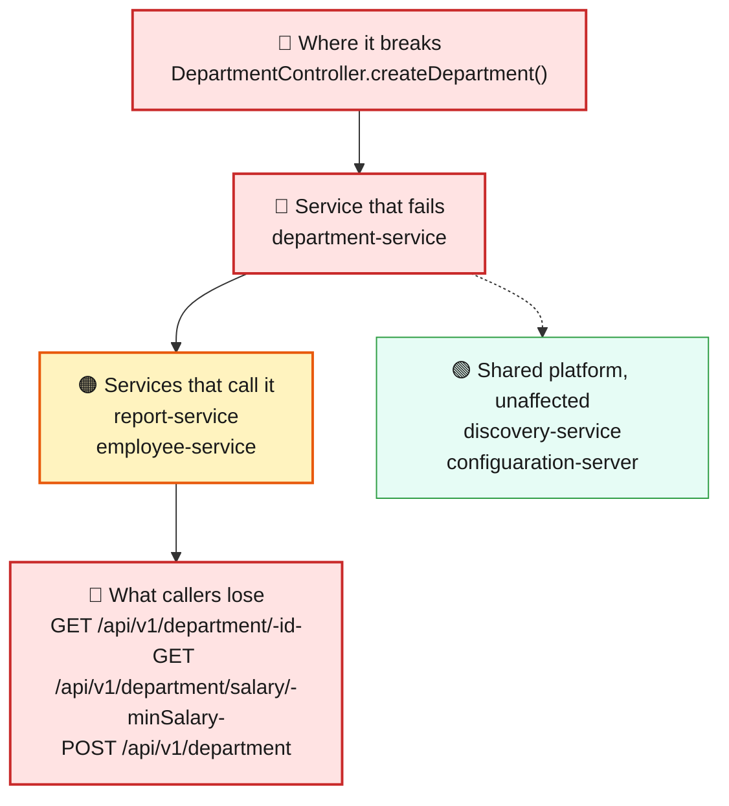
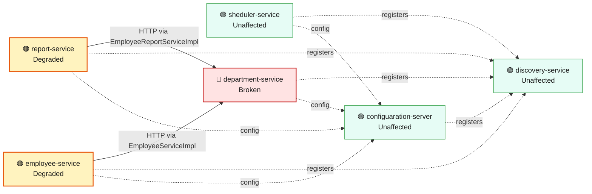
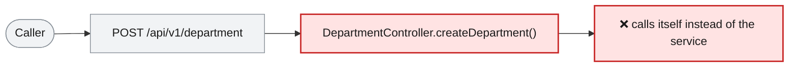

# Blast Radius — ISSUE-001

## Creating a department never completes and crashes the department-service worker thread

> Nobody can create a department — and because the defect stops the department service from building at all, its two working read endpoints go down with it and the two services that look up department data lose their source.

_Generated by the Blast Radius Analyst on 2026-08-06. Reach measured 2026-08-06T13:19:30.422Z._

## At a glance

| | |
|---|---|
| **Priority** | P1 — a core write path fails 100% of the time and the whole service cannot start; fix before any release |
| **Severity** | Critical |
| **How far it spreads** | One whole service |
| **Services broken** | `department-service` |
| **Services degraded** | `report-service`, `employee-service` |
| **Endpoints down** | 3 of 9 |
| **Scheduled jobs hit** | 0 |
| **Confidence** | High |

Root cause: [docs/root-cause/root_cause_ISSUE-001.md](../../docs/root-cause/root_cause_ISSUE-001.md) · Issue: [docs/issues/ISSUE-001-recursive-create-department.md](../../docs/issues/ISSUE-001-recursive-create-department.md)

## 1. What is broken

Creating a department fails every single time, with any input. The request never reaches the code that saves to the database, so nothing is stored and the caller gets an error instead of a confirmation. The defect also stops the department service from compiling, which means the service cannot be built or started at all — so its other two endpoints, which are written correctly, are unavailable for the same reason. This is not intermittent and there is no input that avoids it.

## 2. How far it spreads



| Ring | What it means |
|---|---|
| 🔴 Where it breaks | `DepartmentController.createDepartment()` |
| 🔴 Service that fails | All three department endpoints are down, not just the create one. Looking up a single department and listing departments by salary both have correct code, but they cannot serve traffic because the service they live in will not start. |
| 🟠 Services that call it | The employee service and the reporting service both ask the department service for department names and salaries over HTTP. Neither is broken in itself, but with no department service to call, the employee salary lookup and the payroll export lose the department half of their answer. Even once the service is running again, any department that could not be created stays missing, so employees assigned to it silently drop out of the export. |
| 🟢 Wider platform | The shared MongoDB database, the discovery server and the config server are all untouched. The failure happens before anything is written, so no stored data is affected or corrupted. |

## 3. Which services are affected



| Service | Status | What happens to it |
|---|---|---|
| `sheduler-service` | 🟢 Unaffected | Not on any path to the defect. Keeps working normally. |
| `report-service` | 🟠 Degraded | Calls the broken service over HTTP from `EmployeeReportServiceImpl`. Its own code is fine, but the data it needs does not arrive. |
| `employee-service` | 🟠 Degraded | Calls the broken service over HTTP from `EmployeeServiceImpl`. Its own code is fine, but the data it needs does not arrive. |
| `discovery-service` | 🟢 Unaffected | Not on any path to the defect. Keeps working normally. |
| `department-service` | 🔴 Broken | Contains the defect. This is where the failure starts. |
| `configuaration-server` | 🟢 Unaffected | Not on any path to the defect. Keeps working normally. |

## 4. Which endpoints are affected

| Endpoint | Service | Status | What a caller sees |
|---|---|---|---|
| `GET /api/v1/department/{id}` | `department-service` | 🔴 Broken | Request fails — the service hosting it is down |
| `GET /api/v1/department/salary/{minSalary}` | `department-service` | 🔴 Broken | Request fails — the service hosting it is down |
| `POST /api/v1/department` | `department-service` | 🔴 Broken | Request fails — this path runs the defect |
| `GET /api/v1/employee/salary/{id}` | `employee-service` | 🟠 Degraded | Responds, but with missing or stale data from the broken service |
| `GET /api/v1/export` | `report-service` | 🟠 Degraded | Responds, but with missing or stale data from the broken service |

<details><summary>4 endpoint(s) not affected</summary>

| Endpoint | Service |
|---|---|
| `GET /api/v1/employee/{id}` | `employee-service` |
| `POST /api/v1/employee` | `employee-service` |
| `POST /api/v1/employee/excelUpload` | `employee-service` |
| `GET /api/v1/employee` | `sheduler-service` |

</details>

## 5. What happens on a single request



## 6. Who feels it

| Who | What they experience | Status |
|---|---|---|
| Anyone setting up a new department | The create request returns an error and no department is created. Retrying does not help. | Blocked |
| Teams reading department details | Department lookups and the salary-band listing stop responding while the service is down, even though those features are not themselves faulty. | Blocked |
| Anyone checking an employee's salary | The salary lookup cannot resolve which department the employee belongs to, so it fails or returns incomplete details. | Degraded |
| Payroll reporting | The employee export still downloads, but rows for employees in departments that could not be created are missing from the spreadsheet. | Degraded |

## 7. What is NOT affected

Scoping the damage matters as much as describing it.

- Services working normally: `sheduler-service`, `discovery-service`, `configuaration-server`
- Creating an employee, looking up a single employee and the employee spreadsheet upload all keep working normally — only the employee salary lookup, which asks the department service for its answer, is affected.
- The scheduler service and its employee listing are untouched.
- No stored data is changed or corrupted; the failure happens before anything reaches the database.
- The discovery server and config server are unaffected, so the rest of the platform starts and registers as usual.

## 8. Containment and priority

**Priority:** P1 — a core write path fails 100% of the time and the whole service cannot start; fix before any release

**If it is not fixed:** Nothing improves on its own. The service stays unbuildable, so department data cannot grow, and every employee added during the outage accumulates as another record that will be missing department details in reports once the service returns.

**Containment steps**

- Treat the department service as unavailable until the fix ships — there is no partial mode where some of it works.
- Tell the teams that own the employee salary lookup and the payroll export that their department data will be incomplete until then.
- Do not add departments through a direct database write as a workaround; that skips the response mapping the API contract depends on.
- After the fix, check for employees created during the outage whose department was never set up, and reconcile them before trusting the next export.

The fix itself is in the root cause report: [Recommended Fix](../../docs/root-cause/root_cause_ISSUE-001.md).

## 9. Open questions

- Whether any client retries this endpoint automatically. If the module is patched to compile while the self-call remains, retries would turn a functional failure into thread-pool exhaustion, which the code alone cannot show.

## Appendix — how this was measured

| Input | Detail |
|---|---|
| Root cause report | [docs/root-cause/root_cause_ISSUE-001.md](../../docs/root-cause/root_cause_ISSUE-001.md) |
| Issue report | [docs/issues/ISSUE-001-recursive-create-department.md](../../docs/issues/ISSUE-001-recursive-create-department.md) |
| Architecture document | [docs/architecture.md](../../docs/architecture.md) |
| Function reference | [docs/function-reference.md](../../docs/function-reference.md) |
| Code scan | `.architect/artifacts.json` |
| Knowledge graph | Neo4j, traversal depth 6 |

**Rules used to assign status**

- 🔴 **Broken** — the service contains the defect, or an endpoint whose handler reaches it
- 🟠 **Degraded** — the service calls a broken service over HTTP; its own code is sound
- 🟡 **At risk** — shares infrastructure with a broken service
- 🟢 **Unaffected** — no code path and no HTTP call to anything broken

Scope for this issue is **service**, so every endpoint hosted by the broken service is marked down.

<details><summary>Graph queries executed</summary>

**endpoints whose handler reaches the defect**

```cypher
MATCH (ty:Type)-[:EXPOSES]->(e:Endpoint)
       MATCH (ty)-[:HAS_METHOD]->(handler:Method)
       MATCH (handler)-[:CALLS*0..6]->(target:Method)
       WHERE target.id IN $defectIds
       RETURN DISTINCT e.id AS endpoint, ty.module AS module, ty.name AS controller
```

**modules that reach the defect in code**

```cypher
MATCH (caller:Method)-[:CALLS*1..6]->(target:Method)
       WHERE target.id IN $defectIds
       MATCH (ct:Type)-[:HAS_METHOD]->(caller)
       RETURN DISTINCT ct.module AS module
```

**endpoint count per affected module**

```cypher
MATCH (m:Module)-[:CONTAINS]->(ty:Type)-[:EXPOSES]->(e:Endpoint)
       WHERE m.name IN $modules
       RETURN m.name AS module, collect(DISTINCT e.id) AS endpoints
```

**types depending on the affected modules**

```cypher
MATCH (other:Type)-[:USES]->(t:Type)
       WHERE t.module IN $modules AND other.module <> t.module
       RETURN DISTINCT other.module AS module, other.name AS type, t.name AS dependsOn
```

**infrastructure shared with other modules**

```cypher
MATCH (m:Module)-[:DEPENDS_ON]->(dep:MavenDependency)<-[:DEPENDS_ON]-(other:Module)
       WHERE m.name IN $modules AND NOT other.name IN $modules
         AND dep.artifactId IN ['spring-boot-starter-data-mongodb','spring-cloud-starter-config','spring-cloud-starter-netflix-eureka-client']
       RETURN dep.artifactId AS dependency, collect(DISTINCT other.name) AS alsoUsedBy
```

**graph size**

```cypher
MATCH (n) RETURN labels(n)[0] AS label, count(*) AS count ORDER BY count DESC
```

</details>

---

Sections 3, 4, 5 and 7 (service lists) are measured from the code scan and the knowledge graph. Sections 1, 2 (ring descriptions), 6 and 8 are the analyst's judgement, scoped to that measurement.
