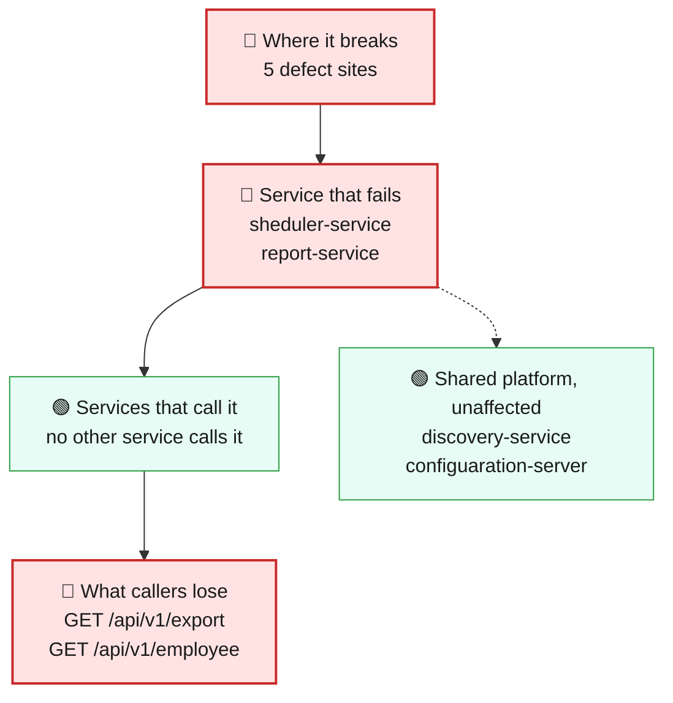
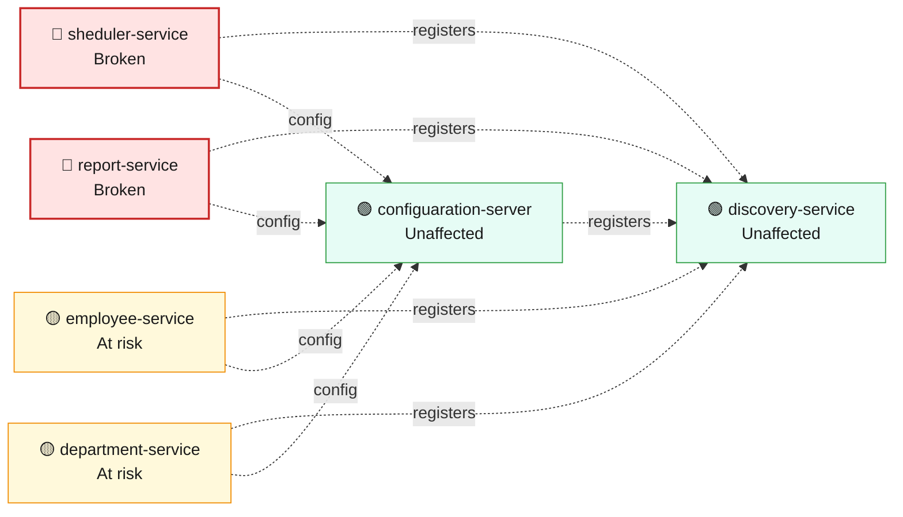

# Blast Radius — ISSUE-002

## Unbounded repository findAll() reads whole collections into memory across multiple services

> Two services load the entire employee list into memory on every call, so as the workforce grows these endpoints get slower and eventually take their service down — and one of them hands the whole employee dataset to any caller that asks.

_Generated by the Blast Radius Analyst on 2026-08-06. Reach measured 2026-08-06T13:19:32.743Z._

## At a glance

| | |
|---|---|
| **Priority** | P2 — nothing is failing today, but the failure is deterministic as data grows and takes whole service instances with it; fix before the employee collection reaches production volume. Raise to P1 if either endpoint is reachable from an untrusted network, since the cost asymmetry makes it a trivial denial-of-service lever. |
| **Severity** | High |
| **How far it spreads** | Multiple services |
| **Services broken** | `sheduler-service`, `report-service` |
| **Services degraded** | none |
| **Endpoints down** | 2 of 9 |
| **Scheduled jobs hit** | 1 |
| **Confidence** | Medium |

Root cause: [docs/root-cause/root_cause_ISSUE-002.md](../../docs/root-cause/root_cause_ISSUE-002.md) · Issue: [docs/issues/ISSUE-002-unbounded-findall-usage.md](../../docs/issues/ISSUE-002-unbounded-findall-usage.md)

## 1. What is broken

Nothing fails today on a small dataset, which is exactly why this is easy to miss. Both the scheduler service and the reporting service fetch every employee record at once, with no page size and no filter, and then do their filtering and joining in memory afterwards. The cost of a single request is therefore set by how many employees exist, not by what the caller asked for. As the collection grows, response times climb, memory pressure rises, and at production volume a handful of simultaneous requests is enough to exhaust the service's memory and take the instance down. The export path is the more expensive of the two because it holds the employee list, the department list, the joined result and the generated spreadsheet in memory at the same time.

## 2. How far it spreads



| Ring | What it means |
|---|---|
| 🔴 Where it breaks | `EmployeeSchedulerServiceImpl.getAllEmployees()`, `EmployeeReportServiceImpl.getEmployees()`, `WomenDaySchedulerImpl.printWomenDayMessage()`, `EmployeeSchedulerController.getAllEmployees()`, `EmployeeReportController.exportToExcel()` |
| 🔴 Service that fails | In the scheduler service, the employee listing endpoint and the annual Women's Day job share the same unbounded fetch, so the job pulls the entire workforce every 8 March just to print a handful of names. In the reporting service, the spreadsheet export is the only endpoint and it is the affected one, so a memory failure there takes reporting out entirely. |
| 🟢 Services that call it | No other service calls these two over HTTP, so the failure does not propagate outward through the API. The reporting service does make an outbound call to the department service while building the export, but that traffic is normal and the department service is not put at risk by it. |
| 🟡 Wider platform | All four business services share one MongoDB instance. Every unbounded fetch is a full collection scan on that shared database, so heavy or repeated use of these two endpoints adds load that the employee and department services feel as slower queries, even though their own code is sound. |

## 3. Which services are affected



| Service | Status | What happens to it |
|---|---|---|
| `sheduler-service` | 🔴 Broken | Contains the defect. This is where the failure starts. |
| `report-service` | 🔴 Broken | Contains the defect. This is where the failure starts. |
| `employee-service` | 🟡 At risk | Shares infrastructure with the broken service, so heavy load or exhaustion there can spill over. |
| `discovery-service` | 🟢 Unaffected | Not on any path to the defect. Keeps working normally. |
| `department-service` | 🟡 At risk | Shares infrastructure with the broken service, so heavy load or exhaustion there can spill over. |
| `configuaration-server` | 🟢 Unaffected | Not on any path to the defect. Keeps working normally. |

## 4. Which endpoints are affected

| Endpoint | Service | Status | What a caller sees |
|---|---|---|---|
| `GET /api/v1/export` | `report-service` | 🔴 Broken | Request fails — this path runs the defect |
| `GET /api/v1/employee` | `sheduler-service` | 🔴 Broken | Request fails — this path runs the defect |

<details><summary>7 endpoint(s) not affected</summary>

| Endpoint | Service |
|---|---|
| `GET /api/v1/department/{id}` | `department-service` |
| `GET /api/v1/department/salary/{minSalary}` | `department-service` |
| `POST /api/v1/department` | `department-service` |
| `GET /api/v1/employee/{id}` | `employee-service` |
| `GET /api/v1/employee/salary/{id}` | `employee-service` |
| `POST /api/v1/employee` | `employee-service` |
| `POST /api/v1/employee/excelUpload` | `employee-service` |

</details>

**Scheduled jobs on the failing path**

| Job | Service | Runs |
|---|---|---|
| `WomenDaySchedulerImpl.printWomenDayMessage()` | `sheduler-service` | cron `0 0 0 8 3 *` |

## 5. What happens on a single request

```mermaid
flowchart LR
  classDef broken fill:#ffe3e3,stroke:#c92a2a,stroke-width:2px,color:#1a1a1a
  classDef degraded fill:#fff3bf,stroke:#e8590c,stroke-width:2px,color:#1a1a1a
  classDef atrisk fill:#fff9db,stroke:#f08c00,stroke-width:1px,color:#1a1a1a
  classDef ok fill:#e6fcf5,stroke:#2f9e44,stroke-width:1px,color:#1a1a1a
  classDef neutral fill:#f1f3f5,stroke:#868e96,stroke-width:1px,color:#1a1a1a
  CALLER(["Caller"]):::neutral
  EP["GET /api/v1/export"]:::neutral
  CALLER --> EP
  N0["EmployeeReportController.exportToExcel()"]:::neutral
  EP --> N0
  N1["EmployeeSchedulerServiceImpl.getAllEmployees()"]:::neutral
  N0 --> N1
  N2["EmployeeReportServiceImpl.getEmployees()"]:::broken
  N1 --> N2
  FAIL["❌ loads the whole collection at once"]:::broken
  N2 --> FAIL
```



## 6. Who feels it

| Who | What they experience | Status |
|---|---|---|
| Anyone calling the employee listing endpoint | The response gets slower as the company grows and eventually times out or fails. It also returns every employee record in full, including address and phone number, whether or not the caller needed them. | Degraded |
| Payroll and reporting teams | The spreadsheet export takes longer every quarter and, past a certain size, fails part-way through instead of downloading. | At risk |
| Everyone using the scheduler or reporting service | When one large request exhausts the service's memory, the whole instance restarts and unrelated requests to it fail during the restart. | At risk |
| Users of the employee and department services | Slower responses while a large listing or export is running, because all four services query the same database. | At risk |

## 7. What is NOT affected

Scoping the damage matters as much as describing it.

- Services working normally: `discovery-service`, `configuaration-server`
- The department service and the employee service are not on the failing path — none of their endpoints run the unbounded read, and all seven of them keep working; their only exposure is indirect, through the shared database.
- No data is corrupted or lost. This is a read-side problem only; nothing is written incorrectly.
- The discovery server and config server are unaffected.
- The problem is invisible on development and test datasets, so local and CI behaviour stays normal — which is why it needs a deliberate load check rather than a functional test.

## 8. Containment and priority

**Priority:** P2 — nothing is failing today, but the failure is deterministic as data grows and takes whole service instances with it; fix before the employee collection reaches production volume. Raise to P1 if either endpoint is reachable from an untrusted network, since the cost asymmetry makes it a trivial denial-of-service lever.

**If it is not fixed:** The margin shrinks every time an employee is added. The endpoints degrade quietly, then fail suddenly at a size nobody has picked in advance, and the same pattern gets copied into the next service that needs to read a collection.

**Containment steps**

- Put an alert on heap usage and garbage-collection time for the scheduler and reporting services, so the trend is visible before the first failure.
- Confirm whether the employee listing and export endpoints are reachable from outside the internal network, and restrict them if they are — neither requires authentication today.
- Track the size of the employee collection and treat it as the countdown to failure, not as a background statistic.
- Until pagination ships, run the export off-peak and avoid triggering it concurrently.
- Do not raise the heap limit as a substitute for a fix — it moves the failure point without removing it.

The fix itself is in the root cause report: [Recommended Fix](../../docs/root-cause/root_cause_ISSUE-002.md).

## 9. Open questions

- The collection size at which each endpoint actually fails depends on document size, heap configuration and concurrency — none of which are visible in the repository. The impact above is directionally certain but the timing is not.
- How often the export is triggered, and by how many people at once, decides whether this surfaces as slowness or as an outage.
- Whether these two services are exposed beyond the internal network, which is the difference between a P2 scalability problem and a P1 availability risk.

## Appendix — how this was measured

| Input | Detail |
|---|---|
| Root cause report | [docs/root-cause/root_cause_ISSUE-002.md](../../docs/root-cause/root_cause_ISSUE-002.md) |
| Issue report | [docs/issues/ISSUE-002-unbounded-findall-usage.md](../../docs/issues/ISSUE-002-unbounded-findall-usage.md) |
| Architecture document | [docs/architecture.md](../../docs/architecture.md) |
| Function reference | [docs/function-reference.md](../../docs/function-reference.md) |
| Code scan | `.architect/artifacts.json` |
| Knowledge graph | Neo4j, traversal depth 6 |

**Rules used to assign status**

- 🔴 **Broken** — the service contains the defect, or an endpoint whose handler reaches it
- 🟠 **Degraded** — the service calls a broken service over HTTP; its own code is sound
- 🟡 **At risk** — shares infrastructure with a broken service
- 🟢 **Unaffected** — no code path and no HTTP call to anything broken

Scope for this issue is **multi-service**, so every endpoint hosted by the broken service is marked down.

<details><summary>Graph queries executed</summary>

**endpoints whose handler reaches the defect**

```cypher
MATCH (ty:Type)-[:EXPOSES]->(e:Endpoint)
       MATCH (ty)-[:HAS_METHOD]->(handler:Method)
       MATCH (handler)-[:CALLS*0..6]->(target:Method)
       WHERE target.id IN $defectIds
       RETURN DISTINCT e.id AS endpoint, ty.module AS module, ty.name AS controller
```

**modules that reach the defect in code**

```cypher
MATCH (caller:Method)-[:CALLS*1..6]->(target:Method)
       WHERE target.id IN $defectIds
       MATCH (ct:Type)-[:HAS_METHOD]->(caller)
       RETURN DISTINCT ct.module AS module
```

**endpoint count per affected module**

```cypher
MATCH (m:Module)-[:CONTAINS]->(ty:Type)-[:EXPOSES]->(e:Endpoint)
       WHERE m.name IN $modules
       RETURN m.name AS module, collect(DISTINCT e.id) AS endpoints
```

**types depending on the affected modules**

```cypher
MATCH (other:Type)-[:USES]->(t:Type)
       WHERE t.module IN $modules AND other.module <> t.module
       RETURN DISTINCT other.module AS module, other.name AS type, t.name AS dependsOn
```

**infrastructure shared with other modules**

```cypher
MATCH (m:Module)-[:DEPENDS_ON]->(dep:MavenDependency)<-[:DEPENDS_ON]-(other:Module)
       WHERE m.name IN $modules AND NOT other.name IN $modules
         AND dep.artifactId IN ['spring-boot-starter-data-mongodb','spring-cloud-starter-config','spring-cloud-starter-netflix-eureka-client']
       RETURN dep.artifactId AS dependency, collect(DISTINCT other.name) AS alsoUsedBy
```

**graph size**

```cypher
MATCH (n) RETURN labels(n)[0] AS label, count(*) AS count ORDER BY count DESC
```

</details>

---

Sections 3, 4, 5 and 7 (service lists) are measured from the code scan and the knowledge graph. Sections 1, 2 (ring descriptions), 6 and 8 are the analyst's judgement, scoped to that measurement.
