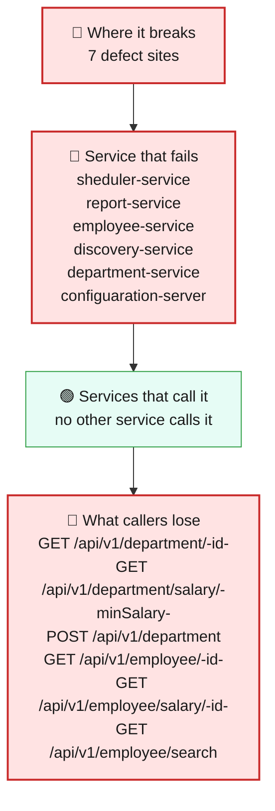
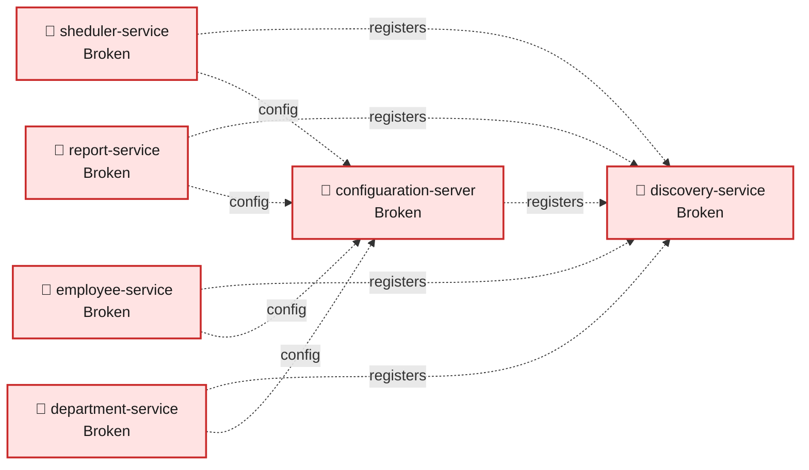

# Blast Radius — ISSUE-002

## Employee PII and payroll data are exposed to unauthenticated callers and written to application logs

> Every service in this system will hand its data to anyone who asks, because none of them ever check who's asking.

_Generated by the Blast Radius Analyst on 2026-08-15. Reach measured 2026-08-15T03:08:14.442Z._

## At a glance

| | |
|---|---|
| **Priority** | P0 -- unauthenticated, complete, deterministic exposure of regulated personal and payroll data across the entire platform, plus exposed infrastructure credentials; this is the most severe finding in the register and should be treated as an active incident, not a backlog item. |
| **Severity** | Critical |
| **How far it spreads** | Multiple services |
| **Services broken** | `sheduler-service`, `report-service`, `employee-service`, `discovery-service`, `department-service`, `configuaration-server` |
| **Services degraded** | none |
| **Endpoints down** | 10 of 10 |
| **Scheduled jobs hit** | 0 |
| **Confidence** | High |

Root cause: [docs/root-cause/root_cause_ISSUE-002.md](../../docs/root-cause/root_cause_ISSUE-002.md) · Issue: [docs/issues/ISSUE-002-unauthenticated-pii-exposure.md](../../docs/issues/ISSUE-002-unauthenticated-pii-exposure.md)

## 1. What is broken

There is no login, token, or any other form of identity check anywhere in this platform. Every one of the ten API endpoints across all six services -- reading employee records, reading and downloading salaries, creating and bulk-uploading employees, and even the internal service registry and configuration store -- will respond fully to a completely anonymous caller, every single time, with no exceptions and no conditions. On top of that, several services also write the same sensitive information (names, salaries) into their own log files as a normal part of handling a request, so a second, independent copy of the same data ends up somewhere with typically even less access control than the database itself.

## 2. How far it spreads

| Ring | What it means |
|---|---|
| 🔴 Where it breaks | `EmployeeSchedulerController.getAllEmployees()`, `EmployeeReportController.exportToExcel()`, `EmployeeReportServiceImpl.getEmployees()`, `EmployeeController.getEmployee()`, `EmployeeController.createEmployee()`, `EmployeeController.searchEmployees()`, `DepartmentController.getAllDepartments()` |
| 🔴 Service that fails | Within each of the six services, every endpoint that service hosts is affected the same way -- this is not one bad endpoint among many safe ones, it is the complete absence of a control that every endpoint in the system was implicitly relying on already existing. |
| 🟢 Services that call it | Because no service authenticates any caller -- including other services -- this is not a chain reaction from one broken service to its callers; every service is independently and directly exposed on its own. |
| 🟢 Wider platform | The two infrastructure services are exposed the same way: the configuration server hands out the full application configuration -- including database connection details -- to anyone who asks, and the service registry can be read by anyone and, more seriously, can accept a rogue service registering itself under a real service's name, letting that rogue service intercept traffic meant for the real one. |

## 3. Which services are affected

| Service | Status | What happens to it |
|---|---|---|
| `sheduler-service` | 🔴 Broken | Contains the defect. This is where the failure starts. |
| `report-service` | 🔴 Broken | Contains the defect. This is where the failure starts. |
| `employee-service` | 🔴 Broken | Contains the defect. This is where the failure starts. |
| `discovery-service` | 🔴 Broken | Contains the defect. This is where the failure starts. |
| `department-service` | 🔴 Broken | Contains the defect. This is where the failure starts. |
| `configuaration-server` | 🔴 Broken | Contains the defect. This is where the failure starts. |

## 4. Which endpoints are affected

| Endpoint | Service | Status | What a caller sees |
|---|---|---|---|
| `GET /api/v1/department/{id}` | `department-service` | 🔴 Broken | Request fails — the service hosting it is down |
| `GET /api/v1/department/salary/{minSalary}` | `department-service` | 🔴 Broken | Request fails — this path runs the defect |
| `POST /api/v1/department` | `department-service` | 🔴 Broken | Request fails — the service hosting it is down |
| `GET /api/v1/employee/{id}` | `employee-service` | 🔴 Broken | Request fails — this path runs the defect |
| `GET /api/v1/employee/salary/{id}` | `employee-service` | 🔴 Broken | Request fails — the service hosting it is down |
| `GET /api/v1/employee/search` | `employee-service` | 🔴 Broken | Request fails — this path runs the defect |
| `POST /api/v1/employee` | `employee-service` | 🔴 Broken | Request fails — this path runs the defect |
| `POST /api/v1/employee/excelUpload` | `employee-service` | 🔴 Broken | Request fails — the service hosting it is down |
| `GET /api/v1/export` | `report-service` | 🔴 Broken | Request fails — this path runs the defect |
| `GET /api/v1/employee` | `sheduler-service` | 🔴 Broken | Request fails — this path runs the defect |

## 5. What happens on a single request

```mermaid
flowchart LR
  classDef broken fill:#ffe3e3,stroke:#c92a2a,stroke-width:2px,color:#1a1a1a
  classDef degraded fill:#fff3bf,stroke:#e8590c,stroke-width:2px,color:#1a1a1a
  classDef atrisk fill:#fff9db,stroke:#f08c00,stroke-width:1px,color:#1a1a1a
  classDef ok fill:#e6fcf5,stroke:#2f9e44,stroke-width:1px,color:#1a1a1a
  classDef neutral fill:#f1f3f5,stroke:#868e96,stroke-width:1px,color:#1a1a1a
  CALLER(["Caller"]):::neutral
  EP["GET /api/v1/department/salary/-minSalary-"]:::neutral
  CALLER --> EP
  N0["DepartmentController.getAllDepartments()"]:::neutral
  EP --> N0
  N1["EmployeeSchedulerController.getAllEmployees()"]:::neutral
  N0 --> N1
  N2["EmployeeReportController.exportToExcel()"]:::broken
  N1 --> N2
  FAIL["❌ no login anywhere, every endpoint answers anyone"]:::broken
  N2 --> FAIL
```

## 6. Who feels it

| Who | What they experience | Status |
|---|---|---|
| Every employee whose data is stored in this system | Nothing directly -- but their full name, home address, phone number, gender and salary can be downloaded in bulk by any stranger with network access to these services, without that person ever needing a password. | Blocked |
| HR and payroll teams | Their systems appear to work normally, but they have no way to know who else has already read or copied the same data -- there is no login, so there is no record of who accessed what. | Blocked |
| Anyone operating or maintaining this platform | The configuration store and service registry are both fully open, meaning the database credentials themselves are exposed and a malicious actor could impersonate a real internal service. | Blocked |

## 7. What is NOT affected

Scoping the damage matters as much as describing it.

- Data correctness -- every response is accurate; the problem is who can see it, not what it says.
- Nothing in this system requires a password today, so there is no partial protection anywhere to point to as still working.

## 8. Containment and priority

**Priority:** P0 -- unauthenticated, complete, deterministic exposure of regulated personal and payroll data across the entire platform, plus exposed infrastructure credentials; this is the most severe finding in the register and should be treated as an active incident, not a backlog item.

**If it is not fixed:** Every day this remains open, the entire workforce dataset stays downloadable by anyone who finds these services, and the exposed configuration/registry surface means the platform's own infrastructure credentials and internal traffic are at risk, not just the application data.

**Containment steps**

- Until a real fix ships, restrict network access to these services to a trusted internal network only (e.g. a VPN or private network), since nothing in the application itself will stop an anonymous caller.
- Rotate any credentials currently stored in the configuration server, since they are readable by anyone who can reach it today.
- Monitor the service registry for unexpected service registrations, which would indicate an attempted impersonation.

The fix itself is in the root cause report: [Recommended Fix](../../docs/root-cause/root_cause_ISSUE-002.md).

## 9. Open questions

- Whether these services are reachable from the public internet today or only from a private network -- this materially changes how urgently containment steps are needed, though it does not change the underlying defect.
- Whether any of this data has already been accessed by someone without authorisation, which would need to be treated as a breach investigation rather than only a fix.

## Appendix — how this was measured

| Input | Detail |
|---|---|
| Root cause report | [docs/root-cause/root_cause_ISSUE-002.md](../../docs/root-cause/root_cause_ISSUE-002.md) |
| Issue report | [docs/issues/ISSUE-002-unauthenticated-pii-exposure.md](../../docs/issues/ISSUE-002-unauthenticated-pii-exposure.md) |
| Architecture document | [docs/architecture.md](../../docs/architecture.md) |
| Function reference | [docs/function-reference.md](../../docs/function-reference.md) |
| Code scan | `.architect/artifacts.json` |
| Knowledge graph | not used — skipped via --no-graph |

**Rules used to assign status**

- 🔴 **Broken** — the service contains the defect, or an endpoint whose handler reaches it
- 🟠 **Degraded** — the service calls a broken service over HTTP; its own code is sound
- 🟡 **At risk** — shares infrastructure with a broken service
- 🟢 **Unaffected** — no code path and no HTTP call to anything broken

Scope for this issue is **multi-service**, so every endpoint hosted by the broken service is marked down.

---

Sections 3, 4, 5 and 7 (service lists) are measured from the code scan and the knowledge graph. Sections 1, 2 (ring descriptions), 6 and 8 are the analyst's judgement, scoped to that measurement.
