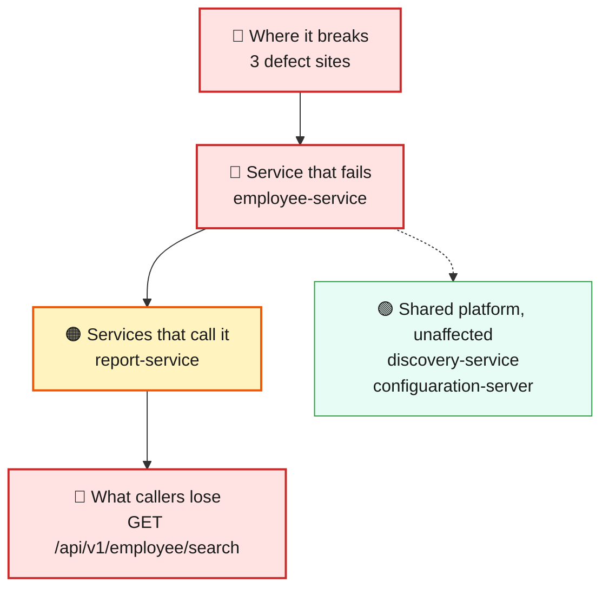
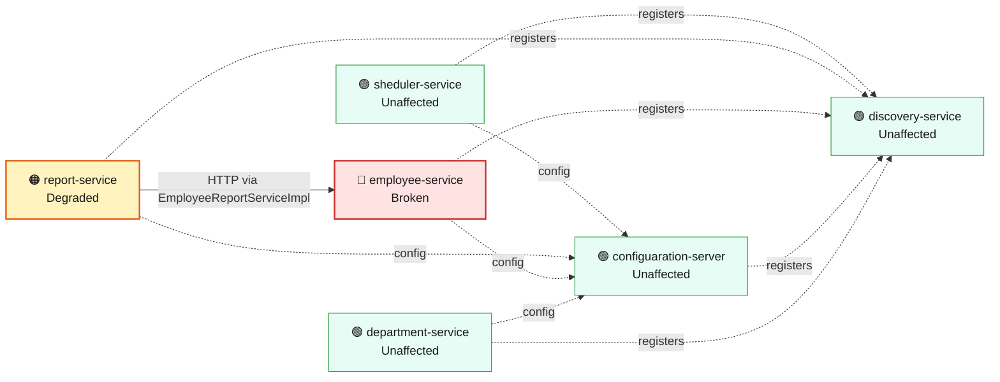

# Blast Radius — ISSUE-003

## MongoDB (NoSQL) injection in the employee search endpoint via string-concatenated BasicQuery

> Anyone on the network can pull the entire employee list, bypassing the search box, without logging in.

_Generated by the Blast Radius Analyst on 2026-08-14. Reach measured 2026-08-14T21:22:58.899Z._

## At a glance

| | |
|---|---|
| **Priority** | P1 — unauthenticated, deterministic exposure of the full employee PII collection; fix before the next release, not on the general backlog. |
| **Severity** | Critical |
| **How far it spreads** | One endpoint |
| **Services broken** | `employee-service` |
| **Services degraded** | `report-service` |
| **Endpoints down** | 1 of 10 |
| **Scheduled jobs hit** | 0 |
| **Confidence** | High |

Root cause: [docs/root-cause/root_cause_ISSUE-003.md](../../docs/root-cause/root_cause_ISSUE-003.md) · Issue: [docs/issues/ISSUE-003-nosql-injection-employee-search.md](../../docs/issues/ISSUE-003-nosql-injection-employee-search.md)

## 1. What is broken

The employee search feature does not actually filter by what you search for — it builds the underlying database question out of the search text itself. A normal search works fine, but a specially crafted search value can rewrite that question so it returns every employee instead of just the ones that match. This happens every time that exact kind of value is sent; it is not intermittent.

## 2. How far it spreads

| Ring | What it means |
|---|---|
| 🔴 Where it breaks | `EmployeeController.searchEmployees()`, `EmployeeServiceImpl.searchEmployees()`, `EmployeeSearchRepository.searchEmployees()` |
| 🔴 Service that fails | Only the search endpoint (GET /api/v1/employee/search) is affected. The other employee-service endpoints — create, fetch by id, salary lookup, Excel upload — build their own database calls independently and do not share this flaw, so they keep working correctly. |
| 🟠 Services that call it | The report service (report-service) does not call the search endpoint — its own export feature calls a different employee-service endpoint — so it is not pulled into this particular failure even though it does depend on employee-service in general. |
| 🟢 Wider platform | The discovery server, config server, department-service and scheduler-service share no code path with this endpoint and are untouched. The shared MongoDB data store is only at risk if an attacker also triggers the resource-exhaustion variant described in the root cause report (an unanchored or JavaScript-evaluating query), which is a related but distinct concern from the data exposure itself. |

## 3. Which services are affected

| Service | Status | What happens to it |
|---|---|---|
| `sheduler-service` | 🟢 Unaffected | Not on any path to the defect. Keeps working normally. |
| `report-service` | 🟠 Degraded | Calls the broken service over HTTP from `EmployeeReportServiceImpl`. Its own code is fine, but the data it needs does not arrive. |
| `employee-service` | 🔴 Broken | Contains the defect. This is where the failure starts. |
| `discovery-service` | 🟢 Unaffected | Not on any path to the defect. Keeps working normally. |
| `configuaration-server` | 🟢 Unaffected | Not on any path to the defect. Keeps working normally. |
| `department-service` | 🟢 Unaffected | Not on any path to the defect. Keeps working normally. |

## 4. Which endpoints are affected

| Endpoint | Service | Status | What a caller sees |
|---|---|---|---|
| `GET /api/v1/employee/search` | `employee-service` | 🔴 Broken | Request fails — this path runs the defect |
| `GET /api/v1/export` | `report-service` | 🟠 Degraded | Responds, but with missing or stale data from the broken service |

8 endpoint(s) not affected

| Endpoint | Service |
|---|---|
| `GET /api/v1/department/{id}` | `department-service` |
| `GET /api/v1/department/salary/{minSalary}` | `department-service` |
| `POST /api/v1/department` | `department-service` |
| `GET /api/v1/employee/{id}` | `employee-service` |
| `GET /api/v1/employee/salary/{id}` | `employee-service` |
| `POST /api/v1/employee` | `employee-service` |
| `POST /api/v1/employee/excelUpload` | `employee-service` |
| `GET /api/v1/employee` | `sheduler-service` |

## 5. What happens on a single request

```mermaid
flowchart LR
  classDef broken fill:#ffe3e3,stroke:#c92a2a,stroke-width:2px,color:#1a1a1a
  classDef degraded fill:#fff3bf,stroke:#e8590c,stroke-width:2px,color:#1a1a1a
  classDef atrisk fill:#fff9db,stroke:#f08c00,stroke-width:1px,color:#1a1a1a
  classDef ok fill:#e6fcf5,stroke:#2f9e44,stroke-width:1px,color:#1a1a1a
  classDef neutral fill:#f1f3f5,stroke:#868e96,stroke-width:1px,color:#1a1a1a
  CALLER(["Caller"]):::neutral
  EP["GET /api/v1/employee/search"]:::neutral
  CALLER --> EP
  N0["EmployeeController.searchEmployees()"]:::neutral
  EP --> N0
  N1["EmployeeServiceImpl.searchEmployees()"]:::broken
  N0 --> N1
  FAIL["❌ search text rewrites the query instead of filtering it"]:::broken
  N1 --> FAIL
```

## 6. Who feels it

| Who | What they experience | Status |
|---|---|---|
| Any anonymous caller on the network | A normal-looking search response, but one that can be made to contain the full employee list — names, departments, phone numbers, addresses — regardless of the search term supplied. | Blocked |
| HR / people-ops staff relying on the search feature | Nothing wrong from their own use of the feature — a legitimate search still returns the expected matches. The problem is invisible to a normal user and only shows up when someone deliberately sends a crafted value. | At risk |

## 7. What is NOT affected

Scoping the damage matters as much as describing it.

- Services working normally: `sheduler-service`, `discovery-service`, `configuaration-server`, `department-service`
- Every other employee-service endpoint (create, fetch by id, salary lookup, Excel upload) — each builds its own query independently of the search endpoint.
- department-service, discovery-service, configuaration-server, sheduler-service — no code path or HTTP call reaches this endpoint.
- report-service's export feature — it calls employee-service, but not this endpoint.

## 8. Containment and priority

**Priority:** P1 — unauthenticated, deterministic exposure of the full employee PII collection; fix before the next release, not on the general backlog.

**If it is not fixed:** The exposure stays exploitable indefinitely and costs an attacker nothing — every additional day live is additional opportunity to enumerate the workforce's PII, and if server-side JavaScript execution is ever enabled on the shared MongoDB instance, the same hole upgrades from data exposure to query-engine code execution.

**Containment steps**

- Until fixed, consider taking the search endpoint out of any public-facing gateway/route so only trusted internal callers can reach it.
- Monitor employee-service logs for search requests containing MongoDB operator characters ($, {, }) in the name/department parameters — the root cause report's Detection Notes give the exact signature.

The fix itself is in the root cause report: [Recommended Fix](../../docs/root-cause/root_cause_ISSUE-003.md).

## 9. Open questions

- Whether the shared MongoDB deployment has server-side JavaScript ($where) enabled — that determines whether the worst-case impact described in the root cause report is reachable today or only a latent risk.

## Appendix — how this was measured

| Input | Detail |
|---|---|
| Root cause report | [docs/root-cause/root_cause_ISSUE-003.md](../../docs/root-cause/root_cause_ISSUE-003.md) |
| Issue report | [docs/issues/ISSUE-003-nosql-injection-employee-search.md](../../docs/issues/ISSUE-003-nosql-injection-employee-search.md) |
| Architecture document | [docs/architecture.md](../../docs/architecture.md) |
| Function reference | [docs/function-reference.md](../../docs/function-reference.md) |
| Code scan | `.architect/artifacts.json` |
| Knowledge graph | not used — skipped via --no-graph |

**Rules used to assign status**

- 🔴 **Broken** — the service contains the defect, or an endpoint whose handler reaches it
- 🟠 **Degraded** — the service calls a broken service over HTTP; its own code is sound
- 🟡 **At risk** — shares infrastructure with a broken service
- 🟢 **Unaffected** — no code path and no HTTP call to anything broken

Scope for this issue is **endpoint**, so only endpoints whose handler reaches the defect are marked down.

---

Sections 3, 4, 5 and 7 (service lists) are measured from the code scan and the knowledge graph. Sections 1, 2 (ring descriptions), 6 and 8 are the analyst's judgement, scoped to that measurement.
