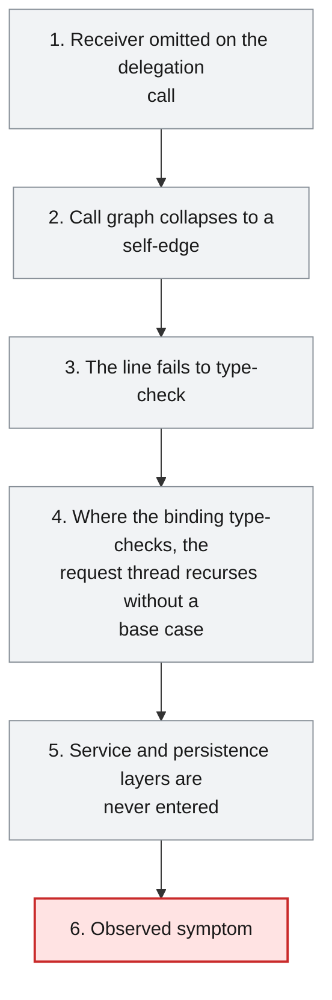
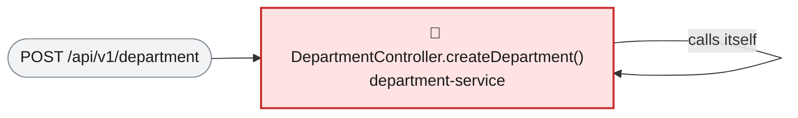

# Root Cause Analysis — ISSUE-001

## Creating a department never completes and crashes the department-service worker thread

> Nobody can create a department: the create endpoint calls itself instead of the code that saves the record, and as written the mistake also stops the service from compiling at all.

_Generated by the Root Cause Analyst agent on 2026-08-06. Evidence collected 2026-08-06T09:06:27.176Z._

## At a glance

| | |
|---|---|
| **What breaks** | `POST /api/v1/department` |
| **Root cause** | The create handler delegates to itself instead of to the injected `DepartmentService`, because the call at line 25 was written without the `departmentService` receiver. |
| **Where** | `department-service/src/main/java/com/virtusa/vihanga/departmentservice/controller/DepartmentController.java:25` |
| **Service** | `department-service` |
| **Severity** | Critical (Defect) |
| **Confidence** | High |

Issue: [docs/issues/ISSUE-001-recursive-create-department.md](../../docs/issues/ISSUE-001-recursive-create-department.md) · Reported 2026-08-06 by QA - API regression run · Status Open

<details><summary>Technical summary</summary>

The `POST /api/v1/department` handler `DepartmentController.createDepartment(Department)` calls `createDepartment(department)` unqualified at line 25. With no receiver, Java resolves that to the handler itself rather than to the injected `DepartmentService`, so the endpoint never reaches `DepartmentServiceImpl.createDepartment()` or `departmentRepository.save()` and no department is ever persisted. The evidence bundle proves the binding structurally: the only call edge on this method is a self-edge in both directions, and the controller's sole injected collaborator `departmentService` is never called from it even though `DepartmentService.createDepartment()` exists and is unreached. The same omitted receiver also makes line 25 type-incompatible, so at this revision `department-service` fails to compile rather than reaching the runtime StackOverflowError the issue reports.

</details>

## 1. What was reported

1. The HTTP request is accepted and dispatched to the controller handler.
2. The handler does not delegate to the service layer; execution stays inside the controller and
   re-enters the same handler method with the same argument, indefinitely.
3. The JVM stack for that request thread is exhausted in a few milliseconds and
   `java.lang.StackOverflowError` is thrown.
4. `DepartmentServiceImpl.createDepartment()` is never invoked, so `departmentRepository.save()`
   is never invoked either.
5. The client receives an error response; nothing is persisted.

Representative stack trace (truncated — the same frame repeats thousands of times):

```
java.lang.StackOverflowError
	at com.virtusa.vihanga.departmentservice.controller.DepartmentController.createDepartment(DepartmentController.java:25)
	at com.virtusa.vihanga.departmentservice.controller.DepartmentController.createDepartment(DepartmentController.java:25)
	at com.virtusa.vihanga.departmentservice.controller.DepartmentController.createDepartment(DepartmentController.java:25)
	... repeated ...
```

Source: [docs/issues/ISSUE-001-recursive-create-department.md](../../docs/issues/ISSUE-001-recursive-create-department.md)

## 2. What should happen — and what happens instead

```mermaid
flowchart TB
  classDef broken fill:#ffe3e3,stroke:#c92a2a,stroke-width:2px,color:#1a1a1a
  classDef warn fill:#fff3bf,stroke:#e8590c,stroke-width:2px,color:#1a1a1a
  classDef ok fill:#e6fcf5,stroke:#2f9e44,stroke-width:1px,color:#1a1a1a
  classDef neutral fill:#f1f3f5,stroke:#868e96,stroke-width:1px,color:#1a1a1a
  subgraph EXPECTED["✅ What should happen"]
    direction LR
    E0["Request arrives"]:::ok
    E1["Controller delegates to<br/>the service"]:::ok
    E0 --> E1
    E2["Service saves to MongoDB"]:::ok
    E1 --> E2
    E3["201 Created returned"]:::ok
    E2 --> E3
  end
  subgraph ACTUAL["❌ What actually happens"]
    direction LR
    A0["Receiver omitted on the<br/>delegation call"]:::neutral
    A1["Call graph collapses to a<br/>self-edge"]:::neutral
    A0 --> A1
    A2["The line fails to<br/>type-check"]:::neutral
    A1 --> A2
    A3["Where the binding<br/>type-checks, the request<br/>thread recurses without a…"]:::neutral
    A2 --> A3
    A4["Service and persistence<br/>layers are never entered"]:::neutral
    A3 --> A4
    A5["Observed symptom"]:::broken
    A4 --> A5
  end
```



## 3. How it fails, step by step

1. **Receiver omitted on the delegation call** — `DepartmentController.createDepartment` calls `createDepartment(department)` with no receiver at line 25, so name resolution binds it to the enclosing handler instead of `departmentService.createDepartment(...)`.
2. **Call graph collapses to a self-edge** — The resolved graph records `DepartmentController.createDepartment() -> DepartmentController.createDepartment()` as both the sole caller and the sole callee of the handler, and records no edge from the handler to `DepartmentService`.
3. **The line fails to type-check** — The self-call yields `ResponseEntity<StandardResponse>` while line 25 assigns it to `DepartmentResponse`, so `department-service` does not compile as committed — the committed `DepartmentController.class` contains only a `java.lang.Error("Unresolved compilation problem: Type mismatch...")` stub where the handler body should be.
4. **Where the binding type-checks, the request thread recurses without a base case** — Once the return types line up, each entry into the handler unconditionally re-enters the handler with the same `Department` argument, exhausting the thread stack in milliseconds — the `StackOverflowError` with a single frame repeating at DepartmentController.java:25 shown in the issue.
5. **Service and persistence layers are never entered** — `DepartmentServiceImpl.createDepartment()` and its `departmentRepository.save(department)` sit on no reachable path from the endpoint, and the `ResponseEntity` on line 27 is never constructed.
6. **Observed symptom** — `POST /api/v1/department` returns no `StandardResponse` envelope and no department exists afterwards, whether the failure surfaces at build time or as an HTTP 500 from the exhausted request thread.



## 4. Where the defect is

> **The create handler delegates to itself instead of to the injected `DepartmentService`, because the call at line 25 was written without the `departmentService` receiver.**

**Location:** `department-service/src/main/java/com/virtusa/vihanga/departmentservice/controller/DepartmentController.java:25`



Line 25 reads `DepartmentResponse departmentResponse = createDepartment(department);`. An unqualified call resolves against the enclosing class first, and `DepartmentController` declares exactly one method of that name with no overload and no static import supplying another, so the call binds to `DepartmentController.createDepartment(Department)` itself. Section 2 of the evidence bundle records the consequence: `Direct callers: DepartmentController.createDepartment() (self — recursion)` and `Direct callees: DepartmentController.createDepartment() (self — recursion)`, with the self-referencing edge flagged, and both the reaching path and the outgoing path collapsing to the single edge `createDepartment() -> createDepartment()`. The injected-collaborator table in the same section shows the field `DepartmentService departmentService` with `Called by focus method: no`, and marks `DepartmentServiceImpl.createDepartment()` (DepartmentServiceImpl.java:24-34, which performs `departmentRepository.save(department)` and builds the `DepartmentResponse`) as an unreached implementation. The correct pattern is present twice in the same file — `getDepartment` at line 36 and `getAllDepartments` at line 41 both call through `departmentService` — which confirms the defect is one omitted receiver on one line, not a wiring, configuration or dependency-injection fault. Because the handler can never reach the service layer, `departmentRepository.save()` is never invoked and nothing is written to the MongoDB `department` collection, which is exactly the reported outcome. The omitted receiver has a second consequence that qualifies the reported symptom: the bound method returns `ResponseEntity<StandardResponse>`, but line 25 assigns it to a `DepartmentResponse`, which is a type error. The build output in this workspace proves it rather than merely predicting it — disassembling the committed artifact `department-service/target/classes/.../DepartmentController.class` with `javap -c` shows the handler body compiled to nothing but `new java/lang/Error; ldc "Unresolved compilation problem: \n\tType mismatch: cannot convert from ResponseEntity<StandardResponse> to DepartmentResponse\n"; athrow`, while the two sibling handlers in the same class disassemble to real `invokeinterface` calls on the `departmentService` field. That error stub is the Eclipse compiler's behaviour for a method that failed to type-check; javac would fail the module build outright. So at this revision the recursion is never actually reached: the endpoint throws `java.lang.Error: Unresolved compilation problem` on the first statement, and the `StackOverflowError` described in the issue is what the identical binding would produce once the return types line up — an unconditional self-call with no base case and no argument mutation can only terminate by exhausting the thread stack.

**The code involved**

| Method | Service | File | Calls | Called by |
|---|---|---|---|---|
| `DepartmentController.createDepartment()` | `department-service` | [DepartmentController.java:23-32](../../department-service/src/main/java/com/virtusa/vihanga/departmentservice/controller/DepartmentController.java#L23-L32) | `DepartmentController.createDepartment()` ⚠️ itself | `DepartmentController.createDepartment()` ⚠️ itself |

<details><summary>Show the source of each method</summary>

**`DepartmentController.createDepartment()`** — `department-service/src/main/java/com/virtusa/vihanga/departmentservice/controller/DepartmentController.java` lines 23-32

```java
@PostMapping("department")
    public ResponseEntity<StandardResponse> createDepartment(@RequestBody Department department) {
        DepartmentResponse departmentResponse = createDepartment(department);

        return new ResponseEntity<StandardResponse>(
                new StandardResponse(201, "Department Created Successfully", departmentResponse), HttpStatus.CREATED
        );


    }
```

Reaching paths:

- `DepartmentController.createDepartment()` → `DepartmentController.createDepartment()`

</details>

## 5. What it means

Department creation is the only write operation on the department domain, and it fails on every invocation with any payload: no department can be onboarded through the API and nothing ever reaches the MongoDB `department` collection. Nothing is corrupted — the failure precedes any write, so the collection is simply never added to — but there is no workaround either, because no other endpoint creates a department. The defect itself is confined to the create path inside `department-service`; the two sibling read handlers delegate correctly. At this revision, however, the type error produced by the same line stops the whole module from compiling, so nothing in the service can run until it is fixed. Where the binding does type-check, each failing request additionally consumes a request thread until its stack is exhausted, which turns a functional failure into CPU and thread-pool pressure under client retries or load tests.

**Why Critical severity:** Critical is correct. A core domain write is 100% unavailable on every invocation, no other endpoint offers a workaround, and at this revision the same defect prevents `department-service` from compiling at all — which blocks deployment of the entire module, not just the create path.

## 6. Why it happened

- The intended collaborator method has the identical name and parameter type (`DepartmentService.createDepartment(Department)`), so dropping the `departmentService.` receiver still produces a resolvable call rather than an unknown-symbol error.
- No unit or `@WebMvcTest` slice test exists for `DepartmentController`, so nothing asserts that the handler delegates to `DepartmentService`.
- The two sibling handlers in the same class delegate correctly, so the file reads as conventional on a quick review and the create path is the only outlier.
- The defect was already detectable statically — `docs/function-reference.md` lists this method under both `Calls` and `Called by` with a self-call warning — but that signal is not wired into any build or CI gate.
- No CI step compiles the module, so a build-breaking change on the create path reached the working tree unnoticed.

## 7. How to fix it

Restore the missing delegation: call the injected `DepartmentService` from the handler instead of the handler itself. This removes the cause — the unqualified self-call — rather than the symptom, and it fixes both manifestations at once: it reconnects the endpoint to `DepartmentServiceImpl.createDepartment()` and its `departmentRepository.save()`, and it resolves the type mismatch, because `DepartmentService.createDepartment(Department)` returns exactly the `DepartmentResponse` that line 25 assigns. No change is needed in the service or repository layer — that code is correct and merely unreached.

| File | Change |
|---|---|
| [DepartmentController.java](../../department-service/src/main/java/com/virtusa/vihanga/departmentservice/controller/DepartmentController.java) | At line 25, qualify the call with the injected field — `departmentService.createDepartment(department)` instead of `createDepartment(department)` — matching the delegation pattern already used by `getDepartment` (line 36) and `getAllDepartments` (line 41). |

<details><summary>Sketch of the change</summary>

```java
// DepartmentController.createDepartment — illustrative, not an applied patch
DepartmentResponse departmentResponse = departmentService.createDepartment(department);

return new ResponseEntity<StandardResponse>(
        new StandardResponse(201, "Department Created Successfully", departmentResponse), HttpStatus.CREATED
);
```

</details>

## 8. How to check the fix worked

1. Compile `department-service` and confirm the `incompatible types: ResponseEntity<StandardResponse> cannot be converted to DepartmentResponse` error at DepartmentController.java:25 is gone.
2. Add a `@WebMvcTest(DepartmentController.class)` slice test with a mocked `DepartmentService`, asserting `createDepartment(...)` is invoked exactly once per request and that the handler does not re-enter itself.
3. Replay the reproduction request from the issue — `curl -i -X POST http://localhost:8501/api/v1/department -H 'Content-Type: application/json' -d '{"departmentName":"Finance","salary":120000}'` — and assert HTTP 201 with a `StandardResponse` envelope carrying a non-null `departmentId`.
4. Call `GET /api/v1/department/salary/0` and confirm the newly created department is returned, proving `departmentRepository.save()` was reached.
5. Confirm no `StackOverflowError` appears in the `department-service` log for the create request.
6. Re-run the Architect pipeline and confirm `DepartmentController.createDepartment()` no longer carries a self-call warning in `docs/function-reference.md` and now shows a call edge to `DepartmentService.createDepartment()`.

## 9. How to stop it happening again

- Enable a static analysis rule for unconditional self-recursion (Error Prone, SpotBugs or SonarQube) and fail the build on it — this defect is detectable without running the code.
- Fail CI on the self-call warning the Architect pipeline already emits into `docs/function-reference.md`, so an existing signal has consequences.
- Require a controller slice test for every handler that asserts delegation to the service layer.
- Add a compile step for every module to CI — at this revision `department-service` does not build, and no gate currently catches that.

## 10. Open questions

- The issue reports a runtime `java.lang.StackOverflowError`, but this revision cannot produce that stack trace: line 25 does not type-check, and the committed `department-service/target/classes/.../DepartmentController.class` disassembles to a single `throw new java.lang.Error("Unresolved compilation problem: Type mismatch: cannot convert from ResponseEntity<StandardResponse> to DepartmentResponse")`. A caller therefore gets that `Error` — surfacing as HTTP 500 — before any recursion begins. The reporter most likely observed the failure on a variant where the recursion type-checked (for example a handler returning `DepartmentResponse`), or reasoned from the self-call edge in the call graph rather than from a live run. The diagnosed cause and the recommended fix are unaffected, but the specific symptom in the issue should be re-confirmed against the revision the reporter tested.
- No test sources were found for `department-service`, so it is unconfirmed whether this handler was ever covered by a test and the delegation later removed, or never covered at all.
- The evidence contains no call edge or trace showing how `report-service` and `employee-service` behave when a department id is absent from the department list, so the issue's 'silently incomplete data' claim is plausible from the join logic but is not proven by the bundle.

## Appendix — how this was determined

| Input | Detail |
|---|---|
| Issue report | [docs/issues/ISSUE-001-recursive-create-department.md](../../docs/issues/ISSUE-001-recursive-create-department.md) |
| Architecture document | [docs/architecture.md](../../docs/architecture.md) |
| Function reference | [docs/function-reference.md](../../docs/function-reference.md) |
| Code scan | `.architect/artifacts.json` (generated 2026-08-06T03:44:10.863Z) |
| Knowledge graph | Neo4j, traversal depth 4 |

<details><summary>Architecture observations considered</summary>

- Each service (`department-service`, `employee-service`, `report-service`, `sheduler-service`) follows the same layered convention: `controller` → `service` → `repository` → `model`/`entity`, backed by MongoDB repositories.
- `configuaration-server` and `discovery-service` are infrastructure services (Spring Cloud Config + Eureka) that every business service depends on at startup via `bootstrap.properties`.
- No Feign clients were detected — cross-service calls, if any, likely go through `RestTemplate`/`WebClient` rather than declarative Feign interfaces. Worth confirming if service-to-service coupling should show up as graph edges.
- The generated Neo4j graph can be queried directly (e.g. `MATCH (m:Module)-[:CONTAINS]->(t:Type) RETURN m.name, count(t)`) for deeper, ad-hoc architecture questions beyond this static document.

</details>

<details><summary>Graph queries executed</summary>

**upstream callers**

```cypher
MATCH path = (caller:Method)-[:CALLS*1..4]->(target:Method {id: $id})
         RETURN [n IN nodes(path) | n.id] AS chain LIMIT 200
```

**downstream callees**

```cypher
MATCH path = (target:Method {id: $id})-[:CALLS*1..4]->(callee:Method)
         RETURN [n IN nodes(path) | n.id] AS chain LIMIT 200
```

**owning type, module and exposed endpoints**

```cypher
MATCH (ty:Type)-[:HAS_METHOD]->(m:Method {id: $id})
         OPTIONAL MATCH (ty)-[:EXPOSES]->(e:Endpoint)
         RETURN ty.id AS typeId, ty.name AS typeName, ty.module AS module,
                collect(DISTINCT e.id) AS endpoints
```

**types depending on the owning type**

```cypher
MATCH (other:Type)-[:USES]->(ty:Type)-[:HAS_METHOD]->(:Method {id: $id})
         RETURN DISTINCT other.id AS typeId, other.name AS name, other.module AS module
```

**modules reaching the focus method**

```cypher
MATCH (caller:Method)-[:CALLS*1..4]->(:Method {id: $id})
         MATCH (ct:Type)-[:HAS_METHOD]->(caller)
         RETURN DISTINCT ct.module AS module
```

**graph node counts**

```cypher
MATCH (n) RETURN labels(n)[0] AS label, count(*) AS count ORDER BY count DESC
```

**graph relationship counts**

```cypher
MATCH ()-[r]->() RETURN type(r) AS type, count(*) AS count ORDER BY count DESC
```

**maven dependencies of affected modules**

```cypher
MATCH (m:Module)-[:DEPENDS_ON]->(dep:MavenDependency)
       WHERE m.name IN $modules
       RETURN m.name AS module, collect(dep.ga) AS dependencies
```

</details>

---

The reported symptom, the code table, the source and the call paths are rendered verbatim from the issue, the code scan and the knowledge graph. The plain-language summary, the causal chain, the root cause, what it means, why it happened, the fix, the verification steps and the prevention measures are the judgement of the Root Cause Analyst agent.
