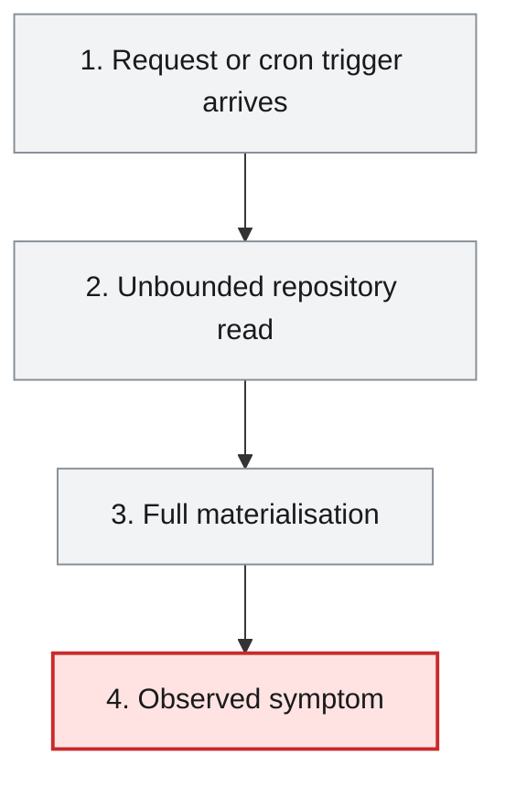
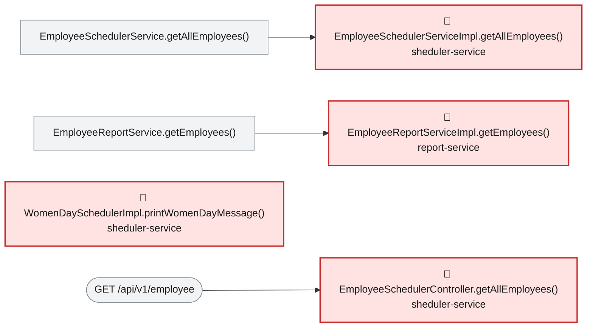

# Root Cause Analysis — ISSUE-001

## Unbounded repository findAll() reads whole collections into memory across multiple services

> Two services hand back their entire employee list every time they're asked for data, instead of only sending back a reasonable amount at once -- so the size of the response (and the memory it costs to build it) grows without limit as the company hires more people.

_Generated by the Root Cause Analyst agent on 2026-08-15. Evidence collected 2026-08-15T02:55:47.469Z._

## At a glance

| | |
|---|---|
| **What breaks** | `GET /api/v1/employee`, `GET /api/v1/export` |
| **Root cause** | EmployeeSchedulerServiceImpl.getAllEmployees() and EmployeeReportServiceImpl.getEmployees() both call MongoRepository.findAll() with no pagination, limit, or query filter, so each read materialises the entire collection. |
| **Where** | `sheduler-service/src/main/java/com/aura/vihanga/shedulerservice/service/implementation/EmployeeSchedulerServiceImpl.java:16-19 (and the equivalent construct at report-service/src/main/java/com/aura/vihanga/reportservice/service/implementation/EmployeeReportServiceImpl.java:38-72)` |
| **Service** | `sheduler-service`, `report-service` |
| **Severity** | High (Vulnerability) |
| **Confidence** | High |

Issue: [docs/issues/ISSUE-001-unbounded-findall-usage.md](../../docs/issues/ISSUE-001-unbounded-findall-usage.md) · Reported 2026-08-06 by Architecture review - performance and availability · Status Open

<details><summary>Technical summary</summary>

EmployeeSchedulerServiceImpl.getAllEmployees() and EmployeeReportServiceImpl.getEmployees() both call their repository's inherited MongoRepository.findAll() with no Pageable, Sort, Limit or query filter, so each invocation materialises the entire employee collection into a List in the JVM heap. This is the same root cause (an unbounded findAll() call used as the default way to read "all employees") independently reproduced in two services; each call site sits directly behind a public REST endpoint (GET /api/v1/employee, GET /api/v1/export) and, in sheduler-service's case, also behind a scheduled job.

</details>

## 1. What was reported

**Call site 1 — `sheduler-service`**

- `GET /api/v1/employee` returns every employee document in the collection, serialised in full, with
  no page size, no limit parameter and no filtering. The entity is returned directly, so every
  persisted field is exposed to the caller.
- The scheduled job `WomenDaySchedulerImpl.printWomenDayMessage()` calls the same method and then
  filters for `GenderType.FEMALE` **in Java**, after the entire collection has already been
  transferred and mapped. The filter is never pushed down to the database.

**Call site 2 — `report-service`**

- `GET /api/v1/export` loads every employee via `findAll()`, then performs an outbound HTTP call to
  `department-service` for the department list, and then joins the two lists with a nested
  `for` loop (employees × departments) purely in memory.
- The complete joined result and the generated XLSX workbook are both held in the heap at the same
  time, and the workbook is buffered into a `ByteArrayOutputStream` before a single byte is written
  to the response.

Source: [docs/issues/ISSUE-001-unbounded-findall-usage.md](../../docs/issues/ISSUE-001-unbounded-findall-usage.md)

## 2. What should happen — and what happens instead

```mermaid
flowchart TB
  classDef broken fill:#ffe3e3,stroke:#c92a2a,stroke-width:2px,color:#1a1a1a
  classDef warn fill:#fff3bf,stroke:#e8590c,stroke-width:2px,color:#1a1a1a
  classDef ok fill:#e6fcf5,stroke:#2f9e44,stroke-width:1px,color:#1a1a1a
  classDef neutral fill:#f1f3f5,stroke:#868e96,stroke-width:1px,color:#1a1a1a
  subgraph EXPECTED["✅ What should happen"]
    direction LR
    E0["Client requests employee<br/>data"]:::ok
    E1["Service requests a bounded<br/>page or a<br/>server-side-filtered…"]:::ok
    E0 --> E1
    E2["Repository returns only<br/>what was asked for"]:::ok
    E1 --> E2
    E3["Response size and<br/>processing cost stay flat<br/>regardless of collection…"]:::ok
    E2 --> E3
  end
  subgraph ACTUAL["❌ What actually happens"]
    direction LR
    A0["Request or cron trigger<br/>arrives"]:::neutral
    A1["Unbounded repository read"]:::neutral
    A0 --> A1
    A2["Full materialisation"]:::neutral
    A1 --> A2
    A3["Observed symptom"]:::broken
    A2 --> A3
  end
```



## 3. How it fails, step by step

1. **Request or cron trigger arrives** — GET /api/v1/employee, GET /api/v1/export, or the 8 March cron job invokes the read path with no size constraint of any kind.
2. **Unbounded repository read** — The service layer calls repository.findAll() with no Pageable/Sort/Limit/query, which Spring Data MongoDB executes as an unfiltered collection scan.
3. **Full materialisation** — Every document in the collection is deserialised into a List<Employee> (or, in report-service, additionally joined in memory against every department via a nested for loop) before any response is produced.
4. **Observed symptom** — Response size, latency and heap usage all scale linearly with collection size; concurrent callers multiply the effect, and the issue's own reproduction steps report OutOfMemoryError once the collection is large enough.



## 4. Where the defect is

> **EmployeeSchedulerServiceImpl.getAllEmployees() and EmployeeReportServiceImpl.getEmployees() both call MongoRepository.findAll() with no pagination, limit, or query filter, so each read materialises the entire collection.**

**Location:** `sheduler-service/src/main/java/com/aura/vihanga/shedulerservice/service/implementation/EmployeeSchedulerServiceImpl.java:16-19 (and the equivalent construct at report-service/src/main/java/com/aura/vihanga/reportservice/service/implementation/EmployeeReportServiceImpl.java:38-72)`



The evidence bundle's source excerpts show both methods calling `.findAll()` on their injected repository with zero arguments -- `EmployeeSchedulerServiceImpl.getAllEmployees()` returns the raw result directly, and `EmployeeReportServiceImpl.getEmployees()` assigns it to `employeesList` before an in-memory nested-loop join against every department. Neither the reaching call chain (EmployeeSchedulerController.getAllEmployees() -> EmployeeSchedulerService.getAllEmployees() -> EmployeeSchedulerServiceImpl.getAllEmployees(), and WomenDaySchedulerImpl.printWomenDayMessage() via the same path) nor report-service's chain (EmployeeReportController.exportToExcel() -> EmployeeReportService.getEmployees() -> EmployeeReportServiceImpl.getEmployees()) contains any intermediate step that bounds the result -- the size of every response and of the Women's Day cron job's working set is decided entirely by how many documents exist in MongoDB, not by what the caller needs.

**The code involved**

| Method | Service | File | Calls | Called by |
|---|---|---|---|---|
| `EmployeeSchedulerServiceImpl.getAllEmployees()` | `sheduler-service` | [EmployeeSchedulerServiceImpl.java:16-19](../../sheduler-service/src/main/java/com/aura/vihanga/shedulerservice/service/implementation/EmployeeSchedulerServiceImpl.java#L16-L19) | _none_ | `EmployeeSchedulerService.getAllEmployees()` |
| `EmployeeReportServiceImpl.getEmployees()` | `report-service` | [EmployeeReportServiceImpl.java:38-72](../../report-service/src/main/java/com/aura/vihanga/reportservice/service/implementation/EmployeeReportServiceImpl.java#L38-L72) | `DepartmentConfigUrl.getDepartmentUrl()` | `EmployeeReportService.getEmployees()` |
| `WomenDaySchedulerImpl.printWomenDayMessage()` | `sheduler-service` | [WomenDaySchedulerImpl.java:19-29](../../sheduler-service/src/main/java/com/aura/vihanga/shedulerservice/service/implementation/WomenDaySchedulerImpl.java#L19-L29) | `EmployeeSchedulerService.getAllEmployees()` | _entry point_ |
| `EmployeeSchedulerController.getAllEmployees()` | `sheduler-service` | [EmployeeSchedulerController.java:18-21](../../sheduler-service/src/main/java/com/aura/vihanga/shedulerservice/controller/EmployeeSchedulerController.java#L18-L21) | `EmployeeSchedulerService.getAllEmployees()` | _entry point_ |
| `EmployeeReportController.exportToExcel()` | `report-service` | [EmployeeReportController.java:25-39](../../report-service/src/main/java/com/aura/vihanga/reportservice/controller/EmployeeReportController.java#L25-L39) | `EmployeeReportService.getEmployees()`, `EmployeeReportService.generateExcelFile()` | _entry point_ |

<details><summary>Show the source of each method</summary>

**`EmployeeSchedulerServiceImpl.getAllEmployees()`** — `sheduler-service/src/main/java/com/aura/vihanga/shedulerservice/service/implementation/EmployeeSchedulerServiceImpl.java` lines 16-19

```java
@Override
    public List<Employee> getAllEmployees() {
        return employeeSchedulerRepository.findAll();
    }
```

Reaching paths:

- `EmployeeSchedulerController.getAllEmployees()` → `EmployeeSchedulerService.getAllEmployees()` → `EmployeeSchedulerServiceImpl.getAllEmployees()`
- `WomenDaySchedulerImpl.printWomenDayMessage()` → `EmployeeSchedulerService.getAllEmployees()` → `EmployeeSchedulerServiceImpl.getAllEmployees()`

**`EmployeeReportServiceImpl.getEmployees()`** — `report-service/src/main/java/com/aura/vihanga/reportservice/service/implementation/EmployeeReportServiceImpl.java` lines 38-72

```java
public List<EmployeeSalaryResponse> getEmployees() {
        log.info("Report Service");
        List<Employee> employeesList = employeeReportRepository.findAll();

//        List<String> employeeDepartmentId = employees.stream().map(employee -> employee.getDepartment()).toList();

        DepartmentResponse[] departmentResponses = builder.build().get()
                .uri(departmentConfigUrl.getDepartmentUrl(), 10000)
                .retrieve()
                .bodyToMono(DepartmentResponse[].class)
                .block();
        List<DepartmentResponse> departmentResponseList = Arrays.asList(departmentResponses);

        List<EmployeeSalaryResponse> employeeSalaryResponseList = new ArrayList<>();

        for (Employee employee : employeesList) {
            for (DepartmentResponse department : departmentResponseList) {
                if (employee.getDepartment().equals(department.getDepartmentId())) {
                    EmployeeSalaryResponse employeeSalaryResponse = EmployeeSalaryResponse.builder()
                            .employeeId(employee.getEmployeeId())
                            .name(employee.getName())
                            .departmentName(department.getDepartmentName())
                            .salary(department.getSalary())
                            .build();

                    log.info("employee Salary {}",employeeSalaryResponse);

                    employeeSalaryResponseList.add(employeeSalaryResponse);
                }
            }
        }

        return employeeSalaryResponseList;

    }
```

Reaching paths:

- `EmployeeReportController.exportToExcel()` → `EmployeeReportService.getEmployees()` → `EmployeeReportServiceImpl.getEmployees()`

**`WomenDaySchedulerImpl.printWomenDayMessage()`** — `sheduler-service/src/main/java/com/aura/vihanga/shedulerservice/service/implementation/WomenDaySchedulerImpl.java` lines 19-29

```java
@Scheduled(cron = "0 0 0 8 3 *")
    public void printWomenDayMessage() {
        List<Employee> womenEmployees = employeeSchedulerService.getAllEmployees().stream()
                .filter(employee -> employee.getGender() == GenderType.FEMALE)
                .collect(Collectors.toList());

        System.out.println("Happy Women's Day!");
        for (Employee employee : womenEmployees) {
            System.out.println("Employee Name: " + employee.getName());
        }
    }
```

**`EmployeeSchedulerController.getAllEmployees()`** — `sheduler-service/src/main/java/com/aura/vihanga/shedulerservice/controller/EmployeeSchedulerController.java` lines 18-21

```java
@GetMapping("employee")
    public List<Employee> getAllEmployees() {
        return schedulerService.getAllEmployees();
    }
```

**`EmployeeReportController.exportToExcel()`** — `report-service/src/main/java/com/aura/vihanga/reportservice/controller/EmployeeReportController.java` lines 25-39

```java
@GetMapping("export")
    public void exportToExcel(HttpServletResponse response) throws IOException {
        List<EmployeeSalaryResponse> employeeSalaryResponseList = reportService.getEmployees();

//        List<Employee> employees = new ArrayList<>();
//
        byte[] excelBytes = reportService.generateExcelFile(employeeSalaryResponseList);

        response.setContentType("application/vnd.openxmlformats-officedocument.spreadsheetml.sheet");
        response.setHeader("Content-Disposition", "attachment; filename=employees.xlsx");
        response.getOutputStream().write(excelBytes);
        response.getOutputStream().flush();

        log.info("Report Controller");
    }
```

</details>

## 5. What it means

GET /api/v1/employee (sheduler-service) and GET /api/v1/export (report-service) are both public, unauthenticated endpoints whose cost is controlled entirely by collection size, not caller intent -- a handful of concurrent requests against a realistically sized collection is enough to exhaust heap and take the instance down, and the same full-collection read also feeds the Women's Day scheduled job. This matches the affected area the evidence bundle resolved: two modules (sheduler-service, report-service), the two REST endpoints named in the issue, and one scheduled job -- no other service's call graph reaches either defect site.

**Why High severity:** High is appropriate: this is a real, deterministic availability risk (a resource-exhaustion primitive reachable by any caller) that scales with data growth and is trivially reproducible, though it is a resource/availability concern rather than the direct confidentiality breach that separately reported issues (unauthenticated access, PII in the entity/logs) represent -- consistent with why this is High rather than Critical.

## 6. Why it happened

- No endpoint in the REST surface accepts a page or size parameter, so there was never an API contract that would have prompted a bounded query in the first place.
- WomenDaySchedulerImpl filters for GenderType.FEMALE in Java after the full collection is already loaded, rather than pushing the filter down to MongoDB -- the same unbounded-read habit applied to a case where a targeted query was straightforward.
- No test in either module exercises these methods against more than a handful of records, so the cost does not show up until production-scale data exists.

## 7. How to fix it

Replace both unbounded findAll() calls with a bounded read: EmployeeSchedulerServiceImpl.getAllEmployees() should accept (or internally apply) a Pageable with a server-enforced maximum page size, and WomenDaySchedulerImpl's gender filter should become a derived query (e.g. findByGender(GenderType.FEMALE)) so MongoDB does the filtering instead of the JVM. EmployeeReportServiceImpl.getEmployees() should read in bounded pages/batches rather than materialising the whole collection before the join, since it also holds the joined result and the generated workbook in memory simultaneously.

| File | Change |
|---|---|
| [EmployeeSchedulerServiceImpl.java](../../sheduler-service/src/main/java/com/aura/vihanga/shedulerservice/service/implementation/EmployeeSchedulerServiceImpl.java) | Replace repository.findAll() with a paginated read (Pageable, capped page size) so the endpoint's response size no longer scales with collection size. |
| [EmployeeReportServiceImpl.java](../../report-service/src/main/java/com/aura/vihanga/reportservice/service/implementation/EmployeeReportServiceImpl.java) | Replace repository.findAll() with a bounded/paged read for the export path, so heap usage stays flat as the collection grows. |

<details><summary>Sketch of the change</summary>

```java
Page<Employee> page = employeeSchedulerRepository.findAll(PageRequest.of(0, MAX_PAGE_SIZE));
return page.getContent();
```

</details>

## 8. How to check the fix worked

1. Compile both affected modules.
2. Seed a collection larger than the chosen page size and confirm GET /api/v1/employee now returns a bounded result set rather than every document.
3. Confirm the Women's Day job's female-employee count matches a direct database query, proving the filter is now applied server-side.
4. Confirm GET /api/v1/export still produces a correct workbook for a bounded/paged read.

## 9. How to stop it happening again

- Add a lint/review rule (or a simple static check) flagging bare repository.findAll() calls with no Pageable/Sort/Limit argument in new code.
- Require every new list-returning REST endpoint to accept page/size parameters as part of its API contract.

## Appendix — how this was determined

| Input | Detail |
|---|---|
| Issue report | [docs/issues/ISSUE-001-unbounded-findall-usage.md](../../docs/issues/ISSUE-001-unbounded-findall-usage.md) |
| Architecture document | [docs/architecture.md](../../docs/architecture.md) |
| Function reference | [docs/function-reference.md](../../docs/function-reference.md) |
| Code scan | `.architect/artifacts.json` (generated 2026-08-15T02:55:22.543Z) |
| Knowledge graph | not used — skipped via --no-graph |

<details><summary>Architecture observations considered</summary>

- Each service (`department-service`, `employee-service`, `report-service`, `sheduler-service`) follows the same layered convention: `controller` → `service` → `repository` → `model`/`entity`, backed by MongoDB repositories.
- `configuaration-server` and `discovery-service` are infrastructure services (Spring Cloud Config + Eureka) that every business service depends on at startup via `bootstrap.properties`.
- No Feign clients were detected — cross-service calls, if any, likely go through `RestTemplate`/`WebClient` rather than declarative Feign interfaces. Worth confirming if service-to-service coupling should show up as graph edges.
- The generated Neo4j graph can be queried directly (e.g. `MATCH (m:Module)-[:CONTAINS]->(t:Type) RETURN m.name, count(t)`) for deeper, ad-hoc architecture questions beyond this static document.

</details>

_No Cypher was run: skipped via --no-graph_ Call-graph facts came from the code scan, using the same resolution rules Graph Forge applies when it builds the graph.

---

The reported symptom, the code table, the source and the call paths are rendered verbatim from the issue, the code scan and the knowledge graph. The plain-language summary, the causal chain, the root cause, what it means, why it happened, the fix, the verification steps and the prevention measures are the judgement of the Root Cause Analyst agent.
