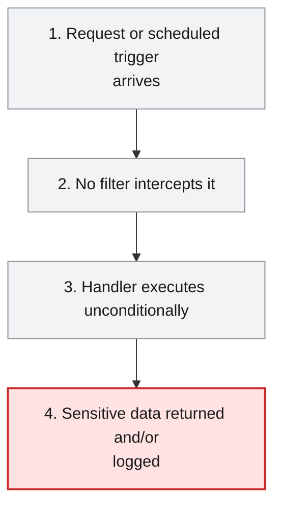
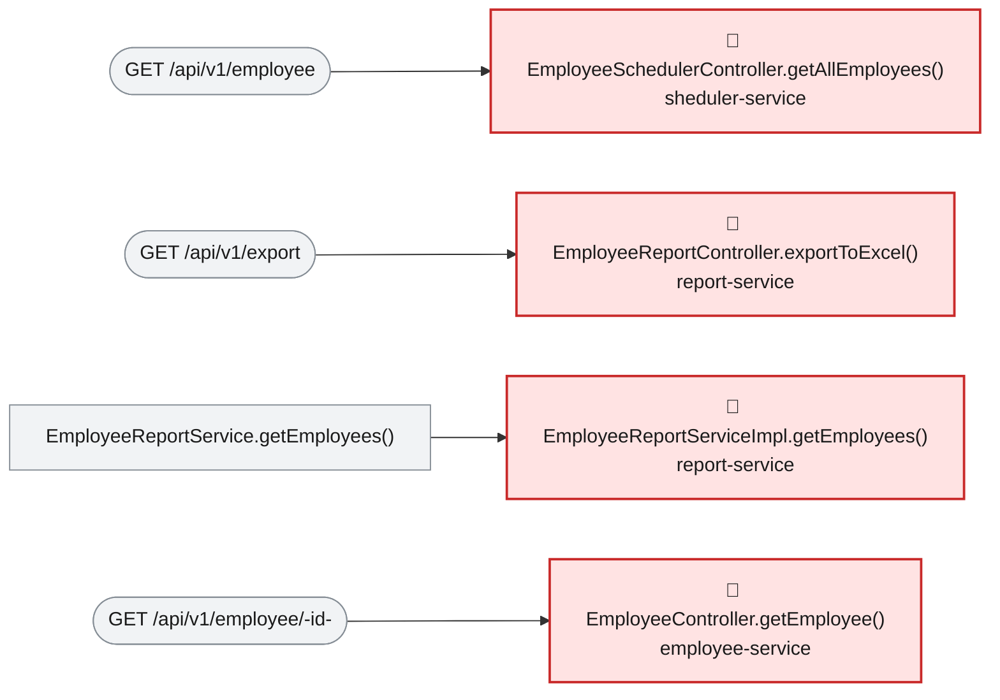

# Root Cause Analysis — ISSUE-002

## Employee PII and payroll data are exposed to unauthenticated callers and written to application logs

> None of the six services ever check who is calling them, so anyone who can reach the network can read or write the entire employee and payroll dataset -- and on top of that, several services also write that same sensitive data into their log files.

_Generated by the Root Cause Analyst agent on 2026-08-15. Evidence collected 2026-08-15T03:05:45.717Z._

## At a glance

| | |
|---|---|
| **What breaks** | `GET /api/v1/employee`, `GET /api/v1/employee/{id}`, `GET /api/v1/employee/search`, `POST /api/v1/employee`, `GET /api/v1/export`, `GET /api/v1/department/salary/{minSalary}` |
| **Root cause** | No module in this workspace implements any authentication or authorization mechanism, and several call sites additionally pass PII/salary values directly to loggers -- both because sensitive data was never distinguished from ordinary data anywhere in the codebase. |
| **Where** | `employee-service/src/main/java/com/aura/vihanga/employeeservice/controller/EmployeeController.java (representative of Channel A across 6 services); report-service/src/main/java/com/aura/vihanga/reportservice/service/implementation/EmployeeReportServiceImpl.java:63 (representative of Channel B)` |
| **Service** | `employee-service`, `report-service`, `sheduler-service`, `department-service`, `configuaration-server`, `discovery-service` |
| **Severity** | Critical (Vulnerability) |
| **Confidence** | High |

Issue: [docs/issues/ISSUE-002-unauthenticated-pii-exposure.md](../../docs/issues/ISSUE-002-unauthenticated-pii-exposure.md) · Reported 2026-08-09 by Security review - sensitive data exposure and access control · Status Open

<details><summary>Technical summary</summary>

No module in this workspace depends on spring-boot-starter-security or declares any SecurityFilterChain, @PreAuthorize, @Secured or @RolesAllowed, so Spring Boot dispatches every @RequestMapping handler for anonymous callers with no identity check of any kind (Channel A). Independently, three call sites (EmployeeReportServiceImpl.getEmployees(), DepartmentController.getAllDepartments(), and EmployeeController.createEmployee(), the latter via TRACE-level logging that is explicitly enabled in application.properties) pass PII or salary values directly as SLF4J arguments (Channel B). Both channels share the same underlying gap: nothing anywhere in this codebase distinguishes sensitive fields from ordinary ones, whether at the access-control layer or the logging layer -- the security review that filed this issue grouped both under one report for exactly that reason.

</details>

## 1. What was reported

- No module declares `spring-boot-starter-security`. A search across all six `pom.xml` files for
  `spring-boot-starter-security` returns zero matches.
- No `SecurityFilterChain`, `WebSecurityConfigurerAdapter`, `@PreAuthorize`, `@Secured` or
  `@RolesAllowed` exists anywhere in `src/main/java`.
- Consequently Spring Boot applies no filter chain, and every `@RequestMapping` handler is dispatched
  for anonymous requests. No handler performs its own identity or entitlement check.
- Requests carry no correlation to any principal, so there is **no audit trail**: it is not possible
  to determine after the fact who read or modified an employee record.
- `GET /api/v1/employee` serialises the persistence entity directly rather than a DTO, so every
  persisted field is emitted whether or not the caller needs it.
- Salary values reach the log sink at INFO on the normal export path. Log files are commonly shipped
  to aggregation platforms and retained far longer, and with broader read access, than the database
  itself.

Source: [docs/issues/ISSUE-002-unauthenticated-pii-exposure.md](../../docs/issues/ISSUE-002-unauthenticated-pii-exposure.md)

## 2. What should happen — and what happens instead

```mermaid
flowchart TB
  classDef broken fill:#ffe3e3,stroke:#c92a2a,stroke-width:2px,color:#1a1a1a
  classDef warn fill:#fff3bf,stroke:#e8590c,stroke-width:2px,color:#1a1a1a
  classDef ok fill:#e6fcf5,stroke:#2f9e44,stroke-width:1px,color:#1a1a1a
  classDef neutral fill:#f1f3f5,stroke:#868e96,stroke-width:1px,color:#1a1a1a
  subgraph EXPECTED["✅ What should happen"]
    direction LR
    E0["Request arrives at any<br/>endpoint"]:::ok
    E1["A security filter<br/>identifies the caller"]:::ok
    E0 --> E1
    E2["The handler checks the<br/>caller is authorised for<br/>this data"]:::ok
    E1 --> E2
    E3["Only identifiers are<br/>logged, never PII or<br/>salary values"]:::ok
    E2 --> E3
  end
  subgraph ACTUAL["❌ What actually happens"]
    direction LR
    A0["Request or scheduled<br/>trigger arrives"]:::neutral
    A1["No filter intercepts it"]:::neutral
    A0 --> A1
    A2["Handler executes<br/>unconditionally"]:::neutral
    A1 --> A2
    A3["Sensitive data returned<br/>and/or logged"]:::broken
    A2 --> A3
  end
```



## 3. How it fails, step by step

1. **Request or scheduled trigger arrives** — Any of the 7 listed endpoints (or, in report-service's case, any call to the export path) is invoked with no credentials.
2. **No filter intercepts it** — Because no module depends on spring-boot-starter-security, Spring Boot's default filter chain is empty -- there is no login, token or API-key check to fail.
3. **Handler executes unconditionally** — The controller method runs exactly as it would for an authorised caller, since no code path anywhere checks identity or entitlement.
4. **Sensitive data returned and/or logged** — The full persistence entity (or, for report-service, the joined salary record) is serialised into the HTTP response, and in three call sites is also passed directly to a logger.



## 4. Where the defect is

> **No module in this workspace implements any authentication or authorization mechanism, and several call sites additionally pass PII/salary values directly to loggers -- both because sensitive data was never distinguished from ordinary data anywhere in the codebase.**

**Location:** `employee-service/src/main/java/com/aura/vihanga/employeeservice/controller/EmployeeController.java (representative of Channel A across 6 services); report-service/src/main/java/com/aura/vihanga/reportservice/service/implementation/EmployeeReportServiceImpl.java:63 (representative of Channel B)`



The evidence bundle's affected-area resolution reaches 15 types across 4 modules with zero intermediate authentication check on any path -- EmployeeController.getEmployee(), searchEmployees() and createEmployee() are dispatched directly from the framework's routing layer to application code with no filter in between, exactly as the issue's own Detection Notes describe (zero matches for spring-boot-starter-security or any Spring Security annotation across all six pom.xml/src trees). Channel B is a distinct but related gap: EmployeeReportServiceImpl.getEmployees() logs 'employee Salary {}' with the full EmployeeSalaryResponse object at INFO level on every export, and this is not gated by any conditional -- it fires on every legitimate call, not just a debug scenario.

**The code involved**

| Method | Service | File | Calls | Called by |
|---|---|---|---|---|
| `EmployeeSchedulerController.getAllEmployees()` | `sheduler-service` | [EmployeeSchedulerController.java:18-21](../../sheduler-service/src/main/java/com/aura/vihanga/shedulerservice/controller/EmployeeSchedulerController.java#L18-L21) | `EmployeeSchedulerService.getAllEmployees()` | _entry point_ |
| `EmployeeReportController.exportToExcel()` | `report-service` | [EmployeeReportController.java:25-39](../../report-service/src/main/java/com/aura/vihanga/reportservice/controller/EmployeeReportController.java#L25-L39) | `EmployeeReportService.getEmployees()`, `EmployeeReportService.generateExcelFile()` | _entry point_ |
| `EmployeeReportServiceImpl.getEmployees()` | `report-service` | [EmployeeReportServiceImpl.java:38-72](../../report-service/src/main/java/com/aura/vihanga/reportservice/service/implementation/EmployeeReportServiceImpl.java#L38-L72) | `DepartmentConfigUrl.getDepartmentUrl()` | `EmployeeReportService.getEmployees()` |
| `EmployeeController.getEmployee()` | `employee-service` | [EmployeeController.java:61-69](../../employee-service/src/main/java/com/aura/vihanga/employeeservice/controller/EmployeeController.java#L61-L69) | `EmployeeService.getEmployee()` | _entry point_ |
| `EmployeeController.createEmployee()` | `employee-service` | [EmployeeController.java:31-39](../../employee-service/src/main/java/com/aura/vihanga/employeeservice/controller/EmployeeController.java#L31-L39) | `EmployeeService.createEmployee()` | _entry point_ |
| `EmployeeController.searchEmployees()` | `employee-service` | [EmployeeController.java:50-59](../../employee-service/src/main/java/com/aura/vihanga/employeeservice/controller/EmployeeController.java#L50-L59) | `EmployeeService.searchEmployees()` | _entry point_ |
| `DepartmentController.getAllDepartments()` | `department-service` | [DepartmentController.java:39-44](../../department-service/src/main/java/com/aura/vihanga/departmentservice/controller/DepartmentController.java#L39-L44) | `DepartmentService.getAllDepartments()` | _entry point_ |

<details><summary>Show the source of each method</summary>

**`EmployeeSchedulerController.getAllEmployees()`** — `sheduler-service/src/main/java/com/aura/vihanga/shedulerservice/controller/EmployeeSchedulerController.java` lines 18-21

```java
@GetMapping("employee")
    public List<Employee> getAllEmployees() {
        return schedulerService.getAllEmployees();
    }
```

**`EmployeeReportController.exportToExcel()`** — `report-service/src/main/java/com/aura/vihanga/reportservice/controller/EmployeeReportController.java` lines 25-39

```java
@GetMapping("export")
    public void exportToExcel(HttpServletResponse response) throws IOException {
        List<EmployeeSalaryResponse> employeeSalaryResponseList = reportService.getEmployees();

//        List<Employee> employees = new ArrayList<>();
//
        byte[] excelBytes = reportService.generateExcelFile(employeeSalaryResponseList);

        response.setContentType("application/vnd.openxmlformats-officedocument.spreadsheetml.sheet");
        response.setHeader("Content-Disposition", "attachment; filename=employees.xlsx");
        response.getOutputStream().write(excelBytes);
        response.getOutputStream().flush();

        log.info("Report Controller");
    }
```

**`EmployeeReportServiceImpl.getEmployees()`** — `report-service/src/main/java/com/aura/vihanga/reportservice/service/implementation/EmployeeReportServiceImpl.java` lines 38-72

```java
public List<EmployeeSalaryResponse> getEmployees() {
        log.info("Report Service");
        List<Employee> employeesList = employeeReportRepository.findAll();

//        List<String> employeeDepartmentId = employees.stream().map(employee -> employee.getDepartment()).toList();

        DepartmentResponse[] departmentResponses = builder.build().get()
                .uri(departmentConfigUrl.getDepartmentUrl(), 10000)
                .retrieve()
                .bodyToMono(DepartmentResponse[].class)
                .block();
        List<DepartmentResponse> departmentResponseList = Arrays.asList(departmentResponses);

        List<EmployeeSalaryResponse> employeeSalaryResponseList = new ArrayList<>();

        for (Employee employee : employeesList) {
            for (DepartmentResponse department : departmentResponseList) {
                if (employee.getDepartment().equals(department.getDepartmentId())) {
                    EmployeeSalaryResponse employeeSalaryResponse = EmployeeSalaryResponse.builder()
                            .employeeId(employee.getEmployeeId())
                            .name(employee.getName())
                            .departmentName(department.getDepartmentName())
                            .salary(department.getSalary())
                            .build();

                    log.info("employee Salary {}",employeeSalaryResponse);

                    employeeSalaryResponseList.add(employeeSalaryResponse);
                }
            }
        }

        return employeeSalaryResponseList;

    }
```

Reaching paths:

- `EmployeeReportController.exportToExcel()` → `EmployeeReportService.getEmployees()` → `EmployeeReportServiceImpl.getEmployees()`

**`EmployeeController.getEmployee()`** — `employee-service/src/main/java/com/aura/vihanga/employeeservice/controller/EmployeeController.java` lines 61-69

```java
@GetMapping("employee/{id}")
    public ResponseEntity<StandardResponse> getEmployee(@PathVariable("id") String employeeId) throws EmployeeNotFoundException {
        log.trace("EmployeeController - getEmployee - employeeId {}", employeeId);
        EmployeeResponse employeeResponse = employeeService.getEmployee(employeeId);

        return new ResponseEntity<StandardResponse>(
                new StandardResponse(200, "Employee Fetch Successfully", employeeResponse), HttpStatus.OK
        );
    }
```

**`EmployeeController.createEmployee()`** — `employee-service/src/main/java/com/aura/vihanga/employeeservice/controller/EmployeeController.java` lines 31-39

```java
@PostMapping("employee")
    public ResponseEntity<StandardResponse> createEmployee(@RequestBody Employee employee) {
        log.trace("EmployeeController - createEmployee - employee {}", employee);
        EmployeeResponse employeeResponse = employeeService.createEmployee(employee);

        return new ResponseEntity<StandardResponse>(
                new StandardResponse(201, "Employee Created Successfully", employeeResponse), HttpStatus.CREATED
        );
    }
```

**`EmployeeController.searchEmployees()`** — `employee-service/src/main/java/com/aura/vihanga/employeeservice/controller/EmployeeController.java` lines 50-59

```java
@GetMapping("employee/search")
    public ResponseEntity<StandardResponse> searchEmployees(@RequestParam("name") String name,
                                                            @RequestParam(value = "department", required = false) String department) {
        log.trace("EmployeeController - searchEmployees - name {} department {}", name, department);
        List<EmployeeResponse> employeeResponses = employeeService.searchEmployees(name, department);

        return new ResponseEntity<StandardResponse>(
                new StandardResponse(200, "Employee Search Completed Successfully", employeeResponses), HttpStatus.OK
        );
    }
```

**`DepartmentController.getAllDepartments()`** — `department-service/src/main/java/com/aura/vihanga/departmentservice/controller/DepartmentController.java` lines 39-44

```java
@GetMapping("department/salary/{minSalary}")
    public List<DepartmentResponse> getAllDepartments(@PathVariable("minSalary") double minSalary) {
        List<DepartmentResponse> departmentResponses = departmentService.getAllDepartments(minSalary);
        log.info("Department Controller {}", departmentResponses);
        return  departmentResponses;
    }
```

</details>

## 5. What it means

Every endpoint the evidence bundle resolved -- department, employee and report reads and writes across 4 services -- is reachable by an anonymous caller, and salary/PII additionally lands in report-service's and department-service's logs at INFO (always-on) and employee-service's logs at TRACE (also always-on, since it is enabled by the committed configuration). This matches the issue's own Affected Area table; the two infrastructure services (configuaration-server, discovery-service) named in the issue are open by the same absence of any security dependency, though the call-graph resolution above focuses on the four business-logic modules reachable from the reported symbols.

**Why Critical severity:** Critical is correct: this is total, unauthenticated, deterministic exposure of regulated personal data and payroll figures with no precondition and no attacker skill required -- not a conditional or hard-to-reach flaw, but the complete absence of a control that every other finding in this register assumes exists.

## 6. Why it happened

- Responses return persistence entities directly instead of purpose-built DTOs, so even a properly-authenticated caller would receive more fields than most use cases need.
- logging.level.com.aura.vihanga.employeeservice.controller=trace is committed in application.properties, so TRACE-level PII logging in EmployeeController is the default in every environment that deploys this configuration unchanged, not just a local debug setting.
- No test in any module asserts that a given endpoint requires authentication, so there was never a regression signal that would have caught this.

## 7. How to fix it

Add spring-boot-starter-security to the services exposing the sensitive endpoints and require authentication for every non-health endpoint (deny by default), and stop passing whole entities/PII to loggers -- log identifiers only. Given the true scope spans 6 independently-deployed modules plus 2 infrastructure services, this is realistically 6-8 separate, service-scoped changes rather than one diff; the highest-value, most self-contained starting point is employee-service, which hosts the read/write/search endpoints with the richest PII exposure.

| File | Change |
|---|---|
| [EmployeeController.java](../../employee-service/src/main/java/com/aura/vihanga/employeeservice/controller/EmployeeController.java) | Require authentication for every handler in this controller once a security dependency and filter chain exist. |
| [application.properties](../../employee-service/src/main/resources/application.properties) | Remove or lower the committed TRACE override for the controller package so full-entity logging is not the default. |

<details><summary>Sketch of the change</summary>

```java
// Minimal SecurityFilterChain requiring auth for /api/v1/employee/**
http.authorizeHttpRequests(auth -> auth.anyRequest().authenticated()).httpBasic(Customizer.withDefaults());
```

</details>

## 8. How to check the fix worked

1. Compile the affected module(s).
2. Confirm a request to a previously-anonymous endpoint now returns 401/403 without credentials, and 200 with valid ones.
3. Confirm the TRACE-level full-entity log line no longer appears when the endpoint is called.
4. Repeat the issue's own reproduction steps (curl with no credentials) and confirm they now fail.

## 9. How to stop it happening again

- Add a workspace-wide check (dependency audit or architecture test) asserting every module with a REST controller also depends on spring-boot-starter-security.
- Add a logging-review checklist item or a static-analysis rule flagging logger calls that pass an entity/DTO object rather than an identifier.

## 10. Open questions

- Whether a shared identity provider already exists for this organisation that these services should integrate with, versus a standalone credential store being acceptable as an interim step.
- Config-server encryption and Eureka registration credentials are named in the issue but are infrastructure-service concerns distinct from the application-layer fix scoped here.

## Appendix — how this was determined

| Input | Detail |
|---|---|
| Issue report | [docs/issues/ISSUE-002-unauthenticated-pii-exposure.md](../../docs/issues/ISSUE-002-unauthenticated-pii-exposure.md) |
| Architecture document | [docs/architecture.md](../../docs/architecture.md) |
| Function reference | [docs/function-reference.md](../../docs/function-reference.md) |
| Code scan | `.architect/artifacts.json` (generated 2026-08-15T02:55:22.543Z) |
| Knowledge graph | not used — skipped via --no-graph |

<details><summary>Architecture observations considered</summary>

- Each service (`department-service`, `employee-service`, `report-service`, `sheduler-service`) follows the same layered convention: `controller` → `service` → `repository` → `model`/`entity`, backed by MongoDB repositories.
- `configuaration-server` and `discovery-service` are infrastructure services (Spring Cloud Config + Eureka) that every business service depends on at startup via `bootstrap.properties`.
- No Feign clients were detected — cross-service calls, if any, likely go through `RestTemplate`/`WebClient` rather than declarative Feign interfaces. Worth confirming if service-to-service coupling should show up as graph edges.
- The generated Neo4j graph can be queried directly (e.g. `MATCH (m:Module)-[:CONTAINS]->(t:Type) RETURN m.name, count(t)`) for deeper, ad-hoc architecture questions beyond this static document.

</details>

_No Cypher was run: skipped via --no-graph_ Call-graph facts came from the code scan, using the same resolution rules Graph Forge applies when it builds the graph.

---

The reported symptom, the code table, the source and the call paths are rendered verbatim from the issue, the code scan and the knowledge graph. The plain-language summary, the causal chain, the root cause, what it means, why it happened, the fix, the verification steps and the prevention measures are the judgement of the Root Cause Analyst agent.
