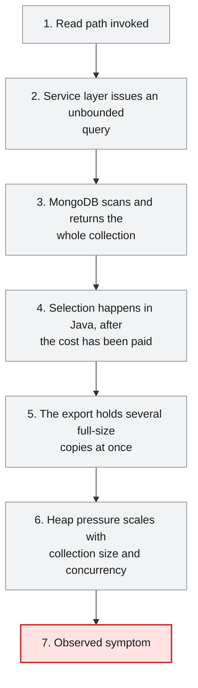
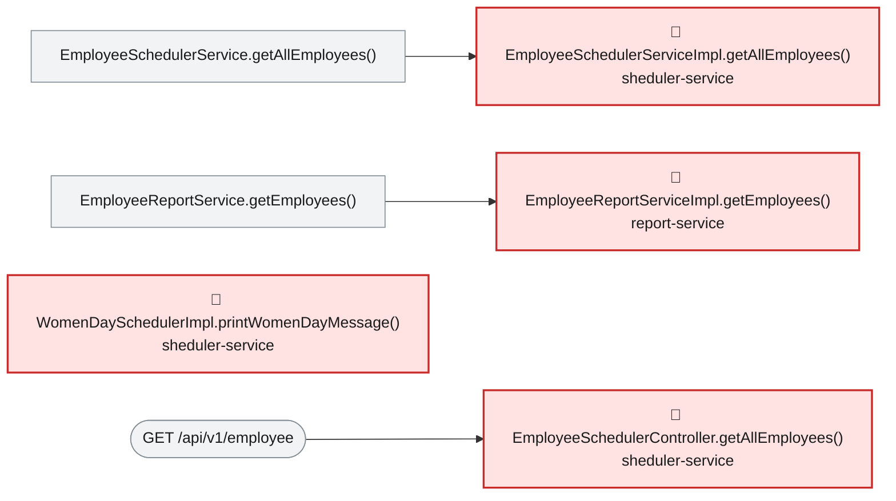

# Root Cause Analysis — ISSUE-002

## Unbounded repository findAll() reads whole collections into memory across multiple services

> Two services fetch every employee record at once instead of asking for a page, so the cost of a single request grows with the workforce until the service runs out of memory.

_Generated by the Root Cause Analyst agent on 2026-08-06. Evidence collected 2026-08-06T09:06:30.007Z._

## At a glance

| | |
|---|---|
| **What breaks** | `GET /api/v1/employee`, `GET /api/v1/export` |
| **Root cause** | The employee read path in both services is built on an unbounded whole-collection query as its only read primitive — no `Pageable`, `Sort`, `Limit` or criteria at the repository, and no pagination contract at the API boundary to impose one. |
| **Where** | `sheduler-service/src/main/java/com/aura/vihanga/shedulerservice/service/implementation/EmployeeSchedulerServiceImpl.java:18 (and the same defect at report-service/src/main/java/com/aura/vihanga/reportservice/service/implementation/EmployeeReportServiceImpl.java:40)` |
| **Service** | `sheduler-service`, `report-service` |
| **Severity** | High (Vulnerability) |
| **Confidence** | High |

Issue: [docs/issues/ISSUE-002-unbounded-findall-usage.md](../../docs/issues/ISSUE-002-unbounded-findall-usage.md) · Reported 2026-08-06 by Architecture review - performance and availability · Status Open

<details><summary>Technical summary</summary>

In both `sheduler-service` and `report-service` the only data-access operation on the employee read path is a bare `MongoRepository.findAll()`, so the size of every result set is decided by how large the `employee` collection has grown rather than by what the caller asked for. Both call sites sit directly behind public GET endpoints (`GET /api/v1/employee` and `GET /api/v1/export`), so a single unauthenticated request forces the service to materialise the entire collection in the heap. Because the query returns everything, all selection work is pushed into Java — the Women's Day job filters for `GenderType.FEMALE` on the fully loaded list, and the export joins employees against departments in a nested loop while also buffering the whole XLSX workbook in memory. Heap usage therefore scales with data volume times concurrency, and both endpoints degrade from apparently healthy on a dev dataset to `OutOfMemoryError` in production.

</details>

## 1. What was reported

**Call site 1 — `sheduler-service`**

- `GET /api/v1/employee` returns every employee document in the collection, serialised in full, with
  no page size, no limit parameter and no filtering. The entity is returned directly, so every
  persisted field is exposed to the caller.
- The scheduled job `WomenDaySchedulerImpl.printWomenDayMessage()` calls the same method and then
  filters for `GenderType.FEMALE` **in Java**, after the entire collection has already been
  transferred and mapped. The filter is never pushed down to the database.

**Call site 2 — `report-service`**

- `GET /api/v1/export` loads every employee via `findAll()`, then performs an outbound HTTP call to
  `department-service` for the department list, and then joins the two lists with a nested
  `for` loop (employees × departments) purely in memory.
- The complete joined result and the generated XLSX workbook are both held in the heap at the same
  time, and the workbook is buffered into a `ByteArrayOutputStream` before a single byte is written
  to the response.

Source: [docs/issues/ISSUE-002-unbounded-findall-usage.md](../../docs/issues/ISSUE-002-unbounded-findall-usage.md)

## 2. What should happen — and what happens instead

```mermaid
flowchart TB
  classDef broken fill:#ffe3e3,stroke:#c92a2a,stroke-width:2px,color:#1a1a1a
  classDef warn fill:#fff3bf,stroke:#e8590c,stroke-width:2px,color:#1a1a1a
  classDef ok fill:#e6fcf5,stroke:#2f9e44,stroke-width:1px,color:#1a1a1a
  classDef neutral fill:#f1f3f5,stroke:#868e96,stroke-width:1px,color:#1a1a1a
  subgraph EXPECTED["✅ What should happen"]
    direction LR
    E0["Request arrives with a<br/>page size"]:::ok
    E1["Repository returns one<br/>bounded page"]:::ok
    E0 --> E1
    E2["Only the matching rows are<br/>mapped"]:::ok
    E1 --> E2
    E3["Response stays a constant<br/>size"]:::ok
    E2 --> E3
  end
  subgraph ACTUAL["❌ What actually happens"]
    direction LR
    A0["Read path invoked"]:::neutral
    A1["Service layer issues an<br/>unbounded query"]:::neutral
    A0 --> A1
    A2["MongoDB scans and returns<br/>the whole collection"]:::neutral
    A1 --> A2
    A3["Selection happens in Java,<br/>after the cost has been<br/>paid"]:::neutral
    A2 --> A3
    A4["The export holds several<br/>full-size copies at once"]:::neutral
    A3 --> A4
    A5["Heap pressure scales with<br/>collection size and<br/>concurrency"]:::neutral
    A4 --> A5
    A6["Observed symptom"]:::broken
    A5 --> A6
  end
```



## 3. How it fails, step by step

1. **Read path invoked** — A caller hits `GET /api/v1/employee` or `GET /api/v1/export`, or the Women's Day cron fires in `sheduler-service` (scheduling is active — `@EnableScheduling` is on `ShedulerServiceApplication`).
2. **Service layer issues an unbounded query** — The service method's only data access is `findAll()` on a `MongoRepository`, with no `Pageable`, `Sort`, `Limit` or criteria argument to constrain it.
3. **MongoDB scans and returns the whole collection** — The driver performs an unfiltered collection scan and Spring Data materialises every `employee` document into a `List` on the heap before any application code executes.
4. **Selection happens in Java, after the cost has been paid** — The Women's Day job filters `GenderType.FEMALE` with a stream over the loaded list, and the export joins employees against the department list in a nested `for` loop — neither predicate is pushed down to the database.
5. **The export holds several full-size copies at once** — `getEmployees()` retains the employee list, the department list and the joined `EmployeeSalaryResponse` list simultaneously, and `generateExcelFile()` then buffers the entire XLSX workbook into a `ByteArrayOutputStream` before anything is written to the response stream.
6. **Heap pressure scales with collection size and concurrency** — Each concurrent request holds its own full copy, so GC activity rises sharply and response times degrade as the collection grows.
7. **Observed symptom** — The endpoints look healthy on a small dev dataset, then slow down and eventually fail with `OutOfMemoryError` or become unresponsive under production data volumes, while `GET /api/v1/employee` also returns the entire workforce dataset in one unpaginated response.



## 4. Where the defect is

> **The employee read path in both services is built on an unbounded whole-collection query as its only read primitive — no `Pageable`, `Sort`, `Limit` or criteria at the repository, and no pagination contract at the API boundary to impose one.**

**Location:** `sheduler-service/src/main/java/com/aura/vihanga/shedulerservice/service/implementation/EmployeeSchedulerServiceImpl.java:18 (and the same defect at report-service/src/main/java/com/aura/vihanga/reportservice/service/implementation/EmployeeReportServiceImpl.java:40)`



The evidence bundle resolves each focus method to a single repository call: `employeeSchedulerRepository.findAll()` at EmployeeSchedulerServiceImpl.java:18 and `employeeReportRepository.findAll()` at EmployeeReportServiceImpl.java:40. Both repositories are `MongoRepository` interfaces (`EmployeeSchedulerRepository extends MongoRepository<Employee, String>`, `EmployeeReportRepository extends MongoRepository<Employee, String>`), so `findAll()` is the inherited unfiltered collection scan; the bundle's collaborator tables record it as `inherited from a framework base type — no method node`, and neither call site passes an argument of any kind. Spring Data materialises the full `List` before any application code runs, so no downstream code can reduce what was transferred. The bundle's reaching paths show this is not an isolated helper but the shared read path of both services: `EmployeeSchedulerController.getAllEmployees()` (`GET /api/v1/employee`) and `WomenDaySchedulerImpl.printWomenDayMessage()` (the `@Scheduled` cron job) both reach `EmployeeSchedulerServiceImpl.getAllEmployees()`, and `EmployeeReportController.exportToExcel()` (`GET /api/v1/export`) reaches `EmployeeReportServiceImpl.getEmployees()`. Because the query is unbounded, selection has nowhere to live but the application layer, and the source confirms it: WomenDaySchedulerImpl.java:21-23 streams the already-transferred list and filters `employee.getGender() == GenderType.FEMALE` in Java, and EmployeeReportServiceImpl.java:53-68 joins employees against departments with a nested `for` loop, then EmployeeReportServiceImpl.java:93-95 writes the workbook into a `ByteArrayOutputStream` and returns the whole byte array before EmployeeReportController.java:35 writes a single byte to the response. A bounded alternative already exists and is unused: `EmployeeReportRepository` declares `findByDepartment(String)`, and a grep across `**/*.java` shows no call site anywhere in the workspace invokes it. `EmployeeSchedulerRepository` declares no query method at all. This is one design decision — an unbounded read as the only read primitive — reproduced at two call sites, not two independent defects.

**The code involved**

| Method | Service | File | Calls | Called by |
|---|---|---|---|---|
| `EmployeeSchedulerServiceImpl.getAllEmployees()` | `sheduler-service` | [EmployeeSchedulerServiceImpl.java:16-19](../../sheduler-service/src/main/java/com/aura/vihanga/shedulerservice/service/implementation/EmployeeSchedulerServiceImpl.java#L16-L19) | _none_ | `EmployeeSchedulerService.getAllEmployees()` |
| `EmployeeReportServiceImpl.getEmployees()` | `report-service` | [EmployeeReportServiceImpl.java:38-72](../../report-service/src/main/java/com/aura/vihanga/reportservice/service/implementation/EmployeeReportServiceImpl.java#L38-L72) | `DepartmentConfigUrl.getDepartmentUrl()` | `EmployeeReportService.getEmployees()` |
| `WomenDaySchedulerImpl.printWomenDayMessage()` | `sheduler-service` | [WomenDaySchedulerImpl.java:19-29](../../sheduler-service/src/main/java/com/aura/vihanga/shedulerservice/service/implementation/WomenDaySchedulerImpl.java#L19-L29) | `EmployeeSchedulerService.getAllEmployees()` | _entry point_ |
| `EmployeeSchedulerController.getAllEmployees()` | `sheduler-service` | [EmployeeSchedulerController.java:18-21](../../sheduler-service/src/main/java/com/aura/vihanga/shedulerservice/controller/EmployeeSchedulerController.java#L18-L21) | `EmployeeSchedulerService.getAllEmployees()` | _entry point_ |
| `EmployeeReportController.exportToExcel()` | `report-service` | [EmployeeReportController.java:25-39](../../report-service/src/main/java/com/aura/vihanga/reportservice/controller/EmployeeReportController.java#L25-L39) | `EmployeeReportService.getEmployees()`, `EmployeeReportService.generateExcelFile()` | _entry point_ |

<details><summary>Show the source of each method</summary>

**`EmployeeSchedulerServiceImpl.getAllEmployees()`** — `sheduler-service/src/main/java/com/aura/vihanga/shedulerservice/service/implementation/EmployeeSchedulerServiceImpl.java` lines 16-19

```java
@Override
    public List<Employee> getAllEmployees() {
        return employeeSchedulerRepository.findAll();
    }
```

Reaching paths:

- `EmployeeSchedulerController.getAllEmployees()` → `EmployeeSchedulerService.getAllEmployees()` → `EmployeeSchedulerServiceImpl.getAllEmployees()`
- `WomenDaySchedulerImpl.printWomenDayMessage()` → `EmployeeSchedulerService.getAllEmployees()` → `EmployeeSchedulerServiceImpl.getAllEmployees()`

**`EmployeeReportServiceImpl.getEmployees()`** — `report-service/src/main/java/com/aura/vihanga/reportservice/service/implementation/EmployeeReportServiceImpl.java` lines 38-72

```java
public List<EmployeeSalaryResponse> getEmployees() {
        log.info("Report Service");
        List<Employee> employeesList = employeeReportRepository.findAll();

//        List<String> employeeDepartmentId = employees.stream().map(employee -> employee.getDepartment()).toList();

        DepartmentResponse[] departmentResponses = builder.build().get()
                .uri(departmentConfigUrl.getDepartmentUrl(), 10000)
                .retrieve()
                .bodyToMono(DepartmentResponse[].class)
                .block();
        List<DepartmentResponse> departmentResponseList = Arrays.asList(departmentResponses);

        List<EmployeeSalaryResponse> employeeSalaryResponseList = new ArrayList<>();

        for (Employee employee : employeesList) {
            for (DepartmentResponse department : departmentResponseList) {
                if (employee.getDepartment().equals(department.getDepartmentId())) {
                    EmployeeSalaryResponse employeeSalaryResponse = EmployeeSalaryResponse.builder()
                            .employeeId(employee.getEmployeeId())
                            .name(employee.getName())
                            .departmentName(department.getDepartmentName())
                            .salary(department.getSalary())
                            .build();

                    log.info("employee Salary {}",employeeSalaryResponse);

                    employeeSalaryResponseList.add(employeeSalaryResponse);
                }
            }
        }

        return employeeSalaryResponseList;

    }
```

Reaching paths:

- `EmployeeReportController.exportToExcel()` → `EmployeeReportService.getEmployees()` → `EmployeeReportServiceImpl.getEmployees()`

**`WomenDaySchedulerImpl.printWomenDayMessage()`** — `sheduler-service/src/main/java/com/aura/vihanga/shedulerservice/service/implementation/WomenDaySchedulerImpl.java` lines 19-29

```java
@Scheduled(cron = "0 0 0 8 3 *")
    public void printWomenDayMessage() {
        List<Employee> womenEmployees = employeeSchedulerService.getAllEmployees().stream()
                .filter(employee -> employee.getGender() == GenderType.FEMALE)
                .collect(Collectors.toList());

        System.out.println("Happy Women's Day!");
        for (Employee employee : womenEmployees) {
            System.out.println("Employee Name: " + employee.getName());
        }
    }
```

**`EmployeeSchedulerController.getAllEmployees()`** — `sheduler-service/src/main/java/com/aura/vihanga/shedulerservice/controller/EmployeeSchedulerController.java` lines 18-21

```java
@GetMapping("employee")
    public List<Employee> getAllEmployees() {
        return schedulerService.getAllEmployees();
    }
```

**`EmployeeReportController.exportToExcel()`** — `report-service/src/main/java/com/aura/vihanga/reportservice/controller/EmployeeReportController.java` lines 25-39

```java
@GetMapping("export")
    public void exportToExcel(HttpServletResponse response) throws IOException {
        List<EmployeeSalaryResponse> employeeSalaryResponseList = reportService.getEmployees();

//        List<Employee> employees = new ArrayList<>();
//
        byte[] excelBytes = reportService.generateExcelFile(employeeSalaryResponseList);

        response.setContentType("application/vnd.openxmlformats-officedocument.spreadsheetml.sheet");
        response.setHeader("Content-Disposition", "attachment; filename=employees.xlsx");
        response.getOutputStream().write(excelBytes);
        response.getOutputStream().flush();

        log.info("Report Controller");
    }
```

</details>

## 5. What it means

The size of every employee read is decided by how large the collection has grown rather than by what the caller asked for, so heap consumption on the two affected services is proportional to data volume multiplied by concurrent callers. That makes this an availability defect rather than a performance annoyance: ordinary, well-formed, repeated requests to the two read endpoints are enough to exhaust a service's heap, and no authentication exists anywhere in the application code to gate who can send them. `report-service` carries the heavier per-request cost, because a single export holds the employee list, the department list, the joined result and the fully buffered XLSX workbook at the same time, while blocking the request thread on an outbound department lookup. Both services also issue full collection scans against the shared MongoDB instance on every call, so the cost is not confined to the calling service's own heap. Separately from availability, the scheduler read endpoint serialises the `Employee` entity exactly as persisted — including `phoneNo` and `address` (Employee.java:22-23) — so fields no client asked for are returned in a single unpaginated response. On a development-sized collection none of this is visible: the endpoints look healthy and degrade only as data grows, which is why the defect survived review.

**Why High severity:** High is correct. Two publicly reachable endpoints can each be driven to exhaust a service's heap with ordinary, well-formed requests and no special privileges, which is an availability defect rather than a mere performance concern, and the unpaginated entity response adds an over-exposure dimension. It stops short of Critical because nothing is currently broken or corrupted — the endpoints function correctly at present data volumes, the failure requires the collection to have grown or the caller to repeat requests, and the fix is additive rather than a redesign.

## 6. Why it happened

- There is no pagination convention anywhere in the system to copy — no endpoint in the REST surface documented in `docs/architecture.md` accepts a `page` or `size` parameter, so an unbounded read is the local norm rather than an outlier.
- `EmployeeSchedulerController.getAllEmployees()` returns the `Employee` entity directly instead of a DTO, so there is no projection boundary at which a field or row limit would naturally be imposed.
- `EmployeeReportRepository.findByDepartment(String)` shows the team knows how to write a derived query, but nothing calls it — the bounded primitive exists and was not adopted on the read path.
- The `@Scheduled` job reuses the service method built for the REST endpoint, so a single unbounded read serves two callers with different needs and neither can constrain it.
- No load or volume test exists for either endpoint; the defect is invisible on a small development dataset and only appears as data grows.
- No authentication is configured anywhere in the workspace — no `spring-boot-starter-security` dependency and no `SecurityFilterChain`/`WebSecurity` configuration — so nothing rate-limits or gates who can trigger the unbounded read.

## 7. How to fix it

Make bounded reads the only read primitive available on this path, rather than trying to contain the symptom downstream. Replace each `findAll()` with a query whose result size is set by the caller or by the predicate, not by the collection: accept `Pageable` on the REST read path and return `Page<EmployeeResponse>`; express the Women's Day selection as a derived query (`findByGender(GenderType)`) so MongoDB returns only matching documents instead of the job filtering in Java; and for the export, page or stream through the collection so heap usage stays flat regardless of record count. Two secondary changes in `report-service` remove the amplifiers that make the unbounded read worse: index the department list into a `Map<String, DepartmentResponse>` keyed by department id so the join is linear rather than employees x departments, and write the workbook to the servlet output stream (with `SXSSFWorkbook` for streaming rows) instead of buffering the whole file into a `ByteArrayOutputStream` first. Finally, project `Employee` into a DTO at `GET /api/v1/employee` instead of returning the entity, so `phoneNo` and `address` are not emitted to every caller.

| File | Change |
|---|---|
| [EmployeeSchedulerRepository.java](../../sheduler-service/src/main/java/com/aura/vihanga/shedulerservice/repository/EmployeeSchedulerRepository.java) | Add the bounded query methods the read path needs: `Page<Employee> findAll(Pageable pageable)` (inherited, just use it) and a derived `List<Employee> findByGender(GenderType gender)` for the Women's Day job. |
| [EmployeeSchedulerService.java](../../sheduler-service/src/main/java/com/aura/vihanga/shedulerservice/service/EmployeeSchedulerService.java) | Change `getAllEmployees()` to accept a `Pageable` and return `Page<Employee>`, and add a `getFemaleEmployees()` method for the scheduled job so the two callers no longer share one unbounded read. |
| [EmployeeSchedulerServiceImpl.java](../../sheduler-service/src/main/java/com/aura/vihanga/shedulerservice/service/implementation/EmployeeSchedulerServiceImpl.java) | Replace the bare `employeeSchedulerRepository.findAll()` at line 18 with `employeeSchedulerRepository.findAll(pageable)`, and implement the gender lookup as `employeeSchedulerRepository.findByGender(GenderType.FEMALE)`. |
| [EmployeeSchedulerController.java](../../sheduler-service/src/main/java/com/aura/vihanga/shedulerservice/controller/EmployeeSchedulerController.java) | Accept a `Pageable` on `GET /api/v1/employee` with a capped default page size, and return a page of an `EmployeeResponse` DTO rather than the `Employee` entity. |
| [WomenDaySchedulerImpl.java](../../sheduler-service/src/main/java/com/aura/vihanga/shedulerservice/service/implementation/WomenDaySchedulerImpl.java) | Call the new gender-filtered service method instead of loading every employee and filtering `GenderType.FEMALE` with a Java stream at lines 21-23. |
| [EmployeeReportServiceImpl.java](../../report-service/src/main/java/com/aura/vihanga/reportservice/service/implementation/EmployeeReportServiceImpl.java) | Replace the bare `employeeReportRepository.findAll()` at line 40 with a paged or streamed read processed in chunks; index `departmentResponseList` into a `Map<String, DepartmentResponse>` keyed by department id so the nested loop at lines 53-68 becomes a single pass; and in `generateExcelFile` write rows to the response stream via `SXSSFWorkbook` instead of buffering the workbook into a `ByteArrayOutputStream` (lines 93-95). |
| [EmployeeReportController.java](../../report-service/src/main/java/com/aura/vihanga/reportservice/controller/EmployeeReportController.java) | Have the export write incrementally to `response.getOutputStream()` as chunks are produced, rather than receiving a fully materialised `byte[]` from the service. |

<details><summary>Sketch of the change</summary>

```java
// Illustrative only — not an applied patch.

// sheduler-service — bound the REST read
public interface EmployeeSchedulerRepository extends MongoRepository<Employee, String> {
    List<Employee> findByGender(GenderType gender);
}

@GetMapping("employee")
public Page<EmployeeResponse> getAllEmployees(@PageableDefault(size = 50) Pageable pageable) {
    return schedulerService.getAllEmployees(pageable).map(EmployeeResponse::from);
}

// sheduler-service — push the Women's Day filter into the query
List<Employee> womenEmployees = employeeSchedulerRepository.findByGender(GenderType.FEMALE);

// report-service — index the join instead of nesting the loops
Map<String, DepartmentResponse> departmentsById = departmentResponseList.stream()
        .collect(Collectors.toMap(DepartmentResponse::getDepartmentId, d -> d));
for (Employee employee : employeePage.getContent()) {
    DepartmentResponse department = departmentsById.get(employee.getDepartment());
    if (department != null) { /* build EmployeeSalaryResponse */ }
}
```

</details>

## 8. How to check the fix worked

1. Seed the `employee` collection with a large dataset (the issue suggests 500,000 documents) and confirm `GET /api/v1/employee` returns only the requested page — assert the response element count equals the page size and that the payload no longer contains `phoneNo` or `address`.
2. Run `GET /api/v1/export` against the same dataset with a constrained heap (for example `-Xmx256m`) and confirm it completes without `OutOfMemoryError`; before the fix the same run should fail, which makes this a regression test rather than a smoke test.
3. Profile peak heap for `GET /api/v1/export` at two very different collection sizes and confirm the peak is roughly flat between them — that is the property proving the read is bounded, not merely faster.
4. Enable MongoDB query logging (or a `CommandListener`) and assert the Women's Day job issues a query with a `gender` filter and returns only `FEMALE` documents, rather than an unfiltered scan followed by a Java-side filter.
5. Add a repository test asserting the paged read returns at most the requested page size, and a controller slice test asserting the endpoint rejects or caps an oversized `size` parameter.
6. Grep `**/src/main/java/**/*.java` and confirm no argument-less `findAll()` call remains on either read path.
7. Run several concurrent export requests and confirm response times stay bounded and GC activity stays flat, instead of degrading as the issue's step 5 describes.

## 9. How to stop it happening again

- Add an ArchUnit test or a static analysis rule that fails the build on any argument-less `findAll()` call in `src/main/java`, so the pattern cannot be reintroduced or copied into a new service.
- Establish a pagination convention for collection-returning endpoints — a `Pageable` parameter with a capped default and maximum page size — and apply it across the REST surface documented in `docs/architecture.md`.
- Require that controllers return DTOs rather than persistence entities, so field exposure is an explicit decision instead of a side effect of the entity shape.
- Add a volume or load test stage to CI that runs the read-heavy endpoints against a realistic dataset with a constrained heap, since these defects are invisible on a dev-sized collection.
- Push filtering predicates into derived queries or `@Query` as a review checklist item whenever a stream filter follows a repository read.

## 10. Open questions

- `report-service/src/main/java/com/aura/vihanga/reportservice/repository/EmployeeReportRepository.java:9` declares `List<Employee> findByDepartment(String department)` but the file has no `import java.util.List`, so it does not compile as committed — confirmed in the build output, where `report-service/target/classes/.../EmployeeReportRepository.class` disassembles to a `java.lang.Error("Unresolved compilation problem: List cannot be resolved to a type")` stub. That is a separate defect from the unbounded read diagnosed here and is reported back rather than folded into this analysis; it does mean the fix for this issue cannot be verified in `report-service` until the module builds.
- The bundle contains no production collection size, document size or JVM heap setting, so the point at which these endpoints actually fail cannot be computed from static evidence — the `OutOfMemoryError` in the issue is a projection from the access pattern, not a measured threshold.
- The evidence does not show whether `GET /api/v1/employee` and `GET /api/v1/export` are exposed publicly or only within a private network. No authentication exists in the application code (no security starter, no `SecurityFilterChain`), but any gateway or network-level control in front of the services is outside the workspace and would change how easily the availability impact can be triggered.
- It is unclear whether `EmployeeReportRepository.findByDepartment(String)` is dead code or was written for an intended department-scoped export that was never wired up; that would affect whether the export should be paged or scoped by department.

## Appendix — how this was determined

| Input | Detail |
|---|---|
| Issue report | [docs/issues/ISSUE-002-unbounded-findall-usage.md](../../docs/issues/ISSUE-002-unbounded-findall-usage.md) |
| Architecture document | [docs/architecture.md](../../docs/architecture.md) |
| Function reference | [docs/function-reference.md](../../docs/function-reference.md) |
| Code scan | `.architect/artifacts.json` (generated 2026-08-06T03:44:10.863Z) |
| Knowledge graph | Neo4j, traversal depth 4 |

<details><summary>Architecture observations considered</summary>

- Each service (`department-service`, `employee-service`, `report-service`, `sheduler-service`) follows the same layered convention: `controller` → `service` → `repository` → `model`/`entity`, backed by MongoDB repositories.
- `configuaration-server` and `discovery-service` are infrastructure services (Spring Cloud Config + Eureka) that every business service depends on at startup via `bootstrap.properties`.
- No Feign clients were detected — cross-service calls, if any, likely go through `RestTemplate`/`WebClient` rather than declarative Feign interfaces. Worth confirming if service-to-service coupling should show up as graph edges.
- The generated Neo4j graph can be queried directly (e.g. `MATCH (m:Module)-[:CONTAINS]->(t:Type) RETURN m.name, count(t)`) for deeper, ad-hoc architecture questions beyond this static document.

</details>

<details><summary>Graph queries executed</summary>

**upstream callers**

```cypher
MATCH path = (caller:Method)-[:CALLS*1..4]->(target:Method {id: $id})
         RETURN [n IN nodes(path) | n.id] AS chain LIMIT 200
```

**downstream callees**

```cypher
MATCH path = (target:Method {id: $id})-[:CALLS*1..4]->(callee:Method)
         RETURN [n IN nodes(path) | n.id] AS chain LIMIT 200
```

**owning type, module and exposed endpoints**

```cypher
MATCH (ty:Type)-[:HAS_METHOD]->(m:Method {id: $id})
         OPTIONAL MATCH (ty)-[:EXPOSES]->(e:Endpoint)
         RETURN ty.id AS typeId, ty.name AS typeName, ty.module AS module,
                collect(DISTINCT e.id) AS endpoints
```

**types depending on the owning type**

```cypher
MATCH (other:Type)-[:USES]->(ty:Type)-[:HAS_METHOD]->(:Method {id: $id})
         RETURN DISTINCT other.id AS typeId, other.name AS name, other.module AS module
```

**modules reaching the focus method**

```cypher
MATCH (caller:Method)-[:CALLS*1..4]->(:Method {id: $id})
         MATCH (ct:Type)-[:HAS_METHOD]->(caller)
         RETURN DISTINCT ct.module AS module
```

**graph node counts**

```cypher
MATCH (n) RETURN labels(n)[0] AS label, count(*) AS count ORDER BY count DESC
```

**graph relationship counts**

```cypher
MATCH ()-[r]->() RETURN type(r) AS type, count(*) AS count ORDER BY count DESC
```

**maven dependencies of affected modules**

```cypher
MATCH (m:Module)-[:DEPENDS_ON]->(dep:MavenDependency)
       WHERE m.name IN $modules
       RETURN m.name AS module, collect(dep.ga) AS dependencies
```

</details>

---

The reported symptom, the code table, the source and the call paths are rendered verbatim from the issue, the code scan and the knowledge graph. The plain-language summary, the causal chain, the root cause, what it means, why it happened, the fix, the verification steps and the prevention measures are the judgement of the Root Cause Analyst agent.
