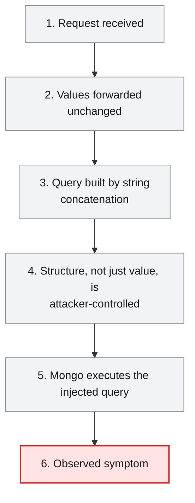
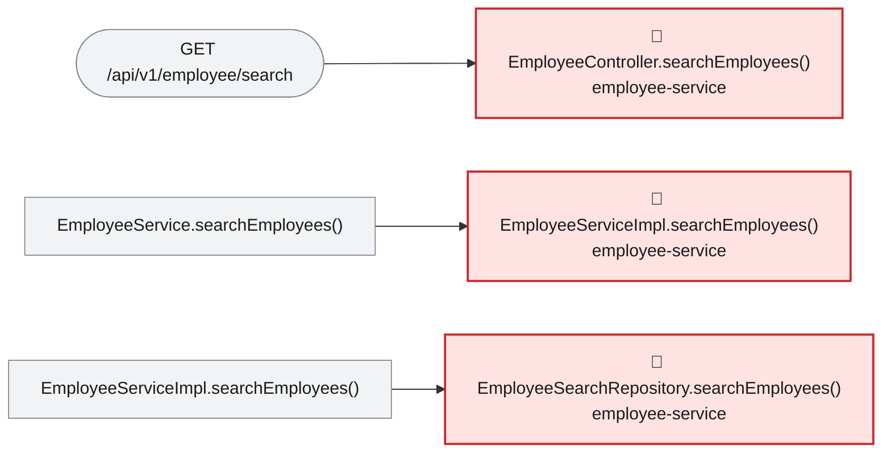

# Root Cause Analysis — ISSUE-003

## MongoDB (NoSQL) injection in the employee search endpoint via string-concatenated BasicQuery

> The employee search feature builds its database query by pasting the caller's search text directly into the query itself, so a caller can rewrite what the search actually does instead of just what it searches for.

_Generated by the Root Cause Analyst agent on 2026-08-14. Evidence collected 2026-08-14T21:20:56.802Z._

## At a glance

| | |
|---|---|
| **What breaks** | `GET /api/v1/employee/search` |
| **Root cause** | EmployeeSearchRepository.searchEmployees builds its MongoDB filter by string-concatenating unescaped request parameters into a BasicQuery instead of binding them as Criteria values. |
| **Where** | `employee-service/src/main/java/com/aura/vihanga/employeeservice/repository/EmployeeSearchRepository.java:19-32` |
| **Service** | `employee-service` |
| **Severity** | Critical (Vulnerability) |
| **Confidence** | High |

Issue: [docs/issues/ISSUE-003-nosql-injection-employee-search.md](../../docs/issues/ISSUE-003-nosql-injection-employee-search.md) · Reported 2026-08-09 by Security review - injection · Status Open

<details><summary>Technical summary</summary>

EmployeeSearchRepository.searchEmployees builds a MongoDB filter by concatenating the untrusted 'name' and 'department' request parameters into a JSON query string with a StringBuilder, then executes that string via BasicQuery. Because the caller's value is spliced directly into query syntax rather than bound as a parameter, a value containing MongoDB operator syntax (e.g. closing the intended $regex clause and injecting $ne) is interpreted as query structure, not as a literal search term. The defect is at the sink; the controller and service layer are innocent conduits that pass both parameters through unchanged.

</details>

## 1. What was reported

Because the value is placed inside a single-quoted JSON string that the caller can break out of, the
injected payload closes the intended `$regex` clause and appends attacker-chosen query operators.

**Benign request** — filter becomes `{ 'name': { $regex: 'Ann' } }`:
```
GET /api/v1/employee/search?name=Ann
```

**Injection — return every employee regardless of name.** Supplying a `name` that closes the
`$regex` object and injects an always-true operator turns the filter into one that matches all
documents:
```
GET /api/v1/employee/search?name=x' } }, { 'name': { $ne: '
```
The resulting filter string is
`{ 'name': { $regex: 'x' } }, { 'name': { $ne: '' } }`, i.e. the `$regex` constraint is neutralised
and the query returns the full collection.

**Injection — operator abuse via the `department` field.** The `department` value is interpolated as
a bare JSON value, so an operator document can be injected directly:
```
GET /api/v1/employee/search?name=x&department=' }, 'name': { $ne: '
```

**Injection — server-side JavaScript evaluation.** If `$where`/JavaScript execution is enabled on the
MongoDB deployment, a `$where` clause injected through the same hole runs arbitrary JavaScript in the
database engine, which can be used for boolean/time-based blind extraction and resource exhaustion.

**Reproducibility:** Deterministic. The endpoint is unauthenticated (see
[ISSUE-003](./ISSUE-003-unauthenticated-pii-exposure.md)), so no credentials are needed to reach the
sink.

Source: [docs/issues/ISSUE-003-nosql-injection-employee-search.md](../../docs/issues/ISSUE-003-nosql-injection-employee-search.md)

## 2. What should happen — and what happens instead

```mermaid
flowchart TB
  classDef broken fill:#ffe3e3,stroke:#c92a2a,stroke-width:2px,color:#1a1a1a
  classDef warn fill:#fff3bf,stroke:#e8590c,stroke-width:2px,color:#1a1a1a
  classDef ok fill:#e6fcf5,stroke:#2f9e44,stroke-width:1px,color:#1a1a1a
  classDef neutral fill:#f1f3f5,stroke:#868e96,stroke-width:1px,color:#1a1a1a
  subgraph EXPECTED["✅ What should happen"]
    direction LR
    E0["Client sends<br/>name/department as request<br/>params"]:::ok
    E1["Repository binds them as<br/>Criteria values"]:::ok
    E0 --> E1
    E2["Mongo executes the query<br/>with values only, never<br/>structure"]:::ok
    E1 --> E2
    E3["Only genuinely matching<br/>employees are returned"]:::ok
    E2 --> E3
  end
  subgraph ACTUAL["❌ What actually happens"]
    direction LR
    A0["Request received"]:::neutral
    A1["Values forwarded unchanged"]:::neutral
    A0 --> A1
    A2["Query built by string<br/>concatenation"]:::neutral
    A1 --> A2
    A3["Structure, not just value,<br/>is attacker-controlled"]:::neutral
    A2 --> A3
    A4["Mongo executes the<br/>injected query"]:::neutral
    A3 --> A4
    A5["Observed symptom"]:::broken
    A4 --> A5
  end
```



## 3. How it fails, step by step

1. **Request received** — GET /api/v1/employee/search?name=...&department=... reaches EmployeeController.searchEmployees with no authentication or input validation.
2. **Values forwarded unchanged** — EmployeeServiceImpl.searchEmployees passes name and department straight to EmployeeSearchRepository.searchEmployees.
3. **Query built by string concatenation** — EmployeeSearchRepository.searchEmployees appends the raw values into a JSON filter string via StringBuilder.
4. **Structure, not just value, is attacker-controlled** — A value containing e.g. "' } }, { 'name': { $ne: '" closes the intended $regex object and injects a new always-true clause.
5. **Mongo executes the injected query** — BasicQuery hands the resulting string to MongoTemplate.find as literal query syntax, with no parameter boundary between value and structure.
6. **Observed symptom** — The endpoint returns the full employee collection (or other attacker-chosen results) regardless of the intended name/department filter.



## 4. Where the defect is

> **EmployeeSearchRepository.searchEmployees builds its MongoDB filter by string-concatenating unescaped request parameters into a BasicQuery instead of binding them as Criteria values.**

**Location:** `employee-service/src/main/java/com/aura/vihanga/employeeservice/repository/EmployeeSearchRepository.java:19-32`



The evidence bundle's source excerpt for EmployeeSearchRepository.searchEmployees shows the filter built with `new StringBuilder("{ ")` followed by `.append("'name': { $regex: '").append(name)` and passed to `new BasicQuery(filter.toString())`. Neither this method nor its only caller, EmployeeServiceImpl.searchEmployees (which forwards `name`/`department` unchanged, per its source in the bundle), nor the entry point EmployeeController.searchEmployees (which reads them straight from @RequestParam with no @Valid or allow-list) apply any escaping, quoting or parameter binding. The reaching path recorded in the bundle — EmployeeController -> EmployeeService -> EmployeeServiceImpl -> EmployeeSearchRepository — has exactly one sink and no intermediate validation, so the defect is fully explained by this one method.

**The code involved**

| Method | Service | File | Calls | Called by |
|---|---|---|---|---|
| `EmployeeController.searchEmployees()` | `employee-service` | [EmployeeController.java:50-59](../../employee-service/src/main/java/com/aura/vihanga/employeeservice/controller/EmployeeController.java#L50-L59) | `EmployeeService.searchEmployees()` | _entry point_ |
| `EmployeeServiceImpl.searchEmployees()` | `employee-service` | [EmployeeServiceImpl.java:108-122](../../employee-service/src/main/java/com/aura/vihanga/employeeservice/service/implementation/EmployeeServiceImpl.java#L108-L122) | `EmployeeSearchRepository.searchEmployees()` | `EmployeeService.searchEmployees()` |
| `EmployeeSearchRepository.searchEmployees()` | `employee-service` | [EmployeeSearchRepository.java:19-32](../../employee-service/src/main/java/com/aura/vihanga/employeeservice/repository/EmployeeSearchRepository.java#L19-L32) | _none_ | `EmployeeServiceImpl.searchEmployees()` |

<details><summary>Show the source of each method</summary>

**`EmployeeController.searchEmployees()`** — `employee-service/src/main/java/com/aura/vihanga/employeeservice/controller/EmployeeController.java` lines 50-59

```java
@GetMapping("employee/search")
    public ResponseEntity<StandardResponse> searchEmployees(@RequestParam("name") String name,
                                                            @RequestParam(value = "department", required = false) String department) {
        log.trace("EmployeeController - searchEmployees - name {} department {}", name, department);
        List<EmployeeResponse> employeeResponses = employeeService.searchEmployees(name, department);

        return new ResponseEntity<StandardResponse>(
                new StandardResponse(200, "Employee Search Completed Successfully", employeeResponses), HttpStatus.OK
        );
    }
```

**`EmployeeServiceImpl.searchEmployees()`** — `employee-service/src/main/java/com/aura/vihanga/employeeservice/service/implementation/EmployeeServiceImpl.java` lines 108-122

```java
@Override
    public List<EmployeeResponse> searchEmployees(String name, String department) {
        log.trace("EmployeeServiceImpl - searchEmployees - name {} department {}", name, department);
        List<Employee> employees = employeeSearchRepository.searchEmployees(name, department);

        return employees.stream().map(employee -> EmployeeResponse.builder()
                .employeeId(employee.getEmployeeId())
                .name(employee.getName())
                .department(employee.getDepartment())
                .phoneNo(employee.getPhoneNo())
                .address(employee.getAddress())
                .gender(employee.getGender())
                .employeeType(employee.getEmployeeType())
                .build()).collect(Collectors.toList());
    }
```

Reaching paths:

- `EmployeeController.searchEmployees()` → `EmployeeService.searchEmployees()` → `EmployeeServiceImpl.searchEmployees()`

**`EmployeeSearchRepository.searchEmployees()`** — `employee-service/src/main/java/com/aura/vihanga/employeeservice/repository/EmployeeSearchRepository.java` lines 19-32

```java
public List<Employee> searchEmployees(String name, String department) {
        StringBuilder filter = new StringBuilder("{ ");
        filter.append("'name': { $regex: '").append(name).append("' }");

        if (department != null && !department.isEmpty()) {
            filter.append(", 'department': '").append(department).append("'");
        }

        filter.append(" }");

        log.info("EmployeeSearchRepository - searchEmployees - filter {}", filter);

        return mongoTemplate.find(new BasicQuery(filter.toString()), Employee.class);
    }
```

Reaching paths:

- `EmployeeController.searchEmployees()` → `EmployeeService.searchEmployees()` → `EmployeeServiceImpl.searchEmployees()` → `EmployeeSearchRepository.searchEmployees()`

</details>

## 5. What it means

Any unauthenticated caller of GET /api/v1/employee/search can bypass the intended name/department filter and retrieve the entire employee collection, or use injected operators for blind extraction — the affected area recorded in the evidence bundle is exactly one endpoint in employee-service, with report-service as a confirmed HTTP consumer of the employee service but not of this specific endpoint.

**Why Critical severity:** Critical is correct: the query construction flaw is deterministic and reachable with no authentication, and it operates over PII (name, department, and via the wider Employee document, payroll-adjacent fields) as described in the issue's Impact section.

## 6. Why it happened

- No bean validation (@Valid / allow-list) at the controller boundary, so query-syntax characters reach the sink unfiltered.
- No test in the module exercises this endpoint with adversarial input — the evidence bundle shows no test call edges reaching EmployeeSearchRepository.
- Spring Data MongoDB's Criteria API and derived query methods (the parameterised alternative) are already used correctly elsewhere in the same module's repository layer conventions, so this method is the outlier, not a stack-wide gap.

## 7. How to fix it

Replace the StringBuilder/BasicQuery construction with a parameterised Criteria query (Criteria.where("name").regex(Pattern.quote(name)) optionally chained with .and("department").is(department)), which binds both values instead of splicing them into query syntax, closing the root cause rather than only the specific payload shapes shown in the issue.

| File | Change |
|---|---|
| [EmployeeSearchRepository.java](../../employee-service/src/main/java/com/aura/vihanga/employeeservice/repository/EmployeeSearchRepository.java) | Replace the StringBuilder-built BasicQuery with a Query wrapping a Criteria chain, using Pattern.quote(name) for the literal substring match. |

<details><summary>Sketch of the change</summary>

```java
Criteria criteria = Criteria.where("name").regex(Pattern.quote(name));
if (department != null && !department.isEmpty()) {
    criteria = criteria.and("department").is(department);
}
return mongoTemplate.find(new Query(criteria), Employee.class);
```

</details>

## 8. How to check the fix worked

1. Compile employee-service after the change.
2. Replay GET /api/v1/employee/search?name=Ann against a seeded collection and confirm the same matching results as before.
3. Replay the issue's injection payload (name=x' } }, { 'name': { $ne: ') and confirm the response no longer returns the full collection.

## 9. How to stop it happening again

- Add a slice test asserting EmployeeSearchRepository.searchEmployees treats MongoDB operator characters in the input as literal text, not query structure.
- Add a SAST rule flagging `new BasicQuery(<StringBuilder/concatenation>)` across the workspace, per the issue's own Detection Notes.

## Appendix — how this was determined

| Input | Detail |
|---|---|
| Issue report | [docs/issues/ISSUE-003-nosql-injection-employee-search.md](../../docs/issues/ISSUE-003-nosql-injection-employee-search.md) |
| Architecture document | [docs/architecture.md](../../docs/architecture.md) |
| Function reference | [docs/function-reference.md](../../docs/function-reference.md) |
| Code scan | `.architect/artifacts.json` (generated 2026-08-14T21:20:15.879Z) |
| Knowledge graph | not used — skipped via --no-graph |

<details><summary>Architecture observations considered</summary>

- Each service (`department-service`, `employee-service`, `report-service`, `sheduler-service`) follows the same layered convention: `controller` → `service` → `repository` → `model`/`entity`, backed by MongoDB repositories.
- `configuaration-server` and `discovery-service` are infrastructure services (Spring Cloud Config + Eureka) that every business service depends on at startup via `bootstrap.properties`.
- No Feign clients were detected — cross-service calls, if any, likely go through `RestTemplate`/`WebClient` rather than declarative Feign interfaces. Worth confirming if service-to-service coupling should show up as graph edges.
- The generated Neo4j graph can be queried directly (e.g. `MATCH (m:Module)-[:CONTAINS]->(t:Type) RETURN m.name, count(t)`) for deeper, ad-hoc architecture questions beyond this static document.

</details>

_No Cypher was run: skipped via --no-graph_ Call-graph facts came from the code scan, using the same resolution rules Graph Forge applies when it builds the graph.

---

The reported symptom, the code table, the source and the call paths are rendered verbatim from the issue, the code scan and the knowledge graph. The plain-language summary, the causal chain, the root cause, what it means, why it happened, the fix, the verification steps and the prevention measures are the judgement of the Root Cause Analyst agent.
